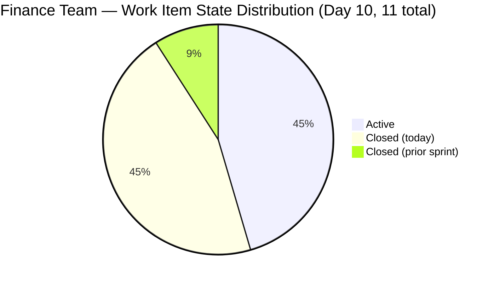
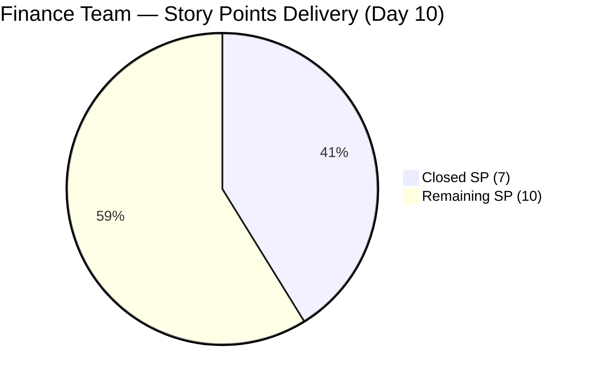
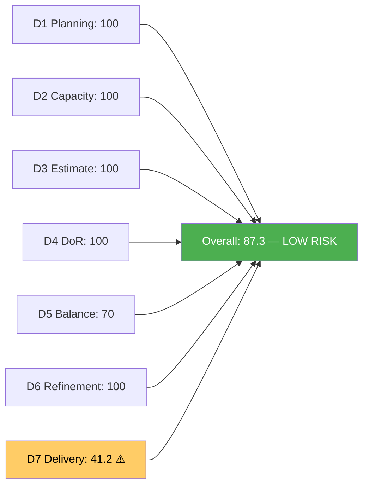
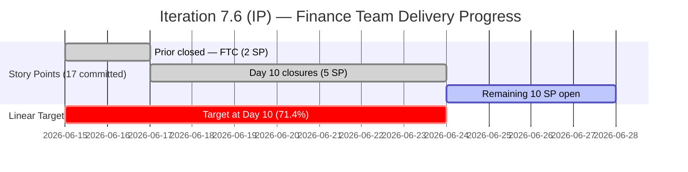
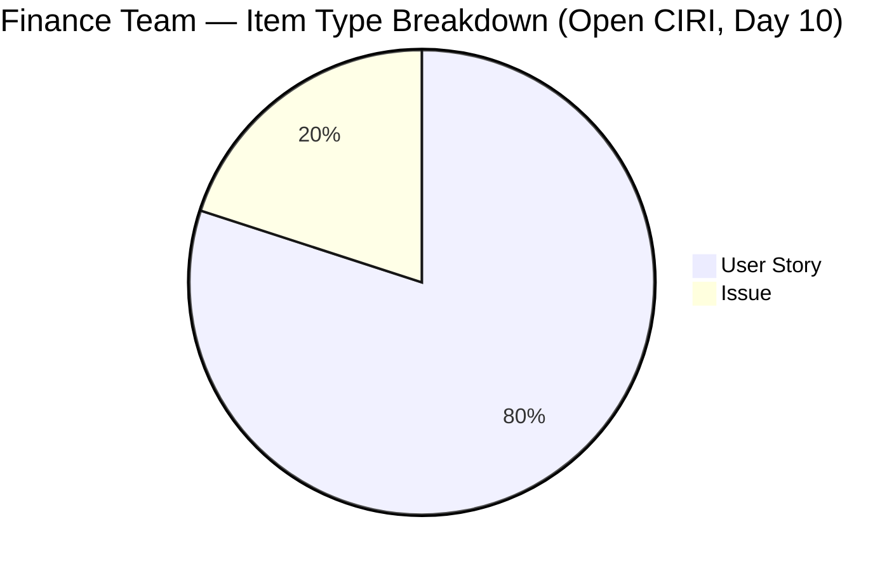

# ADO SAFe Audit — Finance Team

## 1. Audit Metadata

| Field | Value |
|-------|-------|
| **Audit Date** | 2026-06-24 (Wednesday) — Day 10 of 14 |
| **Timezone** | CDT (audit date) / PHT (team local) |
| **Iteration** | Iteration 7.6 (IP) |
| **Iteration Dates** | 2026-06-15 to 2026-06-28 |
| **Sprint Day** | Day 10 — Post-Midpoint, 4 working days remaining |
| **ADO Project** | Jairosoft FINOPS |
| **ADO Project ID** | e0bb302f-40f9-46c3-8164-6f1acb317d63 |
| **ADO Team** | Finance Team |
| **ADO Team ID** | 1f4b45fa-82e8-4a36-aedc-6c1bc8f51070 |
| **Iteration ID** | bebf6f83-a342-42a2-bad7-a16951231732 |
| **Workspace** | `ado_fin` |
| **Prior Audit** | AUDIT_20260623_0900.md (Day 9, Iteration 7.6 IP, 80.5 — Moderate Risk) |
| **Overall Score** | **87.3 / 100** |
| **Risk Band** | **Low Risk** |

---

## 2. Executive Summary

The Finance Team breaks into **Low Risk territory at 87.3 / 100** on Day 10 of Iteration 7.6 (IP) — a gain of **+6.8 points** from yesterday's 80.5. The breakthrough is driven by a burst of five closures today (June 24): **206926 (GH Invoice, 2SP)**, **206925 (SSI Invoice, 1SP)**, **206923 (AA Invoice, 0SP)**, **206922 (SOW Apple, 2SP)**, and **206777 (SSS/WISP Spike, 0SP)**. Grace delivered on all recommendations from Day 9. D7 (Delivery Predictability) jumps from 11.8% to 41.2%, D3 (Estimation) rises to 100.0 as the two 0-SP items have now been closed and exit the scoring pool, and D6 (Backlog Refinement) remains perfect.

Four items remain in the active backlog: 206924 (Apple Invoice, 2SP, Active), 204502 (Ledger Reconciliation, 2SP, Active), 204507 (P&L Dashboards, 2SP, Active), and 204512 (Final UAT, 2SP, Active), plus 205874 (GCash Testing, 2SP, Active). Closing all five in the next 4 days would raise D7 to 82.4% and push the overall score to approximately 94.9. This is an excellent position 4 days before sprint close.

---

## 3. Previous Audit Delta

**Prior audit:** AUDIT_20260623_0900.md — Day 9, Score 80.5 / 100 (Moderate Risk)

| Dimension | Day 9 | Day 10 | Delta | Driver |
|-----------|-------|--------|-------|--------|
| D1 Iteration Planning | 100.0 | **100.0** | 0.0 | VRBI=5, CIRI=5; all backlog items in 7.6 IP |
| D2 Team Capacity | 100.0 | **100.0** | 0.0 | Grace: 2hr/day, 0 days off — unchanged |
| D3 Estimation | 81.8 | **100.0** | **+18.2** | 206923 (SP=0) and 206777 (SP=0) closed → exit CIRI; all 5 remaining CIRI estimated |
| D4 DoR Compliance | 100.0 | **100.0** | 0.0 | All 5 open CIRI items DoR compliant |
| D5 Work Item Balance | 70.0 | **70.0** | 0.0 | US=4/5=80% → dominant >60% → -30 |
| D6 Backlog Refinement | 100.0 | **100.0** | 0.0 | All 5 remaining CIRI items touched Jun 16–23; 0 stale; 0 untouched |
| D7 Delivery Predictability | 11.8 | **41.2** | **+29.4** | 5 new closures today: 206926(2)+206925(1)+206922(2)+206584(prior)+= 7SP closed / 17SP committed |
| **Overall** | **80.5** | **87.3** | **+6.8** | Major delivery burst; D3 full recovery; D7 leap |

**Significant changes since Day 9 (June 24 closures):**
- **206926 (GH Invoice Payment Reminder, 2SP)** — Closed Jun 24 05:38. Was Ready.
- **206923 (AA Invoice Payment, Issue, 0SP)** — Closed Jun 24 05:48. Was Active. SP=0 — exits estimation pool entirely.
- **206922 (SOW My Nurture Collective, 2SP)** — Closed Jun 24 05:55. Was Active. Previously flagged as client-dependent blocker.
- **206925 (SSI Invoice Payment, 1SP)** — Closed Jun 24 05:51. Was Ready.
- **206777 (SSS & WISP Spike, 0SP)** — Closed Jun 24 06:51. Was Active. SP=0 — exits estimation pool.
- **205874 (GCash Testing, 2SP)** — Active (Jun 23 22:12). New ADO comment noted (changed Jun 23), suggesting testing in progress.
- **206923 SP note**: Item closed without adding a story point estimate. While this resolves the D3 gap (item exits CIRI), it represents a missed estimation hygiene opportunity. The 0SP Issue will not contribute to D7 delivery accounting.

---

## 4. Current Iteration Snapshot

| Attribute | Value |
|-----------|-------|
| **Iteration** | Jairosoft FINOPS\2026-PI7\Iteration 7.6 (IP) |
| **Start Date** | 2026-06-15 |
| **End Date** | 2026-06-28 |
| **Sprint Day** | Day 10 of 14 |
| **Team Capacity** | 2 hr/day (Grace, sole contributor) |
| **Days Off** | 0 |
| **VRBI (visible root backlog items)** | 5 |
| **CIRI (in 7.6 IP, backlog-visible)** | 5 |
| **Total Iteration Root Items** | 11 (5 open + 6 closed) |
| **Committed SP (point-eligible iteration items)** | 17 SP (9 items; 206923 and 206777 at 0SP excluded) |
| **Closed SP** | 7 SP (206584=2, 206926=2, 206925=1, 206922=2) |
| **Delivery %** | 41.2% |
| **Linear Target at Day 10** | 71.4% |
| **Assignee** | Grace (sole contributor) |

**Delivery gap at Day 10:** Linear target = 71.4% (12.1 SP). Actual = 41.2% (7 SP). Gap = 5.1 SP. With 10 SP remaining across 5 open items, closing just three would exceed 70%.

---

## 5. Work Item Analysis

### Open CIRI Items (5 items, backlog-visible)

| ID | Title | Type | State | SP | Assignee | Changed | DoR |
|----|-------|------|-------|----|----------|---------|-----|
| 206924 | Apple Invoice Payment | Issue | Active | 2 | Grace | Jun 21 | ✓ |
| 204502 | Complete Full-Month Ledger Reconciliation | US | Active | 2 | Grace | Jun 18 | ✓ |
| 204507 | Generate & Configure Clean P&L Dashboards | US | Active | 2 | Grace | Jun 16 | ✓ |
| 204512 | Final Feature Audit, UAT, and Sign-Off | US | Active | 2 | Grace | Jun 22 | ✓ |
| 205874 | Gcash Testing | US | Active | 2 | Grace | Jun 23 | ✓ |

**All 5 open CIRI items are Active with SP=2 each. Total open SP = 10.**

### Closed Items (6 total — left backlog today or prior)

| ID | Title | Type | SP | Closed Date |
|----|-------|------|----|-------------|
| 206584 | FTC Unpaid Invoice | Issue | 2 | Jun 17 |
| 206777 | Review and Update Employee SSS & WISP | Spike | 0 | Jun 24 |
| 206922 | SOW - My Nurture Collective (Apple) | US | 2 | Jun 24 |
| 206923 | AA Invoice Payment | Issue | 0 | Jun 24 |
| 206925 | SSI Invoice Payment | US | 1 | Jun 24 |
| 206926 | GH Invoice Payment Reminder | US | 2 | Jun 24 |

**Closed SP (with SP>0):** 206584(2) + 206922(2) + 206925(1) + 206926(2) = **7 SP**. Items 206777 and 206923 closed at 0SP — do not contribute to D7.

**Type breakdown (5 open CIRI):**
- User Story: 3 (204502, 204507, 204512, 205874 — wait: 3 US + 1 Issue = 4/5)
  - US: 204502, 204507, 204512, 205874 = 4 (80%)
  - Issue: 206924 = 1 (20%)

---

## 6. SAFe Compliance Scorecard

| Dimension | Score | Evidence | Notes |
|-----------|-------|----------|-------|
| D1 Iteration Planning | **100.0** | CIRI=5, VRBI=5; 100% commitment | All visible backlog items in 7.6 IP |
| D2 Team Capacity | **100.0** | Grace: 2hr/day, 0 days off | Sole contributor; capacity configured |
| D3 Estimation | **100.0** | 5/5 open CIRI with SP>0 | 206923 (0SP) and 206777 (0SP) closed; exit scoring pool |
| D4 DoR Compliance | **100.0** | 5/5 DoR compliant | All items pass desc ≥30 + AC ≥20 threshold |
| D5 Work Item Balance | **70.0** | US=4/5=80% → dominant >60% → -30 | Issue present; single type dominance |
| D6 Backlog Refinement | **100.0** | All 5 VRBI fresh (Jun 16–23); 0 stale; 0 untouched | Perfect refinement health |
| D7 Delivery Predictability | **41.2** | committed=17 SP, closed=7 SP | Major recovery from 11.8% yesterday |
| **Overall** | **87.3** | (100+100+100+100+70+100+41.2)/7 = 611.2/7 | **Low Risk** |

**D3 Note:** The prior gap item 206923 (AA Invoice, SP=0) was closed today without adding an SP estimate. This means it exits the scoring pool as an ineligible item (SP=0 → not point-eligible after close). Similarly, 206777 (Spike, SP=0) closed. The remaining 5 items in CIRI all have SP=2 each. D3 = 5/5 = **100.0**.

**D7 Detail:**
- point_eligible iteration items with SP>0: 206584(2), 206926(2), 206925(1), 206922(2), 204502(2), 204507(2), 204512(2), 205874(2), 206924(2) = 9 items = 17 SP
- closed_SP: 206584(2, Jun17) + 206926(2, Jun24) + 206925(1, Jun24) + 206922(2, Jun24) = 7 SP
- D7 = 7/17 × 100 = **41.2%**

---

## 7. Dimension Findings

### D1 — Iteration Planning (100.0)

All 5 visible backlog items are committed to the current iteration. With 6 items closed and removed from the backlog, the VRBI=5 and CIRI=5 alignment is perfect. This is the strongest possible D1 reading.

### D2 — Team Capacity (100.0)

Grace maintains 2hr/day with 0 days off. The 2hr/day capacity is modest for a 14-day sprint (28 total hours). However, the burst of 5 closures today demonstrates that Grace is operating above the configured capacity level — the ADO configuration appears conservative relative to actual throughput. Consider updating configured capacity for PI8 sprint sizing accuracy.

### D3 — Estimation (100.0)

Full recovery from the 81.8 gap. Both 0-SP items (206923, 206777) were closed today, exiting the CIRI pool. The 5 remaining active items all carry 2 SP each. This is the first time D3 has reached 100.0 this sprint.

### D4 — DoR Compliance (100.0)

All 5 open CIRI items carry full descriptions and acceptance criteria meeting the DoR threshold. This dimension has been at 100.0 since Day 7 recovery and remains stable.

### D5 — Work Item Balance (70.0)

User Stories represent 4/5 = 80% of open CIRI — dominant type share exceeds 60%, triggering the -30 penalty. The Issue type (206924 — Apple Invoice Payment) represents an appropriate business exception for FINOPS work. With only 5 items in CIRI, even a single non-US item produces a 20% Issue share, which limits the scoring impact. Score: 100 - 30 = **70.0**. This is unlikely to change before sprint close.

### D6 — Backlog Refinement (100.0)

All 5 remaining VRBI items were modified between Jun 16 and Jun 23 — well within the 45-day freshness window. Zero stale items at 90- or 180-day thresholds. Zero untouched items (all 5 open CIRI items were touched after sprint start Jun 15). Perfect refinement health maintained for the third consecutive audit.

### D7 — Delivery Predictability: 41.2 (Major Recovery)

**Largest single-day D7 improvement this sprint: +29.4 points.** Grace closed 5 items today, bringing total closed SP from 2 to 7 (a 3.5x improvement). The 4 remaining high-value items (204502, 204507, 204512, 205874 — 8SP combined) represent the natural delivery path:

- **204502 (Ledger Reconciliation, 2SP)** — Active since Jun 18. Month-end close likely complete or near-complete.
- **204507 (P&L Dashboards, 2SP)** — Active since Jun 16. Depends on 204502 reconciliation output.
- **204512 (Final UAT, 2SP)** — Active since Jun 22. Sign-off ceremony required with stakeholders.
- **205874 (GCash Testing, 2SP)** — Active, new ADO comment Jun 23 suggesting testing in progress.
- **206924 (Apple Invoice, 2SP)** — Active. Client-dependent (Nurture Collective billing question resolution).

Closing 204502 + 204507 + 204512 + 205874 = 8SP → D7 = 15/17 = 88.2%. Overall ≈ 94.9.

---

## 8. Risks and Bottlenecks

| Risk | Severity | Status |
|------|----------|--------|
| D7 = 41.2% vs. 71.4% linear target | Medium | Active; 10 SP available in 4 days (2.5SP/day needed for 70%) |
| 206924 (Apple Invoice) — client-dependent closure | Medium | External blocker; Nurture Collective must accept clarifications |
| 204512 (Final UAT) — stakeholder sign-off required | Medium | Scheduling dependency; needs dedicated sign-off session |
| Single assignee (Grace) — bus factor = 1 | High | Structural; persistent organizational risk |
| 2hr/day capacity configuration vs. actual throughput | Low | Today's 5 closures suggest actual capacity exceeds ADO config |
| IP Sprint context — lower delivery expectation | Low | Annotation; D7 41.2% is strong for IP sprint |

---

## 9. Prioritized Recommendations

1. **[Today — Day 10]** Close **204502 (Ledger Reconciliation, 2SP)** — Active since Jun 18. If the month-end close cycle is complete, document the reconciliation result and close ADO with a brief completion note. This unblocks 204507.

2. **[Day 10-11]** Close **204507 (P&L Dashboards, 2SP)** — after 204502 closes. The dashboard configuration depends on a reconciled ledger. If reconciliation outputs are stable, activate and validate the dashboard widgets, then close.

3. **[Day 10-11]** Close **205874 (GCash Testing, 2SP)** — ADO activity Jun 23 indicates testing in progress. Complete the sandbox verification scenarios (successful checkout, webhook callback, failure handling) and close when passing. This is parallel to 204502/204507 and can proceed independently.

4. **[Day 11-12]** Schedule and execute **204512 (Final UAT, 2SP)** — the gating deliverable for the QuickBooks reporting feature. Confirm the UAT session with Grace and the FinOps Lead now. A confirmed session date de-risks this item.

5. **[Day 11-12]** Advance **206924 (Apple Invoice, 2SP)** — follow up with Nurture Collective on the clarification responses sent earlier this sprint. If client confirmation is received, update ADO to closed.

6. **[PI8 Planning]** Update Grace's configured ADO capacity to reflect her actual throughput. Today's performance (5 items closed in one session) suggests 2hr/day is an underestimate. Accurate capacity configuration improves sprint size planning.

---

## 10. Evidence Gaps and Limitations

| Gap | Impact | Disposition |
|-----|--------|-------------|
| 206923 (AA Invoice) closed at SP=0 | Does not contribute to D7; scored at 0 SP throughout sprint | Noted; D3 recovered because item exited CIRI pool |
| 206777 (SSS/WISP Spike) closed at SP=0 | Same as above | Noted; Spike convention allows 0 SP but misses D7 credit |
| D7 uses all 11 iteration root items (not just VRBI=5) | Closed items fall from backlog; iteration query captures full commitment | Consistent with prior audit methodology |
| Grace as sole Finance contributor | Bus factor = 1; creates concentration risk | No formula adjustment; organizational risk noted |
| IP Sprint context | D7 lower expectation during Innovation & Planning sprint | Annotation only; Grace's Day 10 delivery is above IP sprint norms |

---

