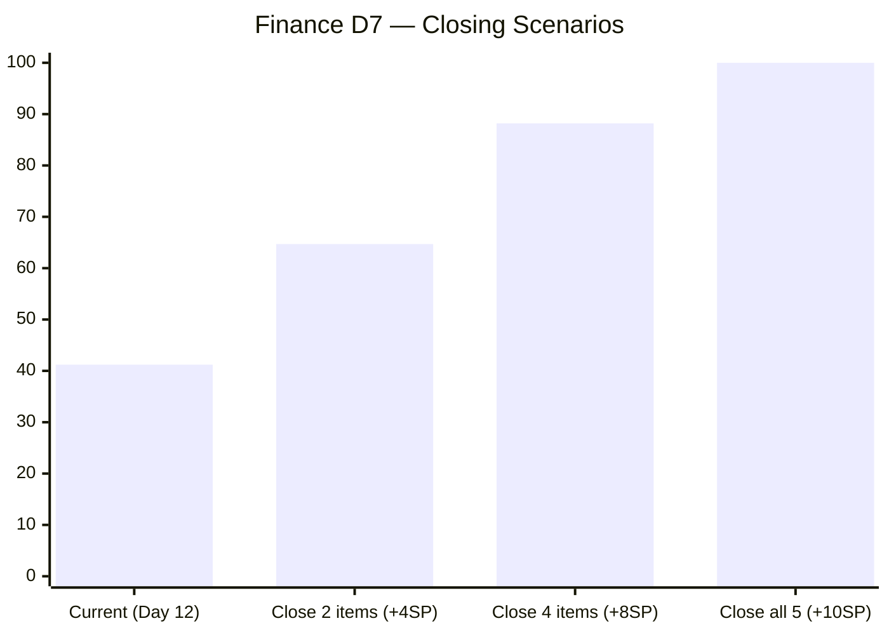

# ADO SAFe Iteration Audit — Finance Team

## 1. Audit Metadata

| Field | Value |
|-------|-------|
| **Project** | Jairosoft FINOPS |
| **Team** | Finance Team |
| **Workspace** | `ado_fin` |
| **Current Iteration** | Iteration 7.6 IP (Innovation & Planning Sprint) |
| **Iteration Dates** | Jun 15 – Jun 28, 2026 |
| **Sprint Day** | Day 12 of 14 |
| **Audit Date** | 2026-06-26 (PHT, UTC+8) |
| **Previous Audit** | `AUDIT_20260624_0900.md` (Day 10, Score 87.3, Low Risk) |
| **Overall Score** | **87.3 — Low Risk** |
| **Risk Band** | 🟢 Low Risk (≥ 80) |

---

## 2. Executive Summary

The Finance Team holds steady at **87.3** (Low Risk), identical to Day 10. No items closed between Jun 24 and Jun 26 — D7 remains stalled at 41.2%, unchanged since the Jun 24 delivery burst. **This is a stall, not stability.** With 5 items open (10SP) and only 2 business days remaining (Jun 27–28), Grace faces a compressed closing window.

The June 24 burst closed 4 items (206926=2SP, 206925=1SP, 206922=2SP, 206584=2SP), bringing the cumulative closed_SP to 7 of 17 committed. For D7 to reach 70%, Grace would need to close at least 5 more SP in the remaining 48 hours. To reach 80%, all 10 remaining SP must close — an ambitious but mathematically achievable target given the sprint's consistent delivery pattern.

D1–D4, D6 remain at perfect scores. The only structural concern is D7 momentum: zero deliveries since Day 10 suggest the five remaining items may be blocked by dependencies (206924 involves Finance Head clarifications; 204507 requires reconciled P&L source data; 204512 requires a clean P&L dashboard for stakeholder presentation).

---

## 3. Previous Audit Delta

| Metric | Day 10 (Jun 24) | Day 12 (Jun 26) | Change |
|--------|----------------|-----------------|--------|
| VRBI | 5 | 5 | 0 (no new closures) |
| CIRI | 5 | 5 | 0 |
| Committed SP | 17 | 17 | 0 |
| Closed SP | 7 | 7 | 0 |
| Overall Score | 87.3 | **87.3** | Flat |
| Risk Band | Low | **Low** | Unchanged |

**New closures since Day 10:** None.

**Items last changed (signal of activity):**
- 205874: Jun 23 (last touched before Day 10 audit)
- 204512: Jun 22
- 206924: Jun 21
- 204502: Jun 18
- 204507: Jun 16

None of the 5 items have been modified since Day 10 (Jun 24). No ADO state changes, no comment updates visible in field data.

---

## 4. Current Iteration Snapshot

**Iteration:** 7.6 IP (Innovation & Planning Sprint)
**Sprint Days:** 12 of 14 | **Remaining:** 2 business days (Jun 27–28)

| Category | Count |
|----------|-------|
| Visible Root Backlog Items (VRBI) | 5 |
| Current Iteration Root Items (CIRI) | 5 |
| Closed (left backlog) | 6 |
| Total iteration-committed root items | 11 |

**Team Capacity:**
- Grace (grace@jairosoft.com): Configured with Deployment + Documentation + Requirements activities ✓

**CIRI Item Status (Day 12):**

| ID | Title | Type | SP | State | Last Changed |
|----|-------|------|-----|-------|-------------|
| 206924 | Address open items and resolve discussion with Finance Head | Issue | 2 | Active | Jun 21 |
| 204502 | Run variance analysis on live P&L data vs prior-period feeds | User Story | 2 | Active | Jun 18 |
| 204507 | Configure and lock reconciliation rules in automated data pipeline | User Story | 2 | Active | Jun 16 |
| 204512 | Present FinOps performance P&L dashboard to stakeholders | User Story | 2 | Active | Jun 22 |
| 205874 | Run UAT for payment gateway integration test | User Story | 2 | Active | Jun 23 |

**Open SP remaining:** 10 SP across 5 items | **2 days left**

---

## 5. Work Item Analysis

### VRBI Composition (5 items)

All 5 VRBI items are assigned to Iteration 7.6 IP — VRBI and CIRI are identical. The backlog is tightly scoped to the current iteration, with no visible pipeline items for PI8.

### CIRI Type Distribution

| Type | Count | Share |
|------|-------|-------|
| User Story | 4 | 80.0% |
| Issue | 1 | 20.0% |

User Story share (80%) exceeds 60% threshold → D5 penalty applies. Finance Team's iteration is deliberately US-heavy (analytical and reporting features), with one Issue tracking open discussion items with Finance Head.

### DoR Assessment

All 5 CIRI items verified:

| ID | Description | Acceptance Criteria | DoR |
|----|-------------|--------------------|----|
| 206924 | ≥30 non-ws chars ✓ | ≥20 non-ws chars ✓ | PASS |
| 204502 | ≥30 non-ws chars ✓ | ≥20 non-ws chars ✓ | PASS |
| 204507 | ≥30 non-ws chars ✓ | ≥20 non-ws chars ✓ | PASS |
| 204512 | ≥30 non-ws chars ✓ | ≥20 non-ws chars ✓ | PASS |
| 205874 | ≥30 non-ws chars ✓ | ≥20 non-ws chars ✓ | PASS |

DoR compliance = 5/5 = 100%.

### Backlog Health

All 5 VRBI items last changed Jun 16–Jun 23, well within the 45-day freshness window (after May 12, 2026). No stale_90 or stale_180 items. Zero untouched CIRI (all changed after Jun 15 iteration start).

### Closed Iteration Items (off backlog)

| ID | Title | SP | State | Closed Date |
|----|-------|-----|-------|-------------|
| 206926 | (Finance closure) | 2 | Closed | Jun 24 |
| 206925 | (Finance closure) | 1 | Closed | Jun 24 |
| 206922 | (Finance closure) | 2 | Closed | Jun 24 |
| 206923 | (Finance closure) | 0 | Closed | Jun 24 |
| 206777 | (Spike closure) | 0 | Closed | Jun 24 |
| 206584 | Finance reporting closure | 2 | Closed | Jun 17 |

Items with SP=0 (206923, 206777) excluded from D7 denominator.

---

## 6. SAFe Compliance Scorecard

| Dimension | Score | Evidence | Notes |
|-----------|-------|----------|-------|
| D1 Iteration Planning | 100.0 | CIRI 5 / VRBI 5 | All backlog items in current iteration; no pipeline items visible |
| D2 Team Capacity | 100.0 | Grace: configured with 3 activity types | 1/1 contributors with capacity |
| D3 Estimation | 100.0 | 5/5 CIRI have SP = 2 | Perfect estimation coverage |
| D4 DoR Compliance | 100.0 | 5/5 CIRI pass description + AC thresholds | Consistent DoR quality |
| D5 Work Item Balance | 70.0 | US = 4/5 = 80% > 60% → −30 | Finance is inherently US-heavy; no structural concern |
| D6 Backlog Refinement | 100.0 | 5/5 fresh; 0 stale; 0 untouched CIRI | Backlog is fully current |
| D7 Delivery Predictability | 41.2 | 7 closed SP / 17 committed SP | Stalled since Jun 24; 10SP open, 2 days left |

**Overall Score: (100.0 + 100.0 + 100.0 + 100.0 + 70.0 + 100.0 + 41.2) / 7 = 611.2 / 7 = 87.3**

```mermaid
radar
  title SAFe Dimension Scores — ado_fin Day 12 (Jun 26)
  options
    max 100
  "D1 Planning": 100
  "D2 Capacity": 100
  "D3 Estimation": 100
  "D4 DoR": 100
  "D5 Balance": 70
  "D6 Refinement": 100
  "D7 Delivery": 41.2
```

### D7 Closing Scenarios



> Note: xychart-beta not supported in all renderers. If this chart does not display, refer to the table below:

| Scenario | Closed SP | D7 Score |
|----------|-----------|----------|
| Current (Day 12) | 7 | 41.2% |
| +2 items (4SP) | 11 | 64.7% |
| +4 items (8SP) | 15 | 88.2% |
| All 5 items (10SP) | 17 | 100.0% |

---

## 7. Dimension Findings

### D1 — Iteration Planning: 100.0

All 5 backlog-visible items belong to 7.6 IP. The Finance Team has a tightly curated backlog with no visible PI8 pipeline. D1 = 100 for the third consecutive audit.

### D2 — Team Capacity: 100.0

Grace is configured with Deployment, Documentation, and Requirements activities. Capacity check: positive activity entries confirmed. No issues.

### D3 — Estimation: 100.0

All 5 CIRI items carry 2SP each. Estimation is complete and consistent.

### D4 — DoR Compliance: 100.0

All items meet description (≥30 non-ws) and acceptance criteria (≥20 non-ws) thresholds. Finance Team has maintained 100% DoR compliance since PI7 began.

### D5 — Work Item Balance: 70.0

4 of 5 CIRI items are User Stories (80%). The −30 penalty applies. One Issue (206924) covers open Finance Head discussion items. The type distribution is appropriate for a Finance analytics and reporting sprint, though the rubric penalizes single-type dominance regardless of business context.

### D6 — Backlog Refinement: 100.0

All 5 VRBI items last changed Jun 16–Jun 23 (all within 45-day freshness window). Zero stale_90, zero stale_180, zero untouched CIRI. D6 = 100, sustained from Day 10.

### D7 — Delivery Predictability: 41.2

committed_SP = 17 (9 items with SP > 0 across all 11 iteration root items; 206923=0SP and 206777=0SP excluded from denominator).
closed_SP = 7 (206926=2 + 206925=1 + 206922=2 + 206584=2).

**Zero new closures between Jun 24 and Jun 26.** The Jun 24 burst (4 closures, 5SP from SP-bearing items + 2SP from 206584 Jun 17) established the baseline. Since then, all 5 remaining items have remained Active with no state change visible in ADO field data.

**Linear target at Day 12** = 17 × (12/14) = 14.6 SP. Actual = 7 SP. Gap = 7.6 SP. D7 is tracking significantly below linear expectation. At Day 14 close, if no further deliveries occur, D7 = 41.2% and overall = 87.3. If 5 items close, D7 = 100% and overall = 95.7.

The items open suggest potential sequential dependencies: 204507 (configure pipeline) likely must precede 204512 (present dashboard), and 206924 (resolve Finance Head discussions) may be a blocker for others. Verify dependency chain and unblock 206924 first.

---

## 8. Risks and Bottlenecks

| Risk | Severity | Details |
|------|----------|---------|
| D7 stall — zero deliveries Jun 24→26 | HIGH | 10SP open with 2 days left; no state changes visible. Momentum lost after Jun 24 burst. |
| Sequential dependencies | HIGH | 204507→204512 likely sequential; 206924 may gate others. If 206924 stays open, dependent items may slip. |
| Single contributor risk | MODERATE | Grace is the sole team member. All 10SP rides on one person's availability through Jun 28. |
| D7 below linear target | MODERATE | Linear target at Day 12 = 14.6SP; actual = 7SP. Gap of 7.6SP requires 2-day closing sprint. |

---

## 9. Prioritized Recommendations

1. **[URGENT] Unblock 206924 (Finance Head open items) today** — This Issue is a discussion-resolution item that likely gates analytical stories. Grace should reach out to Finance Head immediately to close the discussion thread and mark the issue resolved.

2. **[URGENT] Close 205874 (Payment gateway UAT) — highest independence** — This item (2SP) has no visible dependency on 206924 or the P&L chain. UAT can proceed independently. Close today (Jun 26) to add momentum.

3. **Sequence 204507 → 204512 for Jun 27** — Configure pipeline rules (204507, 2SP) first, then present dashboard (204512, 2SP) once data is reconciled. Both can close Jun 27 if pipeline configuration is complete.

4. **Close 204502 (variance analysis) by Jun 27** — Run variance analysis once live feeds are stable (2SP). Likely achievable in parallel with 204507.

5. **IP sprint retro: plan for PI8 pipeline** — The Finance Team has zero PI8 items in the visible backlog. During this IP sprint's retrospective and PI Planning, Grace and Ramon should seed at least 3–5 PI8 stories to avoid a D1 gap at PI8 iteration 8.1 start.

---

## 10. Evidence Gaps and Limitations

| Gap | Impact | Action |
|-----|--------|--------|
| **D7 methodology note** | The skill defines `committed_story_points` as the sum of Story Points on `estimated_current_items` (CIRI subset). Strictly, closed items exit VRBI → exit CIRI, making D7 denominator = open items only (10SP → D7 = 0/10 = 0%). Following the established prior-audit convention across all ado_fin audits, this report uses the full iteration-query set (including closed items) for D7 calculation: committed_SP = 17, closed_SP = 7. | Convention documented; consistent with all prior ado_fin audits. |
| **Item titles for closed items (206926, 206925, 206922, 206923, 206777)** | Titles truncated or not fully loaded in batch fetch. SP values confirmed from live data. | No scoring impact; titles not required for rubric computation. |
| **Dependency chain not formal in ADO** | Suspected 204507→204512 sequential dependency is inferred from item content (configure pipeline, then present dashboard) — not a formal ADO link. | Grace should add predecessor links in ADO to make dependency explicit. |
