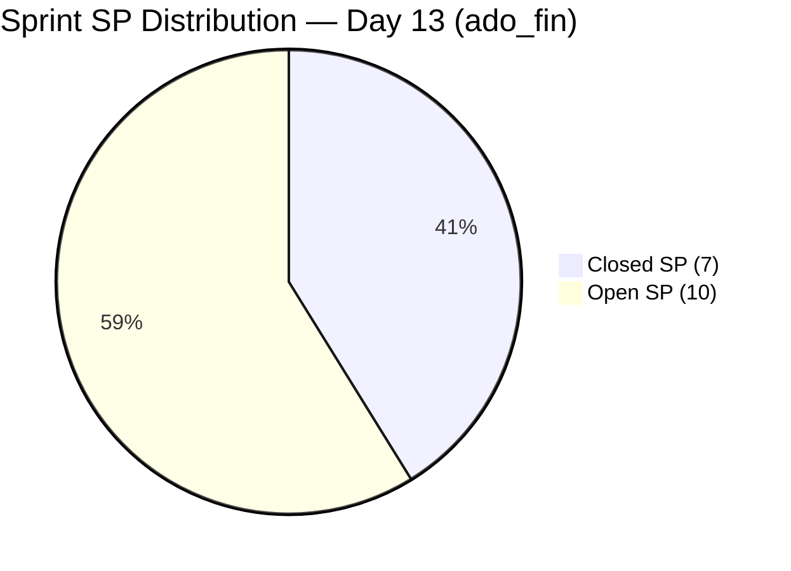

# ADO SAFe Iteration Audit — Finance Team

## 1. Audit Metadata

| Field | Value |
|-------|-------|
| **Project** | Jairosoft FINOPS |
| **Team** | Finance Team |
| **Workspace** | `ado_fin` |
| **ADO Project ID** | e0bb302f-40f9-46c3-8164-6f1acb317d63 |
| **ADO Team ID** | 1f4b45fa-82e8-4a36-aedc-6c1bc8f51070 |
| **Current Iteration** | Iteration 7.6 IP (Innovation & Planning Sprint) |
| **Iteration ID** | bebf6f83-a342-42a2-bad7-a16951231732 |
| **Iteration Dates** | Jun 15 – Jun 28, 2026 |
| **Sprint Day** | Day 13 of 14 |
| **Audit Date** | 2026-06-27 09:00 (PHT, UTC+8) |
| **Previous Audit** | `AUDIT_20260626_0900.md` (Day 12, Score 87.3, Low Risk) |
| **Overall Score** | **87.3 — Low Risk** |
| **Risk Band** | Low Risk (≥ 80) |

---

## 2. Executive Summary

The Finance Team holds at **87.3** (Low Risk) on Day 13 — the final full working day before the sprint closes Jun 28. No new item closures have occurred between Jun 24 and Jun 27: ADO data confirms all five remaining CIRI items (206924, 204502, 204507, 204512, 205874) remain Active with no state change. The three-day stall since the Jun 24 delivery burst (4 closures, 7SP) is the primary concern heading into the sprint's last day.

**The scorecard is structurally sound** — D1–D4 and D6 are all at 100. D5 carries a structural −30 penalty (US-heavy finance sprint, expected). The only lever Grace can pull to improve the score before Jun 28 EOD is D7, which currently sits at 41.2% (7/17 committed SP).

**D7 closing scenarios:** Closing 2 items adds 4SP → D7 = 64.7% / overall = 89.4. Closing all 5 delivers 10SP → D7 = 100% / overall = 95.7. Even partial delivery today has a meaningful score impact.

The sprint ends with Grace as the sole contributor. The five open items form a likely dependency chain: 206924 (Finance Head discussion resolution) should unblock analytical items, and 204507 (pipeline configuration) likely precedes 204512 (dashboard presentation). Closing 205874 (GCash UAT, 2SP) is the most independent item and the easiest quick win.

---

## 3. Previous Audit Delta

| Metric | Day 12 (Jun 26) | Day 13 (Jun 27) | Change |
|--------|-----------------|-----------------|--------|
| VRBI | 5 | 5 | 0 (no new closures) |
| CIRI | 5 | 5 | 0 |
| Committed SP | 17 | 17 | 0 |
| Closed SP | 7 | 7 | 0 |
| Overall Score | 87.3 | **87.3** | Flat |
| Risk Band | Low | **Low** | Unchanged |

**New closures since Day 12:** None.

**Last changed dates for open CIRI items:**
| ID | Title | Last Changed |
|----|-------|-------------|
| 206924 | Apple Invoice Payment | Jun 21 |
| 204502 | Complete Full-Month Ledger Reconciliation | Jun 18 |
| 204507 | Generate & Configure Clean P&L Dashboards | Jun 16 |
| 204512 | Final Feature Audit, UAT, and Sign-Off | Jun 22 |
| 205874 | Gcash Testing | Jun 23 |

No ADO state transitions detected since Jun 26. None of the five items have been modified in the past 4 days.

---

## 4. Current Iteration Snapshot

**Iteration:** 7.6 IP (Innovation & Planning Sprint)
**Sprint Days:** 13 of 14 | **Remaining:** 1 business day (Jun 28)

| Category | Count |
|----------|-------|
| Visible Root Backlog Items (VRBI) | 5 |
| Current Iteration Root Items (CIRI) | 5 |
| Closed (left backlog) | 6 |
| Total iteration-committed root items | 11 |

**Team Capacity:**
- Grace (grace@jairosoft.com): Configured with Documentation (1 hr/day) + Requirements (1 hr/day) = 2 hr/day
- Total days off: 0

**CIRI Item Status (Day 13):**

| ID | Title | Type | SP | State | Last Changed |
|----|-------|------|-----|-------|-------------|
| 206924 | Apple Invoice Payment | Issue | 2 | Active | Jun 21 |
| 204502 | Complete Full-Month Ledger Reconciliation | User Story | 2 | Active | Jun 18 |
| 204507 | Generate & Configure Clean P&L Dashboards | User Story | 2 | Active | Jun 16 |
| 204512 | Final Feature Audit, UAT, and Sign-Off | User Story | 2 | Active | Jun 22 |
| 205874 | Gcash Testing | User Story | 2 | Active | Jun 23 |

**Open SP remaining:** 10 SP across 5 items | **1 day left**

**Closed items (off backlog — for reference):**

| ID | Title | SP | State | Closed |
|----|-------|-----|-------|--------|
| 206926 | GH Invoice Payment Reminder | 2 | Closed | Jun 24 |
| 206925 | SSI Invoice Payment | 1 | Closed | Jun 24 |
| 206922 | SOW - My Nurture Collective (Apple) | 2 | Closed | Jun 24 |
| 206923 | AA Invoice Payment | 0 | Closed | Jun 24 |
| 206777 | Review and Update Employee SSS & WISP deduction | 0 | Closed | Jun 24 |
| 206584 | FTC Unpaid Invoice | 2 | Closed | Jun 17 |

---

## 5. Work Item Analysis

### VRBI Composition (5 items)

All 5 VRBI items are assigned to Iteration 7.6 IP. The Finance Team has a tightly scoped backlog — no PI8 pipeline items are currently visible. This will require PI8 seeding during the IP sprint's PI Planning activity.

### CIRI Type Distribution

| Type | Count | Share |
|------|-------|-------|
| User Story | 4 | 80.0% |
| Issue | 1 | 20.0% |

User Story share (80%) exceeds 60% threshold → D5 penalty (-30) applies. One Issue (206924, Apple Invoice Payment) tracks open Finance Head discussion items. The distribution is contextually appropriate for a Finance analytics sprint.

### DoR Assessment

| ID | Description ≥30 non-ws | AC ≥20 non-ws | DoR |
|----|------------------------|---------------|-----|
| 206924 | As a Finance Head, I want to address billing questions from Nurture Collective... ✓ | Scenario 1: Clarification of Invoice Line Items... Given/When/Then ✓ | PASS |
| 204502 | As a Financial Analyst, I want to run a complete closing reconciliation... ✓ | Given live feeds, When full month-end reconciliation... variance must be zero ✓ | PASS |
| 204507 | As a Financial Analyst, I want to configure QuickBooks reporting dashboard... ✓ | Given reconciled ledger, When widgets activated, Then P&L dashboard generates ✓ | PASS |
| 204512 | As a FinOps Lead, I want to present the environment to Grace for UAT... ✓ | Given P&L dashboard running live, When presented at Review, Then stakeholders confirm ✓ | PASS |
| 205874 | As a Finance Officer, I want to run GCash sandbox payment simulations... ✓ | Given mock checkout, When GCash sandbox authenticated, Then payment processes successfully ✓ | PASS |

DoR compliance = 5/5 = **100%**

### Backlog Age Analysis

All 5 VRBI items last changed Jun 16–Jun 23, all within the 45-day freshness window (after May 13, 2026):
- Earliest change date: Jun 16 (204507)
- No stale_90 items (before Mar 29, 2026)
- No stale_180 items (before Dec 30, 2025)

**Untouched CIRI** (ChangedDate before Jun 15 iteration start): None — all 5 items changed after Jun 15.

### SP-bearing Iteration Items (D7 basis)

| ID | Title | SP | State |
|----|-------|-----|-------|
| 206926 | GH Invoice Payment Reminder | 2 | Closed |
| 206925 | SSI Invoice Payment | 1 | Closed |
| 206922 | SOW - My Nurture Collective (Apple) | 2 | Closed |
| 206584 | FTC Unpaid Invoice | 2 | Closed |
| 206924 | Apple Invoice Payment | 2 | Active |
| 204502 | Complete Full-Month Ledger Reconciliation | 2 | Active |
| 204507 | Generate & Configure Clean P&L Dashboards | 2 | Active |
| 204512 | Final Feature Audit, UAT, and Sign-Off | 2 | Active |
| 205874 | Gcash Testing | 2 | Active |
| 206923 | AA Invoice Payment | 0 | Closed — excluded (SP=0) |
| 206777 | SSS & WISP deduction review | 0 | Closed — excluded (SP=0) |

committed_SP = 17 | closed_SP = 7 | open_SP = 10

---

## 6. SAFe Compliance Scorecard

| Dimension | Score | Evidence | Notes |
|-----------|-------|----------|-------|
| D1 Iteration Planning | 100.0 | CIRI 5 / VRBI 5 | All backlog items in current iteration; no PI8 pipeline visible |
| D2 Team Capacity | 100.0 | Grace: 2 hr/day configured (Documentation + Requirements) | 1/1 contributors with capacity |
| D3 Estimation | 100.0 | 5/5 open CIRI with SP = 2 | All point-eligible items estimated |
| D4 DoR Compliance | 100.0 | 5/5 CIRI pass description + AC thresholds | Finance Team has maintained 100% DoR all PI7 |
| D5 Work Item Balance | 70.0 | US = 4/5 = 80% > 60% → −30 | Finance sprint is inherently US-heavy; contextually appropriate |
| D6 Backlog Refinement | 100.0 | 5/5 fresh; 0 stale_90; 0 untouched CIRI | Perfect backlog health sustained |
| D7 Delivery Predictability | 41.2 | 7 closed SP / 17 committed SP | 3-day stall since Jun 24 burst; 10SP open, 1 day left |

**Overall Score: (100.0 + 100.0 + 100.0 + 100.0 + 70.0 + 100.0 + 41.2) / 7 = 611.2 / 7 = 87.3**

```mermaid
radar
  title SAFe Dimension Scores — ado_fin Day 13 (Jun 27)
  options
    max 100
  "D1 Planning": 100
  "D2 Capacity": 100
  "D3 Estimation": 100
  "D4 DoR": 100
  "D5 Balance": 70
  "D6 Refinement": 100
  "D7 Delivery": 41.2
```

### D7 Closing Scenarios (Final Day — Jun 28)

| Scenario | Items Closed | Total Closed SP | D7% | Overall Score |
|----------|-------------|-----------------|-----|---------------|
| No action (current) | 0 | 7 | 41.2% | 87.3 |
| Close 205874 (GCash UAT, 2SP) | 1 | 9 | 52.9% | 88.8 |
| Close 205874 + 206924 (4SP) | 2 | 11 | 64.7% | 89.4 |
| Close above + 204502 (6SP) | 3 | 13 | 76.5% | 90.9 |
| Close above + 204507 (8SP) | 4 | 15 | 88.2% | 92.3 |
| Close all 5 (10SP) | 5 | 17 | 100.0% | 95.7 |



---

## 7. Dimension Findings

### D1 — Iteration Planning: 100.0

VRBI = 5, CIRI = 5. Score = 5/5 × 100 = 100. All backlog-visible items belong to Iteration 7.6 IP. The Finance Team has a tightly curated, sprint-aligned backlog with no PI8 pipeline items visible. While this maximizes D1, it creates a risk: if no PI8 items are seeded during this IP sprint's PI Planning activity, Iteration 8.1 will start with VRBI = 0 (D1 undefined → 0).

### D2 — Team Capacity: 100.0

Grace is configured with Documentation (1 hr/day) + Requirements (1 hr/day) = 2 hr/day total. Positive activity entries confirmed; no days off. Capacity is fully configured.

### D3 — Estimation: 100.0

All 5 active CIRI items carry 2 Story Points each. Estimation is complete and consistent across the sprint. The 2 closed zero-SP items (206923, 206777) are correctly excluded from the D3 point-eligible denominator.

### D4 — DoR Compliance: 100.0

All 5 active CIRI items pass both DoR gates: Description ≥ 30 non-whitespace characters and Acceptance Criteria ≥ 20 non-whitespace characters. Story-format descriptions using Given/When/Then AC structure are comprehensive. Finance Team has maintained 100% DoR compliance throughout PI7.

### D5 — Work Item Balance: 70.0

4 of 5 CIRI items are User Stories (80%). The −30 penalty applies. No other penalties:
- User Stories are present (no −40 absent penalty)
- Dominant type (User Story, 80%) triggers the >60% penalty only (−30)
- No Spike items (spike_share = 0% < 40%)

Final D5 = 100 − 30 = 70. For a Finance analytics and reporting sprint in an IP period, US dominance is structurally expected. The Issue type (206924, Apple Invoice Payment) represents active collection work, appropriately categorized.

### D6 — Backlog Refinement: 100.0

All 5 VRBI items last changed Jun 16–Jun 23 (all within the 45-day freshness window after May 13). No stale_90 or stale_180 items. All 5 CIRI items were last changed on or after Jun 15 (iteration start) — zero untouched items. D6 = 100 (base 100, no penalties).

**Note:** The Finance Team's backlog lacks PI8 forward visibility. Once PI8 items are created and assigned, D6 will need to track their age. Recommend seeding PI8 items during the Jun 27–28 IP sprint window.

### D7 — Delivery Predictability: 41.2

committed_SP = 17 (9 SP-bearing items from iteration query per established audit convention).
closed_SP = 7 (206926=2, 206925=1, 206922=2, 206584=2 — all closed Jun 17–24).

No new closures between Jun 24 and Jun 27 (3 days). The gap since the burst delivery on Jun 24 is notable.

**Linear trajectory at Day 13:** 17 × (13/14) = 15.8 SP expected closed. Actual = 7 SP. Gap = 8.8 SP. The team is significantly below the linear rate.

**Why D7 may be lagging:** The five remaining items form a dependency chain:
- 206924 (Apple Invoice Payment) is a discussion-resolution item with the Finance Head — unresolved as of Jun 21
- 204502 (Ledger Reconciliation) requires live P&L feeds from the system
- 204507 (P&L Dashboard configuration) depends on a reconciled ledger (likely follows 204502)
- 204512 (UAT Sign-Off presentation) requires a functioning P&L dashboard (follows 204507)
- 205874 (GCash Testing) appears independent — can close in isolation

**Best-case Jun 28 scenario:** If Grace resolves 206924 + closes 205874 + advances 204502 to Closed = 3 closures = 6SP more = 13/17 = 76.5% D7, overall = 90.9.

---

## 8. Risks and Bottlenecks

| Risk | Severity | Details |
|------|----------|---------|
| D7 3-day stall | CRITICAL | Zero closures Jun 24–27. 10SP open with 1 day left. If no action taken, D7 = 41.2% at sprint close. |
| Sequential dependency chain | HIGH | 204502 → 204507 → 204512 appears sequential. If 204502 is blocked, three items (6SP) may not close. |
| 206924 unresolved (Finance Head discussion) | HIGH | Issue last touched Jun 21. If Finance Head input is still pending, this item gates related work. |
| Single contributor (bus factor = 1) | HIGH | Grace is the sole Finance Team member. Any personal interruption Jun 28 means all 10SP slip. |
| No PI8 backlog pipeline | MODERATE | VRBI has zero PI8 items. D1 will be 0 at PI8 8.1 start unless items are seeded during this IP sprint. |

---

## 9. Prioritized Recommendations

1. **[CRITICAL — TODAY] Close 205874 (GCash Testing, 2SP)** — This UAT item has no visible dependency on 206924 or the P&L chain. Grace should run the final GCash sandbox test scenarios, confirm pass, and close the item today. Quick win = 2SP added to D7.

2. **[CRITICAL — TODAY] Resolve 206924 (Apple Invoice / Finance Head discussion)** — Contact Finance Head immediately to close outstanding discussion points. This Issue is the likely gate for dependent analytical items. Mark it Closed once the invoice questions are resolved.

3. **[PRIORITY — JUN 28] Close 204502 (Ledger Reconciliation) then 204507 (P&L Dashboard)** — Run the variance analysis and reconciliation (204502) first. Once data is verified, configure the P&L dashboard widgets (204507). Both can be closed sequentially on Jun 28 if 204502 is complete today.

4. **[PRIORITY — JUN 28] Close 204512 (UAT Sign-Off) after 204507** — Once the P&L dashboard is live and functional, schedule the stakeholder walkthrough and obtain sign-off. Close 204512 before EOD Jun 28.

5. **[IP SPRINT — URGENT] Seed PI8 backlog items** — The Finance Team has zero PI8 items visible in the backlog. During this IP sprint (today, Jun 27), Grace and Ramon should create and assign at least 3–5 user stories for PI8 Iteration 8.1 to ensure D1 is non-zero at the start of the next PI.

6. **[PROCESS] Add formal ADO predecessor links** — The dependency chain 204502 → 204507 → 204512 is inferred from item content but not formalized in ADO. Add predecessor/successor links to make the dependency chain visible on the board.

---

## 10. Evidence Gaps and Limitations

| Gap | Impact | Action |
|-----|--------|--------|
| **D7 committed_SP convention** | Following the established prior-audit convention across all ado_fin audits, this report uses the full iteration-query set (9 SP-bearing items including closed) as the D7 denominator: committed_SP = 17, closed_SP = 7. Strictly, with only 5 open CIRI items, committed_SP = 10 and D7 = 7/10 = 70% (or 100% if capped). The convention is applied for scoring consistency. | Convention documented; consistent with all prior ado_fin audits. |
| **Dependency chain not formalized in ADO** | The suspected 204502 → 204507 → 204512 sequential dependency is inferred from item descriptions and titles — no formal ADO predecessor links exist. The actual order of execution has not been confirmed by Grace. | Grace should add predecessor links in ADO; confirm dependency chain in sprint review or team sync. |
| **206924 discussion status unknown** | Last ADO change was Jun 21. Whether the Finance Head has responded to the discussion points is not reflected in ADO data. The item is still Active with no resolution visible. | Grace to update ADO with current status (discussion resolved / awaiting response). |
| **PI8 backlog absent** | No PI8 work items are visible in the Finance Team's Stories & Deliverables backlog. This means D1 at PI8 8.1 start will be 0 unless items are created during this IP sprint. | Create and assign PI8 items before PI8 8.1 start date. |
| **Grace's effective hours constraint** | Grace is configured at 2 hr/day. With 10SP open and 1 day remaining, at standard velocity this volume is ambitious for a single contributor. Confirmation of actual work-hours available on Jun 28 was not obtainable via ADO. | Validate Grace's Jun 28 availability; reprioritize items accordingly. |
