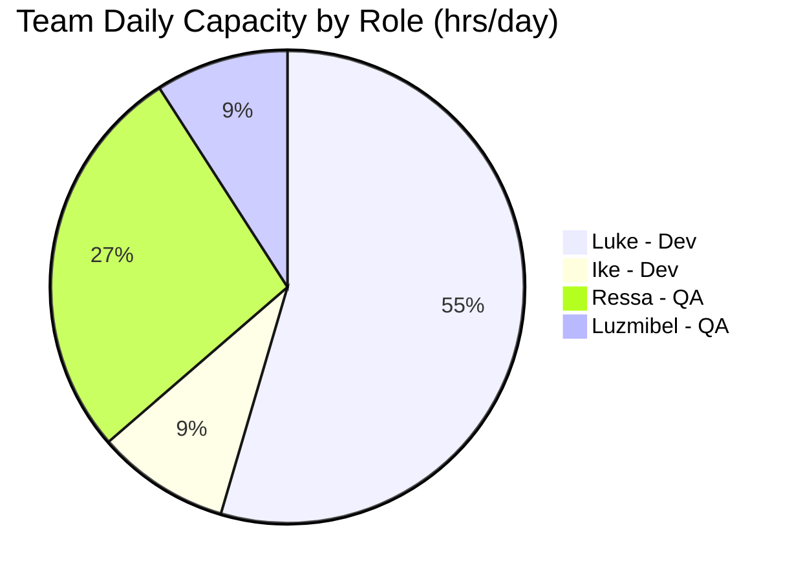
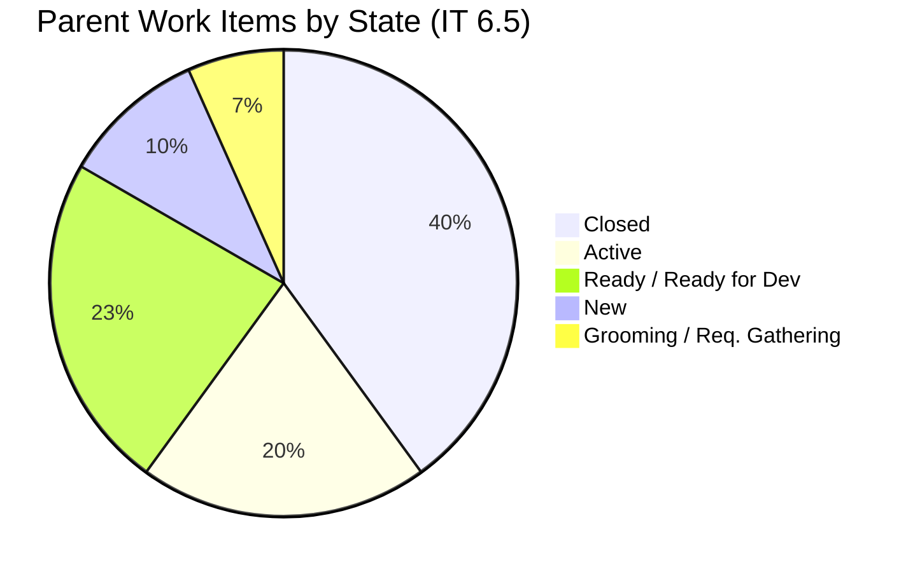
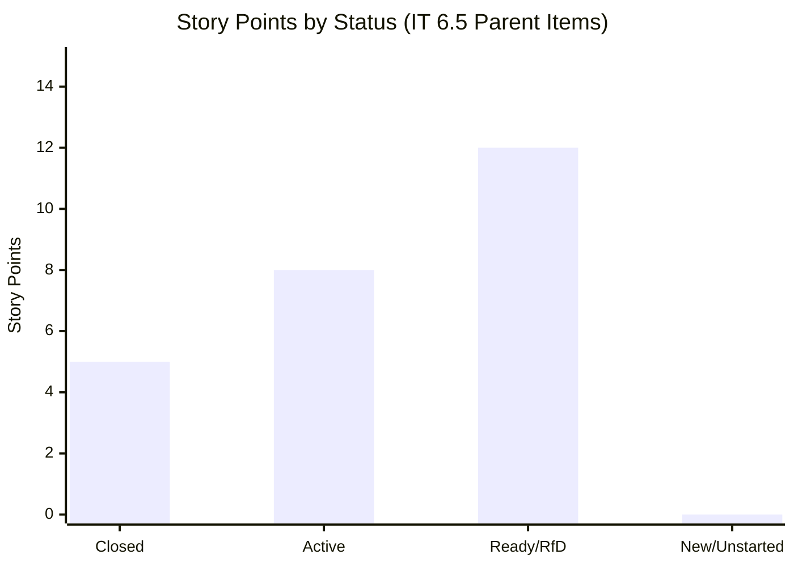
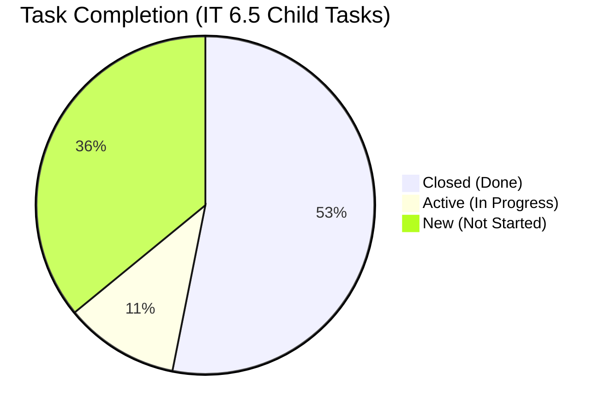
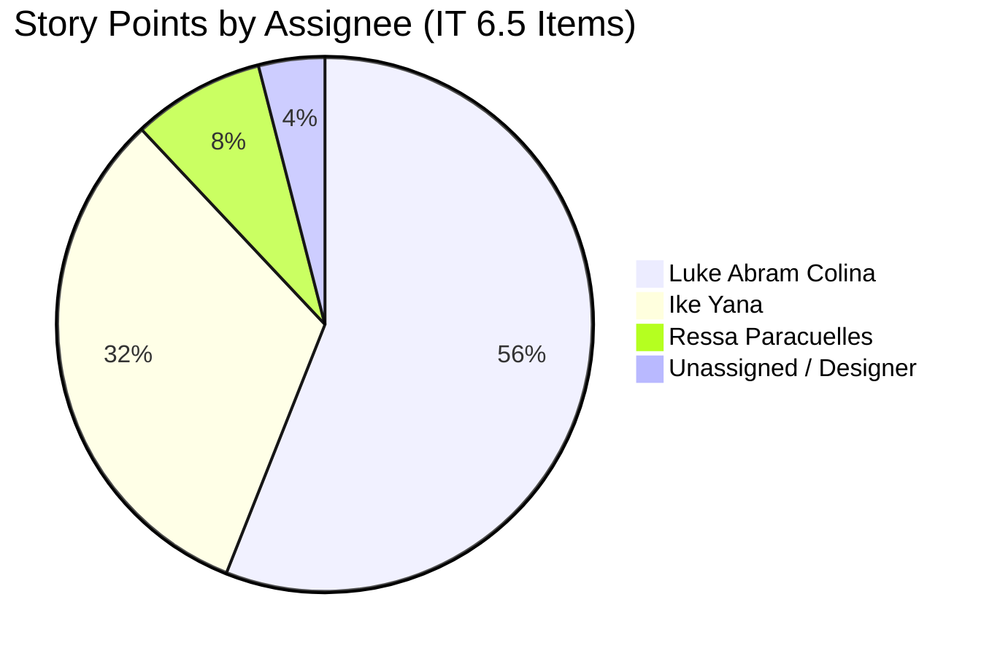
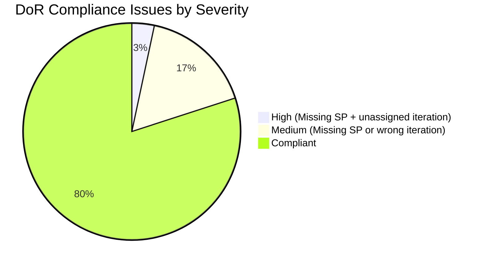
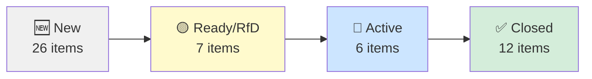
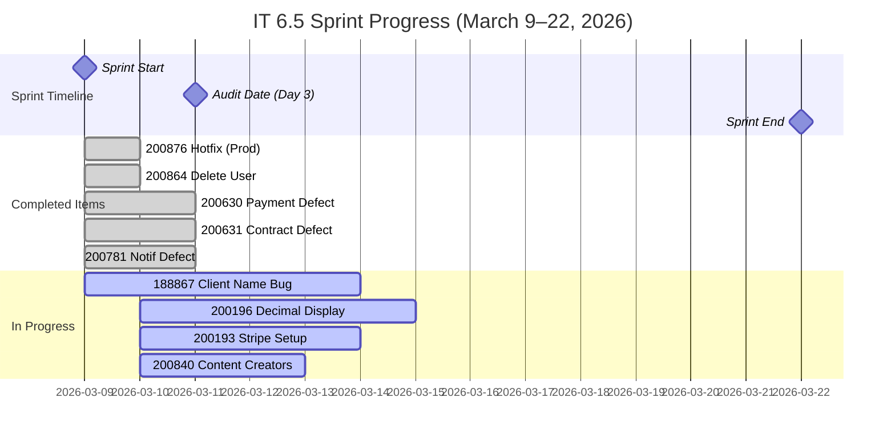
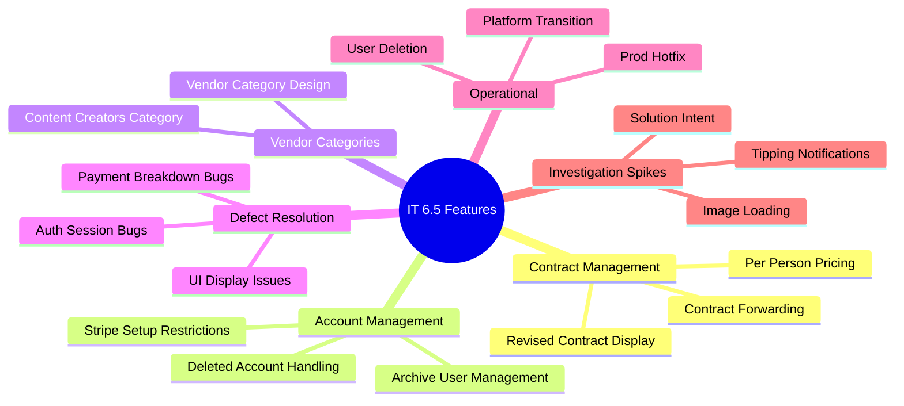

# Iteration Audit Report

**Project:** Flawless Wedding App
**Auditor:** SAFe Agile Project Manager (AI-Assisted)
**Audit Date:** March 11, 2026
**Audit Reference:** AUDIT_2026-03-11_193316

---

## 1. Executive Summary

This is the **inaugural audit** for the Flawless Wedding App ADO project under the SAFe framework. No previous audit exists for baseline comparison; future audits will leverage this report as a reference point.

**Current Iteration:** Iteration 6.5 (2026-PI6)
**Sprint Dates:** March 9 – March 22, 2026 *(Day 3 of 14 at time of audit)*

At day 3 of 14, the team has demonstrated early productivity with **5 parent items closed** (all defects) and **6 items actively in progress**. However, significant portions of the sprint backlog remain uncommitted or in pre-dev states, presenting a **medium risk** to sprint completion.

**Overall SAFe Health Score: 🟡 Moderate (6.2 / 10)**

---

## 2. Iteration Snapshot

| Attribute | Value |
|---|---|
| **PI** | 2026-PI6 |
| **Iteration** | 6.5 |
| **Start Date** | March 9, 2026 |
| **End Date** | March 22, 2026 |
| **Duration** | 14 days (2 weeks) |
| **Days Elapsed** | 3 |
| **Days Remaining** | 11 |
| **Team Size** | 4 active members + 1 designer |

---

## 3. Team Capacity

| Team Member | Role | Capacity/Day | Days Off | Total Available |
|---|---|---|---|---|
| Luke Abram Colina | Development | 6 hrs | 0 | ~84 hrs |
| Ike Yana | Development | 1 hr | 0 | ~14 hrs |
| Ressa Paracuelles | Testing | 3 hrs | 1 (Mar 16) | ~39 hrs |
| Luzmibel Paculanang | Testing | 1 hr | 0 | ~14 hrs |
| **Total** | | **11 hrs/day** | **1 day** | **~151 hrs** |

> ⚠️ **Capacity Note:** The team has a heavily skewed developer capacity. Luke carries the bulk of development work at 6 hrs/day while Ike has only 1 hr/day capacity recorded. This imbalance is a potential risk for sprint delivery.



---

## 4. Sprint Backlog Analysis

### 4.1 Parent Work Item Inventory

The following parent items are assigned to or being tracked within Iteration 6.5:

#### User Stories

| ID | Title | State | SP | Assignee | Iteration |
|---|---|---|---|---|---|
| 200193 | Remove Restriction on Stripe Setup Completion | 🔵 Active | 1 | Luke | IT 6.5 |
| 200197 | Add "Per Person" Checkbox Under Price | 🟡 Ready for Dev | 1 | Luke | IT 6.5 |
| 200198 | [Mobile and Web] Forwarding Contract Per Person | 🟡 Ready for Dev | 3 | Luke | IT 6.5 |
| 200256 | Manage Archived Users (Delete and Restore) | 🟡 Ready for Dev | 2 | Luke | IT 6.5 |
| 200840 | Add Content Creators Vendor Category | 🔵 Active | 1 | Luke | IT 6.5 |
| 200847 | Add "Apply Coupon To" Field for Coupon Scope | 🆕 New | ❌ None | Ressa | PI6 (unassigned!) |
| 198344 | Vendor Contract Signing During Registration | ✅ Closed | 2 | Luke | IT 6.4 |
| 198346 | Admin Views Vendor Contract | ✅ Closed | 2 | Luke | IT 6.4 |
| 198347 | Admin Views Vendor Contract for Multiple Businesses | ✅ Closed | 1 | Luke | IT 6.4 |
| 199087 | Vendor View Registration Contract | ✅ Closed | 2 | Luke | IT 6.4 |
| 197358 | [WEB] Vendor Views Booked Events After Revised Contract | ✅ Closed | 3 | Ike | IT 6.3 |
| 197520 | [Mobile] Vendor Revises an Existing Contract | ✅ Closed | 3 | Ike | IT 6.3 |
| 197536 | [MOBILE] View Revised Contract on Manage Page | ✅ Closed | 3 | Ike | IT 6.3 |

#### Defects

| ID | Title | State | SP | Assignee | Iteration |
|---|---|---|---|---|---|
| 200630 | [Mobile] Wrong Payment Breakdown After Revision | ✅ Closed | 1 | Ike | IT 6.5 |
| 200631 | [Web] Download Revised Contract Incorrect Payment | ✅ Closed | 1 | Ike | IT 6.5 |
| 200781 | [Mobile] Incorrect Amount in Auto Payment Notification | ✅ Closed | 1 | Ike | IT 6.5 |
| 200876 | [Prod] Web Error Sending Messages (Hotfix) | ✅ Closed | 1 | Luke | IT 6.5 |
| 188867 | [All] Client Name Not Displayed in Contract | 🔵 Active | 1 | Luke | IT 6.5 |
| 200196 | [Vendor] Decimal Values Not Fully Displayed | 🔵 Active | 2 | Luke | IT 6.5 |
| 198289 | Deleted Vendor Account Remains Logged In | 🟡 Ready for Dev | 1 | Luke | IT 6.5 |
| 200190 | Deleted Client Account Cannot Be Reused | 🟡 Ready for Dev | 2 | Luke | IT 6.5 |
| 200791 | [Web] Incorrect Date on Custom Fields | 🆕 New | ❌ None | Ike | ⚠️ IT 6.6 IP |
| 200796 | [Web] Inconsistent Grand Total in Download | 🆕 New | ❌ None | Ike | ⚠️ IT 6.6 IP |

#### Spikes

| ID | Title | State | SP | Assignee | Iteration |
|---|---|---|---|---|---|
| 200864 | Delete Brandi Picardal (user mgmt) | ✅ Closed | 1 | Luke | IT 6.5 |
| 200506 | Collaborations, Reports & Others | 🔵 Active | 2 | Ressa | IT 6.5 |
| 200542 | Meetings, Collaboration & Others IT 6.5 | 🔵 Active | 2 | Ike | IT 6.5 |
| 196898 | Tipping Notifications for Investigation | 🟡 Ready | 1 | Ike | IT 6.5 |
| 196984 | Discuss Solution Intent with Cricket | 🟡 Ready | 2 | Ike | IT 6.5 |
| 198298 | Revisit Loading Images Issue | 🟡 Ready | 1 | Ike | IT 6.5 |
| 199682 | Plan Flawless Access Transition (Cricket→Jairosoft) | 🔶 Req. Gathering | — | Ike | IT 6.5 |

#### Design

| ID | Title | State | SP | Assignee | Iteration |
|---|---|---|---|---|---|
| 195677 | Vendor Categories Design | 🔶 Grooming | ❌ None | Jaszmeine Villanueva | IT 6.5 |

---

### 4.2 Work Item State Distribution



### 4.3 Story Points Summary

> *Only counting parent items actually assigned to IT 6.5 with story points*

| Status | Story Points |
|---|---|
| ✅ Completed (Closed) | 5 SP |
| 🔵 In Progress (Active) | 8 SP |
| 🟡 Planned (Ready/RfD) | 12 SP |
| ❌ Not Started (New) | 0 SP (no SP assigned) |
| **Total Committed** | **~25 SP** |



### 4.4 Task-Level Progress

Total child tasks tracked in IT 6.5:

| State | Count |
|---|---|
| ✅ Closed | 34 |
| 🔵 Active | 7 |
| 🆕 New | 23 |
| **Total** | **64** |



**Task completion rate (Day 3):** 34/64 = **53.1%** — above expected pace of ~21% (3/14 days), which is a positive signal driven by defect resolution velocity.

---

## 5. Workload Distribution by Assignee



> ⚠️ **Risk:** Luke carries ~56% of the story point load. High concentration on a single developer creates a single point of failure risk.

---

## 6. SAFe Framework Compliance Review

### 6.1 Definition of Ready (DoR) Compliance

SAFe requires work items to be "Ready" before entering a sprint — with clear descriptions, acceptance criteria, and story point estimates.

| # | Item | Issue | Severity |
|---|---|---|---|
| 1 | 200847 (User Story) | No Story Points; iteration = PI6 (not assigned to a sprint) | 🔴 High |
| 2 | 195677 (Design) | No Story Points; still in Grooming | 🟡 Medium |
| 3 | 200791 (Defect) | No Story Points; incorrectly placed in IT 6.6 IP | 🟡 Medium |
| 4 | 200796 (Defect) | No Story Points; incorrectly placed in IT 6.6 IP | 🟡 Medium |
| 5 | 199682 (Spike) | Still in "Requirements Gathering" – not sprint-ready | 🟡 Medium |
| 6 | 196898, 196984, 198298 (Spikes) | In "Ready" state but not activated — risk of going unaddressed | 🟡 Medium |



**DoR Compliance Rate: 80%** (24/30 items are adequately prepared)

### 6.2 Cross-Iteration Contamination

The sprint board includes items whose `IterationPath` belongs to **prior iterations**:

| Item | Belongs To | Status |
|---|---|---|
| 197358, 197520, 197536 | IT 6.3 | ✅ Closed — residual, low risk |
| 198344, 198346, 198347, 199087 | IT 6.4 | ✅ Closed — residual, low risk |
| 200791, 200796 | IT 6.6 (IP) | 🆕 New — need to be moved to correct iteration |
| 200847 | PI6 (no iteration) | 🆕 New — needs iteration assignment |

> **Finding:** 3 new/active items do not belong to IT 6.5. They should be reassigned to the correct iteration or sprint backlog to maintain board integrity.

### 6.3 WIP (Work in Progress) Analysis

SAFe encourages limiting WIP to improve flow. At Day 3:



**WIP by individual (parent items in Active state):**

- Luke: 3 items (188867, 200196, 200193/200840) — Moderate
- Ike: 1 item (200542) — Low
- Ressa: 1 item (200506) — Low

> ✅ WIP per developer appears manageable, though **Luke's overall assignment load** (Active + RfD) spans 7 items, which warrants monitoring.

### 6.4 Defect Density

Active defects in this iteration vs total work items:

| Category | Count | % of Total |
|---|---|---|
| Open Defects (Active/RfD/New) | 6 | ~20% |
| Closed Defects (this sprint) | 4 | ~13% |
| User Stories | 7 | ~23% |
| Spikes | 7 | ~23% |
| Other | 5 | ~17% |

> 🔴 **Concern:** A **20% active defect rate** alongside backlog defects from earlier iterations (188867 created in Iteration 4) indicates technical debt accumulation. The "Created Iteration 4; Priority-defect" tag on item 188867 suggests this defect has been deferred multiple times.

### 6.5 Production Hotfix Event

Work item **200876** (`[Prod] [Web] Error upon sending messages`) was logged and closed within IT 6.5 with tags **"Hotfix; Smoke Testing 03/11/26"** — the same day as this audit. This indicates a **production incident** was addressed reactively during the sprint.

> ⚠️ **SAFe Concern:** Unplanned production hotfixes consume sprint capacity and disrupt planned work. Per SAFe best practices, a Production Issue Buffer should be allocated in sprint planning (typically 10-20% of capacity).

---

## 7. Sprint Velocity & Trend Analysis

Since this is the **first formal audit**, historical velocity data is unavailable. However, based on observable data:



**Projected Completion by Day 14 (assuming current pace):**

- At Day 3: 5 SP closed, 8 SP in-progress, 12 SP not started
- Current burn rate: ~1.7 SP/day
- Estimated total deliverable at Day 14: ~24 SP
- **Risk:** Items in "Ready for Dev" (especially 200198 at 3 SP) may not reach completion without immediate dev pickup.

---

## 8. Feature Theme Analysis

The sprint is focused on multiple feature themes, which is a potential **focus risk**:



> **Finding:** 6+ distinct feature themes are active in a single 2-week sprint. SAFe recommends minimizing context-switching by grouping related stories into focused sprint objectives.

---

## 9. Key Findings & Risks

### 🔴 Critical Risks

| # | Finding | Recommendation |
|---|---|---|
| 1 | **Luke is a single point of failure** — 56% of story points, majority of dev tasks | Cross-train or redistribute; increase Ike's capacity if possible |
| 2 | **Defect 188867 is a long-running carry-over** (since Iteration 4) | Prioritize resolution; aging defects accumulate technical debt |
| 3 | **Production hotfix consumed unplanned capacity** | Allocate a formal Production Buffer (10-20%) in PI planning |

### 🟡 Medium Risks

| # | Finding | Recommendation |
|---|---|---|
| 4 | **3 spikes in "Ready" state with no progress** (196898, 196984, 198298) | Activate or defer to next iteration; they block sprint value delivery |
| 5 | **200847 not assigned to an iteration** | Assign to IT 6.5 or next available iteration immediately |
| 6 | **200791 and 200796 misassigned to IT 6.6 IP** | Move to IT 6.5 for immediate triage if required this sprint |
| 7 | **Design item 195677 still in Grooming** | Must be completed before dev work begins; risk to future iterations |
| 8 | **6+ feature themes active simultaneously** | Focus sprints by grouping related themes; reduce cognitive context-switching |

### 🟢 Positive Signals

| # | Finding |
|---|---|
| 1 | Task completion rate of 53% on Day 3 exceeds expected linear pace (21%) |
| 2 | Defects from current sprint were resolved quickly (payment breakdown, notification issues) |
| 3 | Production hotfix resolved same day — good responsiveness |
| 4 | Collaboration and meetings are tracked as spikes — good visibility into non-dev activities |
| 5 | Acceptance criteria are well-documented across most User Stories (DoR partial compliance is strong) |
| 6 | Team is already tracking new defects (200791, 200796) proactively for next IP iteration |

---

## 10. SAFe Framework Scorecard

```mermaid
radar
    title SAFe Health Scorecard (IT 6.5 Day 3)
    variables
        "Iteration Planning"
        "DoR Compliance"
        "WIP Management"
        "Defect Management"
        "Team Capacity"
        "PI Alignment"
        "Velocity Transparency"
        "Collaboration Visibility"
    data
        "Current Score" : [6, 8, 7, 5, 5, 7, 5, 8]
        "Target" : [9, 9, 8, 8, 8, 9, 8, 8]
```

| Dimension | Score | Target | Gap |
|---|---|---|---|
| Iteration Planning | 6/10 | 9/10 | -3 |
| DoR Compliance | 8/10 | 9/10 | -1 |
| WIP Management | 7/10 | 8/10 | -1 |
| Defect Management | 5/10 | 8/10 | -3 |
| Team Capacity Balance | 5/10 | 8/10 | -3 |
| PI Alignment | 7/10 | 9/10 | -2 |
| Velocity Transparency | 5/10 | 8/10 | -3 |
| Collaboration Visibility | 8/10 | 8/10 | 0 |
| **Overall** | **6.4/10** | **8.6/10** | **-2.2** |

---

## 11. Recommendations for Next Audit (IT 6.6 IP)

Since IT 6.6 is an **Innovation and Planning (IP) Iteration**, the following should be addressed:

1. **Assign 200847** to IT 6.6 IP or IT 7.1 for proper sprint tracking
2. **Close or defer** the 3 uninitiated spikes (196898, 196984, 198298) from IT 6.5 before the sprint ends
3. **Finalize Vendor Categories Design** (195677) — needed for upcoming vendor feature work
4. **Resolve 188867** (aging priority defect from Iteration 4) — no longer acceptable to carry forward
5. **Establish baseline velocity** — use IT 6.5 actuals as first data point for PI 6 velocity tracking
6. **Define Production Buffer** in PI 7 planning to accommodate unplanned hotfixes
7. **Conduct retrospective** to identify why multiple spikes remain in "Ready" without activation

---

## 12. Audit Metadata

| Field | Value |
|---|---|
| **Report Generated** | 2026-03-11 19:33:16 |
| **ADO Project** | Flawless Wedding App |
| **ADO Org** | jairo (dev.azure.com/jairo) |
| **ADO Team** | Flawless Wedding App Team |
| **Team Board** | [View Board](https://dev.azure.com/jairo/Flawless%20Wedding%20App/_boards/board/t/Flawless%20Wedding%20App%20Team/Stories%20and%20Deliverables) |
| **Iteration ID** | 5603d84a-465d-4005-8654-1c0d8328c936 |
| **SAFe Reference** | [ScaledAgileFramework.com](https://ScaledAgileFramework.com) |
| **Previous Audit** | None (inaugural report) |
| **Next Audit Due** | IT 6.6 IP kickoff or March 23, 2026 |

---

*This report was generated as part of the scheduled `ado-flw-audit` task and follows SAFe framework standards for iteration auditing.*
