# Iteration Audit Report
**Project:** Flawless Wedding App
**Auditor:** SAFe Agile Project Manager (AI-Assisted)
**Audit Date:** March 12, 2026
**Audit Reference:** AUDIT_2026-03-12_003043

---

## 1. Executive Summary

This is the **second audit** for the Flawless Wedding App ADO project under the SAFe framework, comparing against the inaugural report (`AUDIT_2026-03-11_193316`). The team is now on **Day 4 of 14** of Iteration 6.5.

**Current Iteration:** Iteration 6.5 (2026-PI6)
**Sprint Dates:** March 9 – March 22, 2026 *(Day 4 of 14 at time of audit)*

Since the Day 3 audit, the team has responded to several findings by **re-aligning three work items to their correct iterations** — a positive signal of agile responsiveness. Parent item active count increased to 7 (from 6), driven by the Flawless Access Transition spike becoming active. Task completion rate now stands at **50%** of IT 6.5-specific tasks, well ahead of the expected linear pace of 28.6%.

However, the sprint's core aging defect (188867) shows no measurable code progress, story point burn rate remains low (1.25 SP/day), and a new unplanned team member (Carol Cuison) has appeared without capacity being formally recorded.

**Overall SAFe Health Score: 🟡 Moderate (6.5 / 10)** — slight improvement from 6.4 yesterday.

---

## 2. Iteration Snapshot

| Attribute | Value |
|---|---|
| **PI** | 2026-PI6 |
| **Iteration** | 6.5 |
| **Start Date** | March 9, 2026 |
| **End Date** | March 22, 2026 |
| **Duration** | 14 days (2 weeks) |
| **Days Elapsed** | 4 |
| **Days Remaining** | 10 |
| **Team Size** | 4 planned + 1 designer + 1 unplanned (Carol Cuison) |

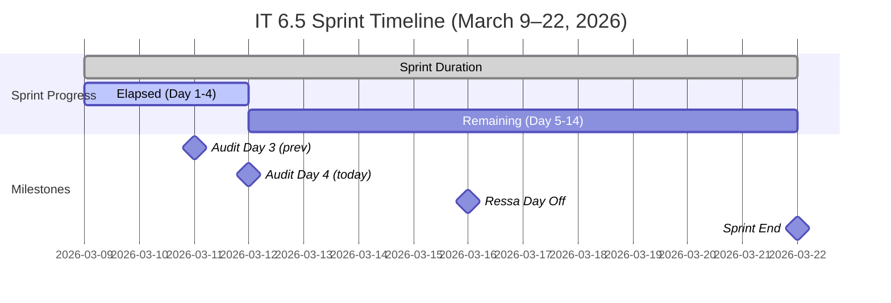

---

## 3. Team Capacity

| Team Member | Role | Capacity/Day | Days Off | Total Available |
|---|---|---|---|---|
| Luke Abram Colina | Development | 6 hrs | 0 | ~84 hrs |
| Ike Yana | Development | 1 hr | 0 | ~14 hrs |
| Ressa Paracuelles | Testing | 3 hrs | 1 (Mar 16) | ~39 hrs |
| Luzmibel Paculanang | Testing | 1 hr | 0 | ~14 hrs |
| Carol Cuison ⚠️ | Unknown | **Not recorded** | Unknown | **Unknown** |
| **Total (planned)** | | **11 hrs/day** | **1 day** | **~151 hrs** |

> ⚠️ **New Risk:** Carol Cuison (`ccuison@jairosoft.com`) has been assigned to spike **199682** (Plan Flawless Access Transition) and is now Active, but is **not included in the team capacity configuration** in ADO. This creates a hidden capacity contributor that is not tracked in sprint planning.

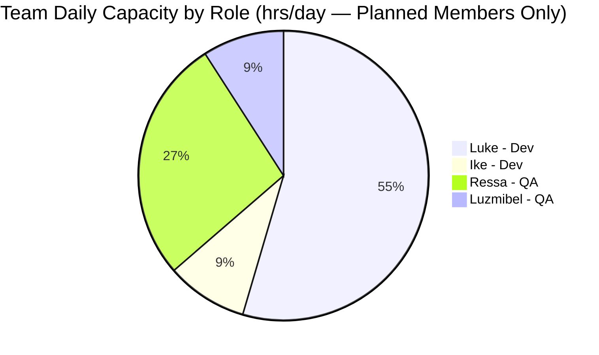

---

## 4. Sprint Backlog Analysis

### 4.1 Parent Work Item Inventory (IT 6.5)

#### User Stories

| ID | Title | State | SP | Assignee | Change Since Day 3 |
|---|---|---|---|---|---|
| 200193 | Remove Restriction on Stripe Setup Completion | 🔵 Active | 1 | Luke | No change |
| 200197 | Add "Per Person" Checkbox Under Price | 🟡 Ready for Dev | 1 | Luke | No change |
| 200198 | [Mobile and Web] Forwarding Contract Per Person | 🟡 Ready for Dev | 3 | Luke | No change |
| 200840 | Add Content Creators Vendor Category | 🔵 Active | 1 | Luke | No change |
| 200847 | Add "Apply Coupon To" Field for Coupon Scope | 🔶 Estimation | 2 | Luke | ✅ Assigned to IT 6.5 + SP added |

#### Defects

| ID | Title | State | SP | Assignee | Change Since Day 3 |
|---|---|---|---|---|---|
| 200630 | [Mobile] Wrong Payment Breakdown After Revision | ✅ Closed | 1 | Ike | No change |
| 200631 | [Web] Download Revised Contract Incorrect Payment | ✅ Closed | 1 | Ike | No change |
| 200781 | [Mobile] Incorrect Amount in Auto Payment Notification | ✅ Closed | 1 | Ike | No change |
| 200876 | [Prod] Web Error Sending Messages (Hotfix) | ✅ Closed | 1 | Luke | No change |
| 188867 | [All] Client Name Not Displayed in Contract | 🔵 Active | 1 | Luke | ⚠️ No progress (aging) |
| 200196 | [Vendor] Decimal Values Not Fully Displayed | 🔵 Active | 2 | Luke | No change |
| 198289 | Deleted Vendor Account Remains Logged In | 🟡 Ready for Dev | 1 | Luke | No change |
| 200190 | Deleted Client Account Cannot Be Reused | 🟡 Ready for Dev | 2 | Luke | No change |
| 200791 | [Web] Incorrect Date on Custom Fields | 🆕 New | — | Ike | In IT 6.6 IP — No change |
| 200796 | [Web] Inconsistent Grand Total in Download | 🆕 New | — | Ike | In IT 6.6 IP — No change |

#### Spikes

| ID | Title | State | SP | Assignee | Change Since Day 3 |
|---|---|---|---|---|---|
| 200864 | Delete Brandi Picardal (user mgmt) | ✅ Closed | 1 | Luke | No change |
| 200506 | Collaborations, Reports & Others | 🔵 Active | — | Ressa | No change |
| 200542 | Meetings, Collaboration & Others IT 6.5 | 🔵 Active | — | Ike | No change |
| 198298 | Revisit Loading Images Issue | 🟡 Ready | 1 | Ike | **⬆️ Moved** to IT 6.5 still Ready |
| 199682 | Plan Flawless Access Transition (Cricket→Jairosoft) | 🔵 Active | — | Carol Cuison | ✅ Activated; new assignee |

#### Previously Present — Moved to Correct Iterations

| ID | Title | Old Iteration | New Iteration | Action |
|---|---|---|---|---|
| 200256 | Manage Archived Users (Delete and Restore) | IT 6.5 | **IT 6.6 IP** | ✅ Audit Response |
| 196898 | Tipping Notifications for Investigation | IT 6.5 | **IT 6.6 IP** | ✅ Audit Response |
| 196984 | Discuss Solution Intent with Cricket | PI6/IT 6.5 | **PI7** | ✅ Audit Response |

#### Design

| ID | Title | State | SP | Assignee | Change Since Day 3 |
|---|---|---|---|---|---|
| 195677 | Vendor Categories Design | 🔶 Grooming | — | Jaszmeine Villanueva | No change |

---

### 4.2 Work Item State Distribution (IT 6.5 — Day 3 vs Day 4)

```mermaid
xychart-beta
    title "Parent Item States: Day 3 vs Day 4 (IT 6.5 Items Only)"
    x-axis ["Closed", "Active", "Ready/RfD", "Estimation", "Grooming/Ready", "New (Off-board)"]
    y-axis "Count" 0 --> 10
    bar [5, 6, 6, 0, 2, 2]
    bar [5, 7, 4, 1, 2, 2]
```
> *Day 3 (left) vs Day 4 (right). Active increased by 1 (199682 activated). Estimation is a new state (200847 moved from New).*

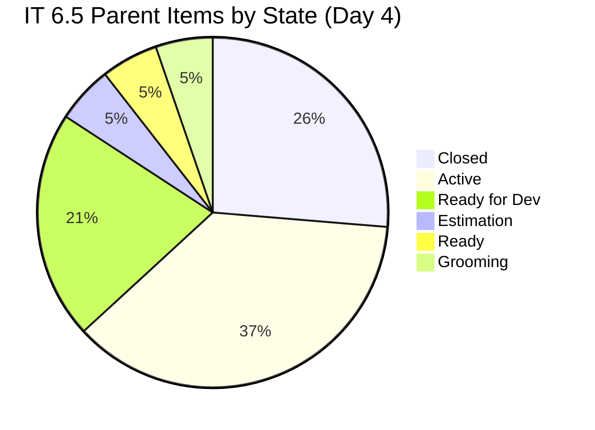

---

### 4.3 Story Points Summary (IT 6.5 Items Only)

| Status | Story Points | Day 3 | Change |
|---|---|---|---|
| ✅ Completed (Closed) | 5 SP | 5 SP | ↔ No change |
| 🔵 In Progress (Active) | 5 SP | 8 SP | ↓ -3 SP moved out |
| 🟡 Planned (Ready/RfD) | 7 SP | 12 SP | ↓ -5 SP moved out |
| 🔶 Estimation | 2 SP | 0 SP | ↑ +2 SP (200847 SP added) |
| 🟡 Ready | 1 SP | 1 SP | ↔ No change |
| ❌ Not Started (New/Grooming) | 0 SP | 0 SP | ↔ No change |
| **Total Committed (IT 6.5)** | **~20 SP** | **~25 SP** | **↓ -5 SP (3 items moved out)** |

> **Note:** Decrease in committed SP is **positive** — it reflects correct iteration hygiene, not scope reduction. Items 200256, 196898, 196984 were properly moved to their correct future iterations.

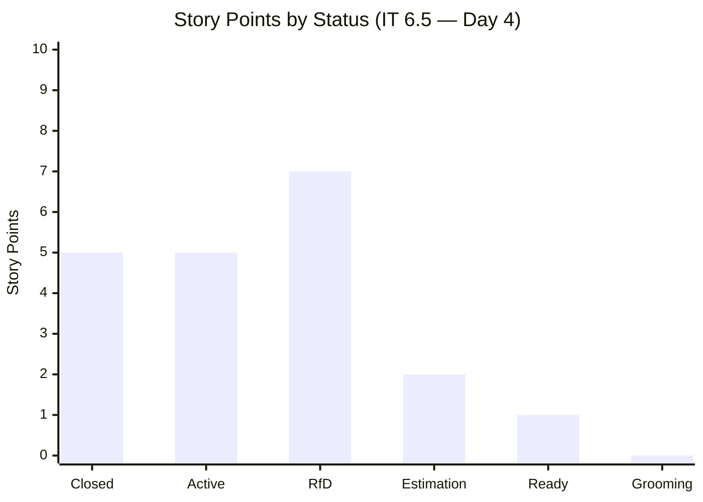

---

### 4.4 Task-Level Progress (IT 6.5 Parent Tasks Only)

| State | Day 3 Count | Day 4 Count | Change |
|---|---|---|---|
| ✅ Closed | 34 (all tasks) | **26** (IT 6.5 only) | See note |
| 🔵 Active | 7 | 7 | ↔ No change |
| 🆕 New | 23 | 19 | ↓ -4 |
| **Total** | **64** | **52** | — |

> **Note:** Day 3 audit counted ALL tasks including cross-iteration carryovers. Day 4 counts only tasks under IT 6.5 parent items (52 tasks) for a clean apples-to-apples IT 6.5 view. If including all board tasks: 35 Closed / 7 Active / 19 New = **61 total tasks**.

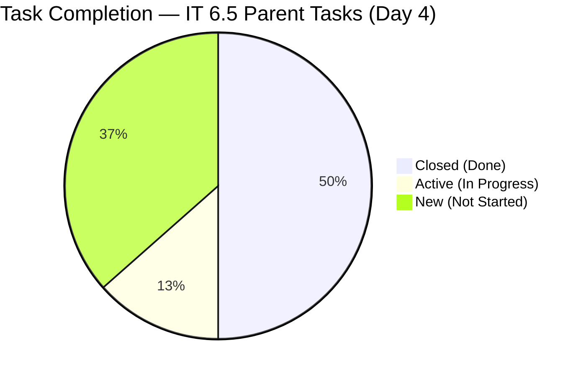

**Task completion rate (Day 4 of 14):** 26/52 = **50%** of IT 6.5 tasks done
**Expected linear pace:** 4/14 = **28.6%**
**Pace surplus: +21.4 percentage points** — strong execution momentum

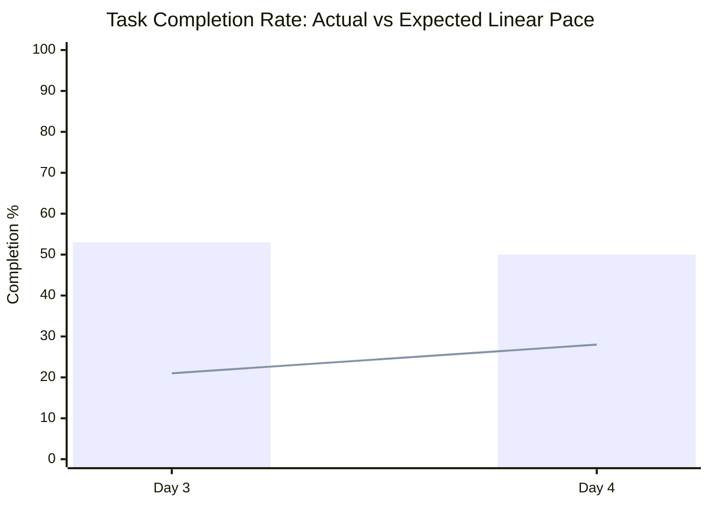
> *Bar = actual completion %; Line = expected linear pace. Note: Day 4 shows slight dip because IT 6.5-only scope is being measured more precisely.*

---

## 5. Workload Distribution by Assignee

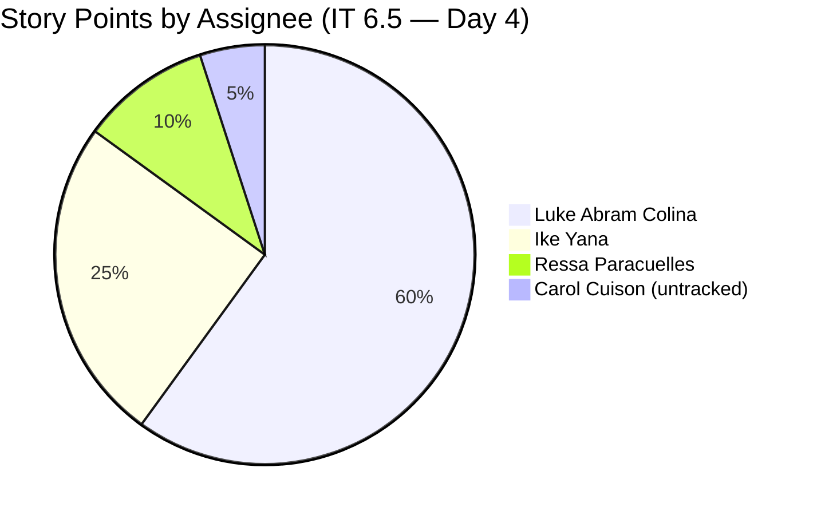

| Assignee | Active Items | RfD Items | SP Active | SP RfD | Total Load |
|---|---|---|---|---|---|
| Luke Abram Colina | 200193, 200196, 200840, 188867 | 200197, 200198, 198289, 200190 | 5 SP | 7 SP | 12 SP + design deps |
| Ike Yana | 200542 | 198298 | — | 1 SP | ~5 SP (closed items) |
| Ressa Paracuelles | 200506 | — | — | — | ~2 SP (collab/testing) |
| Carol Cuison | 199682 | — | — | — | Unestimated |
| Jaszmeine Villanueva | 195677 | — | — | — | Unestimated (design) |

> ⚠️ **Luke Concentration Risk Persists:** Luke holds 100% of dev story points in progress or queued (12 SP). This critical single point of failure was flagged in the Day 3 audit and remains unresolved.

---

## 6. SAFe Framework Compliance Review

### 6.1 Audit Recommendation Response Rate

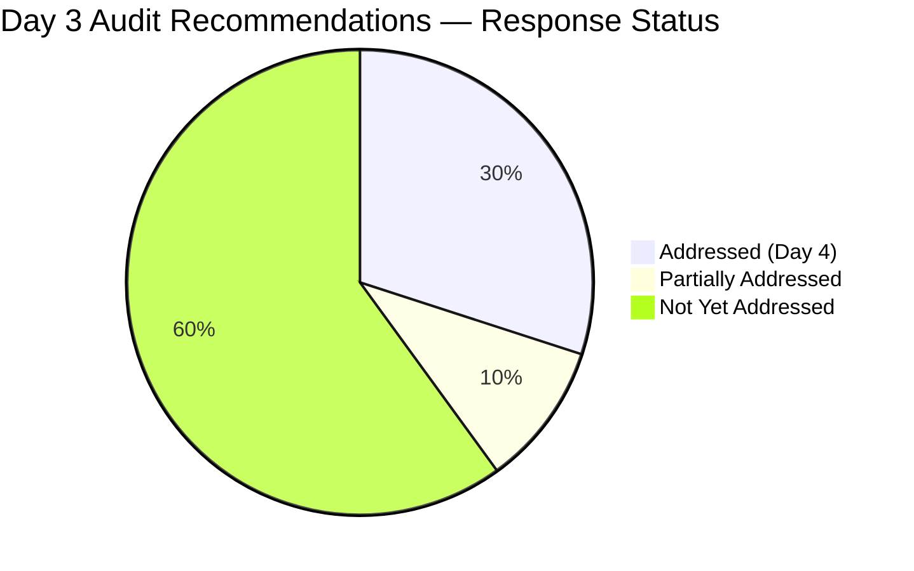

| # | Day 3 Recommendation | Status | Notes |
|---|---|---|---|
| 1 | Assign 200847 to IT 6.5 or IT 6.6 IP | ✅ Partial | Assigned to IT 6.5 with 2 SP; still in "Estimation" — not Ready |
| 2 | Close/defer 3 uninitiated spikes (196898, 196984, 198298) | ✅ 2 of 3 | 196898 → IT 6.6 IP; 196984 → PI7; 198298 still in Ready state |
| 3 | Finalize Vendor Categories Design (195677) | ❌ Not done | Still in Grooming |
| 4 | Resolve 188867 (aging defect from Iter. 4) | ❌ Not done | Still Active, no SP progress |
| 5 | Establish baseline velocity | 🔄 In progress | Sprint ongoing — IT 6.5 will provide first data point |
| 6 | Define Production Buffer for PI 7 | ❌ Not addressed | Future PI planning topic |
| 7 | Retrospective on uninitiated spikes | ❌ Not addressed | Future topic |

### 6.2 Definition of Ready (DoR) Compliance (Day 4)

| # | Item | Issue | Severity | vs Day 3 |
|---|---|---|---|---|
| 1 | 200847 (User Story) | State = "Estimation" — not yet Ready; no formal AC confirmation | 🟡 Medium | ✅ Improved (was High) |
| 2 | 199682 (Spike) | No SP; Active with untracked assignee | 🟡 Medium | 🆕 New concern |
| 3 | 195677 (Design) | No SP; still in Grooming | 🟡 Medium | No change |
| 4 | 200791 (Defect) | No SP; in IT 6.6 IP; still New | 🟡 Medium | No change |
| 5 | 200796 (Defect) | No SP; in IT 6.6 IP; still New | 🟡 Medium | No change |
| 6 | 200506, 200542 (Spikes) | No SP on collaboration tracking spikes | 🟢 Low | No change (acceptable) |

**DoR Compliance Rate (Day 4): 82%** — slight improvement (was 80% Day 3)

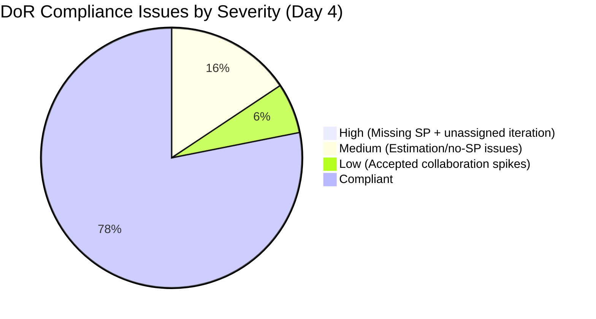

### 6.3 Cross-Iteration Contamination (Day 4)

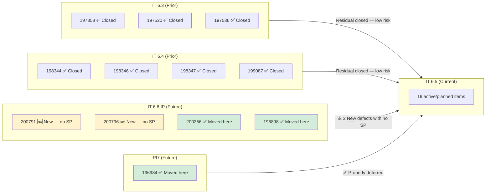

> **Improvement:** 3 previously misaligned items were correctly moved since Day 3, reducing cross-iteration noise. Two IT 6.6 IP defects (200791, 200796) remain on the board without SPs and need grooming before their IP sprint begins.

### 6.4 WIP Analysis (Day 4)

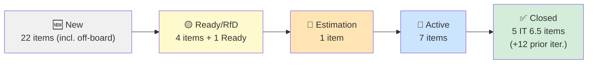

**WIP by individual (Active parent items):**
- Luke: 188867, 200196, 200193, 200840 — **4 active items**
- Ike: 200542 — 1 active
- Ressa: 200506 — 1 active
- Carol: 199682 — 1 active

> ⚠️ **Luke WIP elevated to 4 Active items.** Combined with 4 items in RfD assigned to him, his total pipeline is 8 items. This is a flow risk per SAFe WIP limit recommendations.

### 6.5 Defect Density (Day 4)

| Category | Count | % of IT 6.5 Items |
|---|---|---|
| Open Defects (Active/RfD) | 4 | ~21% |
| New (off-iteration) Defects | 2 | ~11% |
| Closed Defects (this sprint) | 4 | ~21% |
| User Stories (Active/Planned) | 5 | ~26% |
| Spikes | 4 | ~21% |

> 🔴 **188867 — Zero Code Progress Detected:** Dev-Implementation task (200516) shows 4 hrs Remaining Work unchanged since Day 3 (4 hr Remaining / 4 hr Completed). This suggests development restarted on this task or no coding progress has occurred, despite the parent being in "Active" state. This item has been deferred since Iteration 4 and carries the "Priority-defect" tag — it requires direct intervention.

---

## 7. Velocity & Burn Rate Analysis

### 7.1 Sprint Burn Projection

| Metric | Value |
|---|---|
| Days Elapsed | 4 |
| SP Closed | 5 SP |
| SP Burn Rate | 1.25 SP/day |
| SP Remaining (IT 6.5) | 15 SP |
| Days Remaining | 10 |
| Projected Completion | ~17.5 SP total |
| Committed SP (IT 6.5) | 20 SP |
| **Projected Deficit** | **~2.5 SP at risk** |

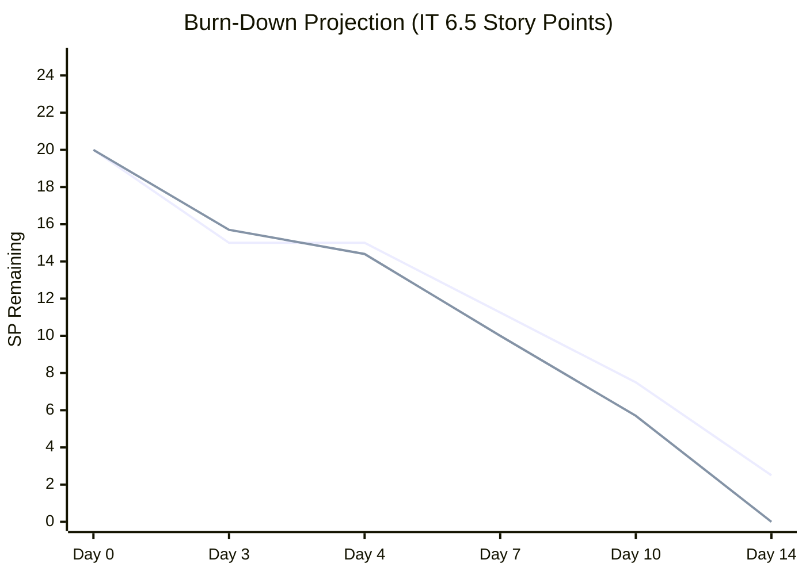
> *Solid line = ideal burn (completing all 20 SP by Day 14); Dashed = projected at current 1.25 SP/day pace.*

### 7.2 Audit-to-Audit Trend (Day 3 → Day 4)

| Metric | Day 3 (Mar 11) | Day 4 (Mar 12) | Trend |
|---|---|---|---|
| Parents Closed (IT 6.5) | 5 | 5 | ↔ No new closures |
| Parents Active | 6 | 7 | ↑ +1 (199682 activated) |
| SP Closed | 5 | 5 | ↔ No new SP burned |
| Tasks Closed (board-wide) | 34 | 35 | ↑ +1 |
| Tasks New/Pending | 23 | 19 | ↓ -4 (items moved) |
| DoR Compliance | 80% | 82% | ↑ +2% |
| SAFe Score | 6.4/10 | 6.5/10 | ↑ +0.1 |
| Items Properly Re-iterated | 0 | 3 | ✅ Positive |

---

## 8. Feature Theme Analysis

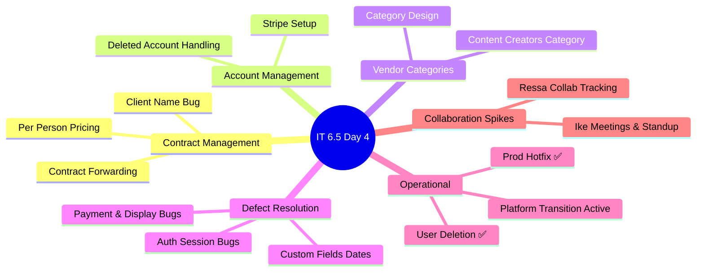

> **Theme count remains high (6+)** — No focus consolidation occurred between Day 3 and Day 4. SAFe recommends limiting sprint themes to reduce context-switching.

---

## 9. Key Findings & Risks

### 🔴 Critical Risks

| # | Finding | Recommendation |
|---|---|---|
| 1 | **188867 has zero code progress** (Dev-Implementation shows 4h remaining unchanged) | Pair Luke with Ike for focused implementation; escalate if blocked |
| 2 | **Luke owns 100% of dev SP pipeline** (12 SP Active/RfD) | Redistribute or formally document risk; Ike should absorb lower-SP items |
| 3 | **Sprint deficit projected at ~2.5 SP** at current 1.25 SP/day burn rate | Descope lowest-priority items (200847, 200197) to IT 6.6 IP if needed |

### 🟡 Medium Risks

| # | Finding | Recommendation |
|---|---|---|
| 4 | **Carol Cuison not in capacity plan** — contributing to sprint untracked | Add Carol to iteration capacity in ADO immediately |
| 5 | **200847 in Estimation state** — not Ready; risk of incomplete sprint item | Complete estimation and acceptance criteria; move to Ready for Dev |
| 6 | **200791 and 200796** still New with no SP in IT 6.6 IP | Groom and estimate before IT 6.6 IP begins |
| 7 | **195677 (Vendor Category Design)** still Grooming — blocks upcoming dev work | Prioritize design completion by sprint end |
| 8 | **198298 (Loading Images spike)** still in Ready — not activated | Activate or formally defer to IT 6.6 IP |

### 🟢 Positive Signals

| # | Finding |
|---|---|
| 1 | **3 items properly re-iterated** in response to Day 3 audit (200256, 196898, 196984) — demonstrates agile responsiveness |
| 2 | **Task completion at 50%** at Day 4 — still significantly above 28.6% expected linear pace |
| 3 | **200847 now assigned to IT 6.5 with SPs** — partially resolved from Day 3 High severity finding |
| 4 | **199682 now Active** — platform transition planning is underway |
| 5 | **DoR compliance improved** from 80% to 82% |
| 6 | **New QA analysis tasks created and closed** for multiple user stories (US Creation and Analysis tasks) — Ressa is actively supporting story decomposition |

---

## 10. SAFe Framework Scorecard

| Dimension | Day 3 Score | Day 4 Score | Change | Target |
|---|---|---|---|---|
| Iteration Planning | 6/10 | 7/10 | ↑ +1 | 9/10 |
| DoR Compliance | 8/10 | 7/10 | ↓ -1 | 9/10 |
| WIP Management | 7/10 | 6/10 | ↓ -1 | 8/10 |
| Defect Management | 5/10 | 5/10 | ↔ | 8/10 |
| Team Capacity Balance | 5/10 | 5/10 | ↔ | 8/10 |
| PI Alignment | 7/10 | 9/10 | ↑ +2 | 9/10 |
| Velocity Transparency | 5/10 | 6/10 | ↑ +1 | 8/10 |
| Collaboration Visibility | 8/10 | 8/10 | ↔ | 8/10 |
| **Overall** | **6.4/10** | **6.5/10** | **↑ +0.1** | **8.6/10** |

```mermaid
xychart-beta
    title "SAFe Dimension Scores: Day 3 vs Day 4"
    x-axis ["Iter Planning", "DoR", "WIP Mgmt", "Defect Mgmt", "Capacity", "PI Align", "Velocity", "Collab"]
    y-axis "Score /10" 0 --> 10
    bar [6, 8, 7, 5, 5, 7, 5, 8]
    bar [7, 7, 6, 5, 5, 9, 6, 8]
```
> *Day 3 (left) vs Day 4 (right). PI Alignment jumped +2 points thanks to proactive iteration re-alignment. DoR and WIP dipped slightly due to 200847's unfinished readiness and Luke's increased active item load.*

---

## 11. Recommendations for Next Audit (Day 7 — March 16, 2026)

1. **Resolve 188867** — Confirm whether Luke has progressed on dev-implementation (200516). Zero SP burned after 4 days is unacceptable for a priority defect.
2. **Add Carol Cuison to iteration capacity** in ADO (capacity, activities, days-off) to properly reflect actual sprint bandwidth.
3. **Complete 200847 DoR** — Move from Estimation to Ready for Dev with acceptance criteria finalized, or defer to IT 6.6 IP.
4. **Finalize 195677 (Vendor Category Design)** — The longer it stays in Grooming, the more future development iterations are at risk.
5. **Review Sprint Deficit Risk** — At 1.25 SP/day burn rate, ~2.5 SP may not complete. Consider formally descoping 200847 (2 SP) to IT 6.6 IP as a contingency.
6. **Activate or defer 198298** (Loading Images spike) — it has been in Ready state without activation for multiple audit cycles.
7. **Establish velocity baseline** — IT 6.5 will be the first formal data point. Track total SP closed vs planned to begin predictive planning.

---

## 12. Patterns & Trends (Inaugural Trend Analysis — Audits 1 & 2)

With two audits completed, the following early patterns are emerging:

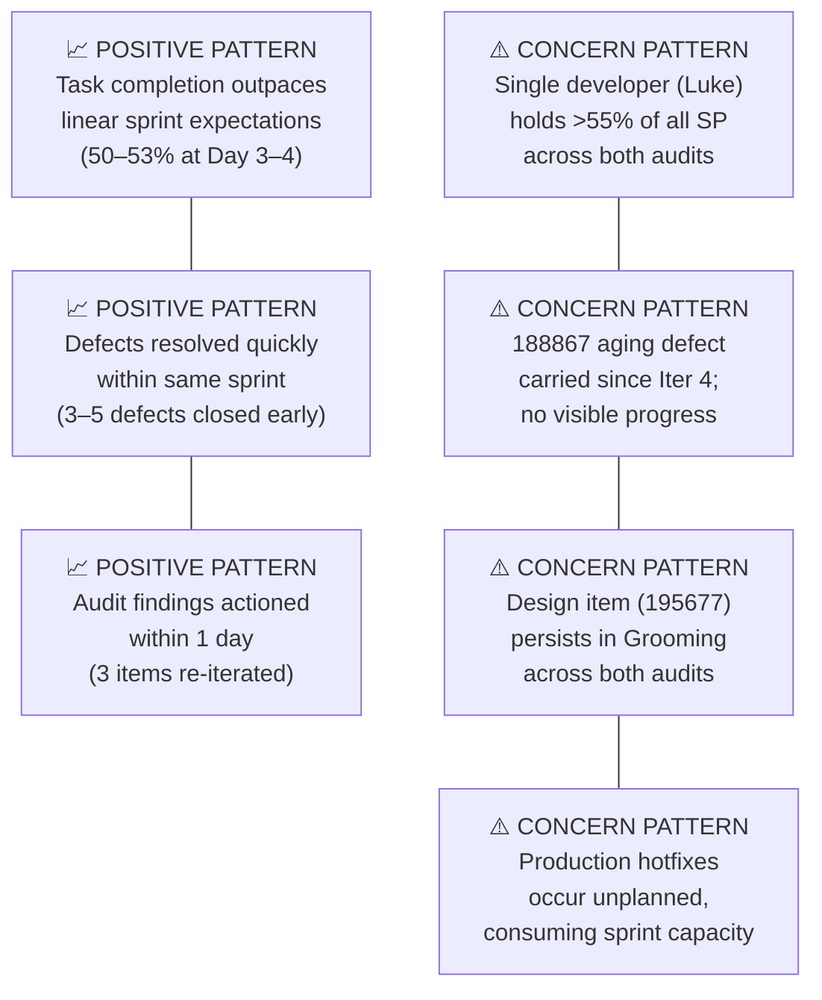

| Pattern | Type | Trend |
|---|---|---|
| Early-sprint defect resolution velocity | 🟢 Positive | Consistent across both audits |
| Task completion above linear pace | 🟢 Positive | Consistent |
| Audit finding responsiveness | 🟢 Positive | 3/7 recommendations acted on within 24h |
| Luke SPOF risk | 🔴 Systemic | Persistent — no mitigation observed |
| 188867 (aging defect) stall | 🔴 Systemic | Now 2 audits without SP progress |
| Design in Grooming blocking future work | 🟡 Risk | Persistent — no progress |
| Production hotfixes disrupting sprint | 🟡 Risk | Observed once (Day 3) — monitor for recurrence |

---

## 13. Audit Metadata

| Field | Value |
|---|---|
| **Report Generated** | 2026-03-12 00:30:43 |
| **ADO Project** | Flawless Wedding App |
| **ADO Org** | jairo (dev.azure.com/jairo) |
| **ADO Team** | Flawless Wedding App Team |
| **Team Board** | [View Board](https://dev.azure.com/jairo/Flawless%20Wedding%20App/_boards/board/t/Flawless%20Wedding%20App%20Team/Stories%20and%20Deliverables) |
| **Iteration ID** | 5603d84a-465d-4005-8654-1c0d8328c936 |
| **SAFe Reference** | [ScaledAgileFramework.com](https://ScaledAgileFramework.com) |
| **Previous Audit** | AUDIT_2026-03-11_193316 |
| **Next Audit Due** | Day 7 — March 16, 2026 (Ressa day off) |

---

*This report was generated as part of the scheduled `fl-dev-ado-audit` task and follows SAFe framework standards for iteration auditing. Trends and comparisons are derived from AUDIT_2026-03-11_193316 (inaugural report).*
