# Iteration Audit Report
**Project:** Flawless Wedding App
**Auditor:** SAFe Agile Project Manager (AI-Assisted)
**Audit Date:** March 16, 2026
**Audit Reference:** AUDIT_2026-03-16_230402

---

## 1. Executive Summary

This is the **third audit** for the Flawless Wedding App ADO project under the SAFe framework, building on the Day 4 report (`AUDIT_2026-03-12_003043`). The team is now on **Day 8 of 14** of Iteration 6.5 — the sprint midpoint.

**Current Iteration:** Iteration 6.5 (2026-PI6)
**Sprint Dates:** March 9 – March 22, 2026 *(Day 8 of 14 at time of audit)*

The sprint has entered a **QA-driven blocking phase**. Since the Day 4 audit, significant development work has been completed — 200847 (Coupon Scope) went from Estimation through full dev completion, 188867 (aging defect since Iteration 4) finally saw its dev tasks closed, and 200193 (Stripe Setup) advanced to "Passed QA Testing." However, QA testing has uncovered **6 new bugs** across 4 parent items, causing **5 parent items to enter "Blocked" state** simultaneously. Only 1 additional SP has been burned (6 total vs 5 at Day 4), and the burn rate has dropped to 0.75 SP/day.

The team is now at a critical juncture: with 6 days remaining and 16 SP still open, the sprint outcome depends entirely on how quickly blocked items can clear QA cycles. Today is also **Ressa's scheduled day off**, reducing QA capacity at the worst possible time.

**Overall SAFe Health Score: 🟡 Moderate (6.1 / 10)** — declined from 6.5 at Day 4, driven by flow congestion and blocked items.

---

## 2. Iteration Snapshot

| Attribute | Value |
|---|---|
| **PI** | 2026-PI6 |
| **Iteration** | 6.5 |
| **Start Date** | March 9, 2026 |
| **End Date** | March 22, 2026 |
| **Duration** | 14 days (2 weeks) |
| **Days Elapsed** | 8 |
| **Days Remaining** | 6 |
| **Team Size** | 4 planned + 1 designer + 1 unplanned (Carol Cuison) |

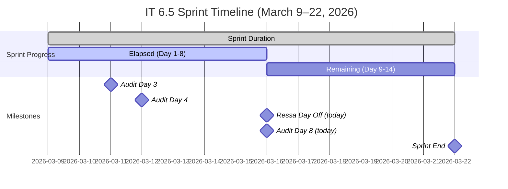

---

## 3. Team Capacity

| Team Member | Role | Capacity/Day | Days Off | Total Available | Remaining (Day 9–14) |
|---|---|---|---|---|---|
| Luke Abram Colina | Development | 6 hrs | 0 | ~84 hrs | ~36 hrs |
| Ike Yana | Development | 1 hr | 0 | ~14 hrs | ~6 hrs |
| Ressa Paracuelles | Testing | 3 hrs | 1 (Mar 16) | ~39 hrs | ~18 hrs |
| Luzmibel Paculanang | Testing | 1 hr | 0 | ~14 hrs | ~6 hrs |
| Carol Cuison ⚠️ | Unknown | **Not recorded** | Unknown | **Unknown** | **Unknown** |
| **Total (planned)** | | **11 hrs/day** | **1 day** | **~151 hrs** | **~66 hrs** |

> ⚠️ **Persistent Risk (Audit #3):** Carol Cuison (`ccuison@jairosoft.com`) remains assigned to spike 199682 but is **still not included in team capacity configuration**. This was first flagged in Audit #2 (Day 4) and remains unaddressed.

> ⚠️ **Today's Concern:** Ressa's scheduled day off falls on the audit day and during the QA-critical phase. With 5 blocked items awaiting QA resolution and 6 open bugs, losing 3 hrs/day of QA capacity today amplifies flow risk.

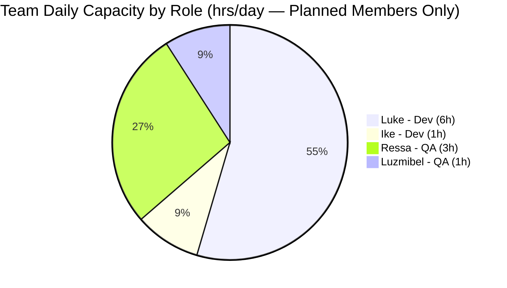

---

## 4. Sprint Backlog Analysis

### 4.1 Parent Work Item Inventory (IT 6.5)

#### User Stories

| ID | Title | State | SP | Assignee | Change Since Day 4 |
|---|---|---|---|---|---|
| 200193 | Remove Restriction on Stripe Setup Completion | ✅ Passed QA Testing | 1 | Luke | **⬆️ Active → Passed QA** |
| 200197 | Add "Per Person" Checkbox Under Price | 🔴 Blocked | 1 | Luke | **⬇️ Ready for Dev → Blocked** (Bug 201139) |
| 200198 | [Mobile and Web] Forwarding Contract Per Person | 🔴 Blocked | 3 | Luke | **⬇️ Ready for Dev → Blocked** (Bug 201138) |
| 200840 | Add Content Creators Vendor Category | 🔴 Blocked | 1 | Luke | **⬇️ Active → Blocked** (Bugs 201124, 201125) |
| 200847 | Add "Apply Coupon To" Field for Coupon Scope | 🔴 Blocked | 2 | Luke | **Dev done → Blocked** (Bugs 201164, 201165) |

#### Defects

| ID | Title | State | SP | Assignee | Change Since Day 4 |
|---|---|---|---|---|---|
| 200630 | [Mobile] Wrong Payment Breakdown After Revision | ✅ Closed | 1 | Ike | No change |
| 200631 | [Web] Download Revised Contract Incorrect Payment | ✅ Closed | 1 | Ike | No change |
| 200781 | [Mobile] Incorrect Amount in Auto Payment Notification | ✅ Closed | 1 | Ike | No change |
| 200876 | [Prod] Web Error Sending Messages (Hotfix) | ✅ Closed | 1 | Luke | No change |
| 188867 | [All] Client Name Not Displayed in Contract | 🔴 Blocked | 1 | Luke | **Dev tasks Closed → Parent Blocked** (QA in progress) |
| 200196 | [Vendor] Decimal Values Not Fully Displayed | 🔙 Back to Dev | 2 | Luke | **⬇️ Active → Back to Dev** (regression) |
| 198289 | Deleted Vendor Account Remains Logged In | 🟡 Ready for Dev | 1 | Luke | No change |
| 200190 | Deleted Client Account Cannot Be Reused | 🟡 Ready for Dev | 2 | Luke | No change |

#### Spikes

| ID | Title | State | SP | Assignee | Change Since Day 4 |
|---|---|---|---|---|---|
| 200864 | Delete Brandi Picardal (user mgmt) | ✅ Closed | 1 | Luke | No change |
| 200506 | Collaborations, Reports & Others | 🔵 Active | — | Ressa | No change |
| 200542 | Meetings, Collaboration & Others IT 6.5 | 🔵 Active | — | Ike | No change |
| 198298 | Revisit Loading Images Issue | 🔵 Active | 1 | Ike | **✅ Ready → Active** (task 201148 created) |
| 199682 | Plan Flawless Access Transition | 🔵 Active | — | Carol Cuison | No change |

#### Design

| ID | Title | State | SP | Assignee | Change Since Day 4 |
|---|---|---|---|---|---|
| 195677 | Vendor Categories Design | 🟡 Ready for Dev | 2 | Jaszmeine Villanueva | **✅ Grooming → Ready for Dev** |

#### Off-Iteration Items on Board

| ID | Title | State | SP | Iteration | Assignee | Change Since Day 4 |
|---|---|---|---|---|---|---|
| 201119 | [Mobile][iOS] Client Intake Form Submission Error | 🆕 New | — | PI6 (unassigned) | Unassigned | 🆕 New item |
| 201167 | [Vendor] Invoice Preview Coupon Reset Issue | 🆕 New | — | PI6 (unassigned) | Luke | 🆕 New item |
| 201058 | Change Shannon Hannold to Shannon Nofo | 🆕 New | — | IT 6.6 IP | Luke | 🆕 New item |
| 200791 | [Web] Incorrect Date on Custom Fields | 🆕 New | — | IT 6.6 IP | Ike | No change |
| 200796 | [Web] Inconsistent Grand Total in Download | 🆕 New | — | IT 6.6 IP | Ike | No change |

---

### 4.2 Work Item State Distribution (IT 6.5 — Day 4 vs Day 8)

```mermaid
xychart-beta
    title "Parent Item States: Day 4 vs Day 8 (IT 6.5 Items Only)"
    x-axis ["Closed", "Passed QA", "Active", "Blocked", "Back to Dev", "Ready/RfD", "Estimation"]
    y-axis "Count" 0 --> 10
    bar [5, 0, 7, 0, 0, 4, 1]
    bar [5, 1, 4, 5, 1, 3, 0]
```
> *Day 4 (left) vs Day 8 (right). The dramatic shift to Blocked (0 → 5) is the defining characteristic of this sprint phase. Active items dropped as items moved to Blocked or Passed QA.*

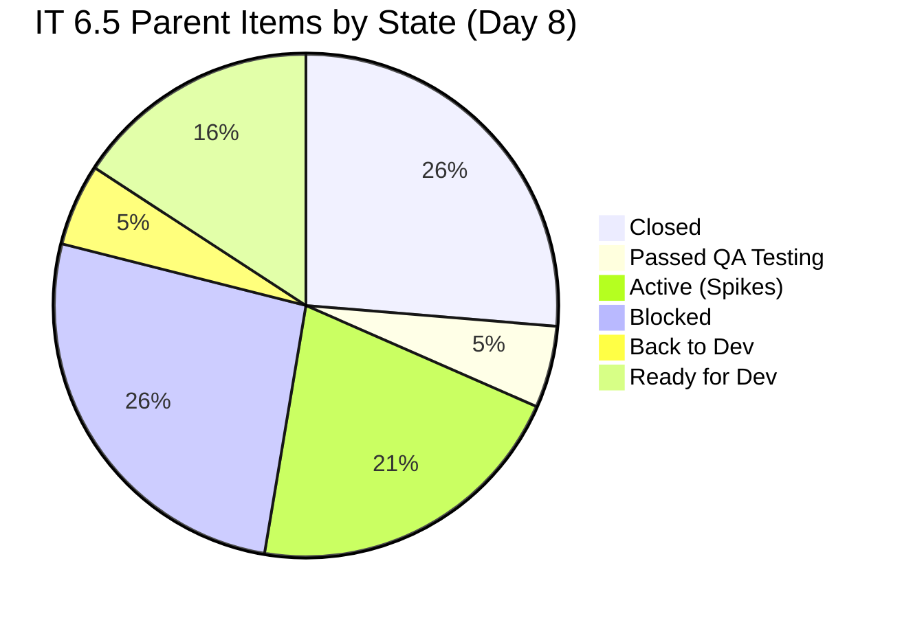

---

### 4.3 Story Points Summary (IT 6.5 Items Only)

| Status | Day 8 SP | Day 4 SP | Change |
|---|---|---|---|
| ✅ Closed | 5 SP | 5 SP | ↔ No change |
| ✅ Passed QA Testing | 1 SP | 0 SP | ↑ +1 SP (200193) |
| 🔴 Blocked | 8 SP | 0 SP | ⬆️ +8 SP (5 items blocked) |
| 🔙 Back to Dev | 2 SP | 0 SP | ⬆️ +2 SP (200196 regressed) |
| 🔵 Active (Spikes) | 1 SP | 5 SP | ↓ Items moved to other states |
| 🟡 Ready for Dev | 5 SP | 7 SP | ↓ Items moved to Blocked |
| 🔶 Estimation | 0 SP | 2 SP | ↓ 200847 progressed through dev |
| **Total Committed (IT 6.5)** | **~22 SP** | **~20 SP** | **↑ +2 SP (195677 gained SP)** |

> **Critical Insight:** While only 1 new SP was formally burned since Day 4 (200193 Passed QA), the underlying reality is more nuanced. Development work on 8 SP worth of items (188867, 200847, 200197, 200198, 200840) was completed — they are blocked due to **QA-discovered bugs**, not lack of development effort. The true bottleneck has shifted from development to QA resolution.

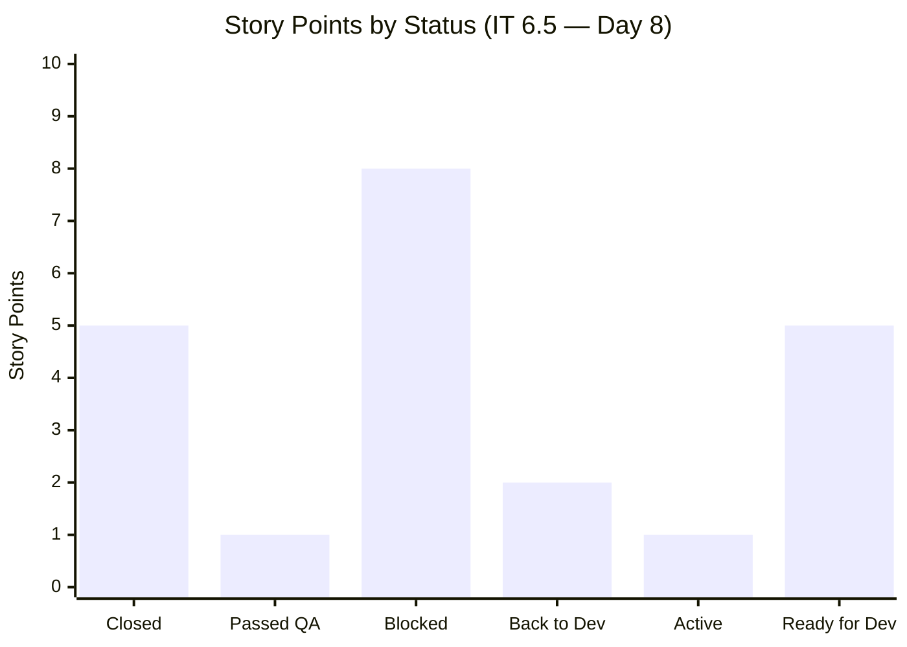

---

### 4.4 Task-Level Progress (All Board Tasks)

| State | Day 4 Count | Day 8 Count | Change |
|---|---|---|---|
| ✅ Closed | 35 | **55** | ↑ +20 |
| 🔵 Active | 7 | **11** | ↑ +4 |
| 🆕 New (Tasks) | 19 | **9** | ↓ -10 |
| 🐛 New (Bugs) | 0 | **6** | ⬆️ +6 (QA-discovered) |
| **Total** | **61** | **81** | ↑ +20 |

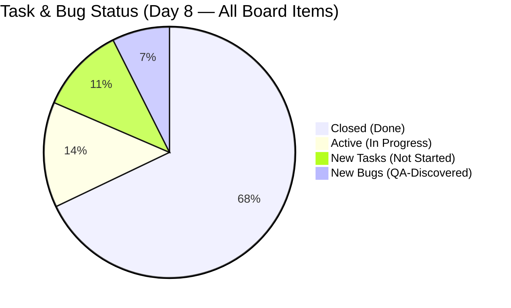

**Task completion rate (Day 8 of 14):** 55/81 = **67.9%** of tasks done
**Expected linear pace:** 8/14 = **57.1%**
**Pace surplus: +10.8 percentage points** — still above expected, but gap narrowing

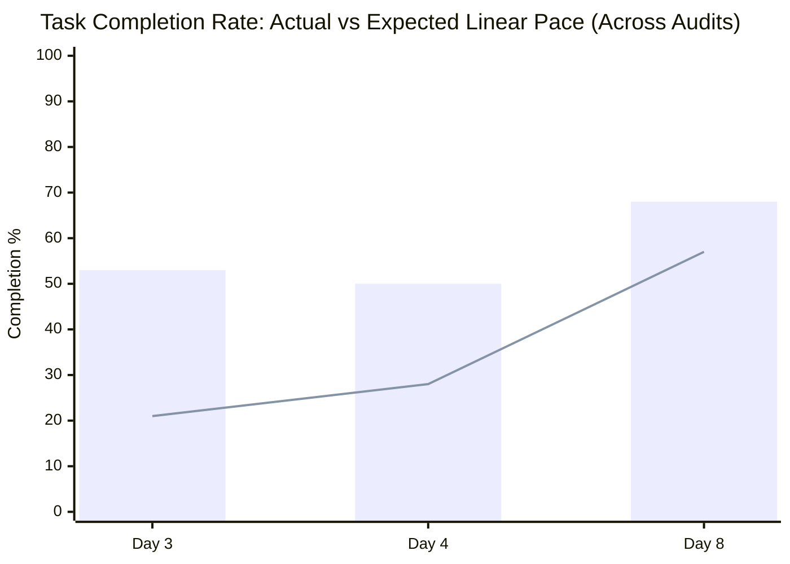
> *Bar = actual completion %; Line = expected linear pace. The gap has narrowed from +21.4pp (Day 4) to +10.8pp (Day 8) due to new work items being discovered (total items grew from 61 → 81).*

### 4.5 QA-Discovered Bugs (New Since Day 4)

| Bug ID | Parent | Title | Assignee | Severity Assessment |
|---|---|---|---|---|
| 201124 | 200840 | Existing vendor with multiple categories cannot log in after adding Content Creator | Luke | 🔴 High — login-breaking |
| 201125 | 200840 | Filtering by Content Creator shows all categories instead of only Content Creator | Luke | 🟡 Medium — display issue |
| 201138 | 200198 | Missing fields and original price field updated in contract forwarding | Luke | 🟡 Medium — data integrity |
| 201139 | 200197 | Per Person checkbox state not updated after saving | Luke | 🟡 Medium — state persistence |
| 201164 | 200847 | Error occurred when completing the payment | Luke | 🔴 High — payment-breaking |
| 201165 | 200847 | Display decimal value when selecting percentage discount type | Luke | 🟡 Medium — display issue |

> 🔴 **All 6 bugs are assigned to Luke**, compounding his already critical workload. Bugs 201124 (login-breaking) and 201164 (payment-breaking) are high-severity issues that must be resolved before their parent items can clear QA.

---

## 5. Workload Distribution by Assignee

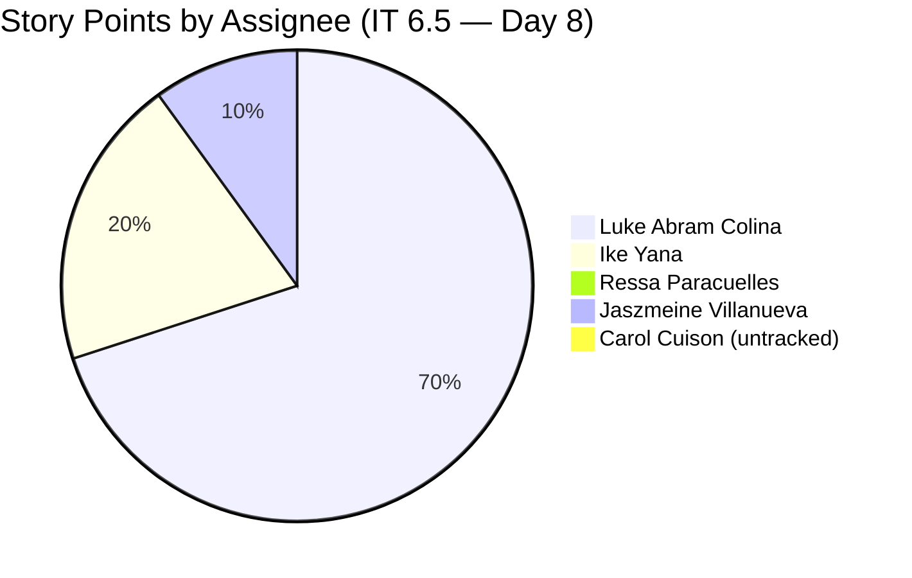

| Assignee | Blocked Items | Back to Dev | Active | RfD | Bugs to Fix | Total Load |
|---|---|---|---|---|---|---|
| Luke Abram Colina | 188867, 200197, 200198, 200840, 200847 | 200196 | — | 198289, 200190 | 6 bugs | **14 SP + 6 bugs** |
| Ike Yana | — | — | 200542, 198298 | — | — | ~1 SP + spikes |
| Ressa Paracuelles | — | — | 200506 | — | — | Collab/testing |
| Luzmibel Paculanang | — | — | — | — | — | QA testing tasks |
| Carol Cuison | — | — | 199682 | — | — | Unestimated |
| Jaszmeine Villanueva | — | — | — | 195677 | — | 2 SP (design) |

> 🔴 **CRITICAL — Luke Concentration Crisis Escalated:** Luke now carries 5 Blocked items (8 SP), 1 Back-to-Dev item (2 SP), 2 Ready-for-Dev items (3 SP), and **6 unresolved bugs** — all requiring his attention simultaneously. This is the most severe single-point-of-failure state observed across all three audits. His pipeline totals approximately 14 SP of parent work plus 6 bug fixes, with only ~36 hours of capacity remaining in the sprint.

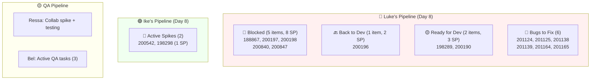

---

## 6. SAFe Framework Compliance Review

### 6.1 Day 4 Audit Recommendation Response Rate

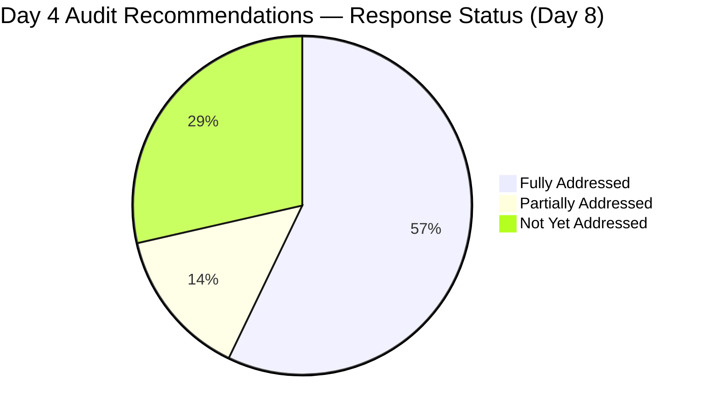

| # | Day 4 Recommendation | Status | Notes |
|---|---|---|---|
| 1 | Resolve 188867 (aging defect — zero code progress) | ✅ Addressed | Dev tasks 200515 + 200516 both Closed; now in QA (parent Blocked by QA findings) |
| 2 | Add Carol Cuison to iteration capacity | ❌ Not done | Still not in ADO capacity config — **3rd audit flagging this** |
| 3 | Complete 200847 DoR — move to Ready for Dev | ✅ Addressed | Dev tasks 201129-201131 all Closed; advanced through dev completely; now Blocked by QA bugs |
| 4 | Finalize 195677 (Vendor Category Design) | ✅ Addressed | Moved from Grooming → Ready for Dev (2 SP assigned) |
| 5 | Review Sprint Deficit Risk — consider descoping 200847 | 🔄 Partial | 200847 was not descoped — instead was developed; now Blocked with bugs |
| 6 | Activate or defer 198298 (Loading Images spike) | ✅ Addressed | Now Active with task 201148 created |
| 7 | Establish velocity baseline | 🔄 In progress | Sprint ongoing — completion data will be available at sprint end |

**Response Rate: 4/7 fully addressed (57%), 2/7 partial (29%), 1/7 unaddressed (14%)**

> ✅ **Significant improvement in audit responsiveness** compared to Day 4 (where only 3/7 were addressed). The team has demonstrated strong follow-through on development recommendations. The one persistent gap is Carol Cuison's capacity tracking.

### 6.2 Definition of Ready (DoR) Compliance (Day 8)

| # | Item | Issue | Severity | vs Day 4 |
|---|---|---|---|---|
| 1 | 201119 (Defect) | New; no SP; no assignee; iteration = PI6 (not assigned to specific IT) | 🔴 High | 🆕 New |
| 2 | 201167 (Defect) | New; no SP; iteration = PI6 (not assigned to specific IT) | 🟡 Medium | 🆕 New |
| 3 | 199682 (Spike) | No SP; Active with untracked assignee | 🟡 Medium | No change |
| 4 | 200791 (Defect) | No SP; in IT 6.6 IP; still New | 🟡 Medium | No change |
| 5 | 200796 (Defect) | No SP; in IT 6.6 IP; still New | 🟡 Medium | No change |
| 6 | 201058 (User Story) | New; no SP; in IT 6.6 IP | 🟡 Medium | 🆕 New |
| 7 | 200506, 200542 (Spikes) | No SP on collaboration tracking spikes | 🟢 Low | No change (acceptable) |

**DoR Compliance Rate (Day 8): 78%** — declined from 82% at Day 4 due to 3 new ungroomed items

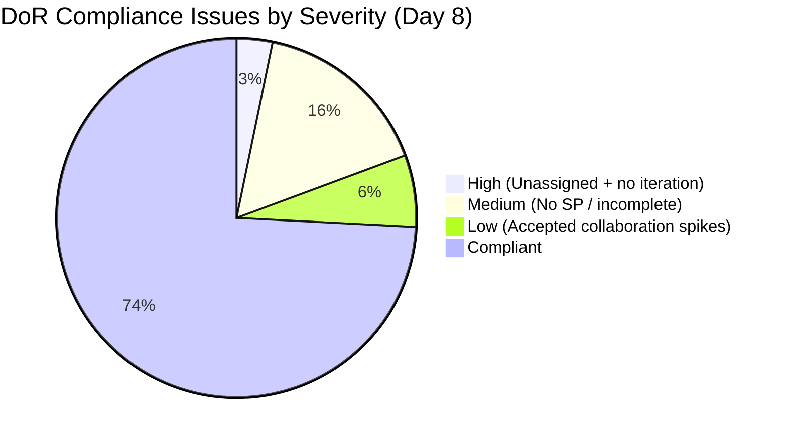

### 6.3 Cross-Iteration & New Item Flow (Day 8)

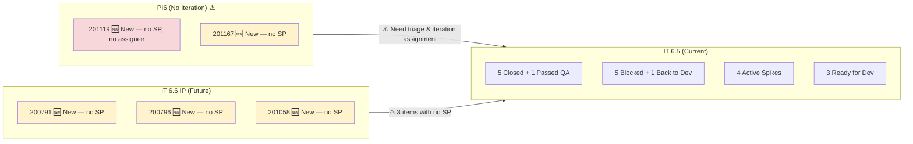

> **New Concern:** Two defects (201119, 201167) are parked at the PI6 level without iteration assignment. Item 201119 has no assignee at all. These need triage — either assign to IT 6.5 if urgent, or defer to IT 6.6 IP.

### 6.4 WIP & Flow Analysis (Day 8)

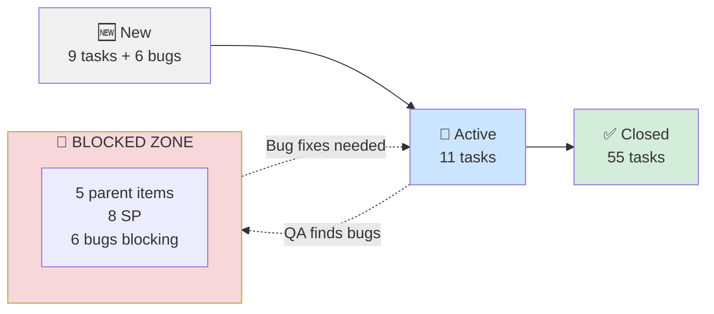

**WIP by individual (Parent items requiring attention):**
- **Luke: 8 parent items + 6 bugs** — 🔴 Severely overloaded
- Ike: 2 active spikes — 🟢 Manageable
- Ressa: 1 active spike — 🟢 Light (QA testing tasks ongoing)
- Luzmibel: 3 active QA tasks — 🟡 Moderate
- Carol: 1 active spike — 🟢 Light

> 🔴 **Flow Congestion Critical:** The sprint has entered a "blocked bottleneck" pattern where dev work is complete but cannot progress due to QA-discovered bugs. All 6 bugs funnel back to Luke, creating a circular dependency: Luke must fix bugs → QA must retest → items can close. With only 6 days remaining and Ressa off today, this loop must be broken immediately.

### 6.5 Defect & Bug Density (Day 8)

| Category | Count | Notes |
|---|---|---|
| Open Defects — Blocked | 1 (188867) | Aging defect, now in QA |
| Open Defects — Back to Dev | 1 (200196) | Regressed after QA |
| Open Defects — Ready for Dev | 2 (198289, 200190) | Not yet started |
| Closed Defects (this sprint) | 4 | Stable since Day 4 |
| **QA-Discovered Bugs (NEW)** | **6** | Under 4 parent items |
| Off-iteration Defects | 4 (201119, 201167, 200791, 200796) | Need triage |

> 🔴 **Bug Explosion:** 6 new bugs in 4 days represents a significant quality signal. While bug discovery during QA is expected and healthy, the volume and severity (login-breaking 201124, payment-breaking 201164) suggest that development may be moving too quickly without sufficient dev-level testing, or that the features have inherent complexity not captured in SP estimates.

---

## 7. Velocity & Burn Rate Analysis

### 7.1 Sprint Burn Projection

| Metric | Day 4 Value | Day 8 Value | Change |
|---|---|---|---|
| Days Elapsed | 4 | 8 | +4 |
| SP Closed/Passed QA | 5 SP | 6 SP | +1 SP |
| SP Burn Rate | 1.25 SP/day | 0.75 SP/day | ↓ -0.50 |
| SP Remaining | 15 SP | 16 SP | ↑ +1 (195677 gained SP) |
| Days Remaining | 10 | 6 | -4 |
| Projected Completion | ~17.5 SP | ~10.5 SP | ↓ -7 SP |
| Committed SP | 20 SP | 22 SP | +2 SP |
| **Projected Deficit** | **~2.5 SP** | **~11.5 SP** | **↓ -9 SP worsened** |

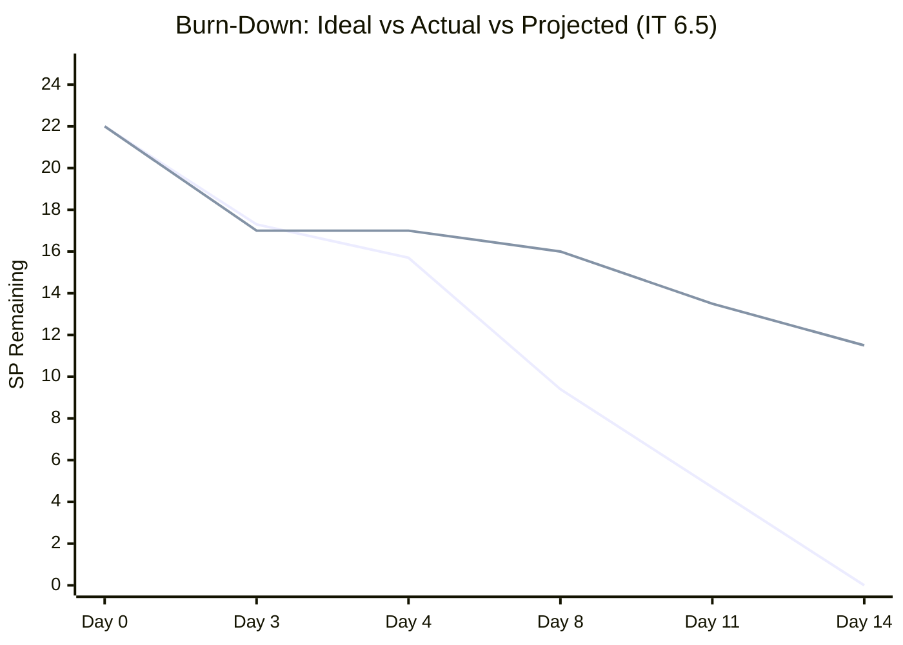
> *Top line = ideal burn (22 SP over 14 days); Bottom line = actual/projected at 0.75 SP/day. The gap has widened significantly at the midpoint.*

**However:** The raw burn rate understates progress. If blocked items clear QA, the team could potentially close 8+ SP rapidly. The true trajectory depends on Luke's bug-fix velocity this week.

### 7.2 Audit-to-Audit Trend (Day 3 → Day 4 → Day 8)

| Metric | Day 3 | Day 4 | Day 8 | Trend |
|---|---|---|---|---|
| Parents Closed (IT 6.5) | 5 | 5 | 5 | ↔ No new closures |
| Parents Passed QA | 0 | 0 | 1 | ↑ +1 (200193) |
| Parents Blocked | 0 | 0 | 5 | ⬆️ +5 (QA-driven) |
| SP Closed/Passed QA | 5 | 5 | 6 | ↑ +1 SP |
| Tasks Closed (board-wide) | 34 | 35 | 55 | ⬆️ +20 |
| Tasks Total | 64 | 61 | 81 | ⬆️ +20 (new work discovered) |
| Bugs Discovered | 0 | 0 | 6 | ⬆️ +6 |
| DoR Compliance | 80% | 82% | 78% | ↓ -4% |
| SAFe Score | 6.4 | 6.5 | 6.1 | ↓ -0.4 |

---

## 8. Feature Theme Analysis

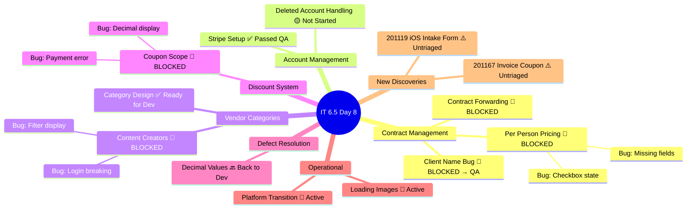

> **Theme observation:** Every major development theme except "Account Management" (Stripe) has encountered QA blockers. The Vendor Categories and Discount System themes each have 2 bugs, suggesting feature complexity was underestimated.

---

## 9. Key Findings & Risks

### 🔴 Critical Risks

| # | Finding | Recommendation |
|---|---|---|
| 1 | **5 parent items Blocked simultaneously (8 SP)** — sprint flow is congested at QA stage | Prioritize bug fixes by severity: 201164 (payment) and 201124 (login) first; defer lower-severity items if needed |
| 2 | **Luke carries 14 SP + 6 bugs** — extreme concentration risk has escalated to crisis level | **Immediate action:** Ike must absorb bug fixes on lower-SP items (201125, 201139, 201165 are display/state bugs); redistribute or formally descope |
| 3 | **Burn rate collapsed to 0.75 SP/day** — projected ~11.5 SP deficit at current pace | Accept that not all 22 SP will complete; formally descope 198289 (1 SP) and 200190 (2 SP) to IT 6.6 IP |
| 4 | **200196 regressed to Back to Dev (2 SP)** — QA found issues after dev thought it was done | Investigate root cause; consider whether this item needs re-estimation |

### 🟡 Medium Risks

| # | Finding | Recommendation |
|---|---|---|
| 5 | **Carol Cuison still not in capacity plan** — flagged for 3rd consecutive audit | Escalate to team lead; this is now a process compliance failure |
| 6 | **201119 has no assignee and no iteration** — floating defect at PI6 level | Triage immediately: assign owner, estimate SP, assign to IT 6.5 or IT 6.6 IP |
| 7 | **201167 at PI6 level without iteration** | Same as above — assign to appropriate iteration |
| 8 | **Ressa's day off today** reduces QA capacity during critical blocked phase | Luzmibel should prioritize retesting of items where Luke fixes bugs today |
| 9 | **DoR compliance dropped to 78%** due to 3 new ungroomed items | Groom 201119, 201167, 201058 before sprint end |

### 🟢 Positive Signals

| # | Finding |
|---|---|
| 1 | **188867 dev tasks finally completed** after being stalled since Iteration 4 — audit pressure drove resolution |
| 2 | **200847 went from Estimation → fully developed** in 4 days (3 dev tasks closed) — strong dev execution |
| 3 | **195677 (Design) moved to Ready for Dev** — long-standing Grooming blocker resolved after 3 audit flags |
| 4 | **198298 (Loading Images spike) activated** — task 201148 created and in progress |
| 5 | **20 additional tasks closed since Day 4** — task-level throughput is strong |
| 6 | **QA team is actively testing and finding real bugs** — this is healthy quality assurance behavior; the bugs would have been far more costly if found in production |
| 7 | **4/7 Day 4 recommendations fully addressed** — team audit responsiveness improved from 3/7 to 4/7 |

---

## 10. SAFe Framework Scorecard

| Dimension | Day 3 | Day 4 | Day 8 | Change (D4→D8) | Target |
|---|---|---|---|---|---|
| Iteration Planning | 6/10 | 7/10 | 7/10 | ↔ | 9/10 |
| DoR Compliance | 8/10 | 7/10 | 6/10 | ↓ -1 | 9/10 |
| WIP Management | 7/10 | 6/10 | 4/10 | ↓ -2 | 8/10 |
| Defect Management | 5/10 | 5/10 | 5/10 | ↔ | 8/10 |
| Team Capacity Balance | 5/10 | 5/10 | 4/10 | ↓ -1 | 8/10 |
| PI Alignment | 7/10 | 9/10 | 8/10 | ↓ -1 | 9/10 |
| Velocity Transparency | 5/10 | 6/10 | 6/10 | ↔ | 8/10 |
| Collaboration Visibility | 8/10 | 8/10 | 9/10 | ↑ +1 | 8/10 |
| **Overall** | **6.4/10** | **6.5/10** | **6.1/10** | **↓ -0.4** | **8.6/10** |

```mermaid
xychart-beta
    title "SAFe Dimension Scores: Day 4 vs Day 8"
    x-axis ["Planning", "DoR", "WIP", "Defects", "Capacity", "PI Align", "Velocity", "Collab"]
    y-axis "Score /10" 0 --> 10
    bar [7, 7, 6, 5, 5, 9, 6, 8]
    bar [7, 6, 4, 5, 4, 8, 6, 9]
```
> *Day 4 (left) vs Day 8 (right). WIP Management dropped sharply (-2) due to 5 simultaneous blocked items. Collaboration Visibility improved (+1) as team members are actively coordinating on QA and bug triage. Capacity Balance declined (-1) as Luke's overload worsened.*

**Score Rationale:**
- **WIP Management (4/10):** 5 blocked items + 6 bugs creating circular flow; no WIP limits enforced
- **Team Capacity Balance (4/10):** Luke now at ~200% overload; Ike significantly underutilized
- **Collaboration Visibility (9/10):** Active QA engagement, bug discovery, cross-team testing visible

---

## 11. Recommendations for Next Audit (Day 11 — March 19, 2026)

1. **🔴 URGENT: Triage and prioritize the 6 bugs by severity.** Fix 201164 (payment error) and 201124 (login issue) first — these are blocking the highest-value parent items (200847 at 2 SP, 200840 at 1 SP).

2. **🔴 URGENT: Redistribute bug fixes.** Ike should take ownership of display/state bugs (201125 — filter display, 201139 — checkbox state, 201165 — decimal display) to unblock Luke for critical fixes.

3. **🟡 Formally descope 198289 and 200190 to IT 6.6 IP.** These Ready-for-Dev items (3 SP combined) have not been started and cannot realistically be completed with 6 days remaining given the bug-fix backlog.

4. **🟡 Add Carol Cuison to capacity — FINAL WARNING.** This is the 3rd audit flagging this issue. If not resolved by next audit, this will be escalated as a process compliance violation.

5. **🟡 Triage items 201119 and 201167.** Assign to appropriate iterations, estimate SP, and assign owners. Unmanaged backlog items at the PI level create planning noise.

6. **🟢 Close 200193 formally** — it has passed QA testing and should be moved to Closed to capture the SP in velocity metrics.

7. **🟢 Monitor the blocked→closed conversion rate** over the next 3 days. If 3+ blocked items clear QA by Day 11, the sprint is still salvageable (potential 14+ SP completion). If fewer than 2 clear, consider a mid-sprint scope reset.

---

## 12. Patterns & Trends (3-Audit Longitudinal Analysis)

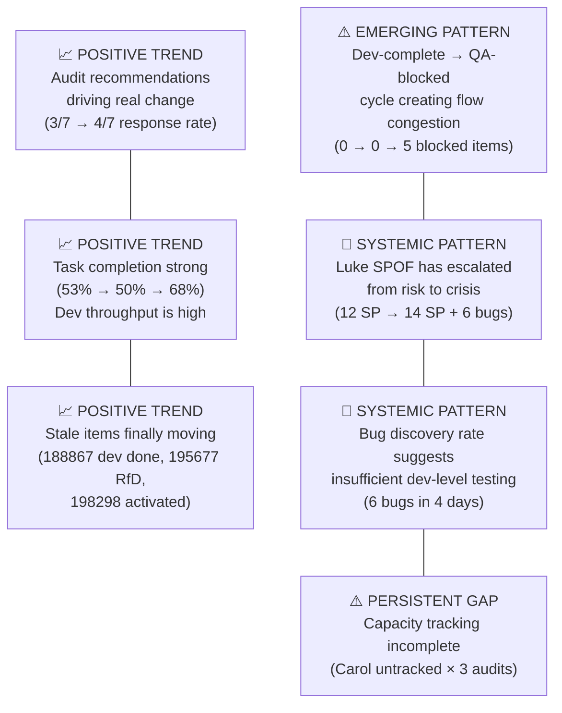

| Pattern | Type | Audit 1 | Audit 2 | Audit 3 | Trajectory |
|---|---|---|---|---|---|
| Task completion above linear pace | 🟢 Positive | 53% vs 21% | 50% vs 28% | 68% vs 57% | Consistent but gap narrowing |
| Audit finding responsiveness | 🟢 Positive | N/A | 3/7 | 4/7 | Improving |
| Stale item resolution | 🟢 Positive | Flagged | 2/3 addressed | All addressed | ✅ Resolved |
| Luke SPOF risk | 🔴 Systemic | 12 SP | 12 SP + RfD | 14 SP + 6 bugs | **Escalating** |
| QA-driven blocking | 🟡 Emerging | Not observed | Not observed | 5 items blocked | **New concern** |
| Bug discovery rate | 🟡 Emerging | 0 | 0 | 6 in 4 days | **New concern** |
| Carol capacity tracking | 🟡 Gap | Not observed | Flagged | Still unresolved | **Persistent** |
| SP burn rate | 🔴 Declining | N/A | 1.25 SP/day | 0.75 SP/day | **Declining** |

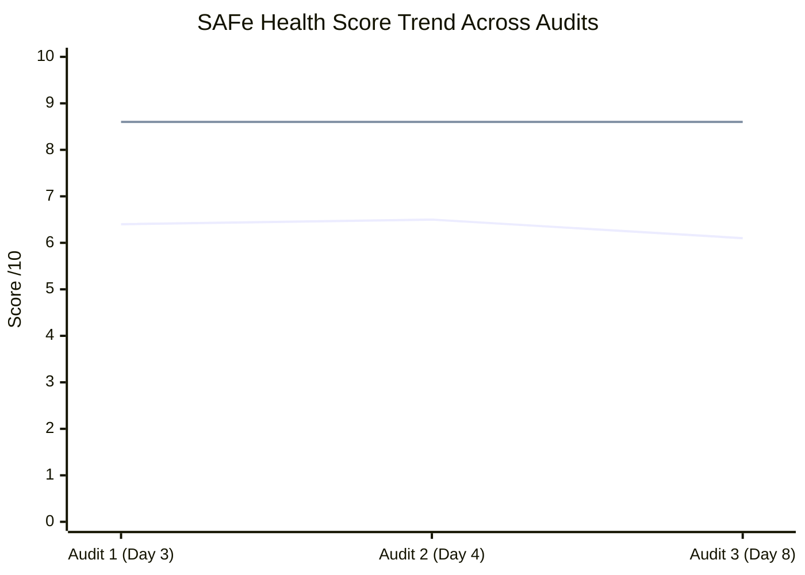
> *Bottom line = actual SAFe health score; Top line = target. The brief improvement at Day 4 has reversed, driven by flow congestion and workload imbalance.*

---

## 13. Sprint Outcome Scenarios (Day 8 Forecast)

| Scenario | Conditions | Projected SP Closed | Probability |
|---|---|---|---|
| 🟢 **Optimistic** | Luke fixes all 6 bugs by Day 10; QA clears 4+ blocked items | 14–16 SP | 15% |
| 🟡 **Likely** | Luke fixes critical bugs (2–3); 2–3 blocked items clear QA; 200190/198289 descoped | 10–12 SP | 50% |
| 🔴 **Pessimistic** | Bug fixes take longer; only 1–2 blocked items clear; limited QA capacity | 7–9 SP | 35% |

> **Recommendation:** Plan for the "Likely" scenario. Formally descope 198289 + 200190 (3 SP) now to reduce pressure and focus on unblocking the 5 blocked items.

---

## 14. Audit Metadata

| Field | Value |
|---|---|
| **Report Generated** | 2026-03-16 23:04:02 |
| **ADO Project** | Flawless Wedding App |
| **ADO Org** | jairo (dev.azure.com/jairo) |
| **ADO Team** | Flawless Wedding App Team |
| **Team Board** | [View Board](https://dev.azure.com/jairo/Flawless%20Wedding%20App/_boards/board/t/Flawless%20Wedding%20App%20Team/Stories%20and%20Deliverables) |
| **Iteration ID** | 5603d84a-465d-4005-8654-1c0d8328c936 |
| **SAFe Reference** | [ScaledAgileFramework.com](https://ScaledAgileFramework.com) |
| **Previous Audit** | AUDIT_2026-03-12_003043 |
| **Next Audit Due** | Day 11 — March 19, 2026 |

---

*This report was generated as part of the SAFe iteration audit series for the Flawless Wedding App project. Trends and comparisons are derived from AUDIT_2026-03-11_193316 (Audit #1) and AUDIT_2026-03-12_003043 (Audit #2). This is the third audit in the IT 6.5 series.*
