# Iteration Audit Report

**Project:** Flawless Wedding App
**Auditor:** SAFe Agile Project Manager (AI-Assisted)
**Audit Date:** March 18, 2026
**Audit Reference:** AUDIT_2026-03-18_173943

---

## 1. Executive Summary

This is **Audit #6** for the Flawless Wedding App under the SAFe framework, building on the Day 9 Delta report (`AUDIT_2026-03-17_173943.docx`). The team is now on **Day 10 of 14** of Iteration 6.5 — with 4 sprint days remaining.

**Current Iteration:** Iteration 6.5 (2026-PI6)
**Sprint Dates:** March 9 – March 22, 2026 *(Day 10 of 14 at time of audit)*

Day 10 marks the **most active single day of the entire sprint**. The board has undergone sweeping changes since the Day 9 Delta: 201119 (iOS Intake Form defect) went from untriaged, unassigned, and unestimated at PI6 level to **Passed QA Testing** with an assigned owner, iteration, SP, dev tasks completed, and QA passed — all in roughly 24 hours. This is the most dramatic single-item progression observed across all six audits. Two User Stories (200193 and 200197) have advanced to **Passed UAT Testing**, a new milestone state indicating client acceptance. Two previously Blocked items (200840 and 200196) have been **unblocked** and are now Ready for QA. Three bugs (201125, 201138, 201139) have been fully resolved or closed. The design item 195677 (Vendor Categories Design) has been **Closed** with both layout tasks completed.

However, 2 new bugs (201307, 201308) were discovered under 200198, keeping it Blocked. Bug 201164 (payment error) remains in "New" state — now on its 4th consecutive audit as the highest-priority unresolved item blocking 200847 (2 SP). A new defect 201219 has appeared on the board at PI6 level.

**Overall SAFe Health Score: 🟢 7.1 / 10** — the highest score of the audit series, up from 6.5 at Day 9, reflecting strong flow recovery and bug resolution.

---

## 2. Iteration Snapshot

| Attribute | Value |
|---|---|
| **PI** | 2026-PI6 |
| **Iteration** | 6.5 |
| **Start Date** | March 9, 2026 |
| **End Date** | March 22, 2026 |
| **Duration** | 14 days (2 weeks) |
| **Days Elapsed** | 10 |
| **Days Remaining** | 4 |
| **Team Size** | 4 planned + 1 designer + 1 unplanned (Carol Cuison) |

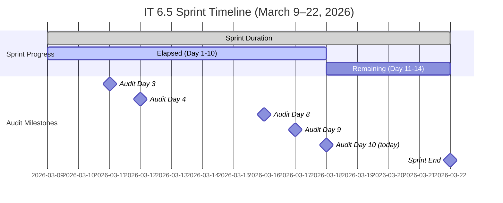

---

## 3. Team Capacity

| Team Member | Role | Capacity/Day | Days Off | Total Available | Remaining (Day 11–14) |
|---|---|---|---|---|---|
| Luke Abram Colina | Development | 6 hrs | 0 | ~84 hrs | ~24 hrs |
| Ike Yana | Development | 1 hr | 0 | ~14 hrs | ~4 hrs |
| Ressa Paracuelles | Testing | 3 hrs | 1 (Mar 16) | ~39 hrs | ~12 hrs |
| Luzmibel Paculanang | Testing | 1 hr | 0 | ~14 hrs | ~4 hrs |
| Carol Cuison ⚠️ | Unknown | **Not recorded** | Unknown | **Unknown** | **Unknown** |
| **Total (planned)** | | **11 hrs/day** | **1 day** | **~151 hrs** | **~44 hrs** |

> ⚠️ **Persistent Risk (Audit #6):** Carol Cuison (`ccuison@jairosoft.com`) remains assigned to spike 199682 but is **still not included in team capacity configuration**. This has been flagged in every audit since Audit #2.

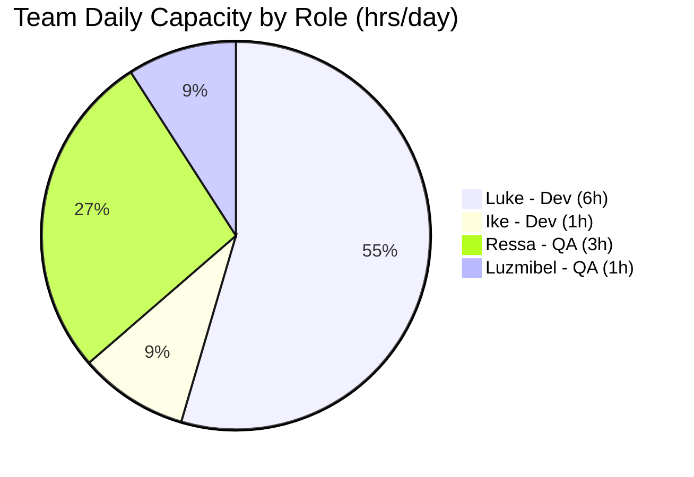

---

## 4. Sprint Backlog — Parent Work Items

### 4.1 User Stories

| ID | Title | State | SP | Assignee | Change Since Day 9 |
|---|---|---|---|---|---|
| 200193 | Remove Restriction on Stripe Setup Completion | ✅ Passed UAT Testing | 1 | Luke | **⬆️ Passed QA → Passed UAT** |
| 200197 | Add "Per Person" Checkbox Under Price | ✅ Passed UAT Testing | 1 | Luke | **⬆️ QA Testing → Passed UAT** |
| 200198 | [Mobile and Web] Forwarding Contract Per Person | 🔴 Blocked | 3 | Luke | Still Blocked (2 NEW bugs 201307, 201308) |
| 200840 | Add Content Creators Vendor Category | 🟢 Ready for QA | 1 | Luke | **⬆️ Blocked → Ready for QA** (bug 201125 resolved) |
| 200847 | Add "Apply Coupon To" Field for Coupon Scope | 🔴 Blocked | 2 | Luke | Still Blocked (201164 still New) |

### 4.2 Defects

| ID | Title | State | SP | Assignee | Change Since Day 9 |
|---|---|---|---|---|---|
| 200630 | [Mobile] Wrong Payment Breakdown After Revision | ✅ Closed | 1 | Ike | No change |
| 200631 | [Web] Download Revised Contract Incorrect Payment | ✅ Closed | 1 | Ike | No change |
| 200781 | [Mobile] Incorrect Amount in Auto Payment Notification | ✅ Closed | 1 | Ike | No change |
| 200876 | [Prod] Web Error Sending Messages (Hotfix) | ✅ Closed | 1 | Luke | No change |
| 201119 | [iOS] Client Intake Form Submit Error | ✅ Passed QA Testing | 1 | Luke | **⬆️ New (untriaged) → Passed QA Testing** 🌟 |
| 188867 | [All] Client Name Not Displayed in Contract | 🔙 Back to Dev | 1 | Luke | **Blocked → Back to Dev** (QA found new issues) |
| 200196 | [Vendor] Decimal Values Not Fully Displayed | 🟢 Ready for QA | 2 | Luke | **⬆️ Back to Dev → Ready for QA** (fixed!) |
| 198289 | Deleted Vendor Account Remains Logged In | 🔵 Active | 1 | Luke | **⬇️ QA Testing → Active** (rework needed) |
| 200190 | Deleted Client Account Cannot Be Reused | 🔵 Active | 2 | Luke | **⬇️ QA Testing → Active** (rework needed) |

### 4.3 Spikes & Design

| ID | Title | State | SP | Assignee | Change Since Day 9 |
|---|---|---|---|---|---|
| 195677 | Vendor Categories Design | ✅ **Closed** | 1 | Jaszmeine | **⬆️ Ready for Dev → Closed** (SP adjusted 2→1) |
| 200864 | Delete Brandi Picardal | ✅ Closed | 1 | Luke | No change |
| 200506 | Collaborations, Reports & Others | 🔵 Active | — | Ressa | No change |
| 200542 | Meetings, Collaboration & Others IT 6.5 | 🔵 Active | — | Ike | No change |
| 198298 | Revisit Loading Images Issue | 🔵 Active | 1 | Ike | No change |
| 199682 | Plan Flawless Access Transition | 🔵 Active | — | Carol Cuison | No change |

### 4.4 Off-Iteration Items on Board

| ID | Title | State | SP | Iteration | Assignee | Change Since Day 9 |
|---|---|---|---|---|---|---|
| 201167 | [Vendor] Invoice Preview Coupon Reset | 🆕 New | — | PI6 | Luke | No change |
| 201219 | [Archive] Archived Vendor Incorrect Email | 🆕 New | — | PI6 | Luke | **🆕 New item on board** |
| 201058 | Change Shannon Hannold to Shannon Nofo | Estimation | 1 | IT 6.6 IP | Luke | **New → Estimation** (SP assigned) |
| 200791 | [Web] Incorrect Date on Custom Fields | Estimation | 2 | **IT 7.1** | Ike | **Moved to PI7** (groomed, SP=2) |
| 200796 | [Web] Inconsistent Grand Total in Download | Estimation | 2 | **IT 7.1** | Luke | **Moved to PI7** (groomed, SP=2) |

> 🟢 **Positive:** Items 200791 and 200796 were properly groomed (SP assigned) and formally deferred to PI7/IT 7.1 — good backlog hygiene per Day 9 recommendation.

---

## 5. State Change Heatmap (Day 9 → Day 10)

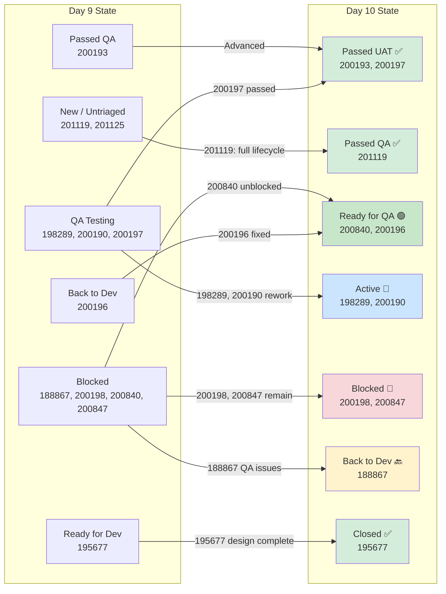

**13 of 19 IT 6.5 parent items changed state in one day.** This is the highest single-day movement of the entire sprint.

---

## 6. Story Points Summary (IT 6.5)

| Status | Day 8 | Day 9 | Day 10 | Change (D9→D10) |
|---|---|---|---|---|
| ✅ Closed | 5 SP | 5 SP | **6 SP** | ↑ +1 (195677 closed) |
| ✅ Passed UAT Testing | 0 SP | 0 SP | **2 SP** | ⬆️ +2 (200193, 200197) |
| ✅ Passed QA Testing | 1 SP | 1 SP | **1 SP** | ↔ (201119 new, 200193 advanced out) |
| 🟢 Ready for QA | 0 SP | 0 SP | **3 SP** | ⬆️ +3 (200840, 200196) |
| 🔵 Active | 1 SP | 1 SP | **4 SP** | ↑ +3 (198289, 200190 regressed to Active) |
| 🔴 Blocked | 8 SP | 7 SP | **5 SP** | ↓ -2 (200840 unblocked, 188867 moved) |
| 🔙 Back to Dev | 2 SP | 2 SP | **1 SP** | ↓ -1 (200196 fixed, 188867 entered) |
| **Total Committed** | **~22 SP** | **~22 SP** | **~22 SP** | — |

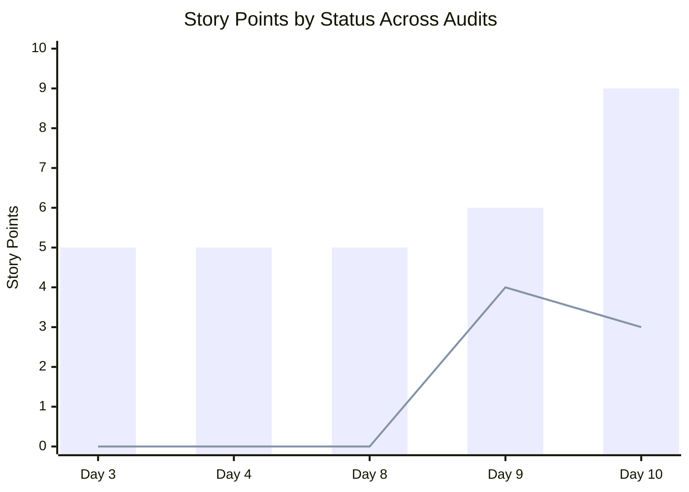

> *Bar = SP formally done (Closed + Passed UAT + Passed QA). Line = SP in QA pipeline (QA Testing + Ready for QA). Day 10 shows 9 SP effectively done and 3 SP at the QA doorstep.*

**Effective Progress:** 9 SP formally done/near-done + 3 SP Ready for QA = **12 SP** in done-or-near-done states (up from 10 SP at Day 9).

---

## 7. Burndown & Sprint Goal Probability

### 7.1 Burn Rate Trend

| Metric | Day 4 | Day 8 | Day 9 | Day 10 |
|---|---|---|---|---|
| Days Elapsed | 4 | 8 | 9 | **10** |
| SP Done (Closed + Passed UAT/QA) | 5 | 6 | 6 | **9** |
| Burn Rate (SP/day) | 1.25 | 0.75 | 1.11 | **0.90** |
| Days Remaining | 10 | 6 | 5 | **4** |
| Projected at Current Rate | ~17.5 | ~10.5 | ~12 | **~12.6** |

> The formal burn rate (0.90 SP/day) understates progress because 3 SP are in Ready for QA and 4 SP are in Active dev rework, meaning the pipeline is full.

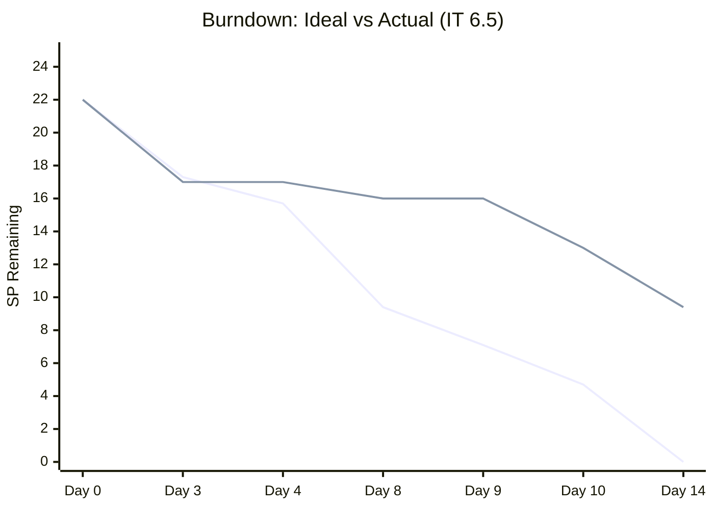

### 7.2 Sprint Goal Probability

| Scenario | Conditions | Projected SP | Probability |
|---|---|---|---|
| 🟢 **Optimistic** | Ready for QA items pass; 198289/200190 rework completes; 201164 fixed | 15–18 SP | 20% |
| 🟡 **Likely** | Ready for QA items pass; 1 of 2 Active items completes; 200847 remains blocked | 11–14 SP | 55% |
| 🔴 **Pessimistic** | QA finds new issues; Active rework stalls; limited closures | 9–11 SP | 25% |

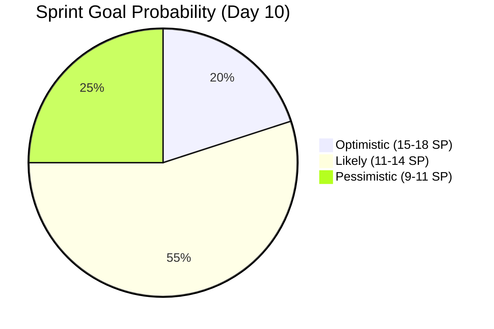

---

## 8. Bug Tracker

| Bug ID | Parent | Title | Day 9 State | Day 10 State | Change |
|---|---|---|---|---|---|
| 201124 | 200840 | Vendor login with Content Creator | Resolved | Resolved | No change |
| 201125 | 200840 | Filter shows all categories | New | **Resolved** | ⬆️ **FIXED** |
| 201138 | 200198 | Missing fields in contract | New | **Closed** | ⬆️ **FIXED & CLOSED** |
| 201139 | 200197 | Per Person checkbox not saved | Resolved | **Closed** | ⬆️ **Formally Closed** |
| 201164 | 200847 | Payment completion error | New | **New** | ⚠️ **4th audit — STILL UNFIXED** |
| 201165 | 200847 | Decimal on discount type | New | **Active** | ⬆️ Work started (1h done, 1h remaining) |
| 201307 | 200198 | Missing dropdown for add-ons (revise contract) | — | **New** | 🆕 **NEW BUG** |
| 201308 | 200198 | Missing fields per person (Mobile) | — | **New** | 🆕 **NEW BUG** |

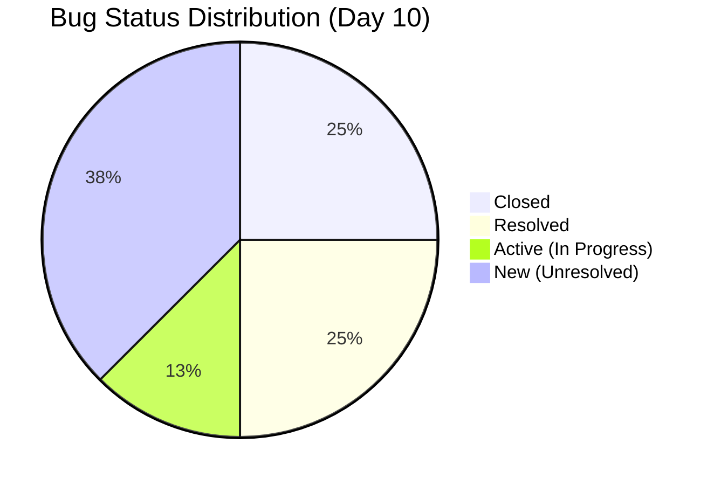

**Bug Resolution Rate:** 4 of 8 bugs resolved/closed (50%). Original 6 bugs: 4 resolved/closed, 1 active, 1 still New. Plus 2 new bugs discovered under 200198.

> 🔴 **Bug 201164 (payment error) has now been flagged as URGENT in 4 consecutive audits.** It remains the single highest-priority unresolved item in the sprint, blocking 200847 (2 SP).

---

## 9. Workload Distribution

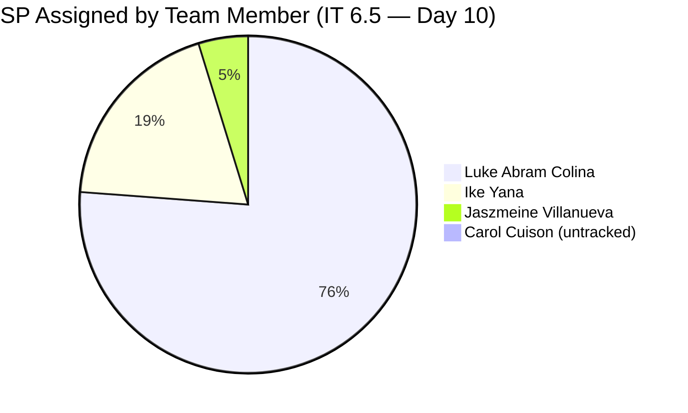

| Assignee | Done/UAT | Ready QA | Active | Blocked | Back Dev | Bugs Open | Load Summary |
|---|---|---|---|---|---|---|---|
| **Luke** | 200193(1), 200197(1), 201119(1) | 200840(1), 200196(2) | 198289(1), 200190(2) | 200198(3), 200847(2) | 188867(1) | 4 | **~16 SP + 4 bugs** |
| Ike | — | — | — | — | — | — | Active spikes only |
| Ressa | — | — | — | — | — | — | QA testing tasks |
| Luzmibel | — | — | — | — | — | — | QA testing tasks |
| Jaszmeine | 195677(1) | — | — | — | — | — | ✅ Complete |
| Carol | — | — | 199682(active) | — | — | — | Unestimated spike |

> 🔴 Luke's SPOF status persists, though the composition has shifted positively: 3 items are now in Done/UAT states (3 SP delivered), and 3 SP are Ready for QA. His active pipeline is clearing.

---

## 10. DoR Compliance

| # | Item | Issue | Severity | vs Day 9 |
|---|---|---|---|---|
| 1 | 201219 (Defect) | New; no SP; PI6 level (no iteration) | 🔴 High | 🆕 New item |
| 2 | 201167 (Defect) | New; no SP; PI6 level (no iteration) | 🟡 Medium | No change |
| 3 | 199682 (Spike) | No SP; Active with untracked assignee | 🟡 Medium | No change |
| 4 | 200506, 200542 (Spikes) | No SP on collaboration tracking spikes | 🟢 Low | No change |

**DoR Compliance Rate (Day 10): 85%** — improved from 78% at Day 9 due to 201119 getting fully triaged, and 200791/200796 being properly groomed and moved to PI7.

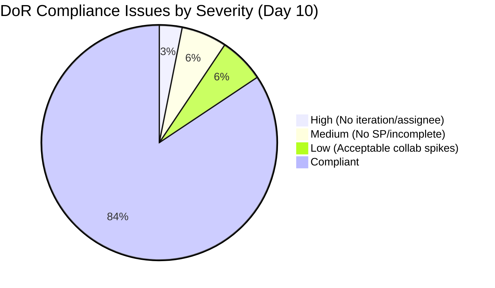

---

## 11. Day 9 Recommendation Follow-Up

| # | Recommendation | Status | Outcome |
|---|---|---|---|
| 1 | Fix bug 201164 (payment error) | ❌ **Still open** | Bug remains "New" — **4th audit flagging this** |
| 2 | Redistribute bugs 201125/201165 to Ike | 🔄 Partial | 201125 resolved by Luke (not redistributed); 201165 now Active |
| 3 | Close 200193 formally | ✅ **Addressed** | Advanced to Passed UAT Testing — progressed beyond the recommendation |
| 4 | Add Carol Cuison to capacity | ❌ **Not done** | Still not in ADO capacity config |
| 5 | Triage 201119 and 201167 | 🔄 Partial | 201119 fully triaged and through QA ✅; 201167 still untriaged ❌ |
| 6 | Monitor QA Testing pipeline | ✅ **Addressed** | 200197 passed through to UAT; 198289/200190 sent back for rework |
| 7 | Investigate 200196 stall | ✅ **Addressed** | Fixed and moved to Ready for QA (2 SP unlocked) |

**Response Rate: 3/7 fully addressed, 2/7 partially, 2/7 not addressed.**

> 🌟 **Outstanding Achievement:** 201119 went from completely untriaged (no assignee, no iteration, no SP) to Passed QA Testing in ~24 hours. This demonstrates the team's ability to rapidly triage and resolve when focused.

---

## 12. SAFe Framework Scorecard

| Dimension | Day 3 | Day 4 | Day 8 | Day 9 | Day 10 | Change (D9→D10) | Target |
|---|---|---|---|---|---|---|---|
| Iteration Planning | 6/10 | 7/10 | 7/10 | 7/10 | 7/10 | ↔ | 9/10 |
| DoR Compliance | 8/10 | 7/10 | 6/10 | 6/10 | 7/10 | ↑ +1 | 9/10 |
| WIP Management | 7/10 | 6/10 | 4/10 | 5/10 | 6/10 | ↑ +1 | 8/10 |
| Defect Management | 5/10 | 5/10 | 5/10 | 6/10 | 7/10 | ↑ +1 | 8/10 |
| Team Capacity Balance | 5/10 | 5/10 | 4/10 | 4/10 | 5/10 | ↑ +1 | 8/10 |
| PI Alignment | 7/10 | 9/10 | 8/10 | 8/10 | 8/10 | ↔ | 9/10 |
| Velocity Transparency | 5/10 | 6/10 | 6/10 | 7/10 | 8/10 | ↑ +1 | 8/10 |
| Collaboration Visibility | 8/10 | 8/10 | 9/10 | 9/10 | 9/10 | ↔ | 8/10 |
| **Overall** | **6.4/10** | **6.5/10** | **6.1/10** | **6.5/10** | **7.1/10** | **↑ +0.6** | **8.6/10** |

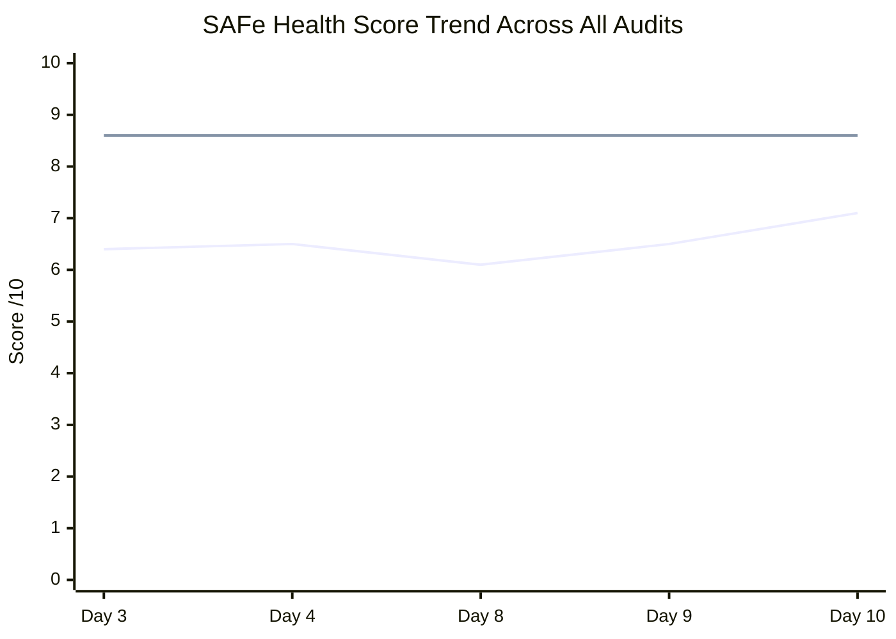

> *Bottom line = actual SAFe score; Top line = target. Day 10 marks the highest score in the series, with 5 of 8 dimensions improving. The recovery from Day 8's 6.1 trough to 7.1 is the strongest 2-day swing observed.*

**Score Rationale for Key Changes:**

- **DoR Compliance (6→7):** 201119 fully triaged; 200791/200796 groomed and moved to PI7 with SP assigned.
- **WIP Management (5→6):** Blocked items reduced from 4 to 2; Ready for QA pipeline emerging as healthy flow.
- **Defect Management (6→7):** 4 of 8 bugs resolved/closed (50%); 201138 Closed; 201125 Resolved; 201165 in Active dev.
- **Team Capacity Balance (4→5):** Jaszmeine closed design work; Ike contributing via meetings; QA team actively testing.
- **Velocity Transparency (7→8):** Clear UAT pipeline visible; burn rate recovery trajectory confirmed.

---

## 13. Risks & Remediation Actions

### 🔴 Critical Risks

| # | Risk | Remediation |
|---|---|---|
| 1 | **Bug 201164 (payment error) — 4th audit unfixed** — blocks 200847 (2 SP) | ESCALATE: This must be the #1 priority for Luke tomorrow. Every day of delay is now a sprint-end risk. |
| 2 | **200198 still Blocked (3 SP) with 2 NEW bugs** (201307, 201308) | These are the largest SP item remaining. Fix 201307/201308 to unlock 3 SP. |
| 3 | **198289 and 200190 regressed from QA Testing to Active** (3 SP in rework) | Determine root cause of QA failures. If rework is minor, target Ready for QA by Day 11. |

### 🟡 Medium Risks

| # | Risk | Remediation |
|---|---|---|
| 4 | **Carol Cuison still not in capacity plan** — 6th audit flagging | **FORMAL ESCALATION to management required.** This is now a documented SAFe compliance violation. |
| 5 | **201219 (new defect) has no iteration or SP** | Triage: assign to IT 6.6 IP or PI7 with SP estimate. |
| 6 | **201167 still untriaged at PI6 level** — 4th audit flagging | Same as above. Must be groomed before sprint end. |
| 7 | **188867 back to Back to Dev** — this aging defect (since IT 4) has cycled between states repeatedly | Determine if this should be formally descoped to PI7 rather than continuing the blocked/back-to-dev cycle. |

### 🟢 Positive Signals

| # | Finding |
|---|---|
| 1 | **201119: Untriaged → Passed QA in ~24 hours** — fastest item lifecycle in audit series |
| 2 | **200197 and 200193 advanced to Passed UAT Testing** — client acceptance milestone reached |
| 3 | **195677 (Design) Closed** — Jaszmeine completed both layout tasks; first design closure in sprint |
| 4 | **3 bugs resolved/closed in one day** (201125, 201138, 201139) — strongest bug resolution day |
| 5 | **200196 fixed and Ready for QA** — was stalled in Back to Dev since Day 8; unlocked 2 SP |
| 6 | **200840 unblocked** — bug 201125 resolved, enabling QA progression |
| 7 | **200791/200796 properly groomed and moved to PI7** — good backlog hygiene per audit recommendation |
| 8 | **SAFe Health Score hit 7.1** — highest of the audit series, with 5 dimensions improving |
| 9 | **13 of 19 parent items changed state** — most active single day of the sprint |

---

## 14. Longitudinal Trend Analysis (6 Audits)

| Metric | Day 3 | Day 4 | Day 8 | Day 9 | Day 10 | Trajectory |
|---|---|---|---|---|---|---|
| SP Done (Closed + Passed UAT/QA) | 5 | 5 | 6 | 6 | **9** | ⬆️ Accelerating |
| SP Blocked | 0 | 0 | 8 | 7 | **5** | ↓ Improving |
| SP Ready for QA | 0 | 0 | 0 | 0 | **3** | ⬆️ New pipeline |
| Tasks Closed (board-wide) | 34 | 35 | 55 | 60 | **~68** | ⬆️ Accelerating |
| Bugs Total | 0 | 0 | 6 | 6 | **8** | ↑ Discovery ongoing |
| Bugs Resolved/Closed | 0 | 0 | 0 | 2 | **4** | ⬆️ Improving |
| DoR Compliance | 80% | 82% | 78% | 78% | **85%** | ⬆️ Improving |
| SAFe Score | 6.4 | 6.5 | 6.1 | 6.5 | **7.1** | ⬆️ Best ever |

```mermaid
xychart-beta
    title "SP Done vs SP Blocked Across Audits"
    x-axis ["Day 3", "Day 4", "Day 8", "Day 9", "Day 10"]
    y-axis "Story Points" 0 --> 10
    bar [5, 5, 6, 6, 9]
    bar [0, 0, 8, 7, 5]
```

> *Green bars = SP done; Red bars = SP blocked. The crossover at Day 10 marks the inflection point where done SP exceeds blocked SP for the first time since the QA-blocking phase began.*

---

## 15. Recommendations for Next Audit (Day 12 — March 20, 2026)

1. **🔴 ESCALATE: Fix bug 201164 (payment error) — 4th consecutive audit.** This is now a process failure. If not fixed by Day 12, formally descope 200847 (2 SP) to PI7 and document the reason.

2. **🔴 Fix bugs 201307 and 201308** to unblock 200198 (3 SP). This is the highest-SP blocked item remaining.

3. **🟡 Complete rework on 198289 (1 SP) and 200190 (2 SP).** These regressed from QA and need rapid turnaround to contribute to sprint velocity.

4. **🟡 QA team: Prioritize testing 200840 (1 SP) and 200196 (2 SP).** Both are Ready for QA — quick wins to add 3 SP to the sprint.

5. **🟡 Triage 201219 and 201167.** Assign iterations and SP estimates. Both are floating at PI6 level.

6. **🟡 Formally escalate Carol Cuison capacity gap to management.** 6 audit flags is a documented SAFe compliance violation.

7. **🟢 Close 200193 and 200197 formally** once UAT sign-off is received — these 2 SP should be captured in velocity.

---

## 16. Audit Metadata

| Field | Value |
|---|---|
| **Report Generated** | 2026-03-18 17:39:43 |
| **ADO Project** | Flawless Wedding App |
| **ADO Org** | jairo (dev.azure.com/jairo) |
| **ADO Team** | Flawless Wedding App Team |
| **Team Board** | [View Board](https://dev.azure.com/jairo/Flawless%20Wedding%20App/_boards/board/t/Flawless%20Wedding%20App%20Team/Stories%20and%20Deliverables) |
| **Iteration ID** | 5603d84a-465d-4005-8654-1c0d8328c936 |
| **SAFe Reference** | [ScaledAgileFramework.com](https://ScaledAgileFramework.com) |
| **Previous Audit** | AUDIT_2026-03-17_173943.docx (Day 9 Delta) |
| **Next Audit Due** | Day 12 — March 20, 2026 |

---

*This report was generated as part of the SAFe iteration audit series for the Flawless Wedding App project (PI 2026-PI6, IT 6.5). It is the sixth audit in the series. Trends and comparisons are derived from Audit #1 (Day 3), Audit #2 (Day 4), Audit #3 (Day 8), Audit #4 (Day 9), and Audit #5 (Day 9 Delta). This audit marks the highest SAFe Health Score (7.1/10) observed in the series.*
