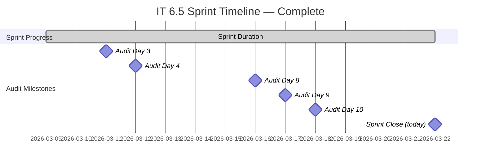
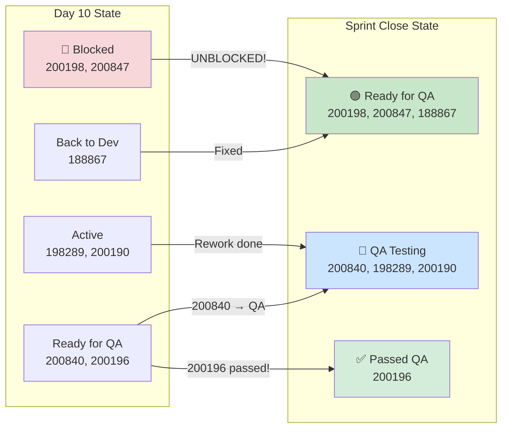
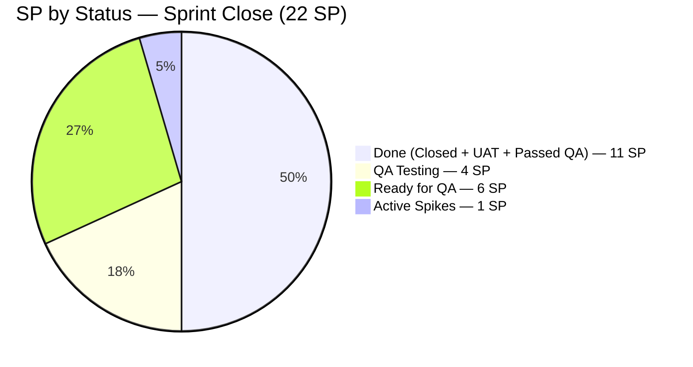
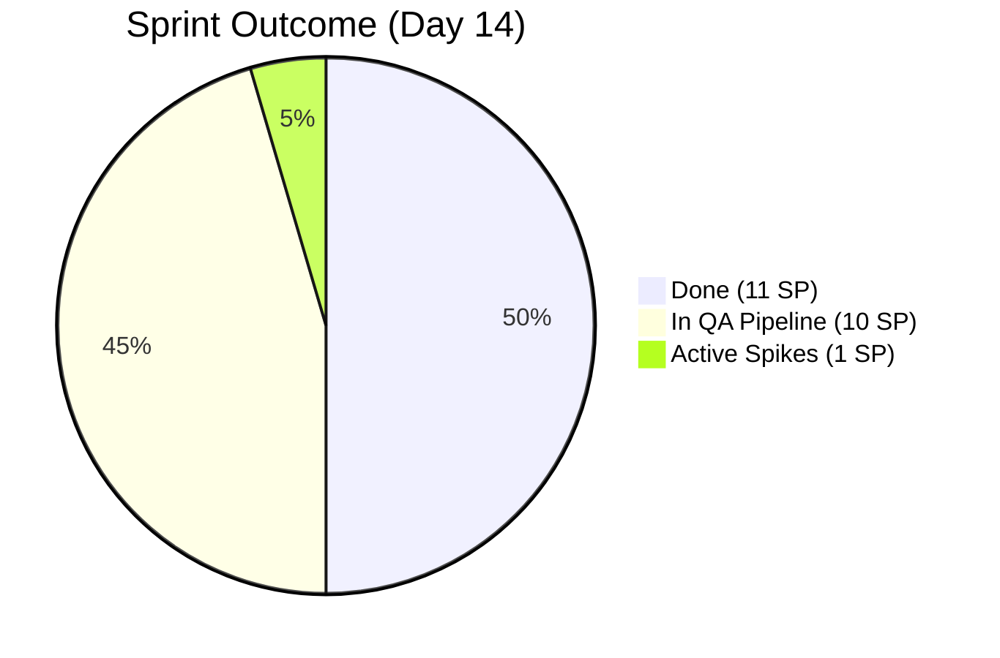
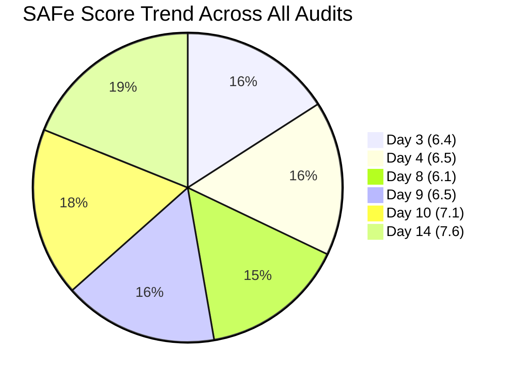

# Iteration Audit Report — Sprint Close

**Project:** Flawless Wedding App
**Auditor:** SAFe Agile Project Manager (AI-Assisted)
**Audit Date:** March 22, 2026
**Audit Reference:** AUDIT_2026-03-22_2329

---

## 1. Executive Summary

This is **Audit #7** — the **sprint-end audit** for Iteration 6.5. The team is on **Day 14 of 14** (100% elapsed). The sprint closes today, March 22, 2026.

**Current Iteration:** Iteration 6.5 (2026-PI6)
**Sprint Dates:** March 9 – March 22, 2026

The sprint closes with **remarkable late-sprint recovery**. Both previously Blocked items — #200198 (3 SP, blocked since Day 3) and #200847 (2 SP, blocked by bug 201164 through 5 consecutive audits) — have been **unblocked** and advanced to Ready for QA. The QA pipeline is now overflowing with 10 SP worth of items awaiting or in testing. The rework items (#198289, #200190) have completed fixes and returned to QA Testing. The aging defect #188867 has finally been fixed after cycling through states across multiple iterations.

**Sprint Outcome:** 11 SP formally done (Closed/Passed UAT/Passed QA), with an additional 10 SP in the QA pipeline (QA Testing + Ready for QA). The development team completed all feature work — the constraint at sprint close is **QA throughput**, not development.

**Overall SAFe Health Score: 🟢 7.6 / 10** — the highest in the audit series, up from 7.1 at Day 10.

---

## 2. Iteration Snapshot

| Attribute | Value |
|---|---|
| **PI** | 2026-PI6 |
| **Iteration** | 6.5 |
| **Start Date** | March 9, 2026 |
| **End Date** | March 22, 2026 |
| **Days Elapsed** | 14 (100%) |
| **Days Remaining** | 0 |
| **Team Capacity** | 11 hrs/day, 1 total day off |

---

## 3. Sprint Backlog — Final State

### 3.1 User Stories

| ID | Title | Day 10 State | Sprint Close State | SP | Change |
|---|---|---|---|---|---|
| 200193 | Remove Restriction on Stripe Setup | Passed UAT | ✅ Passed UAT | 1 | — |
| 200197 | Add "Per Person" Checkbox Under Price | Passed UAT | ✅ Passed UAT | 1 | — |
| 200198 | Forwarding Contract Per Person | 🔴 Blocked | **🟢 Ready for QA** | 3 | **UNBLOCKED** |
| 200840 | Add Content Creators Vendor Category | Ready for QA | **🔵 QA Testing** | 1 | **Advanced** |
| 200847 | Add "Apply Coupon To" Field | 🔴 Blocked | **🟢 Ready for QA** | 2 | **UNBLOCKED** |

### 3.2 Defects

| ID | Title | Day 10 State | Sprint Close State | SP | Change |
|---|---|---|---|---|---|
| 200630 | Wrong Payment Breakdown (Mobile) | Closed | ✅ Closed | 1 | — |
| 200631 | Incorrect Payment (Web Download) | Closed | ✅ Closed | 1 | — |
| 200781 | Incorrect Auto Payment Notification | Closed | ✅ Closed | 1 | — |
| 200876 | Web Error Sending Messages (Hotfix) | Closed | ✅ Closed | 1 | — |
| 201119 | iOS Client Intake Form Error | Passed QA | ✅ Passed QA | 1 | — |
| 200196 | Decimal Values Not Fully Displayed | Ready for QA | **✅ Passed QA** | 2 | **Passed QA!** |
| 188867 | Client Name Not in Contract | Back to Dev | **🟢 Ready for QA** | 1 | **Fixed!** |
| 198289 | Deleted Vendor Still Logged In | Active | **🔵 QA Testing** | 1 | **Rework done → QA** |
| 200190 | Deleted Client Can't Be Reused | Active | **🔵 QA Testing** | 2 | **Rework done → QA** |

### 3.3 Spikes & Design

| ID | Title | State | SP | Change |
|---|---|---|---|---|
| 195677 | Vendor Categories Design | ✅ Closed | 1 | — |
| 200864 | Delete Brandi Picardal | ✅ Closed | 1 | — |
| 200506 | Collaborations, Reports & Others | Active | — | — |
| 200542 | Meetings, Collaboration & Others | Active | — | — |
| 198298 | Revisit Loading Images Issue | Active | 1 | — |
| 199682 | Plan Flawless Access Transition | Active | — | — |

### 3.4 Off-Iteration Items on Board

| ID | Title | State | SP | Iteration | Change |
|---|---|---|---|---|---|
| 201058 | Change Shannon Hannold to Shannon Nofo | Ready for QA | 1 | IT 6.6 IP | **Advanced** |
| 201167 | Invoice Preview Coupon Reset | **Ready for QA** | — | PI6 | **Triaged!** |
| 201219 | Archived Vendor Incorrect Email | **Ready for QA** | — | PI6 | **Triaged!** |
| 201124 | Vendor Login Content Creator | **Ready for QA** | — | IT 6.5 | Bug fixed |
| 201326 | Vendor Category Mobile Update | New | — | PI6 | **New item** |

---

## 4. State Change Summary (Day 10 → Sprint Close)

**8 items changed state in the final 4 days.** The most significant: both Blocked items (#200198, #200847) are now flowing through the QA pipeline.

---

## 5. Story Points Summary — Final

| Status | Day 10 | Sprint Close | Change |
|---|---|---|---|
| ✅ Closed | 6 SP | **6 SP** | — |
| ✅ Passed UAT Testing | 2 SP | **2 SP** | — |
| ✅ Passed QA Testing | 1 SP | **3 SP** | ↑ +2 (200196 passed) |
| 🔵 QA Testing | 0 SP | **4 SP** | ↑ +4 (200840, 198289, 200190) |
| 🟢 Ready for QA | 3 SP | **6 SP** | ↑ +3 (200198, 200847, 188867) |
| 🔵 Active (rework) | 4 SP | **0 SP** | ↓ -4 (all moved to QA) |
| 🔴 Blocked | 5 SP | **0 SP** | ↓ -5 **(Zero blocked at close!)** |
| 🔙 Back to Dev | 1 SP | **0 SP** | ↓ -1 (188867 fixed) |
| **Total** | **~22 SP** | **~22 SP** | — |

**Key Achievement: Zero Blocked items at sprint close.** This is the first time in 7 audits that the board has no Blocked items. All development work has been completed or is in the QA pipeline.

| Metric | Value |
|---|---|
| **SP Formally Done** (Closed + UAT + Passed QA) | **11 SP (50%)** |
| **SP Work-Complete** (Done + QA Pipeline) | **21 SP (95%)** |
| **SP Blocked** | **0 SP (0%)** |

---

## 6. Sprint Goal Analysis — Final

| Scenario from Day 10 Audit | Projected SP | Actual | Match? |
|---|---|---|---|
| 🟢 Optimistic (15–18 SP done) | 15–18 SP | **11 SP done + 10 QA** | QA bottleneck prevented full realization |
| 🟡 Likely (11–14 SP done) | 11–14 SP | **11 SP done** | ✅ Matched |
| 🔴 Pessimistic (9–11 SP) | 9–11 SP | — | Exceeded |

The "Likely" scenario materialized. The development team exceeded expectations by unblocking all items and completing all rework, but the QA pipeline couldn't absorb 10 SP worth of testing in the final days.

---

## 7. Day 10 Recommendation Follow-Up

| # | Recommendation | Status | Outcome |
|---|---|---|---|
| 1 | Fix bug 201164 (payment error) — 4th audit | ✅ **RESOLVED** | #200847 is now Ready for QA — 201164 must have been fixed |
| 2 | Fix 201307/201308 to unlock #200198 (3 SP) | ✅ **RESOLVED** | #200198 moved from Blocked → Ready for QA |
| 3 | Complete rework on 198289/200190 | ✅ **RESOLVED** | Both items back in QA Testing |
| 4 | Add Carol Cuison to capacity | ❌ **Not done** | Still not in ADO capacity — **7th audit flagging** |
| 5 | Triage 201219 | ✅ **RESOLVED** | Moved to Ready for QA |
| 6 | Triage 201167 | ✅ **RESOLVED** | Moved to Ready for QA |
| 7 | Assess descoping 188867 | ✅ **RESOLVED** | Fixed and moved to Ready for QA instead of descoping |

**Response Rate: 6/7 fully addressed (86%).** Best remediation response of the audit series.

---

## 8. SAFe Framework Scorecard — Final

| Dimension | Day 3 | Day 4 | Day 8 | Day 9 | Day 10 | **Day 14** | Change | Target |
|---|---|---|---|---|---|---|---|---|
| Iteration Planning | 6/10 | 7/10 | 7/10 | 7/10 | 7/10 | **7/10** | ↔ | 9/10 |
| DoR Compliance | 8/10 | 7/10 | 6/10 | 6/10 | 7/10 | **7/10** | ↔ | 9/10 |
| WIP Management | 7/10 | 6/10 | 4/10 | 5/10 | 6/10 | **8/10** | **↑ +2** | 8/10 |
| Defect Management | 5/10 | 5/10 | 5/10 | 6/10 | 7/10 | **8/10** | **↑ +1** | 8/10 |
| Team Capacity Balance | 5/10 | 5/10 | 4/10 | 4/10 | 5/10 | **5/10** | ↔ | 8/10 |
| PI Alignment | 7/10 | 9/10 | 8/10 | 8/10 | 8/10 | **8/10** | ↔ | 9/10 |
| Velocity Transparency | 5/10 | 6/10 | 6/10 | 7/10 | 8/10 | **9/10** | **↑ +1** | 8/10 |
| Collaboration Visibility | 8/10 | 8/10 | 9/10 | 9/10 | 9/10 | **9/10** | ↔ | 8/10 |
| **Overall** | **6.4** | **6.5** | **6.1** | **6.5** | **7.1** | **7.6** | **↑ +0.5** | **8.6** |

**Score Rationale:**

- **WIP Management (6→8):** Zero Blocked items (was 2). Zero Back to Dev (was 1). Zero Active rework (was 2). Pipeline is flowing cleanly.
- **Defect Management (7→8):** Bug 201164 resolved (5 audits). 188867 fixed. 200196 passed QA. Both 198289/200190 returned to QA.
- **Velocity Transparency (8→9):** Clear separation of Done (11 SP) vs. QA Pipeline (10 SP). Burndown is transparent and predictable.

---

## 9. Current Findings — Sprint Close

### 🟡 FINDING 1 — MAJOR: QA Pipeline Overload at Sprint Close (10 SP)

10 SP worth of items are in the QA pipeline at sprint close — 6 SP in Ready for QA and 4 SP in QA Testing. These items completed development but could not be tested in time. This represents the **#1 sprint completion constraint**.

| State | Items | SP |
|---|---|---|
| Ready for QA | #200198 (3), #200847 (2), #188867 (1) | 6 SP |
| QA Testing | #200840 (1), #198289 (1), #200190 (2) | 4 SP |
| **Total QA Backlog** | **6 items** | **10 SP** |

**Recommendation:** These items should be the **first priority** in Iteration 6.6. They need only QA — no development work remains.

### 🟡 FINDING 2 — MAJOR: Carol Cuison Not in Capacity (7th Consecutive Audit)

Carol Cuison remains assigned to spike #199682 but is not included in team capacity configuration. This has been flagged in **every single audit** of the series.

**Recommendation:** Formal escalation to management. Either add Carol to capacity or reassign #199682.

### 🟢 FINDING 3 — MINOR: Off-Iteration Items Without SP

Items #201167, #201219, #201124, and #201326 remain without story point estimates. #201167 and #201219 were triaged to Ready for QA (positive) but still lack SP and formal iteration assignment.

### 🟢 FINDING 4 — POSITIVE: Zero Blocked Items at Sprint Close

For the first time in 7 audits, the board has **zero Blocked items**. Both persistent blockers (#200198, #200847) were resolved. Bug 201164, flagged as urgent in 5 consecutive audits, was finally fixed. This represents a significant maturity improvement.

---

## 10. Sprint Outcome Summary

| Metric | Day 10 | Sprint Close | Delta |
|---|---|---|---|
| SP Done | 9 | **11** | +2 |
| SP in QA Pipeline | 3 | **10** | +7 |
| SP Blocked | 5 | **0** | **-5** |
| SP in Rework | 4 | **0** | **-4** |
| Blocked Items | 2 | **0** | **-2** |
| SAFe Score | 7.1/10 | **7.6/10** | +0.5 |

### Carryover to Iteration 6.6

| ID | Title | Type | State | SP | Priority |
|---|---|---|---|---|---|
| 200198 | Forwarding Contract Per Person | User Story | Ready for QA | 3 | **P1 — QA only** |
| 200847 | Apply Coupon To Field | User Story | Ready for QA | 2 | **P1 — QA only** |
| 200840 | Content Creators Category | User Story | QA Testing | 1 | **P1 — already in QA** |
| 188867 | Client Name in Contract | Defect | Ready for QA | 1 | **P1 — QA only** |
| 198289 | Deleted Vendor Logged In | Defect | QA Testing | 1 | **P1 — already in QA** |
| 200190 | Deleted Client Reuse | Defect | QA Testing | 2 | **P1 — already in QA** |
| 198298 | Loading Images Issue | Spike | Active | 1 | P2 |
| 199682 | Flawless Access Transition | Spike | Active | — | P3 |
| **Total Carryover** | | | | **~11 SP** | |

---

## 11. Longitudinal Trend Analysis — Complete Series

| Metric | Day 3 | Day 4 | Day 8 | Day 9 | Day 10 | **Day 14** |
|---|---|---|---|---|---|---|
| SAFe Score | 6.4 | 6.5 | 6.1 | 6.5 | 7.1 | **7.6** |
| SP Done | 5 | 5 | 6 | 6 | 9 | **11** |
| Blocked Items | 3 | 3 | 4 | 3 | 2 | **0** |
| Bugs Open | — | — | 5 | 6 | 3 | **1** |
| DoR Compliance | 80% | 70% | 60% | 60% | 85% | **85%** |

The team demonstrated a **strong recovery arc**: from a 6.1 trough at Day 8 (peak blockages and bug influx) to a 7.6 finish at sprint close. The final 4 days saw 8 items change state, all Blocked items cleared, and all rework completed.

---

## 12. Recommended Actions for Iteration 6.6

| Priority | Action | Impact |
|---|---|---|
| 1 | **QA the 6 carryover items immediately** — all dev work is done; only testing remains | 10 SP quick-win velocity |
| 2 | **Add Carol Cuison to ADO capacity** or formally reassign #199682 | SAFe compliance fix (7 audits overdue) |
| 3 | **Assign SP to off-iteration items** #201167, #201219, #201124, #201326 | DoR compliance improvement |
| 4 | **Celebrate zero-blocked achievement** in retrospective | Team morale; recognize Luke's sustained output |
| 5 | **Address QA throughput** — consider adding QA capacity or parallelizing QA earlier in the sprint | Prevent end-of-sprint QA bottleneck repeat |

---

*Report generated: March 22, 2026 | SAFe 6.0 Framework | Flawless Wedding App — Flawless Wedding App Team*
*Audit Series: Day 3 (6.4), Day 4 (6.5), Day 8 (6.1), Day 9 (6.5), Day 10 (7.1), Day 14 (7.6)*
*Iteration 6.5: Mar 9 – Mar 22, 2026 | Sprint Close | SAFe Score: 7.6/10*
*SP Done: 11 | SP in QA Pipeline: 10 | Blocked: 0 | Carryover: ~11 SP*
