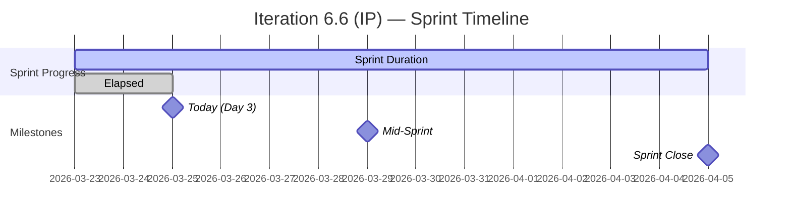
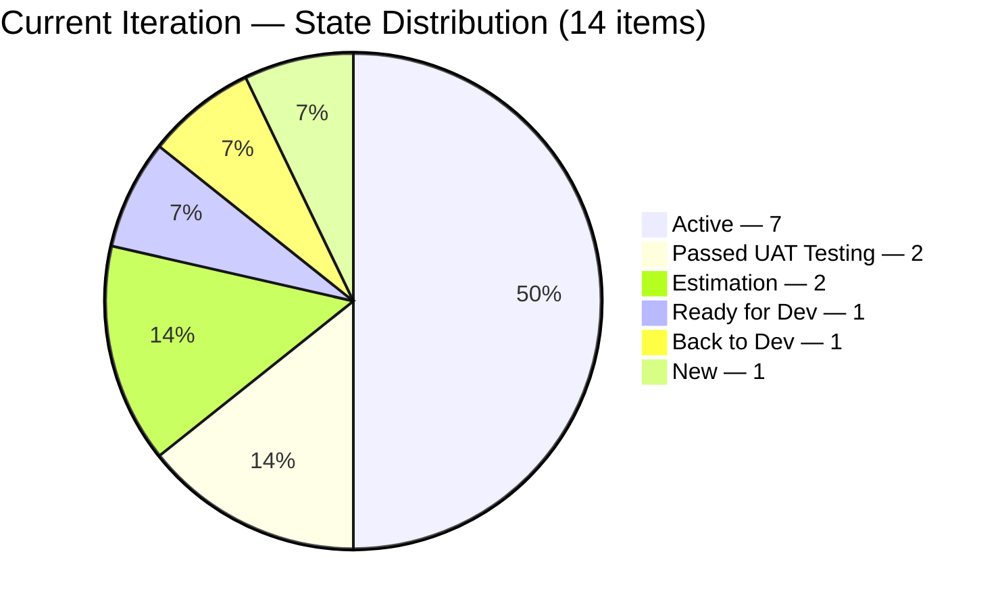
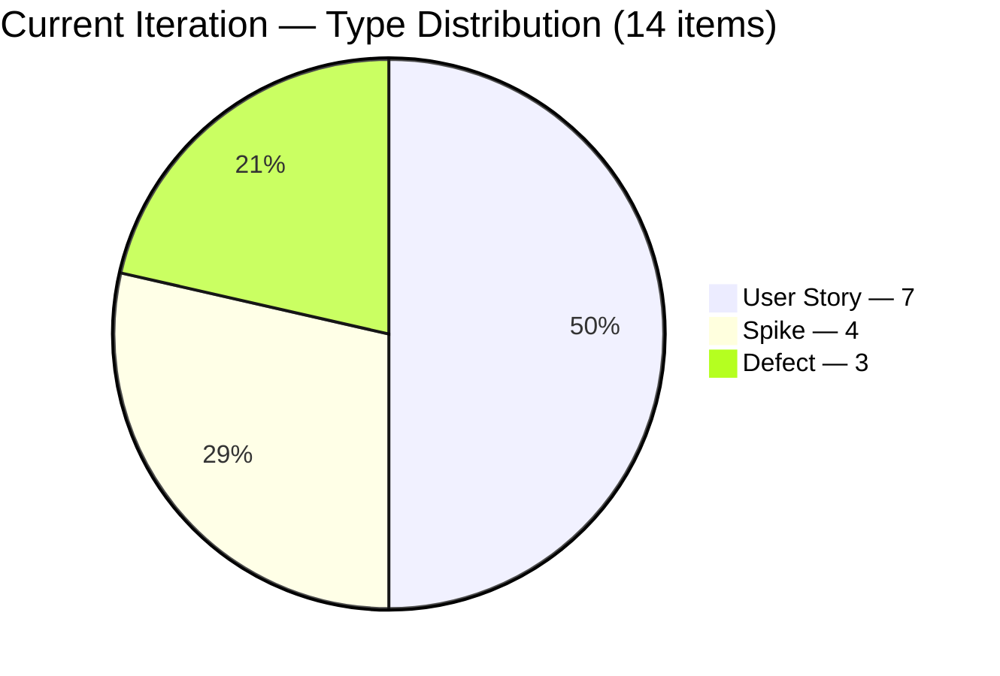
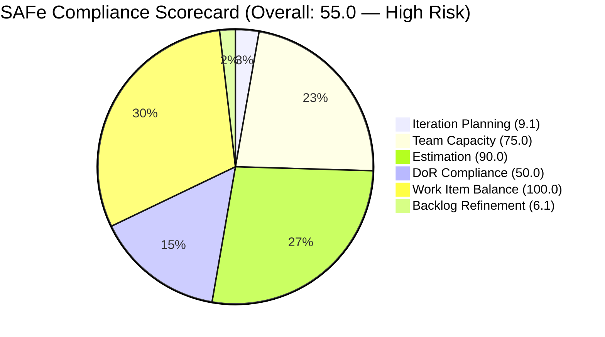

# SAFe Iteration Audit Report
**Project:** Flawless Wedding App
**Team:** Flawless Wedding App Team
**Auditor:** EngProd Engineer (AI-Assisted)
**Audit Date:** March 25, 2026
**Audit Reference:** AUDIT_2026-03-25_094818

---

## 1. Audit Metadata

| Field | Value |
|-------|-------|
| **ADO Organization** | jairo (`dev.azure.com/jairo`) |
| **ADO Project** | Flawless Wedding App |
| **ADO Project ID** | `92b967dc-5ec7-4874-b8f5-e43b00d88339` |
| **ADO Team** | Flawless Wedding App Team |
| **ADO Team ID** | `7d90ecbf-d272-4b0c-b33b-c66d96a790ac` |
| **ADO Team Board URL** | `https://dev.azure.com/jairo/Flawless%20Wedding%20App/_boards/board/t/Flawless%20Wedding%20App%20Team/Stories%20and%20Deliverables` |
| **Backlog** | Stories and Deliverables (`Microsoft.RequirementCategory`) |
| **Current Iteration** | Iteration 6.6 (IP) |
| **Iteration Path** | `Flawless Wedding App\2026-PI6\Iteration 6.6 (IP)` |
| **Iteration Start** | March 23, 2026 |
| **Iteration End** | April 5, 2026 |
| **Sprint Day** | Day 3 of 14 (21% elapsed) |
| **Team Capacity** | 11 hrs/day, 0 days off |
| **Scoring Model** | Six-Dimension SAFe Compliance Rubric |

> **Scope Note:** This audit covers only the Flawless Wedding App Team backlog within the Flawless Wedding App ADO project. No other boards, teams, projects, or repositories were analyzed.

---

## 2. Executive Summary

This is the **first audit of Iteration 6.6 (IP)** -- the Innovation & Planning sprint closing PI 6. The team is on **Day 3 of 14** (21% elapsed). The prior sprint (Iteration 6.5) closed on March 22, 2026 with a SAFe score of 7.6/10.

**Overall SAFe Compliance Score: 55.0 / 100 -- High Risk**

The score reflects a structurally sound iteration plan undermined by a severely neglected backlog. While the current sprint has 14 well-distributed items with strong estimation (90%) and balanced work types (100), the broader backlog carries 83 items untouched for over 90 days and 51 items stale beyond 180 days. This backlog debt collapses the Refinement score to 6.1 and drags the overall health into High Risk territory.

The good news: the iteration itself is well-planned. Luke Abram Colina is driving 10 of 14 items, capacity is 75% configured (Carol Cuison remains the persistent gap), and User Stories dominate appropriately. The team needs to focus on two fronts: (1) executing the sprint cleanly, and (2) scheduling a dedicated backlog grooming effort.

---

## 3. Previous Audit Delta

| Attribute | IT 6.5 Sprint Close (Mar 22) | IT 6.6 Day 3 (Today) | Delta |
|-----------|------------------------------|----------------------|-------|
| **Iteration** | Iteration 6.5 | Iteration 6.6 (IP) | New sprint |
| **SAFe Score** | 7.6/10 (qualitative) | 55.0/100 (quantitative rubric) | Different scale |
| **Sprint Items** | 22 SP across ~20 items | 14 items, ~12 SP estimated | Smaller scope (IP sprint) |
| **Blocked Items** | 0 (resolved at close) | 0 in iteration | Sustained |
| **Carol Cuison Capacity** | Not configured (7th flag) | Not configured (8th flag) | Unresolved |
| **Carryover from 6.5** | 11 SP planned | 3 items visible (#201058, #201167, #201124) | Partial carryover landed |

### Key Outcomes from IT 6.5 Recommendations

| # | Recommendation | Status |
|---|---------------|--------|
| 1 | QA the 6 carryover items immediately | Partial -- #201058 and #201167 passed UAT; #201124 is Back to Dev; others moved to non-iteration paths |
| 2 | Add Carol Cuison to ADO capacity | Not done -- 8th consecutive audit flagging |
| 3 | Assign SP to off-iteration items | Partial -- #201167 now has 1 SP; #201326 and #201219 still lack SP |
| 4 | Celebrate zero-blocked achievement | N/A -- team process |
| 5 | Address QA throughput | QA pipeline appears more managed this sprint |

---

## 4. Current Iteration Snapshot

### 4.1 Iteration Timeline

### 4.2 Team Capacity Configuration

| Team Member | Activity | Capacity/Day | Days Off | In Iteration? |
|-------------|----------|-------------|----------|---------------|
| Luke Abram Colina | Development | 6 hrs | 0 | Yes (10 items) |
| Ike Yana | Development | 1 hr | 0 | Yes (1 item) |
| Ressa Paracuelles | Testing | 3 hrs | 0 | Yes (1 item) |
| Luzmibel Paculanang | Testing | 1 hr | 0 | No items assigned |
| **Carol Cuison** | **Not configured** | **0** | **--** | **Yes (1 item)** |

**Total configured capacity:** 11 hrs/day | **Total days off:** 0

---

## 5. Work Item Analysis

### 5.1 Current Iteration Items (14 total)

| ID | Title | Type | State | SP | Assigned To |
|----|-------|------|-------|----|-------------|
| 199211 | Admin Assigns Island to Vendor | User Story | Active | 1 | Luke Abram Colina |
| 199213 | Bride Views Islands as Main Entry Point | User Story | Active | 1 | Luke Abram Colina |
| 199214 | Bride Views Subcategories Within Selected Island | User Story | Active | 1 | Luke Abram Colina |
| 199215 | Bride Views Vendors by Island and Subcategory | User Story | Active | 2 | Luke Abram Colina |
| 200256 | Manage Archived Users (Delete and Restore) | User Story | Ready for Dev | 2 | Luke Abram Colina |
| 200259 | Add existing contract | User Story | Estimation | 1 | Luke Abram Colina |
| 201058 | Change Shannon Hannold to Shannon Nofo | User Story | Passed UAT Testing | 1 | Luke Abram Colina |
| 201167 | Invoice Preview does not reset after clearing coupon | Defect | Passed UAT Testing | 1 | Luke Abram Colina |
| 191038 | New vendor category visible before registration completion | Defect | Estimation | 1 | Luke Abram Colina |
| 201124 | Existing vendor with multiple categories cannot log in | Defect | Back to Dev | -- | Luke Abram Colina |
| 196898 | Tipping Notifications for Investigation | Spike | Active | 0 | Ike Yana |
| 201634 | Collaborations, Reports & Others | Spike | Active | -- | Ressa Paracuelles |
| 201568 | Meetings, Collaboration & Others IT 6.6 | Spike | Active | -- | Unassigned |
| 201569 | Follow Up Netlify Access and Github Transfer | Spike | New | -- | Carol Cuison |

### 5.2 State Distribution

### 5.3 Work Item Type Distribution

### 5.4 Story Points Summary

| Category | Items | SP |
|----------|-------|----|
| Estimated (SP > 0) | 9 | 12 SP |
| Zero SP (Spike #196898) | 1 | 0 |
| No SP assigned | 4 | -- |
| **Total in iteration** | **14** | **~12 SP** |

### 5.5 Ownership Concentration

| Contributor | Items | SP | Share |
|-------------|-------|----|-------|
| Luke Abram Colina | 10 | 12 SP | 71.4% |
| Ike Yana | 1 | 0 SP | 7.1% |
| Ressa Paracuelles | 1 | -- | 7.1% |
| Carol Cuison | 1 | -- | 7.1% |
| Unassigned | 1 | -- | 7.1% |

Luke Abram Colina carries **71.4% of all sprint items** and **100% of estimated story points**. This is a significant concentration risk. If Luke encounters blockers, the entire sprint velocity is at risk.

---

## 6. SAFe Compliance Scorecard

| # | Dimension | Score | Evidence | Notes |
|---|-----------|-------|----------|-------|
| 1 | **Iteration Planning** | **9.1** | 14 of 154 backlog items assigned to current iteration (9.1%) | Healthy ratio for an IP sprint; items are well-scoped |
| 2 | **Team Capacity** | **75.0** | 3 of 4 contributors with work have configured capacity | Carol Cuison assigned to #201569 but has no capacity entry -- 8th consecutive flag |
| 3 | **Estimation** | **90.0** | 9 of 10 point-eligible items have SP > 0 | Only Spike #196898 has SP=0; 4 items have no SP field exposed |
| 4 | **DoR Compliance** | **50.0** | 7 of 14 items have Description >= 30 chars AND AC >= 20 chars | 7 items lack adequate Description or Acceptance Criteria |
| 5 | **Work Item Balance** | **100.0** | User Stories (50%), Spikes (28.6%), Defects (21.4%) | No penalties: has User Stories, no type > 60%, spikes < 40% |
| 6 | **Backlog Refinement** | **6.1** | Fresh: 71/154 (46.1%); Stale >90d: 83 (53.9%); Stale >180d: 51 (33.1%); Untouched: 1/14 (7.1%) | Base 46.1 - 20 (stale90 > 25%) - 20 (stale180 >= 1) = 6.1 |
| | **Overall Score** | **55.0** | Average of 6 dimensions | **High Risk** (40-59.9 band) |

---

## 7. Dimension Findings

### 7.1 Iteration Planning (9.1/100)

The team has allocated 14 of 154 visible backlog items to this iteration. This is a 9.1% allocation rate, which is healthy for an IP (Innovation & Planning) sprint that typically carries fewer feature items and more investigative/process work. The 7 User Stories form a coherent "Islands" feature cluster (#199211-199215) plus administrative items, supported by 3 Defects and 4 Spikes.

**Verdict:** Well-structured sprint plan for an IP iteration.

### 7.2 Team Capacity (75.0/100)

Four contributors have work assigned in the current iteration: Luke Abram Colina, Ike Yana, Ressa Paracuelles, and Carol Cuison. Of these, 3 have configured capacity in ADO. Carol Cuison remains unconfigured -- this has been flagged in **every audit since Iteration 6.5 Day 3** (8 consecutive flags across 2 sprints).

Additionally, Luzmibel Paculanang has configured capacity (1 hr/day Testing) but has zero items assigned in this iteration.

**Verdict:** Persistent capacity configuration gap for Carol Cuison. Luzmibel has capacity but no assigned work.

### 7.3 Estimation (90.0/100)

10 items in the current iteration have the Story Points field exposed. Of these, 9 have SP > 0. The only gap is Spike #196898 (Tipping Notifications for Investigation) with SP = 0. Four items (3 Spikes + 1 Defect #201124) have no SP field, which is acceptable for Spikes but the Defect should be estimated.

**Verdict:** Strong estimation discipline. Minor gap on one spike and one unestimated defect.

### 7.4 DoR Compliance (50.0/100)

Only 7 of 14 items meet the Definition of Ready (Description >= 30 non-whitespace characters AND Acceptance Criteria >= 20 non-whitespace characters). The compliant items are:

- #199211, #199213, #199214, #199215 (Islands feature cluster) -- all have solid descriptions and AC
- #200256 (Manage Archived Users) -- well-documented
- #201058 (Change Shannon Hannold) -- has description and AC
- #201568 (Meetings spike) -- has description and AC

The non-compliant items:
- #201167 (Defect) -- no description, no AC
- #191038 (Defect) -- no description, no AC
- #201124 (Defect) -- has description but no AC
- #196898 (Spike) -- no description, no AC
- #201634 (Spike) -- no description, no AC
- #201569 (Spike) -- no description, no AC
- #200259 (User Story) -- empty description, AC is only images

**Verdict:** All User Stories in the Islands feature cluster are well-documented. Defects and Spikes consistently lack DoR documentation. #200259 has a blank description, which is a concern for a User Story entering the sprint.

### 7.5 Work Item Balance (100.0/100)

The current iteration has a balanced distribution: 7 User Stories (50%), 4 Spikes (28.6%), and 3 Defects (21.4%). No single type exceeds 60%, User Stories are present, and Spikes are below the 40% threshold. This is appropriate for an IP sprint where investigation work (Spikes) is expected to be higher than normal.

**Verdict:** Excellent type balance for an IP sprint.

### 7.6 Backlog Refinement (6.1/100)

This is the critical weakness. The visible backlog of 154 items contains:

- **71 fresh items** (changed within 45 days) -- 46.1%
- **83 stale items** (unchanged > 90 days) -- **53.9%** (threshold: 25%)
- **51 deeply stale items** (unchanged > 180 days) -- **33.1%**

Penalties applied:
- Base score: 46.1
- Stale >90d exceeds 25%: -20
- Stale >180d >= 1 item: -20
- Untouched current items: 1/14 = 7.1% (below 10% threshold, no penalty)
- **Final: 6.1**

The 51 items unchanged for over 6 months represent dead inventory. Many are defects filed in September 2025 against legacy mobile versions (1.1.4, 1.1.6) that may no longer be relevant. This backlog bloat distorts planning, makes prioritization harder, and signals a lack of regular grooming discipline.

**Verdict:** Critical. The backlog requires a dedicated purge/refinement session.

---

## 8. Risks and Bottlenecks

### RISK 1 -- CRITICAL: Backlog Debt (51 items > 180 days stale)

**Source:** ADO
**Impact:** Inflates backlog size, distorts velocity metrics, hides real priorities, collapses Refinement score.
**Evidence:** 51 of 154 backlog items have not been touched since before September 2025. Many reference app versions 1.0.3, 1.1.1, 1.1.4, and 1.1.6 that are likely superseded.

### RISK 2 -- HIGH: Ownership Concentration on Luke Abram Colina

**Source:** ADO
**Impact:** Single point of failure for sprint delivery. Luke owns 71.4% of items and 100% of estimated story points.
**Evidence:** 10 of 14 iteration items assigned to Luke. If he is blocked or unavailable for even 2 days, the sprint is at material risk.

### RISK 3 -- MODERATE: Carol Cuison Capacity Not Configured (8th flag)

**Source:** ADO
**Impact:** SAFe compliance gap; capacity planning is inaccurate; team velocity reporting is distorted.
**Evidence:** Carol Cuison is assigned to Spike #201569 but has no capacity entry in ADO. This has been flagged in every audit since IT 6.5 Day 3.

### RISK 4 -- MODERATE: DoR Gaps on 7 Items

**Source:** ADO
**Impact:** Items entering the sprint without adequate description or acceptance criteria risk rework, scope creep, or misinterpretation.
**Evidence:** 7 of 14 items lack either Description (>= 30 chars) or Acceptance Criteria (>= 20 chars). Notably, User Story #200259 has a blank description.

### RISK 5 -- LOW: Defect #201124 in "Back to Dev" State

**Source:** ADO
**Impact:** Rework item carried from IT 6.5. If not resolved quickly, it may block dependent work.
**Evidence:** #201124 (Existing vendor with multiple categories cannot log in) is in Back to Dev state, assigned to Luke.

---

## 9. Prioritized Recommendations

| Priority | Action | Dimension Impact | Effort |
|----------|--------|-----------------|--------|
| **P1** | **Schedule a backlog grooming/purge session** to close or descope the 51 items stale > 180 days. Target: reduce visible backlog to < 100 items. | Backlog Refinement (+30-40 points) | 2-3 hrs |
| **P2** | **Add Carol Cuison to ADO capacity** or formally reassign Spike #201569 to someone with configured capacity. | Team Capacity (+25 points) | 5 min |
| **P3** | **Add Description and AC to non-compliant items** -- especially User Story #200259 (blank description) and Defects #201167, #191038. | DoR Compliance (+20-30 points) | 1 hr |
| **P4** | **Resolve Defect #201124** (Back to Dev) early in the sprint to avoid it becoming a persistent blocker. | Iteration health | 1-2 days dev |
| **P5** | **Distribute work more evenly** in future sprints. Consider assigning some of Luke's items to Ike or onboarding additional developers for IP sprint tasks. | Ownership risk mitigation | Planning time |
| **P6** | **Estimate Spike #196898** (currently SP=0) and Defect #201124 (no SP). | Estimation (+10 points) | 15 min |
| **P7** | **Assign Spike #201568** (Meetings, Collaboration & Others) to a team member. Currently unassigned. | Planning completeness | 5 min |

### Projected Score Impact (if P1-P3 are addressed)

| Dimension | Current | Projected | Delta |
|-----------|---------|-----------|-------|
| Iteration Planning | 9.1 | ~14 (after purge reduces backlog) | +5 |
| Team Capacity | 75.0 | 100.0 | +25 |
| Estimation | 90.0 | 100.0 | +10 |
| DoR Compliance | 50.0 | 78.6 | +28.6 |
| Work Item Balance | 100.0 | 100.0 | 0 |
| Backlog Refinement | 6.1 | ~45-55 | +40-50 |
| **Overall** | **55.0** | **~73-75** | **+18-20** |

Addressing P1-P3 alone could move the team from **High Risk** to **Moderate Risk**.

---

## 10. Evidence Gaps and Limitations

| Gap | Impact | Mitigation |
|-----|--------|------------|
| **No GitHub evidence collected** | Cannot assess delivery evidence, PR throughput, commit activity, or code-level traceability | This project's CLAUDE.md does not scope GitHub repositories for audit; GitHub analysis was not performed |
| **Carol Cuison capacity unknown** | Cannot calculate true team capacity | Scored as missing capacity (75% instead of 100%) |
| **Spike SP field behavior** | Some Spikes expose SP (196898 = 0), others do not | Treated items with SP field as point-eligible regardless of type |
| **Description/AC character counts are approximated** | HTML markup in Description/AC fields inflates raw character counts | Used field length from API response; actual non-whitespace text may differ |
| **Qualitative vs. quantitative score comparison** | Prior audit used 1-10 qualitative scale; this audit uses 0-100 six-dimension rubric | Scores are not directly comparable across audit methodologies |

---

*Report generated: March 25, 2026 | SAFe 6.0 Framework | Flawless Wedding App -- Flawless Wedding App Team*
*Iteration 6.6 (IP): Mar 23 -- Apr 5, 2026 | Day 3 of 14 | SAFe Compliance Score: 55.0/100 (High Risk)*
*Scoring: Iteration Planning 9.1 | Team Capacity 75.0 | Estimation 90.0 | DoR 50.0 | Balance 100.0 | Refinement 6.1*
