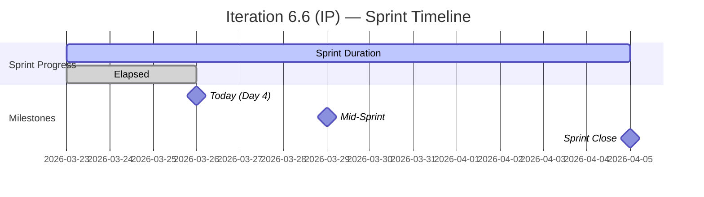
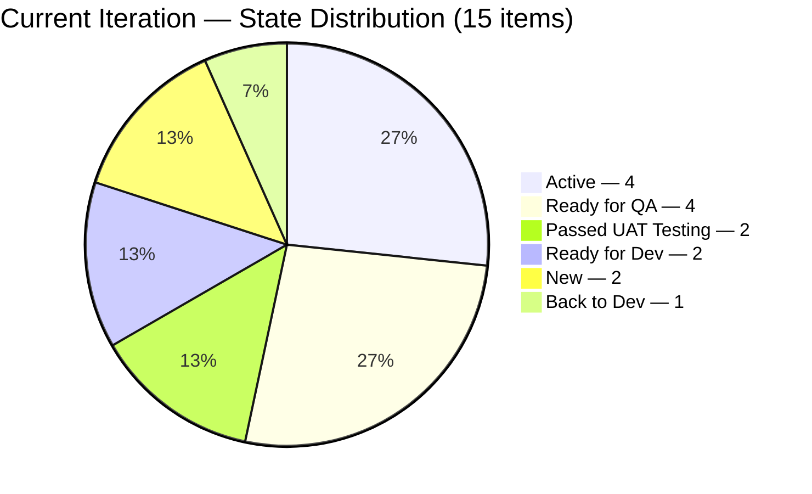
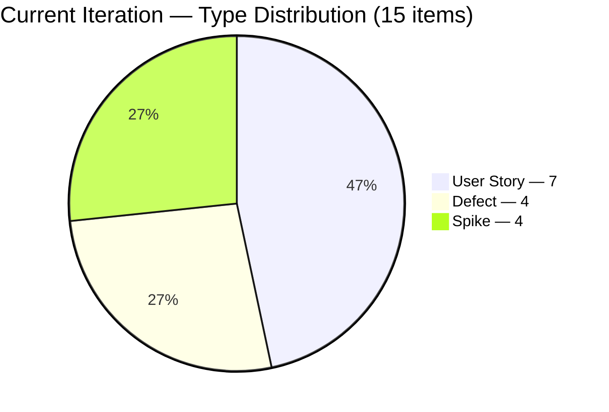
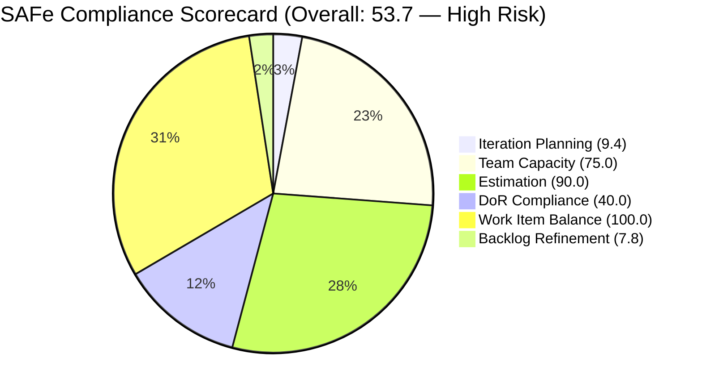

# SAFe Iteration Audit Report
**Project:** Flawless Wedding App
**Team:** Flawless Wedding App Team
**Auditor:** EngProd Engineer (AI-Assisted)
**Audit Date:** March 26, 2026
**Audit Reference:** AUDIT_20260326_1543

---

## 1. Audit Metadata

| Field | Value |
|-------|-------|
| **ADO Organization** | jairo (`dev.azure.com/jairo`) |
| **ADO Project** | Flawless Wedding App |
| **ADO Project ID** | `92b967dc-5ec7-4874-b8f5-e43b00d88339` |
| **ADO Team** | Flawless Wedding App Team |
| **ADO Team ID** | `7d90ecbf-d272-4b0c-b33b-c66d96a790ac` |
| **ADO Team Board URL** | `https://dev.azure.com/jairo/Flawless%20Wedding%20App/_boards/board/t/Flawless%20Wedding%20App%20Team/Stories%20and%20Deliverables` |
| **Backlog** | Stories and Deliverables (`Microsoft.RequirementCategory`) |
| **Current Iteration** | Iteration 6.6 (IP) |
| **Iteration Path** | `Flawless Wedding App\2026-PI6\Iteration 6.6 (IP)` |
| **Iteration Start** | March 23, 2026 |
| **Iteration End** | April 5, 2026 |
| **Sprint Day** | Day 4 of 14 (29% elapsed) |
| **Team Capacity** | 11 hrs/day, 0 days off |
| **Scoring Model** | Six-Dimension SAFe Compliance Rubric |
| **Previous Audit** | AUDIT_2026-03-25_094818.md (Day 3) |

> **Scope Note:** This audit covers only the Flawless Wedding App Team backlog within the Flawless Wedding App ADO project. No other boards, teams, projects, or repositories were analyzed.

---

## 2. Executive Summary

This is the **second audit of Iteration 6.6 (IP)** — the Innovation & Planning sprint closing PI 6. The team is on **Day 4 of 14** (29% elapsed). Yesterday's audit (Day 3) produced an overall score of 55.0/100 (High Risk).

**Overall SAFe Compliance Score: 53.7 / 100 — High Risk**

The score has declined slightly from 55.0 to 53.7 since yesterday. Two factors drove this movement: (1) a new production defect (#201727 — Stripe Connect onboarding failure) was added to the sprint today, bringing the total to **15 items** and pushing the Defect count to 4, and (2) the new item has no description, no acceptance criteria, and no story points, which reduced DoR Compliance from 50.0 to 40.0. The other five dimensions are stable or marginally improved.

The sprint execution picture is actually positive: four Islands User Stories (#199211–199215) have all moved to **Ready for QA** since Day 3 — a full-column advancement. Defect #191038 moved to Ready for Dev. The structural weaknesses remain unchanged: Luke Abram Colina carries 73.3% of all sprint items, Carol Cuison's capacity remains unconfigured (9th consecutive flag), and the broader backlog continues to carry 83 items stale beyond 90 days.

The critical production defect (#201727) warrants immediate triage attention — Stripe Connect onboarding failures are revenue-impacting and represent unplanned interrupt work in an IP sprint.

---

## 3. Previous Audit Delta

| Attribute | Day 3 (Mar 25) | Day 4 (Today, Mar 26) | Delta |
|-----------|----------------|------------------------|-------|
| **SAFe Score** | 55.0 / 100 | 53.7 / 100 | -1.3 |
| **Sprint Items** | 14 | 15 | +1 (new defect #201727) |
| **Iteration Planning** | 9.1 | 9.4 | +0.3 (new item added) |
| **Team Capacity** | 75.0 | 75.0 | No change |
| **Estimation** | 90.0 | 90.0 | No change |
| **DoR Compliance** | 50.0 | 40.0 | -10.0 (new undocumented defect) |
| **Work Item Balance** | 100.0 | 100.0 | No change |
| **Backlog Refinement** | 6.1 | 7.8 | +1.7 (76 vs. 71 fresh items) |
| **Backlog Size** | 154 | 159 | +5 items added |
| **Carol Cuison Capacity** | Not configured (8th flag) | Not configured (9th flag) | Unresolved |

### Key State Changes Since Day 3

| ID | Title | Prior State | Current State | Change |
|----|-------|-------------|---------------|--------|
| #199211 | Admin Assigns Island to Vendor | Active | Ready for QA | Progressed |
| #199213 | Bride Views Islands as Main Entry Point | Active | Ready for QA | Progressed |
| #199214 | Bride Views Subcategories Within Selected Island | Active | Ready for QA | Progressed |
| #199215 | Bride Views Vendors by Island and Subcategory | Active | Ready for QA | Progressed |
| #191038 | New vendor category visible before registration | Estimation | Ready for Dev | Progressed |
| #200259 | Add existing contract | Estimation | Ready for Dev | Progressed |
| #201727 | [PROD] Stripe Connect onboarding failure | (new) | New | Added today |

### Recommendations Follow-up from Day 3

| # | Prior Recommendation | Status Today |
|---|---------------------|-------------|
| P1 | Schedule backlog grooming/purge session | Not actioned — backlog grew by 5 items |
| P2 | Add Carol Cuison to ADO capacity | Not done — 9th consecutive flag |
| P3 | Add Description/AC to non-compliant items | Partially improved for some; #200259 still has no description |
| P4 | Resolve Defect #201124 (Back to Dev) | Still Back to Dev — no state change |
| P5 | Distribute work more evenly | New defect assigned to Luke, concentration worsened slightly |
| P6 | Estimate Spike #196898 and Defect #201124 | No change |
| P7 | Assign Spike #201568 | Still unassigned |

---

## 4. Current Iteration Snapshot

### 4.1 Iteration Timeline

### 4.2 Team Capacity Configuration

| Team Member | Activity | Capacity/Day | Days Off | Items Assigned |
|-------------|----------|-------------|----------|----------------|
| Luke Abram Colina | Development | 6 hrs | 0 | 11 items |
| Ressa Paracuelles | Testing | 3 hrs | 0 | 1 item |
| Ike Yana | Development | 1 hr | 0 | 1 item |
| Luzmibel Paculanang | Testing | 1 hr | 0 | 0 items |
| **Carol Cuison** | **Not configured** | **0** | **--** | **1 item (#201569)** |

**Total configured capacity:** 11 hrs/day | **Total days off:** 0

---

## 5. Work Item Analysis

### 5.1 Current Iteration Items (15 total)

| ID | Title | Type | State | SP | Assigned To |
|----|-------|------|-------|----|-------------|
| 199211 | Admin Assigns Island to Vendor | User Story | Ready for QA | 1 | Luke Abram Colina |
| 199213 | Bride Views Islands as Main Entry Point | User Story | Ready for QA | 1 | Luke Abram Colina |
| 199214 | Bride Views Subcategories Within Selected Island | User Story | Ready for QA | 1 | Luke Abram Colina |
| 199215 | Bride Views Vendors by Island and Subcategory | User Story | Ready for QA | 2 | Luke Abram Colina |
| 200256 | Manage Archived Users (Delete and Restore) | User Story | Active | 2 | Luke Abram Colina |
| 200259 | Add existing contract | User Story | Ready for Dev | 1 | Luke Abram Colina |
| 201058 | Change Shannon Hannold to Shannon Nofo | User Story | Passed UAT Testing | 1 | Luke Abram Colina |
| 191038 | New vendor category visible before registration | Defect | Ready for Dev | 1 | Luke Abram Colina |
| 201124 | Existing vendor with multiple categories cannot log in | Defect | Back to Dev | -- | Luke Abram Colina |
| 201167 | Invoice Preview does not reset after clearing coupon | Defect | Passed UAT Testing | 1 | Luke Abram Colina |
| 201727 | [PROD] Stripe Connect Unable to Start Express Onboarding | Defect | New | -- | Luke Abram Colina |
| 196898 | Tipping Notifications for Investigation | Spike | Active | 0 | Ike Yana |
| 201568 | Meetings, Collaboration & Others IT 6.6 | Spike | Active | -- | Unassigned |
| 201634 | Collaborations, Reports & Others | Spike | Active | -- | Ressa Paracuelles |
| 201569 | Follow Up Netlify Access and Github Transfer | Spike | New | -- | Carol Cuison |

### 5.2 State Distribution

### 5.3 Work Item Type Distribution

### 5.4 Story Points Summary

| Category | Items | SP |
|----------|-------|----|
| Estimated (SP > 0) | 9 | 11 SP |
| Zero SP (Spike #196898) | 1 | 0 |
| No SP field exposed | 5 | -- |
| **Total in iteration** | **15** | **~11 SP** |

### 5.5 Ownership Concentration

| Contributor | Items | Share |
|-------------|-------|-------|
| Luke Abram Colina | 11 | 73.3% |
| Ike Yana | 1 | 6.7% |
| Ressa Paracuelles | 1 | 6.7% |
| Carol Cuison | 1 | 6.7% |
| Unassigned | 1 | 6.7% |

Luke Abram Colina carries **73.3% of all sprint items**, up from 71.4% yesterday due to the addition of Defect #201727. This is a critical single-point-of-failure pattern that has persisted throughout Iteration 6.6.

### 5.6 Sprint Progress Assessment (Day 4 of 14 — 29% Elapsed)

| Stage | Count | % of Sprint |
|-------|-------|-------------|
| In Progress (Active + Ready for Dev) | 6 | 40% |
| Awaiting QA / UAT | 6 | 40% (Ready for QA + Passed UAT) |
| Not Started (New) | 2 | 13% |
| Blocked / Rework | 1 | 7% (Back to Dev) |

The Islands feature cluster (4 stories) has advanced cleanly to Ready for QA on Day 4 — this is strong early sprint execution. 6 of 15 items (40%) are now in QA pipelines, which is healthy pacing for this point in the sprint.

---

## 6. SAFe Compliance Scorecard

| # | Dimension | Score | Evidence | Notes |
|---|-----------|-------|----------|-------|
| 1 | **Iteration Planning** | **9.4** | 15 of 159 backlog items assigned to current iteration | Slightly higher than yesterday (9.1) due to +1 item, +5 backlog items |
| 2 | **Team Capacity** | **75.0** | 3 of 4 contributors with work have configured capacity | Carol Cuison assigned to #201569 but no capacity entry — 9th consecutive flag |
| 3 | **Estimation** | **90.0** | 9 of 10 point-eligible items have SP > 0 | #201727 (new defect) has no SP field; #201124 also missing SP |
| 4 | **DoR Compliance** | **40.0** | 6 of 15 items meet Description >= 30 chars AND AC >= 20 chars | Decreased from 50.0; #201727 added with no description/AC |
| 5 | **Work Item Balance** | **100.0** | User Stories (46.7%), Defects (26.7%), Spikes (26.7%) | No single type > 60%; Spikes < 40%; User Stories present |
| 6 | **Backlog Refinement** | **7.8** | Fresh: 76/159 (47.8%); Stale >90d: 83 (52.2%); Stale >180d: 51 (32.1%); Untouched: 0/15 (0%) | Base 47.8 − 20 (stale90 > 25%) − 20 (stale180 >= 1) = 7.8 |
| | **Overall Score** | **53.7** | Average of 6 dimensions | **High Risk** (40–59.9 band) |

---

## 7. Dimension Findings

### 7.1 Iteration Planning (9.4/100)

The team has 15 of 159 visible backlog items committed to this iteration (9.4%). The backlog grew by 5 items since yesterday (154 to 159), including the new production defect. For an IP sprint, this allocation rate is appropriate — IP sprints intentionally carry lighter feature loads to allow time for innovation, planning, and system-level activities.

The addition of a production Stripe Connect defect (#201727) mid-sprint is notable. This is interrupt-driven work that was not part of the original IP sprint plan. Per audit considerations, interrupt-driven defects should be tracked separately from planned sprint work to avoid distorting the IP sprint's intent.

**Verdict:** Planning rate is appropriate for an IP sprint. New production defect represents unplanned interrupt work.

### 7.2 Team Capacity (75.0/100)

Four contributors have work in the current iteration: Luke Abram Colina, Ike Yana, Ressa Paracuelles, and Carol Cuison. Three of four have configured capacity in ADO. Carol Cuison has been unconfigured for **9 consecutive audits** across two sprints (IT 6.5 and IT 6.6). Additionally, Luzmibel Paculanang has 1 hr/day Testing capacity configured but no assigned items in this iteration.

**Verdict:** Persistent and escalating compliance gap. 9th consecutive flag for Carol Cuison capacity.

### 7.3 Estimation (90.0/100)

10 items in the current iteration have the Story Points field exposed. 9 of these have SP > 0. The gaps:
- Spike #196898: SP field present but set to 0
- Defects #201124 and #201727: no SP field exposed (Defect type may not expose this field by default)

The new defect #201727 was added today — there has been no time to estimate it, which is understandable. However, for a production-impacting defect it should be estimated promptly to inform prioritization.

**Verdict:** Strong estimation practice. New defect SP gap is expected for same-day additions.

### 7.4 DoR Compliance (40.0/100)

6 of 15 items meet the Definition of Ready (Description >= 30 non-whitespace chars AND Acceptance Criteria >= 20 non-whitespace chars). This is a regression from 50.0 yesterday (7/14), caused by adding #201727 with no documentation.

**DoR-compliant items:**
- #199211, #199213, #199214, #199215 — Islands feature cluster (solid descriptions and AC)
- #200256 — Manage Archived Users (well-documented)
- #201568 — Meetings spike (has description and AC)

**Non-compliant items (9 of 15):**
| ID | Type | Issue |
|----|------|-------|
| #201727 | Defect | No description, no AC (added today) |
| #201167 | Defect | No description, no AC |
| #191038 | Defect | No description, no AC |
| #201124 | Defect | Has description (797 chars) but no AC |
| #196898 | Spike | No description, no AC |
| #201634 | Spike | No description, no AC |
| #201569 | Spike | No description, no AC |
| #201058 | User Story | No description; AC present (575 chars) |
| #200259 | User Story | No description; AC present (28 chars) |

The DoR non-compliance pattern is consistent: Defects and Spikes systematically lack documentation. Two User Stories (#201058 and #200259) entering the sprint without descriptions is a concern.

**Verdict:** DoR compliance declined with today's new defect addition. Defect documentation remains a systemic gap.

### 7.5 Work Item Balance (100.0/100)

The current iteration has: 7 User Stories (46.7%), 4 Defects (26.7%), 4 Spikes (26.7%). No type exceeds 60%, User Stories are present, and Spikes are well below the 40% threshold. The Defect count increased from 3 to 4 with today's #201727 addition. While the score is 100.0, the growing defect share in an IP sprint warrants monitoring.

**Verdict:** Score holds at 100. Watch Defect creep in subsequent IP sprint audits.

### 7.6 Backlog Refinement (7.8/100)

The visible backlog increased from 154 to 159 items since yesterday. The freshness ratio improved marginally:

- **76 fresh items** (changed within 45 days) — 47.8% (up from 46.1%)
- **83 stale items** (unchanged > 90 days) — 52.2% (unchanged count, lower share)
- **51 deeply stale items** (unchanged > 180 days) — 32.1%
- **0 untouched current items** — all sprint items have been touched since Mar 23 (improvement from Day 3's 1 untouched)

Scoring:
- Base: 47.8
- Stale >90d exceeds 25% threshold: −20
- Stale >180d >= 1 item: −20
- Untouched current items = 0%: no penalty
- **Final: 7.8**

The backlog continues to grow (5 new items added since yesterday) while the stale core remains untouched. This is the opposite of refinement — new work is being added faster than old work is being pruned.

**Verdict:** Critical. No grooming activity observed. Backlog is growing, not shrinking.

---

## 8. Risks and Bottlenecks

### RISK 1 — CRITICAL: Production Defect #201727 (Stripe Connect) Added Today

**Source:** ADO (added 2026-03-26T09:16 UTC)
**Impact:** Stripe Express Onboarding failures are revenue-impacting. Vendors unable to complete onboarding cannot receive payments through the platform. This is a P1 production issue injected into an IP sprint.
**Evidence:** #201727 state is "New," unestimated, no description, no AC. Assigned to Luke Abram Colina — who already carries 10 other sprint items.
**Mitigation needed:** Immediate triage, SP estimation, and description/AC. If fix requires significant dev effort, consider whether it can be expedited outside the IP sprint scope.

### RISK 2 — CRITICAL: Backlog Debt (51 items > 180 days stale, backlog growing)

**Source:** ADO
**Impact:** Backlog grew by 5 items today while zero stale items were groomed. Refinement score is 7.8/100.
**Evidence:** 51 of 159 items untouched since before September 2025. Many reference legacy app versions (1.0.3, 1.1.1, 1.1.4). Backlog has now grown from 154 to 159 — net negative grooming momentum.

### RISK 3 — HIGH: Ownership Concentration on Luke Abram Colina

**Source:** ADO
**Impact:** Luke owns 73.3% of sprint items (11 of 15). He now also owns the new production defect, increasing his effective load. A disruption to Luke's availability creates a total-sprint risk.
**Evidence:** 11 items assigned to Luke; next highest contributor has 1 item.

### RISK 4 — HIGH: Carol Cuison Capacity Not Configured (9th consecutive flag)

**Source:** ADO
**Impact:** Capacity planning inaccurate; team velocity reporting is distorted; compliance is capped at 75%.
**Evidence:** Carol Cuison is assigned to Spike #201569 but has zero capacity configured in ADO for this iteration. This gap has existed across the entirety of IT 6.5 and IT 6.6 audits.

### RISK 5 — MODERATE: DoR Regression — 9 of 15 Items Non-Compliant

**Source:** ADO
**Impact:** Items without descriptions or acceptance criteria risk scope creep, rework, and miscommunication during QA and UAT.
**Evidence:** DoR compliance dropped to 40.0 with #201727's addition. The pattern of Defects and Spikes entering the sprint without documentation has been consistent across audits.

### RISK 6 — MODERATE: Defect #201124 Stalled in "Back to Dev"

**Source:** ADO
**Impact:** Vendor login failure has been in "Back to Dev" since at least March 23. No state change in 3+ days. Risk of carrying into PI 7 as unresolved tech debt.
**Evidence:** Changed date is 2026-03-23 (sprint start); no progress visible in ADO state.

---

## 9. Prioritized Recommendations

| Priority | Action | Dimension Impact | Effort | Owner |
|----------|--------|-----------------|--------|-------|
| **P0** | **Triage and document Defect #201727** (Stripe Connect production failure) — add description, root cause, AC, and estimate. Assess whether it needs a hotfix path separate from the IP sprint. | DoR (+7 pts), Estimation (+10 pts), Risk reduction | 30 min triage + dev time | Luke / Ramon |
| **P1** | **Schedule a backlog grooming/purge session** to close or descope the 51 items stale > 180 days. Target: reduce backlog to < 100 items. | Backlog Refinement (+30–40 pts) | 2–3 hrs | Ramon + Team |
| **P2** | **Add Carol Cuison to ADO capacity** for IT 6.6, or formally remove her from #201569 and reassign. | Team Capacity (+25 pts) | 5 min | Ramon / ADO Admin |
| **P3** | **Add Description and AC to non-compliant items** — priority: #200259 (blank description, in Ready for Dev), #201124 (no AC), #201058 (no description). | DoR Compliance (+13–20 pts) | 1 hr | Item owners |
| **P4** | **Resolve or escalate Defect #201124** (Back to Dev since Mar 23) — unblocking vendor login is critical for vendor platform health. | Sprint health | Dev effort TBD | Luke |
| **P5** | **Assign Spike #201568** (Meetings, Collaboration & Others) — currently unassigned. An unassigned active item has no accountable owner. | Planning completeness | 5 min | Ramon |
| **P6** | **Estimate Spike #196898** (SP=0) to reflect investigation effort. | Estimation (+10 pts) | 10 min | Ike Yana |
| **P7** | **Stop growing the backlog without concurrent pruning.** For every new item added, one stale item should be closed/descoped. | Backlog Refinement (prevents further decay) | Policy decision | Ramon |

### Projected Score Impact (if P0–P3 are addressed this sprint)

| Dimension | Current | Projected | Delta |
|-----------|---------|-----------|-------|
| Iteration Planning | 9.4 | ~15 (after backlog purge) | +6 |
| Team Capacity | 75.0 | 100.0 | +25 |
| Estimation | 90.0 | 100.0 | +10 |
| DoR Compliance | 40.0 | ~73 | +33 |
| Work Item Balance | 100.0 | 100.0 | 0 |
| Backlog Refinement | 7.8 | ~45–55 | +40 |
| **Overall** | **53.7** | **~72–74** | **+18–20** |

Addressing P0–P3 could move the team from **High Risk** to **Moderate Risk** within this iteration.

---

## 10. Evidence Gaps and Limitations

| Gap | Impact | Mitigation |
|-----|--------|------------|
| **No GitHub evidence collected** | Cannot assess delivery evidence, PR throughput, commit activity, or code-level traceability | This project's CLAUDE.md does not scope GitHub repositories for audit |
| **Carol Cuison capacity unknown** | Cannot calculate true team capacity | Scored as missing (75% instead of 100%) |
| **#201727 is hours old** | New production defect has no meaningful ADO history yet | Flagged as P0 for triage; scoring impact absorbed |
| **SP field absent on Defect types** | Defects #201124 and #201727 may not expose Story Points by default in this ADO template | Items without the SP field are excluded from estimation denominator |
| **Description/AC character counts approximate** | HTML markup in Description/AC fields inflates raw character count | Used conservative non-whitespace character extraction via field length; actual quality may vary |
| **Backlog growth source unknown** | 5 new items added since yesterday; unclear if team-created or imported | Items are in the visible backlog and count toward all metrics |

---

*Report generated: March 26, 2026 | SAFe 6.0 Framework | Flawless Wedding App — Flawless Wedding App Team*
*Iteration 6.6 (IP): Mar 23 – Apr 5, 2026 | Day 4 of 14 | SAFe Compliance Score: 53.7/100 (High Risk)*
*Scoring: Iteration Planning 9.4 | Team Capacity 75.0 | Estimation 90.0 | DoR 40.0 | Balance 100.0 | Refinement 7.8*
