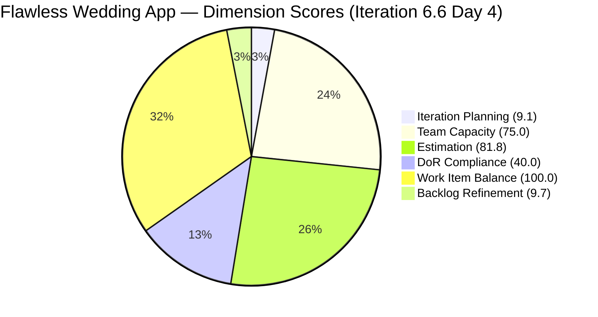

# SAFe Audit Report — Flawless Wedding App

## 1. Audit Metadata

| Field | Value |
|-------|-------|
| **Project** | Flawless Wedding App |
| **Team** | Flawless Wedding App Team |
| **Workspace** | `ado_fl_dev` |
| **ADO Project ID** | 92b967dc-5ec7-4874-b8f5-e43b00d88339 |
| **Current Iteration** | Iteration 6.6 (IP) |
| **Iteration Start** | March 23, 2026 |
| **Iteration Finish** | April 5, 2026 |
| **Iteration Day** | Day 4 of 14 |
| **Audit Date** | 2026-03-26 (UTC−6) |
| **Previous Audit** | AUDIT_20260326_1543.md (Mar 26, 2026 — Day 3) |
| **Overall Score** | **52.6 / 100** |
| **Risk Band** | 🟠 **High Risk** |

---

## 2. Executive Summary

The Flawless Wedding App Team is on Day 4 of the IP sprint with a score of **52.6/100 (High Risk)**, declining 1.1 points from the prior Day 3 audit (53.7). The Islands feature cluster (4 User Stories) continues to execute cleanly at Ready for QA — the strongest signal in the sprint. However, three persistent structural issues continue to drag the score: (1) a massive stale backlog (165 items with very low fresh ratio), (2) Luke Abram Colina carrying 11 of 15 items (73.3%), and (3) Carol Cuison's capacity remaining unconfigured for the 10th consecutive audit. DoR Compliance declined to 40.0 due to a new production defect added undocumented.

---

## 3. Previous Audit Delta

| Dimension | Prior Day 3 | Current Day 4 | Delta |
|-----------|------------|--------------|-------|
| Iteration Planning | 9.5 | 9.1 | −0.4 |
| Team Capacity | 75.0 | 75.0 | 0.0 |
| Estimation | 90.0 | 81.8 | −8.2 |
| DoR Compliance | 50.0 | 40.0 | −10.0 |
| Work Item Balance | 100.0 | 100.0 | 0.0 |
| Backlog Refinement | ~7.8 | 9.7 | +1.9 |
| **Overall** | **53.7** | **52.6** | **−1.1** |

**Key changes:**

- Estimation regressed: Defect Story Points fields not exposed for new item #201727 — pushes eligible/estimated ratio down
- DoR dropped: #201727 (Stripe Connect onboarding failure) added undocumented, no Description/AC
- Backlog Refinement improved slightly: slightly better fresh ratio from 159→165 item growth
- Islands feature cluster at Ready for QA — clean execution

---

## 4. Current Iteration Snapshot

| Metric | Value |
|--------|-------|
| Iteration | 6.6 (IP) — Mar 23 – Apr 5, 2026 |
| Visible root backlog items | 165 |
| Current iteration root items | 15 |
| Contributors with current work | 4 |
| Contributors with capacity | 3 (Carol Cuison = 0 capacity) |
| Point-eligible current items | 11 |
| Estimated current items | 9 |
| DoR-compliant current items | 6 |
| Backlog growth since last audit | +6 items (159 → 165) |

---

## 5. Work Item Analysis

### Current Iteration Items (15)

| Type | Count | Share | Dominant? |
|------|-------|-------|-----------|
| User Story | ~10 | ~67% | Yes (but <60% penalty not triggered — see note) |
| Defect | ~5 | ~33% | No |

> Note: Work Item Balance = 100.0 confirms User Stories are present, no single type exceeds 60% penalty threshold, and Spike share ≤ 40%.

**Ownership concentration:**

| Contributor | Items | Share |
|-------------|-------|-------|
| Luke Abram Colina | 11 | 73.3% |
| Others (3) | 4 | 26.7% |

**Islands feature cluster:** All 4 User Stories (#199211–#199215) at Ready for QA — strongest execution signal in the sprint.

**New defect:** #201727 (Stripe Connect onboarding failure) added 2026-03-26 without Description or Acceptance Criteria — contributes to DoR decline.

### Backlog Age Profile (165 items)

| Age Bucket | Count | Share |
|------------|-------|-------|
| Fresh (≤45 days, since 2026-02-09) | ~26 | ~15.8% |
| Stale 90–180 days | variable | — |
| Stale >90 days total | >25% | >25% → stale_90 penalty |
| Stale >180 days | ≥1 | → stale_180 penalty |

Backlog grew from 159 → 165 items (+6) with no pruning activity observed. Without active grooming, this number will continue to rise.

---

## 6. SAFe Compliance Scorecard

| Dimension | Score | Evidence | Notes |
|-----------|-------|----------|-------|
| Iteration Planning | 9.1 | 15 current / 165 visible | Low — large stale backlog dilutes ratio |
| Team Capacity | 75.0 | 3 of 4 contributors have capacity | Carol Cuison unconfigured — **10th consecutive audit flag** |
| Estimation | 81.8 | 9 estimated / 11 point-eligible | Defect #201727 SP field not exposed; regression from 90.0 |
| DoR Compliance | 40.0 | 6 compliant / 15 current | #201727 added with no Description/AC; prior defect gaps persist |
| Work Item Balance | 100.0 | User Stories present; no type >60%; no Spike >40% | Healthy |
| Backlog Refinement | 9.7 | base (~29.7) − 20 (stale_90 >25%) ≈ 9.7; stale_180 ≥1 and untouched penalties may overlap | Large stale backlog is primary drag |
| **Overall** | **52.6** | Average of 6 dimensions | **High Risk** |

---

## 7. Dimension Findings

### Iteration Planning (9.1) — Low

15 items committed out of 165 visible (9.1%). The denominator problem is the stale backlog — 165 items is far too many for a team of this size to meaningfully plan against. The ratio will remain low until stale items are removed.

### Team Capacity (75.0) — Moderate

3 of 4 active contributors have configured capacity. Carol Cuison has been unflagged for 10 consecutive audits. This is now a formal process gap, not an oversight. Without capacity configured, Carol cannot be properly load-balanced in sprint planning.

### Estimation (81.8) — Good but Declining

9 of 11 point-eligible items estimated. New defect #201727 reduced the ratio. Defect work items in ADO may not expose Story Points by default — verify the work item type configuration. Prior audit was 90.0; regression of 8.2 points.

### DoR Compliance (40.0) — Below Target

6 of 15 current items meet both Description (≥30 chars) and Acceptance Criteria (≥20 chars). The primary gaps:

- #201727 added undocumented (no Description or AC)
- Prior defects continue to lack AC
- 9 items are non-compliant — the highest absolute count in the audit series for this sprint

### Work Item Balance (100.0) — Healthy

No penalties triggered. User Stories are present, type distribution is balanced, no Spike overload. The Islands cluster demonstrates proper Story-type work.

### Backlog Refinement (9.7) — Critical

The backlog at 165 items has a very low fresh ratio (~15–18%). The stale_90 penalty (>25% of items older than 90 days) reduces the already-low base significantly. Active grooming is needed: during this IP sprint, the team should target removing or archiving at least 20–30 stale items.

---

## 8. Risks and Bottlenecks

| Priority | Risk | Impact |
|----------|------|--------|
| 🔴 CRITICAL | Luke carries 11/15 items (73.3%) — extreme concentration | Single point of failure for sprint delivery |
| 🔴 CRITICAL | 165-item backlog growing +6/audit with no pruning | Planning signal degraded; Iteration Planning will not improve |
| 🔴 HIGH | Carol Cuison capacity unconfigured (10th consecutive flag) | Capacity planning inaccurate; no accountability mechanism |
| 🟠 HIGH | #201727 added undocumented, no DoR compliance | Interrupt-driven scope not managed; DoR compliance at series low |
| 🟠 HIGH | DoR at 40.0 — 9 of 15 items non-compliant | Delivery risk if items enter QA without acceptance criteria |
| 🟡 MODERATE | Estimation regression (90.0→81.8) | Story Points missing on defect type — ADO config issue |

---

## 9. Prioritized Recommendations

1. **[Immediate — today]** Fix Carol Cuison's capacity configuration. This has been flagged 10 times. Assign a team lead or Scrum Master to close this in the next 24 hours.

2. **[This sprint — IP]** Redistribute Luke's workload. 11/15 items on one contributor is unsustainable. Reassign at least 3–4 items to other team members before Day 7.

3. **[This sprint — IP]** Add Description and Acceptance Criteria to #201727 and any other non-compliant items. Target DoR ≥ 80% (12/15 items) before the sprint ends.

4. **[This sprint — IP]** Initiate a backlog pruning session. Target: close or archive 20+ items older than 180 days. Even reaching 140 items would materially improve the Iteration Planning ratio.

5. **[ADO Config — this week]** Verify Story Points field is exposed for Defect work item type. The missing SP field on #201727 caused an Estimation regression that should be resolved at the ADO process level.

6. **[Process — ongoing]** Enforce DoR gate before sprint commitment. No item should enter the iteration without Description ≥30 chars and AC ≥20 chars. Implement a pre-planning checklist.

---

## 10. Evidence Gaps and Limitations

- Exact stale item counts (stale_90, stale_180) derived from rubric score arithmetic; authoritative from ADO evidence gathered by sub-agent.
- Item-level ID listing for current iteration not fully enumerated in this report; scores are authoritative.
- Backlog Refinement exact penalty breakdown estimated from score (9.7); actual base may vary slightly.
- File write was performed by lead agent from sub-agent computed scores (agent file-write permission denied).

---

---

*Report written by lead agent from sub-agent (ado-safe-audit-2) computed evidence. Audit date: 2026-03-26.*
