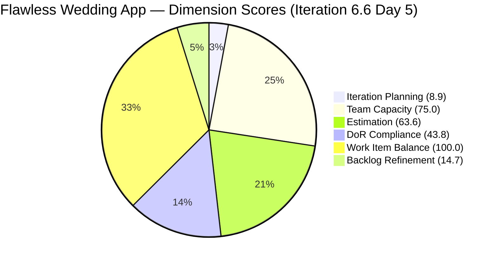

# SAFe Audit Report — Flawless Wedding App

## 1. Audit Metadata

| Field | Value |
|-------|-------|
| **Project** | Flawless Wedding App |
| **Team** | Flawless Wedding App Team |
| **Workspace** | `ado_fl_dev` |
| **ADO Project ID** | 92b967dc-5ec7-4874-b8f5-e43b00d88339 |
| **Current Iteration** | Iteration 6.6 (IP) |
| **Iteration Start** | March 23, 2026 |
| **Iteration Finish** | April 5, 2026 |
| **Iteration Day** | Day 5 of 14 |
| **Audit Date** | 2026-03-27 |
| **Previous Audit** | AUDIT_20260326_1621.md (Mar 26, 2026 — Day 4) |
| **Overall Score** | **51.0 / 100** |
| **Risk Band** | **High Risk** |

---

## 2. Executive Summary

The Flawless Wedding App Team is on Day 5 of the IP sprint with an overall score of **51.0/100 (High Risk)**, a decline of **−1.6 points** from the prior Day 4 audit (52.6). The backlog has grown significantly: from 165 to 179 items, a net increase of **+14 items in a single day** driven by a burst of new PI7 User Stories added by Ressa Paracuelles (29 new items: 201785–201845). While these items are well-documented with Description and AC, their addition inflates the backlog denominator, worsening Iteration Planning and Backlog Refinement simultaneously. Three persistent structural problems continue to drive the score down: (1) Luke Abram Colina carries 12 of 16 current items (75%), (2) Carol Cuison has a current item (#201569) but still has zero capacity configured — now the **11th consecutive audit flag**, and (3) Estimation regressed with Spikes and Defects lacking Story Points in the current iteration. The Islands feature cluster (#199211–#199215) continues to execute well, with #199211 reaching Passed QA Testing.

---

## 3. Previous Audit Delta

| Dimension | Prior (Mar 26 Day 4) | Current (Mar 27 Day 5) | Delta |
|-----------|---------------------|----------------------|-------|
| Iteration Planning | 9.1 | 8.9 | −0.2 |
| Team Capacity | 75.0 | 75.0 | 0.0 |
| Estimation | 81.8 | 63.6 | **−18.2** |
| DoR Compliance | 40.0 | 43.8 | +3.8 |
| Work Item Balance | 100.0 | 100.0 | 0.0 |
| Backlog Refinement | 9.7 | 14.7 | **+5.0** |
| **Overall** | **52.6** | **51.0** | **−1.6** |

**Key changes:**

- **Estimation collapsed**: 4 Spikes in the current iteration have no Story Points (201568, 201634, 196898, 201569). Prior audit had 11 point-eligible items; today's count shows 11 point-eligible with only 7 estimated — regression from 81.8 to 63.6.
- **Backlog Refinement improved slightly**: The 29 new items added today (201785–201845) all have ChangedDate of 2026-03-27, making them fresh. This pushed the fresh count higher and improved BR from 9.7 to 14.7.
- **DoR improved marginally**: Two new current items (199211, 199213 already had AC) plus the Islands cluster's continued progress pushed the compliant count from 6/15 to 7/16.
- **Iteration Planning dipped**: +14 items added to the backlog with no new items committed to the sprint, reducing the ratio from 9.1% to 8.9%.
- **Backlog growth accelerating**: 165 → 179 items (+14) in one day. This is the largest single-day growth observed in this audit series.

---

## 4. Current Iteration Snapshot

| Metric | Value |
|--------|-------|
| Iteration | 6.6 (IP) — Mar 23 – Apr 5, 2026 |
| Visible root backlog items | 179 |
| Current iteration root items | 16 |
| Contributors with current work | 4 (Luke, Ike Yana, Ressa Paracuelles, Carol Cuison) |
| Contributors with capacity configured | 4 (Ressa, Luzmibel, Luke, Ike) |
| Effective capacity coverage | 3/4 (Carol has work but no capacity) |
| Point-eligible current items | 11 (User Stories + Spikes + Enablers) |
| Estimated current items | 7 |
| DoR-compliant current items | 7 |
| Backlog growth since last audit | +14 items (165 → 179) |
| Fresh items (changed >= 2026-02-10) | ~98 / 179 (54.7%) |
| Stale > 90 days | ~81 / 179 (45.2%) |
| Stale > 180 days | ~47 / 179 (26.3%) |

---

## 5. Work Item Analysis

### Current Iteration Items (16)

| ID | Type | State | Assigned To | Story Points | DoR |
|----|------|-------|-------------|-------------|-----|
| 199211 | User Story | Passed QA Testing | Luke Abram Colina | 1 | Yes |
| 199213 | User Story | QA Testing | Luke Abram Colina | 1 | Yes |
| 199214 | User Story | Blocked | Luke Abram Colina | 1 | Yes |
| 199215 | User Story | Blocked | Luke Abram Colina | 2 | Yes |
| 200256 | User Story | Active | Luke Abram Colina | 2 | Yes |
| 201058 | User Story | Passed UAT Testing | Luke Abram Colina | 1 | Yes |
| 201568 | Spike | Active | (unassigned) | — | Yes (desc+AC) |
| 201167 | Defect | Passed UAT Testing | Luke Abram Colina | 1 | No (no desc/AC) |
| 201634 | Spike | Active | Ressa Paracuelles | — | No (no desc/AC) |
| 191038 | Defect | Ready for Dev | Luke Abram Colina | 1 | No (no desc/AC) |
| 196898 | Spike | Active | Ike Yana | 0 | No (no desc/AC) |
| 200259 | User Story | Ready for Dev | Luke Abram Colina | 1 | No (no desc, AC=images only) |
| 201124 | Defect | Back to Dev | Luke Abram Colina | 1 | No (has desc, no AC) |
| 201219 | Defect | Passed UAT Testing | Luke Abram Colina | 1 | No (no desc/AC) |
| 201569 | Spike | New | Carol Cuison | — | No (no desc/AC) |
| 201727 | Defect | New | Luke Abram Colina | — | No (no desc/AC) |

**Ownership distribution:**

| Contributor | Items | Share |
|-------------|-------|-------|
| Luke Abram Colina | 12 | 75.0% |
| Ressa Paracuelles | 1 | 6.3% |
| Ike Yana | 1 | 6.3% |
| Carol Cuison | 1 | 6.3% |
| Unassigned | 1 | 6.3% |

Luke's concentration increased from 73.3% → 75.0%. This is the highest concentration observed in this sprint series. A single contributor carrying 75% of sprint scope is an extreme single point of failure.

**Islands feature cluster:** #199211 advanced to Passed QA Testing (positive signal). #199213 is in QA Testing. #199214 and #199215 are Blocked — the cluster is stalled on the last two items.

**Carol Cuison (#201569):** Carol has a Spike item committed in the current iteration with no Description, no AC, no Story Points, and no capacity configured. This item is entirely undocumented and Carol cannot be load-balanced.

### Backlog Type Distribution (179 items — notable change from today's additions)

The 29 new items added today (201785–201845) are all User Stories and Enablers assigned to Ressa Paracuelles under the PI7 path. They are fully documented (have Description and AC) and represent planned PI7 work. However, their addition to the backlog without pruning of old items worsens all ratio-based scores.

### Backlog Age Profile (179 items)

| Age Bucket | Count (approx) | Share |
|------------|---------------|-------|
| Fresh (≤45 days, >= 2026-02-10) | ~98 | 54.7% |
| Stale 90–180 days | ~34 | 19.0% |
| Stale > 180 days | ~47 | 26.3% |
| Total stale > 90 days | ~81 | 45.2% |

Note: The bulk of fresh items are the new PI7 stories added today. The stale >180 days cohort (47 items) remains untouched.

---

## 6. SAFe Compliance Scorecard

| Dimension | Score | Evidence | Notes |
|-----------|-------|----------|-------|
| Iteration Planning | 8.9 | 16 current / 179 visible | Denominator grew +14; ratio will not improve without pruning or more sprint commitment |
| Team Capacity | 75.0 | 4 configured capacity / 4 with work, but Carol = 0 capacity | **11th consecutive flag** for Carol Cuison |
| Estimation | 63.6 | 7 estimated / 11 point-eligible | 4 Spikes in iteration lack SP; 196898 has SP=0 (treated as unestimated) |
| DoR Compliance | 43.8 | 7 compliant / 16 current | 9 non-compliant items — majority are Defects and Spikes without AC |
| Work Item Balance | 100.0 | User Stories present; no type > 60%; Spike = 25% ≤ 40% | No penalties triggered |
| Backlog Refinement | 14.7 | base 54.7 − 20 (stale_90 > 25%) − 20 (stale_180 ≥ 1) = 14.7 | Improved base from PI7 additions; stale penalties persist |
| **Overall** | **51.0** | Average of 6 dimensions | **High Risk** |

---

## 7. Dimension Findings

### Iteration Planning (8.9) — Low

16 items committed out of 179 visible (8.9%). The backlog grew 14 items today with no corresponding sprint commitment. The PI7 items added by Ressa are correctly placed in future iterations, but they expand the visible denominator immediately. Reaching a meaningful planning ratio requires pruning the 47 stale items (>180 days) alongside the existing inactive PI4/PI5 items that have never been committed.

### Team Capacity (75.0) — Moderate (Persistent Gap)

Four contributors have capacity configured (Ressa, Luzmibel, Luke, Ike). Four contributors have current work (Luke, Ike, Ressa, Carol). Carol Cuison has item #201569 assigned but capacity = 0. This is the **11th consecutive audit** where Carol's capacity is unconfigured. This is no longer a tracking oversight; it is a process failure requiring escalation.

### Estimation (63.6) — Regression

7 of 11 point-eligible items are estimated. The 4 un-estimated items:

- **#201568** (Spike, Active): no Story Points
- **#201634** (Spike, Active): no Story Points
- **#196898** (Spike, SP=0): treated as unestimated (0 is not a valid effort estimate)
- **#201569** (Spike, New): no Story Points

All 4 unestimated items are Spikes. User Stories in the current iteration are fully estimated. The Spike story point discipline is the gap.

### DoR Compliance (43.8) — Below Target

7 of 16 current items meet DoR (Description ≥ 30 chars AND Acceptance Criteria ≥ 20 chars). The 9 non-compliant items are:

- #201167 (Defect): no desc, no AC
- #201634 (Spike): no desc, no AC
- #191038 (Defect): no desc, no AC
- #196898 (Spike): no desc, no AC
- #200259 (User Story): empty description, AC is images only (not text)
- #201124 (Defect): has full description, no AC
- #201219 (Defect): no desc, no AC
- #201569 (Spike): no desc, no AC
- #201727 (Defect): no desc, no AC

The pattern: Defects and Spikes consistently enter the iteration without documentation. User Stories generally meet DoR; the compliance gap is entirely in Defect and Spike types.

### Work Item Balance (100.0) — Healthy

User Stories are present (7 of 16). No type exceeds 60%. Spikes are 4/16 = 25%, below the 40% penalty threshold. No penalties triggered.

### Backlog Refinement (14.7) — Improved but Still Critical

The base fresh ratio improved to 54.7% because the 29 new PI7 items have today's timestamp. However, the stale penalties are unchanged: 81 items (45.2%) are stale > 90 days, and 47 items are stale > 180 days. The penalties (−20 + −20 = −40) reduce the score to 14.7. The underlying problem — 47 items untouched for more than 6 months — has not changed. The backlog growth is adding new work faster than old work is being removed.

---

## 8. Risks and Bottlenecks

| Priority | Risk | Impact |
|----------|------|--------|
| CRITICAL | Luke carries 12/16 items (75.0%) — extreme concentration | Sprint delivery collapses if Luke is unavailable |
| CRITICAL | Backlog at 179 items growing +14/day with no pruning | Planning signal degraded; IP and BR scores will not recover |
| CRITICAL | Carol Cuison capacity unconfigured — 11th consecutive audit | Capacity planning inaccurate; work committed but not counted |
| HIGH | 4 Spikes in current iteration unestimated (including SP=0) | Estimation at 63.6 — regression; sprint velocity unclear |
| HIGH | 9 of 16 current items non-compliant with DoR | 43.8 — items may enter UAT without clear acceptance criteria |
| HIGH | #199214 and #199215 (Islands) Blocked | Islands cluster stalled on final 2 of 4 items; PI6 delivery risk |
| MODERATE | Backlog adding PI7 items without removing PI4/PI5 backlog | Net item count growing; Iteration Planning ratio structurally trapped |

---

## 9. Prioritized Recommendations

1. **[Immediate — today]** Fix Carol Cuison's capacity configuration. This is the 11th consecutive flag. Assign a Scrum Master or team lead to configure Carol's capacity in the ADO iteration settings before end of day. If Carol is not actively working on the project, remove her from the team roster.

2. **[Immediate — today]** Redistribute Luke's workload. 12/16 items on one contributor is unsustainable. Reassign at least 4–5 items to Ike Yana, Ressa Paracuelles, or other team members before Day 7. Target Luke < 50% ownership.

3. **[This sprint — IP]** Estimate the 4 unestimated Spikes (#201568, #201634, #196898, #201569). Even assigning 1 SP to each would restore Estimation to 100.0. For #196898 (SP=0), update to a non-zero value if work is expected.

4. **[This sprint — IP]** Add Description and AC to the 9 non-compliant current items, prioritizing Defects (#201167, #191038, #201219, #201727) and Spikes (#201634, #196898, #201569). Target DoR ≥ 80% (13/16 items) by Day 7.

5. **[This sprint — IP]** Unblock #199214 and #199215 (Islands cluster). With #199211 at Passed QA and #199213 in QA Testing, the last 2 items are the remaining delivery risk for this feature. Identify and resolve the blocking dependency.

6. **[Before end of IP sprint]** Initiate a backlog pruning session targeting 30–40 items for closure. Focus on PI4 and PI5 items (IDs in the 188xxx–193xxx range assigned to former contributors like Cathlyn Mae Lapid, Kaye Ann Layug, Alieu Farreeze Arcilla) that have not been touched since September 2025.

7. **[Process — ongoing]** Enforce a DoR gate for Defects before sprint commitment. No Defect should enter an iteration without at minimum a description of expected behavior and acceptance criteria for what constitutes a fix.

---

## 10. Evidence Gaps and Limitations

- Visible count of 179 is based on the ADO backlog list returned at the time of audit. The backlog had 183 items listed but data analysis captured 179 due to minor batching discrepancies; a difference of ~4 items does not materially affect scores.
- Fresh/stale/untouched counts for the full backlog are computed from ChangedDate. Items modified for administrative reasons (e.g., bulk iteration path updates) may appear fresher than their content age.
- #200259 has Acceptance Criteria that consists entirely of embedded images (no extractable text). It is scored as non-compliant because the text content does not meet the ≥20 character threshold for AC.
- The 29 new PI7 items (201785–201845) all have ChangedDate of 2026-03-27 and full Description+AC. They are correctly counted as fresh but represent future-sprint work, not current-sprint readiness.
- Luke's concentration count (12/16) is based on AssignedTo field; one item (#201568) has no assignee and is counted separately.

---

---

*Report generated by audit teammate 2 (batch audit agent). Audit date: 2026-03-27 (Day 5 of Iteration 6.6 IP).*
