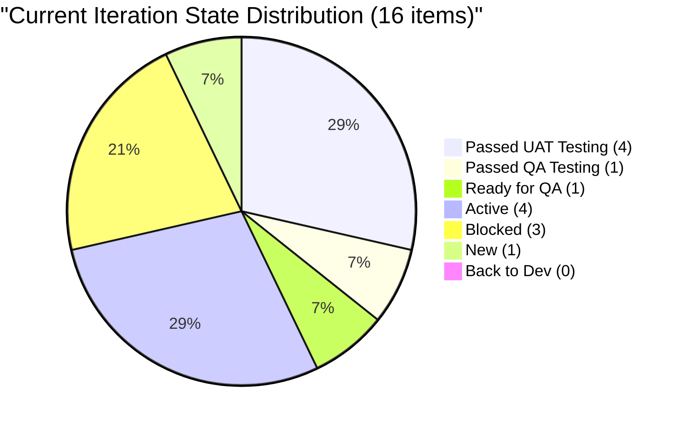
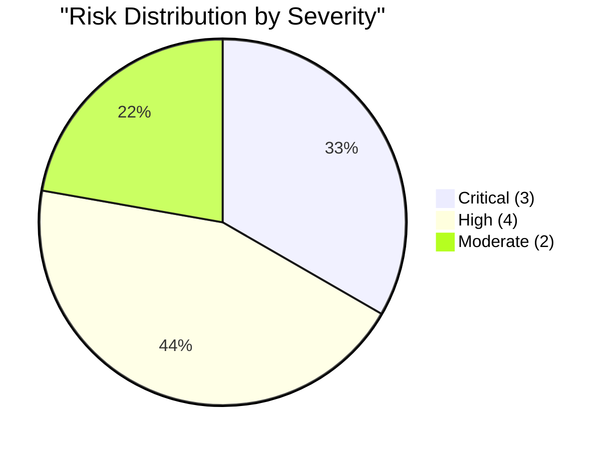
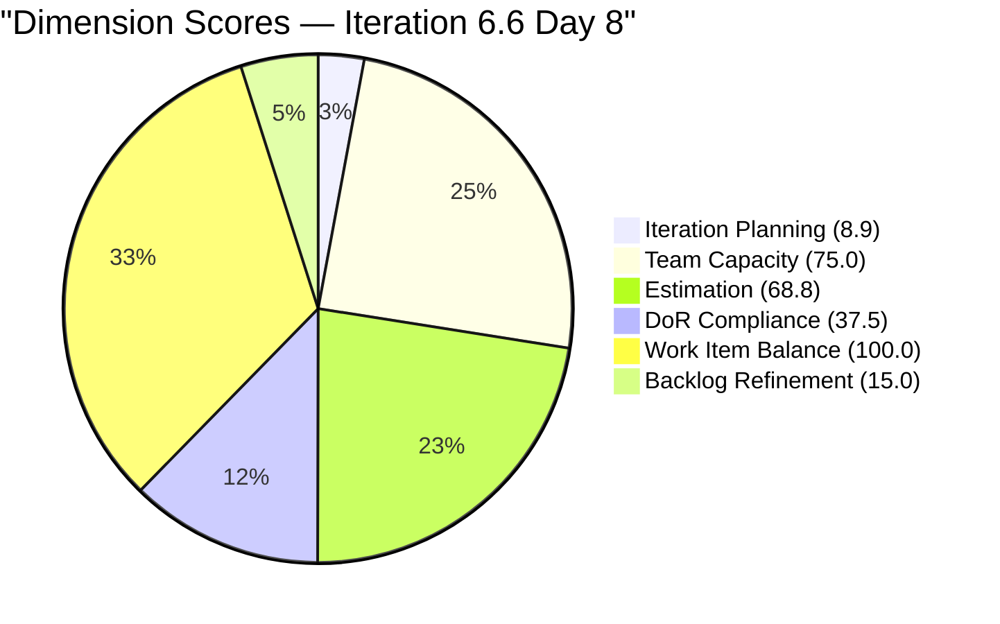

# SAFe Audit Report — Flawless Wedding App

## 1. Audit Metadata

| Field | Value |
|-------|-------|
| **Project** | Flawless Wedding App |
| **Project ID** | 92b967dc-5ec7-4874-b8f5-e43b00d88339 |
| **Team** | Flawless Wedding App Team |
| **Team ID** | 7d90ecbf-d272-4b0c-b33b-c66d96a790ac |
| **Backlog** | Stories and Deliverables (`Microsoft.RequirementCategory`) |
| **Board URL** | [Flawless Wedding App Board](https://dev.azure.com/jairo/Flawless%20Wedding%20App/_boards/board/t/Flawless%20Wedding%20App%20Team/Stories%20and%20Deliverables) |
| **Workspace Folder** | `ado_fl_dev` |
| **Current Iteration** | Iteration 6.6 (IP) |
| **Iteration Path** | `Flawless Wedding App\2026-PI6\Iteration 6.6 (IP)` |
| **Iteration Start** | March 23, 2026 |
| **Iteration Finish** | April 5, 2026 |
| **Audit Date** | March 30, 2026 — 09:00 UTC |
| **Audit Day** | Day 8 of 14 (57% elapsed) |
| **Previous Audit** | AUDIT_20260327_0004.md (Mar 27, 2026 — Day 5) |
| **Overall Score** | **50.9 / 100** |
| **Risk Band** | **High Risk** |
| **Audit Series** | Iteration 6.6 Audit #4 |
| **Framework** | SAFe 6.0 |
| **Rubric** | ADO SAFe v1 (six-dimension deterministic scoring) |

**Audit Boundary:** This audit covers only the Flawless Wedding App Team's Stories and Deliverables backlog. No other teams, boards, projects, or repositories were analyzed.

---

## 2. Executive Summary

This is the **fourth audit of Iteration 6.6 (IP)**. Today is Sprint Day 8 of 14 (57% elapsed).

**Significant board activity since Audit #3 (March 27):**

- **Multiple items advanced through the pipeline:** #199213 moved from QA Testing to Passed UAT Testing; #191038 jumped from Ready for Dev to Passed UAT Testing; #200259 moved from Ready for Dev to Ready for QA; #201124 moved from Back to Dev to Active; #201727 moved from New to Active.
- **Three items now Blocked:** #199214, #199215, and #200256 are all in Blocked state. #200256 regressed from Active to Blocked. The Islands cluster (#199214, #199215) remains stalled.
- **#201568 (Spike) gained DoR compliance:** Now has Description (54 nws) and AC (62 nws) — first Spike to pass DoR in this sprint.
- **PI7 planning activity:** Multiple items moved to PI7 Iteration 7.1 with estimation, and new PI7 Iteration 7.2 items added by Ressa Paracuelles. Forward planning is active.
- **Backlog grew to 180 items** (+1 from 179).
- **Estimation improved** from 63.6 to 68.8 — #201727 gained SP tracking but 5 items remain unestimated.

**Score declines marginally from 51.0 to 50.9 — still High Risk.** The pipeline movement is positive but structural issues (massive stale backlog, Carol's capacity gap, low planning ratio) continue to anchor the score.

---

## 3. Previous Audit Delta

| Dimension | Prior (Mar 27 Day 5) | Current (Mar 30 Day 8) | Delta |
|-----------|---------------------|----------------------|-------|
| Iteration Planning | 8.9 | 8.9 | 0.0 |
| Team Capacity | 75.0 | 75.0 | 0.0 |
| Estimation | 63.6 | 68.8 | **+5.2** |
| DoR Compliance | 43.8 | 37.5 | **-6.3** |
| Work Item Balance | 100.0 | 100.0 | 0.0 |
| Backlog Refinement | 14.7 | 15.0 | +0.3 |
| **Overall** | **51.0** | **50.9** | **-0.1** |

**Key changes since prior audit:**

| ID | Title | Prior State | Current State | Change |
|----|-------|-------------|---------------|--------|
| 199213 | Islands — Create Island | QA Testing | **Passed UAT Testing** | Advanced 2 stages |
| 191038 | (Defect) | Ready for Dev | **Passed UAT Testing** | Advanced significantly |
| 200259 | (User Story) | Ready for Dev | **Ready for QA** | Advanced |
| 200256 | (User Story) | Active | **Blocked** | Regression |
| 201124 | (Defect) | Back to Dev | **Active** | Re-engaged |
| 201727 | (Defect) | New | **Active** | Work started |
| 201568 | Sprint Research Spike | Active (no desc/AC) | Active (**DoR pass**) | Content added |

**Estimation improved:** 11 of 16 point-eligible items now estimated (was 7/11 in prior audit's count). Five items remain unestimated: 4 Spikes (#196898 SP=0, #201568, #201569, #201634) and 1 Defect (#201727).

**DoR declined:** 6 of 16 items pass (37.5%), down from 7/16 (43.8%). #201568 gained DoR but #201058 (User Story) fails on Description (0 nws despite having AC of 575 nws).

---

## 4. Current Iteration Snapshot

| Metric | Value |
|--------|-------|
| Iteration | 6.6 (IP) — Mar 23 – Apr 5, 2026 |
| Visible root backlog items | 180 |
| Current iteration root items | 16 |
| Contributors with current work | 4 (Luke, Ike, Ressa, Carol) |
| Contributors with capacity | 3 (Luke, Ike, Ressa) |
| Team capacity | 11 h/day |
| Point-eligible current items | 16 |
| Estimated current items | 11 |
| DoR-compliant current items | 6 |

### 4.1 Current Iteration Work Items (16)

| ID | Type | State | SP | Assigned To | Changed | DoR |
|----|------|-------|----|-------------|---------|-----|
| 199211 | User Story | Passed QA Testing | 1 | Luke Abram Colina | Mar 27 | Pass |
| 199213 | User Story | **Passed UAT Testing** | 1 | Luke Abram Colina | **Mar 30** | Pass |
| 199214 | User Story | Blocked | 1 | Luke Abram Colina | Mar 30 | Pass |
| 199215 | User Story | Blocked | 2 | Luke Abram Colina | Mar 30 | Pass |
| 200256 | User Story | **Blocked** | 2 | Luke Abram Colina | Mar 30 | Pass |
| 200259 | User Story | **Ready for QA** | 1 | Luke Abram Colina | Mar 30 | Fail (no desc) |
| 201058 | User Story | Passed UAT Testing | 1 | Luke Abram Colina | Mar 25 | Fail (no desc) |
| 201167 | Defect | Passed UAT Testing | 1 | Luke Abram Colina | Mar 25 | Fail |
| 191038 | Defect | **Passed UAT Testing** | 1 | Luke Abram Colina | **Mar 30** | Fail |
| 201124 | Defect | **Active** | 1 | Luke Abram Colina | Mar 30 | Fail (desc only) |
| 201219 | Defect | Passed UAT Testing | 1 | Luke Abram Colina | Mar 30 | Fail |
| 201727 | Defect | **Active** | — | Luke Abram Colina | Mar 30 | Fail |
| 196898 | Spike | Active | 0 | Ike Yana | Mar 30 | Fail |
| 201568 | Spike | Active | — | (unassigned) | Mar 30 | **Pass** |
| 201569 | Spike | New | — | Carol Cuison | Mar 30 | Fail |
| 201634 | Spike | Active | — | Ressa Paracuelles | Mar 30 | Fail |

### 4.2 Ownership Distribution

| Contributor | Items | Share |
|-------------|-------|-------|
| Luke Abram Colina | 12 | 75.0% |
| Ike Yana | 1 | 6.3% |
| Ressa Paracuelles | 1 | 6.3% |
| Carol Cuison | 1 | 6.3% |
| Unassigned | 1 | 6.3% |

Luke's concentration remains at 75.0% — unchanged and extreme.

### 4.3 Team Capacity

| Contributor | Capacity | Has Current Work? |
|-------------|----------|-------------------|
| Luke Abram Colina | Configured | Yes (12 items) |
| Ike Yana | Configured | Yes (1 item) |
| Ressa Paracuelles | Configured | Yes (1 item) |
| Luzmibel | Configured | No |
| Carol Cuison | **0 h/day** | **Yes (1 item)** |

**Team total: 11 h/day.** Carol Cuison's capacity gap is now the **14th consecutive audit flag** (counting from the first flag in this project's audit series).

### 4.4 State Distribution



---

## 5. Work Item Analysis

### 5.1 Pipeline Progress

Significant pipeline advancement since Day 5:

- **4 items at Passed UAT Testing** (#199213, #201058, #201167, #201219, #191038) — approaching closure
- **1 item at Passed QA Testing** (#199211) — also near closure
- **1 item at Ready for QA** (#200259) — advancing
- **3 items Blocked** (#199214, #199215, #200256) — critical bottleneck

The team has 5 items at or past UAT Testing, which represents meaningful delivery progress. However, none have been formally closed yet.

### 5.2 Islands Feature Cluster

| ID | Title | State | SP |
|----|-------|-------|----|
| 199211 | Islands — Display Islands | Passed QA Testing | 1 |
| 199213 | Islands — Create Island | **Passed UAT Testing** | 1 |
| 199214 | Islands — Edit Island | Blocked | 1 |
| 199215 | Islands — Delete Island | Blocked | 2 |

Progress: 2 of 4 items advanced past testing. 2 remain Blocked. The cluster is half-complete with the remaining items stuck.

### 5.3 Backlog Age Profile (180 items)

| Age Bucket | Count (approx) | Share |
|------------|---------------|-------|
| Fresh (< 45 days) | ~99 | 55.0% |
| 45-90 days | ~4 | 2.2% |
| 90-180 days | ~31 | 17.2% |
| > 180 days | ~46 | 25.6% |
| Total stale > 90 days | ~77 | 42.8% |

### 5.4 Type Distribution (Current 16 Items)

| Type | Count | Share |
|------|-------|-------|
| User Story | 7 | 43.8% |
| Defect | 5 | 31.3% |
| Spike | 4 | 25.0% |

No single type exceeds 60%. Spikes at 25.0% are below the 40% penalty threshold.

---

## 6. SAFe Compliance Scorecard

| # | Dimension | Score | Formula | Evidence | Notes |
|---|-----------|-------|---------|----------|-------|
| 1 | Iteration Planning | **8.9** | 16/180 x 100 | 16 of 180 in current iter | Backlog size anchors this; 164 items not in sprint |
| 2 | Team Capacity | **75.0** | 3/4 x 100 | Carol Cuison: 0 capacity with 1 current item | 14th consecutive flag |
| 3 | Estimation | **68.8** | 11/16 x 100 | 11 of 16 have SP > 0 | 4 Spikes + 1 Defect unestimated |
| 4 | DoR Compliance | **37.5** | 6/16 x 100 | 6 of 16 pass DoR | Defects and Spikes lack documentation |
| 5 | Work Item Balance | **100.0** | 100 (no penalties) | 7 US, 5 Defect, 4 Spike; no type > 60% | Healthy mix |
| 6 | Backlog Refinement | **15.0** | 55.0 - 20 - 20 = 15.0 | stale_90=42.8% > 25%; stale_180=46 items | Stale backlog dominates |
| | **Overall** | **50.9** | avg(6 dims) | | **High Risk** |

### Score Computation

```
Iteration Planning:  round(16/180 x 100, 1) = 8.9
Team Capacity:       round(3/4 x 100, 1)    = 75.0
Estimation:          round(11/16 x 100, 1)   = 68.8
DoR Compliance:      round(6/16 x 100, 1)    = 37.5
Work Item Balance:   100 (no penalties)       = 100.0
Backlog Refinement:  55.0 - 20 (stale90 > 25%) - 20 (stale180 >= 1) = 15.0

Overall: (8.9 + 75.0 + 68.8 + 37.5 + 100.0 + 15.0) / 6 = 305.2 / 6 = 50.9
Risk Band: High Risk (40-59.9)
```

---

## 7. Dimension Findings

### 7.1 Iteration Planning (8.9/100) — CRITICAL

16 of 180 backlog items are in the current iteration (8.9%). This is structurally trapped by the 180-item backlog denominator. The backlog grew from 179 to 180 since the last audit. Reaching even 20% would require either pruning 100+ items or committing 20+ additional items — neither is realistic mid-sprint.

**The only path to improvement is aggressive backlog pruning of the 46 items stale > 180 days.**

### 7.2 Team Capacity (75.0/100) — PERSISTENT GAP

Carol Cuison has item #201569 committed but 0 h/day capacity. This is now the **14th consecutive audit** flagging this gap. If Carol is not an active contributor, her item should be reassigned. If she is active, her capacity must be configured.

### 7.3 Estimation (68.8/100) — IMPROVED

Improved from 63.6 to 68.8. 11 of 16 items are estimated. The 5 unestimated items:

- **#196898** (Spike, SP=0): Zero is not a valid effort estimate
- **#201568** (Spike, Active): No SP despite now having DoR-compliant content
- **#201569** (Spike, New, Carol): No SP, no content
- **#201634** (Spike, Active, Ressa): No SP, no content
- **#201727** (Defect, Active, Luke): No SP — newly activated

All 4 Spikes remain unestimated. The Spike estimation discipline gap has been persistent across the entire audit series.

### 7.4 DoR Compliance (37.5/100) — DECLINED

6 of 16 items pass DoR, down from 7/16 (43.8%) in the prior audit.

**DoR pass (6):** #199211, #199213, #199214, #199215, #200256 (User Stories with full desc+AC), #201568 (Spike — newly compliant)

**DoR fail (10):**

- #201058 (User Story): Has AC (575 nws) but Description = 0 nws
- #200259 (User Story): Description = 0 nws, AC = 28 nws (passes AC but fails desc)
- #201167, #191038, #201219, #201727 (Defects): No description, no AC
- #201124 (Defect): Has description (803 nws) but no AC
- #196898, #201569, #201634 (Spikes): No description, no AC

The pattern persists: Defects and Spikes enter the iteration without documentation.

### 7.5 Work Item Balance (100.0/100) — HEALTHY

Excellent type diversity: User Stories (43.8%), Defects (31.3%), Spikes (25.0%). No type exceeds 60%. Spike share at 25% is below the 40% threshold. No penalties triggered.

### 7.6 Backlog Refinement (15.0/100) — CRITICAL

Base freshness is 55.0% (99 of 180 items changed within 45 days). Penalties:

- stale_90 share = 42.8% > 25% -> -20
- stale_180 count = 46 >= 1 -> -20
- No untouched current items (all 16 changed since Mar 23)

Final: 55.0 - 40 = 15.0. The 46 items stale > 180 days are the anchor. These are predominantly September 2025 Defects assigned to former contributors (Cathlyn Mae Lapid, Kaye Ann Layug, Alieu Farreeze Arcilla) who appear to no longer be active.

---

## 8. Risks and Bottlenecks



### CRITICAL: 3 Items Blocked — Sprint Delivery at Risk

# 199214, #199215, and #200256 are all Blocked. Combined 5 SP stuck. With 6 days remaining, these blockers must be resolved immediately or the items should be descoped

### CRITICAL: 180-Item Backlog — Planning Signal Destroyed

46 items are stale > 180 days. 77 items are stale > 90 days. The backlog is growing (+1 since last audit, +15 in the last week). Iteration Planning (8.9) and Backlog Refinement (15.0) are structurally trapped until a pruning session occurs.

### CRITICAL: Luke Carries 75% of Sprint (12/16 Items)

Extreme single-point-of-failure. If Luke is unavailable for even 1 day, 75% of sprint scope is impacted. This has been flagged in every audit with no redistribution.

### HIGH: Carol Cuison Capacity — 14th Consecutive Flag

Carol has #201569 committed with zero capacity. This is a process failure that has persisted across the entire Iteration 6.6 audit series and into prior sprints. Escalation required.

### HIGH: 5 Items Unestimated (4 Spikes + 1 Defect)

Estimation at 68.8 — improved but not sufficient. All 4 Spikes lack Story Points. #196898 has SP=0 which is not a valid estimate.

### HIGH: 10 of 16 Items Fail DoR

37.5% DoR compliance. Defects and Spikes consistently enter iterations without Description or AC. Items at Passed UAT Testing (#201167, #191038, #201219) have no acceptance criteria to verify against.

### HIGH: Zero Closures at Sprint Midpoint

5 items are at Passed UAT Testing or Passed QA Testing — work is essentially done but not formally closed. These should be closed to establish delivery credit.

### MODERATE: PI7 Planning Active but Backlog Uncontrolled

Ressa Paracuelles continues adding well-documented PI7 items. However, new items without corresponding pruning of stale items worsens all ratio-based scores.

### MODERATE: Islands Cluster Half-Complete

2 of 4 Islands items are past testing; 2 remain Blocked. Feature delivery is at risk if blockers are not resolved this week.

---

## 9. Prioritized Recommendations

1. **[Immediate — today]** Resolve blockers on #199214, #199215, and #200256. Identify the blocking dependency and escalate. With 6 days remaining, these items are at risk of non-delivery.

2. **[Immediate — today]** Close the 5 items at Passed UAT/QA Testing (#199211, #199213, #201058, #201167, #201219, #191038). These represent completed work that should be formally closed to establish sprint velocity.

3. **[Immediate — today]** Fix Carol Cuison's capacity or reassign #201569. This is the 14th consecutive flag. Either configure Carol at 2-4 h/day or move #201569 to another contributor.

4. **[This week]** Estimate the 5 unestimated items. Assign 1-2 SP to each Spike (#196898, #201568, #201569, #201634) and #201727. This would push Estimation to 100.0.

5. **[This week]** Add Description and AC to the 10 non-compliant items, prioritizing items near completion (#201058, #200259, #191038). Even brief descriptions improve traceability.

6. **[Before IP sprint ends]** Conduct a backlog pruning session targeting the 46 items stale > 180 days. Close or archive items assigned to former contributors (Cathlyn Mae Lapid, Kaye Ann Layug, Alieu Farreeze Arcilla). Target: reduce backlog to < 140 items.

7. **[Before IP sprint ends]** Redistribute Luke's workload. Reassign at least 4 items to Ike Yana or Ressa Paracuelles. Target Luke < 50% ownership for PI7.

---

## 10. Evidence Gaps and Limitations

| Gap | Impact | Notes |
|-----|--------|-------|
| Stale backlog (46 items > 180 days) | Iteration Planning and Backlog Refinement structurally trapped | Pruning session required |
| Carol Cuison 0 capacity | Team Capacity capped at 75.0 | 14th consecutive flag |
| 10 items fail DoR | Items may close without verifiable criteria | Defects and Spikes consistently lack documentation |
| #201058 no Description | DoR fail despite AC present | May have been removed or never added |
| #200259 AC is images only | AC text = 28 nws (likely alt text only) | Visual AC not extractable |
| Fresh/stale counts approximate | Based on ChangedDate analysis; +/- 3 items | Administrative bulk updates may skew freshness |
| No task-level breakdown | Sub-item progress not visible | Pipeline states provide some signal |

---



---

*Report generated: March 30, 2026 09:00 UTC*
*Auditor: AI EngProd Consultant (SAFe 6.0)*
*Rubric: ADO SAFe v1 (six-dimension deterministic scoring)*
*Iteration 6.6 (IP) Day 8 of 14 | Score: 50.9/100 (High Risk)*
*Previous: AUDIT_20260327_0004 (51.0/100 — High Risk)*
*Delta: -0.1 — Pipeline activity positive but DoR regression offsets gains*
