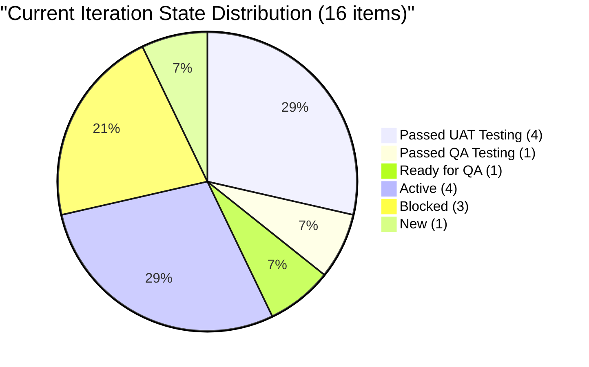
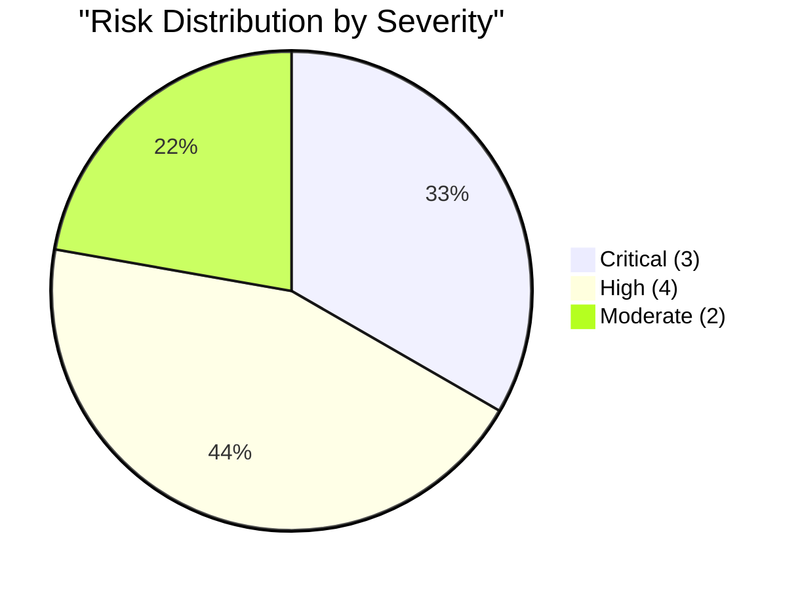
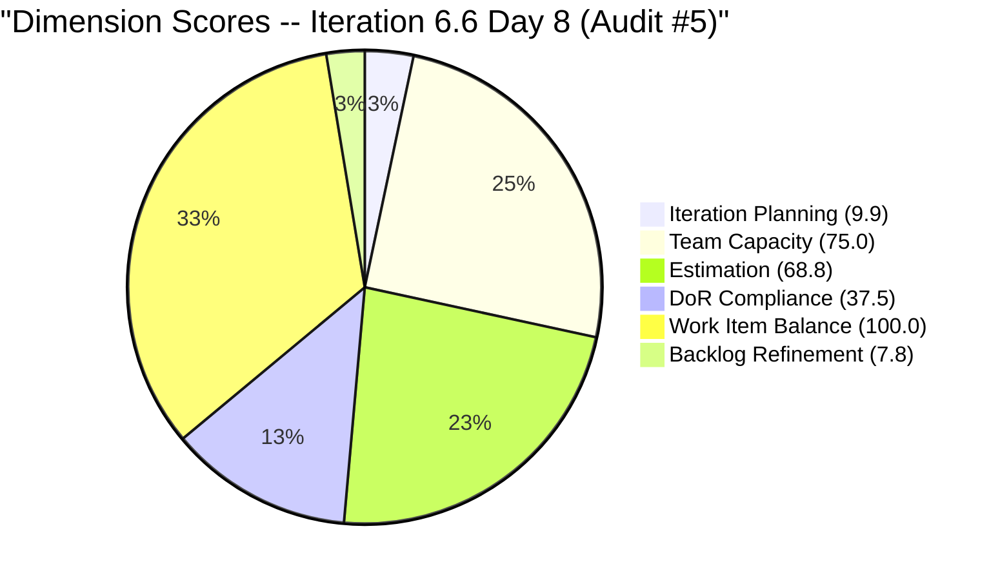

# SAFe Audit Report — Flawless Wedding App

## 1. Audit Metadata

| Field | Value |
|-------|-------|
| **Project** | Flawless Wedding App |
| **Project ID** | 92b967dc-5ec7-4874-b8f5-e43b00d88339 |
| **Team** | Flawless Wedding App Team |
| **Team ID** | 7d90ecbf-d272-4b0c-b33b-c66d96a790ac |
| **Backlog** | Stories and Deliverables (`Microsoft.RequirementCategory`) |
| **Board URL** | [Flawless Wedding App Board](https://dev.azure.com/jairo/Flawless%20Wedding%20App/_boards/board/t/Flawless%20Wedding%20App%20Team/Stories%20and%20Deliverables) |
| **Workspace Folder** | `ado_fl_dev` |
| **Current Iteration** | Iteration 6.6 (IP) |
| **Iteration Path** | `Flawless Wedding App\2026-PI6\Iteration 6.6 (IP)` |
| **Iteration Start** | March 23, 2026 |
| **Iteration Finish** | April 5, 2026 |
| **Audit Date** | March 30, 2026 — 10:30 PHT |
| **Audit Day** | Day 8 of 14 (57% elapsed) |
| **Previous Audit** | AUDIT_20260330_0900.md (Mar 30, 2026 09:00 UTC — Audit #4) |
| **Overall Score** | **49.8 / 100** |
| **Risk Band** | **High Risk** |
| **Audit Series** | Iteration 6.6 Audit #5 |
| **Framework** | SAFe 6.0 |
| **Rubric** | ADO SAFe v1 (six-dimension deterministic scoring) |

**Audit Boundary:** This audit covers only the Flawless Wedding App Team's Stories and Deliverables backlog. No other teams, boards, projects, or repositories were analyzed.

---

## 2. Executive Summary

This is the **fifth audit of Iteration 6.6 (IP)**. Conducted later on Day 8, this audit captures a **backlog reduction from 180 to 161 items** (-19 items since the 09:00 UTC audit). This is the first significant backlog reduction observed in the audit series and likely reflects a pruning or closure activity.

**No changes to current iteration items.** All 16 items in Iteration 6.6 retain identical states, assignments, Story Points, and content from the earlier same-day audit. The board is static for current sprint work.

**Key observations:**
- Backlog shrank from 180 to 161 items (-19) -- a welcome reduction
- Iteration Planning improved slightly (8.9 to 9.9) due to smaller denominator
- Backlog Refinement dropped from 15.0 to 7.8 -- the pruned items were likely fresh items (PI7 planning items or recent items), which reduced the fresh percentage
- 3 items remain Blocked (#199214, #199215, #200256)
- Zero closures at sprint midpoint
- Carol Cuison capacity gap persists (15th consecutive flag)

**Score declines from 50.9 to 49.8 -- still High Risk.** The backlog reduction helps Iteration Planning marginally but hurts Backlog Refinement because the fresh-to-total ratio worsened.

---

## 3. Previous Audit Delta

**Previous:** AUDIT_20260330_0900 — Iteration 6.6 (IP) Day 8, Audit #4

| Dimension | Audit #4 (09:00) | **Audit #5 (10:30)** | Delta |
|-----------|-------------------|----------------------|-------|
| Iteration Planning | 8.9 | **9.9** | **+1.0** |
| Team Capacity | 75.0 | **75.0** | 0.0 |
| Estimation | 68.8 | **68.8** | 0.0 |
| DoR Compliance | 37.5 | **37.5** | 0.0 |
| Work Item Balance | 100.0 | **100.0** | 0.0 |
| Backlog Refinement | 15.0 | **7.8** | **-7.2** |
| **Overall** | **50.9** | **49.8** | **-1.1** |

| Metric | Audit #4 | **Audit #5** | Delta |
|--------|----------|--------------|-------|
| Visible Backlog | 180 | **161** | **-19** |
| Current Iteration Items | 16 | **16** | 0 |
| Team Capacity | 11 h/day | **11 h/day** | 0 |
| Items Blocked | 3 | **3** | 0 |
| Items Closed | 0 | **0** | 0 |

**Key change:** 19 items removed from the visible backlog. Current iteration items and their states are entirely unchanged.

---

## 4. Current Iteration Snapshot

| Metric | Value |
|--------|-------|
| Iteration | 6.6 (IP) -- Mar 23 to Apr 5, 2026 |
| Visible root backlog items | 161 |
| Current iteration root items | 16 |
| Contributors with current work | 4 (Luke, Ike, Ressa, Carol) |
| Contributors with capacity | 3 (Luke, Ike, Ressa) |
| Team capacity | 11 h/day |
| Point-eligible current items | 16 |
| Estimated current items | 11 |
| DoR-compliant current items | 6 |

### 4.1 Current Iteration Work Items (16)

| ID | Type | State | SP | Assigned To | Changed | DoR |
|----|------|-------|----|-------------|---------|-----|
| 199211 | User Story | Passed QA Testing | 1 | Luke Abram Colina | Mar 27 | Pass |
| 199213 | User Story | Passed UAT Testing | 1 | Luke Abram Colina | Mar 30 | Pass |
| 199214 | User Story | Blocked | 1 | Luke Abram Colina | Mar 30 | Pass |
| 199215 | User Story | Blocked | 2 | Luke Abram Colina | Mar 30 | Pass |
| 200256 | User Story | Blocked | 2 | Luke Abram Colina | Mar 30 | Pass |
| 200259 | User Story | Ready for QA | 1 | Luke Abram Colina | Mar 30 | Fail (no desc) |
| 201058 | User Story | Passed UAT Testing | 1 | Luke Abram Colina | Mar 25 | Fail (no desc) |
| 201167 | Defect | Passed UAT Testing | 1 | Luke Abram Colina | Mar 25 | Fail |
| 191038 | Defect | Passed UAT Testing | 1 | Luke Abram Colina | Mar 30 | Fail |
| 201124 | Defect | Active | 1 | Luke Abram Colina | Mar 30 | Fail (desc only) |
| 201219 | Defect | Passed UAT Testing | 1 | Luke Abram Colina | Mar 30 | Fail |
| 201727 | Defect | Active | -- | Luke Abram Colina | Mar 30 | Fail |
| 196898 | Spike | Active | 0 | Ike Yana | Mar 30 | Fail |
| 201568 | Spike | Active | -- | (unassigned) | Mar 30 | Pass |
| 201569 | Spike | New | -- | Carol Cuison | Mar 30 | Fail |
| 201634 | Spike | Active | -- | Ressa Paracuelles | Mar 30 | Fail |

### 4.2 State Distribution



### 4.3 Ownership Distribution

| Contributor | Items | Share |
|-------------|-------|-------|
| Luke Abram Colina | 12 | 75.0% |
| Ike Yana | 1 | 6.3% |
| Ressa Paracuelles | 1 | 6.3% |
| Carol Cuison | 1 | 6.3% |
| Unassigned | 1 | 6.3% |

### 4.4 Team Capacity

| Contributor | Capacity | Has Current Work? |
|-------------|----------|-------------------|
| Luke Abram Colina | Configured | Yes (12 items) |
| Ike Yana | Configured | Yes (1 item) |
| Ressa Paracuelles | Configured | Yes (1 item) |
| Luzmibel | Configured | No |
| Carol Cuison | **0 h/day** | **Yes (1 item)** |

**Team total: 11 h/day.** Carol Cuison's capacity gap is now the **15th consecutive audit flag**.

---

## 5. Work Item Analysis

### 5.1 Type Distribution (Current 16 Items)

| Type | Count | Share |
|------|-------|-------|
| User Story | 7 | 43.8% |
| Defect | 5 | 31.3% |
| Spike | 4 | 25.0% |

No single type exceeds 60%. Spikes at 25.0% below the 40% penalty threshold.

### 5.2 Pipeline Progress

- **5 items at Passed UAT/QA Testing** -- approaching closure but not formally closed
- **3 items Blocked** -- #199214, #199215, #200256 (combined 5 SP)
- **4 items Active** -- #201124, #201727, #196898, #201568, #201634
- **1 item New** -- #201569 (Carol, 0 capacity)

### 5.3 Islands Feature Cluster

| ID | Title | State | SP |
|----|-------|-------|----|
| 199211 | Admin Assigns Island to Vendor | Passed QA Testing | 1 |
| 199213 | Bride Views Islands as Main Entry Point | Passed UAT Testing | 1 |
| 199214 | Bride Views Subcategories Within Selected Island | Blocked | 1 |
| 199215 | Bride Views Vendors by Island and Subcategory | Blocked | 2 |

Half-complete: 2 past testing, 2 blocked. Unchanged from prior audit.

### 5.4 Backlog Age Profile (161 items)

| Age Bucket | Count | Share |
|------------|-------|-------|
| Fresh (< 45 days) | 77 | 47.8% |
| 45-90 days | 1 | 0.6% |
| 90-180 days (not > 180) | 31 | 19.3% |
| > 180 days | 52 | 32.3% |
| **Total stale > 90 days** | **83** | **51.6%** |

The backlog reduction removed 19 items but the stale proportion worsened (42.8% to 51.6%) because removed items were likely fresh (PI7 planning or recent items). The 52 items stale > 180 days remain largely untouched since September 2025.

---

## 6. SAFe Compliance Scorecard

| # | Dimension | Score | Formula | Evidence | Notes |
|---|-----------|-------|---------|----------|-------|
| 1 | Iteration Planning | **9.9** | 16/161 x 100 | 16 of 161 in current iter | Improved from 8.9 due to smaller backlog |
| 2 | Team Capacity | **75.0** | 3/4 x 100 | Carol: 0 capacity with 1 item | 15th consecutive flag |
| 3 | Estimation | **68.8** | 11/16 x 100 | 11 of 16 have SP > 0 | 4 Spikes + 1 Defect unestimated |
| 4 | DoR Compliance | **37.5** | 6/16 x 100 | 6 of 16 pass DoR | Defects and Spikes lack documentation |
| 5 | Work Item Balance | **100.0** | 100 (no penalties) | 7 US, 5 Defect, 4 Spike; no type > 60% | Healthy mix |
| 6 | Backlog Refinement | **7.8** | 47.8 - 20 - 20 | stale_90=51.6% > 25%; stale_180=52 items | Stale proportion worsened |
| | **Overall** | **49.8** | avg(6 dims) | | **High Risk** |

### Score Computation

```
Iteration Planning:  round(16/161 x 100, 1) = 9.9
Team Capacity:       round(3/4 x 100, 1)    = 75.0
Estimation:          round(11/16 x 100, 1)   = 68.8
DoR Compliance:      round(6/16 x 100, 1)    = 37.5
Work Item Balance:   100 (no penalties)       = 100.0
Backlog Refinement:
  fresh = 77/161 = 47.8% => base = 47.8
  stale_90 = 83/161 = 51.6% > 25% => -20
  stale_180 = 52 >= 1 => -20
  untouched_current = 0/16 = 0% => no penalty
  Score = 47.8 - 20 - 20 = 7.8

Overall: (9.9 + 75.0 + 68.8 + 37.5 + 100.0 + 7.8) / 6 = 299.0 / 6 = 49.8
Risk Band: High Risk (40-59.9)
```

---

## 7. Dimension Findings

### 7.1 Iteration Planning (9.9/100) -- CRITICAL

16 of 161 backlog items in the current iteration (9.9%). Marginally improved from 8.9 due to backlog shrinkage (-19 items). This dimension remains structurally trapped by the massive backlog denominator. Reaching 20% would require reducing the backlog to ~80 items or committing 16+ more items.

### 7.2 Team Capacity (75.0/100) -- PERSISTENT GAP

Carol Cuison has item #201569 committed but 0 h/day capacity. This is now the **15th consecutive audit** flagging this gap. If Carol is not actively contributing, her item should be reassigned to Luke or Ressa.

### 7.3 Estimation (68.8/100) -- MODERATE

11 of 16 items estimated. The 5 unestimated items remain unchanged:
- **#196898** (Spike, SP=0): Zero is not a valid effort estimate
- **#201568, #201569, #201634** (Spikes): No SP
- **#201727** (Defect): No SP -- newly activated

All 4 Spikes remain unestimated. Spike estimation discipline gap persists across the entire audit series.

### 7.4 DoR Compliance (37.5/100) -- CRITICAL

6 of 16 items pass DoR. Unchanged from prior audit. Pass: #199211, #199213, #199214, #199215, #200256 (User Stories), #201568 (Spike). The 10 failing items lack Description, Acceptance Criteria, or both. Defects consistently enter iterations without documentation.

### 7.5 Work Item Balance (100.0/100) -- EXCELLENT

Healthy type diversity: User Stories 43.8%, Defects 31.3%, Spikes 25.0%. No penalties triggered.

### 7.6 Backlog Refinement (7.8/100) -- CRITICAL

This is the worst Backlog Refinement score in the audit series, down from 15.0. The backlog reduction removed 19 items but the stale proportion worsened to 51.6% (was 42.8%). 52 items remain stale > 180 days -- predominantly September 2025 Defects assigned to former contributors (Cathlyn Mae Lapid, Kaye Ann Layug, Alieu Farreeze Arcilla).

The pruning activity removed fresh items (PI7 planning or recently touched items), which paradoxically worsened the fresh-to-total ratio.

---

## 8. Risks and Bottlenecks



### CRITICAL: 3 Items Blocked -- Sprint Delivery at Risk

#199214, #199215, and #200256 are all Blocked. Combined 5 SP stuck. With 6 days remaining (and Holy Week April 2-5), these blockers must be resolved immediately or the items descoped.

### CRITICAL: 52 Items Stale > 180 Days -- Backlog Refinement Collapsed

The stale backlog now represents 51.6% of all visible items. These are predominantly September 2025 Defects that have not been touched in over 6 months. Iteration Planning and Backlog Refinement are both structurally trapped until these are pruned.

### CRITICAL: Luke Carries 75% of Sprint (12/16 Items)

Extreme single-point-of-failure. If Luke is unavailable, 75% of sprint scope is impacted. No redistribution has occurred despite repeated flags.

### HIGH: Carol Cuison Capacity -- 15th Consecutive Flag

Carol has #201569 committed with zero capacity. Process failure persisting since the audit series began.

### HIGH: 5 Items Unestimated (4 Spikes + 1 Defect)

All 4 Spikes lack Story Points. #196898 has SP=0 (not a valid estimate).

### HIGH: 10 of 16 Items Fail DoR

37.5% DoR compliance. Defects and Spikes consistently enter iterations without documentation. Items at Passed UAT Testing have no acceptance criteria to verify against.

### HIGH: Zero Closures at Sprint Midpoint

5 items at Passed UAT/QA Testing -- work is essentially done but not formally closed. These should be closed to establish delivery credit.

### MODERATE: Backlog Reduction Removed Fresh Items

The -19 item reduction is positive overall but paradoxically worsened Backlog Refinement because the removed items were fresh. Future pruning should target the 52 stale > 180 day items for maximum score improvement.

### MODERATE: Islands Cluster Half-Complete

2 of 4 Islands items past testing; 2 remain Blocked. Feature delivery at risk if blockers not resolved this week.

---

## 9. Prioritized Recommendations

1. **[Immediate -- today]** Resolve blockers on #199214, #199215, and #200256. Identify the blocking dependency and escalate. With 6 days remaining, these items are at risk of non-delivery.

2. **[Immediate -- today]** Close the 5 items at Passed UAT/QA Testing (#199211, #199213, #201058, #201167, #191038, #201219). These represent completed work that should be formally closed.

3. **[Immediate -- today]** Fix Carol Cuison's capacity or reassign #201569. This is the 15th consecutive flag. Either configure Carol at 2-4 h/day or move #201569 to another contributor.

4. **[This week]** Prune the 52 items stale > 180 days. Close or archive items assigned to former contributors. This is the single highest-impact action: reducing backlog to ~109 items would push Iteration Planning to ~14.7 and dramatically improve Backlog Refinement.

5. **[This week]** Estimate the 5 unestimated items. Assign 1-2 SP to each Spike and to #201727.

6. **[This week]** Add Description and AC to the 10 non-compliant items, prioritizing items near completion.

7. **[Before PI7]** Redistribute Luke's workload. Target Luke < 50% ownership for PI7.

---

## 10. Evidence Gaps and Limitations

| Gap | Impact | Notes |
|-----|--------|-------|
| 52 items stale > 180 days | Iteration Planning and Backlog Refinement structurally trapped | Pruning session required |
| Carol Cuison 0 capacity | Team Capacity capped at 75.0 | 15th consecutive flag |
| 10 items fail DoR | Items may close without verifiable criteria | Defects/Spikes consistently undocumented |
| #201058 no Description | DoR fail despite AC present | Image-only description |
| Backlog reduction target unknown | 19 items removed but unclear which | Fresh items removed worsened ratios |
| No task-level breakdown | Sub-item progress not visible | Pipeline states provide some signal |

---



---

*Report generated: March 30, 2026 10:30 PHT*
*Auditor: AI EngProd Consultant (SAFe 6.0)*
*Rubric: ADO SAFe v1 (six-dimension deterministic scoring)*
*Iteration 6.6 (IP) Day 8 of 14 | Score: 49.8/100 (High Risk)*
*Previous: AUDIT_20260330_0900 (50.9/100 -- High Risk)*
*Delta: -1.1 -- Backlog reduction improved planning ratio but worsened freshness ratio*
