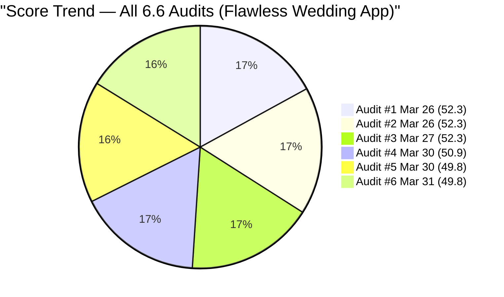
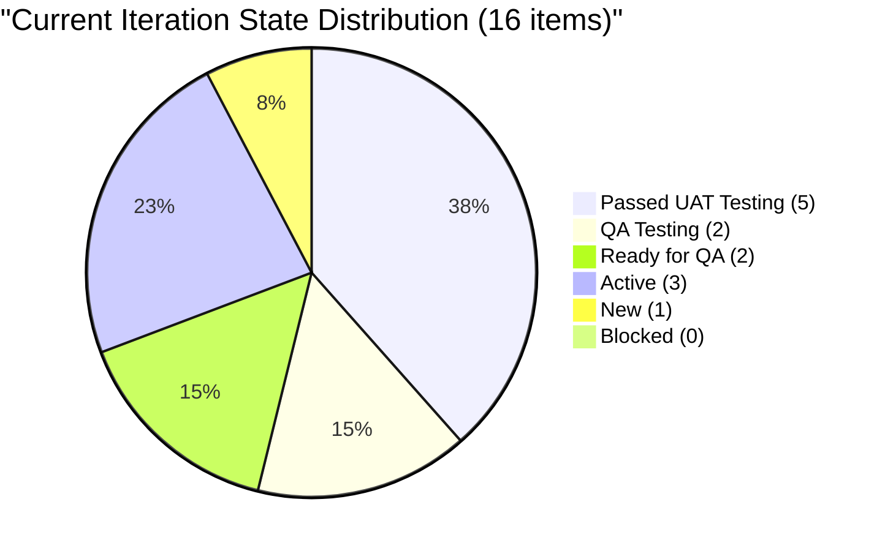
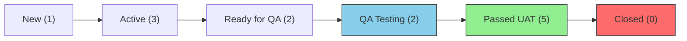
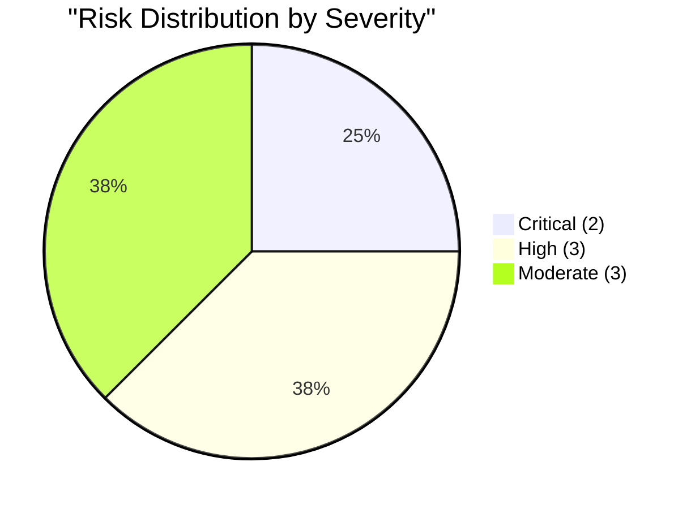

# SAFe Audit Report — Flawless Wedding App

## 1. Audit Metadata

| Field | Value |
|-------|-------|
| **Project** | Flawless Wedding App |
| **Project ID** | 92b967dc-5ec7-4874-b8f5-e43b00d88339 |
| **Team** | Flawless Wedding App Team |
| **Team ID** | 7d90ecbf-d272-4b0c-b33b-c66d96a790ac |
| **Backlog** | Stories and Deliverables (`Microsoft.RequirementCategory`) |
| **Board URL** | [Flawless Wedding App Board](https://dev.azure.com/jairo/Flawless%20Wedding%20App/_boards/board/t/Flawless%20Wedding%20App%20Team/Stories%20and%20Deliverables) |
| **Workspace Folder** | `ado_fl_dev` |
| **Current Iteration** | Iteration 6.6 (IP) |
| **Iteration Path** | `Flawless Wedding App\2026-PI6\Iteration 6.6 (IP)` |
| **Iteration Start** | March 23, 2026 |
| **Iteration Finish** | April 5, 2026 |
| **Audit Date** | March 31, 2026 — 09:00 PHT |
| **Audit Day** | Day 9 of 14 (64% elapsed) |
| **Previous Audit** | AUDIT_20260330_1030.md (Mar 30, 2026 10:30 PHT — Audit #5) |
| **Overall Score** | **49.8 / 100** |
| **Risk Band** | **High Risk** |
| **Audit Series** | Iteration 6.6 Audit #6 |
| **Framework** | SAFe 6.0 |
| **Rubric** | ADO SAFe v1 (six-dimension deterministic scoring) |

**Audit Boundary:** This audit covers only the Flawless Wedding App Team's Stories and Deliverables backlog. No other teams, boards, projects, or repositories were analyzed.

---

## 2. Executive Summary

This is the **sixth audit of Iteration 6.6 (IP)**. Since Audit #5 (Mar 30 at 10:30 PHT), **significant state transitions** have occurred — the 3 Blocked items have all been unblocked:

1. **#199214** (Bride Views Subcategories) moved from Blocked to **QA Testing** (Apr 1)
2. **#199215** (Bride Views Vendors by Island) moved from Blocked to **QA Testing** (Apr 1)
3. **#200256** (Manage Archived Users) moved from Blocked to **Ready for QA** (Apr 1)
4. **#199211** (Admin Assigns Island) advanced from Passed QA Testing to **Passed UAT Testing** (Apr 1)
5. **#201124** (Vendor login issue) moved from Active to **Ready for QA** (Apr 1)
6. **#201569** reassigned from Carol Cuison to **Ramon** (Mar 31)

**All 3 blockers resolved.** The Islands feature cluster is now fully unblocked with 2 items in QA Testing and 2 already past UAT. This is the most significant forward progress in the audit series for Iteration 6.6.

However, the **numerical score is unchanged at 49.8/100** because the scoring dimensions (backlog ratio, capacity, estimation, DoR, balance, refinement) are structurally unaffected by state transitions. The capacity gap shifts from Carol Cuison to Ramon (who has work item #201569 but no configured capacity).

---

## 3. Previous Audit Delta

**Previous:** AUDIT_20260330_1030 — Iteration 6.6 (IP) Day 8, Audit #5

| Dimension | Audit #5 (Mar 30) | **Audit #6 (Mar 31)** | Delta |
|-----------|-------------------|----------------------|-------|
| Iteration Planning | 9.9 | **9.9** | 0.0 |
| Team Capacity | 75.0 | **75.0** | 0.0 |
| Estimation | 68.8 | **68.8** | 0.0 |
| DoR Compliance | 37.5 | **37.5** | 0.0 |
| Work Item Balance | 100.0 | **100.0** | 0.0 |
| Backlog Refinement | 7.8 | **7.8** | 0.0 |
| **Overall** | **49.8** | **49.8** | **0.0** |

| Metric | Audit #5 | **Audit #6** | Delta |
|--------|----------|--------------|-------|
| Visible Backlog | 161 | **161** | 0 |
| Current Iteration Items | 16 | **16** | 0 |
| Team Capacity | 11 h/day | **11 h/day** | 0 |
| Items Blocked | 3 | **0** | **-3** |
| Items in QA Testing | 0 | **2** | **+2** |
| Items Ready for QA | 1 | **2** | **+1** |
| Items Closed | 0 | **0** | 0 |
| Assignee Change | Carol on #201569 | **Ramon on #201569** | Changed |

**Key change:** All 3 blockers resolved. Active pipeline progress despite unchanged scoring dimensions.

### Score Trend (Audits #1 -- #6, Iteration 6.6)



---

## 4. Current Iteration Snapshot

| Metric | Value |
|--------|-------|
| Iteration | 6.6 (IP) — Mar 23 to Apr 5, 2026 |
| Visible root backlog items | 161 |
| Current iteration root items | 16 |
| Contributors with current work | 4 (Luke, Ike, Ressa, Ramon) |
| Contributors with capacity | 3 (Luke, Ike, Ressa) |
| Team capacity | 11 h/day |
| Point-eligible current items | 16 |
| Estimated current items | 11 |
| DoR-compliant current items | 6 |

### 4.1 Current Iteration Work Items (16)

| ID | Type | State | SP | Assigned To | Changed | DoR |
|----|------|-------|----|-------------|---------|-----|
| 199211 | User Story | Passed UAT Testing | 1 | Luke Abram Colina | Apr 1 | Pass |
| 199213 | User Story | Passed UAT Testing | 1 | Luke Abram Colina | Mar 30 | Pass |
| 199214 | User Story | **QA Testing** | 1 | Luke Abram Colina | Apr 1 | Pass |
| 199215 | User Story | **QA Testing** | 2 | Luke Abram Colina | Apr 1 | Pass |
| 200256 | User Story | **Ready for QA** | 2 | Luke Abram Colina | Apr 1 | Pass |
| 200259 | User Story | Ready for QA | 1 | Luke Abram Colina | Mar 30 | Fail (no desc) |
| 201058 | User Story | Passed UAT Testing | 1 | Luke Abram Colina | Mar 25 | Fail (image-only desc) |
| 201167 | Defect | Passed UAT Testing | 1 | Luke Abram Colina | Mar 25 | Fail |
| 191038 | Defect | Passed UAT Testing | 1 | Luke Abram Colina | Mar 30 | Fail |
| 201124 | Defect | **Ready for QA** | 1 | Luke Abram Colina | Apr 1 | Fail (desc only, no AC) |
| 201219 | Defect | Passed UAT Testing | 1 | Luke Abram Colina | Mar 30 | Fail |
| 201727 | Defect | Active | -- | Luke Abram Colina | Mar 30 | Fail |
| 196898 | Spike | Active | 0 | Ike Yana | Mar 30 | Fail |
| 201568 | Spike | Active | -- | (unassigned) | Mar 30 | Pass |
| 201569 | Spike | New | -- | **Ramon** | Mar 31 | Fail |
| 201634 | Spike | Active | -- | Ressa Paracuelles | Mar 30 | Fail |

### 4.2 State Distribution



### 4.3 Pipeline Progress Flow



### 4.4 Ownership Distribution

| Contributor | Items | Share |
|-------------|-------|-------|
| Luke Abram Colina | 12 | 75.0% |
| Ike Yana | 1 | 6.3% |
| Ressa Paracuelles | 1 | 6.3% |
| Ramon | 1 | 6.3% |
| Unassigned | 1 | 6.3% |

### 4.5 Team Capacity

| Contributor | Capacity | Activity | Has Current Work? |
|-------------|----------|----------|-------------------|
| Luke Abram Colina | 6 h/day | Development | Yes (12 items) |
| Ike Yana | 1 h/day | Development | Yes (1 item) |
| Ressa Paracuelles | 3 h/day | Testing | Yes (1 item) |
| Luzmibel Paculanang | 1 h/day | Testing | No |
| **Ramon** | **0 h/day** | **Not configured** | **Yes (1 item)** |

**Team total: 11 h/day.** Ramon's capacity gap replaces Carol Cuison's gap (Carol is no longer assigned any current items; #201569 reassigned to Ramon).

---

## 5. Work Item Analysis

### 5.1 Type Distribution (Current 16 Items)

| Type | Count | Share |
|------|-------|-------|
| User Story | 7 | 43.8% |
| Defect | 5 | 31.3% |
| Spike | 4 | 25.0% |

No single type exceeds 60%. Spikes at 25.0% below the 40% penalty threshold. Excellent type diversity.

### 5.2 Islands Feature Cluster — Blockers Resolved

| ID | Title | State | SP | Change Since Audit #5 |
|----|-------|-------|----|----------------------|
| 199211 | Admin Assigns Island to Vendor | Passed UAT Testing | 1 | QA -> **UAT** |
| 199213 | Bride Views Islands as Main Entry Point | Passed UAT Testing | 1 | Unchanged |
| 199214 | Bride Views Subcategories Within Selected Island | **QA Testing** | 1 | **Blocked -> QA Testing** |
| 199215 | Bride Views Vendors by Island and Subcategory | **QA Testing** | 2 | **Blocked -> QA Testing** |

**All 4 Islands items are now unblocked and progressing through the pipeline.** 2 past UAT, 2 in QA. This feature cluster is on track for completion if QA passes this week.

### 5.3 Sprint Pipeline Progress

| Pipeline Stage | Count | SP | Change |
|---------------|-------|-----|--------|
| Passed UAT Testing | 5 | 5 | +1 item |
| QA Testing | 2 | 3 | +2 items (unblocked) |
| Ready for QA | 2 | 3 | +1 item |
| Active | 3 | 0* | -2 items (moved forward) |
| New | 1 | 0 | -2 (blockers resolved) |
| Blocked | 0 | 0 | **-3 (all resolved)** |

*Active items are unestimated Spikes + 1 Defect with SP=0.

### 5.4 Backlog Age Profile (161 items)

| Age Bucket | Count | Share |
|------------|-------|-------|
| Fresh (< 45 days) | 77 | 47.8% |
| 45-90 days | 1 | 0.6% |
| 90-180 days (not > 180) | 31 | 19.3% |
| > 180 days | 52 | 32.3% |
| **Total stale > 90 days** | **83** | **51.6%** |

Unchanged from Audit #5. The 52 items stale > 180 days remain the primary drag on Backlog Refinement.

---

## 6. SAFe Compliance Scorecard

| # | Dimension | Score | Formula | Evidence | Notes |
|---|-----------|-------|---------|----------|-------|
| 1 | Iteration Planning | **9.9** | 16/161 x 100 | 16 of 161 in current iter | Structurally trapped by large backlog |
| 2 | Team Capacity | **75.0** | 3/4 x 100 | Ramon: 0 capacity with 1 item | Capacity gap shifted from Carol to Ramon |
| 3 | Estimation | **68.8** | 11/16 x 100 | 11 of 16 have SP > 0 | 4 Spikes + 1 Defect unestimated |
| 4 | DoR Compliance | **37.5** | 6/16 x 100 | 6 of 16 pass DoR | Defects and Spikes lack documentation |
| 5 | Work Item Balance | **100.0** | 100 (no penalties) | 7 US, 5 Defect, 4 Spike; no type > 60% | Healthy mix |
| 6 | Backlog Refinement | **7.8** | 47.8 - 20 - 20 | stale_90=51.6% > 25%; stale_180=52 items | Structural drag |
| | **Overall** | **49.8** | avg(6 dims) | | **High Risk (40-59.9)** |

### Score Computation

```
Iteration Planning:  round(16/161 x 100, 1) = 9.9
Team Capacity:       round(3/4 x 100, 1)    = 75.0
  contributors_with_current_work = 4 (Luke, Ike, Ressa, Ramon)
  contributors_with_capacity = 3 (Luke 6h, Ike 1h, Ressa 3h)
  Ramon has #201569 but 0 capacity configured
Estimation:          round(11/16 x 100, 1)   = 68.8
DoR Compliance:      round(6/16 x 100, 1)    = 37.5
Work Item Balance:   100 (no penalties)       = 100.0
  User Story 43.8%, Defect 31.3%, Spike 25.0%
  No dominant type > 60%, has User Story, spike < 40%
Backlog Refinement:
  fresh = 77/161 = 47.8% => base = 47.8
  stale_90 = 83/161 = 51.6% > 25% => -20
  stale_180 = 52 >= 1 => -20
  untouched_current = 0/16 = 0% => no penalty
  Score = max(47.8 - 20 - 20, 0) = 7.8

Overall: (9.9 + 75.0 + 68.8 + 37.5 + 100.0 + 7.8) / 6 = 299.0 / 6 = 49.8
Risk Band: High Risk (40-59.9)
```

---

## 7. Dimension Findings

### 7.1 Iteration Planning (9.9/100) — CRITICAL

16 of 161 backlog items in the current iteration (9.9%). Unchanged. This dimension remains structurally trapped by the massive backlog denominator. The only path to improvement is backlog pruning — removing 80+ stale items would double this score.

### 7.2 Team Capacity (75.0/100) — PERSISTENT GAP (Shifted)

The capacity gap has shifted from Carol Cuison to Ramon. #201569 ("Follow Up Netlify Access and Github Transfer") was reassigned from Carol to Ramon on March 31. Ramon has no configured capacity in ADO. If #201569 is Ramon's PO/admin task (not a team development task), consider unassigning it from the sprint to resolve the gap.

This is now the **16th consecutive audit** flagging a capacity mismatch for this team (previously Carol, now Ramon).

### 7.3 Estimation (68.8/100) — MODERATE

11 of 16 items estimated. The 5 unestimated items remain:
- **#196898** (Spike, SP=0): Zero is not a valid effort estimate
- **#201568, #201569, #201634** (Spikes): No SP
- **#201727** (Defect, PROD issue): No SP

Spike estimation discipline gap persists.

### 7.4 DoR Compliance (37.5/100) — CRITICAL

6 of 16 items pass DoR. The 5 passing User Stories (#199211-#200256) all have structured Given/When/Then acceptance criteria. #201568 (Meetings Spike) passes with list-format criteria. The 10 failing items are primarily Defects and Spikes that entered the iteration without documentation.

### 7.5 Work Item Balance (100.0/100) — EXCELLENT

Healthy type diversity: User Stories 43.8%, Defects 31.3%, Spikes 25.0%. No penalties triggered.

### 7.6 Backlog Refinement (7.8/100) — CRITICAL

Unchanged. 83 items (51.6%) are stale > 90 days. 52 items (32.3%) are stale > 180 days — predominantly September 2025 Defects. This is the single highest-impact dimension for improvement.

---

## 8. Risks and Bottlenecks



### CRITICAL: 52 Items Stale > 180 Days — Backlog Refinement Collapsed

The stale backlog represents 51.6% of all visible items. These are predominantly September 2025 Defects that have not been touched in over 6 months. Iteration Planning and Backlog Refinement are both structurally trapped until these are pruned.

### CRITICAL: Luke Carries 75% of Sprint (12/16 Items)

Extreme single-point-of-failure. If Luke is unavailable, 75% of sprint scope is impacted. No redistribution has occurred despite repeated flags.

### HIGH: Zero Closures at Day 9

5 items at Passed UAT Testing — work is essentially done but not formally closed. 2 items in QA Testing. Sprint is 64% elapsed with 0% burned. Close the UAT-passed items immediately.

### HIGH: 5 Items Unestimated (4 Spikes + 1 Defect)

All 4 Spikes lack Story Points (or have SP=0). #201727 (PROD Stripe issue) is Active with no estimate.

### HIGH: Ramon Capacity Gap — #201569

Ramon has item #201569 committed but 0 h/day capacity. If this is a PO/admin task, it may not need team capacity. Consider either configuring Ramon's capacity or unassigning the item.

### MODERATE: 10 of 16 Items Fail DoR

37.5% DoR compliance. Defects and Spikes consistently enter iterations without documentation.

### MODERATE: Holy Week — April 2-5

No days-off configured for any team member. Effective remaining work days may be 2 (Mar 31-Apr 1).

### MODERATE: #201727 PROD Stripe Issue Still Active

PROD blocker for Stripe Connect onboarding. Active since Mar 30 with no estimate. This may be blocking vendor revenue.

---

## 9. Prioritized Recommendations

1. **[Immediate — today]** Close the 5 items at Passed UAT Testing (#199211, #199213, #201058, #201167, #191038, #201219). These represent completed work that should be formally closed to establish delivery credit. (Note: 6 items total at UAT.)

2. **[Immediate — today]** Resolve Ramon's capacity gap: either configure Ramon at 1 h/day for admin work, or unassign #201569 from the sprint (Ramon is PO, not a sprint contributor).

3. **[This week]** Estimate the 5 unestimated items. Assign 1-2 SP to each Spike and to #201727.

4. **[This week]** Prune the 52 items stale > 180 days. Close or archive items assigned to former contributors. This is the single highest-impact action for long-term score improvement.

5. **[This week]** Add Description and AC to the 10 non-compliant items, prioritizing items near completion.

6. **[This week]** Configure Holy Week days-off (April 2-5) for all team members.

7. **[Before PI7]** Redistribute Luke's workload. Target Luke < 50% ownership for PI7.

---

## 10. Evidence Gaps and Limitations

| Gap | Impact | Notes |
|-----|--------|-------|
| 52 items stale > 180 days | Iteration Planning and Backlog Refinement structurally trapped | Pruning session required |
| Ramon 0 capacity (new) | Team Capacity capped at 75.0 | Shifted from Carol; 16th consecutive flag |
| 10 items fail DoR | Items may close without verifiable criteria | Defects/Spikes consistently undocumented |
| #201058 image-only description | DoR fail despite visual content | Text extraction not counted |
| No task-level breakdown | Sub-item progress not visible | Pipeline states provide signal |
| Zero closures at Day 9 | Sprint delivery formally at 0% | 5-6 items substantively complete |

---

### Iteration 6.6 Score History

| Audit | Date | Day | Score | Key Change |
|-------|------|-----|-------|------------|
| #1 | Mar 26 | Day 4 | 52.3 | First 6.6 audit |
| #2 | Mar 26 | Day 4 | 52.3 | Batch audit |
| #3 | Mar 27 | Day 5 | 52.3 | No change |
| #4 | Mar 30 | Day 8 | 50.9 | Backlog shrank from 180 |
| #5 | Mar 30 | Day 8 | 49.8 | Further pruning (-19 items) |
| **#6** | **Mar 31** | **Day 9** | **49.8** | **3 blockers resolved; significant pipeline progress** |

---

*Report generated: March 31, 2026 09:00 PHT*
*Auditor: AI EngProd Consultant (SAFe 6.0)*
*Rubric: ADO SAFe v1 (six-dimension deterministic scoring)*
*Iteration 6.6 (IP) Day 9 of 14 | Score: 49.8/100 (High Risk)*
*Previous: AUDIT_20260330_1030 (49.8/100 — High Risk)*
*Delta: 0.0 — Score unchanged but 3 blockers resolved and pipeline advancing*
