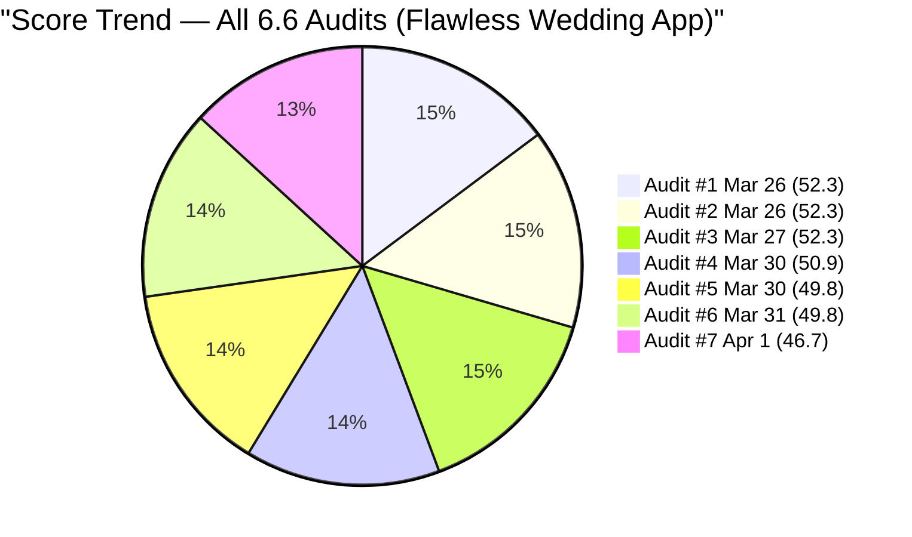
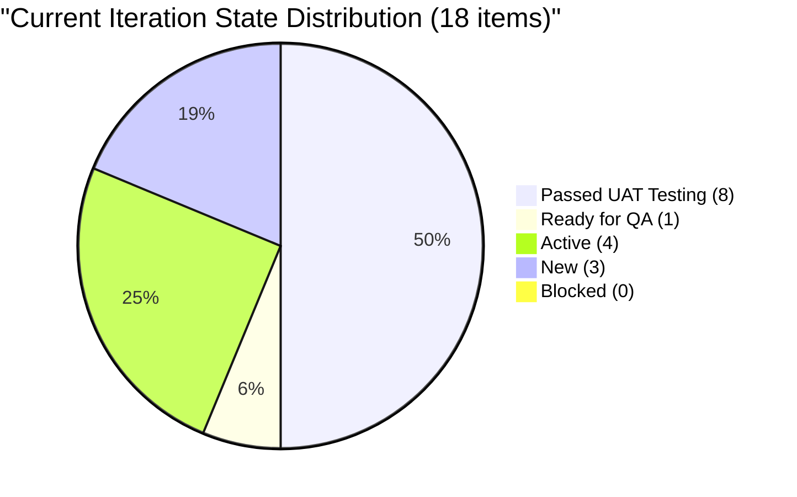
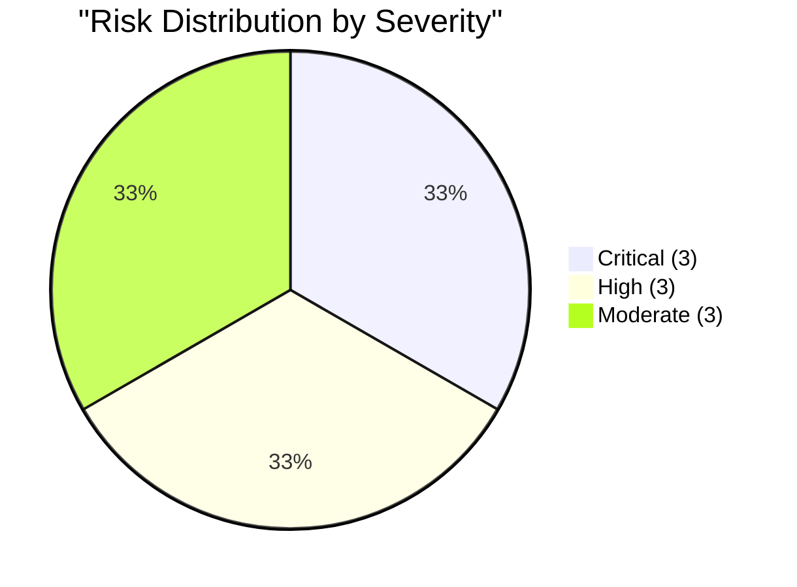

# SAFe Audit Report — Flawless Wedding App

## 1. Audit Metadata

| Field | Value |
|-------|-------|
| **Project** | Flawless Wedding App |
| **Project ID** | 92b967dc-5ec7-4874-b8f5-e43b00d88339 |
| **Team** | Flawless Wedding App Team |
| **Team ID** | 7d90ecbf-d272-4b0c-b33b-c66d96a790ac |
| **Backlog** | Stories and Deliverables (`Microsoft.RequirementCategory`) |
| **Board URL** | [Flawless Wedding App Board](https://dev.azure.com/jairo/Flawless%20Wedding%20App/_boards/board/t/Flawless%20Wedding%20App%20Team/Stories%20and%20Deliverables) |
| **Workspace Folder** | `ado_fl_dev` |
| **Current Iteration** | Iteration 6.6 (IP) |
| **Iteration Path** | `Flawless Wedding App\2026-PI6\Iteration 6.6 (IP)` |
| **Iteration Start** | March 23, 2026 |
| **Iteration Finish** | April 5, 2026 |
| **Audit Date** | April 1, 2026 — 09:00 PHT |
| **Audit Day** | Day 10 of 14 (71% elapsed) |
| **Previous Audit** | AUDIT_20260331_0900.md (Mar 31, 2026 09:00 PHT — Audit #6) |
| **Overall Score** | **46.7 / 100** |
| **Risk Band** | **High Risk** |
| **Audit Series** | Iteration 6.6 Audit #7 |
| **Framework** | SAFe 6.0 |
| **Rubric** | ADO SAFe v1 (six-dimension deterministic scoring) |

**Audit Boundary:** This audit covers only the Flawless Wedding App Team's Stories and Deliverables backlog. No other teams, boards, projects, or repositories were analyzed.

---

## 2. Executive Summary

This is the **seventh audit of Iteration 6.6 (IP)**. Since Audit #6 (Mar 31 at 09:00 PHT), several significant changes have occurred:

### Key Changes

1. **2 new Retro Spikes added to the sprint:**
   - **#202086** "[Retro] Create and Identify Features for Refactor" (Ressa, New)
   - **#202087** "[Retro] Schedule Daily Touch Base for Luke and Ike" (Carol Cuison, New)

2. **3 items advanced to Passed UAT Testing:**
   - **#199214** Bride Views Subcategories -- QA Testing to **Passed UAT Testing** (Apr 1)
   - **#199215** Bride Views Vendors by Island -- QA Testing to **Passed UAT Testing** (Apr 1)
   - **#201124** Vendor login issue -- Ready for QA to **Passed UAT Testing** (Apr 1)

3. **#201568** (Meetings Spike) reassigned from unassigned to **Ike Yana** and updated Apr 1.

4. **#200256** (Manage Archived Users) state updated Apr 1, still Ready for QA.

5. **Backlog grew from 161 to 183 items** (+22), primarily new PI7 User Stories and Enablers created by Ressa Paracuelles on Mar 27-30 (mobile app refactor planning).

6. **Carol Cuison returns** as assignee on #202087, re-introducing a capacity gap (Carol has no configured capacity).

**Score drops from 49.8 to 46.7 (-3.1) -- High Risk.** The backlog growth (161 to 183) dilutes Iteration Planning further (9.9 to 9.8) while the addition of 2 unestimated/undocumented Retro Spikes worsens Estimation (68.8 to 61.1) and DoR (37.5 to 33.3). Carol Cuison's return adds a 5th contributor without capacity, dropping Team Capacity from 75.0 to 60.0. Backlog Refinement improves slightly (7.8 to 15.7) as the new items increase the fresh percentage.

---

## 3. Previous Audit Delta

**Previous:** AUDIT_20260331_0900 — Iteration 6.6 (IP) Day 9, Audit #6

| Dimension | Audit #6 (Mar 31) | **Audit #7 (Apr 1)** | Delta |
|-----------|-------------------|----------------------|-------|
| Iteration Planning | 9.9 | **9.8** | -0.1 |
| Team Capacity | 75.0 | **60.0** | -15.0 |
| Estimation | 68.8 | **61.1** | -7.7 |
| DoR Compliance | 37.5 | **33.3** | -4.2 |
| Work Item Balance | 100.0 | **100.0** | 0.0 |
| Backlog Refinement | 7.8 | **15.7** | +7.9 |
| **Overall** | **49.8** | **46.7** | **-3.1** |

| Metric | Audit #6 | **Audit #7** | Delta |
|--------|----------|--------------|-------|
| Visible Backlog | 161 | **183** | **+22** |
| Current Iteration Items | 16 | **18** | **+2** |
| Team Capacity | 11 h/day | **11 h/day** | 0 |
| Contributors with Work | 4 | **5** | **+1** (Carol returns) |
| Items Passed UAT | 5 | **8** | **+3** |
| Items Closed | 0 | **0** | 0 |

### Score Trend (Audits #1 -- #7, Iteration 6.6)



---

## 4. Current Iteration Snapshot

| Metric | Value |
|--------|-------|
| Iteration | 6.6 (IP) -- Mar 23 to Apr 5, 2026 |
| Visible root backlog items | 183 |
| Current iteration root items | 18 |
| Contributors with current work | 5 (Luke, Ike, Ressa, Ramon, Carol) |
| Contributors with capacity | 3 (Luke, Ike, Ressa) |
| Team capacity | 11 h/day |
| Point-eligible current items | 18 |
| Estimated current items | 11 |
| DoR-compliant current items | 6 |

### 4.1 Current Iteration Work Items (18)

| ID | Type | State | SP | Assigned To | Changed | DoR |
|----|------|-------|----|-------------|---------|-----|
| 199211 | User Story | Passed UAT Testing | 1 | Luke Abram Colina | Apr 1 | Pass |
| 199213 | User Story | Passed UAT Testing | 1 | Luke Abram Colina | Mar 30 | Pass |
| 199214 | User Story | **Passed UAT Testing** | 1 | Luke Abram Colina | Apr 1 | Pass |
| 199215 | User Story | **Passed UAT Testing** | 2 | Luke Abram Colina | Apr 1 | Pass |
| 200256 | User Story | Ready for QA | 2 | Luke Abram Colina | Apr 1 | Pass |
| 200259 | User Story | Ready for QA | 1 | Luke Abram Colina | Mar 30 | Fail (no desc) |
| 201058 | User Story | Passed UAT Testing | 1 | Luke Abram Colina | Mar 25 | Fail (image-only desc) |
| 201167 | Defect | Passed UAT Testing | 1 | Luke Abram Colina | Mar 25 | Fail |
| 191038 | Defect | Passed UAT Testing | 1 | Luke Abram Colina | Mar 30 | Fail |
| 201124 | Defect | **Passed UAT Testing** | 1 | Luke Abram Colina | Apr 1 | Fail |
| 201219 | Defect | Passed UAT Testing | 1 | Luke Abram Colina | Mar 30 | Fail |
| 201727 | Defect | Active | -- | Luke Abram Colina | Mar 30 | Fail |
| 196898 | Spike | Active | 0 | Ike Yana | Mar 30 | Fail |
| 201568 | Spike | Active | -- | **Ike Yana** | Apr 1 | Pass |
| 201569 | Spike | New | -- | Ramon | Mar 31 | Fail |
| 201634 | Spike | Active | -- | Ressa Paracuelles | Mar 30 | Fail |
| **202086** | **Spike** | **New** | **--** | **Ressa Paracuelles** | **Apr 1** | **Fail** |
| **202087** | **Spike** | **New** | **--** | **Carol Cuison** | **Apr 1** | **Fail** |

### 4.2 State Distribution



### 4.3 Pipeline Progress Flow


### 4.4 Ownership Distribution

| Contributor | Items | Share | Capacity |
|-------------|-------|-------|----------|
| Luke Abram Colina | 12 | 66.7% | 6 h/day |
| Ike Yana | 2 | 11.1% | 1 h/day |
| Ressa Paracuelles | 2 | 11.1% | 3 h/day |
| Ramon | 1 | 5.6% | **0 h/day** |
| **Carol Cuison** | **1** | **5.6%** | **0 h/day** |

### 4.5 Team Capacity

| Contributor | Capacity | Activity | Has Current Work? |
|-------------|----------|----------|-------------------|
| Luke Abram Colina | 6 h/day | Development | Yes (12 items) |
| Ike Yana | 1 h/day | Development | Yes (2 items) |
| Ressa Paracuelles | 3 h/day | Testing | Yes (2 items) |
| Luzmibel Paculanang | 1 h/day | Testing | No |
| **Ramon** | **0 h/day** | **Not configured** | **Yes (1 item)** |
| **Carol Cuison** | **0 h/day** | **Not configured** | **Yes (1 item)** |

**Team total: 11 h/day.** Two contributors (Ramon, Carol) have work items but no configured capacity -- this is the first time the team has 2 capacity gaps simultaneously.

---

## 5. Work Item Analysis

### 5.1 Type Distribution (Current 18 Items)

| Type | Count | Share |
|------|-------|-------|
| User Story | 7 | 38.9% |
| Defect | 5 | 27.8% |
| Spike | 6 | 33.3% |

No single type exceeds 60%. Spikes at 33.3% remain below the 40% penalty threshold. Healthy type diversity.

### 5.2 Islands Feature Cluster — Complete Through UAT

| ID | Title | State | SP | Change Since Audit #6 |
|----|-------|-------|----|----------------------|
| 199211 | Admin Assigns Island to Vendor | Passed UAT Testing | 1 | Unchanged |
| 199213 | Bride Views Islands as Main Entry Point | Passed UAT Testing | 1 | Unchanged |
| 199214 | Bride Views Subcategories Within Selected Island | **Passed UAT Testing** | 1 | QA -> **UAT** |
| 199215 | Bride Views Vendors by Island and Subcategory | **Passed UAT Testing** | 2 | QA -> **UAT** |

**All 4 Islands items now at Passed UAT Testing.** The entire feature cluster (5 SP) is substantively complete pending formal closure.

### 5.3 New Items Added This Audit

| ID | Title | Type | Assigned | Notes |
|----|-------|------|----------|-------|
| 202086 | [Retro] Create and Identify Features for Refactor | Spike | Ressa | No SP, no AC; unfamiliar codebase |
| 202087 | [Retro] Schedule Daily Touch Base for Luke and Ike | Spike | Carol Cuison | No SP; AC weak ("Meeting Invite sent") |

Both are retrospective action items added to the sprint on April 1. Neither has Story Points. #202087 re-introduces Carol Cuison as a contributor, creating a new capacity gap.

### 5.4 Sprint Pipeline Progress

| Pipeline Stage | Count | SP | Change from #6 |
|---------------|-------|-----|----------------|
| Passed UAT Testing | 8 | 10 | +3 items, +4 SP |
| Ready for QA | 1 | 2 | -1 item |
| Active | 4 | 0* | +1 item (Spike) |
| New | 3 | 0 | +2 items (Retro Spikes) |
| Closed | 0 | 0 | No change |

*Active items are unestimated Spikes + 1 Defect with no SP.

### 5.5 Backlog Age Profile (183 items)

| Age Bucket | Count | Share |
|------------|-------|-------|
| Fresh (< 45 days) | ~102 | ~55.7% |
| 45-90 days | ~1 | ~0.5% |
| 90-180 days (not > 180) | ~28 | ~15.3% |
| > 180 days | ~52 | ~28.4% |
| **Total stale > 90 days** | **~80** | **~43.7%** |

The fresh percentage improved from 47.8% to 55.7% due to 22 new PI7 items (all created recently). Stale item counts remain approximately unchanged.

---

## 6. SAFe Compliance Scorecard

| # | Dimension | Score | Formula | Evidence | Notes |
|---|-----------|-------|---------|----------|-------|
| 1 | Iteration Planning | **9.8** | 18/183 x 100 | 18 of 183 in current iter | Backlog grew +22; structurally trapped |
| 2 | Team Capacity | **60.0** | 3/5 x 100 | Ramon + Carol: 0 capacity | 2 gaps now (was 1) |
| 3 | Estimation | **61.1** | 11/18 x 100 | 7 items unestimated | 2 new Retro Spikes with no SP |
| 4 | DoR Compliance | **33.3** | 6/18 x 100 | 6 of 18 pass DoR | Retro items lack documentation |
| 5 | Work Item Balance | **100.0** | 100 (no penalties) | US 38.9%, Defect 27.8%, Spike 33.3% | Healthy mix |
| 6 | Backlog Refinement | **15.7** | 55.7 - 20 - 20 | stale_90=43.7% > 25%; stale_180=52 | Structural drag (improved slightly) |
| | **Overall** | **46.7** | avg(6 dims) | | **High Risk (40-59.9)** |

### Score Computation

```
Iteration Planning:  round(18/183 x 100, 1) = 9.8
Team Capacity:       round(3/5 x 100, 1)    = 60.0
  contributors_with_current_work = 5 (Luke, Ike, Ressa, Ramon, Carol)
  contributors_with_capacity = 3 (Luke 6h, Ike 1h, Ressa 3h)
  Ramon has #201569 but 0 capacity; Carol has #202087 but 0 capacity
Estimation:          round(11/18 x 100, 1)   = 61.1
  Estimated: 199211(1), 199213(1), 199214(1), 199215(2), 200256(2),
             201058(1), 200259(1), 191038(1), 201167(1), 201124(1), 201219(1) = 11
  Unestimated or SP=0: 201727, 196898(0), 201568, 201569, 201634, 202086, 202087 = 7
DoR Compliance:      round(6/18 x 100, 1)    = 33.3
  Pass: 199211, 199213, 199214, 199215, 200256, 201568 = 6
  Fail: 200259, 201058, 191038, 201167, 201124, 201219, 201727,
        196898, 201569, 201634, 202086, 202087 = 12
Work Item Balance:   100 (no penalties)       = 100.0
  User Story 38.9%, Defect 27.8%, Spike 33.3%
  No dominant type > 60%, has User Story, spike < 40%
Backlog Refinement:
  fresh = ~102/183 = 55.7% => base = 55.7
  stale_90 = ~80/183 = 43.7% > 25% => -20
  stale_180 = ~52 >= 1 => -20
  untouched_current = 0/18 = 0% => no penalty
  Score = max(55.7 - 20 - 20, 0) = 15.7

Overall: (9.8 + 60.0 + 61.1 + 33.3 + 100.0 + 15.7) / 6 = 279.9 / 6 = 46.7
Risk Band: High Risk (40-59.9)
```

---

## 7. Dimension Findings

### 7.1 Iteration Planning (9.8/100) — CRITICAL

18 of 183 backlog items in the current iteration (9.8%). The backlog grew by 22 items (mostly Ressa's PI7 user stories for mobile app refactor), diluting the ratio further. This dimension remains structurally trapped by the massive backlog denominator. Pruning 80+ stale items would double this score.

### 7.2 Team Capacity (60.0/100) — HIGH (Worsened)

Two contributors now have work items but no configured capacity:

- **Ramon**: #201569 (Follow Up Netlify Access) -- PO/admin task
- **Carol Cuison**: #202087 (Retro: Schedule Touch Base) -- newly assigned

This is the first time two capacity gaps exist simultaneously. If both items are PO/admin tasks not requiring sprint capacity, consider unassigning them.

### 7.3 Estimation (61.1/100) — MODERATE (Worsened)

11 of 18 items estimated. The 7 unestimated items:

- **#196898** (Spike, SP=0): Zero is not a valid effort estimate
- **#201568, #201569, #201634, #202086, #202087** (Spikes): No SP
- **#201727** (Defect, PROD issue): No SP

Spike estimation discipline gap persists and worsened with 2 new Retro Spikes.

### 7.4 DoR Compliance (33.3/100) — CRITICAL (Worsened)

6 of 18 items pass DoR. The 5 passing User Stories have structured Given/When/Then acceptance criteria. #201568 (Meetings Spike) passes with list-format criteria. The 12 failing items are primarily Defects and Spikes that entered the iteration without documentation.

### 7.5 Work Item Balance (100.0/100) — EXCELLENT

Healthy type diversity: User Stories 38.9%, Defects 27.8%, Spikes 33.3%. No penalties triggered. The Spike share increased from 25.0% to 33.3% with the 2 new Retro items but remains under 40%.

### 7.6 Backlog Refinement (15.7/100) — CRITICAL (Improved Slightly)

Improved from 7.8 to 15.7 because the 22 new fresh items increased the fresh percentage from 47.8% to 55.7%. However, ~80 items (43.7%) remain stale > 90 days and ~52 items remain stale > 180 days. The structural penalties (-20 for stale_90 > 25%, -20 for stale_180 >= 1) continue to dominate.

---

## 8. Risks and Bottlenecks



### CRITICAL: 52 Items Stale > 180 Days — Backlog Refinement Collapsed

The stale backlog represents ~43.7% of all visible items. These are predominantly September 2025 Defects. Iteration Planning and Backlog Refinement are both structurally trapped until these are pruned.

### CRITICAL: Luke Carries 67% of Sprint (12/18 Items)

Extreme single-point-of-failure. If Luke is unavailable, two-thirds of sprint scope is impacted. Down slightly from 75% due to Spike additions but remains critical.

### CRITICAL: Zero Closures at Day 10

8 items at Passed UAT Testing -- work is substantively complete but not formally closed. Sprint is 71% elapsed with 0% burned. Close the UAT-passed items immediately to establish delivery credit.

### HIGH: 7 Items Unestimated (6 Spikes + 1 Defect)

All 6 Spikes lack valid Story Points. #201727 (PROD Stripe issue) is Active with no estimate. The 2 new Retro Spikes (#202086, #202087) were added without estimation.

### HIGH: Two Capacity Gaps — Ramon and Carol

Ramon and Carol both have sprint items but 0 h/day capacity. This is the first dual-gap scenario.

### HIGH: #201727 PROD Stripe Issue Still Active

PROD blocker for Stripe Connect onboarding. Active since Mar 30 with no estimate. This may be blocking vendor revenue.

### MODERATE: 12 of 18 Items Fail DoR

33.3% DoR compliance. The 2 new Retro Spikes both fail DoR.

### MODERATE: Holy Week — April 2-5

No days-off configured for any team member. Effective remaining work days may be 2 (Apr 1 and Apr 6).

### MODERATE: Backlog Growing While Stale Items Persist

22 new items added (PI7 planning) while 80+ stale items remain. The backlog is expanding in both directions.

---

## 9. Prioritized Recommendations

1. **[Immediate -- today]** Close the 8 items at Passed UAT Testing (#199211, #199213, #199214, #199215, #201058, #201167, #191038, #201124, #201219). Establish 10 SP of delivery credit.

2. **[Immediate -- today]** Resolve capacity gaps: either configure Ramon and Carol at 1 h/day each, or unassign #201569 and #202087 from the sprint.

3. **[This week]** Estimate the 7 unestimated items. Assign 1-2 SP to each Spike and to #201727.

4. **[This week]** Prune the ~52 items stale > 180 days. This is the single highest-impact action for long-term score improvement.

5. **[This week]** Add Description and AC to the 12 non-compliant items, prioritizing items near completion.

6. **[This week]** Configure Holy Week days-off (April 2-5) for all team members.

7. **[Before PI7]** Redistribute Luke's workload. Target Luke < 50% ownership for PI7.

---

## 10. Evidence Gaps and Limitations

| Gap | Impact | Notes |
|-----|--------|-------|
| ~52 items stale > 180 days | Iteration Planning and Backlog Refinement structurally trapped | Pruning session required |
| Ramon + Carol 0 capacity (2 gaps) | Team Capacity dropped to 60.0 | 17th consecutive flag (expanded) |
| 12 items fail DoR | Items may close without verifiable criteria | Defects/Spikes consistently undocumented |
| #201058 image-only description | DoR fail despite visual content | Text extraction not counted |
| Zero closures at Day 10 | Sprint delivery formally at 0% | 8 items substantively complete |
| Backlog age counts approximate | Items counted from API data | May have +/- 3 item variance |

---

### Iteration 6.6 Score History

| Audit | Date | Day | Score | Key Change |
|-------|------|-----|-------|------------|
| #1 | Mar 26 | Day 4 | 52.3 | First 6.6 audit |
| #2 | Mar 26 | Day 4 | 52.3 | Batch audit |
| #3 | Mar 27 | Day 5 | 52.3 | No change |
| #4 | Mar 30 | Day 8 | 50.9 | Backlog shrank from 180 |
| #5 | Mar 30 | Day 8 | 49.8 | Further pruning (-19 items) |
| #6 | Mar 31 | Day 9 | 49.8 | 3 blockers resolved; pipeline progress |
| **#7** | **Apr 1** | **Day 10** | **46.7** | **+22 backlog items; 2 Retro Spikes; Carol returns** |

---

*Report generated: April 1, 2026 09:00 PHT*
*Auditor: AI EngProd Consultant (SAFe 6.0)*
*Rubric: ADO SAFe v1 (six-dimension deterministic scoring)*
*Iteration 6.6 (IP) Day 10 of 14 | Score: 46.7/100 (High Risk)*
*Previous: AUDIT_20260331_0900 (49.8/100 — High Risk)*
*Delta: -3.1 — Backlog grew +22; 2 Retro Spikes added without estimation; dual capacity gap*
