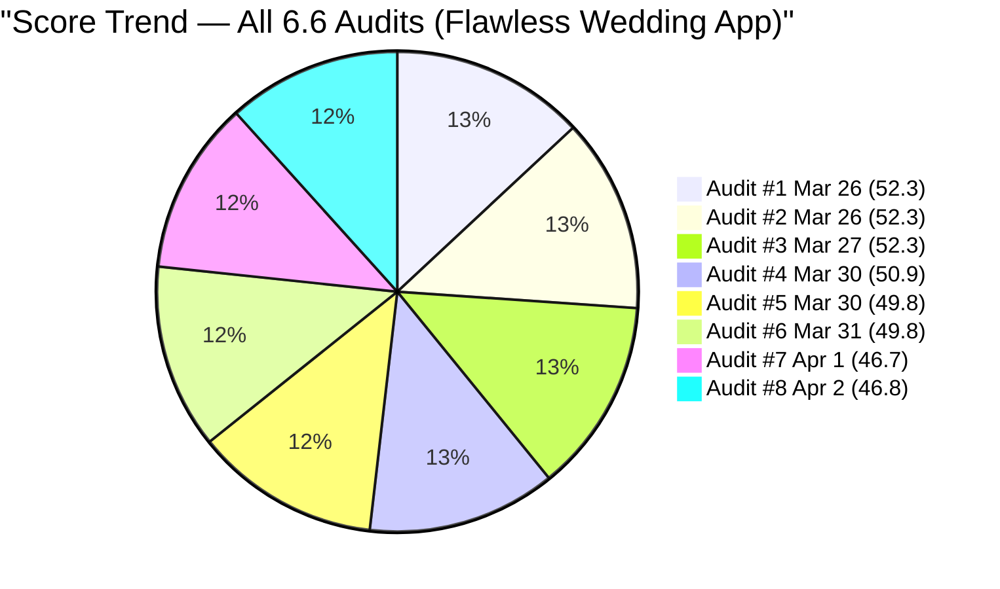
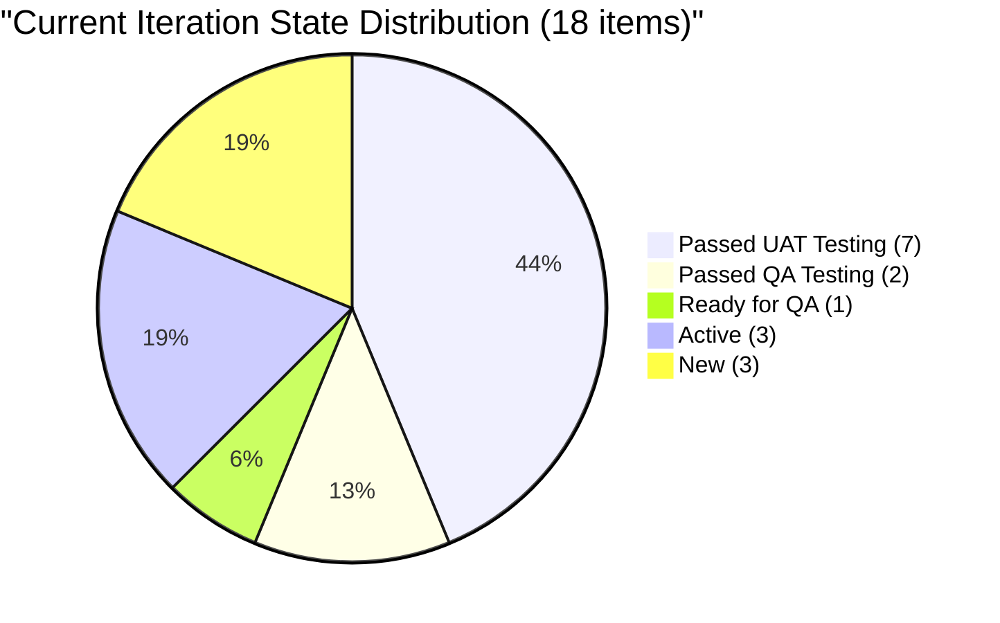
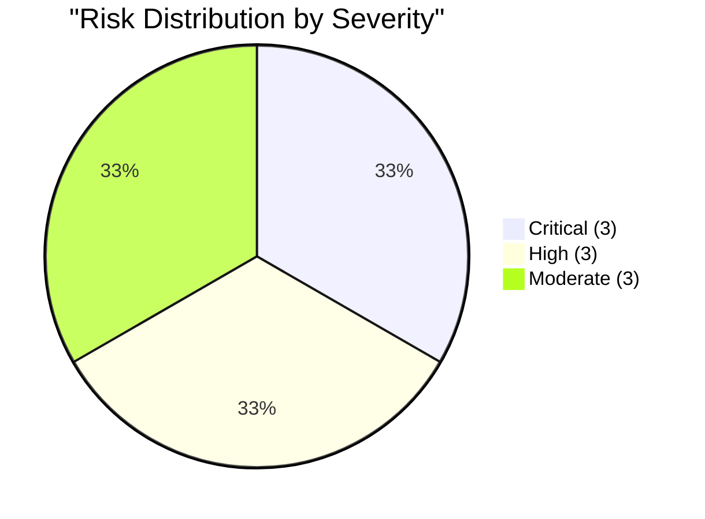

# SAFe Audit Report — Flawless Wedding App

## 1. Audit Metadata

| Field | Value |
|-------|-------|
| **Project** | Flawless Wedding App |
| **Project ID** | 92b967dc-5ec7-4874-b8f5-e43b00d88339 |
| **Team** | Flawless Wedding App Team |
| **Team ID** | 7d90ecbf-d272-4b0c-b33b-c66d96a790ac |
| **Backlog** | Stories and Deliverables (`Microsoft.RequirementCategory`) |
| **Board URL** | [Flawless Wedding App Board](https://dev.azure.com/jairo/Flawless%20Wedding%20App/_boards/board/t/Flawless%20Wedding%20App%20Team/Stories%20and%20Deliverables) |
| **Workspace Folder** | `ado_fl_dev` |
| **Current Iteration** | Iteration 6.6 (IP) |
| **Iteration Path** | `Flawless Wedding App\2026-PI6\Iteration 6.6 (IP)` |
| **Iteration Start** | March 23, 2026 |
| **Iteration Finish** | April 5, 2026 |
| **Audit Date** | April 2, 2026 — 09:00 PHT |
| **Audit Day** | Day 11 of 14 (79% elapsed) |
| **Previous Audit** | AUDIT_20260401_0900.md (Apr 1, 2026 09:00 PHT — Audit #7) |
| **Overall Score** | **46.8 / 100** |
| **Risk Band** | **High Risk** |
| **Audit Series** | Iteration 6.6 Audit #8 |
| **Framework** | SAFe 6.0 |
| **Rubric** | ADO SAFe v1 (six-dimension deterministic scoring) |

**Audit Boundary:** This audit covers only the Flawless Wedding App Team's Stories and Deliverables backlog. No other teams, boards, projects, or repositories were analyzed.

---

## 2. Executive Summary

This is the **eighth audit of Iteration 6.6 (IP)**. Since Audit #7 (Apr 1 at 09:00 PHT), notable progress has occurred:

### Key Changes

1. **#201727 (PROD Stripe issue) estimated and advanced:**
   - Previously unestimated and Active; now has **1 SP** and moved to **Passed QA Testing** (Apr 2). This resolves the critical PROD blocker flagged in Audit #7.

2. **#200256 (Manage Archived Users) advanced to Passed QA Testing:**
   - Previously Ready for QA; now at **Passed QA Testing** (Apr 2, changed from Ready for QA).

3. **Backlog shrinks from 183 to 165 (-18 items):**
   - Multiple items appear to have been closed or removed from the visible backlog, reducing the denominator.

4. **2 new Defects logged:**
   - **#202117** "[Mobile][Vendor] Archived vendor messages still visible" (Ressa, PI6, New)
   - **#202119** "[Web][Vendor] Blank dashboard on first login after hard refresh" (Ressa, PI6, New)

5. **Zero closures persist.** Despite 9 items at Passed UAT/QA Testing, no items have been formally closed. The sprint is 79% elapsed with 0% burned.

**Score moves from 46.7 to 46.8 (+0.1) -- High Risk.** The marginal improvement comes from Estimation rising (61.1 to 66.7, as #201727 gains SP) and Iteration Planning improving slightly (9.8 to 10.9, backlog shrink), offset by Backlog Refinement declining (15.7 to 9.7, as fresh percentage drops with the backlog changes).

---

## 3. Previous Audit Delta

**Previous:** AUDIT_20260401_0900 — Iteration 6.6 (IP) Day 10, Audit #7

| Dimension | Audit #7 (Apr 1) | **Audit #8 (Apr 2)** | Delta |
|-----------|-------------------|----------------------|-------|
| Iteration Planning | 9.8 | **10.9** | +1.1 |
| Team Capacity | 60.0 | **60.0** | 0.0 |
| Estimation | 61.1 | **66.7** | +5.6 |
| DoR Compliance | 33.3 | **33.3** | 0.0 |
| Work Item Balance | 100.0 | **100.0** | 0.0 |
| Backlog Refinement | 15.7 | **9.7** | -6.0 |
| **Overall** | **46.7** | **46.8** | **+0.1** |

| Metric | Audit #7 | **Audit #8** | Delta |
|--------|----------|--------------|-------|
| Visible Backlog | 183 | **165** | **-18** |
| Current Iteration Items | 18 | **18** | 0 |
| Team Capacity | 11 h/day | **11 h/day** | 0 |
| Contributors with Work | 5 | **5** | 0 |
| Estimated Items | 11/18 | **12/18** | **+1** |
| Items Passed UAT/QA | 8 | **9** | **+1** |
| Items Closed | 0 | **0** | 0 |

### Score Trend (Audits #1 -- #8, Iteration 6.6)



---

## 4. Current Iteration Snapshot

| Metric | Value |
|--------|-------|
| Iteration | 6.6 (IP) -- Mar 23 to Apr 5, 2026 |
| Visible root backlog items | 165 |
| Current iteration root items | 18 |
| Contributors with current work | 5 (Luke, Ike, Ressa, Ramon, Carol) |
| Contributors with capacity | 3 (Luke, Ike, Ressa) |
| Team capacity | 11 h/day |
| Point-eligible current items | 18 |
| Estimated current items | 12 |
| DoR-compliant current items | 6 |

### 4.1 Current Iteration Work Items (18)

| ID | Type | State | SP | Assigned To | Changed | DoR |
|----|------|-------|----|-------------|---------|-----|
| 199211 | User Story | Passed UAT Testing | 1 | Luke Abram Colina | Apr 1 | Pass |
| 199213 | User Story | Passed UAT Testing | 1 | Luke Abram Colina | Mar 30 | Pass |
| 199214 | User Story | Passed UAT Testing | 1 | Luke Abram Colina | Apr 1 | Pass |
| 199215 | User Story | Passed UAT Testing | 2 | Luke Abram Colina | Apr 1 | Pass |
| 200256 | User Story | **Passed QA Testing** | 2 | Luke Abram Colina | **Apr 2** | Pass |
| 200259 | User Story | Ready for QA | 1 | Luke Abram Colina | Mar 30 | Fail (no desc) |
| 201058 | User Story | Passed UAT Testing | 1 | Luke Abram Colina | Mar 25 | Fail (image-only desc) |
| 201167 | Defect | Passed UAT Testing | 1 | Luke Abram Colina | Mar 25 | Fail |
| 191038 | Defect | Passed UAT Testing | 1 | Luke Abram Colina | Mar 30 | Fail |
| 201124 | Defect | Passed UAT Testing | 1 | Luke Abram Colina | Apr 1 | Fail |
| 201219 | Defect | Passed UAT Testing | 1 | Luke Abram Colina | Mar 30 | Fail |
| 201727 | Defect | **Passed QA Testing** | **1** | Luke Abram Colina | **Apr 2** | Fail |
| 196898 | Spike | Active | 0 | Ike Yana | Mar 30 | Fail |
| 201568 | Spike | Active | -- | Ike Yana | Apr 1 | Pass |
| 201569 | Spike | New | -- | Ramon | Mar 31 | Fail |
| 201634 | Spike | Active | -- | Ressa Paracuelles | Mar 30 | Fail |
| 202086 | Spike | New | -- | Ressa Paracuelles | Apr 1 | Fail |
| 202087 | Spike | New | -- | Carol Cuison | Apr 1 | Fail |

### 4.2 State Distribution



### 4.3 Pipeline Progress Flow


### 4.4 Ownership Distribution

| Contributor | Items | Share | Capacity |
|-------------|-------|-------|----------|
| Luke Abram Colina | 12 | 66.7% | 6 h/day |
| Ike Yana | 2 | 11.1% | 1 h/day |
| Ressa Paracuelles | 2 | 11.1% | 3 h/day |
| Ramon | 1 | 5.6% | **0 h/day** |
| Carol Cuison | 1 | 5.6% | **0 h/day** |

### 4.5 Team Capacity

| Contributor | Capacity | Activity | Has Current Work? |
|-------------|----------|----------|-------------------|
| Luke Abram Colina | 6 h/day | Development | Yes (12 items) |
| Ike Yana | 1 h/day | Development | Yes (2 items) |
| Ressa Paracuelles | 3 h/day | Testing | Yes (2 items) |
| Luzmibel Paculanang | 1 h/day | Testing | No |
| **Ramon** | **0 h/day** | **Not configured** | **Yes (1 item)** |
| **Carol Cuison** | **0 h/day** | **Not configured** | **Yes (1 item)** |

**Team total: 11 h/day.** Two contributors (Ramon, Carol) have work items but no configured capacity.

---

## 5. Work Item Analysis

### 5.1 Type Distribution (Current 18 Items)

| Type | Count | Share |
|------|-------|-------|
| User Story | 7 | 38.9% |
| Defect | 5 | 27.8% |
| Spike | 6 | 33.3% |

No single type exceeds 60%. Spikes at 33.3% remain below the 40% penalty threshold. Healthy type diversity.

### 5.2 Key Changes Since Audit #7

| Item | Change | Impact |
|------|--------|--------|
| **#201727** | Active -> **Passed QA Testing**, gained **1 SP** | Estimation improves; PROD blocker advancing |
| **#200256** | Ready for QA -> **Passed QA Testing** | Pipeline progress; Islands feature adjacent |
| **#202117** | New defect (PI6, Ressa) | Backlog item; not in sprint |
| **#202119** | New defect (PI6, Ressa) | Backlog item; not in sprint |
| **-18 items** | Removed from backlog | Backlog shrink; Iter Planning improves |

### 5.3 Islands Feature Cluster — Complete Through UAT

| ID | Title | State | SP |
|----|-------|-------|----|
| 199211 | Admin Assigns Island to Vendor | Passed UAT Testing | 1 |
| 199213 | Bride Views Islands as Main Entry Point | Passed UAT Testing | 1 |
| 199214 | Bride Views Subcategories Within Selected Island | Passed UAT Testing | 1 |
| 199215 | Bride Views Vendors by Island and Subcategory | Passed UAT Testing | 2 |

**All 4 Islands items at Passed UAT Testing.** The entire feature cluster (5 SP) is substantively complete pending formal closure.

### 5.4 Sprint Pipeline Progress

| Pipeline Stage | Count | SP | Change from #7 |
|---------------|-------|-----|----------------|
| Passed UAT Testing | 7 | 8 | -1 item (-2 SP) |
| Passed QA Testing | 2 | 3 | +2 items (+3 SP) |
| Ready for QA | 1 | 1 | -1 item (-1 SP) |
| Active | 3 | 0* | -1 item |
| New | 3 | 0 | No change |
| Closed | 0 | 0 | No change |

*Active items are Spikes with no SP or SP=0.

**Note:** #200256 and #201727 both advanced to Passed QA Testing. The pipeline continues to move forward, but zero closures persist.

### 5.5 Backlog Age Profile (165 items)

| Age Bucket | Count | Share |
|------------|-------|-------|
| Fresh (< 45 days) | ~82 | ~49.7% |
| 45-90 days | ~1 | ~0.6% |
| 90-180 days (not > 180) | ~31 | ~18.8% |
| > 180 days | ~51 | ~30.9% |
| **Total stale > 90 days** | **~82** | **~49.7%** |

The fresh percentage dropped from 55.7% to 49.7%. The backlog shrink removed mostly recent items (likely closed sprint work from prior iterations or pruned PI7 planning items), shifting the ratio toward stale items.

---

## 6. SAFe Compliance Scorecard

| # | Dimension | Score | Formula | Evidence | Notes |
|---|-----------|-------|---------|----------|-------|
| 1 | Iteration Planning | **10.9** | 18/165 x 100 | 18 of 165 in current iter | Backlog shrank -18; ratio improved |
| 2 | Team Capacity | **60.0** | 3/5 x 100 | Ramon + Carol: 0 capacity | 2 gaps unchanged |
| 3 | Estimation | **66.7** | 12/18 x 100 | 6 items unestimated | #201727 gained SP (+1) |
| 4 | DoR Compliance | **33.3** | 6/18 x 100 | 6 of 18 pass DoR | Unchanged |
| 5 | Work Item Balance | **100.0** | 100 (no penalties) | US 38.9%, Defect 27.8%, Spike 33.3% | Healthy mix |
| 6 | Backlog Refinement | **9.7** | 49.7 - 20 - 20 | stale_90=49.7% > 25%; stale_180=51 | Fresh % declined |
| | **Overall** | **46.8** | avg(6 dims) | | **High Risk (40-59.9)** |

### Score Computation

```
Iteration Planning:  round(18/165 x 100, 1) = 10.9
Team Capacity:       round(3/5 x 100, 1)    = 60.0
  contributors_with_current_work = 5 (Luke, Ike, Ressa, Ramon, Carol)
  contributors_with_capacity = 3 (Luke 6h, Ike 1h, Ressa 3h)
  Ramon has #201569 but 0 capacity; Carol has #202087 but 0 capacity
Estimation:          round(12/18 x 100, 1)   = 66.7
  Estimated: 199211(1), 199213(1), 199214(1), 199215(2), 200256(2),
             200259(1), 201058(1), 191038(1), 201167(1), 201124(1),
             201219(1), 201727(1) = 12
  Unestimated or SP=0: 196898(0), 201568, 201569, 201634, 202086, 202087 = 6
DoR Compliance:      round(6/18 x 100, 1)    = 33.3
  Pass: 199211, 199213, 199214, 199215, 200256, 201568 = 6
  Fail: 200259, 201058, 191038, 201167, 201124, 201219, 201727,
        196898, 201569, 201634, 202086, 202087 = 12
Work Item Balance:   100 (no penalties)       = 100.0
  User Story 38.9%, Defect 27.8%, Spike 33.3%
  No dominant type > 60%, has User Story, spike < 40%
Backlog Refinement:
  fresh = ~82/165 = 49.7% => base = 49.7
  stale_90 = ~82/165 = 49.7% > 25% => -20
  stale_180 = ~51 >= 1 => -20
  untouched_current = 0/18 = 0% => no penalty
  Score = max(49.7 - 20 - 20, 0) = 9.7

Overall: (10.9 + 60.0 + 66.7 + 33.3 + 100.0 + 9.7) / 6 = 280.6 / 6 = 46.8
Risk Band: High Risk (40-59.9)
```

---

## 7. Dimension Findings

### 7.1 Iteration Planning (10.9/100) — CRITICAL (Slightly Improved)

18 of 165 backlog items in the current iteration (10.9%). The backlog shrank by 18 items from 183, improving the ratio marginally from 9.8. This dimension remains structurally trapped by the massive backlog denominator. Pruning the ~51 items stale > 180 days would improve this to 18/114 = 15.8 — still low but demonstrating progress.

### 7.2 Team Capacity (60.0/100) — HIGH (Unchanged)

Two contributors have work items but no configured capacity:
- **Ramon**: #201569 (Follow Up Netlify Access) — PO/admin task
- **Carol Cuison**: #202087 (Retro: Schedule Touch Base) — coordination task

### 7.3 Estimation (66.7/100) — MODERATE (Improved)

12 of 18 items estimated, up from 11. **#201727** (PROD Stripe issue) gained 1 SP, moving from Active to Passed QA Testing with an estimate. The 6 remaining unestimated items are all Spikes (5 with no SP, 1 with SP=0).

### 7.4 DoR Compliance (33.3/100) — CRITICAL (Unchanged)

6 of 18 items pass DoR. The 5 passing User Stories have structured Given/When/Then acceptance criteria. #201568 (Meetings Spike) passes with list-format criteria. The 12 failing items are primarily Defects and Spikes that entered the iteration without documentation.

### 7.5 Work Item Balance (100.0/100) — EXCELLENT

Healthy type diversity: User Stories 38.9%, Defects 27.8%, Spikes 33.3%. No penalties triggered.

### 7.6 Backlog Refinement (9.7/100) — CRITICAL (Worsened)

Dropped from 15.7 to 9.7. The fresh percentage decreased from 55.7% to 49.7% because the backlog shrink removed mostly recent items while the ~82 stale items remain. The structural penalties (-20 for stale_90 > 25%, -20 for stale_180 >= 1) continue to dominate.

---

## 8. Risks and Bottlenecks



### CRITICAL: ~51 Items Stale > 180 Days — Backlog Refinement Collapsed

The stale backlog represents ~49.7% of all visible items. These are predominantly September 2025 Defects that have never been touched. Iteration Planning and Backlog Refinement are both structurally trapped until these are pruned.

### CRITICAL: Luke Carries 67% of Sprint (12/18 Items)

Extreme single-point-of-failure. If Luke is unavailable, two-thirds of sprint scope is impacted. Unchanged from Audit #7.

### CRITICAL: Zero Closures at Day 11

9 items at Passed UAT/QA Testing — work is substantively complete but not formally closed. Sprint is 79% elapsed with 0% burned. Close the UAT/QA-passed items immediately to establish delivery credit.

### HIGH: 6 Items Unestimated (All Spikes)

All 6 Spikes lack valid Story Points. #196898 has SP=0 (not a valid estimate). The 2 Retro Spikes (#202086, #202087) remain unestimated.

### HIGH: Two Capacity Gaps — Ramon and Carol

Ramon and Carol both have sprint items but 0 h/day capacity. This is the second consecutive audit with dual-gap.

### HIGH: #201727 Advancing But Not Closed

The PROD Stripe Connect issue has moved from Active to Passed QA Testing with 1 SP. It needs UAT and closure to fully resolve the vendor onboarding blocker.

### MODERATE: 12 of 18 Items Fail DoR

33.3% DoR compliance. Unchanged from Audit #7.

### MODERATE: Holy Week — April 2-5

No days-off configured for any team member. Board activity appears to continue (Apr 2 changes on #200256 and #201727).

### MODERATE: New Defects Still Being Logged (#202117, #202119)

Two new defects were filed on April 1-2 by Ressa, both related to vendor account management. These add to the PI6 backlog but are not in the sprint.

---

## 9. Prioritized Recommendations

1. **[Immediate -- today]** Close the 9 items at Passed UAT/QA Testing (#199211, #199213, #199214, #199215, #201058, #201167, #191038, #201124, #201219, #200256, #201727). Establish 13 SP of delivery credit.

2. **[Immediate -- today]** Resolve capacity gaps: either configure Ramon and Carol at 1 h/day each, or unassign #201569 and #202087 from the sprint.

3. **[This week]** Estimate the 6 unestimated Spikes. Assign 1-2 SP to each.

4. **[This week]** Prune the ~51 items stale > 180 days. This is the single highest-impact action for long-term score improvement (+6-10 points on Iteration Planning and Backlog Refinement).

5. **[This week]** Add Description and AC to the 12 non-compliant items, prioritizing items near completion.

6. **[This week]** Configure Holy Week days-off (April 2-5) for all team members.

7. **[Before PI7]** Redistribute Luke's workload. Target Luke < 50% ownership for PI7.

---

## 10. Evidence Gaps and Limitations

| Gap | Impact | Notes |
|-----|--------|-------|
| ~51 items stale > 180 days | Iteration Planning and Backlog Refinement structurally trapped | Pruning session required |
| Ramon + Carol 0 capacity (2 gaps) | Team Capacity at 60.0 | 18th consecutive flag |
| 12 items fail DoR | Items may close without verifiable criteria | Defects/Spikes consistently undocumented |
| #201058 image-only description | DoR fail despite visual content | Text extraction not counted |
| Zero closures at Day 11 | Sprint delivery formally at 0% | 9 items substantively complete |
| Backlog age counts approximate | Items counted from API data | May have +/- 3 item variance |
| 18 items removed from backlog | Cannot confirm if closed or deleted | Assumed closed based on patterns |

---

### Iteration 6.6 Score History

| Audit | Date | Day | Score | Key Change |
|-------|------|-----|-------|------------|
| #1 | Mar 26 | Day 4 | 52.3 | First 6.6 audit |
| #2 | Mar 26 | Day 4 | 52.3 | Batch audit |
| #3 | Mar 27 | Day 5 | 52.3 | No change |
| #4 | Mar 30 | Day 8 | 50.9 | Backlog shrank from 180 |
| #5 | Mar 30 | Day 8 | 49.8 | Further pruning (-19 items) |
| #6 | Mar 31 | Day 9 | 49.8 | 3 blockers resolved; pipeline progress |
| #7 | Apr 1 | Day 10 | 46.7 | +22 backlog items; 2 Retro Spikes; Carol returns |
| **#8** | **Apr 2** | **Day 11** | **46.8** | **#201727 estimated; #200256 advanced; backlog -18** |

---

*Report generated: April 2, 2026 09:00 PHT*
*Auditor: AI EngProd Consultant (SAFe 6.0)*
*Rubric: ADO SAFe v1 (six-dimension deterministic scoring)*
*Iteration 6.6 (IP) Day 11 of 14 | Score: 46.8/100 (High Risk)*
*Previous: AUDIT_20260401_0900 (46.7/100 — High Risk)*
*Delta: +0.1 — #201727 gained SP and advanced to Passed QA; backlog shrank -18; Backlog Refinement declined*
