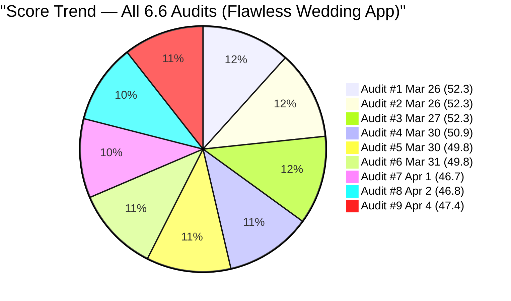
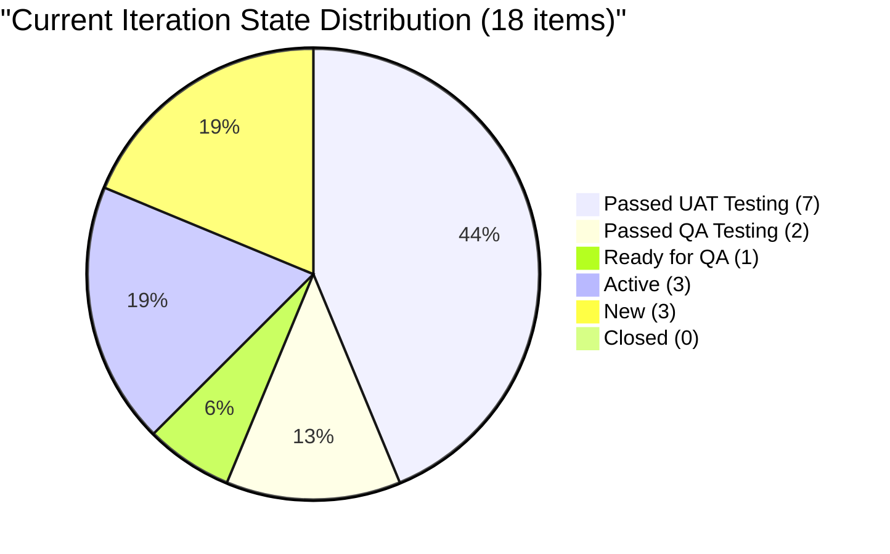
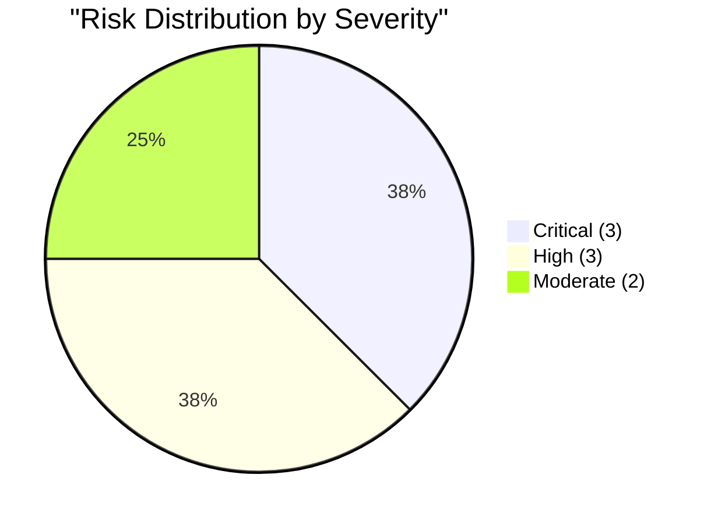

# SAFe Audit Report — Flawless Wedding App

## 1. Audit Metadata

| Field | Value |
|-------|-------|
| **Project** | Flawless Wedding App |
| **Project ID** | 92b967dc-5ec7-4874-b8f5-e43b00d88339 |
| **Team** | Flawless Wedding App Team |
| **Team ID** | 7d90ecbf-d272-4b0c-b33b-c66d96a790ac |
| **Backlog** | Stories and Deliverables (`Microsoft.RequirementCategory`) |
| **Board URL** | [Flawless Wedding App Board](https://dev.azure.com/jairo/Flawless%20Wedding%20App/_boards/board/t/Flawless%20Wedding%20App%20Team/Stories%20and%20Deliverables) |
| **Workspace Folder** | `ado_fl_dev` |
| **Current Iteration** | Iteration 6.6 (IP) |
| **Iteration Path** | `Flawless Wedding App\2026-PI6\Iteration 6.6 (IP)` |
| **Iteration Start** | March 23, 2026 |
| **Iteration Finish** | April 5, 2026 |
| **Audit Date** | April 4, 2026 — 09:00 PHT |
| **Audit Day** | Day 13 of 14 (93% elapsed) |
| **Previous Audit** | AUDIT_20260402_0900.md (Apr 2, 2026 09:00 PHT — Audit #8) |
| **Overall Score** | **47.4 / 100** |
| **Risk Band** | **High Risk** |
| **Audit Series** | Iteration 6.6 Audit #9 |
| **Framework** | SAFe 6.0 |
| **Rubric** | ADO SAFe v1 (six-dimension deterministic scoring) |

**Audit Boundary:** This audit covers only the Flawless Wedding App Team's Stories and Deliverables backlog. No other teams, boards, projects, or repositories were analyzed.

---

## 2. Executive Summary

This is the **ninth audit of Iteration 6.6 (IP)**. Since Audit #8 (Apr 2 at 09:00 PHT), minimal changes have occurred:

### Key Changes

1. **Backlog grows from 165 to 185 (+20 items):**
   - The visible backlog increased. This appears to reflect PI7 planning items (Ressa's user stories for the bride mobile app refactor) and new defects becoming visible on the backlog that were previously not counted or were in different states.

2. **No sprint-level changes:**
   - The same 18 items remain in Iteration 6.6 (IP) with no state transitions
   - Zero closures persist at Day 13 (93% elapsed)
   - All item states, Story Points, and assignments are identical to Audit #8

3. **Score moves from 46.8 to 47.4 (+0.6):**
   - The increase is entirely due to Backlog Refinement improving from 9.7 to 14.6 (fresh percentage rose from 49.7% to 54.6% as the backlog grew with recent PI7 items)
   - Iteration Planning dropped from 10.9 to 9.7 (larger denominator)
   - Net effect: +0.6 overall

**Risk band remains High Risk (40-59.9).**

---

## 3. Previous Audit Delta

**Previous:** AUDIT_20260402_0900 — Iteration 6.6 (IP) Day 11, Audit #8

| Dimension | Audit #8 (Apr 2) | **Audit #9 (Apr 4)** | Delta |
|-----------|-------------------|----------------------|-------|
| Iteration Planning | 10.9 | **9.7** | -1.2 |
| Team Capacity | 60.0 | **60.0** | 0.0 |
| Estimation | 66.7 | **66.7** | 0.0 |
| DoR Compliance | 33.3 | **33.3** | 0.0 |
| Work Item Balance | 100.0 | **100.0** | 0.0 |
| Backlog Refinement | 9.7 | **14.6** | +4.9 |
| **Overall** | **46.8** | **47.4** | **+0.6** |

| Metric | Audit #8 | **Audit #9** | Delta |
|--------|----------|--------------|-------|
| Visible Backlog | 165 | **185** | **+20** |
| Current Iteration Items | 18 | **18** | 0 |
| Team Capacity | 11 h/day | **11 h/day** | 0 |
| Contributors with Work | 5 | **5** | 0 |
| Estimated Items | 12/18 | **12/18** | 0 |
| Items Passed UAT/QA | 9 | **9** | 0 |
| Items Closed | 0 | **0** | 0 |

### Score Trend (Audits #1 -- #9, Iteration 6.6)



---

## 4. Current Iteration Snapshot

| Metric | Value |
|--------|-------|
| Iteration | 6.6 (IP) — Mar 23 to Apr 5, 2026 |
| Visible root backlog items | 185 |
| Current iteration root items | 18 |
| Contributors with current work | 5 (Luke, Ike, Ressa, Ramon, Carol) |
| Contributors with capacity | 3 (Luke, Ike, Ressa) |
| Team capacity | 11 h/day |
| Point-eligible current items | 18 |
| Estimated current items | 12 |
| DoR-compliant current items | 6 |

### 4.1 Current Iteration Work Items (18)

| ID | Type | State | SP | Assigned To | Changed | DoR |
|----|------|-------|----|-------------|---------|-----|
| 199211 | User Story | Passed UAT Testing | 1 | Luke Abram Colina | Apr 1 | Pass |
| 199213 | User Story | Passed UAT Testing | 1 | Luke Abram Colina | Mar 30 | Pass |
| 199214 | User Story | Passed UAT Testing | 1 | Luke Abram Colina | Apr 1 | Pass |
| 199215 | User Story | Passed UAT Testing | 2 | Luke Abram Colina | Apr 1 | Pass |
| 200256 | User Story | Passed QA Testing | 2 | Luke Abram Colina | Apr 2 | Pass |
| 200259 | User Story | Ready for QA | 1 | Luke Abram Colina | Mar 30 | Fail (empty desc) |
| 201058 | User Story | Passed UAT Testing | 1 | Luke Abram Colina | Mar 25 | Fail (image-only desc) |
| 201167 | Defect | Passed UAT Testing | 1 | Luke Abram Colina | Mar 25 | Fail |
| 191038 | Defect | Passed UAT Testing | 1 | Luke Abram Colina | Mar 30 | Fail |
| 201124 | Defect | Passed UAT Testing | 1 | Luke Abram Colina | Apr 1 | Fail |
| 201219 | Defect | Passed UAT Testing | 1 | Luke Abram Colina | Mar 30 | Fail |
| 201727 | Defect | Passed QA Testing | 1 | Luke Abram Colina | Apr 2 | Fail |
| 196898 | Spike | Active | 0 | Ike Yana | Mar 30 | Fail |
| 201568 | Spike | Active | -- | Ike Yana | Apr 1 | Pass |
| 201569 | Spike | New | -- | Ramon | Mar 31 | Fail |
| 201634 | Spike | Active | -- | Ressa Paracuelles | Mar 30 | Fail |
| 202086 | Spike | New | -- | Ressa Paracuelles | Apr 1 | Fail |
| 202087 | Spike | New | -- | Carol Cuison | Apr 1 | Fail |

### 4.2 State Distribution



### 4.3 Ownership Distribution

| Contributor | Items | Share | Capacity |
|-------------|-------|-------|----------|
| Luke Abram Colina | 12 | 66.7% | 6 h/day |
| Ike Yana | 2 | 11.1% | 1 h/day |
| Ressa Paracuelles | 2 | 11.1% | 3 h/day |
| Ramon | 1 | 5.6% | **0 h/day** |
| Carol Cuison | 1 | 5.6% | **0 h/day** |

### 4.4 Team Capacity

| Contributor | Capacity | Activity | Has Current Work? |
|-------------|----------|----------|-------------------|
| Luke Abram Colina | 6 h/day | Development | Yes (12 items) |
| Ike Yana | 1 h/day | Development | Yes (2 items) |
| Ressa Paracuelles | 3 h/day | Testing | Yes (2 items) |
| Luzmibel Paculanang | 1 h/day | Testing | No |
| **Ramon** | **0 h/day** | **Not configured** | **Yes (1 item)** |
| **Carol Cuison** | **0 h/day** | **Not configured** | **Yes (1 item)** |

**Team total: 11 h/day.** Two contributors (Ramon, Carol) have work items but no configured capacity.

---

## 5. Work Item Analysis

### 5.1 Type Distribution (Current 18 Items)

| Type | Count | Share |
|------|-------|-------|
| User Story | 7 | 38.9% |
| Defect | 5 | 27.8% |
| Spike | 6 | 33.3% |

No single type exceeds 60%. Spikes at 33.3% remain below the 40% penalty threshold. Healthy type diversity.

### 5.2 Pipeline Progress

| Pipeline Stage | Count | SP | Change from #8 |
|---------------|-------|-----|----------------|
| Passed UAT Testing | 7 | 8 | No change |
| Passed QA Testing | 2 | 3 | No change |
| Ready for QA | 1 | 1 | No change |
| Active | 3 | 0* | No change |
| New | 3 | 0 | No change |
| Closed | 0 | 0 | No change |

*Active items are Spikes with no SP or SP=0.

**The pipeline is completely frozen since April 2.** No items have advanced, and zero closures persist at Day 13.

### 5.3 Islands Feature Cluster — Complete Through UAT

| ID | Title | State | SP |
|----|-------|-------|----|
| 199211 | Admin Assigns Island to Vendor | Passed UAT Testing | 1 |
| 199213 | Bride Views Islands as Main Entry Point | Passed UAT Testing | 1 |
| 199214 | Bride Views Subcategories Within Selected Island | Passed UAT Testing | 1 |
| 199215 | Bride Views Vendors by Island and Subcategory | Passed UAT Testing | 2 |

**All 4 Islands items at Passed UAT Testing.** The entire feature cluster (5 SP) is substantively complete pending formal closure.

### 5.4 Backlog Age Profile (185 items)

| Age Bucket | Count | Share |
|------------|-------|-------|
| Fresh (< 45 days) | 101 | 54.6% |
| 45-90 days | 1 | 0.5% |
| 90-180 days (not > 180) | 31 | 16.8% |
| > 180 days | 52 | 28.1% |
| **Total stale > 90 days** | **83** | **44.9%** |

The fresh percentage increased from 49.7% to 54.6% because the backlog grew with 20 recent PI7 items, improving the ratio. However, the 52 items stale > 180 days remain, continuing to trigger the -20 penalty.

---

## 6. SAFe Compliance Scorecard

| # | Dimension | Score | Formula | Evidence | Notes |
|---|-----------|-------|---------|----------|-------|
| 1 | Iteration Planning | **9.7** | 18/185 x 100 | 18 of 185 in current iter | Backlog grew +20; ratio worsened |
| 2 | Team Capacity | **60.0** | 3/5 x 100 | Ramon + Carol: 0 capacity | 2 gaps unchanged |
| 3 | Estimation | **66.7** | 12/18 x 100 | 6 items unestimated | All Spikes |
| 4 | DoR Compliance | **33.3** | 6/18 x 100 | 6 of 18 pass DoR | Unchanged |
| 5 | Work Item Balance | **100.0** | 100 (no penalties) | US 38.9%, Defect 27.8%, Spike 33.3% | Healthy mix |
| 6 | Backlog Refinement | **14.6** | 54.6 - 20 - 20 | stale_90=44.9% > 25%; stale_180=52 | Fresh % improved |
| | **Overall** | **47.4** | avg(6 dims) | | **High Risk (40-59.9)** |

### Score Computation

```
Iteration Planning:  round(18/185 x 100, 1) = 9.7
  visible_root_backlog_items = 185
  current_iteration_root_items = 18

Team Capacity:       round(3/5 x 100, 1) = 60.0
  contributors_with_current_work = 5 (Luke, Ike, Ressa, Ramon, Carol)
  contributors_with_capacity = 3 (Luke 6h, Ike 1h, Ressa 3h)
  Ramon has #201569 but 0 capacity; Carol has #202087 but 0 capacity

Estimation:          round(12/18 x 100, 1) = 66.7
  Estimated (SP > 0): 199211(1), 199213(1), 199214(1), 199215(2), 200256(2),
                       200259(1), 201058(1), 191038(1), 201167(1), 201124(1),
                       201219(1), 201727(1) = 12
  Unestimated or SP=0: 196898(0), 201568, 201569, 201634, 202086, 202087 = 6

DoR Compliance:      round(6/18 x 100, 1) = 33.3
  Pass: 199211, 199213, 199214, 199215, 200256, 201568 = 6
  Fail: 200259 (empty desc), 201058 (image-only), 191038, 201167, 201124,
        201219, 201727, 196898, 201569, 201634, 202086, 202087 = 12

Work Item Balance:   100 (no penalties) = 100.0
  User Story 38.9%, Defect 27.8%, Spike 33.3%
  No dominant type > 60%, has User Story, spike < 40%

Backlog Refinement:
  Reference date: 2026-04-04
  45-day cutoff: 2026-02-18
  90-day cutoff: 2026-01-04
  180-day cutoff: 2025-10-06

  fresh = 101/185 = 54.6% => base = 54.6
  stale_90 = 83/185 = 44.9% > 25% => -20
  stale_180 = 52 >= 1 => -20
  untouched_current = 0/18 (all changed after Mar 23) => no penalty
  Score = max(54.6 - 20 - 20, 0) = 14.6

Overall: (9.7 + 60.0 + 66.7 + 33.3 + 100.0 + 14.6) / 6 = 284.3 / 6 = 47.4
Risk Band: High Risk (40-59.9)
```

---

## 7. Dimension Findings

### 7.1 Iteration Planning (9.7/100) — CRITICAL (Slightly Worsened)

18 of 185 backlog items in the current iteration (9.7%, down from 10.9%). The backlog grew by 20 items (PI7 planning items, new defects), increasing the denominator. This dimension remains structurally trapped by the massive backlog. Pruning the ~52 items stale > 180 days would improve this to 18/133 = 13.5%.

### 7.2 Team Capacity (60.0/100) — HIGH (Unchanged)

Two contributors have work items but no configured capacity:
- **Ramon**: #201569 (Follow Up Netlify Access) — PO/admin task
- **Carol Cuison**: #202087 (Retro: Schedule Touch Base) — coordination task

### 7.3 Estimation (66.7/100) — MODERATE (Unchanged)

12 of 18 items estimated. The 6 remaining unestimated items are all Spikes (5 with no SP, 1 with SP=0).

### 7.4 DoR Compliance (33.3/100) — CRITICAL (Unchanged)

6 of 18 items pass DoR. The 5 passing User Stories have structured Given/When/Then acceptance criteria. #201568 (Meetings Spike) passes with list-format criteria. The 12 failing items are primarily Defects and Spikes that entered the iteration without documentation.

### 7.5 Work Item Balance (100.0/100) — EXCELLENT

Healthy type diversity: User Stories 38.9%, Defects 27.8%, Spikes 33.3%. No penalties triggered.

### 7.6 Backlog Refinement (14.6/100) — CRITICAL (Improved)

Improved from 9.7 to 14.6. The fresh percentage increased from 49.7% to 54.6% because the backlog grew with recent PI7 items. However, the structural penalties (-20 for stale_90 > 25%, -20 for stale_180 >= 1) continue to dominate.

---

## 8. Risks and Bottlenecks



### CRITICAL: ~52 Items Stale > 180 Days — Backlog Refinement Collapsed

The stale backlog represents ~44.9% of all visible items (> 90 days). These are predominantly September-October 2025 Defects that have never been touched. Iteration Planning and Backlog Refinement are both structurally trapped until these are pruned.

### CRITICAL: Luke Carries 67% of Sprint (12/18 Items)

Extreme single-point-of-failure. If Luke is unavailable, two-thirds of sprint scope is impacted. Unchanged across all 9 audits.

### CRITICAL: Zero Closures at Day 13 — Sprint Closes Tomorrow

9 items at Passed UAT/QA Testing — work is substantively complete but not formally closed. Sprint is 93% elapsed with 0% burned. The sprint closes April 5 with zero formal delivery unless closures happen today.

### HIGH: 6 Items Unestimated (All Spikes)

All 6 Spikes lack valid Story Points. #196898 has SP=0 (not a valid estimate). The 2 Retro Spikes (#202086, #202087) remain unestimated.

### HIGH: Two Capacity Gaps — Ramon and Carol

Ramon and Carol both have sprint items but 0 h/day capacity. This has been flagged in all 9 Iteration 6.6 audits.

### HIGH: Pipeline Frozen Since April 2

No item has advanced in the pipeline in 2 days. The board is static during Holy Week.

### MODERATE: 12 of 18 Items Fail DoR

33.3% DoR compliance. Unchanged since Audit #1.

### MODERATE: Backlog Growing While Stale Items Persist

The backlog grew by 20 items (now 185). While the new items are fresh, the ~52 stale items remain untouched, creating a bifurcated backlog.

---

## 9. Prioritized Recommendations

1. **[Immediate — today]** Close the 9 items at Passed UAT/QA Testing (#199211, #199213, #199214, #199215, #200256, #201058, #201167, #191038, #201124, #201219, #201727). Establish 13 SP of delivery credit before sprint close tomorrow.

2. **[Immediate — today]** Resolve capacity gaps: either configure Ramon and Carol at 1 h/day each, or unassign #201569 and #202087 from the sprint.

3. **[This week]** Estimate the 6 unestimated Spikes. Assign 1-2 SP to each.

4. **[Before PI7]** Prune the ~52 items stale > 180 days. This is the single highest-impact action for long-term score improvement (+5-10 points on Iteration Planning and Backlog Refinement).

5. **[Before PI7]** Add Description and AC to the 12 non-compliant items, prioritizing items near completion.

6. **[Before PI7]** Redistribute Luke's workload. Target Luke < 50% ownership for PI7.

---

## 10. Evidence Gaps and Limitations

| Gap | Impact | Notes |
|-----|--------|-------|
| ~52 items stale > 180 days | Iter Planning and Backlog Refinement structurally trapped | Pruning session required |
| Ramon + Carol 0 capacity (2 gaps) | Team Capacity at 60.0 | Flagged in all 9 audits |
| 12 items fail DoR | Items may close without verifiable criteria | Defects/Spikes consistently undocumented |
| #201058 image-only description | DoR fail despite visual content | Text extraction not counted |
| Zero closures at Day 13 | Sprint delivery formally at 0% | 9 items substantively complete |
| Backlog grew +20 items | Denominator increase dilutes Iter Planning | PI7 planning items added |
| Pipeline frozen 2 days | No state transitions since Apr 2 | Holy Week effect |

---

### Iteration 6.6 Score History

| Audit | Date | Day | Score | Key Change |
|-------|------|-----|-------|------------|
| #1 | Mar 26 | Day 4 | 52.3 | First 6.6 audit |
| #2 | Mar 26 | Day 4 | 52.3 | Batch audit |
| #3 | Mar 27 | Day 5 | 52.3 | No change |
| #4 | Mar 30 | Day 8 | 50.9 | Backlog shrank from 180 |
| #5 | Mar 30 | Day 8 | 49.8 | Further pruning (-19 items) |
| #6 | Mar 31 | Day 9 | 49.8 | 3 blockers resolved; pipeline progress |
| #7 | Apr 1 | Day 10 | 46.7 | +22 backlog items; 2 Retro Spikes; Carol returns |
| #8 | Apr 2 | Day 11 | 46.8 | #201727 estimated; #200256 advanced; backlog -18 |
| **#9** | **Apr 4** | **Day 13** | **47.4** | **Backlog +20; fresh % improved; pipeline frozen** |

---

*Report generated: April 4, 2026 09:00 PHT*
*Auditor: AI EngProd Consultant (SAFe 6.0)*
*Rubric: ADO SAFe v1 (six-dimension deterministic scoring)*
*Iteration 6.6 (IP) Day 13 of 14 | Score: 47.4/100 (High Risk)*
*Previous: AUDIT_20260402_0900 (46.8/100 — High Risk)*
*Delta: +0.6 — Backlog grew +20 items (PI7 planning); fresh % improved; pipeline frozen since Apr 2*
