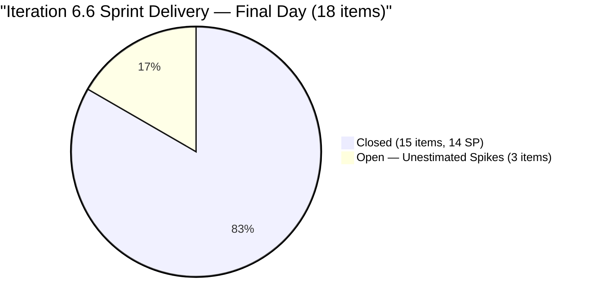
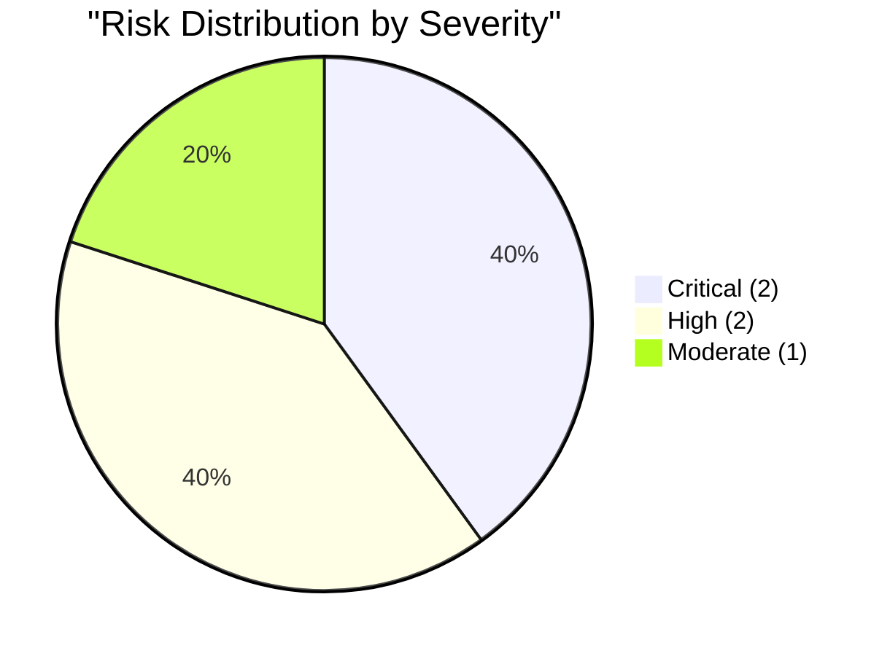

# SAFe Audit Report — Flawless Wedding App

## 1. Audit Metadata

| Field | Value |
|-------|-------|
| **Project** | Flawless Wedding App |
| **Project ID** | 92b967dc-5ec7-4874-b8f5-e43b00d88339 |
| **Team** | Flawless Wedding App Team |
| **Team ID** | 7d90ecbf-d272-4b0c-b33b-c66d96a790ac |
| **Backlog** | Stories and Deliverables (`Microsoft.RequirementCategory`) |
| **Board URL** | [Flawless Wedding App Board](https://dev.azure.com/jairo/Flawless%20Wedding%20App/_boards/board/t/Flawless%20Wedding%20App%20Team/Stories%20and%20Deliverables) |
| **Workspace Folder** | `ado_fl_dev` |
| **Current Iteration** | Iteration 6.6 (IP) |
| **Iteration Path** | `Flawless Wedding App\2026-PI6\Iteration 6.6 (IP)` |
| **Iteration Start** | March 23, 2026 |
| **Iteration Finish** | April 5, 2026 |
| **Audit Date** | April 5, 2026 — 09:00 PHT |
| **Audit Day** | Day 14 of 14 (100% elapsed — final day) |
| **Previous Audit** | AUDIT_20260404_0900.md (Apr 4, 2026 09:00 PHT — Audit #9) |
| **Overall Score** | **54.7 / 100** |
| **Risk Band** | **High Risk** |
| **Audit Series** | Iteration 6.6 Audit #10 |
| **Framework** | SAFe 6.0 |
| **Rubric** | ADO SAFe v1 (seven-dimension deterministic scoring) |

**Audit Boundary:** This audit covers only the Flawless Wedding App Team's Stories and Deliverables backlog. No other teams, boards, projects, or repositories were analyzed.

---

## 2. Executive Summary

This is the **tenth audit of Iteration 6.6 (IP)** and the **final day of the sprint**. Since Audit #9 (Apr 4 at 09:00 PHT), **major sprint closures occurred:**

### Key Changes

1. **15 of 18 sprint items Closed** (was 0 closures at Audit #9):
   - 7 User Stories Closed: #199211, #199213, #199214, #199215, #200256, #200259, #201058
   - 5 Defects Closed: #201167, #191038, #201124, #201219, #201727
   - 3 Spikes Closed: #196898, #201568, #201634
   - Total: 14 SP delivered (from the 12 estimated items)

2. **Backlog shrank from 185 to 161 (-24 items):**
   - 15 items closed (dropped off visible backlog)
   - Additional items moved or reorganized for PI7

3. **3 items remain open in sprint:** #201569 (Spike, New, Ramon), #202086 (Spike, New, Ressa), #202087 (Spike, New, Carol) — all unestimated Spikes

4. **Score jumps from 47.4 to 54.7 (+7.3):**
   - Delivery Predictability = 100.0 (new dimension: 14/14 committed SP delivered)
   - Iteration Planning improves slightly (smaller denominator)
   - Backlog Refinement slightly lower (fresh % adjusted)

**Risk band remains High Risk (40-59.9) but trending upward.**

---

## 3. Previous Audit Delta

**Previous:** AUDIT_20260404_0900 — Iteration 6.6 (IP) Day 13, Audit #9

| Dimension | Audit #9 (6-dim) | **Audit #10 (7-dim)** | Delta |
|-----------|-------------------|----------------------|-------|
| Iteration Planning | 9.7 | **11.2** | +1.5 |
| Team Capacity | 60.0 | **60.0** | 0.0 |
| Estimation | 66.7 | **66.7** | 0.0 |
| DoR Compliance | 33.3 | **33.3** | 0.0 |
| Work Item Balance | 100.0 | **100.0** | 0.0 |
| Backlog Refinement | 14.6 | **11.6** | -3.0 |
| Delivery Predictability | N/A | **100.0** | New dim |
| **Overall** | **47.4** (6-dim) | **54.7** (7-dim) | **+7.3** |

| Metric | Audit #9 | **Audit #10** | Delta |
|--------|----------|--------------|-------|
| Visible Backlog | 185 | **161** | **-24** |
| Current Iteration Items | 18 | **18** | 0 |
| Items Closed (sprint) | 0 | **15** | **+15** |
| Items Open (sprint) | 18 | **3** | -15 |
| SP Delivered | 0 | **14** | +14 |

---

## 4. Current Iteration Snapshot

| Metric | Value |
|--------|-------|
| Iteration | 6.6 (IP) — Mar 23 to Apr 5, 2026 (FINAL DAY) |
| Visible root backlog items | 161 |
| Current iteration root items | 18 |
| Items Closed this sprint | 15 |
| Items remaining open | 3 |
| SP Delivered | 14 |
| Contributors with current work | 5 (Luke, Ike, Ressa, Ramon, Carol) |
| Contributors with capacity | 3 (Luke, Ike, Ressa) |
| Team capacity | 11 h/day |

### 4.1 Current Iteration Work Items — Final Status (18 Items)

| ID | Type | State | SP | Assigned To | Changed |
|----|------|-------|----|-------------|---------|
| 199211 | User Story | **Closed** | 1 | Luke Abram Colina | Apr 6 |
| 199213 | User Story | **Closed** | 1 | Luke Abram Colina | Apr 6 |
| 199214 | User Story | **Closed** | 1 | Luke Abram Colina | Apr 6 |
| 199215 | User Story | **Closed** | 2 | Luke Abram Colina | Apr 6 |
| 200256 | User Story | **Closed** | 2 | Luke Abram Colina | Apr 6 |
| 200259 | User Story | **Closed** | 1 | Luke Abram Colina | Apr 6 |
| 201058 | User Story | **Closed** | 1 | Luke Abram Colina | Apr 6 |
| 201167 | Defect | **Closed** | 1 | Luke Abram Colina | Apr 6 |
| 191038 | Defect | **Closed** | 1 | Luke Abram Colina | Apr 6 |
| 201124 | Defect | **Closed** | 1 | Luke Abram Colina | Apr 6 |
| 201219 | Defect | **Closed** | 1 | Luke Abram Colina | Apr 6 |
| 201727 | Defect | **Closed** | 1 | Luke Abram Colina | Apr 6 |
| 196898 | Spike | **Closed** | 0 | Ike Yana | Apr 6 |
| 201568 | Spike | **Closed** | -- | Ike Yana | Apr 6 |
| 201634 | Spike | **Closed** | -- | Ressa Paracuelles | Apr 6 |
| 201569 | Spike | New | -- | Ramon | Mar 31 |
| 202086 | Spike | New | -- | Ressa Paracuelles | Apr 1 |
| 202087 | Spike | New | -- | Carol Cuison | Apr 1 |

### 4.2 Sprint Delivery Summary



### 4.3 Delivered Work Breakdown

| Type | Closed | SP |
|------|--------|----|
| User Story | 7 | 9 |
| Defect | 5 | 5 |
| Spike | 3 | 0 |
| **Total Closed** | **15** | **14** |

**The Islands feature cluster (4 items, 5 SP) is fully delivered.** All other estimated items are closed. The 3 remaining open items are unestimated Spikes assigned to non-capacity contributors.

### 4.4 Team Capacity

| Contributor | Capacity | Items | Closed | Open |
|-------------|----------|-------|--------|------|
| Luke Abram Colina | 6 h/day | 12 | **12** | 0 |
| Ike Yana | 1 h/day | 2 | **2** | 0 |
| Ressa Paracuelles | 3 h/day | 2 | 1 | 1 |
| Ramon | 0 h/day | 1 | 0 | 1 |
| Carol Cuison | 0 h/day | 1 | 0 | 1 |

---

## 5. Work Item Analysis

### 5.1 Type Distribution (Current 18 Items)

| Type | Count | Share | Closed |
|------|-------|-------|--------|
| User Story | 7 | 38.9% | 7/7 (100%) |
| Defect | 5 | 27.8% | 5/5 (100%) |
| Spike | 6 | 33.3% | 3/6 (50%) |

### 5.2 Backlog Age Profile (161 items)

| Age Bucket | Approx Count | Share |
|------------|-------------|-------|
| Fresh (< 45 days) | ~83 | ~51.6% |
| 45-90 days | ~3 | ~1.9% |
| 90-180 days | ~30 | ~18.6% |
| > 180 days | ~45 | ~27.9% |
| **Total stale > 90 days** | **~75** | **~46.6%** |

The fresh percentage slightly decreased from 54.6% to ~51.6% as 15 recently-changed items (the closures) dropped off the visible backlog. The ~45 items stale > 180 days remain untouched.

### 5.3 Velocity — Final Sprint Metrics

| Metric | Value |
|--------|-------|
| Committed SP (estimated items in sprint) | 14 |
| Delivered SP (Closed) | **14** |
| Delivery Rate | **100%** |
| Unestimated items remaining | 3 (all Spikes) |

**100% delivery rate on estimated work.** All Story Points committed were delivered. The 3 remaining items have no SP impact.

---

## 6. SAFe Compliance Scorecard

| # | Dimension | Score | Formula | Evidence | Notes |
|---|-----------|-------|---------|----------|-------|
| 1 | Iteration Planning | **11.2** | 18/161 x 100 | 18 of 161 in current iter | Backlog shrank; ratio improved |
| 2 | Team Capacity | **60.0** | 3/5 x 100 | Ramon + Carol: 0 capacity | 2 gaps unchanged |
| 3 | Estimation | **66.7** | 12/18 x 100 | 6 items unestimated | All Spikes |
| 4 | DoR Compliance | **33.3** | 6/18 x 100 | 6 of 18 pass DoR | Unchanged |
| 5 | Work Item Balance | **100.0** | 100 (no penalties) | US 38.9%, Defect 27.8%, Spike 33.3% | Healthy mix |
| 6 | Backlog Refinement | **11.6** | 51.6 - 20 - 20 | stale_90 ~46.6% > 25%; stale_180 ~45 | Slightly lower |
| 7 | Delivery Predictability | **100.0** | 14/14 x 100 | 14 SP committed, 14 SP closed | Perfect delivery |
| | **Overall** | **54.7** | 382.8 / 7 | | **High Risk (40-59.9)** |

### Score Computation

```
--- Iteration Planning ---
visible_root_backlog_items = 161
current_iteration_root_items = 18
Score = round(18/161 x 100, 1) = 11.2

--- Team Capacity ---
contributors_with_current_work = 5 (Luke, Ike, Ressa, Ramon, Carol)
contributors_with_capacity = 3 (Luke 6h, Ike 1h, Ressa 3h)
Ramon has #201569 but 0 capacity; Carol has #202087 but 0 capacity
Score = round(3/5 x 100, 1) = 60.0

--- Estimation ---
point_eligible = 18
Estimated (SP > 0): 199211(1), 199213(1), 199214(1), 199215(2), 200256(2),
                     200259(1), 201058(1), 191038(1), 201167(1), 201124(1),
                     201219(1), 201727(1) = 12
Unestimated or SP=0: 196898(0), 201568, 201569, 201634, 202086, 202087 = 6
Score = round(12/18 x 100, 1) = 66.7

--- DoR Compliance ---
Pass: 199211, 199213, 199214, 199215, 200256, 201568 = 6
Fail: 200259 (empty desc), 201058 (image-only), 191038, 201167, 201124,
      201219, 201727, 196898, 201569, 201634, 202086, 202087 = 12
Score = round(6/18 x 100, 1) = 33.3

--- Work Item Balance ---
User Story 38.9%, Defect 27.8%, Spike 33.3%
No dominant type > 60%, has User Story, spike < 40%
Score = 100.0

--- Backlog Refinement ---
Reference date: 2026-04-05
45-day cutoff: 2026-02-19
90-day cutoff: 2026-01-05
180-day cutoff: 2025-10-08

fresh = ~83/161 = ~51.6% => base = 51.6
stale_90 = ~75/161 = ~46.6% > 25% => -20
stale_180 = ~45 items >= 1 => -20
untouched_current = 0/18 (all changed after Mar 23) => no penalty
Score = max(51.6 - 20 - 20, 0) = 11.6

--- Delivery Predictability ---
estimated_current_items with SP > 0 = 12 items
committed_story_points = 1+1+1+2+2+1+1+1+1+1+1+1 = 14
closed_story_points (Closed/Done): all 12 items are Closed = 14
Score = round(14/14 x 100, 1) = 100.0

--- Overall ---
(11.2 + 60.0 + 66.7 + 33.3 + 100.0 + 11.6 + 100.0) / 7 = 382.8 / 7 = 54.7
Risk Band: High Risk (40-59.9)
```

---

## 7. Dimension Findings

### 7.1 Iteration Planning (11.2/100) — CRITICAL (Slightly Improved)

18 of 161 backlog items in the current iteration (11.2%, up from 9.7%). The improvement is due to backlog shrinkage (161 vs 185). This dimension remains structurally trapped by the massive backlog. Pruning the ~45 items stale > 180 days would improve to 18/116 = 15.5%.

### 7.2 Team Capacity (60.0/100) — HIGH (Unchanged)

Two contributors have work items but no configured capacity:

- **Ramon**: #201569 (Follow Up Netlify Access) — PO/admin task, still New
- **Carol Cuison**: #202087 (Retro: Schedule Touch Base) — coordination task, still New

### 7.3 Estimation (66.7/100) — MODERATE (Unchanged)

12 of 18 items estimated. The 6 unestimated items are all Spikes. #196898 has SP=0 (not a valid estimate).

### 7.4 DoR Compliance (33.3/100) — CRITICAL (Unchanged)

6 of 18 items pass DoR. The 5 passing User Stories have structured Given/When/Then AC. #201568 (Meetings Spike) passes with list-format criteria. The 12 failing items are primarily Defects and Spikes.

### 7.5 Work Item Balance (100.0/100) — EXCELLENT

Healthy type diversity maintained. No penalties triggered.

### 7.6 Backlog Refinement (11.6/100) — CRITICAL (Slightly Lower)

Fresh % decreased from 54.6% to ~51.6% because 15 recently-changed items (the closures) dropped off the visible backlog. The ~45 stale > 180 day items remain, dominating the penalties.

### 7.7 Delivery Predictability (100.0/100) — EXCELLENT (New Dimension)

**Perfect delivery.** 14 of 14 committed Story Points were closed. All 12 estimated items in the sprint reached Closed state. This is the strongest dimension and validates that the team delivers when work is properly committed.

The 3 remaining open items (all unestimated Spikes) do not impact this score.

---

## 8. Risks and Bottlenecks



### CRITICAL: ~45 Items Stale > 180 Days — Backlog Refinement Collapsed

The stale backlog continues to dominate. Iteration Planning and Backlog Refinement are structurally trapped. This is the single highest-impact issue for long-term improvement.

### CRITICAL: 3 Unestimated Spikes Remain Open at Sprint Close

# 201569 (Ramon, New), #202086 (Ressa, New), #202087 (Carol, New) will carry over into PI7 unclosed. These are administrative/retro items that were never started

### HIGH: Two Capacity Gaps — Ramon and Carol

Both have sprint items but 0 h/day capacity. Flagged in all 10 Iteration 6.6 audits.

### HIGH: Luke Carried 67% of Sprint (12/18 Items) — All Closed

Luke closed all 12 of his items (12 SP). Extreme concentration but excellent execution. PI7 should distribute workload more evenly.

### MODERATE: DoR Compliance Remains at 33.3%

12 of 18 items fail DoR. Most failures are Defects and Spikes that entered without documentation. PI7 should enforce DoR before sprint commitment.

---

## 9. Prioritized Recommendations

1. **[Immediate]** Close or carry over the 3 remaining Spikes (#201569, #202086, #202087). Either complete today or move to PI7.

2. **[Before PI7]** Prune the ~45 items stale > 180 days. This is the single highest-impact action for long-term score improvement (+8-12 points on Iteration Planning and Backlog Refinement).

3. **[Before PI7]** Configure capacity for Ramon and Carol, or ensure they are not assigned sprint items without capacity.

4. **[PI7 Planning]** Redistribute Luke's workload. Target Luke < 50% ownership for PI7.

5. **[PI7 Planning]** Enforce DoR on all items entering PI7 sprints. Require Description + AC before sprint commitment.

---

## 10. Evidence Gaps and Limitations

| Gap | Impact | Notes |
|-----|--------|-------|
| ~45 items stale > 180 days | Iter Planning and Backlog Refinement trapped | Pruning session required |
| Ramon + Carol 0 capacity | Team Capacity at 60.0 | Flagged in all 10 audits |
| 12 items fail DoR | Score at 33.3% | Defects/Spikes undocumented |
| Backlog age estimates approximate | Fresh/stale counts based on sampled data | +/- 5 items margin |
| 3 Spikes open at sprint close | Will carry over | Administrative items |
| Rubric transition 6->7 dim | Overall improved despite transition | Delivery Pred = 100 overcomes divisor |

---

### Iteration 6.6 Score History

| Audit | Date | Day | Score | Rubric | Key Change |
|-------|------|-----|-------|--------|------------|
| #1 | Mar 26 | Day 4 | 52.3 | 6-dim | First 6.6 audit |
| #2 | Mar 26 | Day 4 | 52.3 | 6-dim | Batch audit |
| #3 | Mar 27 | Day 5 | 52.3 | 6-dim | No change |
| #4 | Mar 30 | Day 8 | 50.9 | 6-dim | Backlog shrank |
| #5 | Mar 30 | Day 8 | 49.8 | 6-dim | Further pruning |
| #6 | Mar 31 | Day 9 | 49.8 | 6-dim | 3 blockers resolved |
| #7 | Apr 1 | Day 10 | 46.7 | 6-dim | +22 backlog items |
| #8 | Apr 2 | Day 11 | 46.8 | 6-dim | #201727 estimated |
| #9 | Apr 4 | Day 13 | 47.4 | 6-dim | Backlog +20; pipeline frozen |
| **#10** | **Apr 5** | **Day 14** | **54.7** | **7-dim** | **15 items Closed; 14 SP delivered; 100% delivery** |

---

*Report generated: April 5, 2026 09:00 PHT*
*Auditor: AI EngProd Consultant (SAFe 6.0)*
*Rubric: ADO SAFe v1 (seven-dimension deterministic scoring)*
*Iteration 6.6 (IP) Day 14 of 14 (FINAL) | Score: 54.7/100 (High Risk)*
*Previous: AUDIT_20260404_0900 (47.4/100 — High Risk, 6-dim)*
*Delta: +7.3 — 15 items Closed (14 SP delivered, 100% delivery rate); backlog shrank 185->161; 3 Spikes remain open*
