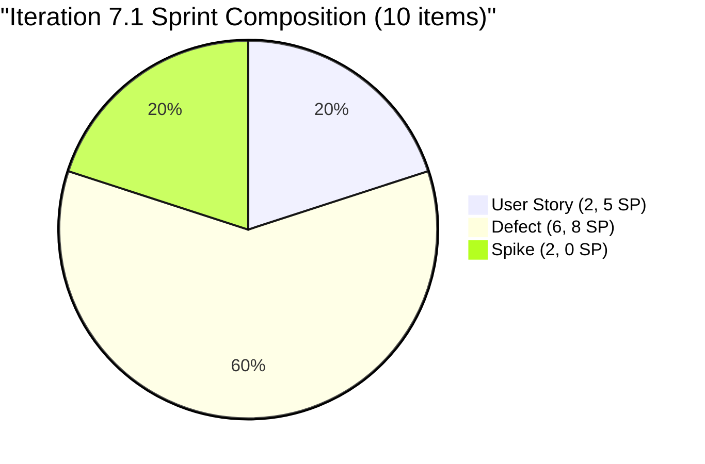
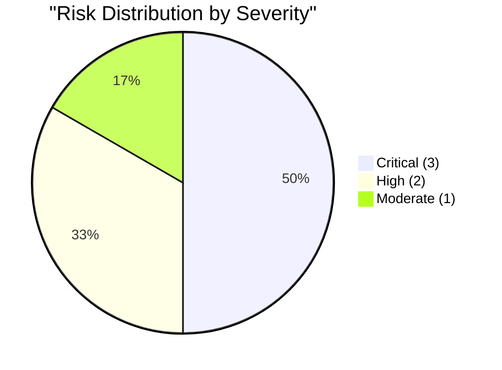

# SAFe Audit Report — Flawless Wedding App

## 1. Audit Metadata

| Field | Value |
|-------|-------|
| **Project** | Flawless Wedding App |
| **Project ID** | 92b967dc-5ec7-4874-b8f5-e43b00d88339 |
| **Team** | Flawless Wedding App Team |
| **Team ID** | 7d90ecbf-d272-4b0c-b33b-c66d96a790ac |
| **Backlog** | Stories and Deliverables (`Microsoft.RequirementCategory`) |
| **Board URL** | [Flawless Wedding App Board](https://dev.azure.com/jairo/Flawless%20Wedding%20App/_boards/board/t/Flawless%20Wedding%20App%20Team/Stories%20and%20Deliverables) |
| **Workspace Folder** | `ado_fl_dev` |
| **Current Iteration** | Iteration 7.1 |
| **Iteration Path** | `Flawless Wedding App\2026-PI7\Iteration 7.1` |
| **Iteration Start** | April 6, 2026 |
| **Iteration Finish** | April 19, 2026 |
| **Audit Date** | April 6, 2026 — 09:00 PHT |
| **Audit Day** | Day 1 of 14 (7% elapsed) |
| **Previous Audit** | AUDIT_20260405_0900.md (Apr 5, 2026 09:00 PHT — Audit #10) |
| **Overall Score** | **45.6 / 100** |
| **Risk Band** | **High Risk** |
| **Audit Series** | Iteration 7.1 Audit #1 |
| **Framework** | SAFe 6.0 |
| **Rubric** | ADO SAFe v1 (seven-dimension deterministic scoring) |

**Audit Boundary:** This audit covers only the Flawless Wedding App Team's Stories and Deliverables backlog. No other teams, boards, projects, or repositories were analyzed.

---

## 2. Executive Summary

This is the **first audit of PI 7 / Iteration 7.1** for the Flawless Wedding App. Since Audit #10 (Apr 5, final day of Iteration 6.6 IP):

### Key Changes

1. **PI 7 begins today** — Iteration 7.1 (Apr 6 - Apr 19) is the new active iteration
2. **10 items assigned to Iteration 7.1:**
   - 2 User Stories: #196989 (Login Flow Change, 2 SP), #201304 (50% off Islands, 3 SP)
   - 6 Defects: #196979, #191375, #190065, #201704, #201911, #200796 (total 8 SP)
   - 2 Spikes: #202150 (Backlog CleanUp), #202381 (Collaborations/Reports)
3. **Backlog remains large at 161 items** — unchanged from last audit
4. **3 carryover Spikes from 6.6 IP remain open** (#201569, #202086, #202087)
5. **1 new item added:** #202381 (Spike: Collaborations, Reports & Others)
6. **Score drops from 54.7 to 45.6 (-9.1)** — new iteration resets Delivery Predictability to 0, and DoR compliance drops

**The team enters PI 7 with a focused sprint of 10 items but continues to carry the massive stale backlog that structurally depresses Iteration Planning and Backlog Refinement.**

---

## 3. Previous Audit Delta

**Previous:** AUDIT_20260405_0900 — Iteration 6.6 (IP) Day 14 (FINAL), Audit #10

| Dimension | Audit #10 (6.6 FINAL) | **Audit #1 (7.1)** | Delta |
|-----------|------------------------|---------------------|-------|
| Iteration Planning | 11.2 | **6.2** | -5.0 |
| Team Capacity | 60.0 | **100.0** | +40.0 |
| Estimation | 66.7 | **80.0** | +13.3 |
| DoR Compliance | 33.3 | **20.0** | -13.3 |
| Work Item Balance | 100.0 | **100.0** | 0.0 |
| Backlog Refinement | 11.6 | **12.8** | +1.2 |
| Delivery Predictability | 100.0 | **0.0** | -100.0 |
| **Overall** | **54.7** | **45.6** | **-9.1** |

| Metric | Audit #10 | **Audit #1** | Delta |
|--------|-----------|-------------|-------|
| Visible Backlog | 161 | **161** | 0 |
| Current Iteration Items | 18 | **10** | -8 |
| SP Committed | 14 | **13** | -1 |
| Contributors with work | 5 | **2** | -3 |
| Contributors with capacity | 3 | **2** | -1 |

**Key shifts:** Team Capacity improves from 60% to 100% because only Luke and Ressa have sprint items, and both have capacity configured. Delivery Predictability resets from 100% to 0% (Day 1 of new sprint). DoR drops because the new sprint has more undocumented items.

---

## 4. Current Iteration Snapshot

| Metric | Value |
|--------|-------|
| Iteration | 7.1 — Apr 6 to Apr 19, 2026 (Day 1) |
| Visible root backlog items | 161 |
| Current iteration root items | 10 |
| SP Committed | 13 (8 estimated items) |
| Contributors with current work | 2 (Luke, Ressa) |
| Contributors with capacity | 2 (Luke 6h, Ressa 3h) |
| Team total capacity | 11 h/day (4 members with capacity) |

### 4.1 Current Iteration Work Items (10 Items)

| ID | Type | State | SP | Assigned To | Changed | DoR |
|----|------|-------|----|-------------|---------|-----|
| 196989 | User Story | Ready for Dev | 2 | Luke | Apr 6 | PASS |
| 196979 | Defect | Ready for Dev | 1 | Luke | Apr 6 | FAIL (no AC) |
| 191375 | Defect | Ready for Dev | 1 | Luke | Apr 6 | FAIL (no Desc/AC) |
| 190065 | Defect | Ready for Dev | 1 | Luke | Apr 6 | FAIL (no Desc/AC) |
| 201304 | User Story | Active | 3 | Luke | Apr 6 | PASS |
| 201704 | Defect | Ready for Dev | 1 | Luke | Apr 6 | FAIL (no Desc/AC) |
| 201911 | Defect | Ready for Dev | 2 | Luke | Apr 6 | FAIL (no Desc/AC) |
| 200796 | Defect | Ready for Dev | 2 | Luke | Apr 6 | FAIL (no Desc/AC) |
| 202150 | Spike | New | -- | Ressa | Apr 6 | FAIL (Desc < 30 nws) |
| 202381 | Spike | New | -- | Ressa | Apr 7 | FAIL (no Desc/AC) |

### 4.2 Carryover from 6.6 IP (3 Items — NOT in Current Iteration)

| ID | Type | State | Assigned To | Changed |
|----|------|-------|-------------|---------|
| 201569 | Spike | New | Ramon | Mar 31 |
| 202086 | Spike | New | Ressa | Apr 1 |
| 202087 | Spike | New | Carol | Apr 1 |

### 4.3 Team Capacity (Iteration 7.1)

| Contributor | Activity | Capacity | Days Off | Sprint Items |
|-------------|----------|----------|----------|-------------|
| Luke Abram Colina | Development | 6 h/day | 0 | 8 |
| Ressa Paracuelles | Testing | 3 h/day | 1 (Apr 9) | 2 |
| Luzmibel Paculanang | Testing | 1 h/day | 2 (Apr 9-10) | 0 |
| Ike Yana | Development | 1 h/day | 0 | 0 |

**Note:** Luzmibel and Ike have capacity configured but no sprint items assigned. A new team member (Luzmibel) has been added to the capacity roster.

---

## 5. Work Item Analysis

### 5.1 Sprint Type Distribution (10 Items)

| Type | Count | Share | SP |
|------|-------|-------|----|
| User Story | 2 | 20% | 5 |
| Defect | 6 | 60% | 8 |
| Spike | 2 | 20% | 0 |
| **Total** | **10** | **100%** | **13** |

### 5.2 Sprint Ownership

| Contributor | Items | SP | Share |
|-------------|-------|----|-------|
| Luke | 8 | 13 | 80% |
| Ressa | 2 | 0 | 20% |

### 5.3 Backlog Age Profile (161 items, estimated)

| Age Bucket | Approx Count | Share |
|------------|-------------|-------|
| Fresh (< 45 days) | ~85 | ~52.8% |
| 45-90 days | ~6 | ~3.7% |
| 90-180 days | ~30 | ~18.6% |
| > 180 days | ~40 | ~24.8% |
| **Total stale > 90 days** | **~70** | **~43.5%** |



---

## 6. SAFe Compliance Scorecard

| # | Dimension | Score | Formula | Evidence | Notes |
|---|-----------|-------|---------|----------|-------|
| 1 | Iteration Planning | **6.2** | 10/161 x 100 | 10 of 161 in Iter 7.1 | Backlog size dominates |
| 2 | Team Capacity | **100.0** | 2/2 x 100 | Luke + Ressa: both have capacity | Improved from 60% |
| 3 | Estimation | **80.0** | 8/10 x 100 | 2 Spikes unestimated | 8 items have SP > 0 |
| 4 | DoR Compliance | **20.0** | 2/10 x 100 | Only 2 items pass DoR | 8 items lack Desc/AC |
| 5 | Work Item Balance | **100.0** | 100 (no penalties) | US 20%, Defect 60%, Spike 20% | Healthy diversity |
| 6 | Backlog Refinement | **12.8** | 52.8 - 20 - 20 | stale_90 > 25%; stale_180 present | Stale backlog penalty |
| 7 | Delivery Predictability | **0.0** | 0/13 x 100 | Day 1 — no closures yet | Early-sprint — low delivery expected |
| | **Overall** | **45.6** | 319.0 / 7 | | **High Risk (40-59.9)** |

### Score Computation

```
--- Iteration Planning ---
visible_root_backlog_items = 161
current_iteration_root_items = 10
Score = round(10/161 x 100, 1) = 6.2

--- Team Capacity ---
contributors_with_current_work = 2 (Luke: 8 items, Ressa: 2 items)
contributors_with_capacity = 2 (Luke: 6 h/day, Ressa: 3 h/day)
Note: Ramon, Carol (6.6 IP carryover) NOT counted — not in current iteration
Score = round(2/2 x 100, 1) = 100.0

--- Estimation ---
point_eligible_current_items = 10 (all in RequirementCategory)
estimated_current_items = 8 (SP > 0):
  196989(2), 196979(1), 191375(1), 190065(1), 201304(3),
  201704(1), 201911(2), 200796(2) = 13 SP
Unestimated: 202150 (Spike), 202381 (Spike) = 2
Score = round(8/10 x 100, 1) = 80.0

--- DoR Compliance ---
current_iteration_root_items = 10
PASS (Desc >= 30 nws AND AC >= 20 nws):
  196989: Desc (login flow change, ~200 nws) + AC (Given/When/Then, ~300 nws) = PASS
  201304: Desc (50% discount, ~50 nws) + AC (Given/When/Then detailed, ~500 nws) = PASS
FAIL:
  196979: Desc (repro steps) but no structured AC = FAIL
  191375: No Desc/AC content visible = FAIL
  190065: No Desc/AC content visible = FAIL
  201704: No Desc/AC content visible = FAIL
  201911: No Desc/AC content visible = FAIL
  200796: No Desc/AC content visible = FAIL
  202150: Desc "Backlog CleanUp" (~14 nws < 30) = FAIL
  202381: No Desc/AC content visible = FAIL
Score = round(2/10 x 100, 1) = 20.0

--- Work Item Balance ---
US: 2 (20%), Defect: 6 (60%), Spike: 2 (20%)
dominant_type_share = 60% (Defect) — exactly 60%, NOT > 60% => no -30
has User Story => no -40
spike_share = 20% <= 40% => no -20
Score = 100.0

--- Backlog Refinement ---
Reference date: 2026-04-06
45-day cutoff: 2026-02-20
90-day cutoff: 2026-01-06
180-day cutoff: 2025-10-09

Estimated from sampled data:
  fresh (changed after Feb 20): ~85 items
  stale_90 (changed before Jan 6): ~70 items
  stale_180 (changed before Oct 9): ~40 items

base = round(85/161 x 100, 1) = 52.8
stale_90: 70/161 = 43.5% > 25% => -20
stale_180: ~40 items >= 1 => -20
untouched_current: All 10 iter 7.1 items changed Apr 6-7 >= Apr 6 => 0/10 = 0%
Score = max(52.8 - 20 - 20, 0) = 12.8

--- Delivery Predictability ---
estimated_current_items with SP > 0: 8 items
committed_story_points = 2+1+1+1+3+1+2+2 = 13
closed_story_points = 0 (Day 1, nothing closed)
Score = round(0/13 x 100, 1) = 0.0
Early-sprint: Day 1 of 14

--- Overall ---
(6.2 + 100.0 + 80.0 + 20.0 + 100.0 + 12.8 + 0.0) / 7 = 319.0 / 7 = 45.6
Risk Band: High Risk (40-59.9)
```

---

## 7. Dimension Findings

### 7.1 Iteration Planning (6.2/100) — CRITICAL

10 of 161 backlog items in the current iteration. This dimension remains structurally trapped by the massive backlog. The team committed a focused 10-item sprint, but the 161-item denominator makes any reasonable sprint look small. **Pruning the ~40 items stale > 180 days would improve to 10/121 = 8.3%.** The only path to significant improvement is aggressive backlog grooming.

### 7.2 Team Capacity (100.0/100) — EXCELLENT

All contributors with sprint items (Luke, Ressa) have capacity configured. This is a major improvement from 60% in the previous iteration when Ramon and Carol had items without capacity. The addition of Luzmibel Paculanang to the capacity roster (1 h/day Testing) is notable even though she has no sprint items yet.

### 7.3 Estimation (80.0/100) — LOW RISK

8 of 10 items estimated. The 2 unestimated items are both Spikes (#202150, #202381) assigned to Ressa. Spikes are investigative in nature, but the rubric counts them as point-eligible.

### 7.4 DoR Compliance (20.0/100) — CRITICAL

Only 2 of 10 items pass DoR. The 6 Defects all lack structured Acceptance Criteria — they entered the sprint with titles and sometimes repro steps but no formal AC. The 2 Spikes also fail. This is a regression from the 33.3% in Iteration 6.6.

### 7.5 Work Item Balance (100.0/100) — EXCELLENT

Healthy type diversity: User Story 20%, Defect 60%, Spike 20%. No single type exceeds 60% (Defect is exactly at 60%, which does not trigger the > 60% penalty). Has User Story present.

### 7.6 Backlog Refinement (12.8/100) — CRITICAL

Only ~52.8% of the 161-item backlog is fresh. Approximately 70 items are stale > 90 days and ~40 items stale > 180 days. The penalties for stale inventory (-20 each) bring the score down to 12.8. This has been flagged in all audits as the highest-impact structural issue.

### 7.7 Delivery Predictability (0.0/100) — CRITICAL (Expected)

Day 1 of a 14-day sprint. Zero items closed. **Early-sprint — low delivery expected.** The team achieved 100% delivery in Iteration 6.6 (14/14 SP), so this should improve significantly by sprint end.

---

## 8. Risks and Bottlenecks



### CRITICAL: ~40 Items Stale > 180 Days — Backlog Refinement Collapsed

The stale backlog continues to dominate two dimensions. Iteration Planning and Backlog Refinement are structurally trapped. This is the single highest-impact issue for long-term improvement.

### CRITICAL: DoR Compliance at 20% — Lowest in Series

8 of 10 sprint items fail DoR. The 6 Defects all lack AC, and both Spikes are undocumented. Only the 2 User Stories have proper Given/When/Then criteria. Items should not enter a sprint without meeting DoR.

### CRITICAL: 3 Carryover Spikes from 6.6 IP Unclosed

#201569 (Ramon), #202086 (Ressa), #202087 (Carol) remain in Iteration 6.6 IP with New state. These were never started and should be moved to PI 7 or closed.

### HIGH: Luke Carries 80% of Sprint (8/10 Items, 13 SP)

Luke is assigned all 8 estimated items (13 SP). Extreme ownership concentration continues from Iteration 6.6.

### HIGH: Ike and Luzmibel Have Capacity But No Sprint Items

Ike (1 h/day) and Luzmibel (1 h/day) have configured capacity but zero sprint items. This represents underutilization.

### MODERATE: 2 Spikes Unestimated

#202150 and #202381 have no Story Points. While Spikes are investigative, the rubric counts them.

---

## 9. Prioritized Recommendations

| Priority | Action | Owner | Target |
|----------|--------|-------|--------|
| 1 | **Add AC to 6 Defects** (#196979, #191375, #190065, #201704, #201911, #200796) | Ressa / Luke | Day 1-2 |
| 2 | **Close or move 3 carryover Spikes** (#201569, #202086, #202087) | Ramon | Day 1 |
| 3 | **Prune ~40 items stale > 180 days** from backlog | Ramon / Team | Week 1 |
| 4 | **Assign items to Ike and Luzmibel** or remove their capacity | Team Lead | Day 1-2 |
| 5 | **Add Desc/AC to 2 Spikes** (#202150, #202381) | Ressa | Day 1-2 |
| 6 | **Distribute Luke's workload** — target < 60% ownership | Team Lead | PI7 Planning |

---

## 10. Evidence Gaps and Limitations

| Gap | Impact | Notes |
|-----|--------|-------|
| Day 1 of sprint | Delivery Predictability = 0.0 | Expected; team delivered 100% in 6.6 |
| ~40 items stale > 180 days | Iter Planning and Backlog Refinement trapped | Pruning session required |
| 8 items fail DoR | Score at 20% | Defects/Spikes entered without AC |
| Backlog age estimates approximate | Fresh/stale counts based on sampled data | +/- 5 items margin |
| 3 carryover Spikes unclosed | Will carry forward indefinitely | Need disposition |
| Ike + Luzmibel 0 sprint items | Capacity underutilized | 2 h/day unused |

---

### Iteration Score History

| Audit | Date | Iter | Day | Score | Rubric | Key Change |
|-------|------|------|-----|-------|--------|------------|
| #1 | Mar 26 | 6.6 | 4 | 52.3 | 6-dim | First 6.6 audit |
| #5 | Mar 30 | 6.6 | 8 | 49.8 | 6-dim | Further pruning |
| #9 | Apr 4 | 6.6 | 13 | 47.4 | 6-dim | Pipeline frozen |
| #10 | Apr 5 | 6.6 | 14 | 54.7 | 7-dim | 15 Closed, 100% delivery |
| **7.1 #1** | **Apr 6** | **7.1** | **1** | **45.6** | **7-dim** | **PI7 Day 1; 10 items committed; DoR regression** |

---

*Report generated: April 6, 2026 09:00 PHT*
*Auditor: AI EngProd Consultant (SAFe 6.0)*
*Rubric: ADO SAFe v1 (seven-dimension deterministic scoring)*
*Iteration 7.1 Day 1 of 14 | Score: 45.6/100 (High Risk)*
*Previous: AUDIT_20260405_0900 (54.7/100 — High Risk)*
*Delta: -9.1 — PI7 Day 1; Delivery Pred resets to 0; DoR drops to 20%; Team Capacity improves to 100%*
