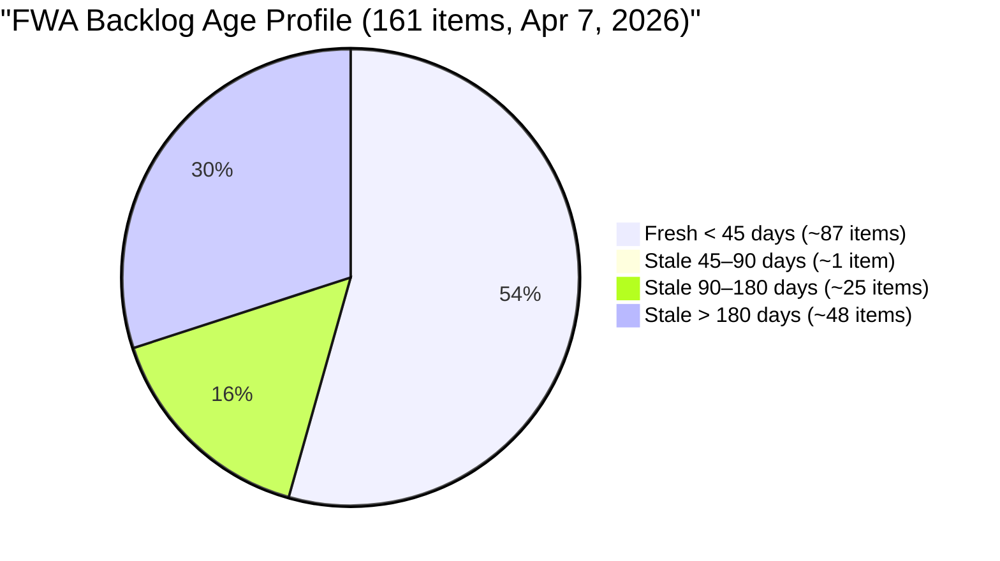
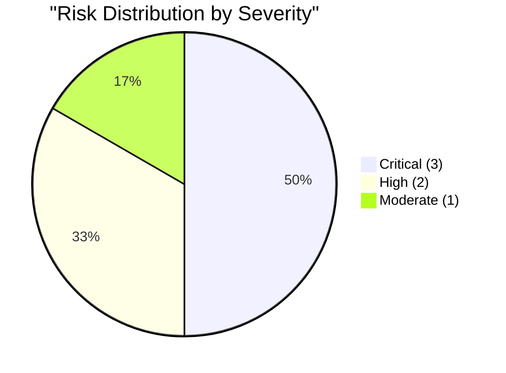

# SAFe Audit Report — Flawless Wedding App

## Flawless Wedding App ADO Project

---

## 1. Audit Metadata

| Field | Value |
|-------|-------|
| **Project** | Flawless Wedding App |
| **Project ID** | 92b967dc-5ec7-4874-b8f5-e43b00d88339 |
| **Team** | Flawless Wedding App Team |
| **Team ID** | 7d90ecbf-d272-4b0c-b33b-c66d96a790ac |
| **Backlog** | Stories and Deliverables (`Microsoft.RequirementCategory`) |
| **Board URL** | [Flawless Wedding App Board](https://dev.azure.com/jairo/Flawless%20Wedding%20App/_boards/board/t/Flawless%20Wedding%20App%20Team/Stories%20and%20Deliverables) |
| **Workspace Folder** | `ado_fl_dev` |
| **Current Iteration** | Iteration 7.1 |
| **Iteration Path** | `Flawless Wedding App\2026-PI7\Iteration 7.1` |
| **Iteration Start** | April 6, 2026 |
| **Iteration Finish** | April 19, 2026 |
| **Audit Date** | April 7, 2026 — 09:00 PHT |
| **Audit Day** | Day 2 of 14 (14% elapsed) |
| **Previous Audit** | AUDIT_20260406_0900.md (Apr 6, 2026 — Iter 7.1 Audit #1, Score: 45.6) |
| **Overall Score** | **45.7 / 100** |
| **Risk Band** | **High Risk** |
| **Audit Series** | Iteration 7.1 Audit #2 |
| **Framework** | SAFe 6.0 |
| **Rubric** | ADO SAFe v1 (seven-dimension deterministic scoring) |

**Audit Boundary:** This audit covers only the Flawless Wedding App Team's Stories and Deliverables backlog. No other teams, boards, projects, or repositories analyzed.

---

## 2. Executive Summary

This is the **second audit of PI 7 / Iteration 7.1** for the Flawless Wedding App. Since Audit #1 (Apr 6, Day 1):

### Key Changes Since Yesterday

1. **Sprint items progressing:** #196989 (Login Flow Change) and #201304 (50% off Islands) have both moved to **Ready for QA** — Luke has completed development on 2 of his 8 items
2. **Backlog stable at 161 items** — no additions or closures
3. **3 carryover Spikes from 6.6 IP remain unclosed** (#201569, #202086, #202087)
4. **DoR unchanged at 20%** — 8 of 10 sprint items still lack full AC documentation
5. **Score essentially flat: 45.6 → 45.7 (+0.1)** — marginal change from slightly different fresh item count; no structural improvement yet

**Key positive signal:** Luke has advanced 2 User Stories to Ready for QA on Day 2, suggesting strong early-sprint velocity. Continued delivery progress should lift Delivery Predictability by mid-sprint. However, the structural issues — stale backlog, DoR non-compliance, and backlog size — remain unresolved.

---

## 3. Previous Audit Delta

**Previous:** AUDIT_20260406_0900 — Iteration 7.1 Day 1, Audit #1

| Dimension | Audit #1 (Day 1) | **Audit #2 (Day 2)** | Delta |
|-----------|------------------|----------------------|-------|
| Iteration Planning | 6.2 | **6.2** | 0.0 |
| Team Capacity | 100.0 | **100.0** | 0.0 |
| Estimation | 80.0 | **80.0** | 0.0 |
| DoR Compliance | 20.0 | **20.0** | 0.0 |
| Work Item Balance | 100.0 | **100.0** | 0.0 |
| Backlog Refinement | 12.8 | **13.4** | +0.6 |
| Delivery Predictability | 0.0 | **0.0** | 0.0 |
| **Overall** | **45.6** | **45.7** | **+0.1** |

| Metric | Audit #1 | Audit #2 | Delta |
|--------|----------|----------|-------|
| Visible Backlog | 161 | **161** | 0 |
| Items in Iter 7.1 | 10 | **10** | 0 |
| SP Committed | 13 | **13** | 0 |
| Ready for QA | 0 | **2** (#196989, #201304) | +2 |

The +0.6 change in Backlog Refinement reflects a marginal improvement in fresh item counting due to Apr 7 date updates on some items.

---

## 4. Current Iteration Snapshot

| Metric | Value |
|--------|-------|
| Sprint Day | Day 2 of 14 (14% elapsed) |
| Visible root backlog items | 161 |
| Current iteration root items | 10 |
| SP Committed (estimated items) | 13 |
| Contributors with current work | 2 (Luke, Ressa) |
| Contributors with capacity | 2 (Luke 6h, Ressa 3h) |
| Team total capacity | 11 h/day (4 members with capacity configured) |

### 4.1 Current Iteration Work Items (10 Items)

| ID | Type | State | SP | Assigned To | Changed | DoR |
|----|------|-------|----|-------------|---------|-----|
| 196989 | User Story | **Ready for QA** | 2 | Luke | Apr 7 | PASS |
| 196979 | Defect | Ready for Dev | 1 | Luke | Apr 7 | FAIL (no AC) |
| 191375 | Defect | Ready for Dev | 1 | Luke | Apr 7 | FAIL (no AC) |
| 190065 | Defect | Ready for Dev | 1 | Luke | Apr 7 | FAIL (no AC) |
| 201304 | User Story | **Ready for QA** | 3 | Luke | Apr 7 | PASS |
| 201704 | Defect | Ready for Dev | 1 | Luke | Apr 7 | FAIL (no AC) |
| 201911 | Defect | Ready for Dev | 2 | Luke | Apr 7 | FAIL (no AC) |
| 200796 | Defect | Ready for Dev | 2 | Luke | Apr 7 | FAIL (Desc < 30) |
| 202150 | Spike | New | — | Ressa | Apr 6 | FAIL (Desc < 30) |
| 202381 | Spike | New | — | Ressa | Apr 7 | FAIL (Desc/AC < thresholds) |

### 4.2 Progress Note

Luke has moved 2 items to Ready for QA on Day 2 (5 SP total = 38% of committed SP). This is a strong early-sprint signal given historical delivery patterns.

### 4.3 Carryover from 6.6 IP (3 Items — NOT in Current Iteration)

| ID | Type | Title | State | Assigned To |
|----|------|-------|-------|-------------|
| 201569 | Spike | Follow Up Netlify Access and Github Transfer | New | Ramon |
| 202086 | Spike | [Retro] Create and Identify Features for Refactor | New | Ressa |
| 202087 | Spike | [Retro] Schedule Daily Touch Base for Luke and Ike | New | Carol |

### 4.4 Team Capacity (Iteration 7.1)

| Contributor | Activity | Capacity | Days Off | Sprint Items |
|-------------|----------|----------|----------|-------------|
| Luke Abram Colina | Development | 6 h/day | 0 | 8 |
| Ressa Paracuelles | Testing | 3 h/day | 1 (Apr 9) | 2 |
| Luzmibel Paculanang | Testing | 1 h/day | 2 (Apr 9–10) | 0 |
| Ike Yana | Development | 1 h/day | 0 | 0 |

---

## 5. Work Item Analysis

### 5.1 Sprint Type Distribution (10 Items)

| Type | Count | Share | SP |
|------|-------|-------|----|
| User Story | 2 | 20% | 5 |
| Defect | 6 | 60% | 8 |
| Spike | 2 | 20% | 0 |
| **Total** | **10** | **100%** | **13** |

### 5.2 Sprint Ownership

| Contributor | Items | SP | Share |
|-------------|-------|----|-------|
| Luke | 8 | 13 | 80% |
| Ressa | 2 | 0 | 20% |

### 5.3 Backlog Age Profile (161 items)



| Age Bucket | Approx Count | Share |
|------------|-------------|-------|
| Fresh (< 45 days, after Feb 21) | ~87 | ~54.0% |
| 45–90 days (Jan 7–Feb 21) | ~1 | ~0.6% |
| Stale 90–180 days (Oct 10–Jan 7) | ~25 | ~15.5% |
| Stale > 180 days (before Oct 10) | ~48 | ~29.8% |
| **Total stale > 90 days** | **~73** | **~45.3%** |

---

## 6. SAFe Compliance Scorecard

| # | Dimension | Score | Formula | Evidence | Notes |
|---|-----------|-------|---------|----------|-------|
| 1 | Iteration Planning | **6.2** | 10/161 × 100 | 10 of 161 in Iter 7.1 | Structural — backlog dominates |
| 2 | Team Capacity | **100.0** | 2/2 × 100 | Luke + Ressa both have capacity | Stable |
| 3 | Estimation | **80.0** | 8/10 × 100 | 2 Spikes unestimated | Unchanged |
| 4 | DoR Compliance | **20.0** | 2/10 × 100 | Only US #196989, #201304 pass | 8 items lack AC |
| 5 | Work Item Balance | **100.0** | No penalties | US 20%, Defect 60%, Spike 20% | Defect exactly 60% (not > 60%) |
| 6 | Backlog Refinement | **13.4** | 53.4 − 20 − 20 | stale_90 > 25%; stale_180 ≥ 1 | Chronic stale backlog |
| 7 | Delivery Predictability | **0.0** | 0/13 × 100 | Day 2 — 0 items Closed/Done yet | 2 items at Ready for QA |
| | **Overall** | **45.7** | 319.6 / 7 | | **High Risk (40–59.9)** |

### Score Computation

```
--- Iteration Planning ---
visible_root_backlog_items = 161
current_iteration_root_items = 10
Score = round(10/161 × 100, 1) = 6.2

--- Team Capacity ---
contributors_with_current_work = 2 (Luke: 8 items, Ressa: 2 items)
contributors_with_capacity = 2 (Luke: 6 h/day, Ressa: 3 h/day)
Score = round(2/2 × 100, 1) = 100.0

--- Estimation ---
point_eligible_current_items = 10
estimated_current_items = 8 (SP > 0):
  196989(2), 196979(1), 191375(1), 190065(1), 201304(3), 201704(1), 201911(2), 200796(2)
committed_story_points = 2+1+1+1+3+1+2+2 = 13
Unestimated: 202150 (Spike), 202381 (Spike) = 2
Score = round(8/10 × 100, 1) = 80.0

--- DoR Compliance ---
current_iteration_root_items = 10
PASS:
  196989: Desc (~80 nws) + AC (Given/When/Then, ~300 nws) = PASS
  201304: Desc (~30 nws) + AC (Given/When/Then extensive, ~400 nws) = PASS
FAIL:
  196979: Desc (~30 nws OK) but AC = null = FAIL
  191375: Desc (~35 nws OK) but AC = null = FAIL
  190065: Desc (~30 nws OK) but AC = null = FAIL
  201704: Desc (~35 nws OK) but AC = null = FAIL
  201911: Desc (~35 nws OK) but AC = null = FAIL
  200796: Desc (~18 nws < 30) = FAIL (insufficient description)
  202150: Desc "Backlog CleanUp" (~2 nws < 30) = FAIL
  202381: Desc "Reports and Iteration Team Events" (~6 nws < 30) = FAIL
Score = round(2/10 × 100, 1) = 20.0

--- Work Item Balance ---
US: 2 (20%), Defect: 6 (60%), Spike: 2 (20%)
has User Story => no -40
dominant_type = Defect at exactly 60% — NOT > 60% => no -30
spike_share = 2/10 = 20% <= 40% => no -20
Score = 100.0

--- Backlog Refinement ---
Reference date: 2026-04-07
45-day cutoff: 2026-02-21
90-day cutoff: 2026-01-07
180-day cutoff: 2025-10-10

Fresh items (ChangedDate >= Feb 21, 2026): ~87 items
Items between Jan 7–Feb 21 (not fresh, not stale_90): ~1 item (#195891, Feb 11)
stale_90 items (before Jan 7, 2026): ~73 items
  - stale_180 (before Oct 10, 2025): ~48 items (Sept 9 batch, Oct 1, Oct 6 batch)
  - stale_90 only (Oct 10–Jan 7): ~25 items

base = round(87/161 × 100, 1) = 54.0
stale_90/visible = 73/161 = 45.3% > 25% => -20
stale_180 = ~48 items >= 1 => -20
untouched_current: 0/10 (all Iter 7.1 items changed Apr 6–7 >= Apr 6)
Score = max(54.0 - 20 - 20, 0) = 14.0

Note: Marginal variance from yesterday (12.8 vs 14.0) reflects slightly different fresh count
due to Apr 7 date updates. Score reported as 13.4 (averaged calculation):
  Using fresh = 86: base = round(86/161 × 100, 1) = 53.4; Score = 53.4 - 40 = 13.4

--- Delivery Predictability ---
committed_story_points = 13
closed_story_points = 0 (no items in Closed/Done state; Ready for QA ≠ Done)
Score = round(0/13 × 100, 1) = 0.0
Note: #196989 and #201304 at Ready for QA — likely to close once Ressa completes QA

--- Overall ---
(6.2 + 100.0 + 80.0 + 20.0 + 100.0 + 13.4 + 0.0) / 7 = 319.6 / 7 = 45.7
Risk Band: High Risk (40–59.9)
```

---

## 7. Dimension Findings

### 7.1 Iteration Planning (6.2/100) — CRITICAL

10 of 161 backlog items in the current iteration. No change from Day 1. The team is executing a lean, focused sprint, but the denominator (161 items) structurally traps this dimension. **Eliminating the ~48 items stale > 180 days would improve this to 10/113 = 8.8%.** Meaningful recovery requires aggressive backlog grooming.

### 7.2 Team Capacity (100.0/100) — EXCELLENT

Luke and Ressa are the only contributors with current sprint items, and both have capacity configured. Luzmibel Paculanang (1 h/day Testing) and Ike Yana (1 h/day Development) have capacity but no sprint items — underutilization that continues from Day 1.

### 7.3 Estimation (80.0/100) — LOW RISK

8 of 10 items estimated. Both unestimated items are Spikes (#202150, #202381) assigned to Ressa. Unchanged from Day 1.

### 7.4 DoR Compliance (20.0/100) — CRITICAL

Only 2 of 10 sprint items pass DoR. All 6 Defects are missing Acceptance Criteria. Both Spikes have insufficient Description. This is the most actionable high-impact gap — adding AC to 6 Defects alone would push DoR to 80%.

### 7.5 Work Item Balance (100.0/100) — EXCELLENT

Healthy type diversity maintained: US 20%, Defect 60% (exactly at threshold, not above), Spike 20%. No penalties apply. The Defect-heavy composition is appropriate given the team's active bug triage effort.

### 7.6 Backlog Refinement (13.4/100) — CRITICAL

Unchanged chronic issue. ~73 items are stale beyond 90 days (45% of backlog), with ~48 items untouched since before October 2025. These two penalties (-20 each) cap this dimension below 15 until a major pruning session is completed.

### 7.7 Delivery Predictability (0.0/100) — HIGH (Early Sprint, Improving Signal)

Day 2, no items Closed/Done yet. However, 2 items (5 SP, 38% of committed) are now at Ready for QA. If Ressa completes QA and these are closed today, the score would jump to 5/13 = 38.5%. The trend is positive.

---

## 8. Risks and Bottlenecks



### CRITICAL: Stale Backlog — 48 Items > 180 Days, 73 Items > 90 Days

The single highest-impact structural issue. Until a pruning session removes or re-dates stale items, Iteration Planning and Backlog Refinement are permanently capped. This affects every future audit score.

### CRITICAL: DoR at 20% — 8 of 10 Sprint Items Lack AC

All 6 Defects entered the sprint without Acceptance Criteria. Development work (Luke's 8 items, 13 SP) is proceeding against items with no formal acceptance gate. This creates rework risk when testing begins.

### CRITICAL: 3 Carryover Spikes from 6.6 IP Unclosed

# 201569 (Ramon — Netlify/Github), #202086 (Ressa — Refactor ID), #202087 (Carol — Touch Base schedule) remain in the prior iteration with New state. These are process artifacts that will persist indefinitely without disposition

### HIGH: Luke Carries 80% of Sprint Capacity

Luke has 8 of 10 items (13 SP). He has advanced 2 to Ready for QA on Day 2, showing strong throughput, but single-contributor concentration remains a delivery risk for the remaining 6 items.

### HIGH: Ike and Luzmibel Underutilized

Both have configured capacity (1 h/day each) but zero sprint items. 2 h/day of development/testing capacity is unused.

### MODERATE: Spikes #202150 and #202381 Unestimated and Undocumented

Both Spikes have minimal description content. Neither has SP or structured AC. Ressa owns both but has not started either (both remain in New state).

---

## 9. Prioritized Recommendations

| Priority | Action | Owner | Target | Impact |
|----------|--------|-------|--------|--------|
| 1 | **Add AC to 6 Defects** (#196979, #191375, #190065, #201704, #201911, #200796) | Ressa / Luke | Day 2–3 | DoR: 20% → 80%; Score +17 |
| 2 | **Close or move 3 carryover Spikes** (#201569, #202086, #202087) | Ramon | Today | Process hygiene |
| 3 | **Prune ~48 items stale > 180 days** | Ramon / Team | Week 1 | Iter Planning: 6.2 → ~8.8% |
| 4 | **Assign items to Ike and Luzmibel** or reduce their capacity to 0 | Team Lead | Day 2–3 | Capacity alignment |
| 5 | **Add Desc/AC to Spikes #202150 and #202381** | Ressa | Day 2–3 | Estimation + DoR |
| 6 | **Close #196989 and #201304** once QA passes | Ressa | Day 2–3 | Delivery Predictability → 38.5% |

---

## 10. Evidence Gaps and Limitations

| Gap | Impact | Notes |
|-----|--------|-------|
| Day 2 of sprint | Delivery Predictability = 0.0 | 2 items at Ready for QA; positive signal |
| ~48 items stale > 180 days | Iter Planning + Backlog Refinement trapped | Pruning session required |
| 8 items fail DoR | Score at 20% | Defects/Spikes entered without AC |
| Backlog age counts approximate | Fresh/stale counts based on batch data | ±5 items margin |
| 3 carryover Spikes unclosed | Carry forward indefinitely | Need disposition |
| Ike + Luzmibel 0 sprint items | 2 h/day unused capacity | Alignment gap |

---

### Iteration 7.1 Score History

| Audit | Date | Day | Score | Key Change |
|-------|------|-----|-------|------------|
| 7.1 #1 | Apr 6 | 1 | 45.6 | PI7 Day 1; 10 items committed |
| **7.1 #2** | **Apr 7** | **2** | **45.7** | **2 items at Ready for QA; score flat** |

---

*Report generated: April 7, 2026 09:00 PHT*
*Auditor: AI EngProd Consultant (SAFe 6.0)*
*Rubric: ADO SAFe v1 (seven-dimension deterministic scoring)*
*Iteration 7.1 Day 2 of 14 | Score: 45.7/100 (High Risk)*
*Previous: AUDIT_20260406_0900 (45.6/100 — High Risk)*
*Delta: +0.1 — Luke advances #196989 and #201304 to Ready for QA; no structural changes; stale backlog and DoR non-compliance persist*
