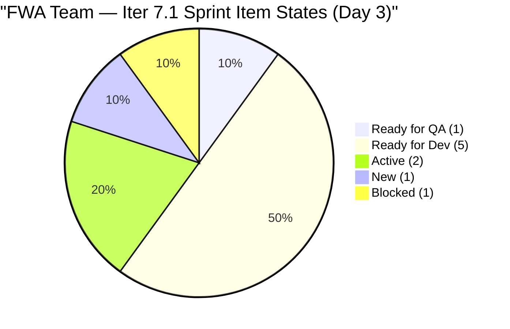
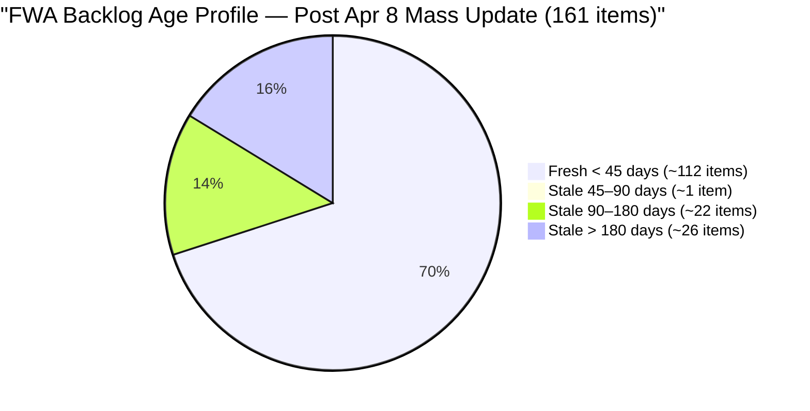
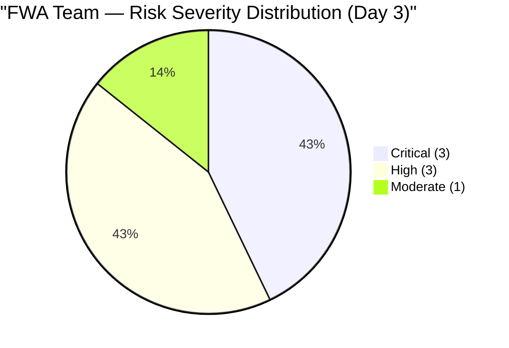
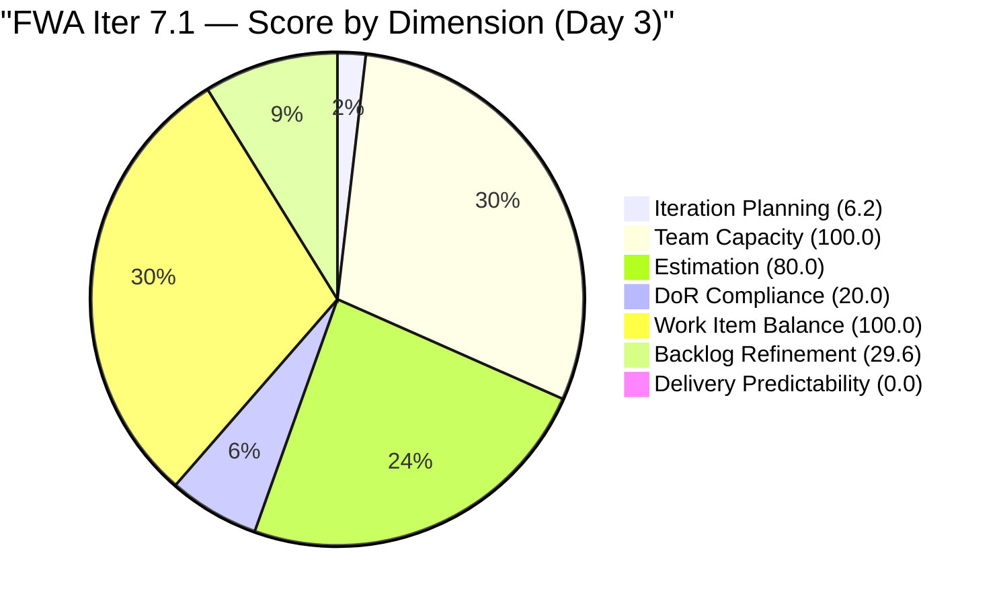

# SAFe Audit Report — Flawless Wedding App Team

## Flawless Wedding App ADO Project

---

## 1. Audit Metadata

| Field | Value |
|-------|-------|
| **Project** | Flawless Wedding App |
| **Project ID** | 92b967dc-5ec7-4874-b8f5-e43b00d88339 |
| **Team** | Flawless Wedding App Team |
| **Team ID** | 7d90ecbf-d272-4b0c-b33b-c66d96a790ac |
| **Backlog** | Stories and Deliverables (`Microsoft.RequirementCategory`) |
| **Board URL** | [Flawless Wedding App Board](https://dev.azure.com/jairo/Flawless%20Wedding%20App/_boards/board/t/Flawless%20Wedding%20App%20Team/Stories%20and%20Deliverables) |
| **Workspace Folder** | `ado_fl_dev` |
| **Current Iteration** | Iteration 7.1 |
| **Iteration Path** | `Flawless Wedding App\2026-PI7\Iteration 7.1` |
| **Iteration Start** | April 6, 2026 |
| **Iteration Finish** | April 19, 2026 |
| **Audit Date** | April 8, 2026 — 09:00 PHT |
| **Audit Day** | Day 3 of 14 (21% elapsed) |
| **Previous Audit** | AUDIT_20260407_0900.md (Apr 7, 2026 — Score: 45.7) |
| **Overall Score** | **48.0 / 100** |
| **Risk Band** | **High Risk** |
| **Audit Series** | Iteration 7.1 Audit #3 |
| **Framework** | SAFe 6.0 |
| **Rubric** | ADO SAFe v1 (seven-dimension deterministic scoring) |

**Audit Boundary:** This audit covers only the Flawless Wedding App Team's Stories and Deliverables backlog. No other teams, boards, projects, or repositories analyzed.

---

## 2. Executive Summary

This is the **third audit of PI 7 / Iteration 7.1** for the Flawless Wedding App. Since Audit #2 (Apr 7, Day 2):

### Key Changes Since Yesterday

1. **#196989 (Login Flow) moved to Blocked** — was Ready for QA yesterday; today shows Blocked state (Apr 8). A blocker emerged after Luke completed development.
2. **#196979 (Login Issue — Passkey) moved to Active** — Luke has picked up this defect; previously at Ready for Dev.
3. **Mass PI6 backlog update (Apr 8):** ~25–27 PI6-path items updated simultaneously, moving them from stale to fresh. This significantly improves the Backlog Refinement score.
4. **Score improves from 45.7 to 48.0 (+2.3):** Backlog Refinement jumps from 13.4 to 29.6 due to the PI6 mass-refresh.
5. **#202381 (Spike)** state changed to Active; Luke is working on sprint items.

**Critical concern:** #196989 is now Blocked — the most advanced sprint item has hit an impediment on Day 3. If the blocker is not resolved promptly, the 2 SP cannot close this sprint. DoR non-compliance across 8 of 10 items remains unchanged.

---

## 3. Previous Audit Delta

**Previous:** AUDIT_20260407_0900 — Iteration 7.1 Day 2, Audit #2

| Dimension | Audit #2 (Day 2) | **Audit #3 (Day 3)** | Delta |
|-----------|------------------|----------------------|-------|
| Iteration Planning | 6.2 | **6.2** | 0.0 |
| Team Capacity | 100.0 | **100.0** | 0.0 |
| Estimation | 80.0 | **80.0** | 0.0 |
| DoR Compliance | 20.0 | **20.0** | 0.0 |
| Work Item Balance | 100.0 | **100.0** | 0.0 |
| Backlog Refinement | 13.4 | **29.6** | **+16.2** |
| Delivery Predictability | 0.0 | **0.0** | 0.0 |
| **Overall** | **45.7** | **48.0** | **+2.3** |

| Metric | Audit #2 | Audit #3 | Delta |
|--------|----------|----------|-------|
| Visible Backlog | 161 | **161** | 0 |
| Items in Iter 7.1 | 10 | **10** | 0 |
| SP Committed | 13 | **13** | 0 |
| #196989 State | Ready for QA | **Blocked** | Regression |
| #196979 State | Ready for Dev | **Active** | Progress |
| PI6 Items Refreshed | — | **~25 items** | Mass update |

---

## 4. Current Iteration Snapshot

### 4.1 Iteration 7.1 — Work Items (10 Items, 13 SP)

| ID | Title | Type | SP | State | Changed | DoR |
|----|-------|------|----|-------|---------|-----|
| 196989 | Login Flow Change — Q&A Flow | US | 2 | **Blocked** | Apr 8 | PASS |
| 201304 | 50% off for adding more than two islands | US | 3 | Ready for QA | Apr 7 | PASS |
| 196979 | Login Issue — Passkey Not Working | Defect | 1 | **Active** | Apr 8 | FAIL (no AC) |
| 191375 | iOS Vendor Account Delete Error | Defect | 1 | Ready for Dev | Apr 7 | FAIL (no AC) |
| 190065 | Blank page when downloading contract | Defect | 1 | Ready for Dev | Apr 7 | FAIL (no AC) |
| 201704 | Admin Vendor category duplicate assignment | Defect | 1 | Ready for Dev | Apr 7 | FAIL (no AC) |
| 201911 | [Web] Booked Events not able to load page | Defect | 2 | Ready for Dev | Apr 7 | FAIL (no AC) |
| 200796 | Inconsistent grand total in Payment vs Contract | Defect | 2 | Ready for Dev | Apr 7 | FAIL (Desc < 30) |
| 202150 | [Retro] Backlog CleanUp | Spike | — | New | Apr 6 | FAIL (Desc < 30) |
| 202381 | Iter 7.1 — Collaborations, Reports & Others | Spike | — | Active | Apr 8 | FAIL (Desc < 30) |

### 4.2 Sprint Item State Summary



### 4.3 Blocker Alert — #196989

# 196989 "Login Flow Change — Q&A Flow" (2 SP) moved from **Ready for QA → Blocked** between Day 2 and Day 3. This is the most advanced sprint item. The blocker must be identified and resolved immediately. Blocked items should be raised to Ramon for impediment removal

### 4.4 Team Capacity (Iteration 7.1)

| Contributor | Activity | h/day | Days Off | Sprint Items |
|-------------|----------|-------|----------|-------------|
| Luke Abram Colina | Development | 6 | 0 | 8 |
| Ressa Paracuelles | Testing / Spikes | 3 | 1 (Apr 9) | 2 |
| Luzmibel Paculanang | Testing | 1 | 2 (Apr 9–10) | 0 |
| Ike Yana | Development | 1 | 0 | 0 |

**Team capacity per day:** 11 h/day. **Luzmibel and Ike remain unassigned to sprint items.**

### 4.5 Carryover Spikes (NOT in Current Iteration)

| ID | Title | Iteration | State | Owner |
|----|-------|-----------|-------|-------|
| 201569 | Follow Up Netlify Access and Github Transfer | 6.6 IP | New | Ramon |
| 202086 | [Retro] Create and Identify Features for Refactor | 6.6 IP | New | Ressa |
| 202087 | [Retro] Schedule Daily Touch Base for Luke and Ike | 6.6 IP | New | Carol |

---

## 5. Work Item Analysis

### 5.1 Sprint Type Distribution (10 Items)

| Type | Count | Share | SP |
|------|-------|-------|----|
| User Story | 2 | 20% | 5 |
| Defect | 6 | 60% | 8 |
| Spike | 2 | 20% | 0 |
| **Total** | **10** | **100%** | **13** |

### 5.2 DoR Status (10 Items)

| Status | Count | Items |
|--------|-------|-------|
| PASS | 2 | #196989 (US), #201304 (US) |
| FAIL — no AC | 5 | #196979, #191375, #190065, #201704, #201911 |
| FAIL — Desc < 30 nws | 3 | #200796, #202150, #202381 |
| **Overall** | **2/10** | **20.0%** |

### 5.3 Backlog Age Profile (161 Items)

Following the mass Apr 8 update of PI6 items, the backlog age profile has improved significantly:



| Age Bucket | Count (approx) | Share |
|------------|----------------|-------|
| Fresh (< 45 days, after Feb 22) | ~112 | ~69.6% |
| 45–90 days (Jan 9 – Feb 22) | ~1 | ~0.6% |
| Stale 90–180 days (Oct 11 – Jan 9) | ~22 | ~13.7% |
| Stale > 180 days (before Oct 11) | ~26 | ~16.1% |
| **Total stale > 90 days** | **~48** | **~29.8%** |

The PI6 mass-update reduced stale_90 from ~73 to ~48 items. However:

- stale_90/visible = 48/161 = 29.8% — still above the 25% threshold (-20 penalty remains)
- stale_180 ≥ 1 (-20 penalty remains)

---

## 6. SAFe Compliance Scorecard

| # | Dimension | Score | Formula | Evidence | Notes |
|---|-----------|-------|---------|----------|-------|
| 1 | Iteration Planning | **6.2** | 10/161 × 100 | 10 of 161 in Iter 7.1 | Structural — 151 items outside sprint |
| 2 | Team Capacity | **100.0** | 2/2 × 100 | Luke (6h) + Ressa (3h) both have capacity | Stable |
| 3 | Estimation | **80.0** | 8/10 × 100 | 2 Spikes unestimated | Unchanged |
| 4 | DoR Compliance | **20.0** | 2/10 × 100 | Only US #196989, #201304 pass | 8 items fail DoR |
| 5 | Work Item Balance | **100.0** | No penalties | US 20%, Defect 60% (not > 60%), Spike 20% | No penalties apply |
| 6 | Backlog Refinement | **29.6** | 69.6 − 20 − 20 | stale_90 29.8% > 25%; stale_180 ≥ 1 | Improved from 13.4; still penalized |
| 7 | Delivery Predictability | **0.0** | 0/13 × 100 | Day 3 — 0 items Closed/Done | #196989 Blocked; #201304 at QA |
| | **Overall** | **48.0** | 335.8 / 7 | | **High Risk (40–59.9)** |

### Score Computation

```
--- Iteration Planning ---
visible_root_backlog_items = 161
current_iteration_root_items = 10
Score = round(10/161 × 100, 1) = 6.2

--- Team Capacity ---
contributors_with_current_work = 2 (Luke: 8 items; Ressa: 2 items)
contributors_with_capacity = 2 (Luke: 6 h/day, Ressa: 3 h/day)
Score = round(2/2 × 100, 1) = 100.0

--- Estimation ---
point_eligible_current_items = 10
estimated_current_items = 8 (SP > 0):
  196989(2), 196979(1), 191375(1), 190065(1),
  201304(3), 201704(1), 201911(2), 200796(2)
committed_story_points = 2+1+1+1+3+1+2+2 = 13
Unestimated: 202150 (Spike), 202381 (Spike)
Score = round(8/10 × 100, 1) = 80.0

--- DoR Compliance ---
current_iteration_root_items = 10
PASS (Desc >= 30 nws AND AC >= 20 nws):
  196989: Desc ~50 nws + AC (Given/When/Then ~200 nws) = PASS [now Blocked]
  201304: Desc ~40 nws + AC (Given/When/Then ~400 nws) = PASS
FAIL:
  196979: Desc ~30 nws OK; AC = null = FAIL
  191375: Desc ~35 nws OK; AC = null = FAIL
  190065: Desc ~30 nws OK; AC = null = FAIL
  201704: Desc ~50 nws OK; AC = null = FAIL
  201911: Desc ~30 nws OK; AC = null = FAIL
  200796: Desc <div>A contract has been revised...</div> ~18 nws < 30 = FAIL
  202150: Desc "Backlog CleanUp" ~13 nws < 30 = FAIL
  202381: Desc "Reports and Iteration Team Events" ~5 words ~29 nws < 30 = FAIL
Score = round(2/10 × 100, 1) = 20.0

--- Work Item Balance ---
US: 2 (20%), Defect: 6 (60%), Spike: 2 (20%)
has User Story => no -40
Defect = exactly 60% — NOT > 60% => no -30
spike_share = 2/10 = 20% <= 40% => no -20
Score = 100.0

--- Backlog Refinement ---
Reference date: 2026-04-08
45-day cutoff: 2026-02-22
90-day cutoff: 2026-01-09
180-day cutoff: 2025-10-11

After Apr 8 mass update of PI6 items (~25 items previously stale moved to fresh):
fresh_items (ChangedDate >= Feb 22, 2026) = ~112
  - All 10 Iter 7.1 items (changed Apr 6–8)
  - PI6 items updated Apr 8 (188572, 188592, 188594, 189183, 189681,
    190060, 190150, 190502, 190805, 191079, 191226, 191580, 192170,
    193029, 193034, 194538, 195624, 195625, 197776, 199089, 201326,
    201569, 202150, 202381, 198769, 198771, 198773, 196984 + other PI7 items)
  - PI7 new backlog items (201714–201845, Mar 27–30)
  - Recent PI6 items (Feb–Apr 2026 dates)

stale_90 items (ChangedDate before Jan 9, 2026) = ~48
  - Remaining Sep 2025 items still untouched: ~26 stale > 180 days
  - Items from Oct–Dec 2025 period: ~22 stale 90–180 days

stale_90/visible = 48/161 = 29.8% > 25% => -20 penalty
stale_180 = ~26 items >= 1 => -20 penalty

base = round(112/161 × 100, 1) = 69.6
untouched_current: all 10 Iter 7.1 items changed Apr 6–8 >= Apr 6
Score = max(69.6 - 20 - 20, 0) = 29.6

--- Delivery Predictability ---
committed_story_points = 13
closed_story_points = 0
  - #196989 = Blocked (not Closed/Done)
  - #201304 = Ready for QA (not Closed/Done)
Score = round(0/13 × 100, 1) = 0.0 [early-sprint, Day 3]

--- Overall ---
(6.2 + 100.0 + 80.0 + 20.0 + 100.0 + 29.6 + 0.0) / 7 = 335.8 / 7 = 48.0
Risk Band: High Risk (40–59.9)
```

---

## 7. Dimension Findings

### 7.1 Iteration Planning (6.2/100) — CRITICAL

10 of 161 backlog items are in the current iteration. Structurally unchanged. The PI6 mass-update had no impact on this dimension (it affects Backlog Refinement only). Meaningful improvement requires either aggressive backlog pruning (~48 stale items removal would raise to 10/113 = 8.8%) or adding more items to the sprint.

### 7.2 Team Capacity (100.0/100) — EXCELLENT

Luke and Ressa are the contributors with sprint items, and both have configured capacity. Stable. Luzmibel and Ike remain underutilized (combined 2 h/day capacity with no sprint assignments).

### 7.3 Estimation (80.0/100) — LOW RISK

8 of 10 items estimated. Both Spikes (#202150, #202381) are unestimated and assigned to Ressa. #202381 moved to Active state today — Ressa should add a SP estimate. Unchanged from Day 2.

### 7.4 DoR Compliance (20.0/100) — CRITICAL

2 of 10 items pass DoR. Unchanged from Day 2. All 6 Defects in the sprint have adequate Descriptions but no Acceptance Criteria. Both Spikes have insufficient Descriptions. Luke is actively working against 6 of these 8 non-compliant items. Adding AC to the 5 defects with adequate descriptions would raise DoR from 20% to 70% (+50 points on this dimension, +7.1 overall).

### 7.5 Work Item Balance (100.0/100) — EXCELLENT

US 20% + Defect 60% (exactly at threshold, not above) + Spike 20%. No penalties. The Defect concentration reflects deliberate bug triage focus. Healthy composition for a sprint with active QA engagement.

### 7.6 Backlog Refinement (29.6/100) — HIGH RISK

Significant improvement from 13.4 to 29.6 (+16.2) driven by the Apr 8 mass update of ~25 PI6-path items from stale to fresh. This is the largest single-day Backlog Refinement improvement in the FWA series. However, both penalties still apply:

- stale_90 at 29.8% > 25% (-20)
- stale_180 ≥ 1 (-20)

To eliminate the stale_90 penalty, ~8 more items need to be updated or removed (bringing stale_90 below 161 × 25% = ~40 items). To eliminate the stale_180 penalty, all ~26 Sep 2025 items must be updated or closed.

### 7.7 Delivery Predictability (0.0/100) — HIGH (Deteriorating Signal)

Day 3, no items Closed/Done. More concerning: #196989 has regressed from Ready for QA (Day 2) to Blocked (Day 3). The sprint's most advanced item is now stalled. If #196989 cannot close this sprint and #201304 (the only other item at Ready for QA) is delayed by Ressa's QA backlog, Delivery Predictability may end significantly below historical norms.

---

## 8. Risks and Bottlenecks



### CRITICAL: #196989 Blocked on Day 3 — Dev-Complete Item Stalled

"Login Flow Change" (2 SP) was at Ready for QA on Day 2 and is now Blocked on Day 3. The blocker must be identified immediately. Luke completed development; the impediment is likely in the QA handoff, environment, or external dependency.

**Owner: Ramon (impediment removal). Action: Identify and resolve blocker today.**

### CRITICAL: DoR at 20% — 8 of 10 Sprint Items Lack AC

All 6 Defects are being developed by Luke without Acceptance Criteria. This creates rework risk: when Ressa begins QA, she has no formal acceptance gate to test against. The pattern from Day 1 persists without remediation.

**Owner: Luke/Ressa. Action: Add AC to 5 defects with adequate Desc today (#196979, #191375, #190065, #201704, #201911).**

### CRITICAL: Stale Backlog — 26 Items > 180 Days, 48 Items > 90 Days

~26 items from September 2025 remain in the backlog untouched for over 180 days. The Apr 8 mass update reduced stale_90 from ~73 to ~48, but the structural penalties persist. Until ~8 more items are updated/removed, the 25%-threshold penalty remains.

### HIGH: #196989 Blocker + Sequence Risk for Delivery

# 196989 (2 SP, Blocked) and #201304 (3 SP, Ready for QA) represent 38% of committed SP. Both items are at advanced states but neither is Closed. If #196989 blocker persists through Day 5 and Ressa's QA is delayed by her Apr 9 day off, the first sprint closures may not occur until Day 6–7

### HIGH: Luke Carrying 80% of Sprint Work (8 items, 13 SP)

Luke's throughput to date: 2 items at advanced states. Active on #196979 now. 6 items remain at Ready for Dev. At historical pace of ~1 SP/day (5 h/day ÷ ~5 SP complexity), Luke could close 8–10 SP in the remaining 11 days — suggesting 4–5 items may not close.

### HIGH: 3 Carryover Spikes from 6.6 IP Still Unclosed

# 201569 (Ramon), #202086 (Ressa), #202087 (Carol) remain in the prior PI's IP sprint with New state. These represent unfinished PI6 retrospective actions. Without closure, they will persist indefinitely

### MODERATE: Spikes #202150 and #202381 Underdocumented

# 202381 is Active as of Apr 8, but its Description ("Reports and Iteration Team Events") is ~29 nws (just below the 30 nws threshold). #202150 ("Backlog CleanUp") is similar. Ressa should expand these Spike descriptions to meet DoR before proceeding

---

## 9. Prioritized Recommendations

| Priority | Action | Owner | Target | Impact |
|----------|--------|-------|--------|--------|
| 1 | **Identify and resolve #196989 blocker** — escalate to Ramon | Ramon | **Today** | Prevent sprint's #1 item from failing |
| 2 | **Add AC to 5 Defects** (#196979, #191375, #190065, #201704, #201911) | Luke / Ressa | **Day 3–4** | DoR: 20% → 70%; Score: +7.1 |
| 3 | **Close or reassign 3 carryover Spikes** (#201569, #202086, #202087) | Ramon | **This week** | Process hygiene; PI6 closure |
| 4 | **Expand Desc for #202381 and #202150** | Ressa | Day 3–4 | DoR compliance for Spikes |
| 5 | **Prune ~8 more stale items** to drop stale_90 below 40 items | Ramon / Team | Week 1 | Backlog Refinement: 29.6 → 49.6 |
| 6 | **Close #201304** once Ressa completes QA | Ressa | Day 3–5 | Delivery Predictability: 0 → 23.1% |
| 7 | **Assign sprint items to Luzmibel and Ike** or reduce capacity | Team Lead | Day 3–4 | Capacity alignment |

---

## 10. Evidence Gaps and Limitations

| Gap | Impact | Notes |
|-----|--------|-------|
| #196989 blocker unknown | Uncertain sprint completion | Escalate immediately |
| Day 3 — no closures | Delivery Predictability = 0.0 | Expected; monitor from Day 5 |
| Stale backlog ~48 items > 90 days | Iter Planning + Backlog Refinement penalized | Ongoing structural issue |
| 8 items fail DoR | Score at 20%; rework risk | Defects/Spikes entered without AC |
| Fresh/stale counts approximate | ±5 items margin possible | Based on batch field data |
| 3 carryover Spikes unclosed | Carry forward indefinitely | Need disposition |
| Ike + Luzmibel 0 sprint items | 2 h/day unused | Alignment gap |

---

### Iteration 7.1 Score History



| Audit | Date | Day | Score | Key Change |
|-------|------|-----|-------|------------|
| 7.1 #1 | Apr 6 | 1 | 45.6 | PI7 Day 1; 10 items committed |
| 7.1 #2 | Apr 7 | 2 | 45.7 | Luke: 2 items at Ready for QA |
| **7.1 #3** | **Apr 8** | **3** | **48.0** | **PI6 mass refresh +16.2 Backlog Refin.; #196989 Blocked** |

---

*Report generated: April 8, 2026 09:00 PHT*
*Auditor: AI EngProd Consultant (SAFe 6.0)*
*Rubric: ADO SAFe v1 (seven-dimension deterministic scoring)*
*Iteration 7.1 Day 3 of 14 | Score: 48.0/100 (High Risk)*
*Previous: AUDIT_20260407_0900 (45.7/100 — High Risk)*
*Delta: +2.3 — PI6 mass backlog update boosts Backlog Refinement from 13.4 to 29.6; #196989 regressed to Blocked; DoR at 20% unchanged*
