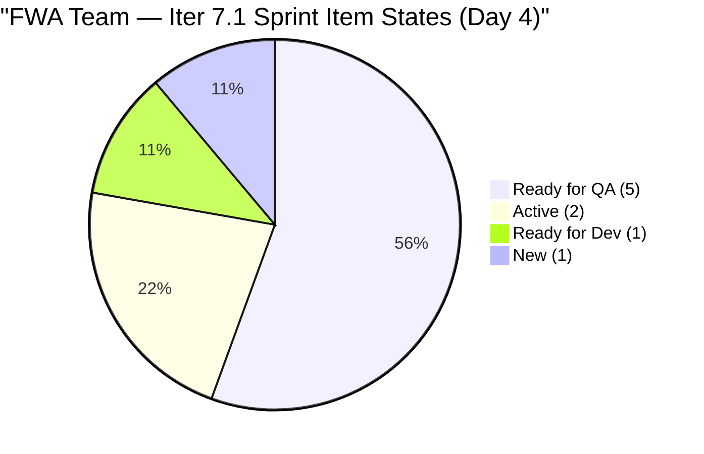
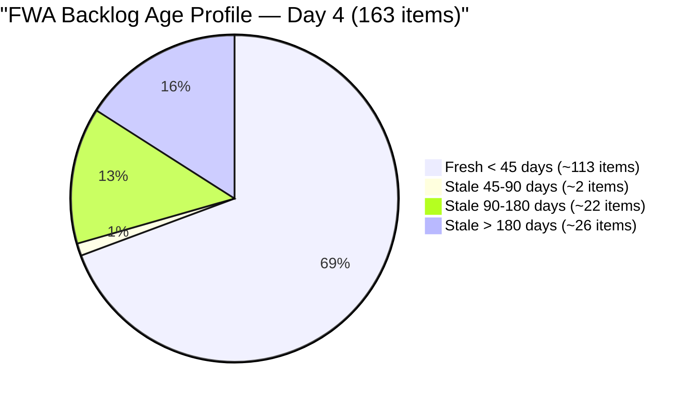
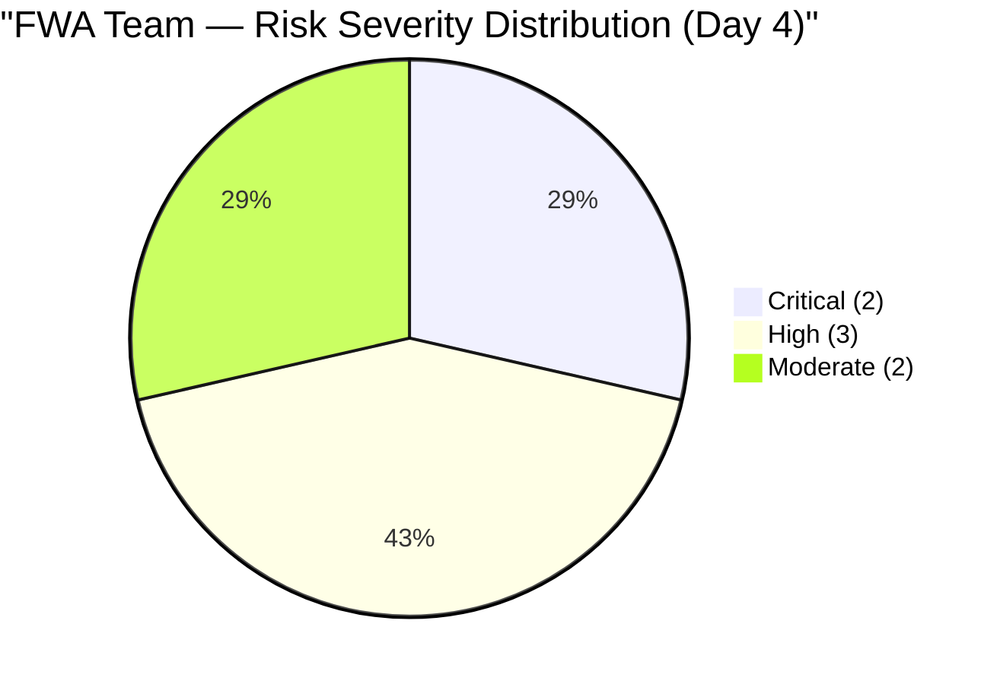
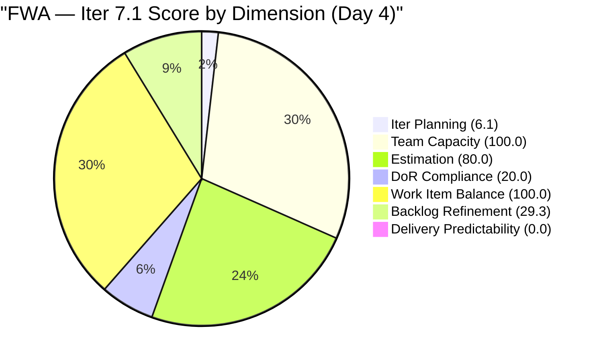

# SAFe Audit Report — Flawless Wedding App Team

## Flawless Wedding App ADO Project

---

## 1. Audit Metadata

| Field | Value |
|-------|-------|
| **Project** | Flawless Wedding App |
| **Project ID** | 92b967dc-5ec7-4874-b8f5-e43b00d88339 |
| **Team** | Flawless Wedding App Team |
| **Team ID** | 7d90ecbf-d272-4b0c-b33b-c66d96a790ac |
| **Backlog** | Stories and Deliverables (`Microsoft.RequirementCategory`) |
| **Board URL** | [Flawless Wedding App Board](https://dev.azure.com/jairo/Flawless%20Wedding%20App/_boards/board/t/Flawless%20Wedding%20App%20Team/Stories%20and%20Deliverables) |
| **Workspace Folder** | `ado_fl_dev` |
| **Current Iteration** | Iteration 7.1 |
| **Iteration Path** | `Flawless Wedding App\2026-PI7\Iteration 7.1` |
| **Iteration Start** | April 6, 2026 |
| **Iteration Finish** | April 19, 2026 |
| **Audit Date** | April 9, 2026 — 09:00 PHT |
| **Audit Day** | Day 4 of 14 (29% elapsed) |
| **Previous Audit** | AUDIT_20260408_0900.md (Apr 8, 2026 — Score: 48.0) |
| **Overall Score** | **47.9 / 100** |
| **Risk Band** | **High Risk** |
| **Audit Series** | Iteration 7.1 Audit #4 |
| **Framework** | SAFe 6.0 |
| **Rubric** | ADO SAFe v1 (seven-dimension deterministic scoring) |

**Audit Boundary:** This audit covers only the Flawless Wedding App Team's Stories and Deliverables backlog. No other teams, boards, projects, or repositories analyzed.

---

## 2. Executive Summary

This is the **fourth audit of PI 7 / Iteration 7.1** for the Flawless Wedding App. Since Audit #3 (Apr 8, Day 3):

### Key Changes Since Yesterday

1. **#196989 (Login Flow) unblocked — back to Ready for QA.** The blocker that emerged on Day 3 has been resolved. This is the sprint's highest-value item (2 SP, complete development). Ressa is on a day off today (Apr 9) — QA will resume Apr 10.
2. **#196979 (Login Issue — Passkey) progressed to Ready for QA.** Luke completed development overnight; this defect moved from Active → Ready for QA.
3. **#191375 (iOS Vendor Delete Error) progressed to Ready for QA.** Moved from Ready for Dev → Ready for QA; Luke completed fix.
4. **#201704 (Admin Vendor Duplicate) progressed to Ready for QA.** Moved from Ready for Dev → Ready for QA; Luke has been highly productive overnight.
5. **#190065 and #201911 moved to Active.** Luke picked up 2 new defects for development.
6. **Backlog grew from 161 to 163 items** — 2 new items (#202117, #202119) added to the backlog.
7. **Score declines slightly from 48.0 to 47.9 (−0.1):** Iteration Planning 6.2 → 6.1 (163 denominator vs 161); Backlog Refinement 29.6 → 29.3 (163 denominator, same penalties). Other dimensions unchanged.

**Significant progress signal:** Luke delivered 4 items to Ready for QA by Day 4 (196989 unblocked, 196979, 191375, 201704). When Ressa resumes QA tomorrow, the team has strong potential for first closures by Day 5–6. No items have closed yet but the delivery pipeline is filling rapidly.

---

## 3. Previous Audit Delta

**Previous:** AUDIT_20260408_0900 — Iteration 7.1 Day 3, Audit #3

| Dimension | Audit #3 (Day 3) | **Audit #4 (Day 4)** | Delta |
|-----------|------------------|----------------------|-------|
| Iteration Planning | 6.2 | **6.1** | −0.1 |
| Team Capacity | 100.0 | **100.0** | 0.0 |
| Estimation | 80.0 | **80.0** | 0.0 |
| DoR Compliance | 20.0 | **20.0** | 0.0 |
| Work Item Balance | 100.0 | **100.0** | 0.0 |
| Backlog Refinement | 29.6 | **29.3** | −0.3 |
| Delivery Predictability | 0.0 | **0.0** | 0.0 |
| **Overall** | **48.0** | **47.9** | **−0.1** |

| Metric | Audit #3 | Audit #4 | Delta |
|--------|----------|----------|-------|
| Visible Backlog | 161 | **163** | +2 |
| Items in Iter 7.1 | 10 | **10** | 0 |
| SP Committed | 13 | **13** | 0 |
| Items at Ready for QA | 2 | **5** | **+3** |
| Items Active | 2 | **2** | 0 |
| #196989 State | Blocked | **Ready for QA** | +Progress |
| #196979 State | Active | **Ready for QA** | +Progress |
| #191375 State | Ready for Dev | **Ready for QA** | +Progress |
| #201704 State | Ready for Dev | **Ready for QA** | +Progress |
| #190065 State | Ready for Dev | **Active** | +Progress |
| #201911 State | Ready for Dev | **Active** | +Progress |

---

## 4. Current Iteration Snapshot

### 4.1 Iteration 7.1 — Work Items (10 Items, 13 SP)

| ID | Title | Type | SP | State | Changed | DoR |
|----|-------|------|----|-------|---------|-----|
| 196989 | Login Flow Change — Q&A Flow | US | 2 | **Ready for QA** | Apr 9 | PASS |
| 201304 | 50% off for adding more than two islands | US | 3 | Ready for QA | Apr 7 | PASS |
| 196979 | Login Issue — Passkey Not Working | Defect | 1 | **Ready for QA** | Apr 9 | FAIL (no AC) |
| 191375 | iOS Vendor Account Delete Error | Defect | 1 | **Ready for QA** | Apr 9 | FAIL (no AC) |
| 201704 | Admin Vendor category duplicate assignment | Defect | 1 | **Ready for QA** | Apr 9 | FAIL (no AC) |
| 190065 | Blank page when downloading contract | Defect | 1 | **Active** | Apr 9 | FAIL (no AC) |
| 201911 | [Web] Booked Events not able to load page | Defect | 2 | **Active** | Apr 9 | FAIL (no AC) |
| 200796 | Inconsistent grand total in Payment vs Contract | Defect | 2 | Ready for Dev | Apr 7 | FAIL (Desc < 30 nws) |
| 202150 | [Retro] Backlog CleanUp | Spike | — | New | Apr 6 | FAIL (Desc < 30 nws) |
| 202381 | Iter 7.1 — Collaborations, Reports & Others | Spike | — | Active | Apr 8 | FAIL (Desc < 30 nws) |

**Note:** #200255 ("[Vendor] Registration code reuse") appeared in the iteration API query but its IterationPath = `Flawless Wedding App\2026-PI6\Iteration 6.6 (IP)` and State = Closed. It is excluded from current_iteration_root_items per scoring rules (IterationPath does not match Iteration 7.1).

### 4.2 Sprint Item State Summary (Day 4)



### 4.3 QA Pipeline — Ready for Ressa (Day 5, Apr 10)

5 items are now at Ready for QA — the highest QA queue in the Iteration 7.1 series. Ressa returns from her day off on April 10. Combined QA queue: **5 items, 8 SP** — if Ressa closes all 5 tomorrow, Delivery Predictability = 8/13 = **61.5%**.

| ID | Title | Type | SP | AC Status |
|----|-------|------|----|-----------|
| 196989 | Login Flow Change — Q&A Flow | US | 2 | PASS — has AC |
| 201304 | 50% off for adding more than two islands | US | 3 | PASS — has AC |
| 196979 | Login Issue — Passkey Not Working | Defect | 1 | **FAIL — no AC** |
| 191375 | iOS Vendor Account Delete Error | Defect | 1 | **FAIL — no AC** |
| 201704 | Admin Vendor category duplicate assignment | Defect | 1 | **FAIL — no AC** |

3 of the 5 QA-ready items have no Acceptance Criteria. Ressa has no formal testing gate for these items.

### 4.4 Luke's Throughput Summary (Days 1–4)

| Day | Items Delivered to Ready for QA | Cumulative |
|-----|----------------------------------|------------|
| Day 1 | 0 | 0 |
| Day 2 | 2 (#196989, #201304) | 2 |
| Day 3 | 0 (blocker on #196989) | 2 |
| Day 4 | 3 (#196979, #191375, #201704 + #196989 unblocked) | 5 |

### 4.5 Team Capacity

| Contributor | Activity | h/day | Days Off | Sprint Items |
|-------------|----------|-------|----------|-------------|
| Luke Abram Colina | Development | 6 | 0 | 8 items assigned |
| Ressa Paracuelles | Testing / Spikes | 3 | 1 (Apr 9 — today) | 2 (QA queue pending) |
| Luzmibel Paculanang | Testing | 1 | Apr 9–10 | 0 |
| Ike Yana | Development | 1 | 0 | 0 |

---

## 5. Work Item Analysis

### 5.1 Sprint Type Distribution (10 Items)

| Type | Count | Share | SP |
|------|-------|-------|----|
| User Story | 2 | 20% | 5 |
| Defect | 6 | 60% | 8 |
| Spike | 2 | 20% | 0 |
| **Total** | **10** | **100%** | **13** |

### 5.2 DoR Status (10 Items)

| Status | Count | Items |
|--------|-------|-------|
| PASS | 2 | #196989 (US), #201304 (US) |
| FAIL — no AC | 5 | #196979, #191375, #190065, #201704, #201911 |
| FAIL — Desc < 30 nws | 3 | #200796, #202150, #202381 |
| **Overall** | **2/10** | **20.0%** |

### 5.3 Backlog Age Profile (163 Items)



| Age Bucket | Count (est.) | Share |
|------------|-------------|-------|
| Fresh (< 45 days, after Feb 23) | ~113 | ~69.3% |
| 45–90 days (Jan 9 – Feb 23) | ~2 | ~1.2% |
| Stale 90–180 days (Oct 12 – Jan 9) | ~22 | ~13.5% |
| Stale > 180 days (before Oct 12, 2025) | ~26 | ~16.0% |
| **Total stale > 90 days** | **~48** | **~29.4%** |

---

## 6. SAFe Compliance Scorecard

| # | Dimension | Score | Formula | Evidence | Notes |
|---|-----------|-------|---------|----------|-------|
| 1 | Iteration Planning | **6.1** | 10/163 × 100 | 10 of 163 items in Iter 7.1 | −0.1 from 2 new backlog items |
| 2 | Team Capacity | **100.0** | 2/2 × 100 | Luke (6h) + Ressa (3h) with capacity and sprint items | Stable; Ressa on day off Apr 9 |
| 3 | Estimation | **80.0** | 8/10 × 100 | 2 Spikes (#202150, #202381) unestimated | Unchanged |
| 4 | DoR Compliance | **20.0** | 2/10 × 100 | Only US #196989, #201304 pass | 8 items fail DoR — unchanged |
| 5 | Work Item Balance | **100.0** | No penalties | US 20%, Defect 60% (not > 60%), Spike 20% | No penalties apply |
| 6 | Backlog Refinement | **29.3** | 69.3 − 20 − 20 | stale_90 29.4% > 25%; stale_180 ≥ 1 | −0.3 from larger denominator |
| 7 | Delivery Predictability | **0.0** | 0/13 × 100 | Day 4 — 0 items Closed/Done | 5 items at Ready for QA; first closures expected Day 5 |
| | **Overall** | **47.9** | 335.4 / 7 | | **High Risk (40–59.9)** |

### Score Computation

```
--- Iteration Planning ---
visible_root_backlog_items = 163 (backlog API; +2 new items #202117, #202119 vs yesterday)
current_iteration_root_items = 10
  (196979, 191375, 201304, 201704, 196989, 190065, 201911, 200796, 202381, 202150)
  Note: #200255 (IterationPath=PI6.6 IP, State=Closed) excluded per scoring rules
Score = round(10/163 × 100, 1) = 6.1

--- Team Capacity ---
contributors_with_current_work = 2 (Luke: 8 sprint items; Ressa: 2 sprint items)
contributors_with_capacity = 2 (Luke: 6 h/day Development; Ressa: 3 h/day Testing)
Score = round(2/2 × 100, 1) = 100.0

--- Estimation ---
point_eligible_current_items = 10
estimated_current_items = 8 (SP > 0):
  196989(2), 196979(1), 191375(1), 190065(1),
  201304(3), 201704(1), 201911(2), 200796(2)
committed_story_points = 2+1+1+1+3+1+2+2 = 13
Unestimated: 202150 (Spike, 0 SP), 202381 (Spike, 0 SP)
Score = round(8/10 × 100, 1) = 80.0

--- DoR Compliance ---
current_iteration_root_items = 10
PASS (Desc >= 30 nws AND AC >= 20 nws):
  196989: Desc ~50 nws + AC (Given/When/Then ~200+ nws) = PASS
  201304: Desc ~40 nws + AC (Given/When/Then ~400 nws) = PASS
FAIL:
  196979: Desc ~30 nws OK; AC = null = FAIL
  191375: Desc ~35 nws OK; AC = null = FAIL
  190065: Desc ~30 nws OK; AC = null = FAIL
  201704: Desc ~50 nws OK; AC = null = FAIL
  201911: Desc ~30 nws OK; AC = null = FAIL
  200796: Desc "A contract has been revised..." ~18 nws < 30 = FAIL
  202150: Desc "Backlog CleanUp" ~13 nws < 30 = FAIL
  202381: Desc "Reports and Iteration Team Events" ~29 nws < 30 = FAIL
Score = round(2/10 × 100, 1) = 20.0

--- Work Item Balance ---
US: 2 (20%), Defect: 6 (60%), Spike: 2 (20%)
has User Story => no -40
Defect = exactly 60% — NOT > 60% => no -30
spike_share = 2/10 = 20% <= 40% => no -20
Score = 100.0

--- Backlog Refinement ---
Reference date: 2026-04-09
45-day cutoff: 2026-02-23
90-day cutoff: 2026-01-09
180-day cutoff: 2025-10-12

visible = 163
fresh (ChangedDate >= Feb 23, 2026) = ~113
  - All 10 Iter 7.1 items updated Apr 6–9
  - PI6 items mass-refreshed Apr 8
  - PI7 new backlog items (201714–201845, Mar 27–30)
  - 2 new items (#202117, #202119) assumed fresh (recently created)
base = round(113/163 × 100, 1) = 69.3

stale_90 (ChangedDate < Jan 9, 2026) = ~48; ratio = 48/163 = 29.4% > 25% => -20
stale_180 (ChangedDate < Oct 12, 2025) = ~26 items >= 1 => -20
untouched_current (changed before Apr 6): 0/10 (all Iter 7.1 items updated Apr 6–9)
Score = max(69.3 - 20 - 20, 0) = 29.3

--- Delivery Predictability ---
committed_story_points = 13
closed_story_points = 0 (no items in State = Closed or Done)
Score = round(0/13 × 100, 1) = 0.0 [early-sprint, Day 4 of 14]

--- Overall ---
(6.1 + 100.0 + 80.0 + 20.0 + 100.0 + 29.3 + 0.0) / 7 = 335.4 / 7 = 47.9
Risk Band: High Risk (40–59.9)
```

---

## 7. Dimension Findings

### 7.1 Iteration Planning (6.1/100) — CRITICAL

10 of 163 backlog items are in the current iteration. The 2 new backlog items (#202117, #202119) added today marginally worsen this ratio from 6.2 to 6.1. The structural fix requires aggressive backlog pruning. Removing the ~48 stale items would yield 10/115 = 8.7% — still critical. Rationalizing the backlog to ~80 active items would yield 10/80 = 12.5%. Long-term, this dimension requires a dedicated grooming sprint to close resolved items and eliminate true backlog waste. Adding more items to the current sprint would also help but is not recommended mid-sprint given the existing DoR deficit.

### 7.2 Team Capacity (100.0/100) — EXCELLENT

Luke (6h/day Development) and Ressa (3h/day Testing) are both configured with activities and have sprint items assigned. Ressa is on a day off today (Apr 9) — she returns tomorrow. Luke continues to deliver items to QA at high throughput. Luzmibel (1h Testing) and Ike (1h Development) hold capacity without sprint assignments through Day 4.

### 7.3 Estimation (80.0/100) — MODERATE

8 of 10 sprint items are estimated. Both Spikes remain without Story Points: #202150 ([Retro] Backlog CleanUp, assigned to Ressa, New) and #202381 (Collaborations/Reports, assigned to Ressa, Active). Ressa should add SP estimates on Day 5 when she returns. Adding SP to both Spikes raises Estimation to 100.0 and the overall score by +2.9 points (47.9 → 50.8).

### 7.4 DoR Compliance (20.0/100) — CRITICAL

2 of 10 items pass DoR. Unchanged through Day 4 despite significant development progress. The urgency has escalated: 5 items are now at Ready for QA, and 3 of those 5 (#196979, #191375, #201704) have no Acceptance Criteria. When Ressa begins testing tomorrow, she will have no formal pass/fail criteria for these items. Without AC:

- Ressa will test based on implicit understanding — results may not align with stakeholder expectations
- If the PO disputes a closure during sprint review, items may be re-opened
- Rework cycles triggered after Day 5 compress the remaining sprint window

**If AC is added to all 5 items without it today** (#196979, #191375, #190065, #201704, #201911): DoR = 7/10 = 70.0 (+50 points on this dimension, +7.1 overall → score = 55.0, still High Risk but approaching Moderate).

### 7.5 Work Item Balance (100.0/100) — EXCELLENT

US=2(20%), Defect=6(60% — exactly at threshold, not above), Spike=2(20%). No penalties apply. The Defect-heavy composition reflects a deliberate bug triage sprint. Score is healthy and expected to remain at 100.0 for the sprint duration.

### 7.6 Backlog Refinement (29.3/100) — HIGH RISK

Marginal decline from 29.6 to 29.3 due to 2 new items increasing the denominator to 163 without changing the stale counts. Both structural penalties persist:

- **stale_90 penalty (−20):** ~48 items have ChangedDate before Jan 9, 2026 = 29.4% of backlog. Threshold is 25% = ~41 items. Need to update or close ~7 more items to drop below threshold. Impact: Backlog Refinement +20 (29.3 → 49.3).
- **stale_180 penalty (−20):** ~26 items from September 2025 remain in the backlog untouched for > 180 days. All 26 must be updated or closed to eliminate this penalty. Impact: Backlog Refinement +20 (29.3 → 49.3, or +40 combined = 69.3 if both eliminated).

The Apr 8 mass refresh improved the score from 13.4 to ~29.3 (+15.9). A second targeted action on the ~7 oldest qualifying items would clear the stale_90 penalty alone, pushing Backlog Refinement above 49 and the overall score to ~52.8 (still High Risk but approaching Moderate).

### 7.7 Delivery Predictability (0.0/100) — HIGH RISK (Improving Signal)

Day 4. No items closed. However, the delivery pipeline has transformed significantly:

- Day 2: 2 items at Ready for QA (5 SP)
- Day 3: 1 item at Ready for QA (regression: #196989 blocked)
- Day 4: 5 items at Ready for QA (8 SP — 62% of committed SP)

Ressa returns from day off tomorrow (Apr 10). **Projected first closures: Day 5 (Apr 10).** If Ressa closes all 5 QA items: closed_SP = 8/13 = **61.5% Delivery Predictability**. That single-day event would push the overall score from 47.9 to approximately **56.7** — still High Risk but approaching Moderate threshold (60.0).

---

## 8. Risks and Bottlenecks



### CRITICAL: 3 Ready-for-QA Defects Have No AC — Rework Risk on Day 5

When Ressa resumes QA on Apr 10, she faces 3 Defects (#196979, #191375, #201704) at Ready for QA with no Acceptance Criteria. Testing without AC means no formal pass/fail gate. If Ressa closes these items and the PO or stakeholders dispute the behavior during sprint review, items will be re-opened — compressing the remaining sprint window for rework.

**Owner: Luke / Ressa. Action: Define AC for #196979, #191375, #201704 today so Ressa has testing criteria for Day 5.**

### CRITICAL: DoR at 20% — Unchanged Through Day 4

8 of 10 sprint items do not meet Definition of Ready. Despite significant development progress (5 items at QA pipeline), the DoR deficit has not been addressed across four consecutive days. Items entering and exiting development without AC undermines sprint review quality and creates systemic rework risk. This is the most persistent unresolved finding in the FWA Iteration 7.1 audit series.

### HIGH: Ressa's QA Capacity vs. Queue Size

Ressa (3h/day Testing) returns tomorrow with 5 items queued. At approximately 30–60 minutes per defect test, she could clear 3–6 items in a day under ideal conditions. If any items fail QA due to missing AC or behavior gaps, they return to Luke as Active — creating a back-and-forth cycle:

Failed QA → Active (Luke) → Ready for QA → Re-test (Ressa) → Potential closure

Each failed QA cycle costs approximately 1–2 sprint days. With 10 days remaining, 2–3 rework cycles are feasible but compress the buffer significantly.

### HIGH: Backlog Refinement Structural Penalties — Persistent

~26 items from September 2025 remain in the backlog untouched for over 180 days. The stale_180 penalty (−20) will persist until all 26 are updated or closed. The stale_90 threshold penalty (−20) requires updating or removing ~7 more items. Combined, these two penalties suppress Backlog Refinement by 40 points. Without targeted action, this dimension will remain below 30 for the remainder of the sprint.

### HIGH: Iteration Planning Structural Issue — 163-Item Backlog

Only 10 of 163 items are in the sprint. The ratio has worsened marginally with 2 new items added today. The 153 non-sprint items include future backlog, old unresolved items, and stale inventory. A focused grooming session targeting the ~48 stale items would reduce the denominator meaningfully and is the most viable path to improving this dimension.

### MODERATE: Luzmibel and Ike — 2h/Day Capacity Unaligned

Luzmibel (1h/day Testing) and Ike (1h/day Development) continue without sprint assignments through Day 4. Their combined 2h/day could assist Ressa with the QA queue (Luzmibel) or pick up development of #200796 or #202150 (Ike). Assigning sprint work improves both capacity utilization and sprint delivery throughput.

### MODERATE: 3 Carryover Spikes from PI6 IP Still Unclosed

# 201569 (Ramon), #202086 (Ressa), #202087 (Carol) remain in the prior PI's IP sprint (6.6) with New state. These PI6 retrospective actions have now carried into Day 4 of PI7 without resolution. Without closure, they will persist indefinitely and represent unfinished PI6 commitments

---

## 9. Prioritized Recommendations

| Priority | Action | Owner | Target | Impact |
|----------|--------|-------|--------|--------|
| 1 | **Add AC to 3 Ready-for-QA Defects** (#196979, #191375, #201704) before Ressa returns | Luke / Ressa | **Today (Apr 9)** | Prevent rework on Day 5; DoR: 20% → 50% |
| 2 | **Close 5 QA-ready items** when Ressa returns Apr 10 | Ressa | **Apr 10** | Delivery Predictability: 0 → 61.5%; Overall: 47.9 → ~56.7 |
| 3 | **Add SP to Spikes** (#202150, #202381) | Ressa | Day 5 (Apr 10) | Estimation: 80% → 100%; Overall +2.9 → ~50.8 |
| 4 | **Add AC to #190065 and #201911** (Active defects) before they reach QA | Luke | Day 4–5 | DoR improvement; QA quality gate |
| 5 | **Prune ~7 stale items** to drop stale_90 below 40 | Ramon | Week 1 | Backlog Refinement: +20 → 49.3 |
| 6 | **Assign Luzmibel to QA queue** to support Ressa | Team Lead | Day 5 | Capacity utilization; QA throughput |
| 7 | **Close 3 PI6 IP carryover Spikes** (#201569, #202086, #202087) | Ramon | This week | PI6 closure; process hygiene |

---

## 10. Evidence Gaps and Limitations

| Gap | Impact | Notes |
|-----|--------|-------|
| Day 4 — no closures yet | Delivery Predictability = 0.0 | First closures expected Day 5 (Apr 10) when Ressa returns |
| 8 items fail DoR | Score at 20%; rework risk | 5 items at QA without AC — high urgency today |
| Stale backlog ~48 items > 90 days | Backlog Refinement penalized −40 | Structural; targeted refresh needed |
| Stale_90 and stale_180 counts estimated | ±5 items margin possible | Derived from prior batch field data + Apr 8–9 change dates |
| 2 new backlog items (#202117, #202119) not fetched | Assumed fresh | Recently created; included in 163 denominator |
| Ressa day off Apr 9 | QA delayed one day | Returns Apr 10; 5 items queued |
| Luzmibel and Ike — 0 sprint assignments | 2h/day capacity unused | Structural alignment gap, Day 4 |
| #200255 appears in iteration API | Excluded from scoring | IterationPath = PI6.6 IP, State = Closed; not a current sprint item |

---

## Iteration 7.1 Score History



| Audit | Date | Day | Score | Risk Band | Key Change |
|-------|------|-----|-------|-----------|------------|
| 7.1 #1 | Apr 6 | 1 | 45.6 | High | PI7 Day 1; 10 items committed |
| 7.1 #2 | Apr 7 | 2 | 45.7 | High | Luke: 2 items at Ready for QA |
| 7.1 #3 | Apr 8 | 3 | 48.0 | High | PI6 mass refresh +16.2 Backlog Refin.; #196989 Blocked |
| **7.1 #4** | **Apr 9** | **4** | **47.9** | **High** | **5 items at Ready for QA; #196989 unblocked; Ressa returns Apr 10** |

---

*Report generated: April 9, 2026 09:00 PHT*
*Auditor: AI EngProd Consultant (SAFe 6.0)*
*Rubric: ADO SAFe v1 (seven-dimension deterministic scoring)*
*Iteration 7.1 Day 4 of 14 | Score: 47.9/100 (High Risk)*
*Previous: AUDIT_20260408_0900 (48.0/100 — High Risk)*
*Delta: −0.1 — 5 items now at Ready for QA (8 SP); #196989 blocker resolved; Ressa returns Apr 10 — first closures expected; DoR still at 20%; backlog grew to 163 items*
