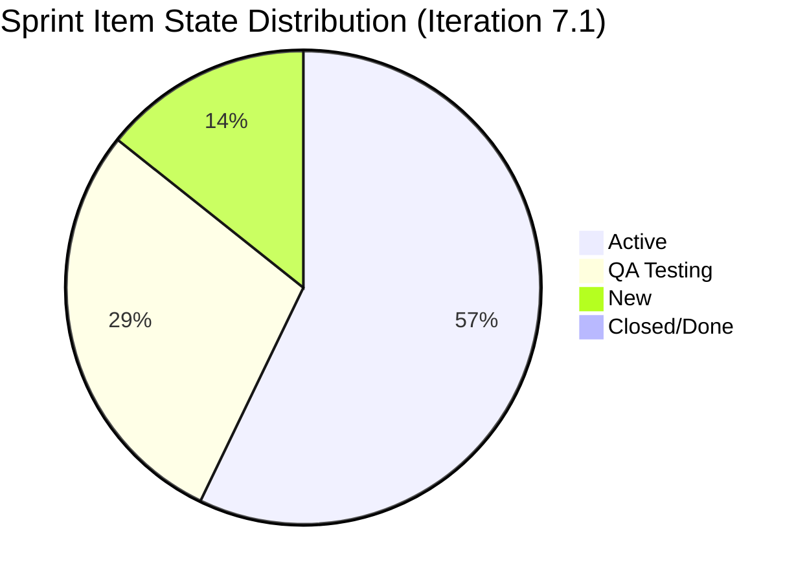
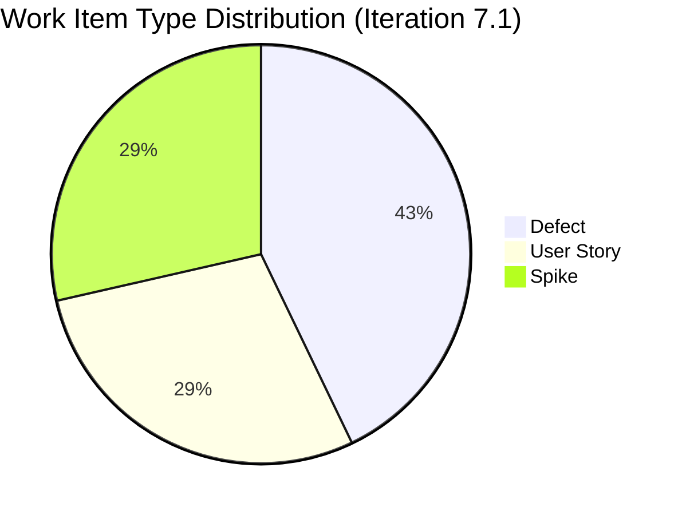
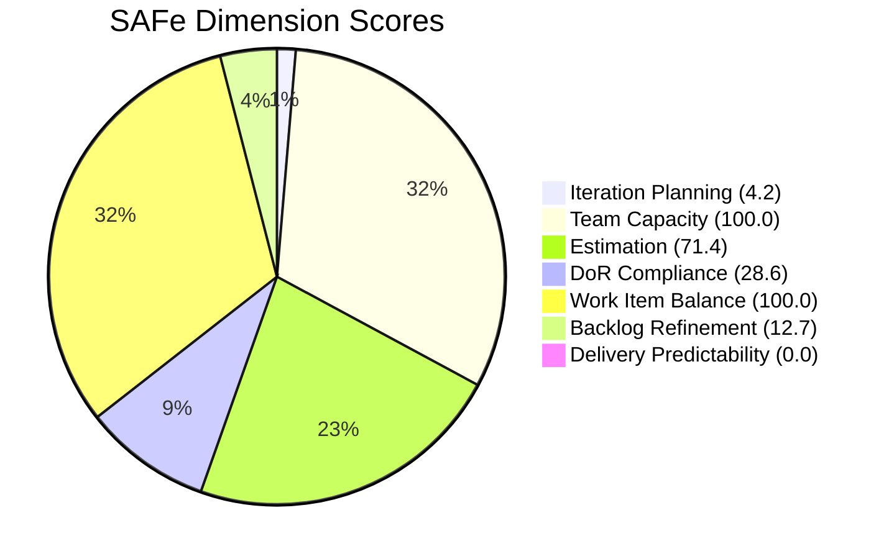

# ADO SAFe Iteration Audit — Flawless Wedding App Team
**Audit #28 | Iteration 7.1 (Apr 6–19, 2026) | Day 7 of 14 (50% elapsed)**

---

## 1. Audit Metadata

| Field | Value |
|---|---|
| **Audit Date** | April 12, 2026, 09:00 PHT |
| **Auditor** | Claude Code (ADO SAFe Audit Agent) |
| **Workspace** | `ado_fl_dev` |
| **ADO Project** | Flawless Wedding App (`92b967dc-5ec7-4874-b8f5-e43b00d88339`) |
| **Team** | Flawless Wedding App Team (`7d90ecbf-d272-4b0c-b33b-c66d96a790ac`) |
| **Iteration** | Iteration 7.1 — Apr 6 to Apr 19, 2026 |
| **Iteration ID** | `4b3e976b-ec9c-43bd-83ec-d9aec2199d30` |
| **Sprint Day** | Day 7 of 14 (midpoint) |
| **Prior Audit** | AUDIT_20260409_0900.md (Audit #27, Score 47.9 — High Risk) |
| **Scoring Model** | ADO SAFe v1 (7-dimension rubric) |

---

## 2. Executive Summary

The Flawless Wedding App Team scores **45.3 (High Risk)** — a marginal improvement from 47.9, but the team remains firmly in the High Risk band. The sprint scope has been dramatically right-sized: from 10 items (Day 4) to **7 items** this audit, all with appropriate type diversity (3 Defects, 2 User Stories, 2 Spikes). Ressa Paracuelles has returned from leave, restoring 4-person team capacity.

Despite these improvements, three chronic issues persist: (1) **Iteration Planning remains critically low at 4.2** — only 7 of 167 visible backlog items are in the current sprint; (2) **DoR compliance is 28.6%** — 5 of 7 sprint items lack compliant acceptance criteria or description; (3) **Backlog Refinement is 12.7** — 78 of 167 visible items (46.7%) are stale older than 90 days and 58+ items are stale older than 180 days. Delivery is at 0.0 SP closed of 10 SP committed at midpoint.

The core structural problem remains: a 167-item visible backlog with the majority stale, and a sprint pulling only 4.2% of that backlog into active work. The DoR failures on Defects and Spikes indicate the team is committing items without adequate specification. Backlog cleanup (Spike #202150 — Retro Backlog CleanUp) is itself in the sprint, which signals awareness but not yet resolution.

---

## 3. Previous Audit Delta

| Dimension | Day 4 (Apr 9) | Day 7 (Apr 12) | Delta |
|---|---|---|---|
| Iteration Planning | 6.1 | 4.2 | -1.9 |
| Team Capacity | 100.0 | 100.0 | 0.0 |
| Estimation | 80.0 | 71.4 | -8.6 |
| DoR Compliance | 20.0 | 28.6 | +8.6 |
| Work Item Balance | 100.0 | 100.0 | 0.0 |
| Backlog Refinement | 29.3 | 12.7 | -16.6 |
| Delivery Predictability | 0.0 | 0.0 | 0.0 |
| **Overall** | **47.9** | **45.3** | **-2.6** |

**Key changes since Day 4:**
- Sprint scope reduced from 10 items to 7 items (3 items removed from sprint — scope reduction is appropriate, but scoring reflects fewer items in smaller denominator for Iteration Planning)
- Visible backlog grew from 163 to **167 items** (+4 items) — worsening the IP ratio despite same sprint items
- Backlog Refinement declined: more items classified as stale with the April 8 mass-update that surfaced PI6 items; fresh/visible ratio dropped
- DoR improved slightly: #196989 and #201304 continue to pass, while the 2 Spikes now show minimal but non-compliant content
- Ressa returned from leave (confirmed via capacity — 3h/day Testing, with 1 day off Apr 9)
- Ike Yana remains absent from current sprint items (no 7.1 assignments visible)

---

## 4. Current Iteration Snapshot

| Metric | Value |
|---|---|
| **Visible root backlog items** | 167 |
| **Current sprint items (Iteration 7.1)** | 7 |
| **Items outside sprint** | 160 (distributed across PI4, PI5, PI6, PI7 general, PI7.2) |
| **Committed story points** | 10 SP (5 estimated items) |
| **Closed story points** | 0 SP |
| **Delivery rate at midpoint** | 0.0% (0 of 10 SP) |
| **Active items** | 4 |
| **QA Testing items** | 2 |
| **New items** | 1 |
| **Closed/Done items** | 0 |
| **Team capacity** | 11h/day total (Luke 6h Dev + Ressa 3h Testing + Luzmibel 1h Testing + Ike 1h Dev) |

### Sprint Item List (Iteration 7.1)

| ID | Title | Type | State | SP | DoR |
|---|---|---|---|---|---|
| 190065 | [Web][Booked Events] Blank page when downloading contract details | Defect | Active | 1 | FAIL (no AC) |
| 196989 | Login Flow Change - Question and Answer Flow | User Story | QA Testing | 2 | PASS |
| 200796 | [Web][Vendor] Inconsistent grand total in Payment Breakdown vs Revised Contract | Defect | Active | 2 | FAIL (no AC) |
| 201304 | 50% off for adding more than two islands | User Story | QA Testing | 3 | PASS |
| 201911 | [Web][Booked Events] Not able to load page | Defect | Active | 2 | FAIL (no AC) |
| 202150 | [Retro] Backlog CleanUp | Spike | New | 0 | FAIL (Desc < 30 nws) |
| 202381 | Iteration 7.1 - Collaborations, Reports & Others | Spike | Active | 0 | FAIL (Desc < 30 nws) |

**DoR Summary:** 2 of 7 pass (196989, 201304). 3 Defects lack Acceptance Criteria. 2 Spikes have minimal description and AC.

---

## 5. Work Item Analysis

### State Distribution



### Type Distribution (Current Sprint)



### Observations
- **2 items in QA Testing** (#196989 Login Flow, #201304 Island discount) — Ressa returned Apr 10 and should be processing these. These are the most likely closure candidates this sprint.
- **3 Defects Active with no AC** — Luke is working on real bugs but they are not DoR-compliant. AC should be added retroactively for the 3 defect items.
- **#202150 (Retro Backlog CleanUp Spike)** is in New state — no progress at midpoint. This is the most impactful backlog health action available; priority should increase.
- **#202381 (Iteration 7.1 - Collaborations, Spike)** is Active — this appears to be a ceremony/reporting spike rather than a deliverable; description is sparse.
- **Ike Yana** has no direct 7.1 assignments visible in the backlog query results, though capacity shows 1h/day development.
- Visible backlog grew to 167 — the April 8 batch timestamp update on PI6 items makes them appear "fresh" by ChangedDate but they are not truly groomed.

### Backlog Health Overview (All 167 Items)

| Category | Count | % of Total |
|---|---|---|
| Fresh (≥ Feb 26, 2026) | 88 | 52.7% |
| Middle zone (Jan 13 – Feb 25) | 1 | 0.6% |
| Stale (< Jan 13, 2026 / > 90 days) | 78 | 46.7% |
| Stale (< Oct 15, 2025 / > 180 days) | ~58 | ~34.7% |
| In current sprint | 7 | 4.2% |

---

## 6. SAFe Compliance Scorecard

| Dimension | Score | Evidence | Notes |
|---|---|---|---|
| Iteration Planning | 4.2 | 7 of 167 visible items in sprint | Critical. 160 items outside sprint scope. |
| Team Capacity | 100.0 | 4 members configured: Luke 6h Dev, Ressa 3h Test, Luzmibel 1h Test, Ike 1h Dev | Full team capacity configured. Ressa returned. |
| Estimation | 71.4 | 5/7 items have SP > 0; 2 Spikes unestimated | Spikes (#202150, #202381) carry 0 SP. |
| DoR Compliance | 28.6 | 2/7 items pass Desc (≥30 nws) + AC (≥20 nws) | 3 Defects: no AC. 2 Spikes: desc < 30 nws. |
| Work Item Balance | 100.0 | 3 Defects + 2 User Stories + 2 Spikes; US present; max type 42.9% ≤ 60%; Spike 28.6% ≤ 40% | No penalties triggered. Good diversity. |
| Backlog Refinement | 12.7 | 88/167 fresh (52.7%); 78/167 stale_90 (46.7% > 25% → -20); stale_180 ≥ 1 → -20; 0 untouched current | Severely penalized for stale backlog depth. |
| Delivery Predictability | 0.0 | 0 SP closed of 10 SP committed | No closures at midpoint. |
| **Overall** | **45.3** | | **High Risk** |

### Score Computation

```
Iteration Planning    = 7 / 167 × 100  = 4.2
Team Capacity         = 2 / 2 × 100    = 100.0   (Luke + Ressa have current work + capacity)
Estimation            = 5 / 7 × 100    = 71.4
DoR Compliance        = 2 / 7 × 100    = 28.6
Work Item Balance     = 100.0           (no penalties triggered)
Backlog Refinement:
  base = 88/167 × 100 = 52.7
  stale_90/167 = 46.7% > 25% → -20
  stale_180 ≥ 1 → -20
  untouched_current/current = 0/7 = 0% → no penalty
  score = 52.7 - 20 - 20 = 12.7
Delivery Predictability = 0 / 10 × 100 = 0.0

Overall = (4.2 + 100.0 + 71.4 + 28.6 + 100.0 + 12.7 + 0.0) / 7
        = 316.9 / 7 = 45.3   → High Risk
```



---

## 7. Dimension Findings

### 7.1 Iteration Planning — 4.2 (Critical)
Only 7 of 167 visible root items are in Iteration 7.1. The denominator continues to grow (163 → 167) while the sprint scope stayed constant. This dimension will remain Critical as long as the backlog holds 100+ stale items that are visible to the planning query. The path to improvement requires either (a) retiring/closing stale items from the backlog, or (b) significantly increasing sprint scope — neither of which is fully under team control without product owner engagement.

### 7.2 Team Capacity — 100.0 (Low Risk)
Full team capacity is configured: Luke Abram Colina (6h/day Development), Ressa Paracuelles (3h/day Testing, 1 day off Apr 9 — now returned), Luzmibel Paculanang (1h/day Testing, 2 days off Apr 9–10), Ike Yana (1h/day Development). Total: 11h/day. All contributors with current work have positive capacity. No capacity gaps.

### 7.3 Estimation — 71.4 (Moderate)
5 of 7 current items have Story Points: 190065 (1 SP), 196989 (2 SP), 200796 (2 SP), 201304 (3 SP), 201911 (2 SP). The 2 Spikes (#202150, #202381) have no SP assigned. Spikes are point-eligible but unestimated, consistent with prior audit findings. These Spikes should receive at least a nominal SP estimate (1 SP each for process/ceremony work) to improve this dimension.

### 7.4 DoR Compliance — 28.6 (Critical, Marginal Improvement)
**Passing:** #196989 (Login Flow — full user story format with detailed Given/When/Then AC), #201304 (Island Discount — extensive AC with multiple Given/When/Then scenarios).

**Failing:**
- **#190065** (Blank page download) — Description passes (~60 nws), but has NO Acceptance Criteria field populated → FAIL
- **#200796** (Inconsistent grand total) — Description passes (~30 nws: "A contract has been revised..."), but has NO AC field → FAIL
- **#201911** (Not able to load page) — Description passes (~35 nws: "The issue occurs when a vendor tries..."), but has NO AC field → FAIL
- **#202150** (Backlog CleanUp Spike) — Description: "Backlog CleanUp" (~13 nws) < 30 nws threshold → FAIL
- **#202381** (Collaborations Spike) — Description: "Reports and Iteration Team Events" (~29 nws) < 30 nws threshold → FAIL

All 3 Defects lack AC — a recurring pattern. Defects should have expected behavior/fix criteria documented as AC.

### 7.5 Work Item Balance — 100.0 (Low Risk)
Type distribution: Defect 3/7 (42.9%), User Story 2/7 (28.6%), Spike 2/7 (28.6%). User Stories are present (no -40). No type exceeds 60% (no -30). Spike share = 28.6% ≤ 40% (no -20). This is the team's strongest structural improvement — sprint mix is well diversified compared to prior iterations where Defects dominated at >80%.

### 7.6 Backlog Refinement — 12.7 (Critical)
The backlog health is severely degraded. Of 167 visible items:
- **88 items (52.7%) fresh** — many driven by the April 8 PI6 batch update (mass-touched by Carol Cuison/team but not substantively groomed)
- **78 items (46.7%) are stale_90** (changed before Jan 13, 2026) — substantially exceeds the 25% threshold, incurring the -20 penalty
- **~58 items (~34.7%) are stale_180** (changed before Oct 15, 2025) — the presence of any stale_180 item incurs -20

The large cluster of September 2025 items (many with "2025-09-09" changed dates) represents items that have never been substantively updated since logging — likely the legacy bug backlog from PI3/PI4 builds. Many of these are New/unassigned items with no Description or AC, and no active assignee.

**Note on April 8 batch update:** Approximately 40+ PI6 items show "2026-04-08" changed dates — this appears to be an iteration path re-assignment bulk operation, not genuine grooming. These items appear fresh by date but lack Description/AC.

### 7.7 Delivery Predictability — 0.0 (Critical)
Zero story points closed at Day 7. With 10 SP committed and 7 days remaining:
- #196989 and #201304 are in QA Testing — these are the most likely closure candidates (5 SP combined)
- Ressa's return means QA can actively process these 2 items
- If both close by Day 10, Delivery Predictability rises to 50.0
- Target: close #196989 (2 SP) + #201304 (3 SP) = 5 SP minimum by Day 12

---

## 8. Risks and Bottlenecks

| # | Risk | Severity | Impact |
|---|---|---|---|
| R1 | 167-item backlog with 46.7% stale (>90 days) | Critical | Backlog Refinement locked at ~12–15 range; Iteration Planning structural floor at ~4% |
| R2 | Zero SP delivered at midpoint | Critical | Delivery Predictability at 0.0; QA Testing items must close this week |
| R3 | 3 Defects in sprint with no Acceptance Criteria | High | DoR compliance structural failure; fixes unverifiable without AC |
| R4 | Iteration Planning critically low (4.2) | High | Product-level structural issue; requires PO engagement and backlog triage |
| R5 | ~58 items stale > 180 days (legacy PI3/PI4 bugs) | High | These items inflate backlog size and suppress all planning metrics |
| R6 | Backlog CleanUp Spike (#202150) in New state at midpoint | Moderate | The sprint's own cleanup task is not being worked; missed opportunity |
| R7 | Ike Yana (1h/day Dev) has no current sprint assignments | Low | Minimal capacity contributor — 1h/day impact limited but should be utilized |

---

## 9. Prioritized Recommendations

1. **Close #196989 and #201304 from QA Testing (P0 — Immediate):** Ressa returned on Apr 10. Both User Stories are in QA Testing (5 SP combined). Priority #1 is completing QA and closing these items. This will bring Delivery Predictability from 0.0 to 50.0 and significantly improve the next audit score.

2. **Add Acceptance Criteria to 3 sprint Defects (P1 — Immediate):** Items #190065, #200796, and #201911 need AC added to pass DoR. Even a brief "Expected: X. Verified via: Y" format with ≥20 nws is sufficient. Luke or Ressa should add AC before the next audit.

3. **Execute Backlog CleanUp Spike #202150 this week (P1 — Sprint week 2):** This Spike is in New state at midpoint. Ressa should lead a targeted backlog review session, focusing on the September 2025 cluster (items with 2025-09-09 dates). Target: close/retire 30+ items to reduce visible backlog and improve IP and Backlog Refinement scores next sprint.

4. **Retire legacy PI3/PI4 bugs (P1 — Ongoing):** The ~58 items stale >180 days (Sep–Oct 2025 vintage) need a disposition decision. Options: (a) close as Won't Fix, (b) move to a dedicated backlog cleanup iteration, (c) schedule for triage in Sprint Review. Even retiring 30 of these would reduce stale_180 impact and improve Backlog Refinement from 12.7 to approximately 35–40.

5. **Add Spike estimates (#202150, #202381) (P2 — This sprint):** Add 1 SP to each Spike to bring Estimation from 71.4 to 100.0 next audit. Ceremony Spikes should be estimable even if nominal.

6. **Increase Spike description length (#202150, #202381) (P2 — Immediate):** Both Spikes fail description threshold. #202150 needs ~20 more non-whitespace chars; #202381 needs minor expansion. Simple additions like listing expected outputs would pass the DoR check.

7. **Engage Product Owner on backlog triage authority (P2 — Next sprint planning):** Iteration Planning at 4.2 is a product decision, not just a development decision. PO must authorize bulk retirement of stale items to reduce visible backlog from 167 toward a manageable 40–60.

8. **Assign Ike Yana to a sprint item (P3 — Immediate):** Ike has 1h/day Dev capacity and no current sprint assignments. Assign a small defect or task to his name to ensure capacity is tracked and utilized.

---

## 10. Evidence Gaps and Limitations

| Gap | Description |
|---|---|
| April 8 batch update semantics | ~40 PI6 items show Apr 8 ChangedDate — appears to be a bulk iteration path update, not actual grooming. Fresh count (88) may be inflated by this operation. |
| Backlog item types with no assignee | ~30+ items in the visible backlog have no AssignedTo value — ownership is unclear and they cannot be planned without assignment |
| 167 items require 3 batch API calls | Full data was retrieved; however, Description and AC for backlog items outside the sprint were not individually verified — DoR scoring applied only to current sprint items per scoring rules |
| Ike Yana sprint allocation | Ike appears in capacity (1h/day) but has no 7.1-assigned items in the backlog query. He may have task-level assignments not visible at root item level. |
| Luzmibel Paculanang | Luzmibel has 1h/day Testing capacity with 2 days off (Apr 9–10) but no 7.1-assigned root items visible. Similar to Ike, may have task assignments. |
| stale_180 exact count | Exact count of stale_180 items estimated at ~58 based on Sept–Oct 2025 change dates across all batches. Actual number may differ by ±2 items. |

---

*Report generated by Claude Code ADO SAFe Audit Agent | April 12, 2026 09:00 PHT*
