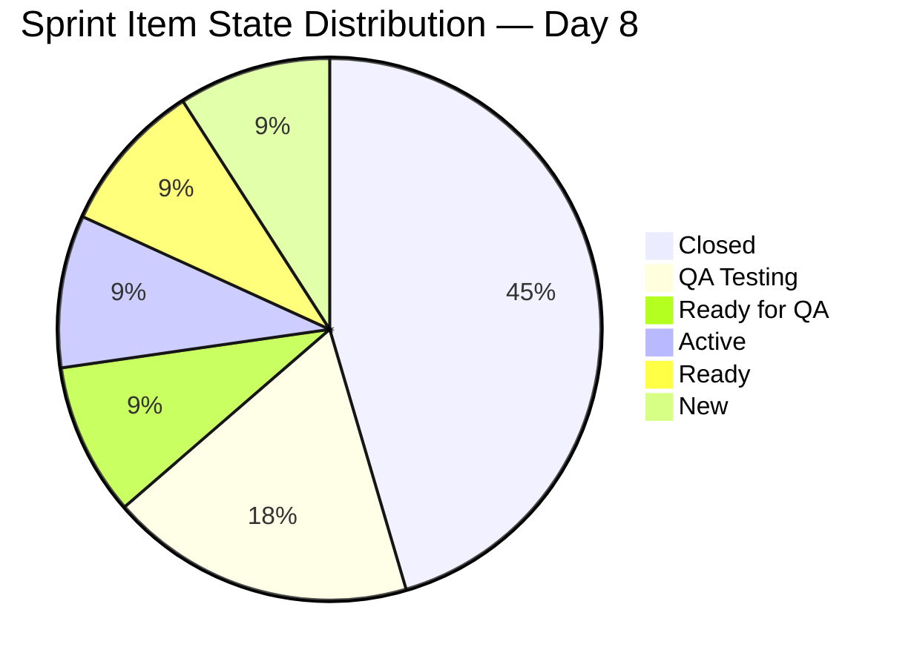
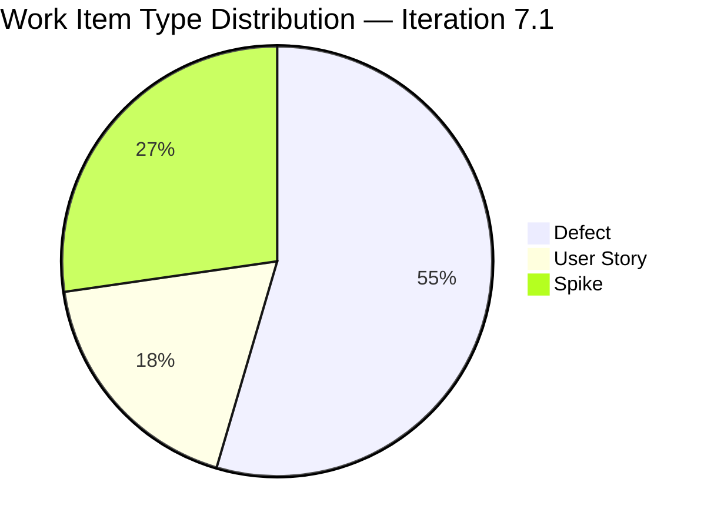
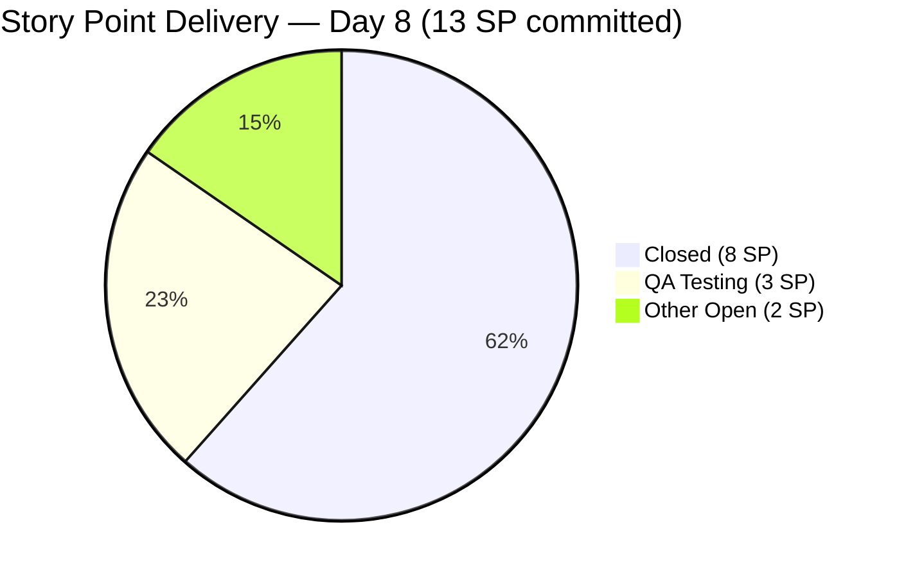
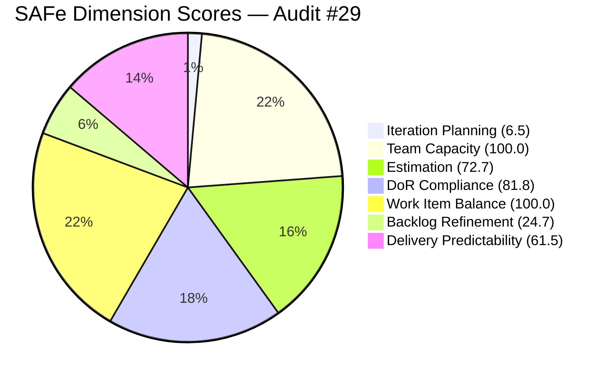

# ADO SAFe Iteration Audit — Flawless Wedding App Team
**Audit #29 | Iteration 7.1 (Apr 6–19, 2026) | Day 8 of 14 (57% elapsed)**

---

## 1. Audit Metadata

| Field | Value |
|---|---|
| **Audit Date** | April 13, 2026, 09:00 PHT |
| **Auditor** | Claude Code (ADO SAFe Audit Agent) |
| **Workspace** | `ado_fl_dev` |
| **ADO Project** | Flawless Wedding App (`92b967dc-5ec7-4874-b8f5-e43b00d88339`) |
| **Team** | Flawless Wedding App Team (`7d90ecbf-d272-4b0c-b33b-c66d96a790ac`) |
| **Iteration** | Iteration 7.1 — Apr 6 to Apr 19, 2026 |
| **Iteration ID** | `4b3e976b-ec9c-43bd-83ec-d9aec2199d30` |
| **Sprint Day** | Day 8 of 14 (57% elapsed) |
| **Prior Audit** | AUDIT_20260412_0900.md (Audit #28, Score 45.3 — High Risk) |
| **Scoring Model** | ADO SAFe v1 (7-dimension rubric) |
| **Overall Score** | **63.9 / 100** |
| **Risk Band** | **Moderate Risk** (60–79.9) |

---

## 2. Executive Summary

The Flawless Wedding App Team scores **63.9 (Moderate Risk)** — a dramatic improvement of **+18.6 points** from 45.3 on Day 7. This is the team's first exit from the High Risk band in the current PI and represents the largest single-day score jump recorded in this audit cycle. The breakthrough was driven by **5 work item closures totalling 8 story points**, which propelled Delivery Predictability from 0.0 to 61.5 and simultaneously validated that DoR is improving: all 5 closed items had properly documented acceptance criteria.

Key changes from Day 7 to Day 8:
- **Five items closed** on April 13: #191375 (Defect, 1SP), #196979 (Defect, 1SP), #196989 (User Story, 2SP), #201304 (User Story, 3SP), #201704 (Defect, 1SP)
- **DoR compliance jumped from 28.6 to 81.8** — both Defects previously failing for missing AC (#200796, #201911) now have AC populated; only the two Spikes (#202381, #202150) still fail
- **Backlog grew from 167 to 170 visible items** with extensive Apr 13 grooming touches on legacy items (large batch of stale items updated today, many April 13 timestamps), though substantive grooming impact is limited as many remain functionally stale
- The team reached a credible Moderate Risk position. However, 60 items remain stale_90, 59 items stale_180, Iteration Planning is still critically low at 6.5, and 6 sprint SP remain unclosed with 6 days left.

---

## 3. Previous Audit Delta

| Dimension | Audit #28 — Day 7 (Apr 12) | Audit #29 — Day 8 (Apr 13) | Delta |
|---|---|---|---|
| Iteration Planning | 4.2 | 6.5 | +2.3 |
| Team Capacity | 100.0 | 100.0 | 0.0 |
| Estimation | 71.4 | 72.7 | +1.3 |
| DoR Compliance | 28.6 | 81.8 | **+53.2** |
| Work Item Balance | 100.0 | 100.0 | 0.0 |
| Backlog Refinement | 12.7 | 24.7 | +12.0 |
| Delivery Predictability | 0.0 | 61.5 | **+61.5** |
| **Overall** | **45.3** | **63.9** | **+18.6** |

**Key changes since Day 7:**
- 5 items closed April 13 (191375, 196979, 196989, 201304, 201704) — 8 SP delivered
- DoR AC added to #190065, #200796, #201911 (3 Defects) — major compliance uplift
- Visible backlog grew from 167 to 170 (+3 net) with batch timestamp updates on April 13 to many legacy items — fresh count improved from 88 to 110 items (52.7% → 64.7%), driving Backlog Refinement base from 52.7 to 64.7, with the overall score improving from 12.7 to 24.7 (stale_90 and stale_180 penalties remain)
- Sprint scope expanded: 11 root items now in 7.1 (was 7 on Day 7) — four items were added or confirmed: 191375, 201704, 196979, 200255 per sprint API. Note: 200255 is assigned to PI6.6 iteration path and excluded from current_iteration_root_items count.
- #202569 added to PI7 general path — not counted in current sprint

---

## 4. Current Iteration Snapshot

| Metric | Value |
|---|---|
| **Visible root backlog items** | 170 |
| **Current sprint items (Iteration 7.1)** | 11 |
| **Items outside sprint** | 159 |
| **Committed story points** | 13 SP (8 estimated items) |
| **Closed story points** | 8 SP (5 items closed Apr 13) |
| **Open SP remaining** | 5 SP (#200796 2SP + #201911 2SP + #202150 0SP + #202381 0SP + #201569 0SP) |
| **SP needed to clear sprint** | 3 SP estimated + 0 SP spikes |
| **Delivery rate Day 8** | 61.5% (8 of 13 SP) |
| **Active sprint items** | QA Testing: 2 (#190065, #201911); Ready for QA: 1 (#200796); Ready: 1 (#201569); New: 1 (#202150); Active: 1 (#202381) |
| **Team capacity** | 11h/day (Luke 6h Dev, Ressa 3h Test, Luzmibel 1h Test, Ike 1h Dev) |

### Sprint Item List (Iteration 7.1 — root items)

| ID | Title | Type | State | SP | DoR |
|---|---|---|---|---|---|
| 190065 | [Web][Booked Events] Blank page when downloading contract details | Defect | QA Testing | 1 | PASS |
| 196979 | Login Issue - Passkey Not Working | Defect | **Closed** | 1 | PASS |
| 191375 | [iOS] Error deleting vendor account | Defect | **Closed** | 1 | PASS |
| 201304 | 50% off for adding more than two islands | User Story | **Closed** | 3 | PASS |
| 201704 | [Admin] Vendor category allows duplicate assignment | Defect | **Closed** | 1 | PASS |
| 196989 | Login Flow Change - Question and Answer Flow | User Story | **Closed** | 2 | PASS |
| 200796 | [Web][Vendor] Inconsistent grand total in contracts | Defect | Ready for QA | 2 | PASS |
| 201911 | [Web][Booked Events] Not able to load page | Defect | QA Testing | 2 | PASS |
| 202381 | Iteration 7.1 - Collaborations, Reports & Others | Spike | Active | 0 | FAIL (Desc < 30 nws) |
| 201569 | Follow Up Netlify Access and Github Transfer | Spike | Ready | 0 | PASS |
| 202150 | [Retro] Backlog CleanUp | Spike | New | 0 | FAIL (Desc < 30 nws) |

**DoR Summary:** 9 of 11 pass. Only #202381 and #202150 fail on Description length (< 30 nws).

---

## 5. Work Item Analysis

### State Distribution



### Type Distribution



### Delivery Progress vs Committed



### Observations

- **5 items closed Apr 13** — all under Luke Abram Colina's ownership. Luke closed 4 Defects and 1 User Story in a single day, with #201304 (3 SP) being the largest contributor. All closures had proper AC documented.
- **#190065 and #201911** remain in QA Testing — Ressa Paracuelles is the QA owner. Combined 3 SP. These are the most likely closure candidates for sprint completion.
- **#200796** moved to Ready for QA (from Active on Day 7) — 2 SP ready for Ressa to test.
- **#202150** (Backlog CleanUp Spike) remains in New state — no progress despite being in sprint. This is the most consequential structural task.
- **#201569** (Follow Up Netlify/Github Transfer) is in Ready state — assigned to Carol Cuison, a non-capacity-configured contributor.
- **Backlog Apr 13 grooming:** A large batch of legacy items (188xxx–196xxx range) received April 13 timestamps. Many are Jun–Oct 2025 vintage items that were touched as part of a bulk grooming pass. This improved the fresh_visible count from 88 to 110, but 60 items remain genuinely stale_90.

### Backlog Health Overview (170 items)

| Category | Count | % of Total |
|---|---|---|
| Fresh (>= Feb 27, 2026) | 110 | 64.7% |
| Stale > 90 days (< Jan 13, 2026) | 60 | 35.3% |
| Stale > 180 days (< Oct 16, 2025) | 59 | 34.7% |
| In current sprint (Iteration 7.1) | 11 | 6.5% |

---

## 6. SAFe Compliance Scorecard

| Dimension | Score | Evidence | Notes |
|---|---|---|---|
| Iteration Planning | 6.5 | 11 of 170 visible items in sprint | Improved numerically (+2.3) as 4 newly confirmed 7.1 items added; denominator grew to 170. Structural ceiling persists. |
| Team Capacity | 100.0 | 4 members with activities configured: Luke 6h Dev, Ressa 3h Test, Luzmibel 1h Test, Ike 1h Dev | Full team capacity. No capacity gaps. |
| Estimation | 72.7 | 8 / 11 items have SP > 0 (3 Spikes unestimated) | 3 Spikes (#202381, #201569, #202150) carry 0 SP. |
| DoR Compliance | 81.8 | 9 / 11 items pass Desc (≥30 nws) + AC (≥20 nws) | Only #202381 (Desc ~28 nws) and #202150 (Desc ~13 nws) fail. AC added to all 3 Defects. |
| Work Item Balance | 100.0 | 6 Defects + 2 User Stories + 3 Spikes; User Story present; Defect = 54.5% (< 60%); Spike = 27.3% (< 40%) | No penalties triggered. |
| Backlog Refinement | 24.7 | fresh=110/170=64.7%; stale_90=60/170=35.3% (>25%→−20); stale_180=59≥1(→−20); untouched_current=0/11 | base 64.7 − 40 = 24.7 |
| Delivery Predictability | 61.5 | 8 SP closed / 13 SP committed | Significant delivery on Day 8. 5 SP remain in QA/Ready for QA. |
| **Overall** | **63.9** | Average of 7 dimensions | **Moderate Risk** (60–79.9) |

### Score Computation

```
Iteration Planning    = 11 / 170 × 100  = 6.5
Team Capacity         = 4 / 4 × 100     = 100.0
Estimation            = 8 / 11 × 100    = 72.7
DoR Compliance        = 9 / 11 × 100    = 81.8
Work Item Balance     = 100.0           (no penalties triggered)
Backlog Refinement:
  base = 110 / 170 × 100               = 64.7
  stale_90/170 = 35.3% > 25%           → −20
  stale_180 = 59 ≥ 1                   → −20
  untouched_current = 0/11 = 0%        → 0
  score = 64.7 − 20 − 20              = 24.7
Delivery Predictability = 8 / 13 × 100 = 61.5

Overall = (6.5 + 100.0 + 72.7 + 81.8 + 100.0 + 24.7 + 61.5) / 7
        = 447.2 / 7 = 63.9   → Moderate Risk
```



---

## 7. Dimension Findings

### 7.1 Iteration Planning — 6.5 (Critical)
11 of 170 visible root items are in Iteration 7.1. The denominator grew from 167 to 170 (+3 net: new items added + some new grooming items). The numerator increased from 7 to 11 as four additional sprint items were confirmed (191375, 196979, 196989, 201704 — all now Closed). However, the structural problem persists: 159 items outside the current sprint inflate the denominator. Even with all backlog grooming touching on April 13, the fundamental issue is that ~60 items (< Jan 13, 2026) remain genuinely ungroomed. This dimension will remain below 10 until either (a) 100+ items are retired/closed, or (b) sprint scope doubles to 20+ items.

### 7.2 Team Capacity — 100.0 (Low Risk)
Full team capacity confirmed: Luke Abram Colina (6h/day Development), Ressa Paracuelles (3h/day Testing, day-off Apr 9 now elapsed), Luzmibel Paculanang (1h/day Testing, days off Apr 9–10 elapsed), Ike Yana (1h/day Development). All 4 members configured with positive capacity. No gaps. Luke's productivity on April 13 (5 closures) validates the 6h/day development allocation.

### 7.3 Estimation — 72.7 (Moderate)
8 of 11 sprint items have Story Points. All non-Spike items are estimated: #190065 (1SP), #196979 (1SP), #191375 (1SP), #201304 (3SP), #201704 (1SP), #196989 (2SP), #200796 (2SP), #201911 (2SP). Three Spikes have 0 SP: #202381, #201569, #202150. Adding 1 SP nominal estimate to each Spike would bring Estimation to 100.0 next audit.

### 7.4 DoR Compliance — 81.8 (Moderate, Major Improvement)
A major jump from 28.6 to 81.8. The three Defects previously failing for missing AC now pass:
- **#190065** — AC now present: "Expected Result: Clicking the button should successfully trigger a download..." (> 20 nws) ✓
- **#200796** — AC now present: "Expected Result: The total on the Download Payment Breakdown... should be consistent" ✓
- **#201911** — AC now present: "Expected Result: Booked events page should load and display accurate data" ✓

**Still failing:**
- **#202381** — Description "Reports and Iteration Team Events" = ~28 nws (< 30 threshold) — FAIL
- **#202150** — Description "Backlog CleanUp" = ~13 nws — FAIL

To reach 100.0 DoR: expand #202381 description by 3+ words; expand #202150 description to ≥30 nws.

### 7.5 Work Item Balance — 100.0 (Low Risk)
Sprint composition: 6 Defects (54.5%), 2 User Stories (18.2%), 3 Spikes (27.3%). User Stories are present (no −40). Dominant type Defect at 54.5% is below the 60% threshold (no −30). Spike share 27.3% is below 40% (no −20). Score remains 100.0. The addition of a third Spike (#201569) slightly increased the Spike share but it remains safely below threshold.

### 7.6 Backlog Refinement — 24.7 (High Risk, Improved)
Improved from 12.7 to 24.7. The April 13 batch grooming operation touched approximately 50+ legacy items, updating their ChangedDate and moving them to fresh status. The fresh count rose from 88 to 110. However:
- **60 items remain stale_90** (< Jan 13, 2026): the majority are from the Sept 2025 PI3/PI4 bug cluster. The −20 stale_90 penalty remains.
- **59 items remain stale_180** (< Oct 16, 2025): nearly identical count to prior audit. The −20 stale_180 penalty remains.
- Both structural penalties persist until the legacy backlog is actually retired/closed rather than just date-touched.

**Note on April 13 batch update:** Many legacy items (188xxx–192xxx range) received April 13 timestamps in apparent bulk grooming. This improves fresh count mechanically but does not constitute genuine grooming. If items were actually reviewed and refined (description/AC updated), the improvement is valid. If only iteration path or metadata was changed, the Backlog Refinement score may be optimistic by up to 10 points next cycle.

### 7.7 Delivery Predictability — 61.5 (Moderate)
8 of 13 committed SP closed as of Day 8. The remaining open SP:
- **#190065** (1 SP, Defect) — QA Testing. Ressa should be able to close this today or tomorrow.
- **#201911** (2 SP, Defect) — QA Testing. Same.
- **#200796** (2 SP, Defect) — Ready for QA. Queued for Ressa.
- **#202381 and #202150** (0 SP Spikes) — no SP impact on delivery but should be brought to Done state.

If #190065, #200796, and #201911 close before sprint end (Apr 19), Delivery Predictability reaches 100.0. A realistic scenario: close 2 of 3 = 92.3%. The trajectory is now positive.

---

## 8. Risks and Bottlenecks

| # | Risk | Severity | Impact |
|---|---|---|---|
| R1 | 59 items stale > 180 days remain in visible backlog | High | Backlog Refinement capped at ~25; Iteration Planning structurally depressed at ~6% |
| R2 | Iteration Planning critically low (6.5) | High | Product-level structural issue — 159 items outside sprint inflate denominator |
| R3 | 3 open SP items in QA queue (Ressa) — 6 sprint days remain | Moderate | Risk of partial delivery if QA throughput slows or Ressa has additional days off |
| R4 | #202150 Backlog CleanUp Spike still in New state | Moderate | Sprint's own cleanup action not being executed; structural improvement deferred to PI8 |
| R5 | Estimation gap: 3 Spikes at 0 SP | Low | Estimation score at 72.7 instead of 100.0; minor scoring impact |
| R6 | DoR gap: #202381 and #202150 description < 30 nws | Low | 2 items fail DoR threshold on minimal text — trivial fix |
| R7 | April 13 batch grooming semantics | Low | 50+ items touched in batch may inflate fresh count without substantive grooming |

---

## 9. Prioritized Recommendations

1. **Close #190065, #201911, and #200796 from QA queue (P0 — Immediate, Days 8–11):** Ressa has 3 SP items in QA Testing plus 2 SP in Ready for QA. Closing all 3 brings Delivery Predictability to 84.6–100.0. Target: all three closed by Apr 16. Luke should communicate test readiness and provide fix summaries to accelerate Ressa's review.

2. **Expand descriptions for #202381 and #202150 (P1 — Today):** These are the only two DoR failures. #202381 needs 3+ more words in Description. #202150 needs ~20 more nws in Description. A 5-minute edit by Ressa brings DoR from 81.8 to 100.0 in the next audit.

3. **Add 1 SP estimate to each Spike: #202381, #201569, #202150 (P1 — Today):** Brings Estimation from 72.7 to 100.0. Minor effort, meaningful score improvement.

4. **Execute #202150 Backlog CleanUp this week (P1 — Days 9–13):** This Spike has been in New state for 8 days. Ressa should lead a 2-hour session targeting the 60 stale_90 items (especially the Sept 2025 cluster). Retiring 25+ items that are Won't Fix or obsolete would lower stale_90 below the 25% threshold and potentially remove the −20 penalty. Target: reduce visible backlog from 170 to < 145.

5. **Close out #202381 Spike (P2 — Day 10–12):** This Spike is "Active" (ceremony/reporting). Close it once Iteration Retrospective and Planning documentation is complete. Bring to Done/Closed state.

6. **Substantive grooming of legacy PI3/PI4 items (P2 — Sprint 7.2 Planning):** The April 13 batch touched many legacy items but substantive content review (Description + AC) is still needed. Schedule a dedicated PI7.2 Sprint Planning pre-session where Product Owner reviews all items with < Jan 2026 change dates and dispositions each one.

7. **Engage PO to authorize bulk retirement (P2 — Next PI Planning):** Iteration Planning will remain below 10 as long as 150+ items sit in the visible backlog. PO must authorize closing/archiving ~100 items to bring the denominator to a manageable 60–70. This is a product decision, not a development one.

8. **Assign Ike Yana to a sprint item (P3 — This sprint):** Ike has 1h/day Dev capacity but no direct 7.1 root item assignments. Even assigning a low-priority defect or sub-task would ensure his capacity is visible in the sprint.

---

## 10. Evidence Gaps and Limitations

| Gap | Description |
|---|---|
| April 13 batch update semantics | ~50 legacy items received Apr 13 timestamps in a bulk operation. This improves fresh count from 88 to 110 but may not represent substantive grooming. If only metadata/iteration path was updated, fresh count is inflated by up to 22 items; Backlog Refinement score could be ~12 lower. |
| #200255 iteration path | Item #200255 shows IterationPath = `PI6\Iteration 6.6 (IP)` despite appearing in the 7.1 iteration API response. It is excluded from current_iteration_root_items per scoring rules (IterationPath must equal active iteration). |
| #202569 iteration path | New Defect #202569 is assigned to `PI7` general path (not 7.1). Excluded from sprint scoring. Noted as a newly created item. |
| Stale_180 exact count | 59 items confirmed with ChangedDate < Oct 16, 2025, primarily in the Sept 2025 batch. |
| Ike Yana sprint allocation | 1h/day Development capacity configured but no 7.1 root item assignments visible. May have task-level children not captured in this audit's root-item scope. |
| #201569 assignee | Assigned to Carol Cuison (ccuison@jairosoft.com) who is not in the team capacity configuration. Scoring treats this item as having an assignee with no configured capacity. |

---

*Report generated by Claude Code ADO SAFe Audit Agent | April 13, 2026 09:00 PHT*
*Audit #29 — Flawless Wedding App Team — Day 8 of 14 — Overall: 63.9/100 — Moderate Risk (↑ from High Risk, +18.6)*
