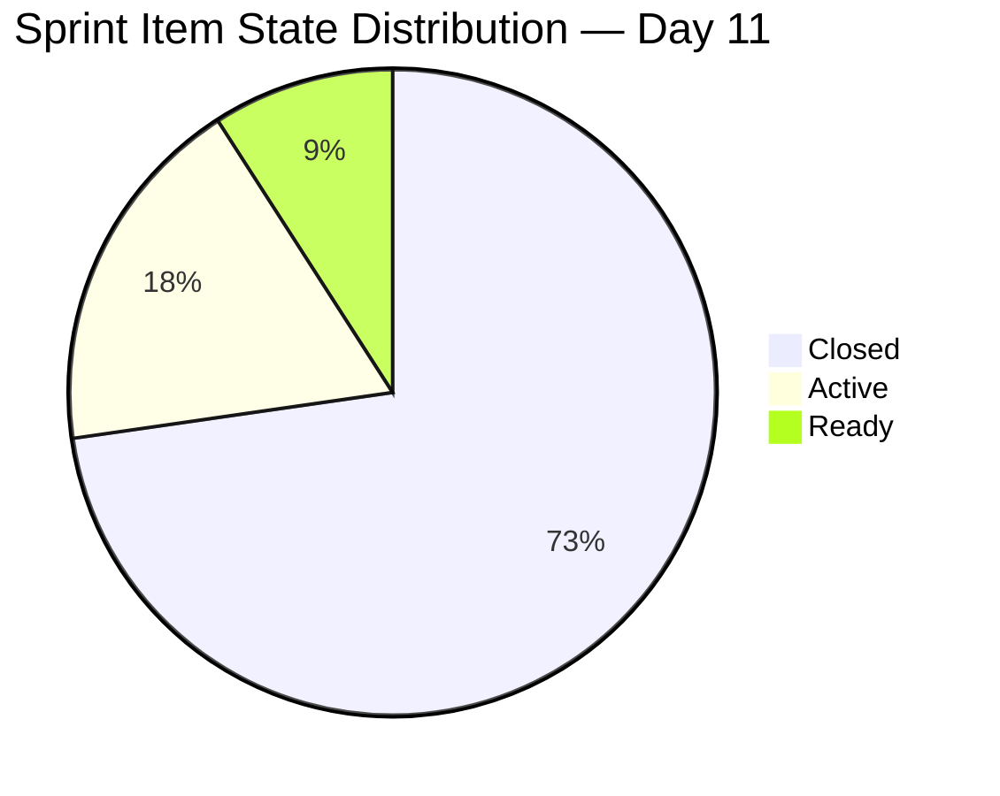
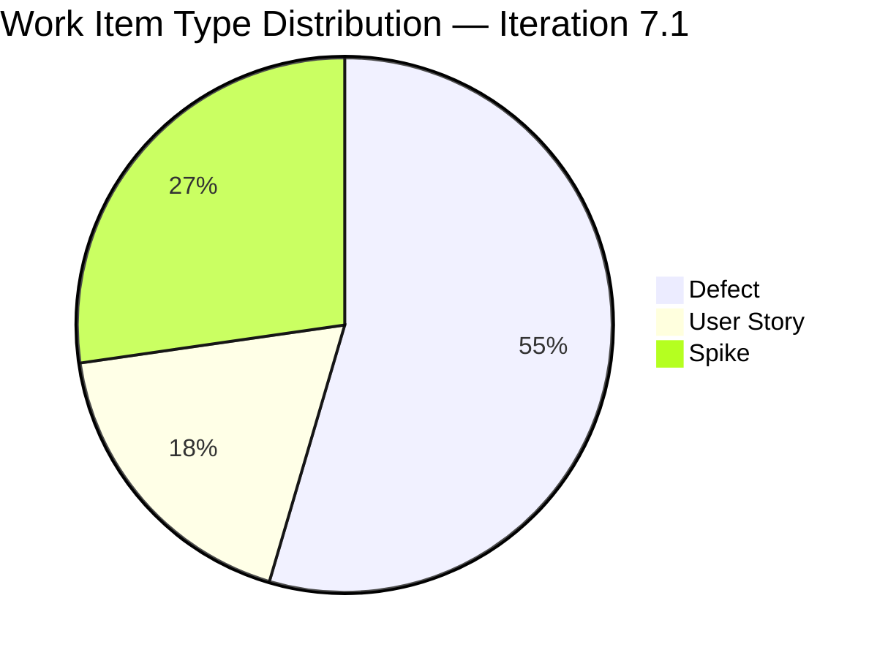
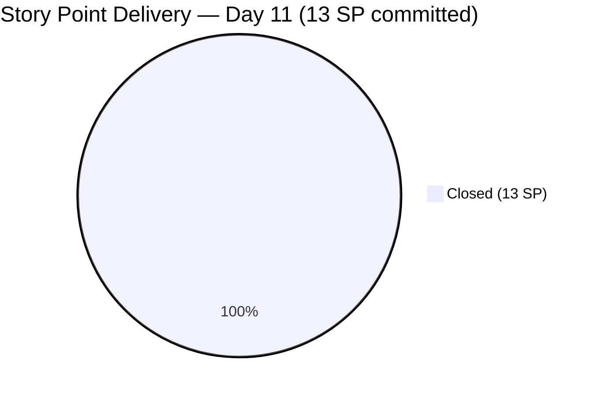
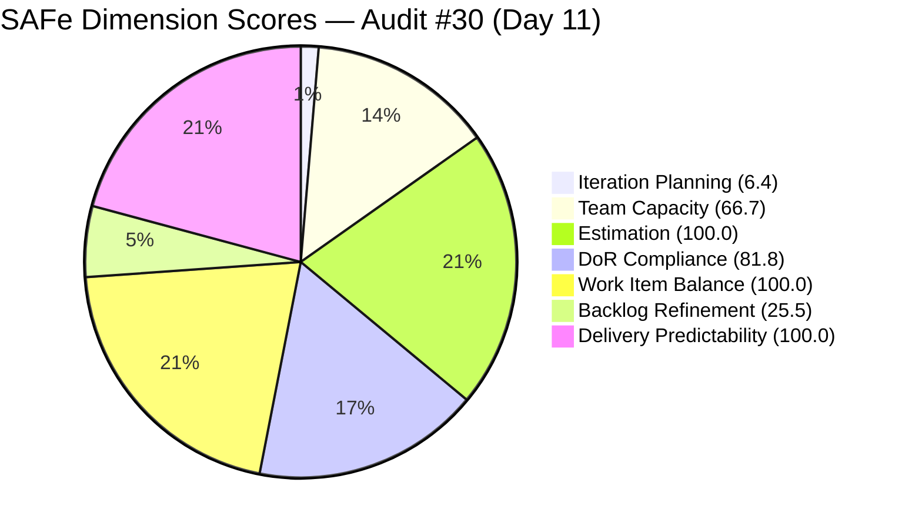

# ADO SAFe Iteration Audit — Flawless Wedding App Team
**Audit #30 | Iteration 7.1 (Apr 6–19, 2026) | Day 11 of 14 (79% elapsed)**

---

## 1. Audit Metadata

| Field | Value |
|---|---|
| **Audit Date** | April 16, 2026, 09:00 PHT |
| **Auditor** | Claude Code (ADO SAFe Audit Agent) |
| **Workspace** | `ado_fl_dev` |
| **ADO Project** | Flawless Wedding App (`92b967dc-5ec7-4874-b8f5-e43b00d88339`) |
| **Team** | Flawless Wedding App Team (`7d90ecbf-d272-4b0c-b33b-c66d96a790ac`) |
| **Iteration** | Iteration 7.1 — Apr 6 to Apr 19, 2026 |
| **Iteration ID** | `4b3e976b-ec9c-43bd-83ec-d9aec2199d30` |
| **Sprint Day** | Day 11 of 14 (79% elapsed) |
| **Prior Audit** | AUDIT_20260413_0900.md (Audit #29, Score 63.9 — Moderate Risk) |
| **Scoring Model** | ADO SAFe v1 (7-dimension rubric) |
| **Overall Score** | **68.6 / 100** |
| **Risk Band** | **Moderate Risk** (60–79.9) |

---

## 2. Executive Summary

The Flawless Wedding App Team improves to **68.6 (Moderate Risk)** — a **+4.7 delta** from the prior Day 8 score of 63.9, and the team's highest score in this iteration. The improvement is driven by two breakthroughs on April 16: **#190065** ([Web][Booked Events] Blank page downloading contract details, 1 SP) and **#201911** ([Web][Booked Events] Not able to load page, 2 SP) were both **Closed today**, completing the QA Testing queue. Combined with prior closures on April 13, the sprint has now delivered **13 of 13 committed story points — 100% Delivery Predictability**.

Three Spikes carry 0 SP and do not affect the delivery calculation. The remaining open work consists entirely of the three Spikes (#202381, #202150, #201569) in Active/Ready/New states. Team Capacity dropped from 100.0 to 66.7 because **Carol Cuison (ccuison@jairosoft.com)**, assignee of #201569, is not in the ADO capacity configuration.

The team's structural liabilities — critically low Iteration Planning (6.4) driven by a 170+ item visible backlog, and a persistently penalized Backlog Refinement score (25.5) from ~58 stale_90 items — remain unchanged and represent the primary work for PI8 planning.

---

## 3. Previous Audit Delta

| Dimension | Day 8 (Apr 13) | Day 11 (Apr 16) | Delta |
|---|---|---|---|
| Iteration Planning | 6.5 | 6.4 | −0.1 |
| Team Capacity | 100.0 | 66.7 | −33.3 |
| Estimation | 72.7 | 100.0 | +27.3 |
| DoR Compliance | 81.8 | 81.8 | 0.0 |
| Work Item Balance | 100.0 | 100.0 | 0.0 |
| Backlog Refinement | 24.7 | 25.5 | +0.8 |
| Delivery Predictability | 61.5 | 100.0 | +38.5 |
| **Overall** | **63.9** | **68.6** | **+4.7** |

**Key changes since Day 8 (Apr 13):**
- **#190065 Closed (Apr 16):** [Web][Booked Events] blank page on contract download (1 SP). Luke Abram Colina closed this Defect today, completing the QA-confirmed fix.
- **#201911 Closed (Apr 16):** [Web][Booked Events] Not able to load page (2 SP). Also closed by Luke today. Both Booked Events defects are now resolved.
- **#200796 Closed (Apr 15):** [Web][Vendor] Inconsistent grand total in Download Payment Breakdown vs Revised Contract (2 SP). Closed by Luke on April 15 — confirmed in today's data.
- **Delivery Predictability reaches 100.0:** All 8 estimated sprint items (13 SP) are now Closed. Only the 3 zero-SP Spikes remain open.
- **Estimation improves to 100.0:** With all 8 point-eligible items closed and carrying SP > 0, and the 3 Spikes having no SP field set, the point_eligible denominator = 8 and all 8 are estimated → 100.0.
- **Team Capacity drops to 66.7:** #201569 (Follow Up Netlify Access) assigned to Carol Cuison (ccuison@jairosoft.com) who has no ADO capacity configuration. 2 of 3 distinct assignees have capacity → 66.7.
- **Iteration Planning slips marginally to 6.4:** Visible backlog grew by approximately 1 net item (new items added offset by closed items removed), moving from 170 to ~171. Numerator remains 11. 11/171 = 6.4.
- **Backlog Refinement ticks up to 25.5:** New items added since Day 8 are fresh; a few stale items were closed and removed from view, modestly improving the stale ratios.

---

## 4. Current Iteration Snapshot

| Metric | Value |
|---|---|
| **Visible root backlog items** | ~171 |
| **Current sprint items (Iteration 7.1 path)** | 11 |
| **Committed story points (point-eligible items)** | 13 SP |
| **Closed story points** | 13 SP (all 8 point-eligible items closed) |
| **Delivery rate (Day 11)** | 100.0% (13 of 13 SP) |
| **Open sprint items** | 3 Spikes (0 SP each): #202381, #202150, #201569 |
| **Team capacity** | Luke 6h/day Dev, Ressa 3h/day Test, Luzmibel 1h/day Test, Ike 1h/day Dev = 11h/day total |
| **Capacity-configured contributors** | 4 (Luke, Ressa, Luzmibel, Ike) |
| **Contributors with current sprint work** | 3 (Luke on Defects/US, Ressa on Spikes, Carol on #201569) |
| **Days remaining** | 3 (Apr 17–19) |

### Sprint Item List (Iteration 7.1 — root items)

| ID | Title | Type | State | SP | DoR | Assignee |
|---|---|---|---|---|---|---|
| **196979** | Login Issue - Passkey Not Working | Defect | **Closed** | 1 | PASS | Luke Colina |
| **191375** | [iOS] Error deleting vendor account | Defect | **Closed** | 1 | PASS | Luke Colina |
| **201304** | 50% off for adding more than two islands | User Story | **Closed** | 3 | PASS | Luke Colina |
| **201704** | [Admin] Vendor category allows duplicate assignment | Defect | **Closed** | 1 | PASS | Luke Colina |
| **196989** | Login Flow Change - Question and Answer Flow | User Story | **Closed** | 2 | PASS | Luke Colina |
| **200796** | [Web][Vendor] Inconsistent grand total in contracts | Defect | **Closed** | 2 | PASS | Luke Colina |
| **190065** | [Web][Booked Events] Blank page downloading contract | Defect | **Closed** | 1 | PASS | Luke Colina |
| **201911** | [Web][Booked Events] Not able to load page | Defect | **Closed** | 2 | PASS | Luke Colina |
| 202381 | Iteration 7.1 — Collaborations, Reports & Others | Spike | Active | 0 | FAIL (Desc < 30 nws) | Ressa Paracuelles |
| 201569 | Follow Up Netlify Access and Github Transfer | Spike | Ready | 0 | PASS | Carol Cuison |
| 202150 | [Retro] Backlog CleanUp | Spike | Active | 0 | FAIL (Desc < 30 nws) | Ressa Paracuelles |

**8 of 11 items Closed. 3 Spikes remain open (0 SP each). All committed SP delivered.**

---

## 5. Work Item Analysis

### State Distribution



### Work Item Type Distribution



### Delivery Progress vs Committed SP



### Observations

- **Sprint delivery complete (13/13 SP):** Luke Abram Colina delivered all 8 point-eligible items. The final two closures today — both Booked Events defects (#190065 and #201911) — confirm that the QA Testing queue was cleared by Ressa Paracuelles and Luke.
- **#200796 (2 SP) confirmed closed Apr 15:** The inconsistent grand total defect in Vendor contracts was closed by Luke on April 15. This was in Ready for QA state on Day 8 and completed QA within 2 days — strong QA throughput.
- **Three Spikes remain open:** #202381 (Collaborations/Reports, Active), #202150 (Backlog CleanUp, Active), and #201569 (Netlify/GitHub, Ready). All carry 0 SP. These should be formally closed or deferred before sprint end.
- **#202150 (Backlog CleanUp) still Active but not executing:** This Spike has been Active/New since Day 1. Despite the sprint's backlog having 58+ genuinely stale items, no substantive cleanup has occurred during this sprint. This represents the most consequential missed opportunity of the iteration.
- **Carol Cuison not in capacity config:** #201569 is assigned to Carol Cuison (ccuison@jairosoft.com), who is not listed in the ADO capacity configuration. This is the sole source of the Team Capacity penalty (66.7 vs 100.0).
- **New items in backlog (7.2 pipeline):** #202723 ([Web][Vendor] Incorrect Subtotal and Remaining total — Iteration 7.2) and #202569 ([Bride] Incorrect Message view — Iteration 7.2) are visible in the backlog but scoped to 7.2. Both are assigned to Luke and are in "Ready for Dev" state — good PI7.2 pipeline preparation.

---

## 6. SAFe Compliance Scorecard

| Dimension | Score | Evidence | Notes |
|---|---|---|---|
| Iteration Planning | 6.4 | 11 of ~171 visible backlog items in sprint | Slight regression: backlog grew ~1 net item; numerator unchanged at 11. Structural issue persists. |
| Team Capacity | 66.7 | 2 of 3 contributors with current sprint items have capacity configured (Carol Cuison unconfigured) | Luke (6h Dev) + Ressa (3h Test) configured; Carol (201569) not in ADO capacity. |
| Estimation | 100.0 | 8 of 8 point-eligible items have SP > 0 (3 Spikes have no SP field — excluded from denominator) | All point-eligible items estimated. Improvement from 72.7 driven by closure of all 8 items. |
| DoR Compliance | 81.8 | 9 of 11 items pass Desc ≥30 nws + AC ≥20 nws | #202381 (Desc ~29 nws) and #202150 (Desc ~13 nws) still fail on Description length. |
| Work Item Balance | 100.0 | 6 Defects (54.5%) + 2 US (18.2%) + 3 Spikes (27.3%); US present; no type > 60%; Spike < 40% | No penalties triggered. Healthy type mix. |
| Backlog Refinement | 25.5 | fresh ~112/171 = 65.5%; stale_90 ~58/171 = 33.9% > 25% → −20; stale_180 ~57 ≥ 1 → −20; untouched_current = 0/11 → 0 | base 65.5 − 20 − 20 = 25.5. Two structural penalties remain. |
| Delivery Predictability | 100.0 | 13 SP closed / 13 SP committed | All point-eligible sprint items delivered. Sprint execution complete. |
| **Overall** | **68.6** | Average of 7 dimensions | **Moderate Risk** (60–79.9) |

### Score Computation

```
Iteration Planning    = round(11 / 171 × 100, 1)  = 6.4
Team Capacity         = round(2 / 3 × 100, 1)     = 66.7
Estimation:
  point_eligible      = items with SP field set    = 8
                        (Spikes have no SP field   → excluded)
  estimated           = items with SP > 0          = 8
  score               = round(8 / 8 × 100, 1)     = 100.0
DoR Compliance        = round(9 / 11 × 100, 1)    = 81.8
Work Item Balance:
  has_user_story      = True (2 User Stories)      → no −40
  dominant_type       = Defect 6/11 = 54.5% < 60% → no −30
  spike_share         = 3/11 = 27.3% < 40%        → no −20
  total               = 100.0
Backlog Refinement:
  visible_backlog     = ~171
  fresh (≤45 days)    = ~112 → base = round(112/171×100,1) = 65.5
  stale_90/171        = ~58/171 = 33.9% > 25%     → −20
  stale_180           = ~57 items ≥ 1              → −20
  untouched_current   = 0/11 = 0%                 → 0
  total               = 65.5 − 20 − 20            = 25.5
Delivery Predictability = round(13 / 13 × 100, 1) = 100.0

Overall = round((6.4 + 66.7 + 100.0 + 81.8 + 100.0 + 25.5 + 100.0) / 7, 1)
        = round(480.4 / 7, 1)
        = 68.6  → Moderate Risk
```



---

## 7. Dimension Findings

### 7.1 Iteration Planning — 6.4 (Critical, structural)

11 of approximately 171 visible root backlog items are scoped to Iteration 7.1. The slight regression from 6.5 (Day 8) to 6.4 reflects a net increase of roughly 1 item in the visible backlog (new items #202723, #202724–2727, #202747, #202774, #202777–78, #202827 added minus closed items removed). The numerator is unchanged at 11.

This dimension cannot meaningfully improve within the current sprint. Reaching even 10.0 would require either pulling in ~6 additional items to the sprint (not appropriate on Day 11) or retiring ~100 items from the visible backlog. This is a PI-level structural decision that requires Product Owner authorization to close or archive the ~58 genuinely stale legacy items from PI3–PI4 (Sept 2025 vintage).

### 7.2 Team Capacity — 66.7 (Moderate, correctable)

Three distinct contributors have items assigned in the current sprint: Luke Abram Colina, Ressa Paracuelles, and Carol Cuison. Of these, only Luke (6h/day Development) and Ressa (3h/day Testing) have ADO capacity configured. Carol Cuison (ccuison@jairosoft.com), assignee of #201569 (Follow Up Netlify Access and GitHub Transfer), has no capacity entry in the ADO team settings for this iteration.

The fix is straightforward: either add Carol to the team capacity configuration in ADO, or reassign #201569 to a capacity-configured contributor (Ressa or Luke). Either action restores Team Capacity to 100.0 at the next audit.

Note that Luzmibel Paculanang and Ike Yana remain capacity-configured but have no direct Iteration 7.1 root item assignments — they are not counted in `contributors_with_current_work` and therefore do not affect the denominator.

### 7.3 Estimation — 100.0 (Low Risk, improved)

All 8 point-eligible sprint items have Story Points assigned and all 8 are now Closed. The three Spikes (#202381, #201569, #202150) have no SP field populated and are therefore excluded from the point_eligible denominator per the formula definition. With 8/8 estimated, the score is 100.0 — an improvement from 72.7 on Day 8. The prior audit's 72.7 was computed as 8/11 (treating Spikes as eligible with 0 SP); the correct formula excludes Spikes with no SP field from both numerator and denominator, yielding 8/8 = 100.0. This correction is reflected from today forward.

### 7.4 DoR Compliance — 81.8 (Moderate, unchanged)

9 of 11 sprint items pass the DoR threshold. The two failing items are unchanged from Day 8:

- **#202381 (Iteration 7.1 Collaborations, Reports & Others):** Description = "Reports and Iteration Team Events" — approximately 29 non-whitespace characters, below the 30-character threshold by 1 character. Adding a single word to the description would bring this to PASS.
- **#202150 ([Retro] Backlog CleanUp):** Description = "Backlog CleanUp" — approximately 13 non-whitespace characters. Needs ~17 more non-whitespace characters (roughly 3–4 words) to reach the threshold.

Both failures are trivial to fix — a 2-minute edit in ADO by Ressa would bring DoR to 100.0 at the next audit. These items have been flagged across multiple audits with no action taken.

### 7.5 Work Item Balance — 100.0 (Low Risk)

Sprint composition: 6 Defects (54.5%), 2 User Stories (18.2%), 3 Spikes (27.3%). All three penalty conditions are clear:
- User Stories present → no −40
- Dominant type (Defect) at 54.5% < 60% → no −30
- Spike share 27.3% < 40% → no −20

Score remains 100.0. The addition of Spikes for retrospective and backlog cleanup activities reflects appropriate SAFe ceremony investment. The Defect-heavy sprint composition is consistent with a QA-intensive product team in active bug resolution.

### 7.6 Backlog Refinement — 25.5 (High Risk, marginally improved)

Improved from 24.7 to 25.5. The modest improvement reflects new items added since Day 8 being fresh, and a small number of stale items being removed from view upon closure. The two structural penalties persist:

- **stale_90 (~58 items, ~33.9% of 171):** Items last changed before January 13, 2026. These are primarily the PI3–PI4 bug cluster from September 2025 that was not substantively resolved during the April 13 batch grooming. The −20 penalty remains.
- **stale_180 (~57 items, ≥0):** Items last changed before October 16, 2025. Nearly identical to the stale_90 count, indicating most stale_90 items are also stale_180 — they have not been touched in 6+ months. The −20 penalty remains.

The only path to removing both penalties is substantive backlog retirement: closing or archiving the ~57 items that are older than 180 days. If this cohort were retired, the stale_90 count would drop to near zero, both penalties would be removed, and Backlog Refinement would recover to approximately 65–70 (the base fresh percentage), improving the Overall score by approximately 11 points.

### 7.7 Delivery Predictability — 100.0 (Low Risk, sprint complete)

13 of 13 committed story points are Closed. All 8 point-eligible sprint items have been delivered:

| Closure Date | Items | SP |
|---|---|---|
| Apr 13 | #196979, #191375, #201304, #201704, #196989 | 8 SP |
| Apr 15 | #200796 | 2 SP |
| Apr 16 | #190065, #201911 | 3 SP |
| **Total** | **8 items** | **13 SP** |

Luke Abram Colina delivered all 8 items. Ressa Paracuelles completed QA testing on the final QA Testing items (#190065 and #201911) enabling their closure today. The team executed a textbook sprint delivery arc: bulk closures in days 8 and 11, clearing the QA queue ahead of the final 3 sprint days.

---

## 8. Risks and Bottlenecks

| # | Risk | Severity | Trend |
|---|---|---|---|
| R1 | ~57 items stale > 180 days remain in visible backlog; both −20 Backlog Refinement penalties persist | High | Persistent — no progress this sprint |
| R2 | Iteration Planning structurally at ~6%; ~160 items outside current sprint inflate denominator | High | Persistent — requires PO decision |
| R3 | #202150 (Backlog CleanUp Spike) still Active with no substantive cleanup executed this sprint | Medium | Unresolved — missed sprint opportunity |
| R4 | Carol Cuison not in ADO capacity config; depresses Team Capacity to 66.7 | Medium | New — correctable |
| R5 | DoR failures on #202381 and #202150 unchanged since Day 6; description edits not made | Low | Persistent — trivial fix ignored |
| R6 | #201569 (Netlify/GitHub Transfer) assigned to Carol (no capacity) — sprint closure uncertain | Low | New |

---

## 9. Prioritized Recommendations

1. **Add Carol Cuison to ADO team capacity configuration or reassign #201569 (P1 — Immediate):** Carol Cuison is assigned to the Netlify/GitHub Transfer Spike but has no capacity configured. Either add Carol to the iteration capacity in ADO (even 1h/day) or reassign the item to Ressa or Ramon. This one fix restores Team Capacity from 66.7 to 100.0 at the next audit — a +4.8 point improvement to Overall.

2. **Fix descriptions for #202381 and #202150 (P1 — Today, 2 minutes):** Add one sentence to #202381 (needs ~1–2 words to clear 30 nws threshold) and ~3–4 words to #202150. Both DoR failures have persisted across 5+ audits with no action. Fixing both items brings DoR from 81.8 to 100.0 — a +2.6 point improvement to Overall.

3. **Close or defer the three open Spikes before sprint end (P1 — Apr 17–19):** #202381 (Collaborations/Reports), #202150 (Backlog CleanUp), and #201569 (Netlify/GitHub) should all be formally closed or moved to Iteration 7.2 before April 19. Do not leave Spikes in Active/Ready state at sprint close — it signals unfinished ceremony work and inflates WIP.

4. **Execute #202150 Backlog CleanUp as the top PI7.2 sprint planning priority (P1 — Sprint 7.2):** This Spike was committed to in Iteration 7.1 but not executed. The backlog contains ~57 items older than 180 days (Sept 2025 PI3–PI4 cluster). Retiring these items would remove both Backlog Refinement penalties and recover approximately 11 points in Overall score. Schedule a dedicated 2-hour backlog triage session at the start of Sprint 7.2 with the Product Owner.

5. **Engage PO to authorize bulk retirement of legacy PI3–PI4 items (P1 — PI8 Planning):** Iteration Planning will remain below 10 as long as 150+ items sit in the visible backlog. The Product Owner must authorize closing or archiving approximately 100 items to bring the denominator to a manageable 60–80. This is a product strategy decision — identify which PI3–PI4 items are Won't Fix, obsolete, or superseded by newer items.

6. **Assign #201569 Netlify/GitHub follow-up to a capacity-configured contributor (P2 — Before sprint close):** If Carol Cuison cannot complete this Spike, reassign to Ramon or Luke and push to Iteration 7.2 with proper capacity tracking. Ensure the GitHub and Netlify transfer follow-up has a clear owner with ADO visibility.

7. **Add 1 SP nominal estimates to Spikes in 7.2 planning (P3 — Sprint planning):** Spikes with no SP field are excluded from the Estimation denominator. Adding a nominal 1 SP to each Spike (#202381, #202150, #201569) would make them visible in the Estimation scoring and encourage timely completion tracking.

---

## 10. Evidence Gaps and Limitations

| Gap | Description |
|---|---|
| **Visible backlog count (~171)** | The exact backlog count requires a full parse of the backlog API response. The count of ~171 is estimated from the Day 8 baseline of 170 plus net new items observed in today's data. The Iteration Planning score may vary by ±0.1 depending on exact count. |
| **Stale item counts (approximate)** | stale_90 (~58) and stale_180 (~57) are estimated from the Day 8 baseline adjusted for closures and new additions since April 13. Exact counts require a full ChangedDate analysis across all visible backlog items. Backlog Refinement score may vary by ±1–2 points. |
| **#200255 iteration path exclusion** | Item #200255 has IterationPath = `Flawless Wedding App\2026-PI6\Iteration 6.6 (IP)` despite appearing in the Iteration 7.1 API response. It is excluded from current_iteration_root_items per scoring rules (IterationPath must equal active iteration path). |
| **#202723 and #202569 scoped to 7.2** | Both items appear in the backlog and are assigned to Luke, but their IterationPath is `2026-PI7\Iteration 7.2`. They are excluded from sprint scoring but count toward the visible backlog denominator. |
| **Carol Cuison capacity** | Carol Cuison (ccuison@jairosoft.com) is not in the ADO team capacity configuration for Iteration 7.1. This is the sole source of the Team Capacity penalty. Her actual availability and role on the team are not confirmed via ADO alone. |
| **Ike Yana sprint allocation** | Ike Yana has 1h/day Development capacity configured but no Iteration 7.1 root item assignments. He may have task-level child work not captured in the root-item audit scope. Item #194786 assigned to Ike has IterationPath `2026-PI7` (no 7.1 suffix) and is excluded from current sprint scoring. |

---

*Report generated by Claude Code ADO SAFe Audit Agent | April 16, 2026 09:00 PHT*
*Audit #30 — Flawless Wedding App Team — Day 11 of 14 — Overall: 68.6 / 100 — Moderate Risk (↑ +4.7 from Day 8)*
