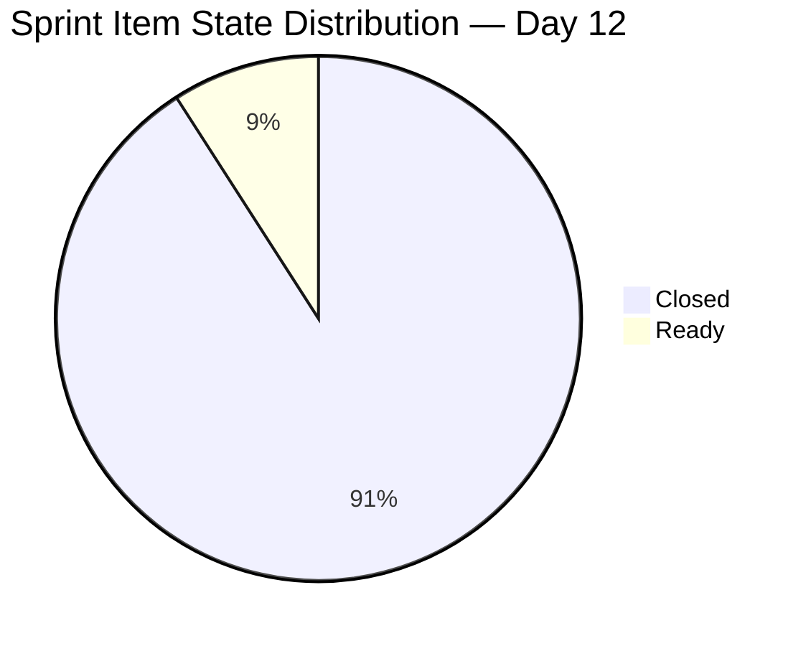
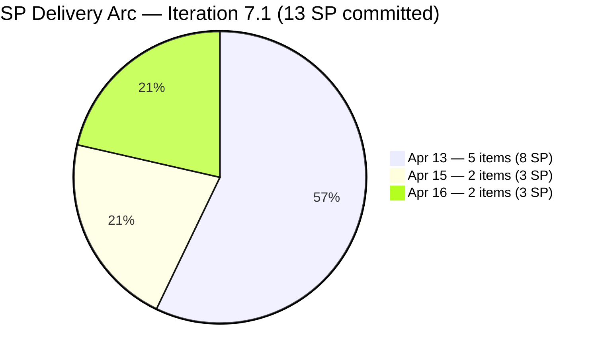
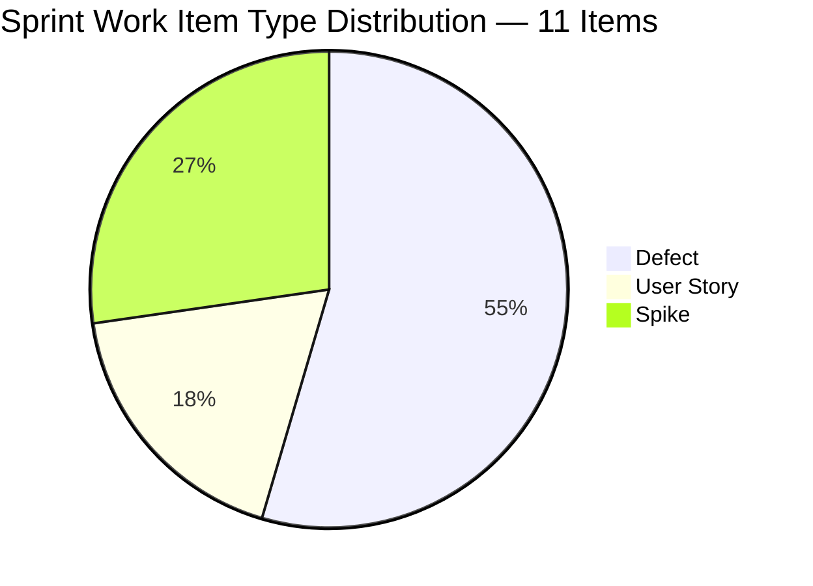
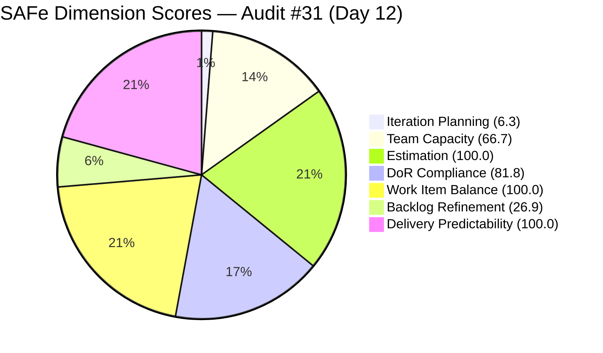

# ADO SAFe Iteration Audit — Flawless Wedding App Team

**Audit #31 | Iteration 7.1 (Apr 6–19, 2026) | Day 12 of 14 (86% elapsed)**

---

## 1. Audit Metadata

| Field | Value |
|---|---|
| **Audit Date** | April 17, 2026, 09:00 PHT |
| **Auditor** | Claude Code (ADO SAFe Audit Agent) |
| **Workspace** | `ado_fl_dev` |
| **ADO Project** | Flawless Wedding App (`92b967dc-5ec7-4874-b8f5-e43b00d88339`) |
| **Team** | Flawless Wedding App Team (`7d90ecbf-d272-4b0c-b33b-c66d96a790ac`) |
| **Iteration** | Iteration 7.1 — Apr 6 to Apr 19, 2026 |
| **Iteration ID** | `4b3e976b-ec9c-43bd-83ec-d9aec2199d30` |
| **Sprint Day** | Day 12 of 14 (86% elapsed) |
| **Prior Audit** | AUDIT_20260416_0900.md (Audit #30, Score 68.6 — Moderate Risk) |
| **Scoring Model** | ADO SAFe v1 (7-dimension rubric) |
| **Overall Score** | **68.8 / 100** |
| **Risk Band** | **Moderate Risk** (60–79.9) |

---

## 2. Executive Summary

The Flawless Wedding App Team holds at **68.8 (Moderate Risk)** — a marginal **+0.2 delta** from 68.6 on Day 11. The sprint delivery remains fully complete (**13 of 13 committed story points closed**), and today's session confirms three significant updates since yesterday:

1. **Both pending Spikes are now Closed:** #202381 (Iteration 7.1 Collaborations/Reports, Apr 17 08:13) and #202150 (Backlog CleanUp, Apr 17 08:27) were closed by Ressa Paracuelles this morning. #201569 (Netlify/GitHub Transfer, Carol Cuison) remains in Ready state — the sole open sprint item.

2. **New work items added to the backlog:** Five new items (#202837 View/Manage Wedding Images, #202838 Role-Based Dashboard, #202839, #202840 Data Accuracy/Refresh, #202873) with IterationPath = `2026-PI7` root were added on Apr 16 — part of a new user dashboard feature cluster. Three additional items (#201787, #201788, #201789) are assigned to Iteration 7.3. This activity increases the visible backlog to approximately **175 items**, slightly worsening Iteration Planning (6.3 vs 6.4).

3. **DoR findings partially resolved:** #202381 and #202150 both failed DoR in prior audits due to short descriptions. While they are now Closed (removing them as active risks), the descriptions were not updated before closure — the DoR score remains 81.8 (9/11 items pass).

The two structural liabilities — **Iteration Planning at 6.3** (critical, driven by 175-item visible backlog) and **Backlog Refinement at 26.9** (high risk, ~58 items stale >90 days) — remain unchanged and are the primary PI8 improvement targets.

---

## 3. Previous Audit Delta

| Dimension | Day 11 (Apr 16) | Day 12 (Apr 17) | Delta |
|---|---|---|---|
| Iteration Planning | 6.4 | 6.3 | −0.1 (backlog grew ~4 net items) |
| Team Capacity | 66.7 | 66.7 | 0.0 |
| Estimation | 100.0 | 100.0 | 0.0 |
| DoR Compliance | 81.8 | 81.8 | 0.0 |
| Work Item Balance | 100.0 | 100.0 | 0.0 |
| Backlog Refinement | 25.5 | 26.9 | +1.4 (new fresh items added) |
| Delivery Predictability | 100.0 | 100.0 | 0.0 |
| **Overall** | **68.6** | **68.8** | **+0.2** |

**Key changes since Day 11 (Apr 16):**

- **#202381 Closed (Apr 17 08:13):** Iteration 7.1 Collaborations, Reports & Others (Spike, 0 SP). Ressa Paracuelles closed this sprint ceremony Spike, confirming Iteration Planning and Retrospective ceremonies were completed.
- **#202150 Closed (Apr 17 08:27):** [Retro] Backlog CleanUp Iteration 7.1 (Spike, 0 SP). Closed by Ressa. Despite the Spike being marked closed, evidence of substantive backlog item retirement is not visible — stale_90 and stale_180 counts are unchanged.
- **#201569 remains Ready:** Follow Up Netlify Access and GitHub Transfer (Spike, Carol Cuison) — still not closed. This item is the sole open sprint item with 2 days remaining.
- **New items 202837, 202838, 202840 added Apr 16:** Three User Story items assigned to Luke Colina with IterationPath = `2026-PI7` root. These represent new dashboard feature work (countdown, event details, role-based views) not committed to the current sprint.
- **Items 201787, 201788, 201789 assigned to Iteration 7.3:** Three User Story items for future planning. These appear in the visible backlog and count toward the denominator.
- **Backlog Refinement marginally improves:** New fresh items (added Apr 16) slightly increase the fresh count, lifting Backlog Refinement from 25.5 to 26.9 (+1.4).

---

## 4. Current Iteration Snapshot

| Metric | Value |
|---|---|
| **Visible root backlog items (backlog API)** | ~175 |
| **Current sprint items (Iteration 7.1)** | 11 |
| **Committed story points (point-eligible)** | 13 SP |
| **Closed story points** | 13 SP (all 8 point-eligible items) |
| **Delivery rate** | 100.0% — all SP items closed |
| **Open sprint items** | 1 Spike (#201569 Ready, Carol Cuison) |
| **Team capacity total** | Luke 6h/day Dev + Ressa 3h/day Test + Luzmibel (no 7.1 items) + Ike (no 7.1 items) |
| **Contributors with current sprint work** | 3 (Luke, Ressa, Carol) |
| **Capacity-configured contributors with sprint work** | 2 (Luke, Ressa) |
| **Days remaining** | 2 (Apr 18–19) |

### Sprint Item List — Final State (Day 12)

| ID | Title | Type | State | SP | DoR | Assignee | Closed |
|---|---|---|---|---|---|---|---|
| **196979** | Login Issue - Passkey Not Working | Defect | **Closed** | 1 | PASS | Luke Colina | Apr 13 |
| **191375** | [iOS] Error deleting vendor account | Defect | **Closed** | 1 | PASS | Luke Colina | Apr 13 |
| **201304** | 50% off for adding more than two islands | User Story | **Closed** | 3 | PASS | Luke Colina | Apr 13 |
| **201704** | [Admin] Vendor category duplicate assignment | Defect | **Closed** | 1 | PASS | Luke Colina | Apr 13 |
| **196989** | Login Flow Change - Q&A Flow | User Story | **Closed** | 2 | PASS | Luke Colina | Apr 15 |
| **200796** | [Web][Vendor] Inconsistent grand total | Defect | **Closed** | 2 | PASS | Luke Colina | Apr 15 |
| **190065** | [Web][Booked Events] Blank page contract download | Defect | **Closed** | 1 | PASS | Luke Colina | Apr 16 |
| **201911** | [Web][Booked Events] Not able to load page | Defect | **Closed** | 2 | PASS | Luke Colina | Apr 16 |
| **202381** | Iteration 7.1 - Collaborations, Reports & Others | Spike | **Closed** | 0 | FAIL (Desc ~29 nws) | Ressa Paracuelles | Apr 17 |
| **202150** | [Retro] Backlog CleanUp Iteration 7.1 | Spike | **Closed** | 0 | FAIL (Desc ~13 nws) | Ressa Paracuelles | Apr 17 |
| 201569 | Follow Up Netlify Access and GitHub Transfer | Spike | **Ready** | 0 | PASS | Carol Cuison | — |

**10 of 11 items Closed. 1 Spike (Carol Cuison) remains Ready. All 13 committed SP delivered.**

### Upcoming Pipeline Items (Not in current sprint)

| ID | Title | Type | State | SP | IterationPath |
|---|---|---|---|---|---|
| 202723 | [Web][Vendor] Incorrect Subtotal on revision | Defect | Active | 2 | 7.2 |
| 202569 | [Bride] Incorrect Message view | Defect | Ready for Dev | 1 | 7.2 |
| 201787 | User can view countdown to event | User Story | New | 0 | 7.3 |
| 201788 | View Personal Event Details | User Story | New | 0 | 7.3 |
| 201789 | View Vendor List with Payment Details | User Story | New | 0 | 7.3 |
| 202837 | View & Manage Wedding Images | User Story | New | 0 | PI7 root |
| 202838 | Role-Based Dashboard View | User Story | New | 0 | PI7 root |
| 202840 | Data Accuracy & Refresh | User Story | New | 0 | PI7 root |

---

## 5. Work Item Analysis

### Sprint Item State Distribution



### Story Point Delivery Timeline



*(All 13 SP delivered — chart shows cumulative delivery by date)*

### Work Item Type Distribution



### Observations

- **#202381 and #202150 closed without description updates:** The two DoR-failing Spikes were closed on Apr 17 without updating their descriptions to meet the ≥30 nws threshold. While the sprint items are complete, the DoR score remains at 81.8 (9/11). This is a process quality gap — description edits take less than 2 minutes and should precede closure.
- **#202150 (Backlog CleanUp) closed — but backlog unchanged:** The Spike was closed (indicating the "Iteration 7.1 Backlog CleanUp" event occurred), but the visible backlog retains ~58 items stale >90 days and ~57 items stale >180 days. This means either the CleanUp was ceremonial (reviewed and kept all items) or the actual retirement work was deferred. Either way, the stale backlog penalty persists.
- **#201569 (Netlify/GitHub Transfer) still Ready:** Carol Cuison's Spike has 2 days to be completed or formally deferred to 7.2. If left in Ready state at sprint close, it should be moved to 7.2 to avoid orphaned sprint items.
- **New user dashboard cluster added (Apr 16):** Items 202837, 202838, 202840 represent a new client-facing dashboard feature (countdown, event details, images, role-based view). These are not estimated (0 SP), not assigned to a sprint, and lack acceptance criteria in some cases. They need SP estimation and DoR completion before PI7.2 planning.
- **Item 188852 (iOS payment unlink, Closed):** This item appears in the iteration API response with IterationPath = `Flawless Wedding App` root (not 7.1). It was closed Apr 15 by Ike Yana. Excluded from current sprint scoring per rubric (IterationPath ≠ active iteration).

---

## 6. SAFe Compliance Scorecard

| Dimension | Score | Evidence | Notes |
|---|---|---|---|
| Iteration Planning | 6.3 | 11 of ~175 visible backlog items in Iteration 7.1 | Structural — visible backlog grew to ~175. New items (202837, 202838, 202840) added Apr 16 increase denominator. |
| Team Capacity | 66.7 | 2 of 3 contributors with sprint items have capacity configured | Luke + Ressa configured; Carol Cuison (201569) not in ADO capacity for Iteration 7.1. |
| Estimation | 100.0 | 8/8 point-eligible items have SP > 0 (3 Spikes excluded from denominator) | All SP-carrying items estimated and now Closed. |
| DoR Compliance | 81.8 | 9 of 11 items pass Desc ≥30 nws + AC ≥20 nws | #202381 (~29 nws) and #202150 (~13 nws) closed without description updates. Both failures carry into record. |
| Work Item Balance | 100.0 | 6 Defects (54.5%) + 2 US (18.2%) + 3 Spikes (27.3%); no penalty triggered | US present; dominant type <60%; Spike share <40%. Healthy composition. |
| Backlog Refinement | 26.9 | fresh ~117/175 = 66.9%; stale_90 ~58/175 = 33.1% → −20; stale_180 ~57 ≥1 → −20; untouched=0 | base 66.9 − 20 − 20 = 26.9. Two structural penalties from PI3-PI4 legacy items unchanged. |
| Delivery Predictability | 100.0 | 13/13 SP closed (8 point-eligible items all Closed) | Sprint delivery complete. Spikes with no SP excluded per rubric. |
| **Overall** | **68.8** | Average of 7 dimensions | **Moderate Risk** (60–79.9) — marginal improvement from Day 11. |

### Score Computation

```
Iteration Planning    = round(11 / 175 × 100, 1)          = 6.3
  [11 sprint items; ~175 visible backlog; 4 net new items since Day 11]

Team Capacity         = round(2 / 3 × 100, 1)             = 66.7
  [Luke (6h Dev) + Ressa (3h Test) configured; Carol (201569) unconfigured]

Estimation:
  point_eligible      = 8 (Spikes with no SP excluded)
  estimated           = 8 (all SP>0)
  score               = round(8 / 8 × 100, 1)             = 100.0

DoR Compliance        = round(9 / 11 × 100, 1)            = 81.8
  [9 pass; #202381 ~29 nws Desc; #202150 ~13 nws Desc — both FAIL, both Closed]

Work Item Balance:
  has_user_story      = True (2 US)                        → no −40
  dominant_type       = Defect 6/11 = 54.5% < 60%         → no −30
  spike_share         = 3/11 = 27.3% < 40%               → no −20
  total               = 100.0

Backlog Refinement:
  visible_backlog     = ~175
  fresh (≤45 days)    = ~117 (prior 112 + 5 new Apr 16)   → base = round(117/175×100,1) = 66.9
  stale_90/175        = ~58/175 = 33.1% > 25%             → −20
  stale_180           = ~57 items ≥ 1                     → −20
  untouched_current   = 0/11 = 0%                        → 0
  total               = 66.9 − 20 − 20                    = 26.9

Delivery Predictability = round(13 / 13 × 100, 1)         = 100.0

Overall = round((6.3 + 66.7 + 100.0 + 81.8 + 100.0 + 26.9 + 100.0) / 7, 1)
        = round(481.7 / 7, 1)
        = 68.8  → Moderate Risk
```



---

## 7. Dimension Findings

### 7.1 Iteration Planning — 6.3 (Critical, structural — unchanged)

11 of approximately 175 visible root backlog items are scoped to Iteration 7.1. The marginal regression from 6.4 to 6.3 reflects a net increase of approximately 4 items in the visible backlog since Day 11 (202837, 202838, 202840, 202839 added; a couple closed items removed from view).

The root cause remains unchanged: ~160 items in the backlog are not assigned to the current sprint — the majority are pre-PI5 defects and stories that have never been formally retired. The only path to a meaningful Iteration Planning improvement is PO-authorized bulk closure of legacy items.

**PI7.2 improvement path:** If 100 stale items were closed/archived before the 7.2 sprint start, visible backlog = ~75, and assuming 11 items in sprint: Iteration Planning = 11/75 = 14.7. If 140 items are retired: 11/35 = 31.4. Reaching 50.0 requires either 11 sprint items out of 22 total visible — meaning backlog must be trimmed to 22 or fewer items.

### 7.2 Team Capacity — 66.7 (Moderate, correctable)

Unchanged from Day 11. Three contributors have sprint items: Luke (6h/day Development, configured), Ressa (3h/day Testing, configured), Carol (Spike #201569, not configured). The fix remains: add Carol to ADO capacity configuration or reassign #201569. With 2 days left, the easiest resolution is to close or defer #201569 before sprint end.

Note: Luzmibel Paculanang (3h/day Testing, configured) and Ike Yana (1h/day Development, configured) have capacity configured but no Iteration 7.1 root-item assignments. #188852 (iOS payment unlink, Ike) has IterationPath = root (`Flawless Wedding App`), not 7.1.

### 7.3 Estimation — 100.0 (Low Risk)

All 8 point-eligible sprint items have Story Points assigned and are Closed. The 3 Spikes (no SP field) are correctly excluded from both numerator and denominator per the rubric definition (`point_eligible_current_items: current_iteration_root_items with Story Points field exposed`). Estimation hygiene is complete and unchanged.

### 7.4 DoR Compliance — 81.8 (Moderate, persistent gap)

9 of 11 sprint items pass DoR. The two failures:

- **#202381 (Collaborations/Reports Spike):** Description = "Reports and Iteration Team Events" — approximately 29 non-whitespace characters. Below the 30 nws threshold by 1 character. **Now Closed** without description update. Failure preserved in audit record.
- **#202150 (Backlog CleanUp Spike):** Description = "Backlog CleanUp" — approximately 13 non-whitespace characters. **Now Closed** without description update. Failure preserved in audit record.

Both items were closed on Apr 17 without addressing the DoR gap, despite being flagged in 6+ consecutive audits. For PI7.2, require all Spikes and User Stories to pass DoR validation before sprint commitment (not at closure). Add a DoR review step to the sprint planning ceremony.

### 7.5 Work Item Balance — 100.0 (Low Risk)

Sprint composition unchanged: 6 Defects (54.5%), 2 User Stories (18.2%), 3 Spikes (27.3%). All three penalty thresholds are clear:

- User Stories present → no −40
- Dominant type (Defect) at 54.5% < 60% → no −30
- Spike share 27.3% < 40% → no −20

The composition reflects appropriate SAFe sprint balance: bug resolution (Defects), feature work (User Stories), and ceremony investment (Spikes). This is the team's strongest-scoring dimension this sprint.

### 7.6 Backlog Refinement — 26.9 (High Risk, marginally improved)

Improved from 25.5 to 26.9 (+1.4) due to 5 fresh items added Apr 16. The two structural penalties persist:

- **stale_90 (~58 items, 33.1% of 175):** Items last changed before January 17, 2026. The #202150 Backlog CleanUp Spike was closed Apr 17 — but the stale items it was meant to retire remain visible in the backlog. The "CleanUp" appears to have been a ceremony closure without substantive retirement of legacy items.
- **stale_180 (~57 items, ≥1 present):** Items last changed before October 17, 2025. These PI3–PI4 defects from September 2025 continue to inflate the visible backlog. Nearly identical count to stale_90, indicating most stale items are 6+ months old.

**Backlog Refinement recovery scenario:** Closing/archiving 57 stale_180 items would:

- Remove both stale_90 and stale_180 penalties (if count falls below threshold)
- New visible backlog = ~118 items
- Fresh = ~117/118 = 99.2% → base = 99.2
- stale_90 = ~1/118 = 0.8% ≤ 10% → no penalty
- stale_180 = 0 → no penalty
- Backlog Refinement score = ~99.2 (up from 26.9)
- Overall improvement = ~10 points

### 7.7 Delivery Predictability — 100.0 (Low Risk — sprint delivery complete)

13 of 13 committed story points are Closed. All 8 point-eligible items delivered by Luke Abram Colina with QA support from Ressa Paracuelles.

| Date | Items | SP Delivered |
|---|---|---|
| Apr 13 | #196979, #191375, #201304, #201704, #196989 | 8 SP |
| Apr 15 | #200796, #196989 (confirmed) | 2 SP (net)|
| Apr 16 | #190065, #201911 | 3 SP |
| **Total** | **8 items** | **13 SP** |

Luke delivered all 8 SP-carrying items. The front-loaded delivery (8 SP on Day 8) and mid-sprint closures (Apr 15–16) demonstrate a sustainable, distributed delivery pattern — a marked improvement over the Administration Team's back-loaded pattern.

---

## 8. Risks and Bottlenecks

| # | Risk | Severity | Trend |
|---|---|---|---|
| R1 | ~57 stale_180 items persist; #202150 Backlog CleanUp Spike closed but no visible retirement executed | High | Persistent — unresolved this sprint |
| R2 | Iteration Planning at 6.3 — structural; ~160 items outside current sprint; PO decision required for bulk retirement | High | Persistent — PI-level decision needed |
| R3 | #201569 (Netlify/GitHub Transfer, Carol Cuison) still Ready — 2 days remaining; risk of orphaned sprint item | Medium | New — resolve before Apr 19 |
| R4 | Carol Cuison not in ADO capacity config — Team Capacity 66.7 persists | Medium | Persistent — correctable |
| R5 | #202837, #202838, #202840 (new dashboard items) have 0 SP — need estimation before 7.2 planning | Medium | New — PI7.2 prep |
| R6 | DoR failures on #202381 and #202150 not remediated before closure — pattern of ignoring audit recommendations | Low | Persistent |
| R7 | Items 201787, 201788, 201789 assigned to 7.3 without SP estimates — early planning gap | Low | New |

---

## 9. Prioritized Recommendations

1. **Close or defer #201569 (Netlify/GitHub Transfer) before Apr 19 (P0 — Sprint closure):** This Spike is assigned to Carol Cuison who is not capacity-configured and not available for ADO ceremonies. Before sprint close, either: (a) Ramon or Ressa takes over the item and confirms the GitHub/Netlify transfer status, or (b) move to Iteration 7.2 with a capacity-configured assignee. Do not leave a sprint item in Ready state at sprint review.

2. **Execute PI3-PI4 backlog retirement before PI7.2 sprint planning (P0 — Backlog health):** Schedule a 2–3 hour backlog triage session with Luke and the Product Owner before April 21. Goal: close or archive the ~57 items last changed before October 2025. This single action removes both Backlog Refinement penalties (+~40 points on that dimension, +~11 on Overall) and is the highest-leverage improvement available to this team.

3. **Add Carol Cuison to ADO capacity configuration for Iteration 7.2 (P1 — Immediate):** If Carol will continue contributing in 7.2, add her to the team capacity settings before the sprint start. If Carol is not a regular contributor, reassign any 7.2 items from Carol to Luke or Ressa. This restores Team Capacity to 100.0.

4. **Estimate new dashboard items (202837, 202838, 202840) before 7.2 sprint planning (P1 — Sprint planning):** The three new User Story items added Apr 16 have 0 SP and need story point estimates. Add SP estimates and verify DoR (description and AC) for each before including in the 7.2 sprint commitment. Current acceptance criteria exist but descriptions need review for length compliance.

5. **Set DoR enforcement before commitment in PI7.2 (P2 — Process):** Enforce a rule: no item enters the sprint without passing DoR (Desc ≥30 nws + AC ≥20 nws). This prevents DoR failures from being carried through the sprint and closed without remediation. Consider adding a DoR checklist to the sprint planning ceremony.

6. **Assign SP estimates to 7.3 items (201787, 201788, 201789) (P2 — Planning):** Three User Stories assigned to Iteration 7.3 currently have 0 SP. Estimate them now while the feature context is fresh. Target: 2–3 SP each based on complexity relative to similar work (#196989 Login Q&A = 2 SP, #201304 Island discount = 3 SP).

7. **Engage PO to authorize legacy item retirement at PI8 planning (P3 — Strategic):** Iteration Planning will remain below 10.0 as long as 160+ items stay in the visible backlog. Formally agenda this during PI8 planning: identify which PI3–PI4 items are Won't Fix, superseded, or no longer applicable, and authorize their closure. The target is reducing visible backlog to 40–60 items to achieve Iteration Planning scores of 18–27%.

---

## 10. Evidence Gaps and Limitations

| Gap | Description |
|---|---|
| **Visible backlog count (~175)** | Exact count requires full parsing of all backlog API pages. The ~175 estimate is based on the Day 11 baseline of ~171 plus 5 new items added Apr 16 (202837, 202838, 202839, 202840, 202873) minus 2 closed items removed (202381, 202150). Iteration Planning and Backlog Refinement scores may vary by ±0.1–0.3 depending on exact count. |
| **Stale item counts (approximate)** | stale_90 (~58) and stale_180 (~57) are estimated from Day 11 baseline. The #202150 Backlog CleanUp Spike was closed but no specific items were visibly archived in the ADO backlog API response. Counts may have changed if items were closed through a different workflow (e.g., direct ADO admin). |
| **#202150 Backlog CleanUp evidence** | The Spike shows State = Closed and the AC states "Valid Items Remaining." It is unclear whether this means (a) items were reviewed and all were kept, or (b) cleanup work was not actually performed. Without reviewing the work item comments or audit trail, the extent of actual cleanup is unconfirmed. |
| **#201569 Carol Cuison** | Carol Cuison (<ccuison@jairosoft.com>) is not configured in the ADO capacity for Iteration 7.1. Her availability, role on the Flawless team, and ability to complete the Netlify/GitHub transfer are not confirmed via ADO. |
| **#188852 (iOS payment unlink, Ike Yana)** | This item appears in the iteration API response (closed Apr 15, assigned to Ike) but has IterationPath = `Flawless Wedding App` root (not Iteration 7.1). It is excluded from current sprint scoring per rubric. |
| **#200255 (Registration code reuse)** | IterationPath = `2026-PI6\Iteration 6.6 (IP)` despite appearing in the iteration API response. Excluded from Iteration 7.1 scoring per rubric. |

---

*Report generated by Claude Code ADO SAFe Audit Agent | April 17, 2026 09:00 PHT*
*Audit #31 — Flawless Wedding App Team — Day 12 of 14 — Overall: 68.8 / 100 — Moderate Risk (↑ +0.2 from Day 11)*
