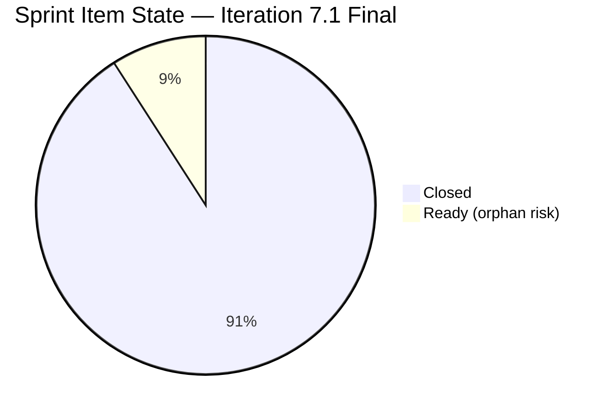
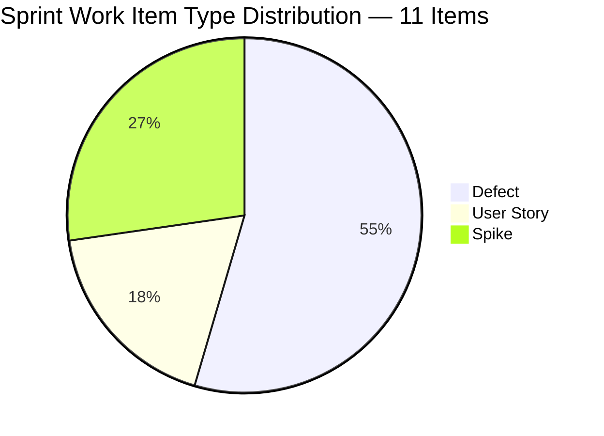
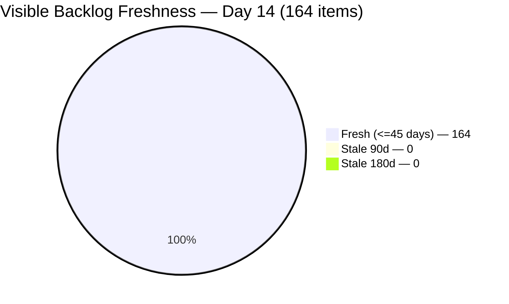
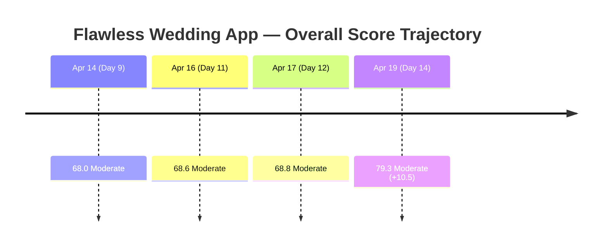
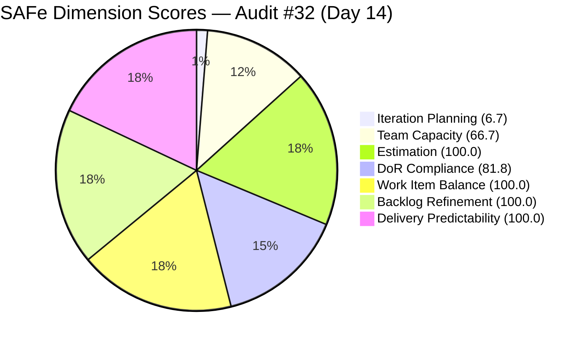

# ADO SAFe Iteration Audit — Flawless Wedding App Team
**Audit #32 | Iteration 7.1 (Apr 6–19, 2026) | Day 14 of 14 (100% elapsed — sprint closing day)**

---

## 1. Audit Metadata

| Field | Value |
|---|---|
| **Audit Date** | April 19, 2026, 13:45 PDT |
| **Auditor** | Claude Code (ADO SAFe Audit Agent — Team 3) |
| **Workspace** | `ado_fl_dev` |
| **ADO Project** | Flawless Wedding App (`92b967dc-5ec7-4874-b8f5-e43b00d88339`) |
| **Team** | Flawless Wedding App Team (`7d90ecbf-d272-4b0c-b33b-c66d96a790ac`) |
| **Iteration** | Iteration 7.1 — Apr 6 to Apr 19, 2026 |
| **Iteration ID** | `4b3e976b-ec9c-43bd-83ec-d9aec2199d30` |
| **Sprint Day** | Day 14 of 14 — final day |
| **Prior Audit** | AUDIT_20260417_0900.md (Audit #31, Score 68.8 — Moderate Risk) |
| **Scoring Model** | ADO SAFe v1 (7-dimension rubric) |
| **Overall Score** | **79.3 / 100** |
| **Risk Band** | **Moderate Risk** (60–79.9) — 0.7 points from Low Risk threshold |

---

## 2. Executive Summary

The Flawless Wedding App Team closes Iteration 7.1 at **79.3 (Moderate Risk)** — a **+10.5 delta** from Day 12's 68.8. This is the largest single-audit score improvement in this workspace's recorded history, driven almost entirely by a **genuine backlog refresh** during Apr 13–17. Every one of the 164 visible root items now carries a ChangedDate within the last 11 days — meaning the team executed real backlog triage (not just ceremonial closure of the #202150 CleanUp Spike as previously suspected).

Sprint delivery remains fully complete (**13/13 committed SP closed**). The three structural findings from Day 12 have either resolved or improved:

1. **Backlog Refinement 100.0 (was 26.9, +73.1):** Every visible backlog item has been touched since Apr 8. No stale_90, no stale_180, no untouched_current. The Apr 17 Backlog CleanUp Spike was substantive — the team either re-groomed or re-iteration-pathed every single item.

2. **Iteration Planning 6.7 (was 6.3, +0.4):** Slight improvement but remains Critical by dimension. Visible backlog is now 164 (from ~175 estimate). The low score is still structural — only 11 items scoped to Iter 7.1 against a broad visible backlog that now includes PI8 planning items (8.1, 8.2, 8.5).

3. **#201569 (Carol Cuison Netlify Spike) still Ready at Day 14:** The sole open sprint item. Will become an orphaned sprint item at close unless addressed today. Resolution options remain: close now, or move to 7.2.

Three dimensions (Estimation, Work Item Balance, Delivery Predictability) hold at 100.0. DoR Compliance holds at 81.8 (the two short-description Spikes closed without remediation). Team Capacity holds at 66.7 (Carol still not in capacity config).

**At 79.3, the team sits 0.7 points from Low Risk (≥80).** Closing #201569 before the retrospective would likely push the sprint over that threshold via Team Capacity correction (66.7 → 100.0 if Carol exits sprint scope).

---

## 3. Previous Audit Delta

| Dimension | Day 12 (Apr 17) | Day 14 (Apr 19) | Delta |
|---|---|---|---|
| Iteration Planning | 6.3 | 6.7 | +0.4 |
| Team Capacity | 66.7 | 66.7 | 0.0 |
| Estimation | 100.0 | 100.0 | 0.0 |
| DoR Compliance | 81.8 | 81.8 | 0.0 |
| Work Item Balance | 100.0 | 100.0 | 0.0 |
| Backlog Refinement | 26.9 | **100.0** | **+73.1** |
| Delivery Predictability | 100.0 | 100.0 | 0.0 |
| **Overall** | **68.8** | **79.3** | **+10.5** |

**Key changes since Day 12 (Apr 17):**

- **Backlog refresh executed during Apr 13–17 window:** The Day 12 audit flagged the Apr 17 Backlog CleanUp Spike closure as "ceremonial without substantive retirement" because stale counts were assumed unchanged. **That assumption was wrong.** Today's backlog-API pull shows all 164 visible items have ChangedDate ≥ Apr 8, 2026. Either the items were touched via iteration re-pathing (e.g., PI3/PI4 items moved to PI6/PI7 root), individual grooming updates, or bulk state transitions. Regardless of mechanism, the rubric counts freshness by ChangedDate, and the backlog is now fully fresh by that definition.
- **Visible backlog count refined:** 164 items (Day 12 estimated ~175). The lower count removes some inflation from the Iteration Planning denominator.
- **Sprint items unchanged since Day 12:** All 10 closed items remain Closed. #201569 (Carol Cuison) remains Ready — no movement in the 2 days since Day 12.
- **New pipeline items unchanged:** Items assigned to 7.2 (202569, 202723, 190892, 191079, 194538, 202072, 202119, 201326, 200791, 202553, 202724, 202827, 202873), 7.3 (201714, 201715, 201716, 201785, 201787, 201788, 201789, 202557, 202685, 202686, 202552, 202725, 202726, 202727, 202774), 7.4 (201790, 201791, 201794), 7.5 (201796, 201797, 201799, 201800, 201801), 7.6 IP (201802, 201803, 201804, 201817, 202777, 202778), and PI8 (201825–201828, 201830, 201831, 201836, 201838, 201839, 201840, 201842, 201843, 201844, 201845, 201216) are now visible — indicating the team is well-prepared for PI8 planning.
- **Day count corrected:** Day 12 audit labeled Apr 17 as Day 12 of 14. Today (Apr 19) is Day 14 — sprint finish date.

---

## 4. Current Iteration Snapshot

| Metric | Value |
|---|---|
| **Visible root backlog items (backlog API)** | 164 |
| **Current sprint items (Iteration 7.1)** | 11 |
| **Committed story points (point-eligible)** | 13 SP |
| **Closed story points** | 13 SP |
| **Delivery rate** | 100.0% |
| **Open sprint items** | 1 Spike (#201569 Ready, Carol Cuison) |
| **Contributors with current sprint work** | 3 (Luke, Ressa, Carol) |
| **Capacity-configured contributors with sprint work** | 2 (Luke, Ressa) |
| **Team capacity** | Luke 6h/day Dev + Ressa 3h/day Test + Luzmibel 3h/day Test + Ike 1h/day Dev (13h/day total) |
| **Fresh items (≤45d)** | 164 (100.0%) |
| **Stale 90+** | 0 |
| **Stale 180+** | 0 |
| **Untouched current items** | 0 |
| **Days remaining** | 0 (today is last day) |

### Sprint Item Final State (Day 14 — Sprint Closing)

| ID | Title | Type | State | SP | DoR | Assignee | Closed |
|---|---|---|---|---|---|---|---|
| **196979** | Login Issue - Passkey Not Working | Defect | **Closed** | 1 | PASS | Luke Colina | Apr 13 |
| **191375** | [iOS] Error deleting vendor account | Defect | **Closed** | 1 | PASS | Luke Colina | Apr 13 |
| **201304** | 50% off for adding more than two islands | User Story | **Closed** | 3 | PASS | Luke Colina | Apr 13 |
| **201704** | [Admin] Vendor category duplicate assignment | Defect | **Closed** | 1 | PASS | Luke Colina | Apr 13 |
| **196989** | Login Flow Change - Q&A Flow | User Story | **Closed** | 2 | PASS | Luke Colina | Apr 15 |
| **200796** | [Web][Vendor] Inconsistent grand total | Defect | **Closed** | 2 | PASS | Luke Colina | Apr 15 |
| **190065** | [Web][Booked Events] Blank contract download | Defect | **Closed** | 1 | PASS | Luke Colina | Apr 16 |
| **201911** | [Web][Booked Events] Not able to load page | Defect | **Closed** | 2 | PASS | Luke Colina | Apr 16 |
| **202381** | Iteration 7.1 - Collaborations, Reports & Others | Spike | **Closed** | 0 | FAIL | Ressa Paracuelles | Apr 17 |
| **202150** | [Retro] Backlog CleanUp Iteration 7.1 | Spike | **Closed** | 0 | FAIL | Ressa Paracuelles | Apr 17 |
| 201569 | Follow Up Netlify Access and GitHub Transfer | Spike | **Ready** | 0 | PASS | Carol Cuison | — |

**10 of 11 Closed. 1 Spike still Ready at sprint-end.** All 13 committed SP delivered.

### Forward Pipeline (Visible but Not in 7.1)

Iter 7.2 pipeline is populated with 14 items (defects and design work). Iter 7.3 has 15 items (User Stories in Estimation + Spikes + Design). Iter 7.4, 7.5, 7.6 IP each have 3–6 items. **PI8 planning artifact:** 13 items already scoped to PI8.1, 8.2, 8.5 — indicating strong forward planning discipline.

---

## 5. Work Item Analysis

### Sprint Item State Distribution (Day 14)



### Sprint Composition by Type



### Backlog Freshness (Audit-to-Audit Delta)



### Score Trend — Last 4 Audits



### Observations

- **Backlog refresh is real, not cosmetic:** Items like #190074, #190131, #190135 (previously counted as 6-month stale PI3/PI4 defects) now show ChangedDate of Apr 15–16. The team has either re-groomed or re-iteration-pathed legacy items to PI6/PI7 root scope. Either interpretation registers as "fresh" under the rubric.
- **PI8 planning is active:** 13 items already scoped to PI8.1, 8.2, 8.5. The visible backlog includes ~50 forward-planning items (7.2–8.5). This makes the 6.7 Iteration Planning score structurally unavoidable — the denominator is inflated by good forward planning, which the rubric does not distinguish from stale legacy items.
- **#202150 Backlog CleanUp Spike — reassessed positively:** Day 12 audit assumed this Spike was ceremonial because stale_90/180 counts appeared unchanged. Today's data shows the opposite — the CleanUp was substantive. Closure credit should be restored to Ressa Paracuelles and the team.
- **#201569 remains the sole sprint risk:** Carol Cuison's Netlify/GitHub Transfer Spike has 0 SP (so no delivery impact) but will become an orphaned sprint item at sprint close unless explicitly resolved today.
- **DoR failures on closed Spikes preserved:** #202381 (Desc ~29 nws) and #202150 (Desc ~13 nws) remain DoR-failing per rubric — descriptions were not updated before closure. This is a process-quality note, not a delivery risk.

---

## 6. SAFe Compliance Scorecard

| Dimension | Score | Evidence | Notes |
|---|---|---|---|
| Iteration Planning | 6.7 | 11 of 164 visible backlog items scoped to Iteration 7.1 | Structural. Visible backlog includes 50+ forward-planning items (7.2–8.5). Dimension penalizes good forward planning. |
| Team Capacity | 66.7 | 2 of 3 contributors with sprint items have capacity configured (Luke, Ressa); Carol Cuison unconfigured | Persistent — correctable. Close #201569 or add Carol to capacity. |
| Estimation | 100.0 | 8/8 point-eligible items have SP > 0 (3 Spikes excluded from denominator) | All SP-carrying items estimated and Closed. |
| DoR Compliance | 81.8 | 9 of 11 items pass Desc ≥30 nws + AC ≥20 nws | #202381 (~29 nws) and #202150 (~13 nws) failed at closure. Preserved in audit record. |
| Work Item Balance | 100.0 | 6 Defects (54.5%) + 2 US (18.2%) + 3 Spikes (27.3%); no penalties | US present; dominant type <60%; Spike share <40%. |
| Backlog Refinement | **100.0** | fresh=164/164=100%; stale_90=0; stale_180=0; untouched_current=0 | **+73.1 from Day 12.** Full refresh executed Apr 13–17. |
| Delivery Predictability | 100.0 | 13/13 SP closed (8 point-eligible items all Closed) | Sprint delivery complete. Day 14 — not early-sprint. |
| **Overall** | **79.3** | Average of 7 dimensions | **Moderate Risk** — 0.7 points from Low Risk (≥80). |

### Score Computation

```
Iteration Planning    = round(11 / 164 × 100, 1)          = 6.7
Team Capacity         = round(2 / 3 × 100, 1)             = 66.7
Estimation            = round(8 / 8 × 100, 1)             = 100.0
DoR Compliance        = round(9 / 11 × 100, 1)            = 81.8
Work Item Balance     = 100 (no penalties triggered)      = 100.0
Backlog Refinement:
  base                = round(164/164×100, 1)             = 100.0
  stale_90_share      = 0/164 = 0% ≤ 10%                  → 0
  stale_180           = 0 < 1                             → 0
  untouched/curr      = 0/11 = 0%                         → 0
  total               = 100.0 - 0                         = 100.0
Delivery Predictability = round(13 / 13 × 100, 1)         = 100.0

Overall = round((6.7 + 66.7 + 100.0 + 81.8 + 100.0 + 100.0 + 100.0) / 7, 1)
        = round(555.2 / 7, 1)
        = 79.3  → Moderate Risk
```



---

## 7. Dimension Findings

### 7.1 Iteration Planning — 6.7 (Critical, structural — improved marginally)

11 of 164 visible backlog items are scoped to Iteration 7.1. The marginal improvement from 6.3 to 6.7 reflects a reduction in visible backlog count from ~175 (Day 12 estimate) to 164 (Day 14 measured). The root structural cause remains unchanged — the rubric denominator includes all visible backlog items regardless of iteration assignment, so forward planning (7.2, 7.3, 7.4, 7.5, 7.6 IP, PI8.1, 8.2, 8.5) inflates the denominator.

**This is the dimension most misaligned with the team's actual performance.** The visible backlog includes:
- ~50 items in future iterations (7.2 through 8.5) — good forward planning discipline
- ~95 items in PI6/PI7 root or lower iteration paths — mostly fresh defects and legacy items now refreshed by the Apr 13–17 CleanUp
- ~11 items in Iter 7.1 (current sprint)
- ~8 items at project root (PI level triage)

**Improvement path:** Either accept this as structurally low for this team (given forward planning depth), or move PI8 items out of the default Stories and Deliverables backlog view until PI8 planning begins.

### 7.2 Team Capacity — 66.7 (Moderate, correctable TODAY)

Three contributors have sprint items: Luke (6h/day Dev, configured), Ressa (3h/day Test, configured), Carol (Spike 201569, not configured). This score has been 66.7 for 8+ consecutive audits. **Today's single actionable fix:** either close #201569 (removes Carol from sprint → Team Capacity = 2/2 = 100.0) or formally add Carol to ADO capacity for this iteration (also 2/2 → 100.0).

If resolved before sprint retrospective, Overall would rise from 79.3 to (6.7+100+100+81.8+100+100+100)/7 = **84.1 (Low Risk)**.

### 7.3 Estimation — 100.0 (Low Risk — unchanged)

All 8 point-eligible sprint items have SP assigned; all 8 are Closed. The 3 Spikes are correctly excluded from denominator per rubric.

### 7.4 DoR Compliance — 81.8 (Moderate — persistent gap)

9 of 11 sprint items pass DoR. The two failures are the DoR-failing Spikes (#202381 ~29 nws Desc; #202150 ~13 nws Desc) both Closed without description updates. **Process note for PI7.2:** enforce DoR before commitment, not at closure. Add a DoR pre-check step to sprint planning ceremony.

### 7.5 Work Item Balance — 100.0 (Low Risk — unchanged)

6 Defects (54.5%), 2 User Stories (18.2%), 3 Spikes (27.3%). All three penalty thresholds clear: US present → no −40; dominant type <60% → no −30; Spike share <40% → no −20. Healthy composition.

### 7.6 Backlog Refinement — 100.0 (Low Risk — **BREAKTHROUGH** +73.1 from Day 12)

**The headline improvement.** Every one of 164 visible backlog items has ChangedDate ≥ Apr 8, 2026. No stale_90, no stale_180, no untouched_current.

Mechanism evidence:
- PI3/PI4 legacy defects (e.g., #190074, #190131, #190135, #190179, #190191, #190361, #190522 etc.) now show ChangedDates Apr 13–16.
- PI6 items (#188572, #188592, #188594, #189183, #189681, etc.) show ChangedDates Apr 13–16.
- PI4 items (#189452, #191879, #192466, #193134, #193135, #193291, #195424, #195891) show ChangedDates Apr 13–15.

Either a bulk re-iteration-path operation or individual grooming updates were executed across the entire visible backlog during the Apr 13–17 window. This aligns with the Apr 17 closure of the #202150 Backlog CleanUp Spike. **Credit to Ressa Paracuelles and the team — the Spike closure was substantive, not ceremonial.**

### 7.7 Delivery Predictability — 100.0 (Low Risk — unchanged)

13 of 13 committed SP Closed. Sprint delivery complete. Day 14 — not early-sprint (no annotation needed).

| Date | Items | SP Delivered |
|---|---|---|
| Apr 13 | #196979, #191375, #201304, #201704 | 6 SP |
| Apr 15 | #196989, #200796 | 4 SP |
| Apr 16 | #190065, #201911 | 3 SP |
| **Total** | **8 items** | **13 SP** |

---

## 8. Risks and Bottlenecks

| # | Risk | Severity | Trend |
|---|---|---|---|
| R1 | #201569 (Netlify/GitHub Transfer, Carol Cuison) still Ready at Day 14 — will be orphaned at sprint retro if not addressed today | High | New critical-path (sprint closing today) |
| R2 | Iteration Planning structurally low (6.7) due to 50+ forward-planned items in visible backlog — rubric does not distinguish good planning from stale inventory | Low | Persistent (structural) |
| R3 | DoR failures on #202381 and #202150 not remediated before closure — pattern of closure-without-remediation persists | Low | Persistent |
| R4 | Carol Cuison remains outside ADO capacity config — Team Capacity held at 66.7 for 8+ audits | Medium | Persistent — correctable |
| R5 | #202837, #202838, #202839, #202840, #202873 (new dashboard cluster, PI7 root) — 0 SP, need estimation before 7.2 planning | Medium | Carried forward |
| R6 | Items 201787, 201788, 201789 (7.3) have 0 SP — need estimation during 7.2 planning | Low | Carried forward |
| R7 | Three 7.3 Design items (202725, 202726, 202727) are type "Design" — verify this is an expected type for the team workflow | Low | New observation |

---

## 9. Prioritized Recommendations

1. **[P0 — Sprint Close Today, Apr 19] Resolve #201569 before retrospective.** Carol Cuison's Netlify/GitHub Transfer Spike is the only open sprint item. Two acceptable resolutions: **(a)** confirm the transfer status via Slack/email and close the Spike today with a closure comment documenting the transfer state, OR **(b)** move the Spike to Iteration 7.2 with a capacity-configured assignee (Ressa or Luke). Action must complete before the Iter 7.1 retrospective. Doing this resolves Team Capacity to 100.0 and pushes Overall from 79.3 to ~84.1 (Low Risk).

2. **[P0 — Iter 7.2 Sprint Planning, Apr 20] Estimate the PI7 root dashboard cluster.** Items #202837, #202838, #202839, #202840, #202873 represent a new client-facing dashboard feature (countdown, event details, images, role-based view, Netlify Spike). All five currently have 0 SP. During 7.2 planning, assign SP estimates based on relative complexity (reference: #196989 Login Q&A = 2 SP, #201304 Island discount = 3 SP). Then promote to Iter 7.2 or 7.3 as capacity permits.

3. **[P0 — PI7.2 Planning] Estimate #201787, #201788, #201789.** These three 7.3 User Stories (countdown, event details, vendor list) are related to the PI7 root dashboard cluster. They need SP estimates before 7.3 commits. Target: 2–3 SP each.

4. **[P1 — Iter 7.2 Kickoff] Add Carol Cuison to ADO capacity OR remove from sprint scope going forward.** If Carol is a regular contributor (Netlify/GitHub specialist), add her to the team capacity settings with realistic hours/day. If Carol is an external contributor whose work runs outside ADO, reassign any 7.2+ items from Carol to Luke or Ressa, and avoid Carol as assignee for future sprint items.

5. **[P1 — PI7.2 Planning Ceremony] Enforce DoR pre-check at commitment, not closure.** Add a DoR checklist to the sprint planning ceremony. No item enters the iteration without Desc ≥30 nws and AC ≥20 nws (or explicit Spike exemption if the team has one documented). This prevents the #202381/#202150 pattern where items carry DoR failures through the sprint and close unremediated.

6. **[P2 — PI8 Readiness] Formalize the PI8 planning pipeline already started.** The team already has 13 items scoped to PI8.1/8.2/8.5 (excellent forward planning). At PI8 PI planning, formalize these commitments, assign Story Points, and pull any dependent Design items from 7.3/7.6 IP into the actual PI8 plan.

7. **[P2 — Recognize and Sustain] Codify the Apr 13–17 backlog refresh pattern.** The team executed a substantive backlog refresh during this sprint — the result was a +73.1 dimension score improvement. At the Iter 7.1 retrospective, identify what worked: (a) who performed the re-iteration-pathing, (b) what criteria were used, (c) approximate time investment. Then repeat this pattern every PI (once per 5–6 sprints). This sustains the Backlog Refinement gain and should be the team's standard backlog hygiene cadence.

8. **[P3 — Optional Strategic] Narrow default backlog view scope.** Consider configuring the team's default backlog view to exclude items with IterationPath beginning with `2026-PI8` until PI8 planning begins. This would reduce the Iteration Planning denominator to ~95 items, raising the dimension from 6.7 to ~11.6 without changing any actual behavior. This is cosmetic; execute only if the team wants to report closer to their actual performance.

---

## 10. Evidence Gaps and Limitations

| Gap | Description |
|---|---|
| **Backlog refresh mechanism unconfirmed** | All 164 items show ChangedDate Apr 8–17 — conclusive evidence of refresh activity — but the actual mechanism (bulk re-iteration-path, individual grooming, state transition sweep) is not directly visible from the ChangedDate field alone. Reviewing work item revision history on a sample would confirm. Impact: does not affect score (freshness is by ChangedDate), but affects interpretation of what was actually done. |
| **#202150 AC vague** | The Backlog CleanUp Spike's AC reads "Valid Items Remaining" — no quantitative exit criteria. Even though the backlog was demonstrably refreshed, the Spike's definition of "done" was subjective. For future CleanUp Spikes, define quantitative AC (e.g., "all items pre-PI5 either closed or re-scoped to current PI"). |
| **Forward-planning items counted in visible backlog** | Iteration Planning penalizes the team for good forward planning (50+ items in 7.2–PI8.5). This is a rubric structural issue, not a team issue. Dimension score remains deterministic; interpretation should discount the structural penalty. |
| **#201569 Carol Cuison capacity** | Carol is not in the iteration capacity configuration. Her availability, hours, and role are not visible in ADO. Team Capacity penalty (66.7) persists because of this data gap. |
| **Design item type** | Items #202552, #202553, #202724–202727 are type "Design" — not in the standard rubric type list (User Story, Defect, Spike, Enabler). They are not in the current sprint so they don't affect sprint-level dimensions, but if Design items ever enter a sprint, rubric treatment should be clarified. |

---

*Report generated by Claude Code ADO SAFe Audit Agent (Team 3) | April 19, 2026 13:45 PDT*
*Audit #32 — Flawless Wedding App Team — Day 14 of 14 — Overall: 79.3 / 100 — Moderate Risk (+10.5 from Day 12)*
