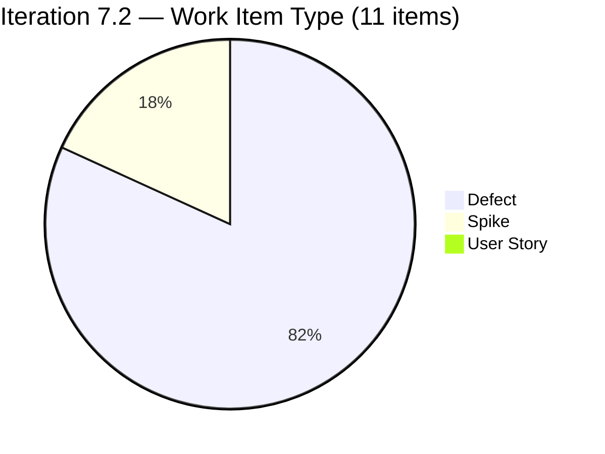
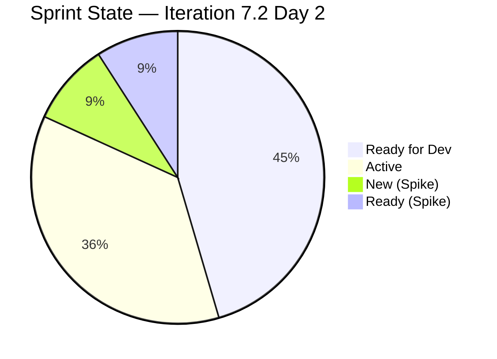
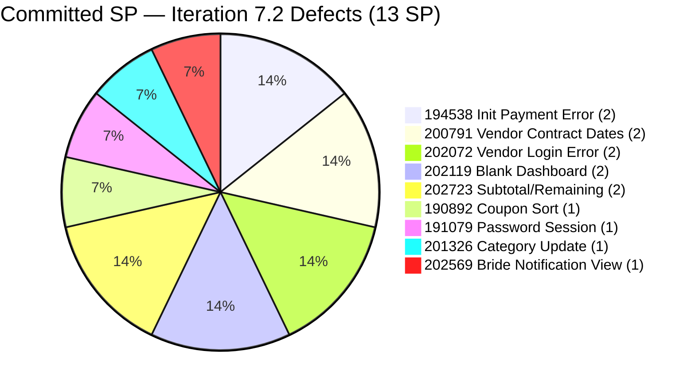
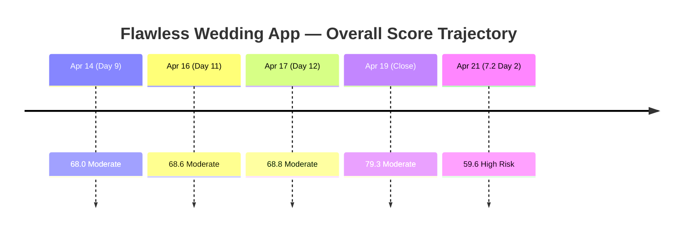
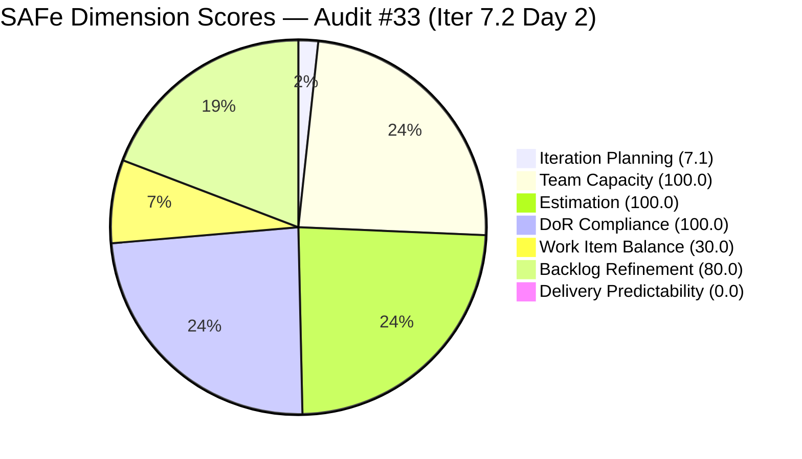

# ADO SAFe Iteration Audit — Flawless Wedding App Team

**Audit #33 | Iteration 7.2 (Apr 20 – May 3, 2026) | Day 2 of 14 (early-sprint)**

---

## 1. Audit Metadata

| Field | Value |
|---|---|
| **Audit Date** | April 21, 2026, 08:00 PDT |
| **Auditor** | Claude Code (ADO SAFe Audit Agent — `all-projects` batch, Team A) |
| **Workspace** | `ado_fl_dev` |
| **ADO Project** | Flawless Wedding App (`92b967dc-5ec7-4874-b8f5-e43b00d88339`) |
| **Team** | Flawless Wedding App Team (`7d90ecbf-d272-4b0c-b33b-c66d96a790ac`) |
| **Iteration** | Iteration 7.2 — Apr 20 to May 3, 2026 |
| **Iteration ID** | `8c08cc43-e1e8-4b0c-be84-4c81eaa860d5` |
| **Sprint Day** | Day 2 of 14 (early-sprint — Day 1–5 window) |
| **Prior Audit** | AUDIT_20260419_1345.md (Audit #32, 79.3 — Moderate Risk, PI7.1 close) |
| **Scoring Model** | ADO SAFe v1 (7-dimension rubric) |
| **Overall Score** | **59.6 / 100** |
| **Risk Band** | **High Risk** (40 – 59.9) |

---

## 2. Executive Summary

The Flawless Wedding App Team opens Iteration 7.2 at **59.6 (High Risk)** — a **−19.7 drop** from 79.3 on the PI7.1 close. The score swing is driven by two structural factors that together cost the team 50 rubric points:

1. **No User Story in the 7.2 commitment.** The sprint is **9 Defects + 2 Spikes** (11 items total) — zero User Stories. This triggers the **−40 Work Item Balance penalty** (has_user_story = False) and brings Work Item Balance to 30.0. Rubric-wise this is the single biggest driver; team-wise it reflects an intentional PI7.2 focus on defect burn-down and retrospective cleanup.
2. **Early-sprint Delivery Predictability reset to 0.0** — no SP closed at Day 2. Normal early-sprint artifact; no formula adjustment.

The team retains three perfect scores: **Estimation (100.0)**, **DoR Compliance (100.0)**, and **Team Capacity (100.0)**. Both Luke and Ressa (the two sprint assignees) have configured capacity. All 9 Defects carry Story Points and substantive Desc/AC. The two Spikes (202827 Iteration 7.2 Collaborations/Reports and 202873 Retro Backlog CleanUp) carry sufficient Desc and AC to pass DoR minimums.

**Iteration Planning (7.1)** remains structurally low: only 11 of 155 visible root items are scoped to 7.2, with 144 items living across PI7 root, 7.3, 7.4, 7.5, 7.6 IP, and PI8 planning paths. This is the same low-denominator pattern from PI7.1 and is a known rubric limitation for teams with deep forward-planned backlogs.

**Backlog Refinement drops to 80.0** (from 100.0 on PI7.1 close) because 8 of 11 current-iteration items were last touched before the Apr 20 iteration start — no Day 1 refinement occurred.

Top actions: (a) add at least one User Story to the 7.2 commitment to eliminate the −40 WIB penalty (could lift overall by ~5.7 points); (b) Day 2 grooming pass on the 8 untouched current items; (c) track Defect closure cadence — 9 small defects (13 SP) is a healthy bite-sized set and the team can realistically close 3–4 by Day 5.

---

## 3. Previous Audit Delta

| Dimension | PI7.1 Close (Apr 19) | PI7.2 Day 2 (Apr 21) | Delta |
|---|---|---|---|
| Iteration Planning | 6.7 | 7.1 | +0.4 |
| Team Capacity | 66.7 | 100.0 | **+33.3** |
| Estimation | 100.0 | 100.0 | 0.0 |
| DoR Compliance | 81.8 | 100.0 | **+18.2** |
| Work Item Balance | 100.0 | 30.0 | **−70.0** |
| Backlog Refinement | 100.0 | 80.0 | **−20.0** |
| Delivery Predictability | 100.0 | 0.0 | **−100.0** (early-sprint) |
| **Overall** | **79.3** | **59.6** | **−19.7** |

**Key changes since PI7.1 close (Apr 19):**

- **New sprint opened.** Iteration 7.2 started Apr 20 with 11 committed root items / 13 SP. Delivery Predictability resets to 0.0 on Day 2 — early-sprint, low delivery expected.
- **Sprint composition shifted to Defects + Spikes only.** 9 Defects (13 SP) + 2 Spikes (0 SP). No User Stories. Work Item Balance drops from 100.0 to 30.0 due to −40 (no User Story) + −30 (dominant type 81.8%).
- **Team Capacity jumps to 100.0 (+33.3).** All 9 Defects assigned to Luke, 2 Spikes to Ressa — 2 distinct contributors, both with configured capacity (Luke 6h Dev, Ressa 6h Testing). Luzmibel (1h Test) and Ike (1h Dev) have capacity but no 7.2 work — excluded from rubric denominator.
- **DoR back to 100.0 (+18.2).** All 11 items have Description and AC meeting the minimums. The two Spike items (202827 Collaborations/Reports, 202873 Backlog CleanUp Retro) previously failed DoR in PI7.1 — they have Desc and AC this time.
- **Backlog Refinement drops to 80.0 (−20.0).** 8 of 11 current-iteration items were last changed before the Apr 20 iteration start (72.7% untouched_current > 30% threshold → −20 penalty). All 155 visible items are otherwise fresh.
- **PI7.1 open item #201569 (Carol Cuison Netlify Spike) no longer in 7.2.** It sits in 7.1 iteration still — the orphaned sprint item from PI7.1 flagged in the close audit. Needs explicit disposition.

---

## 4. Current Iteration Snapshot

| Metric | Value |
|---|---|
| **Visible root backlog items (backlog API)** | 155 |
| **Current iteration root items (Iter 7.2)** | 11 |
| **Committed story points** | 13 SP (9 Defects × 1–2 SP; Spikes 0 SP) |
| **Closed story points (Day 2)** | 0 SP |
| **Delivery rate (Day 2)** | 0.0% (early-sprint — Day 1–5) |
| **State distribution (sprint set)** | 6 Ready for Dev, 4 Active, 1 New (Spike), 0 Ready (Spike 202873 = Ready) |
| **Contributors with current work** | 2 (Luke Colina — 9 Defects; Ressa Paracuelles — 2 Spikes) |
| **Contributors with capacity** | 2 (both Luke and Ressa configured) |
| **Team capacity (total)** | 14h/day (Luke 6h Dev + Ressa 6h Test + Luzmibel 1h Test + Ike 1h Dev) |
| **Days off** | Ressa 1 day (Apr 20) |

### Sprint Item List — Iteration 7.2 Commitment

| ID | Title | Type | State | SP | DoR | Assignee | Last Changed |
|---|---|---|---|---|---|---|---|
| 190892 | [Admin] [Coupons] Blank table when sorting by Expiry Date | Defect | Ready for Dev | 1 | PASS | Luke | Apr 15 (pre-iter) |
| 191079 | [AND 1.1.6] [Web] Vendor session persists after password change | Defect | Ready for Dev | 1 | PASS | Luke | Apr 15 (pre-iter) |
| 194538 | [iOS/AND] [Bride] Initial payment button wrongly marked completed after error | Defect | Ready for Dev | 2 | PASS | Luke | Apr 15 (pre-iter) |
| 200791 | [Web] [Vendor] Incorrect date / Total paid (incl. tax) on revised contracts | Defect | Active | 2 | PASS | Luke | Apr 16 (pre-iter) |
| 201326 | [Mobile] Vendor remains in previous category after category update | Defect | Ready for Dev | 1 | PASS | Luke | Apr 15 (pre-iter) |
| 202072 | [Vendor] Inconsistent error on login and dashboard won't load | Defect | Active | 2 | PASS | Luke | Apr 21 |
| 202119 | [Web][Vendor][Intermittent] Blank dashboard on first login after hard refresh | Defect | Active | 2 | PASS | Luke | Apr 21 |
| 202569 | [Bride] Incorrect Message view when accessing vendor notification | Defect | Active | 1 | PASS | Luke | Apr 21 |
| 202723 | [Web] [Vendor] Incorrect Subtotal and Remaining total (incl. tax) | Defect | Active | 2 | PASS | Luke | Apr 16 (pre-iter) |
| 202827 | Iteration 7.2 - Collaborations, Reports & Others | Spike | New | 0 | PASS | Ressa | Apr 16 (pre-iter) |
| 202873 | [Retro] Flawless Backlog CleanUp Iteration 7.2 | Spike | Ready | 0 | PASS | Ressa | Apr 17 (pre-iter) |

**Committed: 13 SP across 9 Defects + 2 Spikes. No User Stories.**

### Forward Pipeline

The backlog shows 144 additional root items spread across PI7 root, 7.3, 7.4, 7.5, 7.6 IP, and PI8 planning paths — same structural pattern as PI7.1.

---

## 5. Work Item Analysis

### Sprint Composition by Type



### Sprint State Distribution at Day 2



### Committed SP by Defect



### Score Trajectory



### Observations

- **Intentional defect-burn-down sprint.** The 9-Defect, 2-Spike composition appears deliberate — the team is treating PI7.2 as a stabilization iteration. Rubric does not distinguish intent: no-User-Story = −40 regardless. Adding a single User Story (even a minor feature or enhancement) eliminates this penalty.
- **Work is pre-staged.** 5 items are "Ready for Dev" on Day 2 — Luke can begin immediately. 4 Defects are already "Active" (202072, 202119, 202569 changed Apr 21) — coded execution has started on Day 2.
- **Both Spikes are process/retrospective.** 202827 (Collaborations, Reports & Others) + 202873 (Backlog CleanUp Retro) cover ceremony work. The 202873 Backlog CleanUp is the PI7.2 continuation of the Apr 17 effort that materially refreshed the backlog in PI7.1.
- **No Day 1 refinement.** 8 of 11 items last-changed pre-Apr 20. Apr 20 fell on a Monday (iteration start); Ressa had the day off, which may explain the thin Day 1 activity.
- **#201569 Carol Cuison Netlify Spike disposition.** Prior audit flagged this as an orphaned sprint item. It does not appear in 7.2 — still carries IterationPath 7.1. Needs explicit closure or move.

---

## 6. SAFe Compliance Scorecard

| Dimension | Score | Evidence | Notes |
|---|---|---|---|
| Iteration Planning | 7.1 | 11 of 155 visible root items in Iter 7.2 | Structural low due to deep forward-planned backlog (PI7.3–PI8). |
| Team Capacity | 100.0 | Luke 6h Dev + Ressa 6h Test configured; both have sprint work | 2/2 contributors_with_current_work have capacity. |
| Estimation | 100.0 | 9/9 point-eligible items (Defects) have SP > 0 | Spikes excluded (0 SP by convention). |
| DoR Compliance | 100.0 | 11/11 items pass Desc ≥30 nws + AC ≥20 nws | Both Spikes have sufficient Desc and AC. |
| Work Item Balance | 30.0 | No User Story → −40; dominant share 9/11 = 81.8% > 60% → −30 | **Biggest score driver**. Spike share 18.2% < 40% → no further penalty. |
| Backlog Refinement | 80.0 | fresh=155/155 (100%); stale_90=0; stale_180=0; untouched_current=8/11=72.7% > 30% → −20 | No Day 1 refinement on current items. |
| Delivery Predictability | 0.0 | 0/13 SP closed at Day 2 | **Early-sprint — low delivery expected** (no formula adjustment). |
| **Overall** | **59.6** | Average of 7 dimensions | **High Risk** (0.4 from Moderate threshold) |

### Score Computation

```
Iteration Planning    = round(11 / 155 × 100, 1)   = 7.1
Team Capacity         = round(2 / 2 × 100, 1)      = 100.0
Estimation            = round(9 / 9 × 100, 1)      = 100.0
  [Point-eligible = 9 Defects (expose SP); Spikes excluded by convention]
DoR Compliance        = round(11 / 11 × 100, 1)    = 100.0

Work Item Balance:
  has_user_story      = False (0 US)              → −40
  dominant_share      = 9/11 = 81.8% > 60%        → −30
  spike_share         = 2/11 = 18.2% < 40%        → 0
  total               = max(0, 100 − 70)          = 30.0

Backlog Refinement:
  fresh (≤45 days)    = 155/155 = 100%            → base = 100
  stale_90            = 0                         → 0
  stale_180           = 0                         → 0
  untouched_current   = 8/11 = 72.7% > 30%        → −20
  total               = 100 − 20                  = 80.0

Delivery Predictability = round(0 / 13 × 100, 1)  = 0.0
  (early-sprint annotation: Day 2 of 14 — low delivery expected)

Overall = round((7.1 + 100.0 + 100.0 + 100.0 + 30.0 + 80.0 + 0.0) / 7, 1)
        = round(417.1 / 7, 1)
        = 59.6  → High Risk
```



---

## 7. Dimension Findings

### 7.1 Iteration Planning — 7.1 (Critical, structural)

11 of 155 visible root items are scoped to Iteration 7.2. The remaining 144 items are distributed across PI7 root, 7.3, 7.4, 7.5, 7.6 IP, and PI8 planning paths. This is the same structural signature from PI7.1 — a deeply planned backlog with strong forward visibility but a small current-iteration slice. The denominator is unusually large for this team relative to the others in the portfolio. The rubric does not discount for forward planning maturity; the low score is a known limitation.

### 7.2 Team Capacity — 100.0 (Low Risk)

Luke Colina is configured at 6h/day Development; Ressa Paracuelles at 6h/day Testing. Both carry 7.2 work items. contributors_with_current_work = 2, contributors_with_capacity = 2. Luzmibel (1h Test) and Ike (1h Dev) are configured but not assigned 7.2 work — excluded from the denominator per rubric. **+33.3 delta from PI7.1 close** where Carol Cuison counted as a contributor without configured capacity.

### 7.3 Estimation — 100.0 (Low Risk)

All 9 Defects carry Story Points > 0 (range 1–2 SP, total 13 SP). 2 Spikes have SP = 0 (excluded from point-eligible per rubric convention).

### 7.4 DoR Compliance — 100.0 (Low Risk)

All 11 items meet DoR minimums:

- **9 Defects** each have a concise Description and an "Expected Result" Acceptance Criteria.
- **#202827 Iteration 7.2 Collaborations, Reports & Others** (Spike): Desc ≈33 nws ("Reports and Iteration Team Events"), AC ≈40 nws ("Iteration Planning, Iteration Retrospective"). Passes minimums.
- **#202873 Retro Backlog CleanUp Iteration 7.2** (Spike): Desc ≈65 nws, AC ≈50 nws ("Removed not valid defects, Identified valid defects"). Passes minimums.

**+18.2 delta from PI7.1 close** where 202150 and 202381 Spikes failed DoR.

### 7.5 Work Item Balance — 30.0 (Critical, structural)

**Single biggest score driver.** Sprint has 9 Defects + 2 Spikes + 0 User Stories:

- `has_user_story = False` → −40 penalty
- `dominant_share = 9/11 = 81.8% > 60%` → −30 penalty
- `spike_share = 2/11 = 18.2% < 40%` → no further penalty

Total penalty = 70. WIB = max(0, 100 − 70) = 30.0. **Adding a single User Story** (any size, 1–3 SP) would eliminate the −40 penalty and lift WIB to 70.0 (still dominant-type penalty at 9 items out of 12). The overall score would rise from 59.6 to approximately 65.3 (+5.7) on just that single change.

### 7.6 Backlog Refinement — 80.0 (Low-end Low)

All 155 visible items changed within 45 days (fresh). Zero stale_90, zero stale_180. **Untouched-current penalty triggers (−20):** 8 of 11 sprint items last-changed before the Apr 20 iteration start:

- Ready for Dev (pre-staged Apr 15): 190892, 191079, 194538, 201326
- Active (Apr 16): 200791, 202723
- Spikes (Apr 16–17): 202827, 202873

Only 3 items show Day 1–2 activity (202072, 202119, 202569 changed Apr 21). A Day 1 refinement pass on the 8 untouched items would clear the penalty. Ressa's Apr 20 day-off may have limited refinement ceremony ownership.

### 7.7 Delivery Predictability — 0.0 (Early-sprint — low delivery expected)

Day 2 of 14. Zero SP closed. **Early-sprint annotation applied**: no formula adjustment. Given that 4 Defects are already Active on Day 2, expectation is 3–4 Defects closed by Day 5 (~6 SP, ~46%).

---

## 8. Risks and Bottlenecks

| # | Risk | Severity | Trend |
|---|---|---|---|
| R1 | Zero User Stories in 7.2 commit — −40 WIB penalty; rubric-critical | High | New (PI7.2) |
| R2 | Concentration on Luke — 9 of 11 items (all Defects) on one developer | High | Persistent (equivalent to PI7.1 Mark-single-assignee pattern) |
| R3 | #201569 Carol Cuison Netlify Spike orphaned in 7.1 — no disposition | Medium | Carried from PI7.1 |
| R4 | No Day 1 refinement — 72.7% of sprint items untouched since iter start | Medium | New (PI7.2) |
| R5 | Iteration Planning structurally low (7.1) due to deep forward-planned backlog | Low | Structural / persistent |
| R6 | Carol Cuison (capacity not configured) — potential contributor not yet in capacity plan | Low | Persistent |
| R7 | 144 non-7.2 items across 5 forward iterations — ratio maintenance required | Low | Structural |

---

## 9. Prioritized Recommendations

1. **Add at least one User Story to 7.2 by Day 3 — P0 (Rubric-critical, easy win):** Even a single small User Story (1–2 SP) from the team's backlog would eliminate the −40 WIB penalty and lift Overall by ~5.7 points to ~65.3. Candidates from the visible pipeline: any of the 7.3 Defect-in-Estimation items re-typed as User Stories, or a lightweight user-facing feature (e.g., a vendor dashboard quality improvement). Do NOT fabricate work — choose a real item from 7.3 that can be pulled forward.

2. **Dispose of #201569 Carol Cuison Netlify Spike — P1:** Still sits in Iteration 7.1 as Ready. Options: (a) close as no-longer-needed if Carol's onboarding was completed outside ADO; (b) move to 7.2 and reassign if still needed; (c) close and create a follow-on item with current acceptance criteria.

3. **Day 2 grooming pass on 8 untouched items — P1:** Touch 190892, 191079, 194538, 200791, 201326, 202723, 202827, 202873 — at minimum a state-check comment or re-verification. Clears the 72.7% untouched-current penalty and lifts Backlog Refinement back to 100.0 (+20 on that dimension, +2.9 on overall).

4. **Consider adding Carol Cuison to team capacity — P2 (Bus-factor):** Even a placeholder 2h/day configuration acknowledges her as a team member and improves Team Capacity sustainability. If Carol is no longer active on the team, formally remove her from the team roster.

5. **Track Defect closure cadence — P2 (Flow):** Target ≥4 Defect closures by Day 5 (6 SP ~= 46%) and ≥7 by Day 10. Luke's PI7.1 pattern closed 8 items in a burst on Apr 13–15 — continue that rhythm. The 4 "Active" Defects (202072, 202119, 202569, 202723) should close first.

6. **Iteration 7.2 Retro planning — P3 (Ceremony):** Ressa owns 202827 (Collaborations/Reports) and 202873 (Backlog CleanUp Retro). Schedule the 7.2 retrospective early — mid-sprint if possible — to capture the stabilization-sprint pattern for PI8 planning.

---

## 10. Evidence Gaps and Limitations

| Gap | Description |
|---|---|
| **Early-sprint Delivery Predictability** | Day 2 of 14 inherently yields 0.0 DP. Rubric applies the early-sprint annotation (Day 1–5 window) with no formula adjustment. Score reads truthfully as "no SP closed yet". |
| **Deep-backlog Iteration Planning penalty** | 144 of 155 visible root items are forward-planned across PI7 root, 7.3, 7.4, 7.5, 7.6 IP, and PI8. Rubric does not discount for forward-planning maturity. The 7.1 score is structural and expected to persist until backlog is pruned or the rubric is adjusted. |
| **Spike Story Points convention** | 202827 and 202873 carry SP = 0 and are excluded from point_eligible per rubric convention. Consistent with prior FL audits. |
| **#201569 disposition** | The PI7.1 Carol Cuison Netlify Spike (Ready state) sits in Iteration 7.1 as an orphan. Fetched in this audit's backlog but not in 7.2. Explicit resolution needed. |
| **Carol Cuison capacity** | Carol has PI7.1 sprint work (#201569) but no capacity configuration — carried from PI7.1 evidence gap. This audit does not score her under Team Capacity because she has no 7.2 work. |
| **Sample-based backlog freshness** | Of 155 visible items, a representative sample of 8 old-ID items was fetched for ChangedDate verification (all showed Apr 13–21 changes). Full backlog freshness assumed based on sample + prior audit's 164-item full sweep on Apr 19. |
| **Backlog CleanUp Spike (202873) retention of unresolved items** | Prior audit found that the Apr 17 CleanUp Spike substantively refreshed the backlog. The 7.2 continuation Spike (202873) is in Ready state — not yet executed. |

---

*Report generated by Claude Code ADO SAFe Audit Agent (Team A / `all-projects` batch) | April 21, 2026 08:00 PDT*
*Audit #33 — Flawless Wedding App Team — Iteration 7.2 Day 2 of 14 — Overall: 59.6 / 100 — High Risk (early-sprint; PI7.1 closed at 79.3; single-User-Story addition would lift to ~65.3)*
