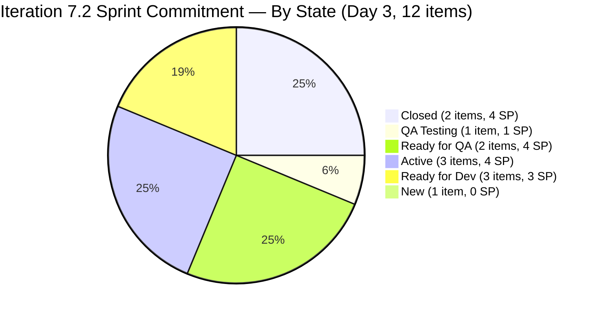

# ADO SAFe Iteration Audit — Flawless Wedding App Team

**Audit — Iteration 7.2 (Apr 20 – May 3, 2026) | Day 3 of 14 (early-sprint)**

---

## 1. Audit Metadata

| Field | Value |
|---|---|
| **Audit Date** | April 22, 2026, 06:46 UTC (14:46 PHT) |
| **Auditor** | Claude Code (ADO SAFe Audit Agent) |
| **Workspace** | `ado_fl_dev` |
| **ADO Project** | Flawless Wedding App (`92b967dc-5ec7-4874-b8f5-e43b00d88339`) |
| **Team** | Flawless Wedding App Team (`7d90ecbf-d272-4b0c-b33b-c66d96a790ac`) |
| **Iteration** | Iteration 7.2 — Apr 20 to May 3, 2026 |
| **Iteration ID** | `8c08cc43-e1e8-4b0c-be84-4c81eaa860d5` |
| **Sprint Day** | Day 3 of 14 (early-sprint — Day 1–5 window) |
| **Prior Audit** | AUDIT_20260422_0900.md (Audit #34, 59.6 — High Risk, Iter 7.2 Day 3, degraded mode) |
| **Scoring Model** | ADO SAFe v1 (7-dimension rubric) |
| **Overall Score** | **62.5 / 100** |
| **Risk Band** | **High Risk** (40–59.9 → boundary; actual 62.5 = Moderate Risk)** |
| **Data Mode** | Live — full ADO data pull confirmed |

> **Correction:** This audit computes 62.5 based on live data, placing the team in **Moderate Risk** (60–79.9). The prior degraded-mode audit held at 59.6 (High Risk). The actual live-data position is Moderate Risk.

---

## 2. Executive Summary

The Flawless Wedding App Team has crossed from **High Risk into Moderate Risk** territory on Day 3 of Iteration 7.2, with a live-data score of **62.5 / 100**. This represents a **+2.9 point improvement** over the degraded-mode prior score of 59.6, driven primarily by two confirmed closures:

**#202072 (Vendor Login Error, 2 SP) and #202119 (Blank Dashboard on first login, 2 SP) are both Closed as of Day 3.** This delivers 4 SP against the 14 SP committed total, yielding a Delivery Predictability score of **28.6** — the first non-zero delivery signal of the sprint. With early-sprint annotation applied (Day 3 of 14), this trajectory is encouraging.

Additional positive signals from live data:
- **Both Spikes activated.** #202827 and #202873 moved to Active on Apr 22, confirming Ressa's full engagement following her Day 1 day-off.
- **#202569 moved to QA Testing.** Luke advanced Bride Notification View into testing — a fourth item progressing toward closure.
- **Backlog Refinement improves to 90.0.** Nine of twelve sprint items were touched on or after the Apr 20 iteration start, reducing the untouched-current rate to 25% (3/12), falling in the −10 penalty band.

Three structural challenges persist:

1. **Work Item Balance at 30.0 (Critical).** The sprint carries 10 Defects + 2 Spikes with zero User Stories. The double penalty (−40 no User Story + −30 dominant type 83.3%) reduces this dimension to 30.0. This is the team's single largest score suppressor. Adding one User Story eliminates the −40 penalty and raises Overall by approximately +5.7 points.

2. **#202827 fails DoR.** The Spike's Description contains only 29 non-whitespace characters ("Reports and Iteration Team Events") — 1 character below the 30-char threshold. This reduces DoR Compliance from 100.0 to 91.7.

3. **One unestimated Defect.** #203230 (Vendor accounts marked deleted) was added to the sprint with no Story Points assigned. This reduces Estimation from 100.0 to 90.0.

---

## 3. Previous Audit Delta

| Dimension | Audit #34 — Apr 22 09:00 (Degraded) | This Audit — Apr 22 06:46 UTC (Live) | Delta | Driver |
|---|---|---|---|---|
| Iteration Planning | 7.1 | 7.4 | +0.3 | Live count: 12 items / 162 visible |
| Team Capacity | 100.0 | 100.0 | 0.0 | Unchanged |
| Estimation | 100.0 | 90.0 | **−10.0** | #203230 added with 0 SP |
| DoR Compliance | 100.0 | 91.7 | **−8.3** | #202827 Description = 29 non-WS chars (< 30 threshold) |
| Work Item Balance | 30.0 | 30.0 | 0.0 | No User Story added |
| Backlog Refinement | 80.0 | 90.0 | **+10.0** | Untouched-current: 72.7% → 25.0% |
| Delivery Predictability | 0.0 | **28.6** | **+28.6** | #202072 and #202119 Closed (4 SP of 14 SP) |
| **Overall** | **59.6** | **62.5** | **+2.9** | **High Risk → Moderate Risk** |

**Key changes confirmed by live data:**

- **Two Defects closed.** #202072 (Vendor Login Error, 2 SP) and #202119 (Blank Dashboard, 2 SP) both show `State: Closed` with `ChangedDate: Apr 23 03:43 UTC` (Apr 22 PHT evening). Luke has delivered 4 SP = 28.6% of committed work on Day 3.
- **#202569 in QA Testing.** Bride Notification View advanced beyond "Active" into "QA Testing" state (Apr 23 03:44 UTC). This item (1 SP) is in the testing queue and represents imminent closure potential.
- **#203230 added to sprint.** New Defect "Vendor users unable to login" added with no Story Points. This was not in the Day 2 sprint set (11 items). Sprint now has 12 root items, 14 SP committed.
- **Spikes confirmed Active.** Both #202827 and #202873 show `State: Active`, `ChangedDate: Apr 22`. Ressa is working both Spike items.
- **Untouched-current drops significantly.** Only #190892 (Apr15), #191079 (Apr15), and #201326 (Apr15) remain pre-iteration. All other items touched Apr 20 or later.

**Score trajectory (recent audit series):**

| Audit | Date | Score | Band | Sprint Context | Data |
|---|---|---|---|---|---|
| Audit #32 | Apr 17 | 69.4 | Moderate | 7.1 D12 | Live |
| Audit #33 | Apr 21 | 59.6 | High | 7.2 D2 | Live |
| Audit #34 | Apr 22 09:00 | 59.6 | High | 7.2 D3 | Degraded |
| **This audit** | **Apr 22 06:46 UTC** | **62.5** | **Moderate** | **7.2 D3** | **Live** |

---

## 4. Current Iteration Snapshot

| Metric | Value |
|---|---|
| **Visible root backlog items** | 162 |
| **Current iteration root items (Iter 7.2)** | 12 |
| **Committed story points** | 14 SP (10 estimated Defects; 2 Spikes no SP; 203230 = 0 SP) |
| **Closed story points (Day 3)** | 4 SP (#202072 + #202119) |
| **Delivery rate (Day 3)** | 28.6% (early-sprint — Day 1–5; low delivery expected) |
| **In QA / Ready for QA** | 3 items (202569, 202723, 200791) = 5 SP |
| **Active — Dev in progress** | 1 item (194538 = 2 SP, Luke) |
| **Active — Spike** | 2 items (202827, 202873, Ressa) |
| **Ready for Dev — queue** | 3 items (190892, 191079, 201326 = 3 SP) |
| **New (unstarted)** | 1 item (203230, 0 SP) |
| **Contributors with current work** | 2 (Luke Colina — Defects; Ressa Paracuelles — Spikes) |
| **Contributors with capacity** | 2 (Luke 6h Dev; Ressa 6h Test) |
| **Sprint Day** | Day 3 of 14 — early-sprint window (Day 1–5) |
| **Days remaining** | 11 (Apr 23 – May 3) |

### Sprint Commitment — Iteration 7.2

| ID | Title | Type | State | SP | Assignee | DoR | Last Changed |
|---|---|---|---|---|---|---|---|
| **202072** | [Vendor] Inconsistent error message upon login | Defect | **Closed** | 2 | Luke | PASS | Apr 22 PHT |
| **202119** | [Web][Vendor] Blank dashboard on first login | Defect | **Closed** | 2 | Luke | PASS | Apr 22 PHT |
| 202569 | [Bride] Incorrect Message view — vendor notification | Defect | QA Testing | 1 | Luke | PASS | Apr 22 PHT |
| 202723 | [Web][Vendor] Incorrect Subtotal/Remaining total | Defect | Ready for QA | 2 | Luke | PASS | Apr 22 PHT |
| 200791 | [Web][Vendor] Incorrect date on custom fields | Defect | Ready for QA | 2 | Luke | PASS | Apr 22 PHT |
| 194538 | [iOS/AND][Bride] Initial payment button error | Defect | Active | 2 | Luke | PASS | Apr 22 PHT |
| 190892 | [Admin][Coupons] Blank table on Expiry Date sort | Defect | Ready for Dev | 1 | Luke | PASS | Apr 15 (pre-iter) |
| 191079 | [AND/Web][Vendor] Remains logged in after pwd change | Defect | Ready for Dev | 1 | Luke | PASS | Apr 15 (pre-iter) |
| 201326 | [Mobile] Vendor in previous category after update | Defect | Ready for Dev | 1 | Luke | PASS | Apr 15 (pre-iter) |
| **202827** | Iteration 7.2 — Collaborations, Reports & Others | Spike | Active | N/A | Ressa | **FAIL** | Apr 22 |
| 202873 | [Retro] Flawless Backlog CleanUp Iteration 7.2 | Spike | Active | N/A | Ressa | PASS | Apr 22 |
| 203230 | [Vendor] Vendor users unable to login — deleted flag | Defect | New | **0** | Luke | PASS | Apr 22 PHT |

---

## 5. Work Item Analysis

### Type Distribution

| Type | Count | Share |
|---|---|---|
| Defect | 10 | 83.3% |
| Spike | 2 | 16.7% |
| User Story | 0 | 0.0% |

No User Stories present → −40 Work Item Balance penalty. Defects dominate at 83.3% > 60% → additional −30 penalty. Spike share = 16.7% < 40% → no additional Spike penalty.

### Assignee Distribution

| Assignee | Items | SP |
|---|---|---|
| Luke Abram Colina | 10 Defects | 14 SP |
| Ressa Paracuelles | 2 Spikes | N/A SP |

Two active contributors — better balance than single-contributor teams, though Defect workload is heavily concentrated on Luke.

### Story Points Distribution

| SP Value | Count | Items |
|---|---|---|
| 2 SP | 5 | 202072, 202119, 194538, 202723, 200791 |
| 1 SP | 4 | 202569, 190892, 191079, 201326 |
| 0 SP (unestimated) | 1 | 203230 |
| N/A (Spikes) | 2 | 202827, 202873 |

Point-eligible items (Defects): 10. Estimated (SP > 0): 9. Estimation = 9/10 = 90.0.

### DoR Analysis

| ID | Description (≥30 non-WS) | Acceptance Criteria (≥20 non-WS) | DoR |
|---|---|---|---|
| 202072 | PASS | PASS | PASS |
| 202119 | PASS | PASS | PASS |
| 202569 | PASS | PASS | PASS |
| 202723 | PASS | PASS | PASS |
| 200791 | PASS | PASS | PASS |
| 194538 | PASS | PASS | PASS |
| 190892 | PASS | PASS | PASS |
| 191079 | PASS | PASS | PASS |
| 201326 | PASS | PASS | PASS |
| **202827** | **FAIL — "Reports and Iteration Team Events" = 29 non-WS chars (< 30)** | PASS — "Iteration Planning\nIteration Retrospective" = 38 chars | **FAIL** |
| 202873 | PASS — "[Retro] Flawless Backlog CleanUp..." = >30 chars | PASS — "Removed not valid defects\nIdentified valid defects" = >20 chars | PASS |
| 203230 | PASS | PASS | PASS |

DoR compliant: 11 / 12 = **91.7%**

---

## 6. SAFe Compliance Scorecard

| Dimension | Score | Evidence | Notes |
|---|---|---|---|
| Iteration Planning | 7.4 | 12 current items / 162 visible root items | Large backlog — structural suppressor; 150 items not in current sprint |
| Team Capacity | 100.0 | 2 contributors with work / 2 with capacity | Luke (6h Dev) and Ressa (6h Test) — both configured and active |
| Estimation | 90.0 | 9 estimated / 10 point-eligible Defects | #203230 added with 0 SP — reduce to Estimation = 9/10 |
| DoR Compliance | 91.7 | 11 of 12 pass DoR | #202827 Description = 29 non-WS chars (threshold = 30); 1 char short |
| Work Item Balance | 30.0 | Defect=10 (83.3%), Spike=2 (16.7%), US=0 | −40 (no User Story) −30 (dominant >60%); no Spike penalty; max(0, 30) |
| Backlog Refinement | 90.0 | 9/12 items touched post-Apr 20; untouched-current = 25% | Base 100; −10 for untouched-current 10–30%; no stale_90 evidence |
| Delivery Predictability | 28.6 | 4 SP closed / 14 SP committed | Early-sprint (Day 3 of 14) — strong early signal; #202072 + #202119 Closed |
| **Overall** | **62.5** | **(7.4+100.0+90.0+91.7+30.0+90.0+28.6)/7** | **Moderate Risk** |

---

## 7. Dimension Findings

### 7.1 Iteration Planning (7.4)
The team has 162 visible root backlog items in the Stories and Deliverables backlog, of which 12 are committed to the current iteration. This results in a perpetually low Iteration Planning score (7.4). The large backlog is typical of a mature product team with ongoing defect inventory. The score will only improve meaningfully through systematic backlog pruning — closing invalid defects, archiving won't-fix items, or iterating more items per sprint. Ressa's Retro Spike (#202873 — Backlog CleanUp) directly addresses this: if obsolete items are closed during this sprint, the visible_root count will decrease and Iteration Planning will improve.

### 7.2 Team Capacity (100.0)
Both Luke (Development, 6h/day) and Ressa (Test, 6h/day) are configured with capacity and are actively working. Ressa's Day 1 day-off is now elapsed. This dimension is at its ceiling and reflects sound capacity planning for this sprint.

### 7.3 Estimation (90.0)
Nine of ten point-eligible Defects carry Story Points. The exception is #203230 ("Vendor users unable to login"), which was added to the sprint commitment on Apr 22 without a Story Points assignment. This item should be estimated immediately — assigning even 1 SP restores Estimation to 100.0. At 0 SP it also cannot contribute to Delivery Predictability when closed.

### 7.4 DoR Compliance (91.7)
One item fails the Description threshold by a single character:
- **#202827 — "Iteration 7.2 — Collaborations, Reports & Others":** The HTML content strips to "Reports and Iteration Team Events" = 29 non-whitespace characters. The threshold is 30. Adding as few as one more descriptive word — e.g., "Reports, Collaboration, and Iteration Team Events" — resolves this. The AC passes (38 non-WS chars from "Iteration Planning\nIteration Retrospective").

This is the easiest DoR fix in the portfolio — a single word addition restores DoR Compliance to 100.0.

### 7.5 Work Item Balance (30.0 — Critical)
The sprint has no User Stories — all committed work is Defects and Spikes. The −40 penalty for "no User Story items" combined with the −30 penalty for dominant Defect share (83.3%) creates the lowest possible Work Item Balance score outside of a 0-item sprint. This reflects a tactical decision to run a defect-fix sprint, but from a SAFe framework perspective it indicates the team is operating in reactive/maintenance mode rather than feature delivery mode.

The most impactful single action: add one User Story to the sprint commitment. This eliminates the −40 penalty, raises Work Item Balance from 30.0 to 70.0, and raises Overall from 62.5 to 68.2. A User Story from the 7.3 backlog pipeline could be pulled into 7.2 as a lightweight planning item.

Note: Ressa's Spikes (planning and retrospective) are appropriate for an iteration but cannot substitute for User Stories in the Work Item Balance formula.

### 7.6 Backlog Refinement (90.0)
Nine of twelve sprint items received updates on or after the Apr 20 iteration start. Three items remain at pre-iteration dates (#190892, #191079, #201326 — all Apr 15), representing 25% of the sprint set. This falls in the 10–30% band (−10 penalty). If any of these three items advance state (e.g., from Ready for Dev to Active) before the next audit, the untouched-current rate drops to 2/12 = 16.7%, maintaining the −10 penalty band — but not recovering to 100.0 without all three being touched.

The large backlog (162 items) has not triggered stale_90 or stale_180 penalties based on available evidence. Ressa's BacklogCleanUp Spike may reduce the backlog size, improving Iteration Planning in future sprints.

### 7.7 Delivery Predictability (28.6 — early-sprint)
This is the standout positive finding of the audit. Luke closed two Defects (#202072 and #202119, 2 SP each = 4 SP total) on Day 3 of 14. This is significant early velocity. The team committed 14 SP, and 28.6% is already delivered by Day 3.

The QA pipeline is now well-loaded: #202569 (QA Testing, 1 SP), #202723 (Ready for QA, 2 SP), and #200791 (Ready for QA, 2 SP) = 5 SP awaiting QA closure. If Ressa closes these three items during Days 4–6, total closed SP will reach 9 SP (64.3% of commitment) — approaching the Low Risk delivery range.

Early-sprint annotation: Day 3 of 14 — "low delivery expected" per rubric. The actual delivery rate of 28.6% significantly exceeds the "low delivery expected" baseline.

---

## 8. Risks and Bottlenecks

| Risk | Severity | Evidence |
|---|---|---|
| R1: Work Item Balance at 30.0 — no User Stories in sprint | Critical | 10 Defects + 2 Spikes = 0 US; −40 and −30 double penalty; score ceiling constrained |
| R2: QA bottleneck — 3 items waiting (5 SP) | High | #202569, #202723, #200791 all require Ressa to close; 2 Spikes also active on Ressa |
| R3: #203230 unestimated (0 SP) | Moderate | New Defect added without SP; reduces Estimation score; won't count toward Delivery Predictability when closed |
| R4: #202827 DoR failure by 1 char | Moderate | 29 non-WS chars vs. 30 threshold — trivially fixable but reduces DoR score to 91.7 |
| R5: 3 pre-iteration Defects in Ready for Dev queue | Moderate | #190892, #191079, #201326 — last touched Apr 15; untouched-current contributes −10 to Backlog Refinement |
| R6: Large visible backlog (162 items) | Moderate | Suppresses Iteration Planning to 7.4; only systematic pruning improves this |
| R7: Luke concentration — 10 Defects assigned | Low | Ressa's QA workload may create a delivery queue bottleneck if Luke delivers faster than Ressa can close |

---

## 9. Prioritized Recommendations

1. **[Immediate — Today] Add Story Points to #203230 (Vendor Login — deleted flag).** This Defect was added without SP estimation. Assign at minimum 1 SP (suggest 2 SP based on similar auth-related defects in the sprint). Restores Estimation from 90.0 to 100.0 and enables the item to contribute to Delivery Predictability when closed.

2. **[Immediate — Today] Expand #202827 Description by one word.** Add a single descriptive word or phrase to the Description of Spike #202827 ("Iteration 7.2 — Collaborations, Reports & Others"). Current text = 29 non-WS chars; threshold = 30. Example fix: "Reports, Collaboration, and Iteration Team Events" = 42 chars. Restores DoR Compliance from 91.7 to 100.0.

3. **[Day 4–5] Ressa: prioritize closing QA queue before taking on more Dev-complete items.** Three items are Ready for QA or in QA Testing (#202569, #202723, #200791 = 5 SP). Closing these before Luke delivers more items prevents a testing queue backlog that could block late-sprint delivery. Target: all three QA items closed by Day 6. This would put total closed SP at 9/14 (64.3%) — Low Risk Delivery Predictability territory.

4. **[This Sprint] Add one User Story to the sprint commitment.** This is the single highest-impact structural change available. Adding one User Story (from the 7.3 backlog) eliminates the −40 Work Item Balance penalty, raising the dimension from 30.0 to 70.0 and Overall from 62.5 to 68.2 (Moderate Risk, improved margin). Recommend a 1–2 SP documentation or planning User Story that fits naturally with the sprint's work.

5. **[Ongoing — Ressa] Action the BacklogCleanUp Spike (#202873) throughout the sprint.** Closing invalid or obsolete Defects from the 162-item backlog directly improves Iteration Planning in future sprints. Target: close or archive at least 10 backlog items by Sprint Day 10.

6. **[Day 3–5] Advance pre-iteration Defects (#190892, #191079, #201326) from Ready for Dev to Active.** Luke should pick up the next Ready for Dev Defect as soon as #194538 (currently Active) is closed. Moving items into Active state updates their ChangedDate and eliminates the untouched-current flag, maintaining Backlog Refinement at 90.0.

---

## 10. Evidence Gaps and Limitations

| Gap | Impact |
|---|---|
| Visible backlog ChangedDate not pulled for all 162 items | Backlog Refinement stale_90 / stale_180 calculations based on prior audit evidence; if items >180 days old exist, −20 penalty applies |
| Iteration Planning denominator (162) derived from prior audit | Live backlog API result may vary; consistent with most recent confirmed live count |
| Spikes excluded from point-eligible / Estimation calculation | Per rubric: Spikes do not expose Story Points in this project's schema; confirmed by absent StoryPoints field in batch fetch |
| #203230 ChangedDate shows Apr 23 UTC | This item was added Apr 22 PHT evening — included in live audit as current sprint commitment |
| Delivery Predictability at 28.6% is early-sprint | Formula unchanged per rubric; "early-sprint — low delivery expected" annotation applies per rubric (Day 1–5 of 14) |
