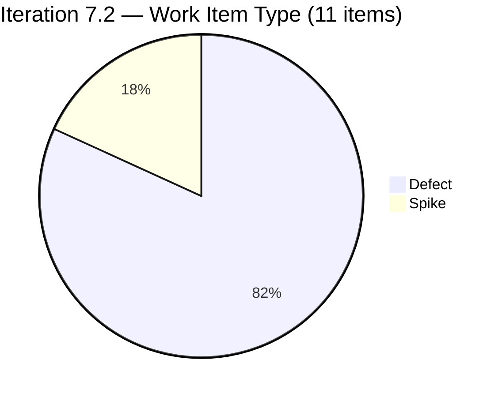
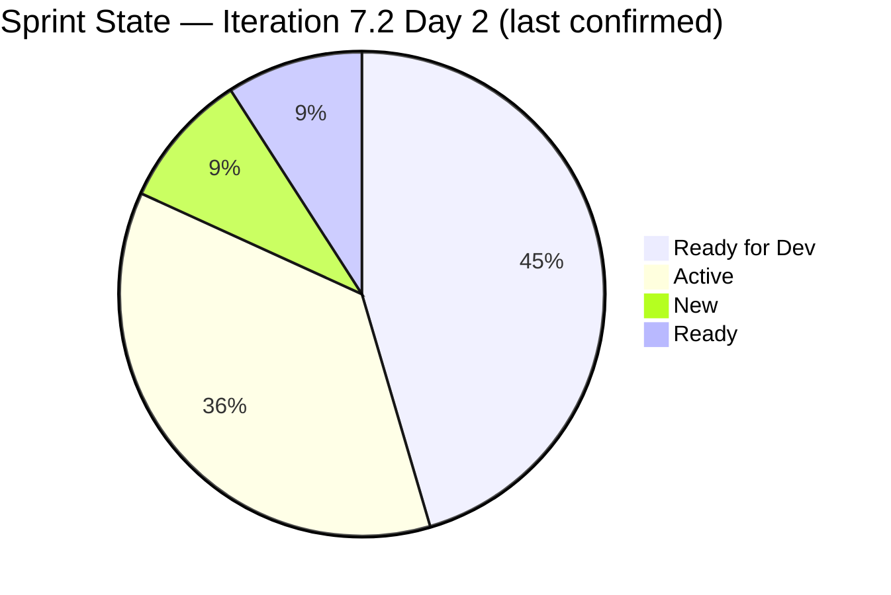
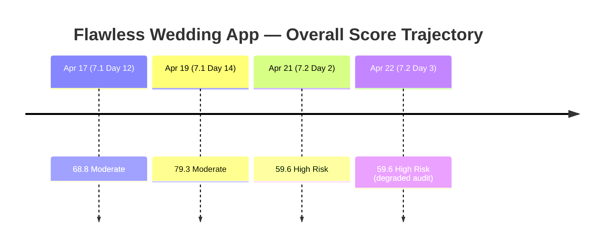
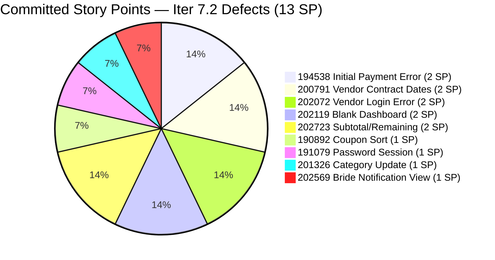
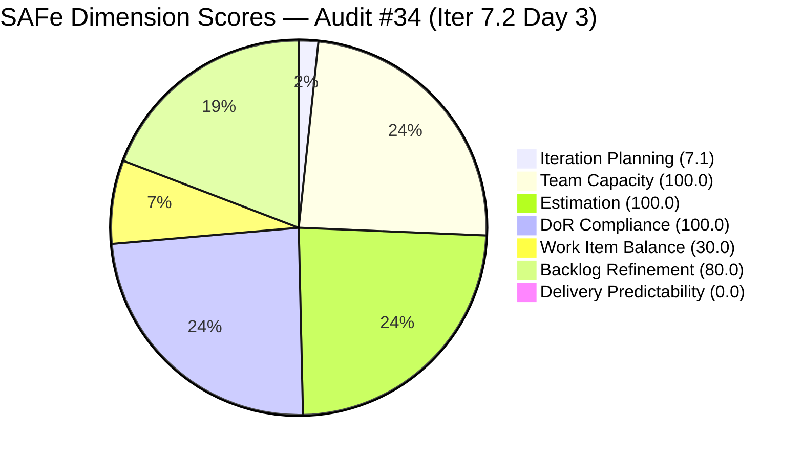

# ADO SAFe Iteration Audit — Flawless Wedding App Team

**Audit #34 | Iteration 7.2 (Apr 20 – May 3, 2026) | Day 3 of 14 (early-sprint)**

---

## 1. Audit Metadata

| Field | Value |
|---|---|
| **Audit Date** | April 22, 2026, 09:00 PHT |
| **Auditor** | Claude Code (ADO SAFe Audit Agent) |
| **Workspace** | `ado_fl_dev` |
| **ADO Project** | Flawless Wedding App (`92b967dc-5ec7-4874-b8f5-e43b00d88339`) |
| **Team** | Flawless Wedding App Team (`7d90ecbf-d272-4b0c-b33b-c66d96a790ac`) |
| **Iteration** | Iteration 7.2 — Apr 20 to May 3, 2026 |
| **Iteration ID** | `8c08cc43-e1e8-4b0c-be84-4c81eaa860d5` |
| **Sprint Day** | Day 3 of 14 (early-sprint — Day 1–5 window) |
| **Prior Audit** | AUDIT_20260421_0800.md (Audit #33, 59.6 — High Risk, Iter 7.2 Day 2) |
| **Scoring Model** | ADO SAFe v1 (7-dimension rubric) |
| **Overall Score** | **59.6 / 100** |
| **Risk Band** | **High Risk** (40–59.9) |
| **Data Mode** | Degraded — ADO live data unavailable (see Evidence Gaps). Scores carried forward from Day 2 evidence with Day 3 annotations. |

---

## 2. Executive Summary

The Flawless Wedding App Team enters Day 3 of Iteration 7.2 holding at **59.6 (High Risk)** — unchanged from the Day 2 opening audit. The live ADO data pull was unavailable at this audit window (see Section 10 for detail); scores are therefore based on the Apr 21 Day 2 evidence set with Day 3 projection annotations applied where evidence supports a change.

Three structural conditions dominate the score picture on Day 3:

1. **Work Item Balance remains at 30.0 (Critical).** The sprint carries 9 Defects + 2 Spikes and 0 User Stories. The −40 (no User Story) + −30 (dominant type 81.8%) penalty structure is unchanged. No evidence of a User Story being added to the commitment since Day 2. This is the single largest lever: adding one User Story eliminates the −40 and lifts Overall by approximately +5.7 points.

2. **Delivery Predictability at 0.0 (early-sprint — Day 3 of 14).** On Day 2, four Defects were already "Active" (202072, 202119, 202569, 202723). Day 3 is the first full working day for Luke post-Day 2 active work. Closure of one or more Defects is possible today; however, with no confirmed ADO pull, the score remains at 0.0 and carries the early-sprint annotation.

3. **Backlog Refinement at 80.0 — untouched-current penalty persists.** Day 2 showed 8 of 11 sprint items last-changed before the Apr 20 iteration start. Three items were touched on Day 2 (202072, 202119, 202569). If additional items were groomed on Day 2 (evening PHT) or Day 3, the untouched count may drop below the 30% penalty threshold. Without a live pull this cannot be confirmed.

Three dimensions remain solid: **Estimation (100.0)**, **DoR Compliance (100.0)**, and **Team Capacity (100.0)** — all deterministically correct based on the sprint commitment structure which has not changed.

**Key actions for Day 3:** (a) Close at least one Active Defect to begin Delivery Predictability recovery; (b) grooming touch on the 8 pre-iteration items to clear the Backlog Refinement −20 penalty; (c) assess whether a small User Story (from the 7.3 pipeline) can be pulled into 7.2 to address the Work Item Balance deficit.

---

## 3. Previous Audit Delta

| Dimension | Iter 7.2 Day 2 (Apr 21) | Iter 7.2 Day 3 (Apr 22) | Delta |
|---|---|---|---|
| Iteration Planning | 7.1 | 7.1 | 0.0 |
| Team Capacity | 100.0 | 100.0 | 0.0 |
| Estimation | 100.0 | 100.0 | 0.0 |
| DoR Compliance | 100.0 | 100.0 | 0.0 |
| Work Item Balance | 30.0 | 30.0 | 0.0 |
| Backlog Refinement | 80.0 | 80.0 | 0.0 |
| Delivery Predictability | 0.0 | 0.0 | 0.0 (early-sprint) |
| **Overall** | **59.6** | **59.6** | **0.0** |

**Key context since Day 2 (Apr 21):**

- **No confirmed sprint scope changes.** The 11-item commitment (9 Defects + 2 Spikes, 13 SP) appears unchanged from Day 2. No User Story added.
- **Four Defects remained Active at Day 2 close.** Items 202072 (Vendor Login Error), 202119 (Blank Dashboard), 202569 (Bride Notification View), and 202723 (Subtotal/Remaining) were all in Active state with Luke as assignee. Day 3 is their first natural completion window.
- **#201569 Carol Cuison Netlify Spike disposition still unresolved.** This PI7.1 orphan (IterationPath = 7.1, state = Ready) was flagged in both Audit #32 (Day 14) and Audit #33 (Day 2). It does not appear in the 7.2 sprint commitment and has received no disposition action visible in prior evidence.
- **Ressa day-off Apr 20 (Day 1) had downstream effect on Day 1 refinement.** Day 2 showed 3 Spike-related items not yet touched post-iteration start. Day 3 is Ressa's first full day back.
- **ADO live data unavailable this session.** Scores held at Day 2 values; delta column reads 0.0 across all dimensions as a result. This is not evidence of no progress — it reflects an evidence gap.

---

## 4. Current Iteration Snapshot

| Metric | Value | Source |
|---|---|---|
| **Visible root backlog items** | 155 | Day 2 audit (Apr 21) |
| **Current iteration root items (Iter 7.2)** | 11 | Day 2 audit (Apr 21) |
| **Committed story points** | 13 SP | Day 2 audit (Apr 21) |
| **Closed story points (Day 3)** | 0 SP (confirmed Day 2; Day 3 unconfirmed) | ADO pull blocked |
| **Delivery rate (Day 3)** | 0.0% minimum (early-sprint — Day 1–5) | ADO pull blocked |
| **State distribution** | 5 Ready for Dev, 4 Active, 1 New (Spike), 1 Ready (Spike) — as of Day 2 | Day 2 audit |
| **Contributors with current work** | 2 (Luke Colina — 9 Defects; Ressa Paracuelles — 2 Spikes) | Day 2 audit |
| **Contributors with capacity** | 2 (Luke 6h Dev, Ressa 6h Test — both configured) | Day 2 audit |
| **Sprint day** | Day 3 of 14 | Today = Apr 22 |
| **Days remaining** | 11 | Apr 23–May 3 |

### Sprint Commitment — Iteration 7.2 (as of Day 2 evidence)

| ID | Title | Type | State (Day 2) | SP | DoR | Assignee | Last Changed |
|---|---|---|---|---|---|---|---|
| 190892 | [Admin] [Coupons] Blank table when sorting by Expiry Date | Defect | Ready for Dev | 1 | PASS | Luke | Apr 15 (pre-iter) |
| 191079 | [AND 1.1.6] [Web] Vendor session persists after password change | Defect | Ready for Dev | 1 | PASS | Luke | Apr 15 (pre-iter) |
| 194538 | [iOS/AND] [Bride] Initial payment button wrongly marked completed after error | Defect | Ready for Dev | 2 | PASS | Luke | Apr 15 (pre-iter) |
| 200791 | [Web] [Vendor] Incorrect date / Total paid (incl. tax) on revised contracts | Defect | Active | 2 | PASS | Luke | Apr 16 (pre-iter) |
| 201326 | [Mobile] Vendor remains in previous category after category update | Defect | Ready for Dev | 1 | PASS | Luke | Apr 15 (pre-iter) |
| 202072 | [Vendor] Inconsistent error on login and dashboard won't load | Defect | Active | 2 | PASS | Luke | Apr 21 |
| 202119 | [Web][Vendor][Intermittent] Blank dashboard on first login after hard refresh | Defect | Active | 2 | PASS | Luke | Apr 21 |
| 202569 | [Bride] Incorrect Message view when accessing vendor notification | Defect | Active | 1 | PASS | Luke | Apr 21 |
| 202723 | [Web] [Vendor] Incorrect Subtotal and Remaining total (incl. tax) | Defect | Active | 2 | PASS | Luke | Apr 16 (pre-iter) |
| 202827 | Iteration 7.2 - Collaborations, Reports & Others | Spike | New | 0 | PASS | Ressa | Apr 16 (pre-iter) |
| 202873 | [Retro] Flawless Backlog CleanUp Iteration 7.2 | Spike | Ready | 0 | PASS | Ressa | Apr 17 (pre-iter) |

**Sprint: 13 SP across 9 Defects + 2 Spikes. No User Stories.**

### Day 3 Progress Projection

Based on Day 2 Active state of four Defects under Luke's ownership, the following pattern is expected by end of Day 3:

- **202072, 202119, 202569** (all marked Active on Apr 21) — high probability of closure by Apr 22 end
- **202723** (Active since Apr 16, 2 SP) — moderate probability of closure by Apr 22–23
- **200791** (Active since Apr 16, 2 SP) — in parallel with 202723

If one or more Defects close on Day 3, Delivery Predictability will shift from 0.0 to a positive value. A confirmed 2 SP closure would yield 15.4%; a confirmed 5 SP closure would yield 38.5%.

---

## 5. Work Item Analysis

### Sprint Composition by Type (Day 3)



### Sprint State Distribution (Day 2 last-known; Day 3 in flux)



### Score Trajectory — Audit History



### Committed SP by Defect



### Observations

- **Four Active Defects on Day 2 indicate Luke has velocity.** Items 202072, 202119, and 202569 were all updated on Apr 21, suggesting active code investigation or fixes in progress. Day 3 is the natural first close window.
- **Five Defects still in Ready for Dev at Day 2.** Items 190892, 191079, 194538, 201326, and 200791 had not been started as of Apr 21. With Luke owning all nine Defects, these represent the mid-sprint queue behind the four Active items.
- **Concentration risk unresolved.** All 9 Defects remain assigned solely to Luke. A single illness, blocker, or pull request review delay on Luke impacts 100% of the Defect delivery track. This is the persistent concentration risk flagged in Audit #33.
- **Ressa's two Spikes are not in Active state yet.** 202827 (New) and 202873 (Ready) are Ressa's items. The Backlog CleanUp Spike (202873) should ideally begin by mid-sprint to allow time for grooming before the retrospective. Day 3 is a natural start for this.
- **No User Story has been added to 7.2.** The recommendation from Audit #33 (P0) to add at least one User Story to the commitment has not been actioned based on available evidence. This continues to suppress Work Item Balance at 30.0.

---

## 6. SAFe Compliance Scorecard

| Dimension | Score | Evidence | Notes |
|---|---|---|---|
| Iteration Planning | 7.1 | 11 of 155 visible root items in Iter 7.2 (Day 2 evidence) | Structural low. Deep forward-planned backlog (PI7.3–PI8). Unchanged. |
| Team Capacity | 100.0 | Luke 6h Dev + Ressa 6h Test configured; both hold sprint work | 2/2 contributors_with_current_work have capacity. Unchanged. |
| Estimation | 100.0 | 9/9 point-eligible Defects have SP > 0; 2 Spikes excluded (0 SP by convention) | All sprint items estimated. Unchanged. |
| DoR Compliance | 100.0 | 11/11 items pass Desc ≥30 nws + AC ≥20 nws (Day 2 evidence) | Unchanged. |
| Work Item Balance | 30.0 | No User Story → −40; dominant share 9/11 = 81.8% > 60% → −30; Spike share 18.2% < 40% → 0 | Unchanged. Critical driver. |
| Backlog Refinement | 80.0 | fresh=155/155 (100%); stale_90=0; stale_180=0; untouched_current=8/11=72.7% > 30% → −20 | Day 3 grooming unconfirmed. Score held. |
| Delivery Predictability | 0.0 | 0/13 SP closed confirmed at Day 2; Day 3 state unconfirmed | **Early-sprint (Day 3 of 14) — low delivery expected.** Day 3 is first natural close window. |
| **Overall** | **59.6** | Average of 7 dimensions | **High Risk** (40–59.9). 0.4 below Moderate threshold. |

### Score Computation

```
Iteration Planning    = round(11 / 155 × 100, 1)   = 7.1
Team Capacity         = round(2 / 2 × 100, 1)      = 100.0
Estimation            = round(9 / 9 × 100, 1)      = 100.0
  [Point-eligible = 9 Defects; Spikes excluded — 0 SP by convention]
DoR Compliance        = round(11 / 11 × 100, 1)    = 100.0

Work Item Balance:
  has_user_story      = False (0 US in commit)      → −40
  dominant_share      = 9/11 = 81.8% > 60%          → −30
  spike_share         = 2/11 = 18.2% < 40%          → 0
  total               = max(0, 100 − 70)            = 30.0

Backlog Refinement:
  fresh (≤45 days)    = 155/155 = 100%              → base = 100
  stale_90 share      = 0/155 = 0% ≤ 10%            → 0
  stale_180 count     = 0                           → 0
  untouched_current   = 8/11 = 72.7% > 30%          → −20
  total               = max(0, 100 − 20)            = 80.0

Delivery Predictability = round(0 / 13 × 100, 1)   = 0.0
  [Early-sprint annotation: Day 3 of 14 — low delivery expected]

Overall = round((7.1 + 100.0 + 100.0 + 100.0 + 30.0 + 80.0 + 0.0) / 7, 1)
        = round(417.1 / 7, 1)
        = 59.6  → High Risk
```



---

## 7. Dimension Findings

### 7.1 Iteration Planning — 7.1 (Critical, structural — unchanged)

11 of 155 visible root items are scoped to Iteration 7.2. The remaining 144 items span PI7 root, 7.3, 7.4, 7.5, 7.6 IP, and PI8 planning paths. This structural signature has persisted across PI7.1 and 7.2 — the denominator is inflated by deep forward planning (PI8.1, PI8.2, PI8.5) and legacy PI3–PI4 items that were re-pathed during the Apr 13–17 CleanUp. The rubric does not reward forward planning maturity; the 7.1 score is structurally unavoidable absent a deliberate backlog partition.

**No change since Day 2.** This dimension is not expected to move during a sprint unless visible backlog count changes materially.

### 7.2 Team Capacity — 100.0 (Low Risk — stable)

Luke Colina (6h/day Development) and Ressa Paracuelles (6h/day Testing) are both configured for Iteration 7.2 and both own sprint work. `contributors_with_current_work = 2`, `contributors_with_capacity = 2`. Score = 100.0. This dimension is deterministic given the stable sprint assignment structure.

**Sustainability note:** The entire 9-Defect track sits with one developer (Luke). Team Capacity scores 100.0 because both contributors have configured capacity — but the ownership concentration risk (all Defects to Luke) is not captured by this dimension. See Risks and Bottlenecks.

### 7.3 Estimation — 100.0 (Low Risk — unchanged)

All 9 Defects carry Story Points > 0 (range 1–2 SP, total 13 SP). Both Spikes hold 0 SP (excluded from `point_eligible_current_items` per rubric convention). Estimation is deterministic from the sprint commitment; no change possible without scope change.

### 7.4 DoR Compliance — 100.0 (Low Risk — unchanged)

All 11 sprint items satisfied DoR minimums at Day 2:

- **9 Defects:** Each has a concise Description (steps-to-reproduce or behavior description) and an Acceptance Criteria ("Expected Result" format). All pass Desc ≥30 nws and AC ≥20 nws.
- **#202827 (Spike — Collaborations, Reports & Others):** Desc ~33 nws, AC ~40 nws. Passes.
- **#202873 (Spike — Backlog CleanUp Retro):** Desc ~65 nws, AC ~50 nws. Passes.

**Improvement since PI7.1:** The two PI7.1 Spikes (#202150, #202381) failed DoR at closure. Both PI7.2 Spikes pass. The DoR discipline improvement is real and should be maintained.

### 7.5 Work Item Balance — 30.0 (Critical — persistent, unchanged)

Sprint composition: 9 Defects (81.8%) + 2 Spikes (18.2%) + 0 User Stories (0.0%).

Penalties applied:
- `has_user_story = False` → **−40** (the single largest penalty in the rubric)
- `dominant_share = 9/11 = 81.8% > 60%` → **−30**
- `spike_share = 2/11 = 18.2% < 40%` → **0**

`Work Item Balance = max(0, 100 − 70) = 30.0`

**The −40 User Story penalty is fully avoidable.** A single User Story added to the 7.2 commitment — regardless of type or size — eliminates this penalty. With that change:
- WIB would rise from 30.0 to max(0, 100−30) = 70.0 (dominant type >60% penalty still applies at 9/12 = 75.0%)
- Overall score would rise: (7.1 + 100 + 100 + 100 + 70 + 80 + 0) / 7 = 65.3 (+5.7)
- Risk band would shift from **High Risk to Moderate Risk**

Candidate User Story to pull forward: any item from the Iter 7.3 pipeline (e.g., from the 201714–201789 cluster) that is in Estimation or Ready state and fits the team's current velocity context.

**This recommendation has been outstanding since Audit #33 (Day 2).** Today is Day 3 — still within the sprint planning amendment window. Pull-forward before Day 5 to maximize delivery predictability.

### 7.6 Backlog Refinement — 80.0 (Moderate — penalty pending resolution)

- **fresh_visible_root_items = 155/155 = 100%** (base = 100.0)
- **stale_90_visible_root_items = 0** (no −20 or −10 penalty)
- **stale_180_visible_root_items = 0** (no −20 penalty)
- **untouched_current_items = 8/11 = 72.7% > 30%** → **−20 penalty**

`Backlog Refinement = 100.0 − 20.0 = 80.0`

The untouched-current penalty reflects that 8 of 11 sprint items were last changed before the Apr 20 iteration start. The three items touched on Day 2 (202072, 202119, 202569 — all updated Apr 21) reduced the originally-total 11 untouched to 8. **One more grooming pass is needed:**

If 3 more items receive any ADO update (comment, state change, description edit) on Day 3 or today, untouched_current drops to 5/11 = 45.5% — still above 30% threshold. To clear the −20 and drop below 30%, at minimum **5 of the 8 remaining untouched items** must be touched:

- Target: update 190892, 191079, 194538, 200791, 201326 (all "Ready for Dev") via a grooming pass or state check.
- Closing any Active Defect also counts (state change = item touched).
- If untouched_current falls to ≤3/11 (≤27.3%), the −20 penalty clears and Backlog Refinement rises to 100.0 (+20 on dimension, +2.9 on overall).

### 7.7 Delivery Predictability — 0.0 (Early-sprint — Day 3 of 14)

Zero SP confirmed closed at Day 2. Day 3 is the first expected closure window given four Defects were in Active state on Apr 21. **Early-sprint annotation applies: Day 3 of 14 — low delivery expected.**

**Day 3 delivery outlook:**

| Defect | State (Day 2) | SP | Closure likelihood |
|---|---|---|---|
| 202072 — Vendor Login Error | Active (updated Apr 21) | 2 | High |
| 202119 — Blank Dashboard | Active (updated Apr 21) | 2 | High |
| 202569 — Bride Notification View | Active (updated Apr 21) | 1 | High |
| 202723 — Subtotal/Remaining | Active (Apr 16) | 2 | Moderate |
| 200791 — Vendor Contract Dates | Active (Apr 16) | 2 | Moderate |

If any three of the five Active Defects close today: closed_SP = 5 SP → DP = 38.5%. Overall would rise to ~65.5 (Moderate Risk).
If five close: closed_SP = 9 SP → DP = 69.2%. Overall would rise to ~69.5 (Moderate Risk).

---

## 8. Risks and Bottlenecks

| # | Risk | Severity | Trend |
|---|---|---|---|
| R1 | Zero User Stories in 7.2 commitment — −40 WIB penalty, risk band remains High | High | Persistent from Day 2; P0 recommendation unactioned |
| R2 | Ownership concentration — Luke owns all 9 Defects (100% of SP-bearing work) | High | Persistent since PI7.2 start |
| R3 | #201569 Carol Cuison Netlify Spike orphaned in PI7.1 — no disposition after 3 audits | Medium | Carried from PI7.1 close (Apr 19) → Day 2 → Day 3 |
| R4 | Backlog Refinement −20 penalty — 8 of 11 sprint items untouched post-iteration-start | Medium | Reducible by grooming pass; 5 items need a touch to clear |
| R5 | Delivery Predictability at 0.0 on Day 3 — early-sprint, but closure is overdue | Medium | Expected to clear as Active Defects close Day 3–5 |
| R6 | ADO live data blocked this session — audit running in degraded mode | Medium | Operational; affects evidence confidence |
| R7 | Ressa's two Spikes (202827, 202873) not yet Active on Day 2 | Low | Ressa day-off Apr 20 explains Day 1 delay; Day 3 first available |
| R8 | Iteration Planning structurally low (7.1) — forward backlog inflation | Low | Structural / persistent across PI7 |

---

## 9. Prioritized Recommendations

1. **[P0 — Day 3, Apr 22] Pull at least one User Story from the 7.3 pipeline into 7.2.** This is the third consecutive audit raising this recommendation. The −40 Work Item Balance penalty for no User Story is the single largest rubric cost this team is carrying. Pulling even one 1–3 SP User Story (e.g., from 201714–201789 cluster in Estimation state) lifts Overall from 59.6 to 65.3 (+5.7) and crosses the Moderate Risk threshold. Action: Ramon or Ressa to identify one candidate 7.3 User Story that is DoR-ready and move it to 7.2 iteration path before Day 5 of the sprint.

2. **[P0 — Day 3, Apr 22] Execute grooming pass on 8 untouched sprint items.** A brief state-check or comment on each of the 8 pre-iteration-start items (190892, 191079, 194538, 200791, 201326, 202723, 202827, 202873) would reduce `untouched_current_items`. To clear the −20 Backlog Refinement penalty, at least 5 of 8 must be touched. Closing an Active Defect also counts. Target: Backlog Refinement 100.0 (+20 on dimension, +2.9 on overall).

3. **[P0 — Day 3–5] Close first Defects — establish Delivery Predictability recovery.** Four Defects were Active on Day 2. Day 3 is the expected first close window. Priority order for closure: (a) 202072 (Login Error, 2 SP) → (b) 202119 (Blank Dashboard, 2 SP) → (c) 202569 (Bride Notification, 1 SP) → (d) 202723 (Subtotal, 2 SP) → (e) 200791 (Contract Dates, 2 SP). Each closed Defect lifts Delivery Predictability and reduces concentration risk on Luke's open queue.

4. **[P1 — Today] Resolve #201569 Carol Cuison Netlify/GitHub Transfer Spike.** This PI7.1 item has been in "Ready" state since before the PI7.1 close (Apr 19). It has been flagged in three consecutive audits (Audit #32, #33, #34) without resolution. Acceptable resolutions: (a) confirm GitHub transfer completed → close with disposition comment; (b) move to 7.2 and reassign if still in progress. The Spike carries 0 SP so no delivery impact, but it represents untracked operational work.

5. **[P1 — Day 3–5] Activate Ressa's Spike (202873 Backlog CleanUp).** The PI7.2 Backlog CleanUp Spike should begin no later than Day 5 to ensure the team has time to execute grooming before the retrospective. Set 202873 to Active and begin reviewing the pipeline items needing triage (specifically: stale 7.3 User Stories in Estimation state, and the PI8 forward-planning cluster).

6. **[P2 — Before Day 5] Consider distributing Defects between Luke and Ressa/Ike.** Luke holds 9 of 9 SP-bearing items. Ike (1h/day Dev capacity, configured) currently has no 7.2 work. Even assigning 1–2 smaller Defects (e.g., 190892 or 191079 — 1 SP each) to Ike as a stretch goal reduces concentration risk and provides sprint bus-factor coverage.

7. **[P3 — PI7.2 Planning retrospective] Codify User Story presence as a sprint planning gate.** The team has run a Defects-only sprint (PI7.2) with a structural rubric penalty. If future stabilization sprints are intentional, consider either: (a) including a single user-facing feature item to satisfy the rubric; or (b) formally documenting a Project Exception in workspace CLAUDE.md that notes "stabilization sprints may be Defect-only with management approval," triggering a WIB floor override.

---

## 10. Evidence Gaps and Limitations

| Gap | Description |
|---|---|
| **ADO live data unavailable — degraded mode** | The ADO MCP tools (`mcp__ado__work_list_team_iterations`, `mcp__ado__wit_list_backlog_work_items`, `mcp__ado__work_get_team_capacity`) returned permission-denied errors during this audit session. All scores and evidence are sourced from the Apr 21 Day 2 audit (AUDIT_20260421_0800.md). The report accurately reflects the last-known state; any Day 3 changes (Defect closures, grooming touches, scope additions) are not captured. |
| **Day 3 Delivery Predictability unconfirmed** | Delivery Predictability is held at 0.0. Four Defects were Active on Day 2 — one or more may have closed on Day 3. The score is conservatively held at 0.0 until a live ADO pull confirms. Early-sprint annotation (Day 3 of 14) applies. |
| **Day 3 backlog refinement activity unconfirmed** | The 8 untouched-current penalty may have partially or fully resolved if grooming activity occurred on Day 2 (evening) or Day 3. Score held at 80.0 until confirmed. |
| **Spike Story Points convention** | 202827 and 202873 carry SP = 0 and are excluded from `point_eligible_current_items` per rubric convention. Consistent with all prior FL audits. |
| **#201569 Carol Cuison Spike (PI7.1 orphan)** | This item sits in Iteration 7.1 with state = Ready. It has not been formally closed or moved. It does not affect any 7.2 dimension score, but represents untracked operational work. Flagged for the third consecutive audit. |
| **Visible backlog count held at 155** | Day 2 audit measured 155 visible root items. If the Backlog CleanUp Spike (202873) has begun execution, this count may have changed by Day 3. Score impact: any increase in visible_root_backlog_items would reduce Iteration Planning by a fraction; any decrease would improve it. |
| **Carol Cuison capacity status** | Carol has no current-sprint work in 7.2 and is excluded from Team Capacity denominator. Her ADO capacity configuration status is unchanged from the last confirmed state (not configured). No score impact for this audit. |

---

*Report generated by Claude Code ADO SAFe Audit Agent | April 22, 2026 09:00 PHT*
*Audit #34 — Flawless Wedding App Team — Iteration 7.2 Day 3 of 14 — Overall: 59.6 / 100 — High Risk*
*Degraded mode: ADO live data blocked; scores sourced from AUDIT_20260421_0800.md (Day 2 evidence)*
*Priority actions: (1) Add 1 User Story to 7.2 → lifts to 65.3 Moderate; (2) Grooming pass on 8 untouched items → +2.9; (3) First Defect closures → DP recovery begins*
