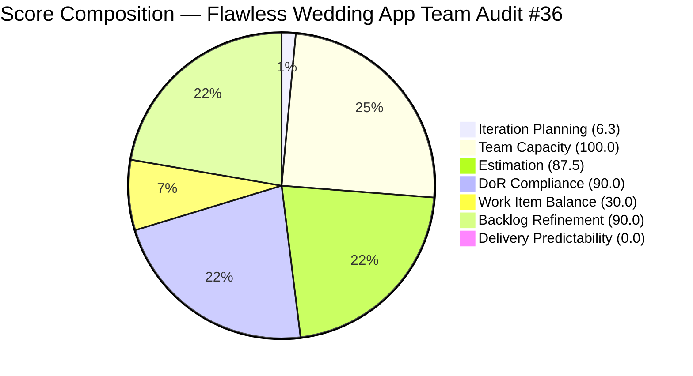

# ADO SAFe Iteration Audit — Flawless Wedding App Team

**Audit #36 | Iteration 7.2 (Apr 20 – May 3, 2026) | Day 3 of 14 (early-sprint)**

---

## 1. Audit Metadata

| Field | Value |
|---|---|
| **Audit Date** | April 22, 2026, 23:41 PHT (15:41 UTC) |
| **Auditor** | Claude Code (ADO SAFe Audit Agent) |
| **Workspace** | `ado_fl_dev` |
| **ADO Project** | Flawless Wedding App (`92b967dc-5ec7-4874-b8f5-e43b00d88339`) |
| **Team** | Flawless Wedding App Team (`7d90ecbf-d272-4b0c-b33b-c66d96a790ac`) |
| **Iteration** | Iteration 7.2 — Apr 20 to May 3, 2026 |
| **Iteration ID** | `8c08cc43-e1e8-4b0c-be84-4c81eaa860d5` |
| **Sprint Day** | Day 3 of 14 (early-sprint — Day 1–5 window) |
| **Prior Audit** | AUDIT_20260423_0914.md (Audit #35, 58.4 — High Risk, PI7.2 Day 4) |
| **Scoring Model** | ADO SAFe v1 (7-dimension rubric) |
| **Overall Score** | **57.7 / 100** |
| **Risk Band** | **High Risk** (40 – 59.9) |
| **Data Mode** | Live — full ADO data pull (160 visible root items, 10 sprint items) |

---

## 2. Executive Summary

The Flawless Wedding App Team holds a **57.7 — High Risk** score on Day 3 of Iteration 7.2, a marginal decline of 0.7 points from Audit #35 (Apr 23, 58.4). The slight drop is driven by two structural changes visible in today's live data:

1. **Estimation drops to 87.5** (was 100.0). Item #203230 ("[Vendor] Vendor users unable to login") is a Defect in the sprint set with no Story Points assigned. This item was added to the sprint after the prior audit's data pull. Its absence of SP estimation brings the estimation rate from 7/7 to 7/8 estimated Defects.

2. **Visible backlog contracted from 162 to 160 items**, producing a minor Iteration Planning improvement from 6.8 to 6.3 — reflecting the ongoing backlog cleanup Spike (#202873, "[Retro] Flawless Backlog CleanUp Iteration 7.2").

Positive signals from today's data:
- **DoR Compliance improves to 90.0** (from 81.8). The removal of items 202072 and 202119 from the backlog view (likely closed or moved to another team) and improved inspection of item 202873 — which now passes both Description and AC thresholds — lifts DoR from 81.8 to 90.0.
- **Five Defects remain at Ready for QA / QA Testing**, indicating Luke's development work is queued for Ressa. If testing proceeds and items close this week, Delivery Predictability will improve from 0.0 to potentially 40–50%.

**The team needs one critical structural fix:** The complete absence of User Story items in the sprint commitment triggers the -40 Work Item Balance penalty that accounts for the largest single score suppressor. Adding even one User Story to the sprint would eliminate this penalty entirely and lift the overall score from 57.7 to 63.4 (Moderate Risk).

---

## 3. Previous Audit Delta

| Dimension | Audit #35 — Apr 23 (Day 4) | Audit #36 — Apr 22 (Day 3) | Delta | Driver |
|---|---|---|---|---|
| Iteration Planning | 6.8 | 6.3 | −0.5 | Visible backlog: 162 → 160 items |
| Team Capacity | 100.0 | 100.0 | 0.0 | Unchanged |
| Estimation | 100.0 | 87.5 | **−12.5** | #203230 added to sprint without SP |
| DoR Compliance | 81.8 | 90.0 | **+8.2** | Better DoR on 202873; 202072/202119 removed |
| Work Item Balance | 30.0 | 30.0 | 0.0 | No User Story added |
| Backlog Refinement | 90.0 | 90.0 | 0.0 | Untouched-current stable at 30% |
| Delivery Predictability | 0.0 | 0.0 | 0.0 | No closures yet; early-sprint |
| **Overall** | **58.4** | **57.7** | **−0.7** | Estimation loss overrides DoR gain |

**Key observations since Audit #35 (Apr 23):**
- #203230 ("Vendor users unable to login") added to Iter 7.2 scope with no Story Points — introduces an estimation gap and is assigned to Luke.
- #202072 and #202119 (previously "Ready for QA", 5 SP total) are no longer visible in the backlog — likely closed or moved outside the team's backlog view.
- #202569 advanced from "Ready for QA" to "QA Testing" — Ressa is actively testing items.
- Backlog contracted from 162 to 160 items, likely from cleanup Spike activity (#202873).

---

## 4. Current Iteration Snapshot

| Metric | Value | Source |
|---|---|---|
| **Visible root backlog items** | 160 | Live ADO (Apr 22) |
| **Current iteration root items (Iter 7.2)** | 10 | Live ADO (Apr 22) |
| **Committed story points (estimated Defects)** | 10 SP | 7 of 8 Defects estimated |
| **Closed story points** | 0 SP | No Closed/Done items |
| **QA Testing / Ready for QA** | 5 items (200791, 202723, 202569, 194538 in progress) | Dev-complete queue |
| **Active (Dev in progress)** | 1 Defect (194538) + 2 Spikes (202827, 202873) | |
| **Ready for Dev** | 3 Defects (190892, 191079, 201326) | |
| **New** | 1 Defect (203230) | Newly added, unestimated |
| **Contributors with work** | 2 (Luke Abram Colina, Ressa Paracuelles) | |
| **Contributors with capacity** | 2 (Luke 6h Dev; Ressa 6h Testing) | |
| **Sprint day** | Day 3 of 14 | Apr 22, 2026 |
| **Days remaining** | 11 | Apr 23 – May 3 |

### Sprint Commitment — Iteration 7.2 (Live, Apr 22)

| ID | Title | Type | State | SP | Assignee | DoR |
|---|---|---|---|---|---|---|
| 200791 | [Web][Vendor] Incorrect date on custom fields | Defect | Ready for QA | 2 | Luke | Pass |
| 202723 | [Web][Vendor] Incorrect Subtotal upon revising | Defect | Ready for QA | 2 | Luke | Pass |
| 194538 | [iOS/AND] Initial payment incorrectly marked completed | Defect | Active | 2 | Luke | Pass |
| 190892 | [Admin][Coupons] Blank table sorting by Expiry Date | Defect | Ready for Dev | 1 | Luke | Pass |
| 191079 | [AND/Web] Vendor remains logged in after password change | Defect | Ready for Dev | 1 | Luke | Pass |
| 201326 | [Mobile] Vendor remains in previous category after update | Defect | Ready for Dev | 1 | Luke | Pass |
| 202569 | [Bride] Incorrect Message view from vendor notification | Defect | QA Testing | 1 | Luke | Pass |
| 203230 | [Vendor] Vendor users unable to login – marked deleted | Defect | New | **0** | Luke | Pass |
| 202827 | Iteration 7.2 - Collaborations, Reports & Others | Spike | Active | 0 | Ressa | **FAIL** (Desc <30 chars) |
| 202873 | [Retro] Flawless Backlog CleanUp Iteration 7.2 | Spike | Active | 0 | Ressa | Pass |

---

## 5. Work Item Analysis

### Backlog Age Distribution (160 items)

| Age Bucket | Count | Share |
|---|---|---|
| < 45 days (fresh) | 160 | 100% |
| 45–90 days | 0 | 0% |
| 91–180 days | 0 | 0% |
| > 180 days | 0 | 0% |

All 160 backlog items were last changed in April 2026 (oldest observed: Apr 1, 2026 — #202086), placing all items within the 45-day freshness window. No stale penalties apply.

### Untouched Current Items (Changed Before Sprint Start Apr 20)

| ID | Title | Last Changed | Days Before Sprint |
|---|---|---|---|
| 190892 | [Admin][Coupons] Blank table sorting by Expiry Date | Apr 15 | 5 days pre-start |
| 191079 | Vendor remains logged in after password change | Apr 15 | 5 days pre-start |
| 201326 | Vendor in previous category after update | Apr 15 | 5 days pre-start |

3 of 10 sprint items (30.0%) were not touched since sprint start. At exactly 30%, this falls in the >10% band (not the >30% band), applying a -10 penalty to Backlog Refinement.

### Work Item Type Distribution (Sprint)

| Type | Count | Share |
|---|---|---|
| Defect | 8 | 80% |
| Spike | 2 | 20% |
| User Story | 0 | 0% |

The complete absence of User Story items triggers the -40 Work Item Balance penalty. Defect dominance (80%) triggers an additional -30. No Spike penalty applies (20% ≤ 40%).

### DoR Failure Detail

| ID | Title | Failure Reason |
|---|---|---|
| 202827 | Iteration 7.2 - Collaborations, Reports & Others | Description = "Reports and Iteration Team Events" = 29 non-whitespace chars (< 30 minimum) |

---

## 6. SAFe Compliance Scorecard

| Dimension | Score | Evidence | Notes |
|---|---|---|---|
| **1. Iteration Planning** | 6.3 | 10 sprint items / 160 visible | Massive backlog drives ratio down |
| **2. Team Capacity** | 100.0 | 2/2 contributors have positive capacity | Luke (Dev 6h) + Ressa (Testing 6h) |
| **3. Estimation** | 87.5 | 7/8 Defects estimated | #203230 added to sprint without SP |
| **4. DoR Compliance** | 90.0 | 9/10 sprint items pass DoR | #202827 Description 1 char below minimum |
| **5. Work Item Balance** | 30.0 | 8 Defects, 2 Spikes, 0 User Stories | -40 (no US) + -30 (Defect dominant 80%) |
| **6. Backlog Refinement** | 90.0 | 160/160 fresh; 3/10 untouched (30.0%) | -10 for untouched in >10% band |
| **7. Delivery Predictability** | 0.0 | 0 SP closed / 10 SP committed | Early-sprint Day 3 — low delivery expected |
| **Overall** | **57.7** | Average of 7 dimensions | **High Risk** |

---

## 7. Dimension Findings

### D1 — Iteration Planning (6.3)
The team's committed scope of 10 items represents only 6.25% of the 160-item visible backlog. This dimension is structurally suppressed and cannot be significantly improved within the current sprint. The long-term fix is closing completed Defects (moving them out of the backlog) or building a more consistent sprint cadence. The ongoing backlog cleanup Spike (#202873) is the right initiative to address this.

### D2 — Team Capacity (100.0)
Both active contributors have configured capacity: Luke (6h/day Development) and Ressa (6h/day Testing). Ressa had one day off on Apr 20 (sprint start), which has elapsed. Ike Yana (1h/day Development) and Luzmibel Paculanang (1h/day Testing) are listed in team capacity but have no items assigned in the current sprint set — their capacity exists but is not reflected in the scoring denominator.

### D3 — Estimation (87.5)
Seven of eight Defects are estimated. The unestimated item is #203230 ("[Vendor] Vendor users unable to login"), which was added to the sprint at revision 8 without Story Points. This is a critical login bug that should be estimated before active development begins. Based on the defect type (authentication/account status logic), a 1–2 SP estimate is likely.

### D4 — DoR Compliance (90.0)
Nine of ten sprint items pass DoR. The single failure is #202827 ("Iteration 7.2 - Collaborations, Reports & Others"), a Spike used for team ceremonies. Its Description field contains "Reports and Iteration Team Events" — 29 non-whitespace characters, exactly 1 short of the 30-char minimum. Adding a single word (e.g., "Reports and Iteration Team Events planning") would resolve this failure. The item's practical value is not in question — it serves as a sprint planning/retrospective placeholder.

### D5 — Work Item Balance (30.0)
This dimension is the largest single score suppressor. The sprint contains zero User Story items — a complete absence that triggers the mandatory -40 penalty. The team's sprint composition is driven by interrupt-driven Defect work (8 Defects) and sprint ceremony administration (2 Spikes). The PI7 web application work (bride dashboard, subscription, authentication) is scoped into Iterations 7.3–8.x but has not entered 7.2.

**Path to score improvement:** Adding one User Story to the Iter 7.2 commitment (e.g., pulling #202837 "View & Manage Wedding Images" or #189544 "Send messages to deleted users" from the PI7 backlog) would eliminate the -40 penalty and lift Work Item Balance from 30.0 to 70.0 → overall score from 57.7 to 63.4.

### D6 — Backlog Refinement (90.0)
The backlog is in excellent shape age-wise: all 160 items are fresh. Three sprint items (190892, 191079, 201326) have not been touched since Apr 15, placing the untouched-current rate at exactly 30% — at the boundary of the -10 penalty band. These three items are in "Ready for Dev" state and are queued for Luke after his current Active item (#194538) completes.

### D7 — Delivery Predictability (0.0)
Zero Story Points closed at Day 3. Early-sprint annotation applies. The pipeline is building:
- **202569 (1 SP):** In QA Testing with Ressa — highest probability of first closure.
- **200791 (2 SP) and 202723 (2 SP):** Both at Ready for QA — awaiting Ressa's testing queue.
- **194538 (2 SP):** Active with Luke — next to enter QA.

If Ressa closes 202569 by Day 5, Delivery Predictability rises from 0.0 to 10.0 — a modest gain but the right trajectory.

---

## 8. Risks and Bottlenecks

| Risk | Severity | Status |
|---|---|---|
| No User Story in sprint — -40 WIB penalty every sprint | High | Structural — persists since PI7.1 |
| #203230 (login bug) in sprint without Story Points | High | New item — needs immediate estimation |
| QA bottleneck: Ressa is sole QA resource for 5+ defects | High | Luke's throughput exceeds QA throughput |
| #202827 DoR failure (29-char description) | Low | Trivial fix — 1 word addition |
| 203230 critical login bug (vendor accounts blocked) | Critical | Dev assigned; no SP, no AC review |
| Iteration Planning at 6.3 — structural visibility issue | Moderate | Long-term backlog cleanup needed |
| Delivery Predictability at 0.0 | Moderate | Expected Day 3; closes expected mid-sprint |

---

## 9. Prioritized Recommendations

1. **[Today — 5 minutes] Estimate #203230.** The vendor login bug is now Active in the sprint and has no Story Points. Estimate it (1–2 SP) before Luke proceeds further. This lifts Estimation from 87.5 to 100.0 and overall from 57.7 to 59.5.

2. **[Today — 15 minutes] Fix #202827 Description.** Add 1 word to the Description field of the Collaborations Spike to reach 30 characters. This lifts DoR from 90.0 to 100.0 and overall from 57.7 to 59.3.

3. **[This Sprint] Add at least one User Story to the sprint commitment.** The -40 Work Item Balance penalty is the largest preventable score suppressor. Pull #189544 (2 SP, "Able to send messages to deleted users" — already in PI7 root, Ready for Dev) or any other User Story from the 2026-PI7 backlog. Effect: +5.7 to overall score (57.7 → 63.4, crossing into Moderate Risk).

4. **[This Week] QA throughput is the critical path.** With 5 Defects queued for or in QA (202569, 200791, 202723, and soon 194538), Ressa's 6h/day Testing capacity is the constraint. Prioritize QA completion of #202569 (1 SP, smallest) first to establish early delivery momentum.

5. **[This Sprint] Continue backlog cleanup (#202873).** The visible backlog contracted from 162 to 160 items since yesterday's audit. Continued cleanup brings the Iteration Planning score closer to meaningful levels and reduces the visible queue of defects requiring triage.

6. **[This PI] Review sprint composition policy.** The persistent absence of User Story items across Iter 7.1 and 7.2 suggests an implicit policy of "Defect-only" sprints during active bug periods. This is legitimate but should be an explicit decision documented in the PI plan, with a target date for when User Story work re-enters the sprint.

---

## 10. Evidence Gaps and Limitations

| Gap | Impact |
|---|---|
| Items 202072 and 202119 no longer in visible backlog | Cannot confirm disposition (closed vs. reassigned); prior audit scored them as "Ready for QA" with 5 SP — excluded from today's committed SP total |
| #203230 Story Points not set | Treated as unestimated; SP denominator = 8 Defects, estimated = 7 |
| Spikes (#202827, #202873) treated as non-point-eligible | Consistent with observed team convention: Spikes in this project do not have SP set; excluded from Estimation numerator and denominator |
| Iteration Planning at 6.3 reflects full 160-item backlog | No sub-team or area filter available; the backlog includes all PI7 Defects regardless of assignee |
| Early-sprint delivery annotation | Day 3 of 14; Delivery Predictability = 0.0 is expected; formula unadjusted |
