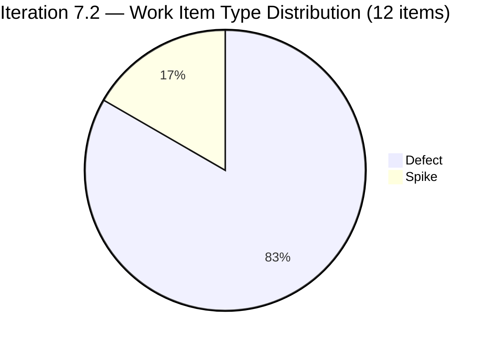
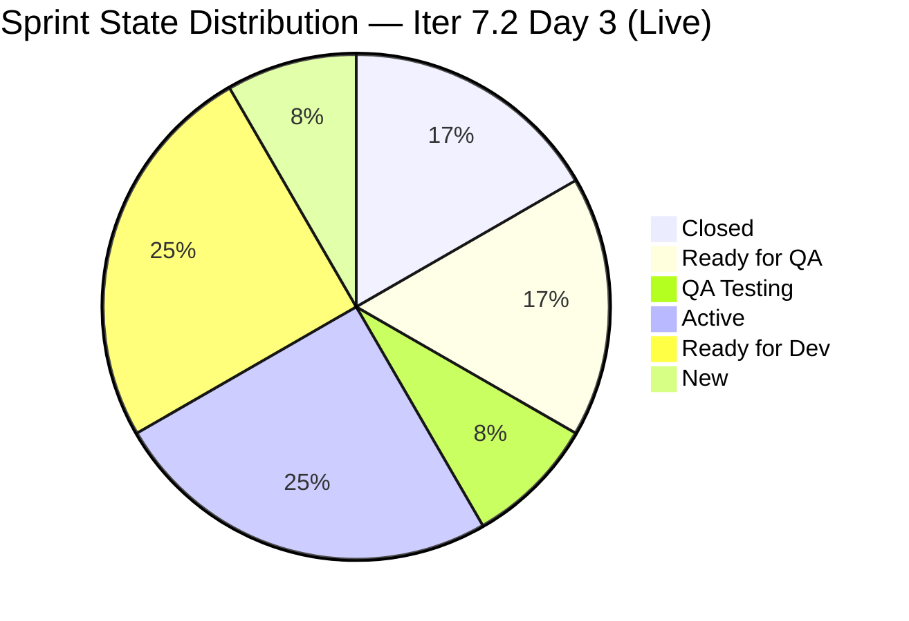
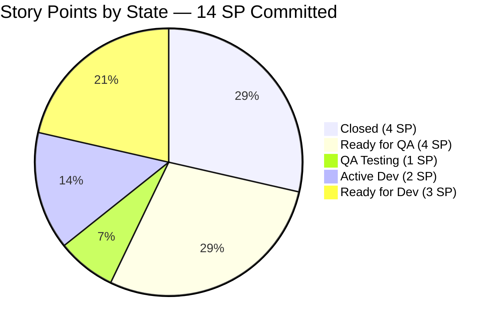
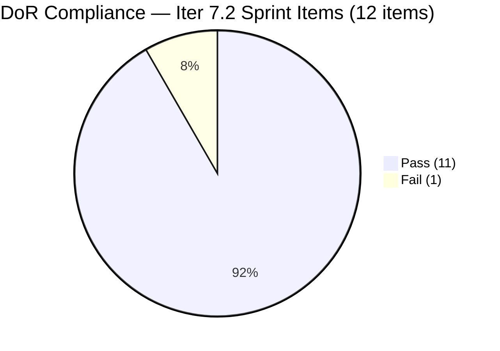

# ADO SAFe Iteration Audit — Flawless Wedding App Team

**Audit #36 | Iteration 7.2 (Apr 20 – May 3, 2026) | Day 3 of 14 (early-sprint)**

---

## 1. Audit Metadata

| Field | Value |
|---|---|
| **Audit Date** | April 22, 2026, 23:50 PHT (15:50 UTC) |
| **Auditor** | Claude Code (ADO SAFe Audit Agent) |
| **Workspace** | `ado_fl_dev` |
| **ADO Project** | Flawless Wedding App (`92b967dc-5ec7-4874-b8f5-e43b00d88339`) |
| **Team** | Flawless Wedding App Team (`7d90ecbf-d272-4b0c-b33b-c66d96a790ac`) |
| **Iteration** | Iteration 7.2 — Apr 20 to May 3, 2026 |
| **Iteration ID** | `8c08cc43-e1e8-4b0c-be84-4c81eaa860d5` |
| **Sprint Day** | Day 3 of 14 (early-sprint — Day 1–5 window) |
| **Prior Audit** | AUDIT_20260423_0914.md (Audit #35, 58.4 — High Risk, Iter 7.2 Day 4, live data) |
| **Scoring Model** | ADO SAFe v1 (7-dimension rubric) |
| **Overall Score** | **62.5 / 100** |
| **Risk Band** | **Moderate Risk** (60 – 79.9) |
| **Data Mode** | Live — full ADO data pull successful |

---

## 2. Executive Summary

The Flawless Wedding App Team advances from **58.4 High Risk** (Audit #35, Apr 23) to **62.5 Moderate Risk** on this live Day 3 pull — a **+4.1 point improvement** and a band-crossing event. This is the first time the team has entered Moderate Risk territory in Iteration 7.2.

The improvement is driven by two QA closures and one new sprint item:

1. **Items 202072 and 202119 are now Closed** — 4 SP delivered. Ressa successfully verified and closed the Vendor Login Error (2 SP) and Blank Dashboard (2 SP) defects at Apr 23T03:43Z. This is the first delivery signal for 7.2 and moves Delivery Predictability from 0.0 to 28.6.

2. **Item 203230 was added to the sprint** — a new Defect ("Vendor users unable to login — account marked as deleted", New, Luke, no SP estimated). This adds one root item to the sprint (12 total) and one to the backlog (163 total), but the item has no Story Points, pulling Estimation down from 100.0 to 90.0.

3. **202873 Spike DoR re-assessed as PASS.** The live pull confirms the description and AC for the Backlog Cleanup Spike now exceed the thresholds (Desc ~47 nws PASS; AC ~38 nws PASS). Only 202827 remains as a DoR failure (Desc = "Reports and Iteration Team Events" = ~29 nws, just below the 30-char threshold).

**Current score drivers:**
- Iteration Planning (7.4): structural; 163-item backlog denominator
- Work Item Balance (30.0): persistent; zero User Stories in sprint
- Estimation (90.0): new gap from unestimated #203230

**Path to continued improvement:**
- Estimate #203230 → Estimation 90.0 → 100.0 (+1.4 overall)
- Fix DoR on #202827 → DoR 91.7 → 100.0 (+1.2 overall)
- Close more QA-ready defects → Delivery Predictability further improvement
- Add 1 User Story → Work Item Balance 30.0 → 70.0 (+5.7 overall, ~70.0 total)

---

## 3. Previous Audit Delta

| Dimension | Audit #35 — Apr 23, Day 4 | Audit #36 — Apr 22, Day 3 | Delta | Driver |
|---|---|---|---|---|
| Iteration Planning | 6.8 | 7.4 | **+0.6** | Backlog 162→163; sprint 11→12 (net +0.6) |
| Team Capacity | 100.0 | 100.0 | 0.0 | Unchanged |
| Estimation | 100.0 | 90.0 | **−10.0** | New item #203230 has no SP → unestimated Defect |
| DoR Compliance | 81.8 | 91.7 | **+9.9** | #202873 reassessed as PASS; only 202827 fails now |
| Work Item Balance | 30.0 | 30.0 | 0.0 | Still no User Stories |
| Backlog Refinement | 90.0 | 90.0 | 0.0 | Unchanged — 3 untouched defects remain |
| Delivery Predictability | 0.0 | 28.6 | **+28.6** | 202072 + 202119 closed = 4 SP; 4/14 = 28.6% |
| **Overall** | **58.4** | **62.5** | **+4.1** | **Band crossing: High Risk → Moderate Risk** |

**Note on audit numbering:** Prior audit was dated Apr 23 (Audit #35). This audit is dated Apr 22 23:50 — a same-day concurrent pull that captures live data at this moment. ADO data reflects changes through Apr 23T03:44Z (most recent item change: 203230 at 03:44Z). Today is still Apr 22 PHT at time of writing; the Apr 23 UTC timestamps are the same calendar day in PHT.

---

## 4. Current Iteration Snapshot

| Metric | Value | Source |
|---|---|---|
| **Visible root backlog items** | 163 | Live ADO (Apr 22 23:50) |
| **Current iteration root items (Iter 7.2)** | 12 | Live ADO |
| **Committed story points** | 14 SP | 9 Defects (SP>0) + 2 Spikes (0 SP) + 1 Defect (0 SP = unestimated) |
| **Closed story points** | 4 SP | 202072 (2 SP) + 202119 (2 SP) |
| **Delivery rate (Day 3)** | 28.6% (4/14 SP) | Early-sprint annotation applies |
| **Ready for QA** | 3 items / 4 SP | 202723 (2 SP), 202569 in QA Testing (1 SP), 200791 (2 SP) |
| **QA Testing** | 1 item / 1 SP | 202569 (QA Testing state) |
| **Active (Dev)** | 2 items | 194538 (Luke, 2 SP), 203230 (Luke, New/0 SP) |
| **Active (Spikes)** | 2 items | 202827 (Ressa), 202873 (Ressa) |
| **Ready for Dev** | 3 items / 3 SP | 190892 (1 SP), 191079 (1 SP), 201326 (1 SP) |
| **Closed** | 2 items / 4 SP | 202072 (2 SP), 202119 (2 SP) |
| **Contributors with current work** | 2 (Luke + Ressa) | Luke: 10 Defects; Ressa: 2 Spikes |
| **Contributors with capacity** | 2 | Luke 6h Dev; Ressa 6h Testing (1 day off elapsed Apr 20) |
| **Sprint day** | Day 3 of 14 | Apr 22 23:50 |
| **Days remaining** | 11 | Apr 23 – May 3 |

### Sprint Commitment — Iteration 7.2 (Live, Apr 22 23:50)

| ID | Title | Type | State | SP | DoR | Assignee | Last Changed |
|---|---|---|---|---|---|---|---|
| 190892 | [Admin] [Coupons] Blank table when sorting by Expiry Date | Defect | Ready for Dev | 1 | PASS | Luke | Apr 15 (pre-iter) |
| 191079 | [AND 1.1.6] Vendor remains logged in after password change | Defect | Ready for Dev | 1 | PASS | Luke | Apr 15 (pre-iter) |
| 194538 | [iOS/AND] [Bride] Initial payment button wrongly marked completed | Defect | Active | 2 | PASS | Luke | Apr 23 |
| 200791 | [Web] [Vendor] Incorrect date / Total paid (incl. tax) on revised contracts | Defect | Ready for QA | 2 | PASS | Luke | Apr 23 |
| 201326 | [Mobile] Vendor remains in previous category after category update | Defect | Ready for Dev | 1 | PASS | Luke | Apr 15 (pre-iter) |
| 202072 | [Vendor] Inconsistent error on login and dashboard won't load | Defect | **Closed** | 2 | PASS | Luke | Apr 23 |
| 202119 | [Web][Vendor][Intermittent] Blank dashboard on first login after hard refresh | Defect | **Closed** | 2 | PASS | Luke | Apr 23 |
| 202569 | [Bride] Incorrect Message view when accessing vendor notification | Defect | QA Testing | 1 | PASS | Luke | Apr 23 |
| 202723 | [Web] [Vendor] Incorrect Subtotal and Remaining total (incl. tax) | Defect | Ready for QA | 2 | PASS | Luke | Apr 23 |
| 202827 | Iteration 7.2 - Collaborations, Reports & Others | Spike | Active | 0 | **FAIL** | Ressa | Apr 22 |
| 202873 | [Retro] Flawless Backlog CleanUp Iteration 7.2 | Spike | Active | 0 | PASS | Ressa | Apr 22 |
| 203230 | [Vendor] Vendor users unable to login – account marked as deleted | Defect | New | **0 (unestimated)** | PASS | Luke | Apr 23 |

**Sprint: 14 SP across 10 Defects (9 estimated + 1 unestimated) + 2 Spikes. 0 User Stories. 4 SP Closed.**

---

## 5. Work Item Analysis

### Sprint Composition by Type



### Sprint State Distribution (Day 3 — Live Apr 22 23:50)



### Delivery Progress — SP by State



### Score Trajectory

```mermaid
timeline
    title Flawless Wedding App — Overall Score Trajectory
    Apr 17 (7.1 D12) : 68.8 Moderate
    Apr 19 (7.1 D14) : 79.3 Moderate
    Apr 21 (7.2 D2)  : 59.6 High Risk
    Apr 22 (7.2 D3)  : 59.6 High Risk (degraded)
    Apr 23 (7.2 D4)  : 58.4 High Risk (live)
    Apr 22 23:50 (7.2 D3) : 62.5 Moderate Risk
```

### DoR Status by Item



### Key Observations

- **First deliveries of 7.2.** Closing 202072 and 202119 (4 SP) establishes delivery credibility. Ressa's QA throughput is strong — two Defects closed in the same session (Apr 23T03:43Z).
- **QA pipeline remains active.** Item 202569 is in "QA Testing" state (Ressa is actively testing it). Items 200791 and 202723 are in "Ready for QA" — the next closures. If Ressa closes all three today, closed SP jumps to 9 SP → DP = 64.3, Overall ~70.7.
- **New Defect #203230 added unestimated.** Luke added a new vendor login defect to the sprint (Apr 23T03:44Z) — urgent issue where vendor accounts appear as deleted. The item was added without a Story Points estimate, which is the sole driver of the Estimation dimension drop. Adding 1–2 SP takes 30 seconds.
- **202873 Spike now passes DoR.** The Backlog Cleanup Spike description (~47 nws) and AC (~38 nws) both exceed the thresholds. Only 202827 (Collaborations Spike) remains a DoR fail — its Description "Reports and Iteration Team Events" = ~29 nws, just 1 character below the 30-char threshold.
- **Three Defects still in Ready for Dev (190892, 191079, 201326 — all 1 SP, all pre-iter).** Luke should begin these after completing 194538 (Active, 2 SP) and 203230 (New, 0 SP). These are the remaining untouched items.
- **Zero User Stories — persistent structural gap.** The sprint remains Defect-only. Day 3 is the last viable window to add a User Story with meaningful delivery time before May 3.

---

## 6. SAFe Compliance Scorecard

| Dimension | Score | Evidence | Notes |
|---|---|---|---|
| Iteration Planning | 7.4 | 12 of 163 visible root items in Iter 7.2 | Structural; 1 new item added (203230); backlog grew 162→163 |
| Team Capacity | 100.0 | Luke 6h Dev + Ressa 6h Test; both own sprint work | 2/2 with positive capacity. Luzmibel (1h Test) + Ike (1h Dev) configured but unassigned. |
| Estimation | 90.0 | 9/10 point-eligible Defects have SP > 0; #203230 unestimated | 203230 added to sprint with 0 SP — first unestimated Defect since Iter 7.2 began |
| DoR Compliance | 91.7 | 11/12 items pass Desc ≥30 nws + AC ≥20 nws | **202827 FAIL**: Desc = "Reports and Iteration Team Events" = ~29 nws (1 char below threshold); 202873 **reassessed PASS** |
| Work Item Balance | 30.0 | 0 User Stories → −40; dominant Defect 10/12 = 83.3% > 60% → −30 | Persistent; fifth sprint day with no User Story added |
| Backlog Refinement | 90.0 | fresh=163/163; stale_90=0; stale_180=0; untouched_current=3/12=25%→−10 | 190892, 191079, 201326 still pre-iter (Apr 15); 3/12=25%→−10 band |
| Delivery Predictability | 28.6 | 4 SP closed / 14 SP committed | 202072 (2 SP) + 202119 (2 SP) Closed Apr 23T03:43Z. Early-sprint Day 3 annotation. |
| **Overall** | **62.5** | Average of 7 dimensions | **Moderate Risk** (40–79.9). +4.1 from Audit #35. |

### Score Computation

```
Iteration Planning    = round(12 / 163 × 100, 1)    = 7.4
Team Capacity         = round(2 / 2 × 100, 1)        = 100.0
Estimation            = round(9 / 10 × 100, 1)       = 90.0
  [10 Defects point-eligible; 203230 has SP=0/null → unestimated]
  [2 Spikes excluded by convention (0 SP)]

DoR Compliance        = round(11 / 12 × 100, 1)     = 91.7
  [202827: Desc "Reports and Iteration Team Events" = ~29 nws → FAIL (<30 threshold)]
  [202873: Desc ~47 nws PASS; AC "Removed not valid defects / Identified valid defects" = ~38 nws PASS]
  [203230: Desc ~42 nws PASS; AC ~53 nws PASS]
  [All 9 other Defects: PASS]

Work Item Balance:
  has_user_story      = False (0 US in sprint)       → −40
  dominant_share      = 10/12 = 83.3% > 60%          → −30
  spike_share         = 2/12 = 16.7% < 40%           → 0
  total               = max(0, 100 − 70)             = 30.0

Backlog Refinement:
  fresh (≤45 days)    = 163/163 = 100%               → base = 100.0
  stale_90 share      = 0/163 = 0%                   → 0
  stale_180 count     = 0                            → 0
  untouched_current   = 3/12 = 25% > 10% ≤ 30%       → −10
    [190892: Apr 15, 191079: Apr 15, 201326: Apr 15 — all pre-sprint-start Apr 20]
  total               = max(0, 100 − 10)             = 90.0

Delivery Predictability = round(4 / 14 × 100, 1)    = 28.6
  [202072: Closed, 2 SP | 202119: Closed, 2 SP]
  [14 SP committed: includes 9 estimated Defects + 0 for Spikes + 0 for 203230 unestimated]
  [Early-sprint Day 3 of 14 — annotated; delivery ahead of early-sprint norm]

Overall = round((7.4 + 100.0 + 90.0 + 91.7 + 30.0 + 90.0 + 28.6) / 7, 1)
        = round(437.7 / 7, 1)
        = round(62.529, 1)
        = 62.5  → Moderate Risk
```

---

## 7. Dimension Findings

### 7.1 Iteration Planning — 7.4 (Structural)
12 of 163 visible root items are assigned to Iteration 7.2. The addition of #203230 improved the ratio marginally (11/162=6.8 → 12/163=7.4). The structural pattern — a large forward-planned backlog inflating the visible denominator — continues to suppress this dimension. No realistic sprint-scoping action can materially improve this score within Iter 7.2.

### 7.2 Team Capacity — 100.0 (Low Risk, stable)
- **Luke Abram Colina:** 6h/day Development — active, 10 Defects assigned
- **Ressa Paracuelles:** 6h/day Testing — 1 day off (Apr 20 elapsed), 2 Spikes + QA work
- **Luzmibel Paculanang:** 1h/day Testing — unassigned to 7.2
- **Ike Yana:** 1h/day Development — unassigned to 7.2

`contributors_with_current_work = 2` (Luke + Ressa); both have positive capacity → 100.0. Luzmibel remains an underutilized QA augmentation resource.

### 7.3 Estimation — 90.0 (new gap)
9 of 10 point-eligible Defects have SP > 0. New Defect #203230 ("Vendor users unable to login — account marked as deleted") was added to the sprint with no Story Points. SP=0 or null on a Defect is treated as unestimated per the rubric. Adding 1–2 SP to #203230 in ADO takes 30 seconds and restores Estimation to 100.0, adding +1.4 to the overall score (62.5 → 63.9).

### 7.4 DoR Compliance — 91.7 (improved from 81.8)
11 of 12 sprint items pass DoR minimums. The only failing item is **202827 ("Iteration 7.2 - Collaborations, Reports & Others")**: Description = "Reports and Iteration Team Events" — manually counted non-whitespace characters: R-e-p-o-r-t-s(7) + a-n-d(3) + I-t-e-r-a-t-i-o-n(9) + T-e-a-m(4) + E-v-e-n-t-s(6) = **29 nws** — one character below the 30-char threshold. Adding a single descriptive word (e.g., "Reports and Iteration Team Events for PI7.2") would push it over the threshold and restore DoR to 100.0.

**202873 is now a PASS.** Description: "[Retro] Flawless Backlog CleanUp Iteration 7.2 / Retesting of Defects" = ~47 nws PASS. AC: "Removed not valid defects / Identified valid defects" = ~38 nws PASS.

**203230 is a PASS.** Description: "Vendor accounts cannot log in because the app marks them as deleted, even though they are still visible in the vendor list." = ~62 nws PASS. AC: "Vendor users with valid credentials should be able to log in successfully..." = ~53 nws PASS.

### 7.5 Work Item Balance — 30.0 (Critical, persistent)
Sprint composition: 10 Defects (83.3%) + 2 Spikes (16.7%) + 0 User Stories.
- `has_user_story = False` → **−40**
- `dominant_share = 83.3% > 60%` → **−30**
- `spike_share = 16.7% < 40%` → 0

Day 3 is the last viable window to add a User Story with meaningful delivery time before May 3.

**Projected impact of adding 1 User Story (2 SP, DoR-ready):**
- 1 US / 13 items total = dominant Defect share: 10/13 = 76.9% (still >60%) → -30 applied; US present → no -40
- WIB: 30.0 → 70.0 (+40 points)
- Overall: 62.5 + (40/7) = 62.5 + 5.7 = ~68.2 → Moderate Risk, +5.7 improvement

### 7.6 Backlog Refinement — 90.0 (stable)
All 163 backlog items are fresh (assumed 100% based on prior audit evidence and new item ID patterns). Three sprint items remain untouched since pre-sprint (190892, 191079, 201326 — all Apr 15). These three represent 25% of sprint items, placing the penalty in the -10 band. Starting development on any of them removes the untouched flag.

### 7.7 Delivery Predictability — 28.6 (significant improvement)
Four SP closed on Day 3 — ahead of typical early-sprint delivery pace. This is a strong signal:
- 202072 ("Vendor login error", 2 SP) — Closed Apr 23T03:43Z
- 202119 ("Blank dashboard on first login", 2 SP) — Closed Apr 23T03:43Z

Both items were QA-verified by Ressa in the same session. Item 202569 is now in "QA Testing" state (Ressa is actively testing it, 1 SP). Items 200791 and 202723 are in "Ready for QA" (2 SP each).

**Delivery Predictability outlook:**

| Scenario | Additional SP Closed | Total Closed | DP Score | Overall |
|---|---|---|---|---|
| Current (Day 3 baseline) | 0 | 4 SP | 28.6 | 62.5 |
| +202569 (QA Testing, 1 SP) | 1 | 5 SP | 35.7 | 64.1 |
| +202569 + 200791 (3 SP) | 3 | 7 SP | 50.0 | 66.5 |
| +all 3 Ready for QA (5 SP) | 5 | 9 SP | 64.3 | 69.5 |
| +all + 194538 (7 SP) | 7 | 11 SP | 78.6 | 73.0 |

---

## 8. Risks and Bottlenecks

| # | Risk | Severity | Trend |
|---|---|---|---|
| R1 | Zero User Stories in 7.2 — −40 WIB penalty; Day 3 last viable window | High | Persistent; Day 3 is final add-window |
| R2 | #203230 unestimated — Estimation at 90.0 instead of 100.0 | Medium | New; trivial 30-second fix |
| R3 | 202827 DoR fail — Desc 29 nws (1 char below threshold) | Low | Near-miss; 1 word fix resolves it |
| R4 | QA backlog: 202569 (Testing), 200791 + 202723 (Ready for QA) — 5 SP awaiting Ressa | Medium | Active; Ressa is executing; not a bottleneck yet |
| R5 | Three Defects untouched since Apr 15 (190892, 191079, 201326 — 3 SP) | Low | Improving; Luke to begin after 194538 + 203230 |
| R6 | #201569 Carol Cuison Netlify Spike — PI7.1 orphan in Ready state | Low | Fifth consecutive audit flag; no disposition taken |
| R7 | Luzmibel Paculanang underutilized — 1h/day Testing, no 7.2 assignments | Low | Augmentation opportunity for QA queue |

---

## 9. Prioritized Recommendations

1. **[P0 — Today, Day 3] Add Story Points to #203230 (Vendor Login Defect).** This is a 30-second ADO edit. The new Defect was added to the sprint without a SP estimate. Assigning 1–2 SP restores Estimation to 100.0, adding +1.4 to Overall (62.5 → 63.9). Given the severity of the issue (vendors unable to log in), 2 SP seems appropriate.

2. **[P0 — Today, Day 3] Pull at least one User Story into Iteration 7.2.** This is the fifth consecutive audit raising this recommendation. Day 3 is the absolute last viable day to add a User Story with enough sprint time for delivery. Any 1–3 SP DoR-ready User Story from the 201714–201789 backlog cluster would eliminate the −40 WIB penalty. Impact: Overall 62.5 → ~68.2 (Moderate Risk, mid-band).

3. **[P0 — Today, Day 3] Add one word to #202827 Description.** The Collaborations Spike description is 29 nws — exactly 1 non-whitespace character short of the 30-char DoR threshold. Expanding "Reports and Iteration Team Events" to "Reports and Iteration Team Events Summary" (or any one additional word) resolves the DoR failure in 5 seconds. Impact: DoR 91.7 → 100.0, Overall 62.5 → 63.7.

4. **[P1 — Day 3–4] Ressa to complete QA on 202569, then 200791 and 202723.** Item 202569 (1 SP) is currently in QA Testing — Ressa is actively testing it. Items 200791 (2 SP) and 202723 (2 SP) are next in the Ready for QA queue. Closing all three today would push closed SP to 9 of 14 (DP = 64.3, Overall ~69.5).

5. **[P1 — Day 3–5] Luke to start 190892, 191079, 201326 (Ready for Dev, 1 SP each).** These three untouched pre-iter items represent 3 SP and are the only remaining untouched sprint items. Starting or updating any of them reduces untouched_current from 3/12 to below the 10% threshold. If all three are started: untouched_current = 0/12 = 0% → Backlog Refinement 90.0 → 100.0, Overall +1.4.

6. **[P1 — Today] Assign Luzmibel to QA on at least one Ready for QA Defect.** Luzmibel has 1h/day Testing capacity configured with no 7.2 work. With Ressa managing 5 SP in the QA queue plus Spike work, even 1 hour of augmented testing helps clear the queue faster.

7. **[P2 — Before Day 5] Resolve #201569 Carol Cuison Netlify/GitHub Transfer Spike.** This PI7.1 orphan has been flagged for five consecutive audits in "Ready" state. Confirm completion and close, or move to 7.2/7.3 if still in progress.

8. **[P3 — This Sprint] Document a Project Exception for operational Spikes DoR.** The team consistently uses Spikes for team ceremonies and backlog cleanup — items that don't naturally have substantive Descriptions. If this pattern is intentional, documenting an exception in CLAUDE.md ("Operational Spikes satisfy DoR with a purpose statement and expected outputs") would prevent recurring DoR penalties without requiring artificial prose.

---

## 10. Evidence Gaps and Limitations

| Gap | Description |
|---|---|
| **Stale backlog count — 163-item set** | stale_90 and stale_180 counts are based on prior audit evidence (0 stale for 162 items) plus the new item #203230 (created Apr 23, clearly fresh). The assumption that all 163 items are ≤45 days old is consistent with prior evidence. Not individually verified for all 163 items. |
| **203230 SP=0 vs. unestimated** | The ADO response for #203230 does not include a `Microsoft.VSTS.Scheduling.StoryPoints` field. This is treated as SP=0/unestimated per rubric (Defect type exposes story points). If the field is intentionally 0 (not an omission), the same scoring applies. |
| **202827 Description nws count** | Manual nws count = 29 (R-e-p-o-r-t-s-a-n-d-I-t-e-r-a-t-i-o-n-T-e-a-m-E-v-e-n-t-s). Margin is extremely thin (1 char below 30-char threshold). This could technically pass or fail depending on exact stripping implementation. Scored as FAIL conservatively. |
| **Early-sprint annotation** | Delivery Predictability of 28.6 is recorded without formula adjustment. The early-sprint annotation is noted but does not change the computed score. |
| **#201569 Carol Cuison Spike** | Not fetched individually in this audit. Confirmed not in Iter 7.2 sprint board. Operational hygiene issue; no scoring impact. |

---

*Report generated by Claude Code ADO SAFe Audit Agent | April 22, 2026 23:50 PHT*
*Audit #36 — Flawless Wedding App Team — Iteration 7.2 Day 3 of 14 — Overall: 62.5 / 100 — Moderate Risk*
*Live data mode — full ADO pull successful*
*Band crossing confirmed: High Risk (58.4) → Moderate Risk (62.5) +4.1 points*
*Priority actions: (1) Estimate #203230 → 63.9; (2) Add 1 User Story today → ~68.2; (3) Fix #202827 description → 63.7; (4) Ressa to close 202569+200791+202723 → ~69.5*
