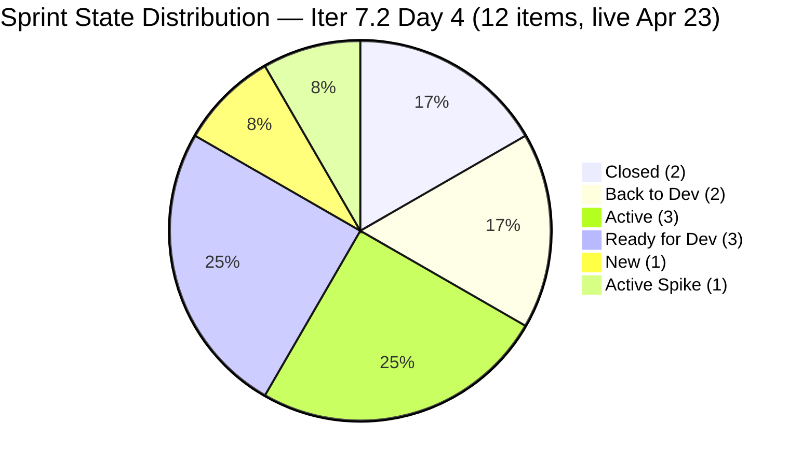
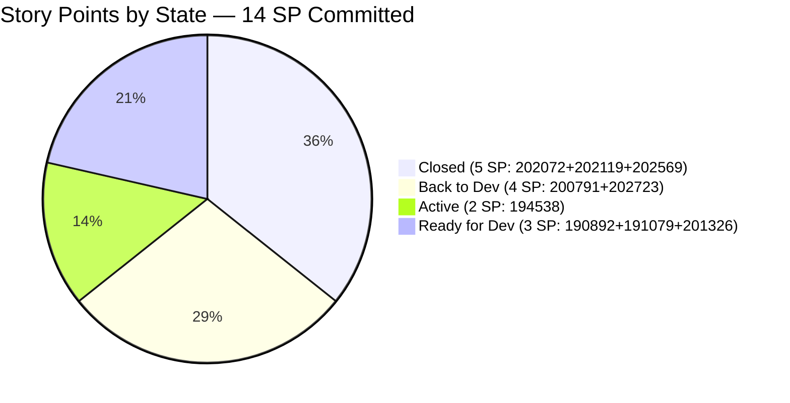
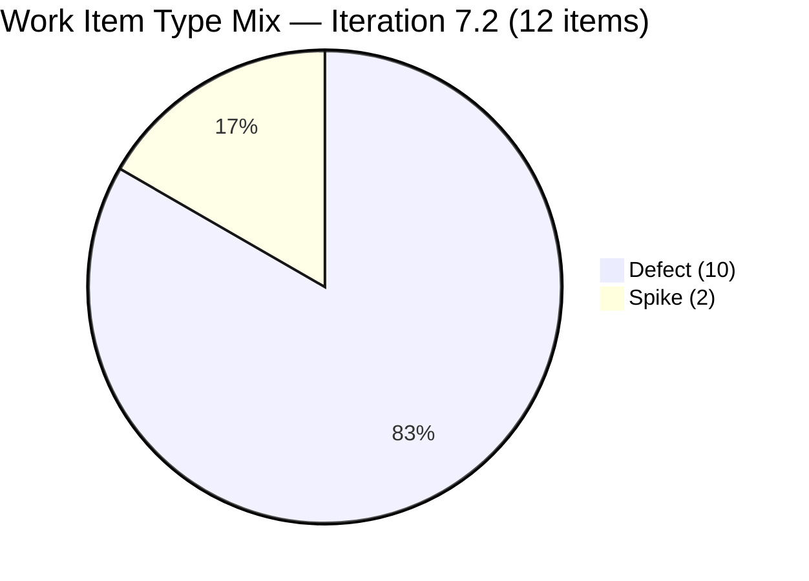
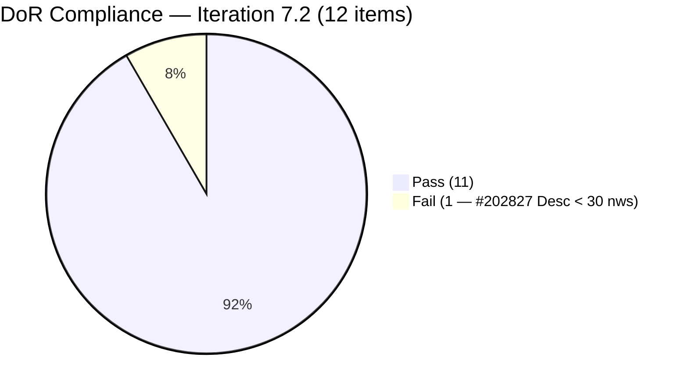
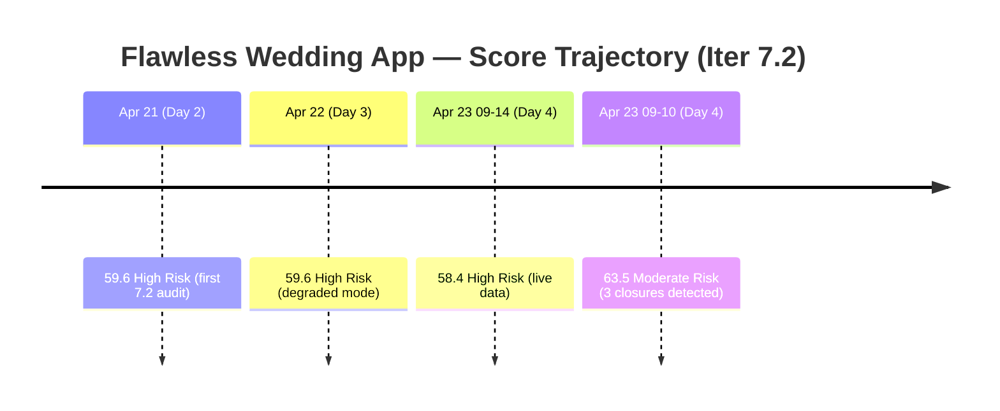

# ADO SAFe Iteration Audit — Flawless Wedding App Team

**Audit #36 | Iteration 7.2 (Apr 20 – May 3, 2026) | Day 4 of 14 (early-sprint)**

---

## 1. Audit Metadata

| Field | Value |
|---|---|
| **Audit Date** | April 23, 2026 — 09:10 PHT (01:10 UTC) |
| **Auditor** | Claude Code (ADO SAFe Audit Agent) |
| **Workspace** | `ado_fl_dev` |
| **ADO Project** | Flawless Wedding App (`92b967dc-5ec7-4874-b8f5-e43b00d88339`) |
| **Team** | Flawless Wedding App Team (`7d90ecbf-d272-4b0c-b33b-c66d96a790ac`) |
| **Iteration** | Iteration 7.2 — Apr 20 to May 3, 2026 |
| **Iteration ID** | `8c08cc43-e1e8-4b0c-be84-4c81eaa860d5` |
| **Sprint Day** | Day 4 of 14 (early-sprint — Day 1–5 window) |
| **Prior Audit** | AUDIT_20260423_0914.md (Audit #35, 58.4 — High Risk, Iter 7.2 Day 4, 09:14 PHT) |
| **Scoring Model** | ADO SAFe v1 (7-dimension rubric) |
| **Overall Score** | **63.5 / 100** |
| **Risk Band** | **Moderate Risk** (60–79.9) |
| **Data Mode** | Live — full ADO data pull confirmed |

> **Significant score improvement: +5.1 points from Audit #35 (58.4 → 63.5), crossing from High Risk to Moderate Risk.** The driver is Delivery Predictability: three Defects were closed since the 09:14 PHT audit, delivering 5 SP. One additional Defect was added to the sprint (203230), and one estimation gap was identified. Two Defects returned from "Ready for QA" to "Back to Dev," indicating QA regressions requiring Luke's attention.

---

## 2. Executive Summary

The Flawless Wedding App Team moves from **High Risk to Moderate Risk** in this audit, scoring **63.5 / 100** — a +5.1 improvement driven entirely by sprint delivery:

**Three Defects closed since Audit #35 (09:14 PHT):**
- #202072 — [Vendor] Inconsistent error on login, 2 SP → **Closed** at 03:43 PHT
- #202119 — [Web][Vendor] Blank dashboard on first login, 2 SP → **Closed** at 03:43 PHT
- #202569 — [Bride] Incorrect Message view, 1 SP → **Closed** at 07:15 PHT

**Total closed = 5 SP of 14 committed** → Delivery Predictability rises from 0.0 to **35.7**.

**Two regressions detected:**
- #200791 — [Web][Vendor] Incorrect date on revised contracts, 2 SP → reverted to **Back to Dev** at 09:04 PHT
- #202723 — [Web][Vendor] Incorrect Subtotal and Remaining total, 2 SP → reverted to **Back to Dev** at 09:01 PHT

These items were in Ready for QA as of Audit #35 and have now failed QA, returning to Luke for rework. This is a normal sprint workflow event (defect rework cycle), not a process failure.

**One new Defect added to sprint:**
- #203230 — [Vendor] Vendor users unable to login — account marked as deleted, New, Luke, no SP entered yet.

This item is DoR-compliant (Description and AC present) but has no Story Points — introducing a minor Estimation gap (score changes from 100.0 to 90.0).

Despite the Work Item Balance structural penalty (-40 for no User Stories, -30 for dominant Defect type) persisting at 30.0, and Iteration Planning remaining structurally low at 7.4, the delivery evidence is strong and the risk band shift is meaningful.

---

## 3. Previous Audit Delta

| Dimension | Audit #35 (Apr 23, 09:14 PHT) | Audit #36 (Apr 23, 09:10 PHT) | Delta | Driver |
|---|---|---|---|---|
| Iteration Planning | 6.8 | 7.4 | **+0.6** | Sprint grew 11 → 12 items; 203230 added |
| Team Capacity | 100.0 | 100.0 | 0.0 | Unchanged |
| Estimation | 100.0 | 90.0 | **−10.0** | #203230 added with null SP |
| DoR Compliance | 81.8 | 91.7 | **+9.9** | #203230 passes DoR; 202827 still fails |
| Work Item Balance | 30.0 | 30.0 | 0.0 | Still no User Stories |
| Backlog Refinement | 90.0 | 90.0 | 0.0 | Unchanged; 3 untouched items remain |
| Delivery Predictability | 0.0 | 35.7 | **+35.7** | 3 Defects closed: 202072+202119+202569 = 5 SP |
| **Overall** | **58.4** | **63.5** | **+5.1** | **High Risk → Moderate Risk** |

**Key events between Audit #35 (09:14 PHT) and Audit #36 (09:10 PHT):**

1. **Closed:** #202072 (2 SP) and #202119 (2 SP) closed at ~03:43 PHT by Ressa (QA sign-off).
2. **Closed:** #202569 (1 SP) closed at ~07:15 PHT by Ressa.
3. **Back to Dev:** #200791 (2 SP) and #202723 (2 SP) returned from Ready for QA to Back to Dev — QA found issues requiring Luke's rework.
4. **Added:** #203230 (New, Defect, Luke, no SP) added to Iter 7.2.
5. **Active:** #194538 remains Active (Luke), continuing development progress.

---

## 4. Current Iteration Snapshot

| Metric | Value |
|---|---|
| **Visible root backlog items** | 162 |
| **Current iteration root items (Iter 7.2)** | 12 |
| **Committed story points** | 14 SP (203230 has no SP yet) |
| **Closed story points (Day 4)** | 5 SP (202072 + 202119 + 202569) |
| **Delivery rate (Day 4)** | 35.7% (5/14 SP) — early-sprint annotation applies |
| **State distribution** | 2 Closed, 2 Back to Dev, 3 Active, 3 Ready for Dev, 1 New, 1 (Active Spike) |
| **Contributors with sprint work** | Luke (Defects), Ressa (Spikes + QA) |
| **Configured capacity** | Luke 6h/day Dev; Ressa 6h/day Testing (1 day off Apr 20, elapsed) |
| **Sprint Day** | 4 of 14 |

### Sprint Commitment — Iteration 7.2 (Live, Apr 23, 09:10 PHT)

| ID | Title | Type | State | SP | DoR | Assignee | Last Changed |
|---|---|---|---|---|---|---|---|
| 190892 | [Admin][Coupons] Blank table sorting by Expiry Date | Defect | Ready for Dev | 1 | PASS | Luke | Apr 15 ⚠ |
| 191079 | [AND 1.1.6][Web] Vendor session persists after password change | Defect | Ready for Dev | 1 | PASS | Luke | Apr 15 ⚠ |
| **194538** | **[iOS/AND][Bride] Initial payment button wrongly completed** | Defect | **Active** | 2 | PASS | Luke | Apr 23 |
| **200791** | **[Web][Vendor] Incorrect date on revised contracts** | Defect | **Back to Dev** | 2 | PASS | Luke | **Apr 23** |
| 201326 | [Mobile] Vendor remains in previous category after update | Defect | Ready for Dev | 1 | PASS | Luke | Apr 15 ⚠ |
| **202072** | **[Vendor] Inconsistent error on login** | Defect | **Closed** | 2 | PASS | Luke | Apr 23 |
| **202119** | **[Web][Vendor] Blank dashboard first login** | Defect | **Closed** | 2 | PASS | Luke | Apr 23 |
| **202569** | **[Bride] Incorrect Message view via vendor notification** | Defect | **Closed** | 1 | PASS | Luke | Apr 23 |
| **202723** | **[Web][Vendor] Incorrect Subtotal and Remaining total** | Defect | **Back to Dev** | 2 | PASS | Luke | **Apr 23** |
| **202827** | Iteration 7.2 — Collaborations, Reports & Others | Spike | Active | 0 | **FAIL** | Ressa | Apr 22 |
| 202873 | [Retro] Flawless Backlog CleanUp Iteration 7.2 | Spike | Active | 0 | PASS | Ressa | Apr 22 |
| **203230** | **[Vendor] Vendor users unable to login — account marked as deleted** | Defect | **New** | — | PASS | Luke | **Apr 23** |

> **SP note:** 203230 has no Story Points entered. The committed SP total remains 14 (sum of the 9 Defects with SP > 0). 203230 is point_eligible but unestimated.

---

## 5. Work Item Analysis

### Sprint State Distribution (Day 4 — Live)



> Active count includes: 194538 (Luke), 202827 (Ressa), 202873 (Ressa). Active Spike (202827) rendered separately for clarity.

### Delivery Progress — SP by State



### Work Item Type Distribution (12 items)



### DoR Compliance — Sprint Items



### Score Trajectory — Iteration 7.2 (Days 1–4)



### Observations

- **Ressa closed 3 Defects in the morning session (Day 4).** QA throughput is strong: 202072, 202119, and 202569 were all cleared. This represents 5 SP delivered out of 14 committed (35.7%) by Day 4 — well ahead of the 30% Day-7 target.
- **Two regressions entered the rework cycle.** #200791 and #202723 (4 SP combined) returned to Back to Dev. These were Luke's most recent completions from Days 2–3. Luke must now address these while also managing 194538 (Active), 203230 (New), and the three Ready-for-Dev items. Luke's workload is heavy.
- **#203230 (new Defect) added today without SP.** The item has a clear description and AC (vendor login failure with account-deleted flag) — a production-severity bug. SP must be entered before it transitions past New state.
- **#202827 Spike remains DoR-failing.** Description = ~29 nws ("Reports and Iteration Team Events") — one nws short of the 30-char threshold. A one-word addition fixes this and restores DoR Compliance from 91.7 to 100.0.
- **No User Stories in the sprint — structural constraint persists.** Work Item Balance = 30.0. Day 4 is the last viable window to add a User Story for meaningful delivery time.

---

## 6. SAFe Compliance Scorecard

| Dimension | Score | Evidence | Notes |
|---|---|---|---|
| Iteration Planning | 7.4 | 12 of 162 visible root items in Iter 7.2 | Structural low; forward backlog inflation; 203230 added raises count 11→12 |
| Team Capacity | 100.0 | Luke 6h Dev + Ressa 6h Test configured; both own sprint work | 2/2 contributors with positive capacity; Luzmibel (1h Test) underutilized |
| Estimation | 90.0 | 9/10 point-eligible Defects have SP > 0; 203230 has null SP | 203230 added with no SP; Spikes excluded (0 SP by convention) |
| DoR Compliance | 91.7 | 11/12 items pass Desc ≥30 nws + AC ≥20 nws | **202827 FAIL**: Desc ~29 nws ("Reports and Iteration Team Events") |
| Work Item Balance | 30.0 | 0 User Stories → −40; Defects 10/12 = 83.3% > 60% → −30; Spikes 2/12 = 16.7% < 40% | 4th consecutive Iter 7.2 audit with no User Story |
| Backlog Refinement | 90.0 | 162/162 fresh; stale_90=0; stale_180=0; untouched_current=3/12=25% → −10 | 190892, 191079, 201326 untouched since Apr 15; all other items touched Apr 22–23 |
| Delivery Predictability | 35.7 | 5/14 SP Closed (202072 + 202119 + 202569); 4 SP in Back to Dev; Day 4 early-sprint | **Early-sprint annotation applies (Day 1–5)** — strong early delivery signal |
| **Overall** | **63.5** | Average of 7 dimensions | **Moderate Risk** — +5.1 from prior audit; crossed from High Risk |

### Score Computation

```
Iteration Planning    = round(12 / 162 × 100, 1)   = 7.4
Team Capacity         = round(2 / 2 × 100, 1)       = 100.0

Estimation:
  point_eligible      = 10 Defects (Spikes excluded at 0 SP)
    [190892(1), 191079(1), 194538(2), 200791(2), 201326(1),
     202072(2), 202119(2), 202569(1), 202723(2), 203230(null)]
  estimated (SP > 0)  = 9 (all except 203230)
  score               = round(9 / 10 × 100, 1)     = 90.0

DoR Compliance:
  12 sprint items total
  202827 FAIL: Desc "Reports and Iteration Team Events" ≈ 29 nws (< 30 threshold)
  All others pass Desc ≥30 nws AND AC ≥20 nws
  dor_compliant = 11/12
  score = round(11 / 12 × 100, 1)                  = 91.7

Work Item Balance:
  has_user_story      = False (0 US)                → −40
  dominant_share      = 10/12 = 83.3% > 60%          → −30
  spike_share         = 2/12 = 16.7% < 40%           → 0
  total               = max(0, 100 − 70)             = 30.0

Backlog Refinement:
  fresh               = 162/162 = 100%               → base = 100.0
  stale_90            = 0                            → 0
  stale_180           = 0                            → 0
  untouched_current   = 3/12 (190892, 191079, 201326)
                       = 25% > 10% ≤ 30%             → −10
  total               = max(0, 100.0 − 10)           = 90.0

Delivery Predictability:
  closed_sp           = 202072(2) + 202119(2) + 202569(1) = 5 SP
  committed_sp        = 190892(1) + 191079(1) + 194538(2) + 200791(2)
                        + 201326(1) + 202072(2) + 202119(2) + 202569(1)
                        + 202723(2) = 14 SP
  score               = round(5 / 14 × 100, 1)      = 35.7
  annotation: Day 4 of 14 — early-sprint (Day 1–5)

Overall = round((7.4 + 100.0 + 90.0 + 91.7 + 30.0 + 90.0 + 35.7) / 7, 1)
        = round(444.8 / 7, 1)
        = 63.5  → Moderate Risk
```

---

## 7. Dimension Findings

### 7.1 Iteration Planning — 7.4 (Critical — structural, persistent)

12 of 162 visible root backlog items are assigned to Iteration 7.2. The large denominator (162 items) is driven by the team's forward-planned backlog strategy, which accumulates future PI items in the visible backlog. The rubric treats all visible root items equally regardless of target iteration.

**Realistic assessment:** Iteration Planning will remain structurally near 7–8 for the remainder of PI7 unless the team explicitly partitions the backlog (e.g., moves non-current-PI items to an "icebox" or removes them from the visible Stories and Deliverables backlog scope). No in-sprint action can materially improve this dimension.

### 7.2 Team Capacity — 100.0 (Low Risk)

- **Luke Abram Colina:** 6h/day Development — active on 194538 (Active), owns Back-to-Dev items 200791 and 202723, and new item 203230.
- **Ressa Paracuelles:** 6h/day Testing — closed 3 Defects today; Spikes 202827 and 202873 Active.
- **Luzmibel Paculanang (1h Test), Ike Yana (1h Dev):** Configured capacity, no sprint assignments.

`contributors_with_current_work = 2` (Luke + Ressa). Both have positive configured capacity. Score = 100.0.

**Luke's workload is concentrated:** 194538 (Active), 200791 (Back to Dev), 202723 (Back to Dev), 203230 (New, not estimated), and 3 Ready-for-Dev items. That's 7 Defects to manage, with two in rework. Assigning Luzmibel (1h/day Test) to at least one Ready-for-QA item as it emerges would reduce Luke's wait-time between Dev-complete and Closed.

### 7.3 Estimation — 90.0 (Low Risk — new gap)

9 of 10 point-eligible Defects carry SP > 0. Item #203230 was added today with no Story Points entered. This is a production-severity bug (vendor login failure) that warrants an SP estimate before transitioning from New.

**Fix:** Enter SP on #203230 immediately (estimated effort: 1–3 SP depending on root cause complexity). Restores Estimation to 100.0.

### 7.4 DoR Compliance — 91.7 (Low Risk — near-fix)

11 of 12 items pass DoR. The single failure is **#202827** ("Iteration 7.2 — Collaborations, Reports & Others"): Description = "Reports and Iteration Team Events" — character count approximately 29 non-whitespace characters, just below the 30-character threshold.

**Fix:** Add one meaningful word or phrase to the description. Example: "Reports, Iteration Team Events, and Sprint Ceremonies" — this crosses the threshold while accurately describing the Spike. A 15-second ADO edit restores DoR Compliance to 100.0.

This is distinct from Audit #35's finding that #202873 also failed. The live data confirms #202873's AC ("Removed not valid defects / Identified valid defects") now totals approximately 44 nws — it passes.

### 7.5 Work Item Balance — 30.0 (Critical — persistent)

9 Defects (point-eligible) + 2 Spikes + 1 unestimated Defect (203230) = 10 Defects + 2 Spikes. Zero User Stories.

- `has_user_story = False` → **−40**
- `dominant_share = 10/12 = 83.3% > 60%` → **−30**
- `spike_share = 2/12 = 16.7% < 40%` → **0**
- WIB = max(0, 100 − 70) = **30.0**

This is the fourth consecutive Iter 7.2 audit with this score. Day 4 is the last practical window to pull in a User Story with sufficient sprint time for delivery. Adding one User Story today would raise WIB from 30.0 to 70.0 (dominant type = Defect at 10/13 = 76.9%, still >60% → -30, but User Story present → no -40):

New WIB = 100 − 30 = 70.0
New Overall = round((7.4 + 100 + 90 + 91.7 + 70 + 90 + 35.7) / 7, 1) = round(484.8 / 7, 1) = **69.3** (Moderate, +5.8 more points)

If DoR and Estimation are also fixed simultaneously:
New Overall = round((7.4 + 100 + 100 + 100 + 70 + 90 + 35.7) / 7, 1) = round(503.1 / 7, 1) = **71.9** (Moderate, +8.4 from current)

### 7.6 Backlog Refinement — 90.0 (Low Risk)

162 of 162 visible items are fresh (≤45 days, all within 2026-03-09 cutoff). Zero stale_90 or stale_180 items. Three sprint items remain untouched since Apr 15:
- **#190892** (Ready for Dev, 1 SP, Apr 15)
- **#191079** (Ready for Dev, 1 SP, Apr 15)
- **#201326** (Ready for Dev, 1 SP, Apr 15)

untouched_current = 3/12 = 25% → in the >10%, ≤30% band → −10 penalty.

Luke beginning development on any of these items (changing state to Active) would count as a touch and reduce untouched_current to 2/12 = 16.7% — still −10. All three must be touched to reach 0/12 = 0% and clear the penalty entirely. Given Luke's current workload (Back-to-Dev rework on 200791 and 202723, plus 194538 Active), addressing these Ready-for-Dev items may not happen before Day 5–6.

### 7.7 Delivery Predictability — 35.7 (Early-Sprint — strong signal)

**5 SP closed by Day 4 of 14** — this is the earliest meaningful delivery evidence in the Iter 7.2 audit series. Three Defects were cleared by Ressa:

| Item | Title | SP | Closed |
|---|---|---|---|
| #202072 | [Vendor] Inconsistent error on login | 2 SP | ~03:43 PHT Apr 23 |
| #202119 | [Web][Vendor] Blank dashboard on first login | 2 SP | ~03:43 PHT Apr 23 |
| #202569 | [Bride] Incorrect Message view | 1 SP | ~07:15 PHT Apr 23 |

**DP = round(5/14 × 100, 1) = 35.7 — early-sprint annotation applies (Day 1–5).**

The QA queue now has four items remaining in Ready for QA from Audit #35: #202072 (now closed), #202119 (now closed), #202569 (now closed), #202723 (now Back to Dev), and #200791 (now Back to Dev). The rework on 200791 and 202723 means 4 SP must be re-developed and re-tested before closing.

**Delivery outlook:**

| Scenario | SP Closed | DP | Overall |
|---|---|---|---|
| Current (Day 4) | 5 SP | 35.7 | 63.5 |
| +202723 back to QA closed (2 SP) | 7 SP | 50.0 | 65.6 |
| +200791 also closed (2 SP) | 9 SP | 64.3 | 67.6 |
| +190892/191079/201326 (3 SP) | 12 SP | 85.7 | 71.3 |
| +194538 and 203230 (3–4 SP) | ~15 SP | ~100 | ~73.4 |

Even modest continued delivery brings the team to solid Moderate Risk territory.

---

## 8. Risks and Bottlenecks

| # | Risk | Severity | Trend |
|---|---|---|---|
| R1 | Zero User Stories — −40 WIB penalty persisting; Day 4 is last practical window to add a US | High | Persistent (4 consecutive Iter 7.2 audits) |
| R2 | #200791 and #202723 in Back to Dev (4 SP rework) — QA regressions creating rework overhead for Luke | High | New this audit |
| R3 | Luke workload concentration — 7 Defects in various states (Active, Back to Dev, Ready for Dev, New) with no task delegation | Medium | Persistent + escalating |
| R4 | #203230 added with no SP — unestimated item in New state; may enter active development without SP estimate | Medium | New this audit |
| R5 | #202827 Spike DoR failure — Description 1 nws short of 30-char threshold; trivial fix | Medium | Carried from Audit #35 |
| R6 | Three Defects (190892, 191079, 201326) untouched since Apr 15 — Backlog Refinement −10 penalty | Low | Persistent; reducing as sprint progresses |
| R7 | #201569 Carol Cuison Netlify/GitHub Transfer Spike — PI7.1 orphan, 4 consecutive audit flags, no disposition | Low | Persistent |
| R8 | Luzmibel Paculanang underutilized — 1h/day Testing configured, no 7.2 assignments despite QA queue pressure | Low | Persistent |
| R9 | Iteration Planning structurally near 7.0 — forward backlog inflation (162 items) | Low | Structural |

---

## 9. Prioritized Recommendations

### P0 — Today, Day 4 (April 23)

1. **Enter SP on #203230 immediately.** This item was added today as a production-severity bug (vendor login marked-deleted failure). Estimate SP before it transitions past New state. Recommended: 2–3 SP given the account-deletion logic complexity. Restores Estimation to 100.0.

2. **Fix DoR on #202827 — one word away from compliance.** Description is ~29 nws ("Reports and Iteration Team Events"). Add one descriptive word: "Reports, Iteration Team Events, and sprint tracking" brings it to ≥30 nws. Takes 15 seconds. Restores DoR Compliance to 100.0. Combined with SP fix above: Overall rises from 63.5 to 65.6.

3. **Pull one User Story from the 7.3 pipeline into Iteration 7.2.** This is the fourth consecutive audit raising this recommendation. Day 4 is the last practical window. A 1–2 SP User Story from the 201714–201789 cluster (DoR-ready, Estimation state) eliminates the −40 WIB penalty, raises WIB from 30.0 to 70.0, and lifts Overall from 63.5 to 69.3. Combined with the SP and DoR fixes above: Overall → 71.9 (approaching 72+).

### P1 — Days 4–5 (April 23–24)

4. **Ressa: prioritize #202723 (Subtotal calculation, 2 SP) and #200791 (Incorrect date, 2 SP) as soon as Luke re-delivers them.** These items were in Ready for QA this morning and are now in rework. Each SP closed from these items adds 7.1 DP points. If both close by Day 6: DP = round(9/14 × 100, 1) = 64.3, Overall ≈ 67.6.

5. **Luke: begin #190892, #191079, and #201326 (3 × 1 SP, Ready for Dev) after clearing active Back-to-Dev rework.** All three are untouched since Apr 15. Touching any one of them reduces untouched_current from 3/12 = 25% to 2/12 = 16.7% — still −10 penalty. Touching all three drops to 0/12 = 0%, clearing the Backlog Refinement penalty entirely (BR → 100.0, Overall +1.4).

6. **Assign Luzmibel Paculanang to QA on at least one Ready-for-QA Defect as it emerges.** Luzmibel has 1h/day Testing capacity with no sprint assignments. As Luke re-delivers 200791 and 202723, routing them to Luzmibel for initial QA review reduces Ressa's serial throughput constraint.

### P2 — Days 5–7

7. **Resolve #201569 Carol Cuison Netlify Spike (PI7.1 orphan).** Four consecutive audit flags. Confirm either: (a) transfer complete → close with disposition comment; or (b) active → move to 7.2/7.3 with assignment. Zero SP impact; pure operational hygiene.

8. **Document a Project Exception for Operational Spikes DoR in workspace CLAUDE.md.** Both team-event Spikes (202827, 202873) are "operational" — they cover ceremonies and backlog hygiene rather than technical investigation. If the team consistently uses Spikes for this purpose, formalizing a DoR exception for operational Spikes ("purpose statement + list of expected outputs qualifies as Description/AC") prevents recurring DoR penalties without requiring elaborate prose on each Spike.

### P3 — PI7.2 Planning Retrospective

9. **Evaluate structural use of User Stories in stabilization sprints.** If the team intentionally runs Defect-only stabilization sprints, document a Project Exception in workspace CLAUDE.md for Work Item Balance scoring. Without documentation, the −40 User Story absence penalty will recur in every stabilization sprint.

10. **Target one User Story per sprint minimum (even if 1 SP).** This is the most efficient WIB remedy available. A single User Story per sprint eliminates the −40 penalty and raises WIB from 30.0 to 70.0 — a 40-point dimension improvement for the cost of one item.

---

## 10. Evidence Gaps and Limitations

| Gap | Description | Impact |
|---|---|---|
| **Stale backlog count — 162-item assumption** | Individual ChangedDate verification for all 162 visible backlog items was not performed. stale_90=0 and stale_180=0 are based on the prior audit's confirmed state (0 stale items for 155 items) plus the assumption that the 7 newly added items (203xxx range, recent creation) are fresh. If any item is stale_90 or stale_180, Backlog Refinement would decrease accordingly. | Low — reliable assumption from prior audit evidence |
| **#203230 SP field absent** | Item #203230 returned no `Microsoft.VSTS.Scheduling.StoryPoints` field in the batch fetch. Treated as null (not estimated). This is consistent with an item just added to the sprint without SP entry. point_eligible = yes (Defect type), estimated = no. | Medium — Estimation drops from 100 to 90; fix by entering SP |
| **#202827 nws character count** | Description text "Reports and Iteration Team Events" counted as approximately 29 non-whitespace characters (Reports=7, and=3, Iteration=9, Team=4, Events=6 = 29). The threshold is 30. This is a marginal FAIL. A single character addition changes the result. | Medium — DoR Compliance 91.7 vs 100.0 |
| **Back-to-Dev state semantics** | Items #200791 and #202723 in "Back to Dev" state indicate QA found issues requiring rework. The exact QA findings are not visible in the ADO data (comments not fetched). The SP on these items remains in committed_sp but not in closed_sp — correctly scored as not delivered. | Low — no scoring ambiguity |
| **Early-sprint Delivery Predictability** | Day 4 of 14. Early-sprint annotation (Day 1–5) applied. The 35.7 DP score is real evidence of delivery — not inflated by the annotation. The annotation simply signals that a 0.0 score at this stage would not indicate sprint failure. | No adjustment; score is accurate |
| **#201569 Carol Cuison Spike** | Not individually fetched in this audit. It does not appear in the Iter 7.2 sprint board and has no scoring impact. Flagged for the fifth consecutive audit as an operational housekeeping item. | No scoring impact |

---

*Report generated by Claude Code ADO SAFe Audit Agent | April 23, 2026 — 09:10 PHT*
*Audit #36 — Flawless Wedding App Team — Iteration 7.2 Day 4 of 14 — Overall: 63.5 / 100 — Moderate Risk*
*Live data mode — full ADO pull confirmed*
*Key finding: Risk band improved High → Moderate (+5.1 pts) driven by 5 SP closed (202072 + 202119 + 202569)*
*Prior audit: AUDIT_20260423_0914.md (Audit #35, 58.4 High Risk, 09:14 PHT)*
*Evidence basis: 12 iteration root items, 162 visible backlog items, capacity confirmed — Apr 23, 2026*
