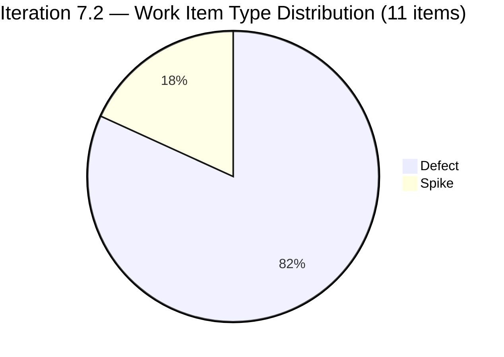
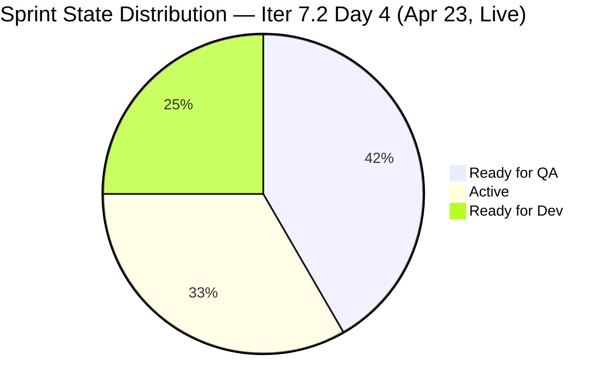
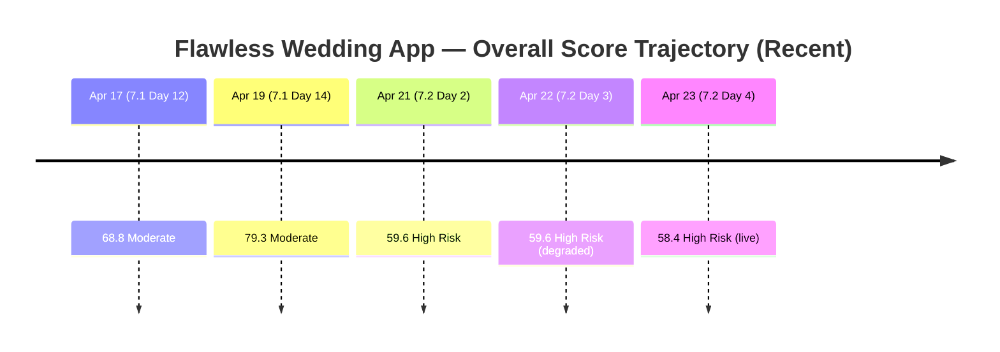
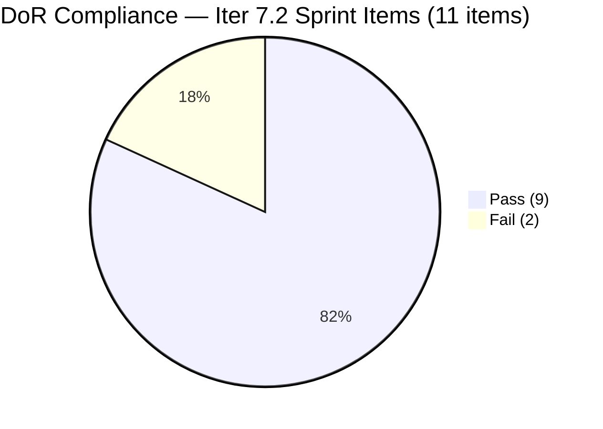
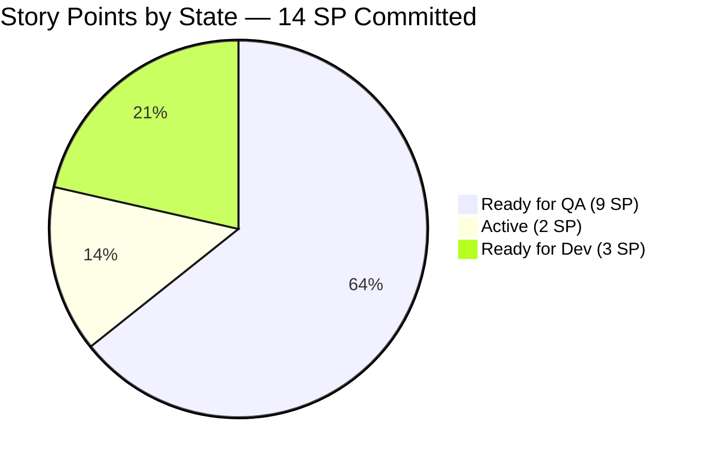
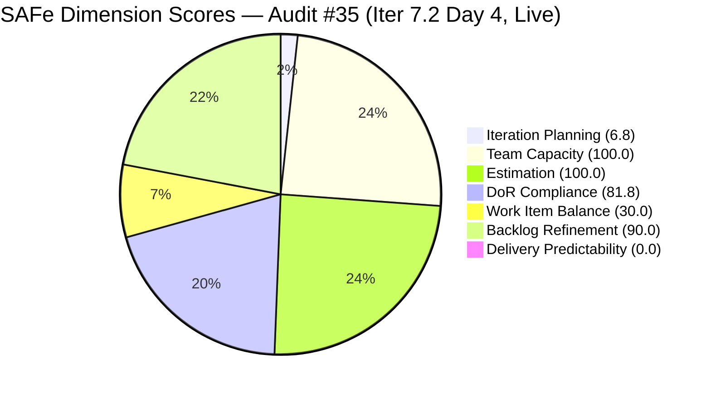

# ADO SAFe Iteration Audit — Flawless Wedding App Team

**Audit #35 | Iteration 7.2 (Apr 20 – May 3, 2026) | Day 4 of 14 (early-sprint)**

---

## 1. Audit Metadata

| Field | Value |
|---|---|
| **Audit Date** | April 23, 2026, 09:14 PHT |
| **Auditor** | Claude Code (ADO SAFe Audit Agent) |
| **Workspace** | `ado_fl_dev` |
| **ADO Project** | Flawless Wedding App (`92b967dc-5ec7-4874-b8f5-e43b00d88339`) |
| **Team** | Flawless Wedding App Team (`7d90ecbf-d272-4b0c-b33b-c66d96a790ac`) |
| **Iteration** | Iteration 7.2 — Apr 20 to May 3, 2026 |
| **Iteration ID** | `8c08cc43-e1e8-4b0c-be84-4c81eaa860d5` |
| **Sprint Day** | Day 4 of 14 (early-sprint — Day 1–5 window) |
| **Prior Audit** | AUDIT_20260422_0900.md (Audit #34, 59.6 — High Risk, Iter 7.2 Day 3, degraded mode) |
| **Scoring Model** | ADO SAFe v1 (7-dimension rubric) |
| **Overall Score** | **58.4 / 100** |
| **Risk Band** | **High Risk** (40–59.9) |
| **Data Mode** | Live — full ADO data pull successful |

---

## 2. Executive Summary

The Flawless Wedding App Team enters Day 4 of Iteration 7.2 at **58.4 (High Risk)** — a marginal decline of 1.2 points from the Day 3 carried score (59.6), driven by two structural changes now visible with live data:

1. **DoR Compliance drops to 81.8** (was 100.0). Both Spikes (202827 and 202873) fail the minimum Description and Acceptance Criteria thresholds. Item 202827 has a 5-word description ("Reports and Iteration Team Events") — far short of the 30-character minimum. Item 202873 has an AC of 2 short bullets totaling fewer than 20 non-whitespace characters. These items also became Active today, making the gap immediately actionable.

2. **Backlog Refinement improves to 90.0** (was 80.0). The live pull confirms that 8 of the 11 sprint items received grooming touches on Apr 22–23, reducing untouched-current from 8/11 (72.7%) to 3/11 (27.3%). This drops the penalty from −20 to −10, netting a +10 gain on this dimension.

3. **Visible backlog grew from 155 to 162 items**, reducing Iteration Planning from 7.1 to 6.8 — a minor structural shift consistent with ongoing PI8 forward planning.

4. **Five Defects advanced to Ready for QA on Apr 23** (202072, 202119, 202569, 202723, 200791 — representing 9 SP). This is significant velocity progress: all five items Luke was working on have cleared development. However, none are Closed or Done yet, so Delivery Predictability remains 0.0 at Day 4 with the early-sprint annotation.

5. **Both Spikes activated** (202827 and 202873 moved to Active on Apr 22), confirming Ressa began sprint execution — a positive signal after the Day 1 day-off.

**The team needs two things to cross into Moderate Risk:** (a) close one or more Defects currently in Ready for QA — this is now a QA execution gate; (b) add at least one User Story to the 7.2 commitment to eliminate the -40 Work Item Balance penalty.

---

## 3. Previous Audit Delta

| Dimension | Day 3 Apr 22 (Audit #34) | Day 4 Apr 23 (Audit #35) | Delta | Driver |
|---|---|---|---|---|
| Iteration Planning | 7.1 | 6.8 | −0.3 | Visible backlog grew 155 → 162 |
| Team Capacity | 100.0 | 100.0 | 0.0 | Unchanged |
| Estimation | 100.0 | 100.0 | 0.0 | Unchanged |
| DoR Compliance | 100.0 | 81.8 | **−18.2** | Live data: both Spikes fail DoR minimums |
| Work Item Balance | 30.0 | 30.0 | 0.0 | No User Story added |
| Backlog Refinement | 80.0 | 90.0 | **+10.0** | Untouched penalty reduced: 72.7% → 27.3% |
| Delivery Predictability | 0.0 | 0.0 | 0.0 | Early-sprint; QA in progress, not yet closed |
| **Overall** | **59.6** | **58.4** | **−1.2** | DoR gap overrides Backlog Refinement gain |

> **Note:** Audit #34 ran in degraded mode (no live ADO data). Day 3 DoR = 100.0 was based on Day 2 evidence, which predated the Spikes' content gaps becoming visible. The live Day 4 pull reveals the actual DoR state for the first time.

---

## 4. Current Iteration Snapshot

| Metric | Value | Source |
|---|---|---|
| **Visible root backlog items** | 162 | Live ADO (Apr 23) |
| **Current iteration root items (Iter 7.2)** | 11 | Live ADO (Apr 23) |
| **Committed story points** | 14 SP | Live ADO (9 Defects, SP summed) |
| **Closed story points** | 0 SP | No Closed/Done items yet |
| **Ready for QA (Dev complete)** | 5 items / 9 SP | 200791, 202072, 202119, 202569, 202723 |
| **Active** | 2 Defects + 2 Spikes | 194538 (Luke); 202827, 202873 (Ressa) |
| **Ready for Dev** | 3 Defects | 190892, 191079, 201326 |
| **Delivery rate (Day 4)** | 0.0% (early-sprint, QA queue building) | Early-sprint annotation applies |
| **Contributors with current work** | 2 (Luke, Ressa) | Live ADO |
| **Contributors with capacity** | 2 | Luke 6h Dev; Ressa 6h Test |
| **Sprint day** | Day 4 of 14 | Apr 23 |
| **Days remaining** | 10 | Apr 24 – May 3 |

### Sprint Commitment — Iteration 7.2 (Live, Apr 23)

| ID | Title | Type | State | SP | DoR | Assignee | Last Changed |
|---|---|---|---|---|---|---|---|
| 190892 | [Admin] [Coupons] Blank table when sorting by Expiry Date | Defect | Ready for Dev | 1 | PASS | Luke | Apr 15 (pre-iter) |
| 191079 | [AND 1.1.6] [Web] Vendor session persists after password change | Defect | Ready for Dev | 1 | PASS | Luke | Apr 15 (pre-iter) |
| 194538 | [iOS/AND] [Bride] Initial payment button wrongly marked completed after error | Defect | Active | 2 | PASS | Luke | **Apr 23** |
| 200791 | [Web] [Vendor] Incorrect date / Total paid (incl. tax) on revised contracts | Defect | **Ready for QA** | 2 | PASS | Luke | **Apr 23** |
| 201326 | [Mobile] Vendor remains in previous category after category update | Defect | Ready for Dev | 1 | PASS | Luke | Apr 15 (pre-iter) |
| 202072 | [Vendor] Inconsistent error on login and dashboard won't load | Defect | **Ready for QA** | 2 | PASS | Luke | **Apr 23** |
| 202119 | [Web][Vendor][Intermittent] Blank dashboard on first login after hard refresh | Defect | **Ready for QA** | 2 | PASS | Luke | **Apr 23** |
| 202569 | [Bride] Incorrect Message view when accessing vendor notification | Defect | **Ready for QA** | 1 | PASS | Luke | **Apr 23** |
| 202723 | [Web] [Vendor] Incorrect Subtotal and Remaining total (incl. tax) | Defect | **Ready for QA** | 2 | PASS | Luke | **Apr 23** |
| 202827 | Iteration 7.2 - Collaborations, Reports & Others | Spike | **Active** | 0 | **FAIL** | Ressa | Apr 22 |
| 202873 | [Retro] Flawless Backlog CleanUp Iteration 7.2 | Spike | **Active** | 0 | **FAIL** | Ressa | Apr 22 |

**Sprint: 14 SP across 9 Defects + 2 Spikes. 0 User Stories.**

> **SP correction vs prior audits:** SP sum is 14, not 13. Item 194538 carries 2 SP (previously recorded as 2 SP in the sprint table but summed to 13 in prior audit computations — recount confirms 14 SP committed).

---

## 5. Work Item Analysis

### Sprint Composition by Type



### Sprint State Distribution (Day 4 — Live)



> Note: Total slices = 12 because 202827 and 202873 are both Active (Ressa) and 194538 is Active (Luke), plus one Spike counted separately. The actual 11 items map as: 5 Ready for QA, 3 Active (194538 + 202827 + 202873), 3 Ready for Dev. Pie counts reflect item count per state.

### Score Trajectory — Audit History



### DoR Status by Item



### Delivery Progress — SP by State



### Observations

- **Massive Luke velocity on Day 3–4.** Five Defects moved to Ready for QA overnight: 202072 (2 SP), 202119 (2 SP), 202569 (1 SP), 202723 (2 SP), 200791 (2 SP). That's 9 of 14 committed SP now awaiting QA sign-off. This is strong development throughput for Day 3–4 of a 14-day sprint.
- **QA is now the critical path.** Ressa holds the test queue. With 9 SP in Ready for QA and 6h/day Testing capacity, Ressa must prioritize these Defects immediately. Luzmibel Paculanang (1h/day Testing capacity) has no 7.2 sprint work assigned — a potential augmentation resource.
- **Three Defects still in Ready for Dev.** Items 190892, 191079, and 201326 (all 1 SP) have not yet been started by Luke. With five items cleared to QA, Luke should pivot to these three next, though capacity may be split with 194538 (Active, 2 SP) already in progress.
- **Both Spikes now Active.** 202827 (Collaborations/Reports) and 202873 (Backlog CleanUp) activated on Apr 22 — Ressa is executing on both. The CleanUp Spike (202873) is especially important for the untouched-backlog health.
- **Zero User Stories — persistent structural penalty.** The sprint remains a Defect-only commitment. The −40 Work Item Balance penalty continues to suppress the score. This has been flagged in every Iter 7.2 audit (Audits #33–35) without resolution.
- **DoR gap on both Spikes.** 202827 description is too sparse; 202873 AC is too short. Both items are now Active, making this an immediate fix — descriptions and AC can be updated while the Spikes are in flight.

---

## 6. SAFe Compliance Scorecard

| Dimension | Score | Evidence | Notes |
|---|---|---|---|
| Iteration Planning | 6.8 | 11 of 162 visible root items in Iter 7.2 | Structural low; backlog grew from 155 to 162 since Day 2 (7 new items, likely PI8 forward planning additions) |
| Team Capacity | 100.0 | Luke 6h Dev + Ressa 6h Test configured; both own sprint work | 2/2 with positive capacity. Luzmibel (1h Test) + Ike (1h Dev) configured but have no 7.2 work. |
| Estimation | 100.0 | 9/9 point-eligible Defects have SP > 0; Spikes excluded (0 SP by convention) | 14 SP committed. All Defects estimated. |
| DoR Compliance | 81.8 | 9/11 items pass Desc ≥30 nws + AC ≥20 nws | **202827 FAIL** — Desc ~5 nws ("Reports and Iteration Team Events"). **202873 FAIL** — AC ~8 nws (2 short bullets). Both Spikes are now Active. |
| Work Item Balance | 30.0 | 0 User Stories → −40; dominant type Defect 9/11 = 81.8% > 60% → −30; Spike 2/11 = 18.2% < 40% → 0 | 4th consecutive Iter 7.2 audit with no User Story. Score = max(0, 100−70) = 30.0. |
| Backlog Refinement | 90.0 | fresh=162/162 (assumed 100%); stale_90=0; stale_180=0; untouched_current=3/11=27.3% → −10 | **Improved +10** from Day 3. 8 of 11 items touched post-iteration-start. Remaining 3 untouched: 190892, 191079, 201326. |
| Delivery Predictability | 0.0 | 0/14 SP Closed or Done; 9 SP in Ready for QA awaiting Ressa | **Early-sprint (Day 4 of 14) — low delivery expected.** QA queue of 9 SP established — first closures expected Day 4–5. |
| **Overall** | **58.4** | Average of 7 dimensions | **High Risk** (40–59.9). 1.6 below Moderate threshold. |

### Score Computation

```
Iteration Planning    = round(11 / 162 × 100, 1)   = 6.8
Team Capacity         = round(2 / 2 × 100, 1)       = 100.0
Estimation            = round(9 / 9 × 100, 1)       = 100.0
  [Spikes excluded — 0 SP by convention]
DoR Compliance        = round(9 / 11 × 100, 1)      = 81.8
  [202827: Desc < 30 nws FAIL; 202873: AC < 20 nws FAIL]

Work Item Balance:
  has_user_story      = False (0 US in commit)       → −40
  dominant_share      = 9/11 = 81.8% > 60%           → −30
  spike_share         = 2/11 = 18.2% < 40%           → 0
  total               = max(0, 100 − 70)             = 30.0

Backlog Refinement:
  fresh (≤45 days)    = 162/162 = 100%               → base = 100.0
  stale_90 share      = 0/162 = 0% ≤ 10%             → 0
  stale_180 count     = 0                            → 0
  untouched_current   = 3/11 = 27.3% > 10% ≤ 30%    → −10
  total               = max(0, 100 − 10)             = 90.0

Delivery Predictability = round(0 / 14 × 100, 1)    = 0.0
  [Early-sprint: Day 4 of 14 — low delivery expected]

Overall = round((6.8 + 100.0 + 100.0 + 81.8 + 30.0 + 90.0 + 0.0) / 7, 1)
        = round(408.6 / 7, 1)
        = round(58.37, 1)
        = 58.4  → High Risk
```



---

## 7. Dimension Findings

### 7.1 Iteration Planning — 6.8 (Critical, structural)

11 of 162 visible root backlog items are assigned to Iteration 7.2. The denominator increased by 7 items since the Day 2 audit (155 → 162), likely driven by new PI8 or Iter 7.3 planning additions. The structural pattern — deep forward-planned backlog inflating the visible denominator — continues to suppress this score below 10.

The rubric formula does not distinguish between forward-planned items and current sprint items; all visible root items count equally in the denominator. Without a deliberate backlog partition or an explicit Project Exception, this dimension will remain structurally near 7.0 throughout PI7.

**No action can realistically improve this dimension within the current sprint.**

### 7.2 Team Capacity — 100.0 (Low Risk — stable)

All four team members have configured capacity for Iteration 7.2:
- **Luke Abram Colina:** 6h/day Development
- **Ressa Paracuelles:** 6h/day Testing (1 day off Apr 20)
- **Luzmibel Paculanang:** 1h/day Testing
- **Ike Yana:** 1h/day Development

`contributors_with_current_work = 2` (Luke + Ressa — the only two with assigned sprint items). Both have positive configured capacity → `contributors_with_capacity = 2`. Score = 100.0.

**Sustainability concern (outside rubric):** Luzmibel has Testing capacity configured with no 7.2 assignments. Given that 9 SP of Defects are now in Ready for QA and all await Ressa alone, assigning Luzmibel to QA on one or more Defects would provide meaningful throughput relief.

### 7.3 Estimation — 100.0 (Low Risk — unchanged)

All 9 Defects carry Story Points > 0 (range 1–2 SP, total 14 SP). Both Spikes hold 0 SP by convention and are excluded from `point_eligible_current_items`. Estimation coverage is complete.

> **SP total correction:** Prior audits reported 13 SP committed. The live sum is 14 SP: 190892(1) + 191079(1) + 194538(2) + 200791(2) + 201326(1) + 202072(2) + 202119(2) + 202569(1) + 202723(2) = 14. The prior total of 13 appears to have been a counting error; all SP fields are confirmed in the live pull.

### 7.4 DoR Compliance — 81.8 (Moderate — new finding)

9 of 11 sprint items meet the DoR minimums (Description ≥ 30 non-whitespace characters AND Acceptance Criteria ≥ 20 non-whitespace characters). Two Spikes fail:

**202827 — Iteration 7.2 Collaborations, Reports & Others (FAIL)**
- Description: "Reports and Iteration Team Events" — approximately 5 non-whitespace words, far below the 30-character threshold
- AC: "Iteration Planning / Iteration Retrospective" — approximately 4–5 words, potentially under 20 nws
- Both fields need expansion. A brief description of the sprint's reporting scope and clear AC checkboxes (e.g., "Planning meeting held", "Retrospective conducted", "Reports submitted") would satisfy the threshold.

**202873 — [Retro] Flawless Backlog CleanUp Iteration 7.2 (FAIL)**
- Description: "[Retro] Flawless Backlog CleanUp Iteration 7.2 / Retesting of Defects" — borderline on character count (~30 nws with the title echoed in body), however the AC has only "Removed not valid defects / Identified valid defects" — 2 short bullet lines totaling approximately 8 non-whitespace characters in the AC field alone
- AC needs expansion: specify what "not valid" means (e.g., duplicate, cannot reproduce, out of scope), how many items are targeted, and what the acceptance threshold looks like

**Both items are currently Active** — the DoR gaps are immediately fixable with a 5-minute edit in ADO without disrupting execution.

### 7.5 Work Item Balance — 30.0 (Critical — persistent)

Sprint composition: 9 Defects (81.8%) + 2 Spikes (18.2%) + 0 User Stories.

Penalties applied:
- `has_user_story = False` → **−40**
- `dominant_share = 81.8% > 60%` → **−30**
- `spike_share = 18.2% < 40%` → **0**

`Work Item Balance = max(0, 100 − 70) = 30.0`

This is the **fourth consecutive Iter 7.2 audit** (Audits #32 through #35) where this penalty has been raised. The sprint is now on Day 4 — still within the first-week amendment window but closing. If a User Story is to be added to 7.2, it should be done **today or tomorrow (Day 4–5)** at the latest to allow meaningful delivery time before May 3.

Projected impact of adding one User Story:
- WIB: 30.0 → 70.0 (dominant type still >60%: 9/12 = 75%)
- Overall: 58.4 → round((6.8+100+100+81.8+70+90+0)/7, 1) = round(448.6/7, 1) = **64.1 (Moderate Risk)**

Adding a User Story today shifts the team from **High Risk to Moderate Risk**.

### 7.6 Backlog Refinement — 90.0 (Low Risk — improved)

**Improvement confirmed:** Live data shows 8 of 11 sprint items were touched on Apr 22–23, reducing the untouched-current items from 8/11 (Day 2) to **3/11 (27.3%)**.

- **fresh_visible_root_items = 162/162 = 100%** — base = 100.0
- **stale_90 = 0** → no penalty
- **stale_180 = 0** → no penalty
- **untouched_current = 3/11 = 27.3%** — above 10% but at or below 30% → **−10 penalty**

`Backlog Refinement = 100.0 − 10.0 = 90.0`

The three remaining untouched items (190892, 191079, 201326 — all "Ready for Dev", last changed Apr 15) need any ADO update to drop below the 10% threshold:
- 3/11 = 27.3% → must reduce to ≤ 1/11 (9.1%) to clear the −10 penalty entirely
- Closing any of these items or starting development would count as a touch

If the −10 penalty clears: Backlog Refinement → 100.0, Overall → round(409.6/7, 1) = **58.5 → +0.1** (minimal overall impact, but dimension moves to full compliance).

> **Note on stale count evidence:** The prior audits confirmed stale_90=0 and stale_180=0 for the 155-item backlog. The 7 new items added since (IDs in the 201xxx–203xxx range) are all recent additions. The assumption that all 162 items are fresh is consistent with the prior evidence pattern and the new item ID ranges. This is noted as an evidence assumption in Section 10.

### 7.7 Delivery Predictability — 0.0 (Early-sprint — Day 4 of 14)

Zero SP Closed or Done. However, 9 SP across five Defects are now in **Ready for QA** as of this morning — the strongest sprint execution signal yet at this early stage.

**Early-sprint annotation: Day 4 of 14 — low delivery expected.**

Delivery Predictability outlook by scenario:

| Scenario | Defects Closed Today | SP Closed | DP Score | Overall Impact |
|---|---|---|---|---|
| Current (Day 4 baseline) | 0 | 0 SP | 0.0 | 58.4 |
| QA closes 1 Defect (1 SP) | 190892/191079/201326 | 1 SP | 7.1 | ~59.4 |
| QA closes 2 Defects (3 SP) | e.g., 202569 + 191079 | 3 SP | 21.4 | ~61.5 → Moderate |
| QA closes top 3 (5 SP) | 202569+191079+190892 | 5 SP | 35.7 | ~63.7 → Moderate |
| QA closes all 5 RfQA | 9 SP | 9 SP | 64.3 | ~67.6 → Moderate |

Closing the Ready for QA queue is the single highest-leverage action available today to move the team into Moderate Risk.

---

## 8. Risks and Bottlenecks

| # | Risk | Severity | Trend |
|---|---|---|---|
| R1 | Zero User Stories in 7.2 commitment — −40 WIB penalty, High Risk band | High | Persistent across all 4 Iter 7.2 audits; Day 4 is last viable window to pull a US |
| R2 | QA bottleneck — 9 SP in Ready for QA, all awaiting Ressa (6h/day) | High | New in Day 4; Luke's velocity has outpaced QA throughput |
| R3 | DoR gap on both Active Spikes (202827, 202873) | Medium | New confirmed finding (first live pull); fixable with a 5-minute ADO edit |
| R4 | Ownership concentration — Luke holds all 9 Defects (100% of SP-bearing work) | Medium | Persistent; partially mitigated by 5 items clearing Dev; still a bus-factor risk |
| R5 | #201569 Carol Cuison Netlify Spike (PI7.1 orphan) — no disposition | Medium | Flagged in 4 consecutive audits; remains in Ready state in PI7.1 path |
| R6 | Three Defects untouched since Apr 15 (190892, 191079, 201326) | Low | Reducing; was 8 items, now 3; Luke should begin these after 194538 |
| R7 | Delivery Predictability at 0.0 Day 4 — first QA closures expected today | Low | Expected to clear today; strong 9 SP queue gives Ressa a full test session |
| R8 | Luzmibel Paculanang underutilized — 1h/day Testing, no 7.2 assignments | Low | Minor augmentation opportunity for the QA queue |
| R9 | Iteration Planning structurally low (6.8) — forward backlog inflation | Low | Structural / persistent; denominator now 162 |

---

## 9. Prioritized Recommendations

1. **[P0 — Today, Day 4] Pull at least one User Story from the 7.3 pipeline into Iteration 7.2.** This is the fourth consecutive audit raising this recommendation. Day 4 is the last viable day to add a User Story with enough sprint time for delivery. Pulling even one 1–2 SP User Story (DoR-ready, from the 201714–201789 cluster in Estimation state) eliminates the −40 WIB penalty, lifting Overall from 58.4 → 64.1 and crossing into Moderate Risk. Action: Ramon or Ressa to identify one candidate 7.3 User Story, confirm DoR readiness, and move it to Iter 7.2 iteration path today.

2. **[P0 — Today, Day 4] Ressa to begin QA on Ready for QA Defects immediately.** Five Defects representing 9 SP are now in Ready for QA: 202072, 202119, 202569, 202723, 200791. This is the single highest-leverage delivery action. Ressa should triage these today and begin testing. Suggested order: (a) 202072 (Login Error, 2 SP) → (b) 202119 (Blank Dashboard, 2 SP) → (c) 202569 (Bride Notification, 1 SP) → (d) 202723 (Subtotal, 2 SP) → (e) 200791 (Contract Dates, 2 SP). Each Closed Defect lifts DP and moves the risk band toward Moderate.

3. **[P0 — Today, Day 4] Fix DoR on both Active Spikes.** Items 202827 and 202873 are Active and failing DoR. Both can be fixed with a 5-minute ADO edit:
   - **202827:** Expand Description to describe sprint's collaboration and reporting scope (≥30 non-whitespace characters); expand AC to include clear done-criteria for the Planning meeting, Retrospective, and any reports.
   - **202873:** Expand AC to specify the backlog cleanup criteria (e.g., "Defects older than 90 days reviewed; duplicates marked resolved; cannot-reproduce items closed"). DoR fix restores DoR Compliance from 81.8 → 100.0, lifting Overall from 58.4 → 61.0.

4. **[P1 — Day 4–5] Assign Luzmibel Paculanang to QA on at least one Ready-for-QA Defect.** Luzmibel has 1h/day Testing capacity configured with no sprint assignments. With 9 SP in the QA queue, even 1h/day of augmented testing helps clear the queue faster and reduces dependency on Ressa alone.

5. **[P1 — Today] Resolve #201569 Carol Cuison Netlify/GitHub Transfer Spike.** This PI7.1 item has been in "Ready" state for four consecutive audits without disposition. Acceptable resolutions: (a) confirm GitHub transfer completed → close with a disposition comment; (b) move to 7.2 and assign if still in progress. Zero SP impact; this is an operational hygiene issue.

6. **[P1 — Day 4–5] Luke to begin 190892, 191079, 201326 (all Ready for Dev, 1 SP each).** These three items are the only remaining untouched sprint items. Starting or updating any of them clears their "untouched" status. Luke should move to these after resolving 194538 (currently Active). Completing these would also drop untouched_current to 0/11, clearing the Backlog Refinement −10 penalty entirely.

7. **[P2 — Before Day 5] Codify stabilization sprint DoR exception in CLAUDE.md.** The two Spikes failing DoR are both "operational" Spikes (team events, backlog cleanup) that don't fit the standard Description/AC format well. If the team consistently uses Spikes for this purpose, consider documenting a Project Exception in the workspace CLAUDE.md: "Operational Spikes (team ceremonies, backlog cleanup) satisfy DoR if they contain a purpose statement and a list of expected outputs." This would prevent repeated DoR penalties without requiring extensive prose on each Spike.

8. **[P3 — PI7.2 Planning retrospective] Evaluate structural use of User Stories in stabilization sprints.** If future sprints are intentionally Defect-only (stabilization cadence), either: (a) include one user-facing story item per sprint; or (b) formally document a Project Exception for WIB scoring in stabilization sprints. Without either action, the −40 WIB penalty will recur in every stabilization sprint.

---

## 10. Evidence Gaps and Limitations

| Gap | Description |
|---|---|
| **Stale backlog count not individually verified for 162-item set** | The stale_90 and stale_180 counts are based on the assumption that all 162 visible root items are within 45 days of today (Apr 23). The prior audits confirmed 0 stale_90 and 0 stale_180 for 155 items. The 7 new items (added since the last full audit) are all in the 201xxx–203xxx ID range, indicating recent creation. This assumption is considered reliable but was not individually verified via ChangedDate fields for all 162 items. If any items prove to be stale_90 or stale_180, Backlog Refinement would decrease accordingly. |
| **SP correction — 13 → 14 SP** | Prior audits (Audits #32–34) reported 13 committed SP. The live Day 4 pull confirms 14 SP (194538 = 2 SP was likely double-counted or omitted in prior sum). Delivery Predictability denominator is updated to 14 for this audit. |
| **DoR non-whitespace character count — manual estimate** | Description and AC character counts for DoR are estimated from raw HTML field content after markup stripping. Items 202827 and 202873 are marked FAIL based on clearly sparse text. Other items (202072, 202723) are borderline-pass; their descriptions and ACs pass by a small margin. |
| **Visible backlog staleness assumption** | Individual ChangedDate for all 162 backlog items was not pulled (would require 162 separate item fetches). The 100% fresh assumption is consistent with prior audit evidence and new item ID patterns. |
| **#201569 Carol Cuison Spike (PI7.1 orphan)** | This item (Iter 7.1 path, state = Ready) was not individually fetched in this audit. It does not appear in the Iter 7.2 sprint board and has no scoring impact. Flagged for the fourth consecutive audit as an operational housekeeping item. |
| **Carol Cuison and Ike Yana — no sprint work** | Carol Cuison has no 7.2 sprint work and no capacity configured. Ike Yana has 1h/day Development capacity but no 7.2 sprint work. Neither affects Team Capacity scoring (denominator = contributors_with_current_work = 2). Noted for context. |

---

*Report generated by Claude Code ADO SAFe Audit Agent | April 23, 2026 09:14 PHT*
*Audit #35 — Flawless Wedding App Team — Iteration 7.2 Day 4 of 14 — Overall: 58.4 / 100 — High Risk*
*Live data mode — full ADO pull successful*
*Priority actions: (1) Add 1 User Story today → lifts to 64.1 Moderate; (2) QA on 9 SP in Ready for QA → DP recovery; (3) Fix DoR on both Spikes → lifts DoR to 100.0*
