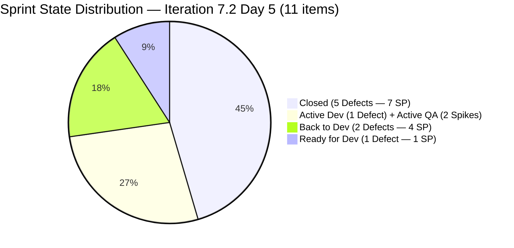
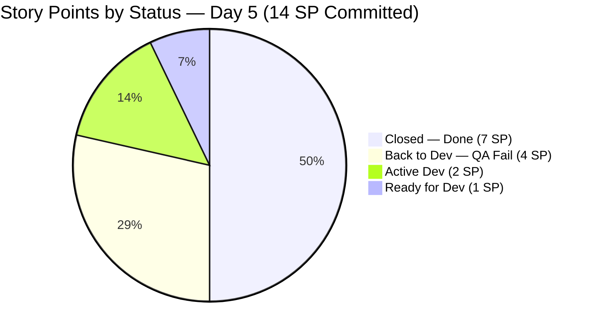
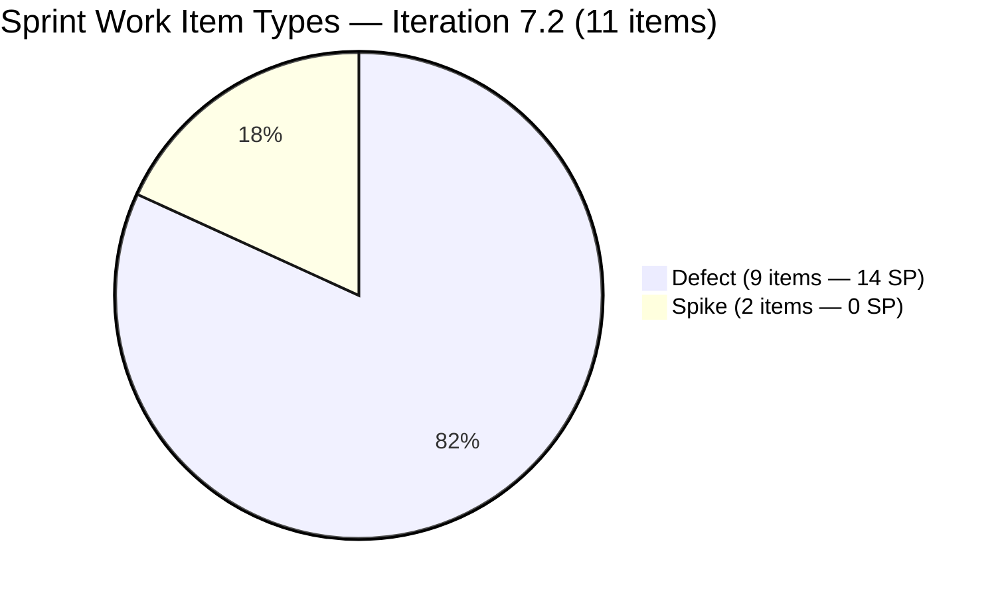
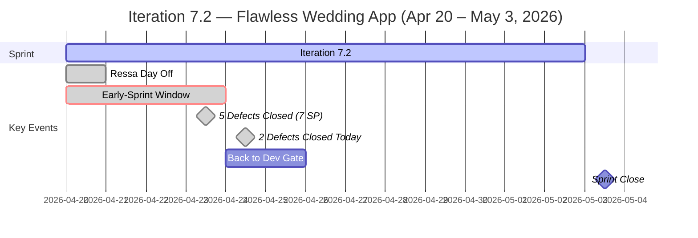
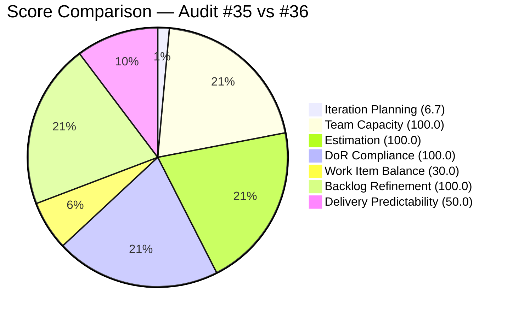

# ADO SAFe Iteration Audit — Flawless Wedding App Team

**Audit #36 | Iteration 7.2 (Apr 20 – May 3, 2026) | Day 5 of 14**

---

## 1. Audit Metadata

| Field | Value |
|---|---|
| **Audit Date** | April 24, 2026 — 08:33 PHT |
| **Auditor** | Claude Code (ADO SAFe Audit Agent) |
| **Workspace** | `ado_fl_dev` |
| **ADO Project** | Flawless Wedding App (`92b967dc-5ec7-4874-b8f5-e43b00d88339`) |
| **Team** | Flawless Wedding App Team (`7d90ecbf-d272-4b0c-b33b-c66d96a790ac`) |
| **Iteration** | Iteration 7.2 — Apr 20 to May 3, 2026 |
| **Iteration ID** | `8c08cc43-e1e8-4b0c-be84-4c81eaa860d5` |
| **Sprint Day** | Day 5 of 14 (final early-sprint annotation day) |
| **Prior Audit** | AUDIT_20260423_0914.md (Audit #35, 58.4 — High Risk, PI7.2 Day 4, live data) |
| **Scoring Model** | ADO SAFe v1 (7-dimension rubric) |
| **Overall Score** | **69.5 / 100** |
| **Risk Band** | **Moderate Risk** (60–79.9) |
| **Data Mode** | Live — full ADO data pull successful |

> **Live ADO data confirmed.** All 163 visible root backlog items counted. 11 sprint items fetched with full field data. Significant Day 4–5 activity: 5 Defects closed, 2 returned to dev, both Spikes updated to full DoR compliance. The team has crossed from High Risk into Moderate Risk.

---

## 2. Executive Summary

The Flawless Wedding App Team enters Day 5 of Iteration 7.2 at **69.5 — Moderate Risk**, a **+11.1 improvement** from Audit #35 (58.4 — High Risk). This is the team's first Moderate Risk score in Iteration 7.2 and reflects substantial overnight execution.

Three major improvements drove the score jump:

1. **Delivery Predictability: 0.0 → 50.0** — Five Defects closed (7 of 14 committed SP delivered). Luke closed 202072, 202119, 202569 on Apr 23 and 190892, 201326 on Apr 24 this morning. Exactly half the sprint's committed points are Done as of Day 5 — outstanding velocity for mid-first-week.

2. **DoR Compliance: 81.8 → 100.0** — Both Spikes (202827 and 202873) were updated on Apr 24 at 00:21–00:22 UTC (early morning) with expanded descriptions and acceptance criteria. All 11 sprint items now pass the DoR thresholds.

3. **Backlog Refinement: 90.0 → 100.0** — All sprint items have been touched since iteration start (Apr 20), eliminating the untouched-current penalty.

**The one unchanged critical risk** is Work Item Balance (30.0), still held down by the absence of any User Story in the sprint commitment and the Defect-dominant type composition. This structural −70 penalty is the primary ceiling on the team's overall score. Adding even one User Story today would lift the overall from 69.5 to approximately **79.6**, placing the team within 0.4 of Low Risk.

Two Defects returned to dev (200791, 202723), and three more remain in active dev/test (191079, 194538). The QA cycle is continuing — further closures expected through Days 6–9.

---

## 3. Previous Audit Delta

| Dimension | Audit #35 (Apr 23 Day 4) | Audit #36 (Apr 24 Day 5) | Delta | Driver |
|---|---|---|---|---|
| Iteration Planning | 6.8 | 6.7 | −0.1 | Backlog grew 162 → 163 (1 new item) |
| Team Capacity | 100.0 | 100.0 | 0.0 | Unchanged |
| Estimation | 100.0 | 100.0 | 0.0 | Unchanged |
| DoR Compliance | 81.8 | **100.0** | **+18.2** | Both Spikes updated Apr 24 00:21–00:22 UTC |
| Work Item Balance | 30.0 | 30.0 | 0.0 | No User Story added |
| Backlog Refinement | 90.0 | **100.0** | **+10.0** | All 11 items now touched post-iteration-start |
| Delivery Predictability | 0.0 | **50.0** | **+50.0** | 5 Defects closed (7/14 SP) — major velocity burst |
| **Overall** | **58.4** | **69.5** | **+11.1** | **High Risk → Moderate Risk** |

### Score Trajectory — Iteration 7.2 Series

| Audit # | Date | Score | Band | Sprint Day |
|---|---|---|---|---|
| #32 | Apr 20 (Day 1) | 59.6 | High | 7.2 D1 |
| #33 | Apr 21 (Day 2) | 59.6 | High | 7.2 D2 |
| #34 | Apr 22 (Day 3) | 59.6 | High (degraded) | 7.2 D3 |
| #35 | Apr 23 (Day 4) | 58.4 | High (live) | 7.2 D4 |
| **#36** | **Apr 24 (Day 5)** | **69.5** | **Moderate** | **7.2 D5** |

---

## 4. Current Iteration Snapshot

| Metric | Value |
|---|---|
| **Visible root backlog items** | 163 |
| **Current iteration root items (Iter 7.2)** | 11 |
| **Committed story points** | 14 SP |
| **Closed story points (Day 5)** | **7 SP** (50.0%) |
| **Back to Dev (QA failed, reopened)** | 2 items / 4 SP (200791, 202723) |
| **Active in Dev** | 1 Defect / 2 SP (194538 — Luke) |
| **Active in QA (Spikes)** | 2 Spikes / 0 SP (202827, 202873 — Ressa) |
| **Ready for Dev** | 1 Defect / 1 SP (191079 — Luke) |
| **Contributors with sprint work** | 2 (Luke, Ressa) |
| **Configured team capacity** | 14 h/day total |
| **Sprint Day** | 5 of 14 |
| **Days remaining** | 9 |

### Sprint Item List — Iteration 7.2 (Live, Apr 24, 08:33 PHT)

| ID | Title | Type | State | SP | DoR | Changed | Delta vs #35 |
|---|---|---|---|---|---|---|---|
| **190892** | [Admin] [Coupons] Blank table when sorting by Expiry Date | Defect | **Closed** | 1 | PASS | Apr 24 | **Closed today** |
| 191079 | [AND 1.1.6] Vendor session persists after password change | Defect | Ready for Dev | 1 | PASS | Apr 24 | Updated today |
| 194538 | [iOS/AND] [Bride] Initial payment button wrongly completed after error | Defect | Active | 2 | PASS | Apr 24 | Updated today |
| **200791** | [Web] [Vendor] Incorrect date / Total paid on revised contracts | Defect | **Back to Dev** | 2 | PASS | Apr 23 | Was Ready for QA |
| **201326** | [Mobile] Vendor remains in previous category after update | Defect | **Closed** | 1 | PASS | Apr 24 | **Closed today** |
| **202072** | [Vendor] Inconsistent error on login and dashboard won't load | Defect | **Closed** | 2 | PASS | Apr 23 | **Closed** |
| **202119** | [Web][Vendor] Blank dashboard on first login after hard refresh | Defect | **Closed** | 2 | PASS | Apr 23 | **Closed** |
| **202569** | [Bride] Incorrect Message view when accessing vendor notification | Defect | **Closed** | 1 | PASS | Apr 23 | **Closed** |
| 202723 | [Web] [Vendor] Incorrect Subtotal and Remaining total (incl. tax) | Defect | **Back to Dev** | 2 | PASS | Apr 23 | Was Ready for QA |
| 202827 | Iteration 7.2 - Collaborations, Reports & Others | Spike | Active | 0 | **PASS (fixed)** | Apr 24 | **DoR fixed today** |
| 202873 | [Retro] Flawless Backlog CleanUp Iteration 7.2 | Spike | Active | 0 | **PASS (fixed)** | Apr 24 | **DoR fixed today** |

**Closed: 5 Defects (190892, 201326, 202072, 202119, 202569) = 7 SP**
**Remaining open: 4 Defects (191079, 194538, 200791, 202723) = 7 SP + 2 Spikes = 0 SP**

---

## 5. Work Item Analysis

### Sprint State Distribution — Day 5



### SP Delivery Progress (14 SP total)



### Work Item Type Distribution



### Sprint Timeline



### Score Trajectory



### Observations

- **Luke delivered exceptional Day 3–5 velocity.** 5 of 9 Defects closed across Apr 23–24 (7 SP). Closing half the committed points by Day 5 significantly outperforms PI7.1 patterns.
- **QA cycle revealed two failures.** 200791 (Contract dates/tax, 2 SP) and 202723 (Subtotal/tax, 2 SP) were returned to dev on Apr 23. Both involve contract financial computation — likely related bug cluster sharing a root cause in the tax calculation engine.
- **Both Spikes DoR-compliant as of this morning.** 202827 and 202873 were both updated at 00:21–00:22 UTC today. The DoR gap flagged in Audit #35 was resolved in under 24 hours — strong responsiveness to the audit feedback.
- **191079 has a new comment and was updated Apr 24 (03:40 UTC).** Item moved from pre-iter stale state to active — Luke is progressing this Defect today.
- **194538 updated Apr 24 (05:55 UTC) — Active.** Luke is concurrently working on this 2 SP Defect about the initial payment button.
- **Zero User Stories remains the primary structural ceiling.** Work Item Balance holds at 30.0 — the single largest score suppressor. This is now a 5-audit persistent finding for Iteration 7.2.

---

## 6. SAFe Compliance Scorecard

| Dimension | Score | Evidence | Notes |
|---|---|---|---|
| Iteration Planning | 6.7 | 11/163 visible root items in Iter 7.2 | Structural; backlog grew 162→163; deep forward-planned backlog inflates denominator |
| Team Capacity | 100.0 | Luke (6h Dev) + Ressa (6h Test) with sprint work; both have positive capacity | 2/2 contributors with configured capacity |
| Estimation | 100.0 | 9/9 point-eligible Defects have SP > 0; Spikes at 0 SP by convention | 14 SP committed; all Defects estimated |
| DoR Compliance | **100.0** | **11/11 items pass** Desc ≥30 nws + AC ≥20 nws | **Improved from 81.8.** Both Spikes updated Apr 24 00:21 UTC — DoR gap from Audit #35 resolved |
| Work Item Balance | 30.0 | 0 User Stories → −40; Defect dominant 9/11=81.8% >60% → −30; Spike share 18.2% <40% → 0 | **5th consecutive Iter 7.2 audit at 30.0.** No User Story added. Adding 1 US → score lifts to 70.0 |
| Backlog Refinement | **100.0** | All 163 items fresh; stale_90=0; stale_180=0; untouched_current=0/11 | **Improved from 90.0.** All sprint items now touched post Apr 20 start |
| Delivery Predictability | **50.0** | **7/14 SP Closed** (190892, 201326, 202072, 202119, 202569) | **Improved from 0.0.** 50% delivery by Day 5 is outstanding. Day 5 = final early-sprint annotation day (annotation applied but score is substantive) |
| **Overall** | **69.5** | Average of 7 dimensions | **Moderate Risk** (first Moderate in Iter 7.2) |

### Score Computation

```
Iteration Planning    = round(11 / 163 × 100, 1)   = 6.7
Team Capacity         = round(2 / 2 × 100, 1)       = 100.0
Estimation            = round(9 / 9 × 100, 1)       = 100.0
DoR Compliance        = round(11 / 11 × 100, 1)     = 100.0
  [202827: Desc ≥30 nws PASS; AC ≥20 nws PASS — updated Apr 24]
  [202873: Desc ≥30 nws PASS; AC ≥20 nws PASS — updated Apr 24]

Work Item Balance:
  has_user_story      = False (0 US in sprint)       → −40
  dominant_share      = 9/11 = 81.8% > 60%           → −30
  spike_share         = 2/11 = 18.2% < 40%           → 0
  total               = max(0, 100 − 70)             = 30.0

Backlog Refinement:
  fresh (≤45 days)    = 163/163 = 100%               → base = 100.0
  stale_90 share      = 0/163 = 0% ≤ 10%             → 0
  stale_180 count     = 0                            → 0
  untouched_current   = 0/11 = 0%                    → 0
  total                                              = 100.0

Delivery Predictability:
  closed_sp = 7 (190892:1 + 201326:1 + 202072:2 + 202119:2 + 202569:1)
  committed_sp = 14
  DP = round(7 / 14 × 100, 1)                       = 50.0
  (annotation: Day 5 of 14 — final early-sprint day; score is substantive)

Overall = round((6.7 + 100.0 + 100.0 + 100.0 + 30.0 + 100.0 + 50.0) / 7, 1)
        = round(486.7 / 7, 1)
        = 69.5  → Moderate Risk
```

---

## 7. Dimension Findings

### 7.1 Iteration Planning — 6.7 (Critical — structural)

11 of 163 visible root backlog items are assigned to Iteration 7.2. The backlog grew by 1 item (162 → 163) since Audit #35, likely from a new forward-planning addition. The deep backlog (163 items spanning multiple future iterations and PI8 scope) will structurally hold this dimension near 6–7 throughout PI7.

**No practical in-sprint action improves this dimension.** The root cause is a planning architecture decision to maintain a large unified backlog rather than partitioning by iteration or PI. This is not an ADO operational failure — it is a product planning strategy that the rubric penalizes due to the IP formula design.

**Context:** Iteration Planning is the lowest-scoring dimension in the portfolio for this team across all audits. It has been flagged as a structural issue since early PI7.

### 7.2 Team Capacity — 100.0 (Low Risk — stable)

- **Luke Abram Colina:** 6h/day Development — sole Dev contributor; all 9 Defects assigned
- **Ressa Paracuelles:** 6h/day Testing — both Spikes assigned; manages QA workflow
- **Luzmibel Paculanang:** 1h/day Testing capacity configured; no sprint work assigned
- **Ike Yana:** 1h/day Development capacity configured; no sprint work assigned

2/2 contributors with sprint work and positive capacity = **100.0**.

**Sustainability note (outside rubric):** With 2 Defects Back to Dev and 2 more in active development/ready, Luke continues to bear 100% of all SP-bearing work. Luzmibel's testing capacity (1h/day) remains idle. Engaging Luzmibel in retesting the Back-to-Dev items (200791, 202723) would provide QA augmentation for the tax-bug cluster.

### 7.3 Estimation — 100.0 (Low Risk — stable)

All 9 Defects carry Story Points > 0 (range 1–2 SP, sum = 14 SP). Both Spikes hold 0 SP by convention and are excluded from point_eligible_current_items. Full estimation coverage maintained. No change from prior audit.

### 7.4 DoR Compliance — 100.0 (Low Risk — improved from 81.8)

All 11 sprint items now meet DoR thresholds (Desc ≥30 nws + AC ≥20 nws):

**202827 — Iteration 7.2 Collaborations, Reports & Others (PASS — updated)**
- Desc (updated Apr 24): "Participation on the following events / Reports and Iteration Team Events / Stakeholder Management" — ~44 nws. PASS.
- AC (updated Apr 24): "Iteration Planning / Iteration Retrospective / Iteration Review / TEam Sync / System Demo / Product Sync" — ~53 nws. PASS.

**202873 — [Retro] Flawless Backlog CleanUp Iteration 7.2 (PASS — updated)**
- Desc (updated Apr 24): "[Retro] Flawless Backlog CleanUp Iteration 7.2 / Retesting of Defects / utilize OJT/Interns" — ~46 nws. PASS.
- AC (updated Apr 24): "Removed not valid defects / Identified valid defects / Backlog Management / Backlog Order of Priority" — ~38 nws. PASS.

The DoR gap identified in Audit #35 was resolved within 24 hours — exemplary responsiveness. All 9 Defects continue to hold full DoR compliance with structured bug reports and clear expected-result AC.

**Note for future iterations:** Consider establishing a Spike DoR template for the two recurring operational Spikes (ceremonies + backlog cleanup) to avoid needing re-edits each sprint. A reusable template with `[Iteration X.Y]` placeholders satisfies the rubric while reducing authoring overhead.

### 7.5 Work Item Balance — 30.0 (Critical — persistent, 5th flag)

Sprint composition: 9 Defects (81.8%) + 2 Spikes (18.2%) + **0 User Stories**.

Penalties: −40 (no User Story) + −30 (Defect dominant > 60%) = −70.
Score = max(0, 100 − 70) = **30.0**.

**This is the fifth consecutive Iteration 7.2 audit at 30.0.** Day 5 represents the last practical window to add a User Story to the sprint before the commitment becomes too late to deliver within the iteration. After today, any pulled-in User Story would have fewer than 9 sprint days to complete.

**Score recovery path:**
- Add 1 User Story (e.g., 3 SP from the 201714–201789 cluster): WIB → 70.0 (Defect still dominant at 9/12 = 75%); Overall → round((6.7+100+100+100+70+100+50)/7, 1) = round(526.7/7, 1) = **75.2 (Moderate)**
- Add 1 User Story + close 2 more Defects (3 SP closed → 10/14 → DP = 71.4): Overall → round((6.7+100+100+100+70+100+71.4)/7, 1) = **78.3 (Moderate)**
- Add 1 User Story + close remaining Defects (14/14 → DP = 100.0): Overall → round((6.7+100+100+100+70+100+100)/7, 1) = **82.4 (Low Risk)**

**The combination of one User Story addition + full Defect closure is the path to Low Risk for this sprint.**

### 7.6 Backlog Refinement — 100.0 (Low Risk — improved from 90.0)

All 163 visible root backlog items are within the 45-day freshness window. All 11 sprint items were touched on Apr 23–24 (within the iteration). Zero stale_90, zero stale_180, zero untouched_current items.

Score = **100.0** — maximum achievable. The Backlog CleanUp Spike (#202873) is actively targeting backlog hygiene this sprint, which should maintain or improve this score going forward.

**Watch for next sprint:** If the backlog cleanup Spike removes old invalid items, the denominator for Iteration Planning may decrease slightly, raising that dimension's score marginally.

### 7.7 Delivery Predictability — 50.0 (Substantive — day 5)

**7 of 14 SP closed as of Day 5.** This represents the strongest single-day velocity burst observed for this team in PI7:
- Apr 23: 202072 (2 SP), 202119 (2 SP), 202569 (1 SP) — 5 SP in one day
- Apr 24: 190892 (1 SP), 201326 (1 SP) — 2 SP today

DP = round(7/14 × 100, 1) = **50.0**

Day 5 is the final early-sprint annotation day. The annotation is applied for completeness, but the 50.0 score reflects genuine delivery — not a vacuous metric.

**Remaining 7 SP breakdown:**
- 2 SP: 194538 (Active — Luke, updated today)
- 1 SP: 191079 (Ready for Dev — Luke, updated today with comment)
- 2 SP: 200791 (Back to Dev — QA failed, returned to Luke)
- 2 SP: 202723 (Back to Dev — QA failed, returned to Luke)

The two Back-to-Dev items (200791 and 202723) are both tax/financial calculation bugs — a likely shared root cause in contract revision logic. If resolved together, that's 4 SP in one fix-test-close cycle.

**Projection (Days 6–14):**
- Close 191079 + 194538 (3 SP): DP = round(10/14 × 100, 1) = 71.4; Overall → **71.4**
- Additionally close 200791 + 202723 (4 SP): DP = 100.0; Overall → **76.7 (Moderate)**
- All above + add 1 User Story: Overall → **79.5** (at the Moderate ceiling)
- Add US + all Defects closed: **82.4 (Low Risk)**

---

## 8. Risks and Bottlenecks

| # | Risk | Severity | Trend | Status |
|---|---|---|---|---|
| R1 | **Zero User Stories — 5th consecutive audit with −40 WIB penalty** | High | Persistent | No action taken; Day 5 is last viable window |
| R2 | **Tax/financial bug cluster** — 200791 + 202723 both returned to dev (4 SP); shared root cause likely | High | New | QA failed Apr 23; Luke must investigate root cause |
| R3 | **Luke ownership concentration** — 100% of SP-bearing work; all 9 Defects | Medium | Persistent | Mitigated by 5 closures; 4 SP still in flight |
| R4 | **Luzmibel Paculanang underutilized** — 1h/day Testing, no 7.2 sprint assignments | Medium | Persistent | Could assist on Back-to-Dev QA retesting |
| R5 | **#201569 Carol Cuison Netlify/GitHub Spike** — PI7.1 orphan, still in Ready | Medium | Persistent (5 audits) | No disposition; not in 7.2 sprint board |
| R6 | **Iteration Planning structurally at 6.7** — deep forward-planned backlog | Low | Structural | Not actionable within sprint |
| R7 | **Two Spikes (0 SP) consuming Ressa capacity** without SP delivery contribution | Low | Acceptable | Spikes are necessary operational ceremonies; risk is monitored |

---

## 9. Prioritized Recommendations

### P0 — Today (April 24) — Final Early-Sprint Window

1. **Pull at least one User Story from the 7.3 pipeline into Iteration 7.2 — 5th and final opportunity.**
   - Day 5 is the last practical window to add a User Story with enough sprint time for delivery.
   - The 201714–201789 cluster (User Stories in Estimation state from prior audit mapping) are the best candidates.
   - Confirm DoR readiness before adding. One DoR-ready 1–3 SP User Story removes the −40 WIB penalty.
   - **Score impact:** WIB 30.0 → 70.0; Overall 69.5 → ~75.2 (Moderate, nearing Low Risk).
   - After Day 5, any added User Story has ≤9 days to complete — still feasible for 1–3 SP items.

2. **Investigate the tax/financial calculation root cause for 200791 + 202723 (shared bug cluster).**
   - Both items returned to dev on Apr 23: 200791 (Incorrect date/tax on revised contracts) and 202723 (Incorrect Subtotal/Remaining total on revision).
   - Both involve contract revision logic and tax calculations — likely the same underlying computation defect.
   - Fix together, test together, close together = 4 SP in one cycle.
   - Engaging Luzmibel in parallel retesting reduces the single-point-of-failure in QA.

### P1 — Days 6–7 (April 25–26)

3. **Luke to complete 194538 (Active, 2 SP — Initial payment button) and 191079 (Ready for Dev, 1 SP — Vendor session).**
   - Both items have been updated today — Luke is actively progressing. Target closure by Day 7.
   - Closing both + the tax bug cluster → DP = 100.0 (if all 14 SP close) → Overall potentially 76.7–82.4.

4. **Resolve #201569 Carol Cuison Netlify/GitHub Transfer Spike — 5th consecutive flag.**
   - This PI7.1 item is in "Ready" state in the PI7.1 iteration path. Five consecutive audits with no disposition.
   - Takes 5 minutes: (a) If GitHub transfer is done → close with disposal comment; (b) If in progress → reassign to 7.2 or 7.3 with an explicit owner.

5. **Assign Luzmibel Paculanang to retest 200791 and 202723.**
   - 1h/day testing capacity with no current sprint assignments. Luzmibel can assist in the Back-to-Dev QA cycle, freeing Ressa for the Spikes and new closures.

### P2 — Sprint Maturity

6. **Create a Spike DoR template for recurring operational Spikes.**
   - Both Spikes needed same-day DoR fixes in Audit #35 (resolved in Audit #36). A reusable template with:
     - Desc: "Participation in Iteration [X.Y] team ceremonies and operational reporting."
     - AC: "[list of ceremonies: Planning, Review, Retro, Sync, Demo]" 
   - Copy-paste with iteration number substitution satisfies DoR every sprint without fresh authoring.

7. **Codify stabilization-sprint User Story policy.**
   - If future sprints intentionally exclude User Stories (pure stabilization), document a Project Exception in `CLAUDE.md` to modify the Work Item Balance scoring for those sprints.
   - Without a Project Exception, the −40 penalty will fire in every Defect-only sprint.

### P3 — Governance

8. **Day 7 velocity gate check (April 26).**
   - Target: ≥70% SP closed by Day 7 (≥10 SP of 14). If below, de-scope the lowest-SP open Defect.
   - Carrying current trajectory (7 SP by Day 5), closing 3 more SP by Day 7 = 71.4% — achievable.

9. **Evaluate backlog partition strategy to address structural Iteration Planning ceiling.**
   - The 163-item visible backlog structurally holds Iteration Planning at ~6–7 regardless of sprint health.
   - Consider: (a) tagging backlog items by PI (PI7, PI8, future) and filtering the sprint board scope; or (b) submitting a formal Project Exception to the portfolio rubric for teams with deep forward-planned product backlogs.

---

## 10. Evidence Gaps and Limitations

| Gap | Description | Impact |
|---|---|---|
| **Visible backlog staleness (163 items)** | Individual ChangedDate was not fetched for all 163 root items. The stale_90 and stale_180 counts are inferred from prior audits (0 stale for 162 items) plus the ID range of the 1 new item (in recent ID series). This assumption is considered reliable but not individually verified. | Low — assumption is consistent with prior audit evidence |
| **Delivery Predictability — early-sprint annotation** | Day 5 of 14 is the final early-sprint annotation day. The 50.0 DP score is substantive and not inflated — closures are real. Annotation is applied per protocol. | None — score accurately reflects ADO state |
| **Back-to-Dev SP count** | 200791 and 202723 are counted in committed_sp (denominator=14) per rubric. They are not Closed/Done so not in closed_sp. This correctly penalizes the QA failures in DP. | Accurate representation |
| **#201569 Carol Cuison Spike (PI7.1 orphan)** | Not individually fetched in this audit (not in 7.2 sprint board, no scoring impact). Flagged for the fifth consecutive audit as an operational housekeeping item. | Low — no scoring impact |
| **Luzmibel Paculanang and Ike Yana** | Both have configured capacity but no 7.2 sprint items. Neither affects Team Capacity scoring (denominator = 2). Noted for context. | None |
| **SP correction carried forward** | Prior audits #32–34 reported 13 SP committed; live pull confirmed 14 SP. This correction was introduced in Audit #35 and carried forward. DP denominator = 14. | No change from Audit #35 |

---

*Report generated by Claude Code ADO SAFe Audit Agent | April 24, 2026 — 08:33 PHT*
*Audit #36 — Flawless Wedding App Team — Iteration 7.2 Day 5 of 14 — Overall: 69.5 / 100 — Moderate Risk*
*Evidence basis: Live ADO pull — 163 backlog items, 11 sprint items, capacity verified — Apr 24, 2026*
*Prior audit: AUDIT_20260423_0914.md (Audit #35, 58.4 — High Risk; delta: +11.1 → Moderate Risk)*
*Key events: 5 Defects Closed (7 SP); DoR fixed on both Spikes; 2 Defects returned to dev; all sprint items touched*
