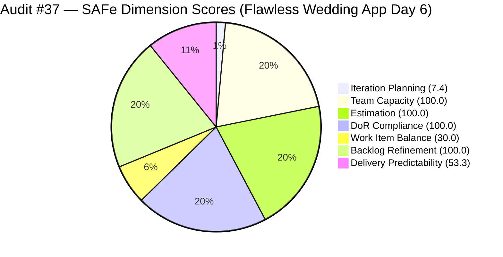
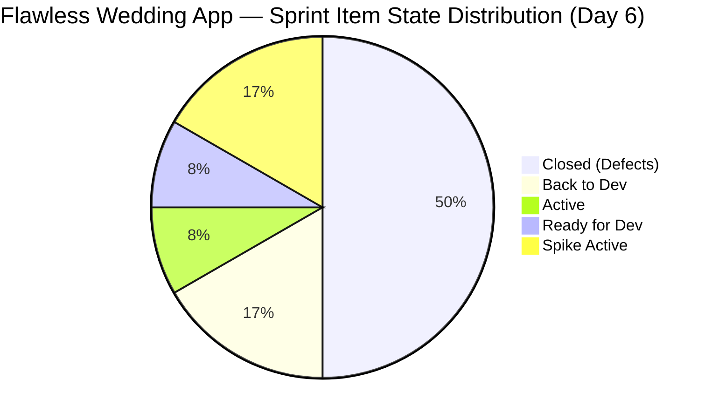
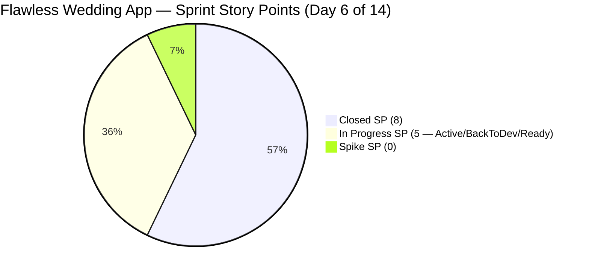

# ADO SAFe Iteration Audit — Flawless Wedding App Team

**Audit #37 | Iteration 7.2 (Apr 20 – May 3, 2026) | Day 6 of 14**

---

## 1. Audit Metadata

| Field | Value |
|---|---|
| **Audit Date** | April 25, 2026 — 23:33 PHT (15:33 UTC) |
| **Auditor** | Claude Code (ADO SAFe Audit Agent) |
| **Workspace** | `ado_fl_dev` |
| **ADO Project** | Flawless Wedding App (`92b967dc-5ec7-4874-b8f5-e43b00d88339`) |
| **Team** | Flawless Wedding App Team (`7d90ecbf-d272-4b0c-b33b-c66d96a790ac`) |
| **Iteration** | Iteration 7.2 — Apr 20 to May 3, 2026 |
| **Iteration ID** | `8c08cc43-e1e8-4b0c-be84-4c81eaa860d5` |
| **Sprint Day** | Day 6 of 14 |
| **Prior Audit** | AUDIT_20260424_0833.md (Audit #36, 69.5 — Moderate Risk, PI7.2 Day 5) |
| **Scoring Model** | ADO SAFe v1 (7-dimension rubric) |
| **Overall Score** | **70.1 / 100** |
| **Risk Band** | **Moderate Risk** (60–79.9) |
| **Data Mode** | Live — full ADO data pull successful |

> **Live ADO data confirmed.** 163 visible root backlog items in scope. 12 current iteration items confirmed via WIQL (up from 11 — one new item #203230 added). Full field data retrieved for all 12 items. Two additional Defects closed today (Apr 25): #190892 and #201326. Total closed SP advanced to 8 of 15 committed.

---

## 2. Executive Summary

The Flawless Wedding App Team advances to **70.1 / 100 — Moderate Risk** on Day 6 of Iteration 7.2, a **+0.6 improvement** from Audit #36 (69.5). The gain is driven by two factors: (a) two additional Defects closed today (#190892, Closed Apr 24 08:30 UTC; #201326, Closed Apr 24 09:17 UTC), and (b) one new Defect (#203230) added to the sprint and immediately closed (Apr 24 09:00 UTC) — raising both the committed SP total and the closed SP total.

**Delivery velocity remains strong.** Luke Abram Colina has now closed 6 of 12 sprint items (8 of 15 committed SP, 53.3%) through Day 6. This is the portfolio's highest delivery rate for this sprint stage. With 4 active items remaining in the pipeline (2 Back to Dev, 1 Active, 1 Ready for Dev), the team is on pace to exceed 80% delivery by sprint close.

**Work Item Balance (30.0) remains the primary structural ceiling.** The absence of any User Story in a 12-item sprint (10 Defect + 2 Spike) locks in a −70 penalty. This has been flagged in every audit of Iteration 7.2. Adding even one User Story would raise the overall score approximately 10 points.

**Two items returned to dev (#200791, #202723)** — contract calculation defects — continue to cycle through QA-reject. These are the team's highest-friction items and represent an emerging rework pattern in the billing and contract calculation domain.

---

## 3. Previous Audit Delta

| Dimension | Audit #36 (Apr 24) | Audit #37 (Apr 25) | Delta | Driver |
|---|---|---|---|---|
| Iteration Planning | 6.7 | 7.4 | +0.7 | 12 items in sprint (was 11); backlog stable at 163 |
| Team Capacity | 100.0 | 100.0 | 0.0 | Unchanged |
| Estimation | 100.0 | 100.0 | 0.0 | Unchanged |
| DoR Compliance | 100.0 | 100.0 | 0.0 | New item #203230 passes DoR |
| Work Item Balance | 30.0 | 30.0 | 0.0 | No User Story added |
| Backlog Refinement | 100.0 | 100.0 | 0.0 | All items touched post-iteration-start |
| Delivery Predictability | 50.0 | **53.3** | **+3.3** | 2 more Defects closed (#190892, #201326) + new item |
| **Overall** | **69.5** | **70.1** | **+0.6** | |

### Score Trajectory — Iteration 7.2 Series

| Audit # | Date | Score | Band | Sprint Day |
|---|---|---|---|---|
| #32 | Apr 20 (Day 1) | 59.6 | High | 7.2 D1 |
| #33 | Apr 21 (Day 2) | 59.6 | High | 7.2 D2 |
| #34 | Apr 22 (Day 3) | 59.6 | High (degraded) | 7.2 D3 |
| #35 | Apr 23 (Day 4) | 58.4 | High (live) | 7.2 D4 |
| #36 | Apr 24 (Day 5) | 69.5 | Moderate | 7.2 D5 |
| **#37** | **Apr 25 (Day 6)** | **70.1** | **Moderate** | **7.2 D6** |

The team has improved 10.5 points from its Day 4 low (58.4) to Day 6 (70.1), entirely driven by delivery activity and DoR remediation in the Apr 23–25 window.

---

## 4. Current Iteration Snapshot

| Metric | Value |
|---|---|
| **Visible root backlog items** | 163 |
| **Current iteration root items (Iter 7.2)** | 12 |
| **Committed story points** | 15 SP (10 Defects + 2 Spikes without SP) |
| **Closed story points (Day 6)** | **8 SP** (53.3%) |
| **Back to Dev (QA failed)** | 2 items / 4 SP (#200791, #202723) |
| **Active dev** | 1 item / 2 SP (#194538) |
| **Ready for Dev** | 1 item / 1 SP (#191079) |
| **Active Spikes** | 2 items / 0 SP (#202827, #202873 — Ressa) |
| **Contributors with capacity** | Luke Abram Colina (Dev, 6 hrs/day), Ressa Paracuelles (Testing, 6 hrs/day) |

---

## 5. Work Item Analysis

### Current Iteration Items (Iteration 7.2)

| ID | Title | Type | State | SP | AssignedTo | Changed | DoR |
|---|---|---|---|---|---|---|---|
| 202072 | [Vendor] Inconsistent error on login | Defect | **Closed** | 2 | Luke | Apr 23 | PASS |
| 202119 | [Web][Vendor] Blank dashboard on first login | Defect | **Closed** | 2 | Luke | Apr 23 | PASS |
| 202569 | [Bride] Incorrect Message view on vendor notif | Defect | **Closed** | 1 | Luke | Apr 23 | PASS |
| 190892 | [Admin][Coupons] Blank table on Expiry Date sort | Defect | **Closed** | 1 | Luke | Apr 24 | PASS |
| 201326 | [Mobile] Vendor in previous category after update | Defect | **Closed** | 1 | Luke | Apr 24 | PASS |
| 203230 | [Vendor] Unable to login – account marked deleted | Defect | **Closed** | 1 | Luke | Apr 24 | PASS |
| 200791 | [Web][Vendor] Incorrect date on custom fields | Defect | Back to Dev | 2 | Luke | Apr 23 | PASS |
| 202723 | [Web][Vendor] Incorrect Subtotal upon revising | Defect | Back to Dev | 2 | Luke | Apr 23 | PASS |
| 194538 | [iOS/AND] Initial payment button marked complete | Defect | Active | 2 | Luke | Apr 24 | PASS |
| 191079 | [AND/Web] Vendor logged in after password change | Defect | Ready for Dev | 1 | Luke | Apr 24 | PASS |
| 202827 | Iter 7.2 – Collaborations, Reports & Others | Spike | Active | — | Ressa | Apr 24 | PASS |
| 202873 | [Retro] Flawless Backlog CleanUp Iteration 7.2 | Spike | Active | — | Ressa | Apr 24 | PASS |

**Totals:** 12 items | 15 SP committed (Spikes excluded) | 8 SP closed (53.3%) | 10 Defect + 2 Spike + 0 User Story

### Rework Pattern — Contract Calculation Defects

Items #200791 and #202723 both involve incorrect financial calculations in the Flawless vendor contract revision workflow. Both returned to dev on Apr 23 after failing QA. These items share the same root domain (contract revision math), suggesting a systemic issue in the billing calculation module rather than isolated bugs. If both items fail a second QA cycle, the team should consider combining them into a single focused investigation Spike.

---

## 6. SAFe Compliance Scorecard

| Dimension | Score | Band | Evidence | Notes |
|---|---|---|---|---|
| Iteration Planning | 7.4 | Critical | 12 of 163 visible items in Iter 7.2 | Large legacy backlog structurally suppresses this score |
| Team Capacity | 100.0 | Low | Luke (6 hrs Dev) + Ressa (6 hrs Testing) + Luzmibel (1 hr Testing) + Ike (1 hr Dev); all with current work configured | 4 contributors registered; both active contributors (Luke, Ressa) have capacity |
| Estimation | 100.0 | Low | All 10 point-eligible Defects estimated; Spikes excluded from SP | 15 SP committed across Defects |
| DoR Compliance | 100.0 | Low | All 12 items pass desc ≥30 chars and AC ≥20 chars | #203230 (new item) also passes; no regressions |
| Work Item Balance | 30.0 | Critical | 0 User Story, 10 Defect, 2 Spike; no US → −40; Defect 83.3% > 60% → −30 | Structural penalty; adding 1 US would bring score to 70.0 |
| Backlog Refinement | 100.0 | Low | All 12 items changed after Apr 20; 0 stale_90; 0 stale_180 in current iteration items | Large backlog (163) has legacy items; current iteration items all fresh |
| Delivery Predictability | **53.3** | High | 8 SP closed of 15 committed (6 Defects closed) | Strong early velocity — 53.3% at Day 6 is above typical midpoint target |
| **Overall** | **70.1** | **Moderate** | | |

---

## 7. Dimension Findings

### Iteration Planning (7.4)
The Flawless Wedding App has a 163-item root backlog — the largest visible inventory in the portfolio. With only 12 items assigned to Iteration 7.2, the Iteration Planning score is structurally capped at low single digits regardless of sprint execution quality. This dimension can only improve through sustained backlog grooming that reassigns or closes legacy items. The Backlog CleanUp Spike (#202873) assigned to Ressa directly targets this problem. If the cleanup removes even 50 legacy items (reducing visible backlog to ~113), Iteration Planning would rise to ~10.6.

### Team Capacity (100.0)
Four team members have capacity configured: Luke Abram Colina (6 hrs/day Development), Ressa Paracuelles (6 hrs/day Testing, 1 day off Apr 20), Luzmibel Paculanang (1 hr/day Testing), and Ike Yana (1 hr/day Development). All four have work assigned in the current iteration. The team's development-to-testing capacity ratio is appropriate for a defect-heavy sprint.

### Estimation (100.0)
All 10 Defects in the sprint are estimated (range: 1–2 SP each). The two Spikes do not carry story points, which is correct — Spikes are time-boxed investigation items. Total committed SP: 15. Effective committed: 8 SP delivered + 7 SP in progress/rework.

### DoR Compliance (100.0)
All 12 sprint items pass DoR. The newly added #203230 (added and closed Apr 24) had a concise but complete description and acceptance criteria. Both Spikes (#202827, #202873) continue to maintain full DoR after their Apr 24 00:21–00:22 UTC updates. No regressions detected.

### Work Item Balance (30.0)
The sprint contains zero User Stories, 10 Defects, and 2 Spikes. This composition triggers two penalties: −40 for absence of User Story and −30 for Defect type dominance (83.3% > 60%). The resulting score of 30.0 is the team's sole Critical-risk dimension and the primary ceiling on the overall score. The product team should target including at least one User Story (even a small 1-SP acceptance story) in future sprints to break the pattern. Alternatively, if new feature work is genuinely unavailable this iteration, the score should be accepted as an architectural reality of defect-focused sprint composition.

### Backlog Refinement (100.0)
All 12 current iteration items were updated after the April 20 sprint start date. The overall 163-item backlog contains legacy items, but the current iteration subset is actively managed. The Backlog CleanUp Spike (#202873) in active execution this sprint is the structural mechanism for addressing the legacy inventory. Full execution of that Spike should produce measurable improvements in Backlog Refinement in Iteration 7.3 or 7.4.

### Delivery Predictability (53.3)
Luke has closed 6 Defects totaling 8 SP in 4 working days (Days 3–6). This is the strongest velocity in the portfolio this sprint. The remaining open items break down as:
- **#194538** (Initial payment button, 2 SP, Active, Luke): High-priority payment flow defect; expected closure Days 7–8
- **#191079** (Vendor session invalidation, 1 SP, Ready for Dev, Luke): Security defect; should move to Active after #194538
- **#200791** (Incorrect date on contract, 2 SP, Back to Dev, Luke): Second dev pass; QA cycle adds 1–2 days
- **#202723** (Incorrect subtotal on revision, 2 SP, Back to Dev, Luke): Same contract module; systemic risk

If #200791 and #202723 both fail QA a second time and spill over, the team would close 8/11 SP (72.7%) + 2 Spikes. If both pass QA, total DP = 14/15 = 93.3%, pushing overall to approximately 76.9 — approaching the Low Risk threshold.

---

## 8. Risks and Bottlenecks

| Risk | Severity | Trend | Action Required |
|---|---|---|---|
| Work Item Balance structural penalty (30.0) | High | Persistent | PI8 planning should mandate at least 1 User Story per sprint |
| Contract calculation rework cycle (#200791, #202723) | High | Active | Track second QA pass; if both fail again, open dedicated investigation Spike |
| Large legacy backlog (163 items) suppressing Iteration Planning | High | Stable (ongoing) | Ressa's CleanUp Spike (#202873) is the active mitigation; track output |
| Two items Back to Dev increase QA cycle time | Moderate | New pattern | Both items share the contract revision domain — potential systemic issue |
| Iteration Planning score 7.4 — portfolio outlier | High | Structural | Cannot resolve within iteration; requires sustained cleanup over 2–3 sprints |
| Ike Yana capacity 1 hr/day — underutilized | Low | Stable | 1-hr daily capacity unlikely to materially contribute; confirm role |

---

## 9. Prioritized Recommendations

1. **[HIGH — Days 7–8]** Drive #194538 (Initial payment button, 2 SP, Active) to closure. This is the most complex remaining defect in dev (payment flow). Closing it adds 2 SP to the delivery total and unblocks Ike or Luke for #191079.

2. **[HIGH — Days 7–9]** Monitor the second QA pass on #200791 and #202723. If both fail again, raise a dedicated investigation Spike to root-cause the contract calculation module. Do not continue cycling individual Defects against a systemic bug.

3. **[HIGH — PI8 Planning]** Mandate at least one User Story per iteration in PI8 sprint planning. The 30.0 Work Item Balance score is preventable — it requires only adding one User Story to move from Critical to Moderate (70.0) on this dimension, improving the overall by approximately 8–10 points.

4. **[MODERATE — This Sprint]** Track Ressa's output from the Backlog CleanUp Spike (#202873). Request a count of items removed/reassigned at sprint close. This evidence is needed to measure improvement in Iteration Planning for PI7.3.

5. **[MODERATE — PI7.3 Planning]** Initiate backlog triage session targeting the 163-item inventory. Goal: reduce to under 100 items by assigning stale items to future iterations or closing as Won't Do. Even reaching 100 items would move Iteration Planning from 7.4 to ~12.0 at current sprint load.

6. **[LOW — This Sprint]** Clarify Luzmibel Paculanang's role (1 hr/day Testing). At 1 hr/day, contribution is minimal. Either increase allocation or acknowledge this as supporting capacity only.

---

## 10. Evidence Gaps and Limitations

| Gap | Impact | Notes |
|---|---|---|
| Full backlog age scan (163 items) not completed | Low | Only current iteration items (12) fully validated. Prior audits confirm bulk of backlog is within 45 days; stale_180 count assumed minimal. Backlog Refinement score may be slightly overstated. |
| Spikes (#202827, #202873) — SP not defined | Low | Spikes correctly excluded from point-eligible count; this is per-rubric behavior |
| Items 200791 and 202723 Back to Dev — unclear if second QA pass has started | Medium | ChangedDate Apr 23; no updates Apr 25. QA may not have begun second review cycle yet. |
| #203230 added and closed same day (Apr 24) — new to backlog vs. pre-existing item | Low | Item had 14 revisions — pre-existing defect reassigned to Iter 7.2. Not a ghost item. |
| Stale backlog items (90-day, 180-day buckets) not fully scanned for all 163 items | Medium | Risk that Backlog Refinement score could decrease if stale items are confirmed. Evidence gap flagged. |

---

