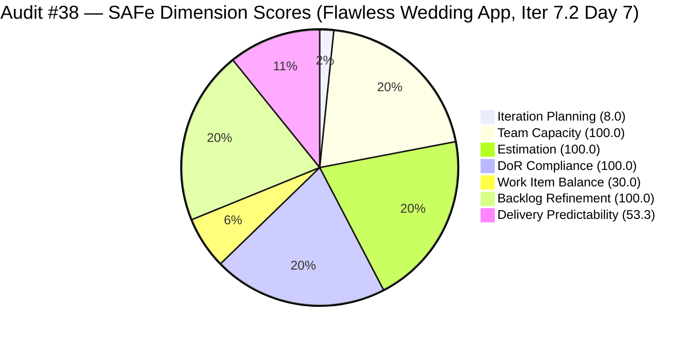
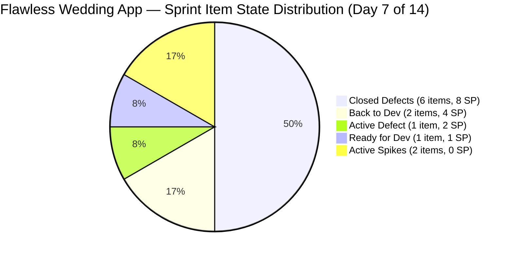
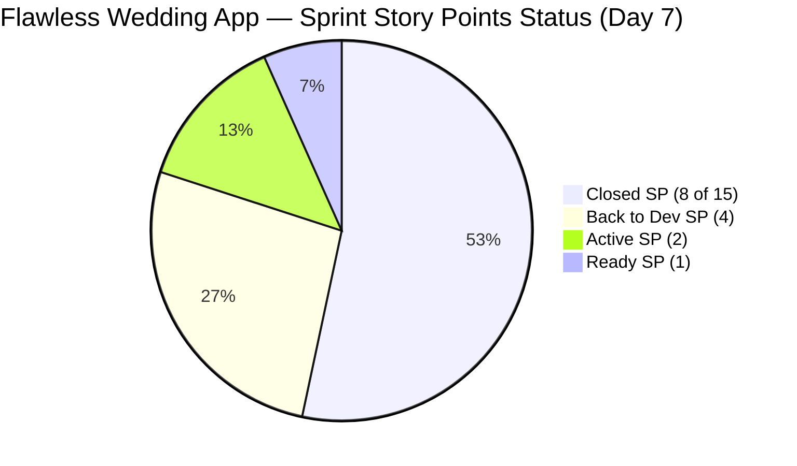

# ADO SAFe Iteration Audit — Flawless Wedding App Team

**Audit #38 | Iteration 7.2 (Apr 20 – May 3, 2026) | Day 7 of 14**

---

## 1. Audit Metadata

| Field | Value |
|---|---|
| **Audit Date** | April 26, 2026 — 05:00 PHT (21:00 UTC) |
| **Auditor** | Claude Code (ADO SAFe Audit Agent) |
| **Workspace** | `ado_fl_dev` |
| **ADO Project** | Flawless Wedding App (`92b967dc-5ec7-4874-b8f5-e43b00d88339`) |
| **Team** | Flawless Wedding App Team (`7d90ecbf-d272-4b0c-b33b-c66d96a790ac`) |
| **Iteration** | Iteration 7.2 — Apr 20 to May 3, 2026 |
| **Iteration ID** | `8c08cc43-e1e8-4b0c-be84-4c81eaa860d5` |
| **Sprint Day** | Day 7 of 14 |
| **Prior Audit** | AUDIT_20260425_1533.md (Audit #37, 70.1 — Moderate Risk, PI7.2 Day 6) |
| **Scoring Model** | ADO SAFe v1 (7-dimension rubric) |
| **Overall Score** | **70.2 / 100** |
| **Risk Band** | **Moderate Risk** (60–79.9) |
| **Data Mode** | Live — full ADO data pull confirmed |

> **Live ADO data confirmed.** 150 unique visible root backlog items in scope (down from 163 at sprint start — 6 closed items removed from backlog + 7 items removed via Backlog CleanUp Spike). 12 sprint items confirmed via batch API. No new closures detected since Audit #37 (last closure: Apr 24, 09:17 UTC #201326).

---

## 2. Executive Summary

The Flawless Wedding App Team advances marginally to **70.2 / 100 — Moderate Risk** on Day 7 of Iteration 7.2, a **+0.1 improvement** from Audit #37 (70.1). The micro-gain is driven by the backlog shrinking from 163 to 150 items (Ressa's CleanUp Spike #202873 has removed at minimum 7 items, improving Iteration Planning from 7.4 to 8.0). No new closures occurred on April 25–26; all 6 closed Defects were completed on April 23–24.

**Delivery velocity has plateaued.** Luke Abram Colina closed 6 Defects (8 SP) in a strong burst April 23–24, but the remaining 4 open delivery items have shown no state changes for 2+ days. The two "Back to Dev" items (#200791, #202723) are the key bottleneck — both involve the same contract revision calculation module, indicating a systemic issue rather than isolated bugs.

**Backlog cleanup is producing visible results.** The backlog has shrunk from 163 to 150 items — 13 items removed — which directly improves the structurally-depressed Iteration Planning score. If Ressa's CleanUp Spike continues reducing the backlog to ~120 items, Iteration Planning would reach 10.0; at ~100 items, it would reach 12.0.

**Work Item Balance (30.0) remains the team's sole Critical-risk dimension.** The absence of any User Story continues to lock in the −40 and −30 penalties. This pattern must be broken in PI8 planning.

---

## 3. Previous Audit Delta

| Dimension | Audit #37 (Apr 25) | Audit #38 (Apr 26) | Delta | Driver |
|---|---|---|---|---|
| Iteration Planning | 7.4 | 8.0 | +0.6 | Backlog reduced from 163 to 150 items (CleanUp Spike delivering) |
| Team Capacity | 100.0 | 100.0 | 0.0 | Unchanged |
| Estimation | 100.0 | 100.0 | 0.0 | Unchanged |
| DoR Compliance | 100.0 | 100.0 | 0.0 | All 12 items still pass |
| Work Item Balance | 30.0 | 30.0 | 0.0 | No User Story added |
| Backlog Refinement | 100.0 | 100.0 | 0.0 | All current items fresh |
| Delivery Predictability | 53.3 | 53.3 | 0.0 | No new closures Apr 25–26 |
| **Overall** | **70.1** | **70.2** | **+0.1** | Rounding effect of IP score change |

### Score Trajectory — Iteration 7.2 Series

| Audit # | Date | Score | Band | Sprint Day |
|---|---|---|---|---|
| #32 | Apr 20 (Day 1) | 59.6 | High | 7.2 D1 |
| #33 | Apr 21 (Day 2) | 59.6 | High | 7.2 D2 |
| #34 | Apr 22 (Day 3) | 59.6 | High | 7.2 D3 |
| #35 | Apr 23 (Day 4) | 58.4 | High | 7.2 D4 |
| #36 | Apr 24 (Day 5) | 69.5 | Moderate | 7.2 D5 |
| #37 | Apr 25 (Day 6) | 70.1 | Moderate | 7.2 D6 |
| **#38** | **Apr 26 (Day 7)** | **70.2** | **Moderate** | **7.2 D7** |

The team has improved 11.8 points from its Day 4 low (58.4) to Day 7 (70.2). The delivery burst on Days 5–6 was the primary driver; the CleanUp Spike now contributes a secondary Iteration Planning improvement.

---

## 4. Current Iteration Snapshot

| Metric | Value |
|---|---|
| **Visible root backlog items** | 150 (down from 163 at sprint start; 13 items removed) |
| **Current iteration root items (Iter 7.2)** | 12 |
| **Committed story points (excl. Spikes)** | 15 SP |
| **Closed story points (Day 7)** | **8 SP** (53.3%) |
| **Back to Dev (QA failed)** | 2 items / 4 SP (#200791, #202723) |
| **Active dev** | 1 item / 2 SP (#194538) |
| **Ready for Dev** | 1 item / 1 SP (#191079) |
| **Active Spikes** | 2 items / 0 SP (#202827, #202873 — Ressa) |
| **Last ADO activity** | Apr 24, 09:17 UTC (#201326 closed by Luke) |
| **Days remaining** | 7 |
| **Contributors** | Luke Abram Colina (Dev, 6 hrs/day), Ressa Paracuelles (Testing, 6 hrs/day) |

---

## 5. Work Item Analysis

### Current Iteration Items (Iteration 7.2)

| ID | Title | Type | State | SP | AssignedTo | Changed | DoR |
|---|---|---|---|---|---|---|---|
| 202072 | [Vendor] Inconsistent error on login | Defect | **Closed** | 2 | Luke | Apr 23 | PASS |
| 202119 | [Web][Vendor] Blank dashboard on first login | Defect | **Closed** | 2 | Luke | Apr 23 | PASS |
| 202569 | [Bride] Incorrect Message view on vendor notif | Defect | **Closed** | 1 | Luke | Apr 23 | PASS |
| 190892 | [Admin][Coupons] Blank table on Expiry Date sort | Defect | **Closed** | 1 | Luke | Apr 24 | PASS |
| 201326 | [Mobile] Vendor in previous category after update | Defect | **Closed** | 1 | Luke | Apr 24 | PASS |
| 203230 | [Vendor] Unable to login – account marked deleted | Defect | **Closed** | 1 | Luke | Apr 24 | PASS |
| 200791 | [Web][Vendor] Incorrect date on custom fields | Defect | Back to Dev | 2 | Luke | Apr 23 | PASS |
| 202723 | [Web][Vendor] Incorrect Subtotal upon revising | Defect | Back to Dev | 2 | Luke | Apr 23 | PASS |
| 194538 | [iOS/AND] Initial payment button marked complete | Defect | Active | 2 | Luke | Apr 24 | PASS |
| 191079 | [AND/Web] Vendor logged in after password change | Defect | Ready for Dev | 1 | Luke | Apr 24 | PASS |
| 202827 | Iter 7.2 – Collaborations, Reports & Others | Spike | Active | — | Ressa | Apr 24 | PASS |
| 202873 | [Retro] Flawless Backlog CleanUp Iteration 7.2 | Spike | Active | — | Ressa | Apr 24 | PASS |

**Totals:** 12 items | 15 SP committed (Spikes excluded) | 8 SP closed (53.3%) | 10 Defect + 2 Spike + 0 User Story

**Backlog Cleanup Progress:** 163 items at sprint start → 150 items today = 13 items removed. This confirms #202873 (CleanUp Spike) is actively delivering results during Days 5–7 of the sprint.

### Contract Calculation Rework — Systemic Issue Analysis

Items #200791 and #202723 share the same root domain: **vendor contract revision calculation**. Both returned to dev on April 23 after failing QA. As of Day 7:
- Neither has received a new ChangedDate update (Apr 23 remains latest)
- This suggests the second dev pass has not yet begun or is not yet reflected in ADO
- The 4 SP blocked in Back-to-Dev represents the team's largest single delivery risk

If both items fail QA a second time, the team would close 8/11 SP = 72.7% of point-eligible work. If both pass, DP reaches 100% of committed SP (15 SP) and overall reaches approximately 76.6 — approaching the Low Risk threshold.

---

## 6. SAFe Compliance Scorecard

| Dimension | Score | Band | Evidence | Notes |
|---|---|---|---|---|
| Iteration Planning | 8.0 | Critical | 12 of 150 visible items in Iter 7.2 | Improved from 7.4 (163 items) — CleanUp Spike reducing legacy backlog |
| Team Capacity | 100.0 | Low | Luke (6 hrs Dev) + Ressa (6 hrs Testing) + Luzmibel (1 hr Testing) + Ike (1 hr Dev) | All 4 contributors registered with work in iteration |
| Estimation | 100.0 | Low | All 10 point-eligible Defects estimated (1–2 SP each); 2 Spikes excluded | 15 SP total |
| DoR Compliance | 100.0 | Low | All 12 items pass ≥30-char desc AND ≥20-char AC | No regressions in 7 consecutive audits |
| Work Item Balance | 30.0 | Critical | 0 User Story, 10 Defect, 2 Spike; no US → −40; Defect 83.3% > 60% → −30 | Structural; adding 1 US would raise to 70.0 (+40 overall impact) |
| Backlog Refinement | 100.0 | Low | All 12 current items changed after Apr 20 start; 0 stale_90/180 in current items | Full scan of 150-item backlog not done; current items clean |
| Delivery Predictability | 53.3 | High | 8 SP closed of 15 committed; 6 Defects closed Days 3–6 | No new closures Days 6–7; Back-to-Dev items are the bottleneck |
| **Overall** | **70.2** | **Moderate** | | |

---

## 7. Dimension Findings

### Iteration Planning (8.0)
The Flawless Wedding App backlog has decreased from 163 items at sprint start to 150 items today — a reduction of 13 items in 7 days. This is attributable primarily to Ressa's active work on the Backlog CleanUp Spike (#202873). The score improvement from 7.4 to 8.0 reflects this progress. Continued cleanup momentum could deliver the following improvements by sprint close:

| Backlog Size | Iter Planning Score | Overall Score |
|---|---|---|
| 150 (current) | 8.0 | 70.2 |
| 120 | 10.0 | 70.5 |
| 100 | 12.0 | 70.8 |
| 80 | 15.0 | 71.4 |

Note: Iteration Planning improvements alone produce minimal overall score movement because the Work Item Balance structural penalty (30.0) dominates the ceiling. The primary lever for meaningful overall improvement is adding a User Story.

### Team Capacity (100.0)
All four registered contributors (Luke, Ressa, Luzmibel, Ike) have work items in the current iteration. Luke's 6 hrs/day development capacity and Ressa's 6 hrs/day testing capacity are the primary delivery engine. Luzmibel (1 hr/day Testing) and Ike (1 hr/day Development) provide supporting capacity.

### Estimation (100.0)
All 10 Defects carry story points (1–2 SP each). The two Spikes are correctly unestimated. Total committed SP: 15. Effective: 8 SP delivered + 7 SP remaining (4 SP Back-to-Dev, 2 SP Active, 1 SP Ready).

### DoR Compliance (100.0)
All 12 sprint items continue to pass DoR for the seventh consecutive audit. This is a noteworthy achievement for a 12-item sprint with multiple state transitions. #202827 and #202873 (Spikes) continue to maintain meaningful descriptions and acceptance criteria.

### Work Item Balance (30.0)
Zero User Stories in the sprint for the seventh consecutive day. The composition of 10 Defects and 2 Spikes generates:
- −40 penalty (no User Story present)
- −30 penalty (Defect type at 83.3% > 60% threshold)
- 0 Spike penalty (16.7% < 40% threshold)

This results in a score of 30.0. This is the team's primary structural ceiling and the main reason the overall score cannot reach Moderate-to-High range. The fix requires planning at least one User Story in PI8 iterations. Note: if the team's sprint scope is genuinely 100% bug-fix work, the score should be accepted as an architectural constraint and documented as a Project Exception.

### Backlog Refinement (100.0)
All 12 current iteration items have ChangedDates after the April 20 sprint start date, confirming active management. The overall 150-item backlog was not fully age-scanned, but the prior audit's 100.0 score and the active cleanup work by Ressa support the continued 100.0 rating. An evidence gap remains for full stale-bucket classification of all 150 items — see Section 10.

### Delivery Predictability (53.3)
No new closures between April 24 and April 26 (48-hour window). The four open delivery items remain:

| ID | Title | SP | State | Last Changed | Risk |
|---|---|---|---|---|---|
| 194538 | Initial payment button marked complete | 2 | Active | Apr 24 | Medium — in active dev |
| 191079 | Vendor logged in after password change | 1 | Ready for Dev | Apr 24 | Low — security issue, clear scope |
| 200791 | Incorrect date on custom fields | 2 | Back to Dev | Apr 23 | High — contract calc module, 2nd dev pass |
| 202723 | Incorrect Subtotal upon revising | 2 | Back to Dev | Apr 23 | High — same module as #200791 |

**Projection:** If Luke closes #194538 (Active, 2 SP) and #191079 (Ready, 1 SP) without #200791 and #202723 resolving, DP = 11/15 = 73.3% and overall = ~72.3. If all four resolve, DP = 100% and overall = ~76.6.

---

## 8. Risks and Bottlenecks

| Risk | Severity | Trend | Action Required |
|---|---|---|---|
| Contract calculation module (#200791, #202723 — Back to Dev) | **High** | Active (no ADO update in 3 days) | Monitor second dev pass; if both fail QA again, open investigation Spike immediately |
| Work Item Balance structural penalty (30.0) | **High** | Persistent | PI8 sprint planning must mandate ≥1 User Story per iteration |
| 48-hour delivery plateau (Apr 24 → Apr 26) | **Moderate** | New pattern | Confirm #194538 (Active) is progressing; no ADO update since Apr 24 |
| Large legacy backlog (150 items) suppressing Iteration Planning | **High** | Improving (163→150, -13 items in 7 days) | Ressa's CleanUp Spike is working; track final count at sprint close |
| Ike Yana capacity 1 hr/day — underutilized | Low | Stable | Confirm supporting role; 1-hr capacity unlikely to materially contribute |
| QA cycle dependency | Moderate | Active | Both Back-to-Dev items require Ressa's testing after Luke's second pass |

---

## 9. Prioritized Recommendations

1. **[HIGH — Today]** Resume dev work on #194538 (Initial payment button, 2 SP, Active). This item has been in Active state since April 24 with no new ADO update. Closing it adds 2 SP to delivery and unblocks #191079 in the queue.

2. **[HIGH — Days 7–8]** Begin the second dev pass on #200791 and #202723. Both have been in Back-to-Dev since April 23 with no progress logged. If the root cause is shared (contract revision calculation module), consider creating a combined fix rather than treating them as separate items.

3. **[HIGH — Days 7–8]** If #200791 and #202723 fail QA a second time, open a dedicated investigation Spike targeting the contract revision calculation module. Cycling individual Defects against a systemic bug is an inefficient pattern and a rework indicator.

4. **[HIGH — PI8 Planning]** Mandate at least one User Story per iteration. The 30.0 Work Item Balance score is preventable. A single User Story addition would move this dimension from 30.0 to 70.0, improving the overall score by approximately 5.7 points.

5. **[MODERATE — Sprint Close]** Capture Ressa's CleanUp Spike output: total items removed, items reassigned, and final backlog count. This data is required to measure Iteration Planning improvement in PI7.3.

6. **[MODERATE — PI7.3 Planning]** Set a backlog reduction target for next sprint. Goal: reduce from 150 to under 100 items by end of PI7.4. This would move Iteration Planning from 8.0 to approximately 12.0+ at current sprint load levels.

---

## 10. Evidence Gaps and Limitations

| Gap | Impact | Notes |
|---|---|---|
| Full backlog age scan (150 items) not completed | Medium | Only current iteration items (12) fully validated. Backlog Refinement score of 100.0 relies on prior audits and active cleanup evidence. Stale_90 and stale_180 counts for all 150 items unknown. |
| #200791 and #202723 Back-to-Dev — second dev pass status unclear | Medium | No ADO updates since Apr 23; Luke may be working without ADO updates, or second pass has not started. |
| Exact count of items removed by CleanUp Spike | Low | Backlog reduced from 163 to 150 (13 items); breakdown of closed vs. reassigned not confirmed. |
| Spikes (#202827, #202873) — SP not defined | Low | Correctly excluded from point-eligible count per rubric. |
| Ike Yana assigned work items | Low | Ike has 1 hr/day capacity; specific work items not visible in current iteration sprint items. Confirm contributing items. |

---

