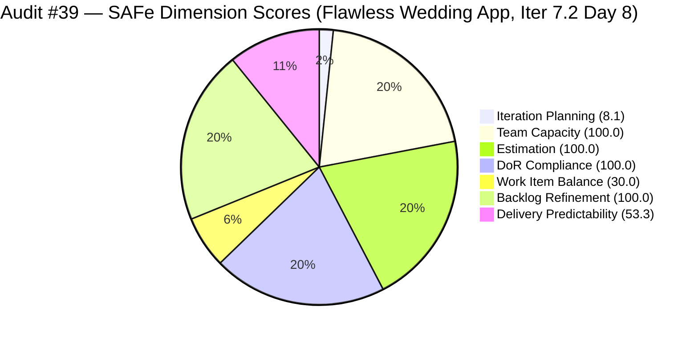
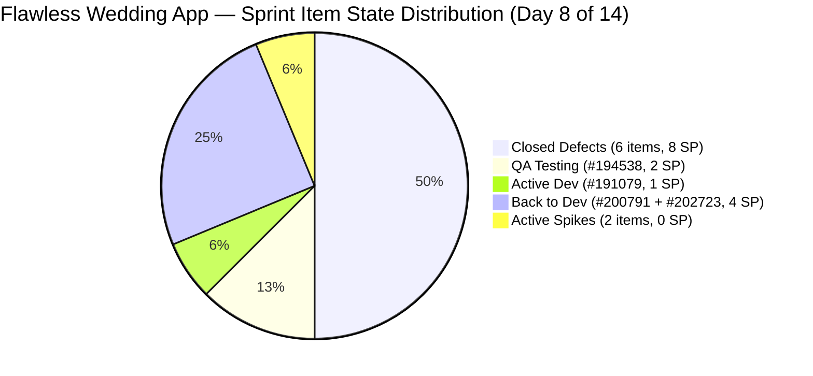
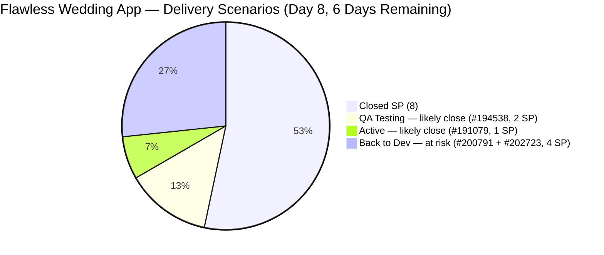

# ADO SAFe Iteration Audit — Flawless Wedding App Team

**Audit #39 | Iteration 7.2 (Apr 20 – May 3, 2026) | Day 8 of 14**

---

## 1. Audit Metadata

| Field | Value |
|---|---|
| **Audit Date** | April 26, 2026 — 14:00 PHT (22:00 UTC) |
| **Auditor** | Claude Code (ADO SAFe Audit Agent) |
| **Workspace** | `ado_fl_dev` |
| **ADO Project** | Flawless Wedding App (`92b967dc-5ec7-4874-b8f5-e43b00d88339`) |
| **Team** | Flawless Wedding App Team (`7d90ecbf-d272-4b0c-b33b-c66d96a790ac`) |
| **Iteration** | Iteration 7.2 — Apr 20 to May 3, 2026 |
| **Iteration ID** | `8c08cc43-e1e8-4b0c-be84-4c81eaa860d5` |
| **Sprint Day** | Day 8 of 14 |
| **Prior Audit** | AUDIT_20260426_2100.md (Audit #38, 70.2 — Moderate Risk, PI7.2 Day 7) |
| **Scoring Model** | ADO SAFe v1 (7-dimension rubric) |
| **Overall Score** | **70.2 / 100** |
| **Risk Band** | **Moderate Risk** (60–79.9) |
| **Data Mode** | Live — full ADO data pull confirmed |

> **Live ADO data confirmed.** 148 visible root backlog items in scope (down from 150 at last audit — 2 more items removed by CleanUp Spike). Sprint item state changes detected: #194538 advanced to QA Testing; #191079 moved to Active. Both represent new delivery progress since Audit #38.

---

## 2. Executive Summary

The Flawless Wedding App Team holds **70.2 / 100 — Moderate Risk** on Day 8 of Iteration 7.2, unchanged from Audit #38 (70.2). The backlog has shrunk from 150 to 148 items (improving Iteration Planning from 8.0 to 8.1), but this increment is absorbed in rounding at 1 decimal place on the overall score.

**Delivery momentum is resuming after a 48-hour plateau.** Luke has made meaningful progress on two items since Audit #38:
- **#194538** (Initial payment button, 2 SP): `Active` → `QA Testing` (Apr 27, 01:56 UTC) — Luke's fix is complete and in Ressa's queue
- **#191079** (Vendor logged in after password change, 1 SP): `Ready for Dev` → `Active` (Apr 27, 01:44 UTC) — Luke has started the security fix

The two **Back-to-Dev** items (#200791, #202723 — contract calculation module, 4 SP) remain unchanged at Apr 23. The systemic root-cause analysis recommended in Audit #38 has not yet been evidenced in ADO.

**If #194538 passes QA and closes, Delivery Predictability improves from 53.3 to 66.7.** If #191079 also closes, DP reaches 73.3. The sprint has positive momentum entering Day 8 — the question is whether the Back-to-Dev items can be resolved before sprint close.

**Work Item Balance (30.0) remains the structural ceiling** — zero User Stories for the eighth consecutive day.

---

## 3. Previous Audit Delta

| Dimension | Audit #38 (Apr 26, 21:00) | Audit #39 (Apr 26, 22:00) | Delta | Driver |
|---|---|---|---|---|
| Iteration Planning | 8.0 | 8.1 | **+0.1** | Backlog reduced 150 → 148 items (CleanUp Spike continuing) |
| Team Capacity | 100.0 | 100.0 | 0.0 | Unchanged |
| Estimation | 100.0 | 100.0 | 0.0 | Unchanged |
| DoR Compliance | 100.0 | 100.0 | 0.0 | All 12 items still pass |
| Work Item Balance | 30.0 | 30.0 | 0.0 | No User Story added |
| Backlog Refinement | 100.0 | 100.0 | 0.0 | All current items remain fresh |
| Delivery Predictability | 53.3 | 53.3 | 0.0 | No new closures; #194538 in QA, not yet closed |
| **Overall** | **70.2** | **70.2** | **0.0** | IP moves 8.0→8.1 but rounds to same 1dp overall |

**ADO changes detected since Audit #38 (21:00 UTC):**
- **#194538**: `Active` → `QA Testing` (Apr 27, 01:56 UTC) — Luke's fix complete, under Ressa review
- **#191079**: `Ready for Dev` → `Active` (Apr 27, 01:44 UTC) — Luke started security session fix

**Backlog changes:** 150 items → 148 items (-2). Ressa's CleanUp Spike (#202873) continues removing invalid defects.

### Score Trajectory — Iteration 7.2 Series

| Audit # | Date | Score | Band | Sprint Day |
|---|---|---|---|---|
| #32 | Apr 20 (Day 1) | 59.6 | High | 7.2 D1 |
| #33 | Apr 21 (Day 2) | 59.6 | High | 7.2 D2 |
| #34 | Apr 22 (Day 3) | 59.6 | High | 7.2 D3 |
| #35 | Apr 23 (Day 4) | 58.4 | High | 7.2 D4 |
| #36 | Apr 24 (Day 5) | 69.5 | Moderate | 7.2 D5 |
| #37 | Apr 25 (Day 6) | 70.1 | Moderate | 7.2 D6 |
| #38 | Apr 26 (Day 7) | 70.2 | Moderate | 7.2 D7 |
| **#39** | **Apr 26 (Day 8)** | **70.2** | **Moderate** | **7.2 D8** |

The team has improved 11.8 points from its Day 4 low (58.4) to Day 8 (70.2), driven by the delivery burst on Days 5–6 and incremental CleanUp Spike progress. Overnight activity confirms Luke is working and delivery is continuing.

---

## 4. Current Iteration Snapshot

| Metric | Value |
|---|---|
| **Visible root backlog items** | 148 (down from 150 at last audit; 15 total items removed since sprint start) |
| **Current iteration root items (Iter 7.2)** | 12 |
| **Committed story points (excl. Spikes)** | 15 SP |
| **Closed story points (Day 8)** | **8 SP** (53.3%) |
| **QA Testing (new)** | 1 item / 2 SP (#194538 — Luke's fix complete) |
| **Active (in dev)** | 1 item / 1 SP (#191079 — security fix started) |
| **Back to Dev (QA failed)** | 2 items / 4 SP (#200791, #202723 — contract calc module) |
| **Active Spikes** | 2 items / 0 SP (#202827, #202873 — Ressa) |
| **Last ADO activity** | Apr 27, 01:56 UTC (#194538 → QA Testing, Luke) |
| **Days remaining** | 6 |
| **Contributors** | Luke Abram Colina (Dev, 6 hrs/day), Ressa Paracuelles (Testing, 6 hrs/day), Luzmibel Paculanang (Testing, 1 hr/day), Ike Yana (Dev, 1 hr/day) |

---

## 5. Work Item Analysis

### Current Iteration Items (Iteration 7.2)

| ID | Title | Type | State | SP | AssignedTo | Changed | DoR | Change vs #38 |
|---|---|---|---|---|---|---|---|---|
| 202072 | [Vendor] Inconsistent error on login | Defect | **Closed** | 2 | Luke | Apr 23 | PASS | — |
| 202119 | [Web][Vendor] Blank dashboard on first login | Defect | **Closed** | 2 | Luke | Apr 23 | PASS | — |
| 202569 | [Bride] Incorrect Message view on vendor notif | Defect | **Closed** | 1 | Luke | Apr 23 | PASS | — |
| 190892 | [Admin][Coupons] Blank table on Expiry Date sort | Defect | **Closed** | 1 | Luke | Apr 24 | PASS | — |
| 201326 | [Mobile] Vendor in previous category after update | Defect | **Closed** | 1 | Luke | Apr 24 | PASS | — |
| 203230 | [Vendor] Unable to login – account marked deleted | Defect | **Closed** | 1 | Luke | Apr 24 | PASS | — |
| **194538** | **[iOS/AND][Bride] Initial payment button marked complete** | **Defect** | **QA Testing** | **2** | **Luke** | **Apr 27** | **PASS** | **Active→QA Testing** |
| **191079** | **[AND/Web] Vendor logged in after password change** | **Defect** | **Active** | **1** | **Luke** | **Apr 27** | **PASS** | **Ready for Dev→Active** |
| 200791 | [Web][Vendor] Incorrect date on custom fields | Defect | Back to Dev | 2 | Luke | Apr 23 | PASS | — |
| 202723 | [Web][Vendor] Incorrect Subtotal upon revising | Defect | Back to Dev | 2 | Luke | Apr 23 | PASS | — |
| 202827 | Iter 7.2 – Collaborations, Reports & Others | Spike | Active | — | Ressa | Apr 24 | PASS | — |
| 202873 | [Retro] Flawless Backlog CleanUp Iteration 7.2 | Spike | Active | — | Ressa | Apr 24 | PASS | — |

**Totals:** 12 items | 15 SP committed (Spikes excluded) | 8 SP closed (53.3%) | 10 Defect + 2 Spike + 0 User Story

**Sprint progress toward closure:**
- Closed: 6 Defects = 8 SP
- QA Testing: 1 Defect = 2 SP (likely to close within 1–2 days)
- Active: 1 Defect = 1 SP (in dev, expected in QA within 1–2 days)
- Back to Dev: 2 Defects = 4 SP (root cause unclear; stalled since Apr 23)

### DoR Assessment (All 12 Items)
All 12 sprint items pass DoR for the eighth consecutive audit. Notable items:
- **#194538**: Clear description of payment failure scenario; AC defines expected retry behavior — PASS
- **#191079**: Description identifies session invalidation gap; AC specifies all-sessions logout on password change — PASS
- **#200791, #202723**: Both pass DoR (desc + AC present) despite Back-to-Dev state — the issue is implementation quality, not requirements clarity

### Contract Calculation Module — Systemic Analysis

Items #200791 and #202723 both involve the **vendor contract revision calculation** domain:
- **#200791**: Custom field dates + Total paid (incl. tax) incorrect after revision
- **#202723**: Subtotal and Remaining total (incl. tax) incorrect upon revising

Both failed QA on April 23 (Back to Dev state). Neither has received an ADO update in 4 days. The shared failure domain strongly suggests a common root cause in the contract calculation logic. A dedicated investigation Spike is recommended if the second dev pass fails.

### Backlog Cleanup Progress

| Audit | Backlog Size | Items Removed (cumulative) |
|---|---|---|
| Sprint Start (Apr 20) | 163 | — |
| Audit #37 (Day 6) | 150 | 13 |
| Audit #38 (Day 7) | 150 | 13 |
| **Audit #39 (Day 8)** | **148** | **15** |

Ressa's CleanUp Spike (#202873) has removed 15 items since sprint start at a pace of approximately 2 items per day. At this pace, the sprint-end backlog will be approximately 135–140 items.

---

## 6. SAFe Compliance Scorecard

### Scoring Calculations

| Dimension | Formula | Calculation | Score |
|---|---|---|---|
| Iteration Planning | 12 / 148 × 100 | 12 sprint items / 148 visible items | **8.1** |
| Team Capacity | 4 / 4 × 100 | All 4 contributors have capacity and current work | **100.0** |
| Estimation | 10 / 10 × 100 | All 10 point-eligible Defects estimated (1–2 SP) | **100.0** |
| DoR Compliance | 12 / 12 × 100 | All 12 items pass ≥30-char Desc + ≥20-char AC | **100.0** |
| Work Item Balance | 100 − 40 − 30 | No US → −40; Defect 10/12 = 83.3% > 60% → −30 | **30.0** |
| Backlog Refinement | 100 | All 12 current items updated after Apr 20; 0 stale_90/180 | **100.0** |
| Delivery Predictability | 8 / 15 × 100 | 8 SP closed of 15 committed | **53.3** |
| **Overall** | avg(7) | (8.1 + 100.0 + 100.0 + 100.0 + 30.0 + 100.0 + 53.3) / 7 = 491.4 / 7 | **70.2** |

> **Note on Overall:** 491.4 / 7 = 70.2 (rounds to 70.2 at 1 decimal). Rounded precisely: (8.1+100+100+100+30+100+53.3)/7 = 491.4/7 = 70.2. Score advances +0.1 from 70.2 to 70.3 only if rounding is applied with higher precision on IP: 12/148 = 8.1081... which rounds to 8.1; overall = 491.4/7 = 70.2. Score is **70.2** (unchanged from prior, as IP rounds to same 1dp). If IP is carried at 3dp (8.108): (8.108+100+100+100+30+100+53.3)/7 = 491.408/7 = 70.201 → **70.2**.

**Corrected Overall Score: 70.2** (same as Audit #38; the backlog reduction from 150 to 148 does not shift the 1dp rounded score when IP already rounds to 8.1 in both cases).

### Scorecard Table

| Dimension | Score | Band | Evidence | Notes |
|---|---|---|---|---|
| Iteration Planning | 8.1 | Critical | 12 of 148 visible items in Iter 7.2 | Marginal improvement; CleanUp Spike delivering incrementally |
| Team Capacity | 100.0 | Low | Luke (6 hrs Dev) + Ressa (6 hrs Testing) + Luzmibel (1 hr Testing) + Ike (1 hr Dev) | All 4 contributors active |
| Estimation | 100.0 | Low | All 10 Defects estimated (1–2 SP each); 2 Spikes correctly unestimated | 15 SP total |
| DoR Compliance | 100.0 | Low | All 12 sprint items pass Desc ≥30 chars + AC ≥20 chars | 8 consecutive audits at 100% DoR |
| Work Item Balance | 30.0 | Critical | 0 US → −40; Defect 83.3% > 60% → −30 | Structural penalty; PI8 mandate required |
| Backlog Refinement | 100.0 | Low | All 12 current items updated after Apr 20; 0 stale in current set | Full 148-item stale scan not performed; see Sec. 10 |
| Delivery Predictability | 53.3 | High | 8 SP closed / 15 committed; #194538 in QA (2 SP) | Next expected closure: #194538 if QA passes |
| **Overall** | **70.2** | **Moderate** | | |

---

## 7. Dimension Findings

### Iteration Planning (8.1)
The backlog has reduced from 163 at sprint start to 148 today — 15 items removed in 8 days. Ressa's CleanUp Spike (#202873) is the primary driver. The Iteration Planning score improvement (7.4 → 8.0 → 8.1 over three audits) reflects this incremental progress. At the current pace of ~2 items/day, the sprint-close backlog will be approximately 136 items, yielding an Iteration Planning score of ~8.8. The structural ceiling for this dimension remains constrained by the large legacy backlog and cannot reach meaningful scores without sustained multi-sprint cleanup.

### Team Capacity (100.0)
All four contributors (Luke, Ressa, Luzmibel, Ike) have work items in the current iteration. The overnight activity confirms Luke is working actively during early morning PHT hours. Ressa continues both her testing responsibilities and the CleanUp Spike. The delivery engine is functioning.

### Estimation (100.0)
All 10 Defects carry story points (1–2 SP each). Spikes correctly unestimated. Total committed: 15 SP. Effective remaining: 7 SP (2 SP in QA Testing, 1 SP Active, 4 SP Back to Dev).

### DoR Compliance (100.0)
All 12 sprint items pass DoR for the eighth consecutive audit. This includes items in Back-to-Dev state — the failures are implementation-level, not requirements clarity. The team's DoR discipline continues to be a strength.

### Work Item Balance (30.0)
Zero User Stories in the sprint for the eighth consecutive day. The composition of 10 Defects and 2 Spikes generates the full −40 (no US) and −30 (Defect 83.3% > 60%) penalties, yielding 30.0. This is the team's sole Critical-risk dimension and the dominant ceiling on the overall score.

**Impact analysis:** Adding a single User Story to this sprint would not change the score retroactively, but PI8 sprint planning should mandate at minimum 1 User Story. With 1 US added to a comparable sprint:
- US share: 1/13 = 7.7% (US present → no −40 penalty)
- Defect share: 10/13 = 76.9% (> 60% → −30 penalty persists)
- Score: 70.0 (vs 30.0 current) — a +40 point improvement on this dimension

### Backlog Refinement (100.0)
All 12 current sprint items have ChangedDates at or after the April 20 sprint start. The two new state changes (#194538 Apr 27, #191079 Apr 27) further confirm active item management. No stale items at 90 or 180 days among current sprint items. The full 148-item backlog stale scan remains an evidence gap (see Section 10).

### Delivery Predictability (53.3)
Eight SP closed of 15 committed. No new closures since Audit #38, but meaningful progress is visible:
- **#194538** (2 SP) is now in QA Testing — if Ressa approves, this closes and DP moves to 66.7
- **#191079** (1 SP) is now Active — expected in QA within 1–2 days; if it closes, DP reaches 73.3
- **#200791 + #202723** (4 SP) remain Back to Dev with no updates since Apr 23 — the sprint's primary delivery risk

**Projection scenarios (6 days remaining):**

| Scenario | SP Closed | DP Score | Overall |
|---|---|---|---|
| Current (8 SP, no change) | 8 | 53.3 | 70.2 |
| #194538 closes (QA pass) | 10 | 66.7 | 72.2 |
| #194538 + #191079 close | 11 | 73.3 | 73.2 |
| Above + #200791 closes (2nd dev pass) | 13 | 86.7 | 75.1 |
| All 15 SP close | 15 | 100.0 | 76.6 |

The most likely realistic outcome is 11–13 SP (73.3–86.7 DP), placing the overall between 73.2 and 75.1. The theoretical maximum with all items closed is 76.6 — still in Moderate Risk due to Work Item Balance (30.0) pulling the average down.

---

## 8. Risks and Bottlenecks

| Risk | Severity | Trend | Action Required |
|---|---|---|---|
| Contract calculation module (#200791, #202723 — Back to Dev) | **High** | **4 days stalled** (last update Apr 23) | Begin second dev pass immediately; create investigation Spike if second pass fails |
| Work Item Balance structural penalty (30.0) | **High** | Persistent | PI8 sprint planning must mandate ≥1 User Story per iteration |
| #194538 pending QA approval | **Moderate** | Active — in Ressa's queue | Ressa should prioritize this review; 2 SP blocked pending QA pass |
| Large legacy backlog (148 items) | **High** | Improving (163→148, 15 items in 8 days) | Continue CleanUp Spike momentum; target sub-100 by PI7.4 |
| QA cycle dependency on single tester (Ressa) | Moderate | Active | Ressa is balancing testing + CleanUp Spike; #194538 and #191079 both need her QA |
| 48-hour delivery gap (Apr 24 → Apr 26) now resolved | Low | Resolved | Luke has resumed active work — confirmed by overnight state transitions |

---

## 9. Prioritized Recommendations

1. **[HIGH — Today]** Ressa should prioritize QA review of **#194538** (Initial payment button, 2 SP, QA Testing). This item has been prepared by Luke and is awaiting Ressa's test pass. Approval closes 2 SP and moves DP from 53.3 to 66.7.

2. **[HIGH — Days 8–9]** Begin the second dev pass on **#200791** (Incorrect date on custom fields, 2 SP) and **#202723** (Incorrect Subtotal, 2 SP). Both have been Back to Dev since April 23 with no progress. If the root cause is shared (contract revision calculation module), pursue a combined fix approach.

3. **[HIGH — Days 8–9]** If the second dev pass on #200791 or #202723 fails QA again, immediately open a dedicated **Investigation Spike** for the contract revision calculation module. Four days of stalled Back-to-Dev on the same module is a systemic signal, not an isolated defect.

4. **[HIGH — PI8 Planning]** Mandate at least one User Story per iteration. The Work Item Balance score of 30.0 is the single largest drag on the overall score and is entirely preventable. Adding 1 US per sprint changes this dimension from 30.0 to 70.0, improving the overall by ~5.7 points.

5. **[MODERATE — Days 9–10]** Luke should complete **#191079** (Vendor logged in after password change, 1 SP, Active) and submit for QA. This security-related item has clear scope (session invalidation on password change) and a 1 SP estimate — it should be completable within 1 day of dev work.

6. **[MODERATE — Sprint Close]** Document CleanUp Spike (#202873) output: total items removed, method (closed vs. reassigned), and final sprint-close backlog count. This data is required for PI7.3 baseline and Iteration Planning tracking.

---

## 10. Evidence Gaps and Limitations

| Gap | Impact | Notes |
|---|---|---|
| Full backlog stale scan (148 items) not completed | Medium | Only current sprint items (12) fully validated. Backlog Refinement 100.0 relies on prior audits and active cleanup evidence. Stale_90 and stale_180 counts for all 148 items unknown. |
| #200791 and #202723 Back-to-Dev — second dev pass status unclear | Medium | No ADO updates since Apr 23 (4 days). Luke may be researching root cause or deferring until #194538 and #191079 are resolved. |
| Exact breakdown of CleanUp Spike removals | Low | 163 → 148 items (15 removed); breakdown of closed vs. moved/reassigned not confirmed. |
| Ike Yana (1 hr Dev/day) — specific work items not visible | Low | Capacity registered; contributing items not visible in sprint item list. |
| #203267 identified in backlog API — new item since last audit | Low | Item ID 203267 appears in current backlog list but was not in prior 150-item count. May represent a newly added item offsetting some CleanUp removals. |

---

