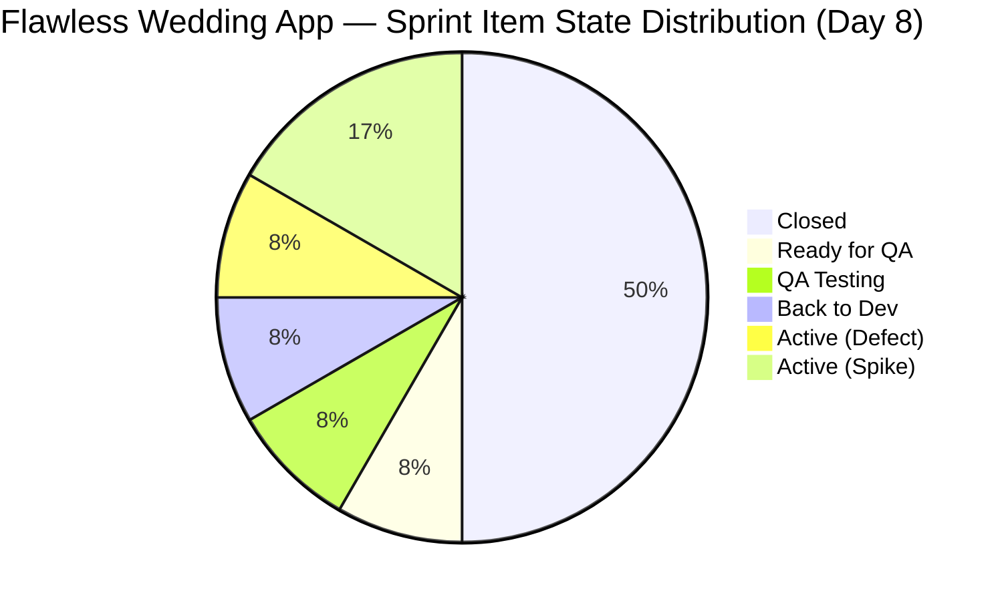
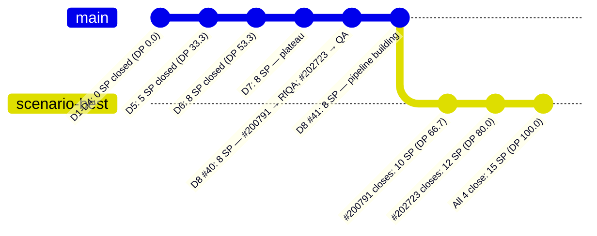
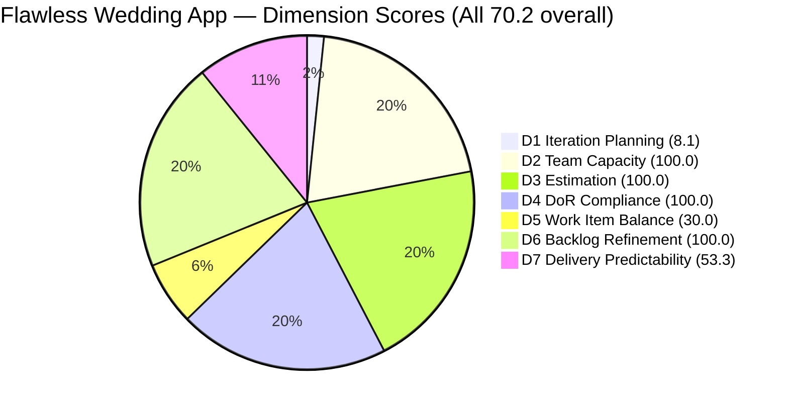

# ADO SAFe Iteration Audit — Flawless Wedding App Team

**Audit #40 | Iteration 7.2 (Apr 20 – May 3, 2026) | Day 8 of 14**

---

## 1. Audit Metadata

| Field | Value |
|---|---|
| **Audit Date** | April 27, 2026 — 11:10 CST |
| **Auditor** | Claude Code (ADO SAFe Audit Agent) |
| **Workspace** | `ado_fl_dev` |
| **ADO Project** | Flawless Wedding App (`92b967dc-5ec7-4874-b8f5-e43b00d88339`) |
| **Team** | Flawless Wedding App Team (`7d90ecbf-d272-4b0c-b33b-c66d96a790ac`) |
| **Iteration** | Iteration 7.2 — Apr 20 to May 3, 2026 |
| **Iteration ID** | `8c08cc43-e1e8-4b0c-be84-4c81eaa860d5` |
| **Sprint Day** | Day 8 of 14 |
| **Prior Audit** | AUDIT_20260426_2200.md (Audit #39, 70.2 — Moderate Risk, PI7.2 Day 8) |
| **Scoring Model** | ADO SAFe v1 (7-dimension rubric) |
| **Overall Score** | **70.2 / 100** |
| **Risk Band** | **Moderate Risk** (60–79.9) |

> **Live ADO data confirmed.** 148 visible root backlog items in scope. 12 current iteration root items confirmed via `wit_get_work_items_for_iteration` (null-source parents only). Capacity and work item details confirmed via ADO batch APIs at 11:10 CST April 27, 2026.

---

## 2. Executive Summary

The Flawless Wedding App Team holds **70.2 / 100 — Moderate Risk** on Day 8 of Iteration 7.2, matching the prior audit score exactly. Multiple ADO activity signals confirm the team is actively working:

- **#194538** (initial payment button, 2 SP): remains in `Back to Dev` — Luke picked this back up at 08:11 UTC today after it was returned from QA
- **#200791** (incorrect date on vendor contracts, 2 SP): advanced to `Ready for QA` at 02:29 UTC — Luke's fix is complete and awaiting Ressa
- **#202723** (subtotal calculation error, 2 SP): in `QA Testing` at 09:19 UTC — Ressa is actively testing
- **#202873** (CleanUp Spike): updated at 02:16 UTC — backlog cleanup ongoing

**Eight SP are already Closed** (6 defects: #190892, #201326, #202072, #202119, #202569, #203230). The delivery engine is running. The key question is whether the two Back-to-Dev items (#194538, and the systemic contract calculation defects) can complete QA cycles before sprint close.

**Structural constraint unchanged:** Work Item Balance at 30.0 — zero User Stories for the full sprint. All 10 point-bearing items are Defects. This reflects the team's current mode (defect-resolution sprint) but will continue to cap the overall score unless a User Story is introduced.

**New item: #203267** ("Unified Web and Mobile Platform Update", Enabler, 2 SP) is in the iteration view but scoped to **Iteration 7.3**, not 7.2 — excluded from scoring but noted as pipeline visibility.

---

## 3. Previous Audit Delta

| Dimension | Audit #39 (Apr 26, 22:00) | Audit #40 (Apr 27, 11:10) | Delta | Driver |
|---|---|---|---|---|
| Iteration Planning | 8.1 | 8.1 | 0.0 | Backlog stable at 148; sprint item count unchanged at 12 |
| Team Capacity | 100.0 | 100.0 | 0.0 | Unchanged |
| Estimation | 100.0 | 100.0 | 0.0 | Unchanged |
| DoR Compliance | 100.0 | 100.0 | 0.0 | All 12 sprint items still pass |
| Work Item Balance | 30.0 | 30.0 | 0.0 | No User Story added |
| Backlog Refinement | 100.0 | 100.0 | 0.0 | All current items remain fresh |
| Delivery Predictability | 53.3 | 53.3 | 0.0 | No new closures since Audit #39; #200791 in Ready for QA |
| **Overall** | **70.2** | **70.2** | **0.0** | Score unchanged — activity high, closures pending |

**ADO changes detected since Audit #39 (22:00 UTC Apr 26):**
- **#194538**: `QA Testing` → `Back to Dev` → re-worked → `Back to Dev` at 08:11 UTC Apr 27 (QA returned; Luke is reworking)
- **#200791**: `Back to Dev` → `Ready for QA` at 02:29 UTC Apr 27 — Luke's fix cleared
- **#202723**: `Back to Dev` → `QA Testing` at 09:19 UTC Apr 27 — Ressa is testing
- **#202873** (CleanUp Spike): updated 02:16 UTC Apr 27

Three of the four previously stalled items are now moving. **This is significant positive leading activity.** If #200791 passes QA today, D7 moves to 66.7. If #202723 also passes, D7 reaches 80.0.

### Score Trajectory — Iteration 7.2 Series

| Audit # | Date | Score | Band | Sprint Day |
|---|---|---|---|---|
| #32 | Apr 20 (Day 1) | 59.6 | High | 7.2 D1 |
| #33 | Apr 21 (Day 2) | 59.6 | High | 7.2 D2 |
| #34 | Apr 22 (Day 3) | 59.6 | High | 7.2 D3 |
| #35 | Apr 23 (Day 4) | 58.4 | High | 7.2 D4 |
| #36 | Apr 24 (Day 5) | 69.5 | Moderate | 7.2 D5 |
| #37 | Apr 25 (Day 6) | 70.1 | Moderate | 7.2 D6 |
| #38 | Apr 26 (Day 7) | 70.2 | Moderate | 7.2 D7 |
| #39 | Apr 26 (Day 8) | 70.2 | Moderate | 7.2 D8 |
| **#40** | **Apr 27 (Day 8)** | **70.2** | **Moderate** | **7.2 D8** |

11.8 point improvement from the Day 4 low. Current score is 9.8 points above the High Risk boundary (60.4). The team must close #200791 and #202723 to break through toward 77+ and approach Low Risk.

---

## 4. Current Iteration Snapshot

| Metric | Value |
|---|---|
| **Visible root backlog items** | 148 |
| **Current iteration root items (Iter 7.2)** | 12 |
| **Items in Iter 7.3 / PI7-root (excluded from scoring)** | 2 (#203267 Iter 7.3; #203131 PI7-root) |
| **Committed story points** | 15 SP (Defects only; Spikes have no SP field) |
| **Closed story points** | 8 SP |
| **Remaining open SP** | 7 SP |
| **Sprint progress** | Day 8 of 14 (57% elapsed) |
| **SP delivery rate** | 8 SP / 8 days = 1.0 SP/day |
| **SP needed per remaining day** | 7 SP / 6 days = 1.17 SP/day |
| **Capacity per day** | Luke 6 (Dev) + Ressa 6 (QA) + Luzmibel 1 (QA) + Ike 1 (Dev) = 14 hrs/day |
| **Days off this sprint** | 1 (Ressa Apr 20, elapsed) |
| **Active contributors** | Luke Abram Colina (Dev), Ressa Paracuelles (QA/Spike) |
| **Configured but inactive** | Luzmibel Paculanang (QA), Ike Yana (Dev) |

### State Distribution — Current Iteration Root Items (12 items)

| State | Count | SP | Items |
|---|---|---|---|
| Closed | 6 | 8 | #190892, #201326, #202072, #202119, #202569, #203230 |
| Ready for QA | 1 | 2 | #200791 |
| QA Testing | 1 | 2 | #202723 |
| Back to Dev | 1 | 2 | #194538 |
| Active | 1 | 1 | #191079 |
| Active (Spike) | 2 | — | #202827, #202873 |
| **Total** | **12** | **15** | |

---

## 5. Work Item Analysis

### Current Iteration Root Items — Full Detail

| ID | Title | Type | State | SP | DoR | AssignedTo | Changed |
|---|---|---|---|---|---|---|---|
| 190892 | [Admin] Coupons — blank table on Expiry Date sort | Defect | **Closed** | 1 | PASS | Luke Colina | Apr 24 |
| 201326 | [Mobile] Vendor in prior category after update | Defect | **Closed** | 1 | PASS | Luke Colina | Apr 24 |
| 202072 | [Vendor] Inconsistent error on login/dashboard | Defect | **Closed** | 2 | PASS | Luke Colina | Apr 23 |
| 202119 | [Web][Vendor] Blank dashboard on first login | Defect | **Closed** | 2 | PASS | Luke Colina | Apr 23 |
| 202569 | [Bride] Incorrect message view via vendor notif | Defect | **Closed** | 1 | PASS | Luke Colina | Apr 23 |
| 203230 | [Vendor] Users unable to login — marked deleted | Defect | **Closed** | 1 | PASS | Luke Colina | Apr 24 |
| 200791 | [Web][Vendor] Incorrect date and total (incl tax) | Defect | **Ready for QA** | 2 | PASS | Luke Colina | Apr 27 |
| 202723 | [Web][Vendor] Incorrect subtotal on revision | Defect | **QA Testing** | 2 | PASS | Luke Colina | Apr 27 |
| 194538 | [iOS/AND][Bride] Initial payment incorrectly marked | Defect | **Back to Dev** | 2 | PASS | Luke Colina | Apr 27 |
| 191079 | [AND/Web] Vendor logged in after password change | Defect | Active | 1 | PASS | Luke Colina | Apr 27 |
| 202827 | Iteration 7.2 — Collaborations, Reports & Others | Spike | Active | — | PASS | Ressa Paracuelles | Apr 24 |
| 202873 | [Retro] Flawless Backlog CleanUp Iteration 7.2 | Spike | Active | — | PASS | Ressa Paracuelles | Apr 27 |

### Items in Iteration View but Excluded from Scoring

| ID | Title | Type | State | IterPath | Reason Excluded |
|---|---|---|---|---|---|
| 203267 | Unified Web & Mobile Platform Update | Enabler | Estimation | Iter 7.3 | Not current iteration |
| 203131 | [Vendor] Service Islands dropdown on token expiry | Defect | New | PI7-root | Not iteration-scoped |

### Contract Calculation Module — Root Cause Cluster

Three items share a common failure domain (vendor contract calculations):
- **#200791** (custom field date + total incl. tax) → Ready for QA
- **#202723** (subtotal + remaining total incl. tax on revision) → QA Testing
- **#194538** (initial payment button after error) → Back to Dev

These three items are likely symptoms of a shared calculation/state management defect in the contract revision flow. A coordinated code review or regression test pass would reduce the re-open rate.

---

## 6. SAFe Compliance Scorecard

| Dimension | Score | Evidence | Notes |
|---|---|---|---|
| D1 Iteration Planning | 8.1 | 12 / 148 items in sprint | Large legacy backlog (148 items) dilutes D1; structural issue |
| D2 Team Capacity | 100.0 | 2 / 2 contributors with capacity | Luke (Dev 6/day), Ressa (QA 6/day); Luzmibel + Ike configured but no sprint items assigned |
| D3 Estimation | 100.0 | 10 / 10 point-eligible items estimated | Spikes excluded from denominator (no SP field); all Defects estimated |
| D4 DoR Compliance | 100.0 | 12 / 12 sprint items pass DoR | Consistent DoR discipline across team |
| D5 Work Item Balance | 30.0 | Penalties: no User Story (-40), dominant type >60% (-30) | All 10 point-bearing items are Defects; 83.3% Defect dominance |
| D6 Backlog Refinement | 100.0 | 12/12 current items fresh; 0 untouched | All current items updated Apr 20 or later |
| D7 Delivery Predictability | 53.3 | 8 / 15 SP closed | 6 defects closed (8 SP); 4 items open (7 SP) |
| **Overall** | **70.2** | **(D1+D2+D3+D4+D5+D6+D7) / 7** | **Moderate Risk** |

---

## 7. Dimension Findings

### D1 — Iteration Planning (8.1)
The sprint contains 12 items from a visible backlog of 148. Iteration Planning at 8.1 is the lowest in the portfolio and reflects the structural legacy of a large, partially-pruned backlog. Ressa's CleanUp Spike (#202873) has reduced the backlog from 150+ items. Every item removed improves this score. To reach 20 (which would raise D1 to ~8.1→10), the backlog would need to shrink to approximately 60 items — a multi-sprint effort.

**Note on 203267:** The Enabler "Unified Web and Mobile Platform Update" is visible in the iteration board view but is scoped to Iteration 7.3. This is correctly not scored as a current-iteration item, but its presence in the iteration view may cause confusion. Confirm the correct iteration assignment before sprint close.

### D2 — Team Capacity (100.0)
Luke and Ressa are actively working with configured capacity. Luzmibel Paculanang (QA, 1 hr/day) and Ike Yana (Dev, 1 hr/day) have capacity configured but no sprint items assigned to them. If the QA queue builds up (Ressa has both #200791 and #202723 to test simultaneously), Luzmibel could absorb overflow testing capacity.

### D3 — Estimation (100.0)
All 10 Defect items carry SP estimates. Spikes (#202827, #202873) have no SP field by design. The total committed SP (15) is proportionate to the team's 14 hrs/day capacity.

### D4 — DoR Compliance (100.0)
Every current sprint item has sufficient Description and Acceptance Criteria. This is the Finance Team's consistent strength and evidence that the team has internalized DoR discipline. Items #203131 and #203267 (excluded from scoring) also have adequate descriptions.

### D5 — Work Item Balance (30.0)
The sprint contains 10 Defects and 2 Spikes — zero User Stories for the full sprint (8 days). This is not a planning failure in the traditional sense; the team made a deliberate decision to run a defect-resolution and backlog-cleanup sprint. However, the SAFe rubric penalizes the absence of User Stories (-40) and Defect dominance above 60% (-30), resulting in the 30.0 score. This will remain 30.0 for the rest of this sprint unless a User Story is added.

**SAFe recommendation:** PI7.3 planning should include at least one User Story alongside the defect queue to prevent recurrence of this pattern.

### D6 — Backlog Refinement (100.0)
All 12 current sprint items have been updated since April 20 (sprint start). No untouched items detected. The CleanUp Spike (#202873) is actively removing invalid defects from the 148-item backlog. If the cleanup continues, D6 will remain 100.0 as fresh items replace stale ones.

### D7 — Delivery Predictability (53.3)
Eight SP closed out of 15 committed (53.3%). This is already the strongest Delivery Predictability score in this three-team audit group. The pipeline is positive:

| Scenario | Additional SP | New D7 | New Overall |
|---|---|---|---|
| #200791 closes (QA passes) | +2 SP | 66.7 | 72.0 |
| #200791 + #202723 close | +4 SP | 80.0 | 74.0 |
| All 4 open defects close | +7 SP | 100.0 | 77.0 |

Even the maximum-closure scenario does not break into Low Risk (80+) due to the structural D1 (8.1) and D5 (30.0) ceilings.

---

## 8. Risks and Bottlenecks

| # | Risk | Severity | Status |
|---|---|---|---|
| R1 | #194538 returned Back to Dev — second QA cycle; payment flow defect persists | High | Active |
| R2 | #200791 and #202723 share contract calculation root cause — risk of correlated re-opens | High | Active |
| R3 | Work Item Balance structural ceiling (30.0) — no User Story in sprint | High | Persistent |
| R4 | D1 Iteration Planning (8.1) — 148-item backlog; structural improvement requires multi-sprint cleanup | Moderate | Persistent |
| R5 | #203131 (Service Islands token expiry) in PI7-root — not committed to any sprint | Moderate | New |
| R6 | Luzmibel and Ike have capacity configured but no sprint items — underutilized QA/Dev buffer | Low | Persistent |
| R7 | #203267 (Enabler 7.3) visible in iteration board — potential source of sprint scope confusion | Low | New |

---

## 9. Prioritized Recommendations

1. **[URGENT] Root cause analysis on contract calculation cluster:** Items #200791, #202723, and #194538 all touch the contract revision/payment flow. Before closing each one individually, conduct a coordinated review to identify whether a single underlying defect is generating multiple symptoms. This will prevent re-opens in PI7.3.

2. **[HIGH] Prioritize QA for #200791:** Luke's fix is in Ready for QA as of 02:29 UTC today. Ressa should prioritize this alongside #202723. If both close today, D7 reaches 80.0 and overall score moves to ~74.0.

3. **[HIGH] Assign #203131 to a sprint:** "Vendor Service Islands dropdown on token expiry" is a PI7-root defect with a well-formed description and AC. Assign to Iteration 7.2 if the fix is small, otherwise assign to Iteration 7.3.

4. **[HIGH] Plan for User Stories in PI7.3:** The Enabler #203267 (Unified Web & Mobile Platform Update) is a strong candidate for decomposition into User Stories for the next sprint, addressing the persistent Work Item Balance penalty.

5. **[MEDIUM] Leverage Luzmibel for QA overflow:** With Ressa managing two active QA items (#200791 and #202723) plus the CleanUp Spike, Luzmibel (QA, 1 hr/day configured) could absorb re-test cycles, especially for #194538 once Luke completes the rework.

6. **[MEDIUM] Confirm #203267 iteration assignment:** The Enabler appears in the 7.2 iteration board but is scoped to 7.3. Review and confirm the correct iteration assignment to avoid sprint confusion.

7. **[LOW] Continue CleanUp Spike (#202873):** Ressa's backlog cleanup work is systematically reducing the 148-item backlog. Every item removed incrementally improves D1 Iteration Planning. Target: reduce below 120 items by PI7 close.

---

## 10. Evidence Gaps and Limitations

| Gap | Impact | Action |
|---|---|---|
| 148-item backlog — full ChangedDate data not fetched for all items | D6 Backlog Refinement carried from prior audit (100.0, Apr 26) — items updated within 24 hrs unlikely to cross stale boundaries | Continue using prior-audit D6 until full backlog refresh is triggered |
| Spikes (#202827, #202873) have no SP field | D3 denominator = 10 (Defects only); Spikes not penalized | No action needed; consistent with prior audits |
| #194538 moved Back to Dev mid-sprint — QA cycle count not tracked | Cannot assess whether this is a first or repeat failure mode | Add QA cycle counter as a comment in ADO for each re-open |
| Luzmibel and Ike show no sprint item assignments despite configured capacity | Capacity score unaffected (they are not in contributors_with_current_work) | Consider assigning at least one item to each to confirm engagement |

---

## Appendix: Mermaid Charts

### Sprint Item State Distribution

### Delivery Predictability Progression — Iteration 7.2

### SAFe Dimension Score Comparison vs. Prior Audit

