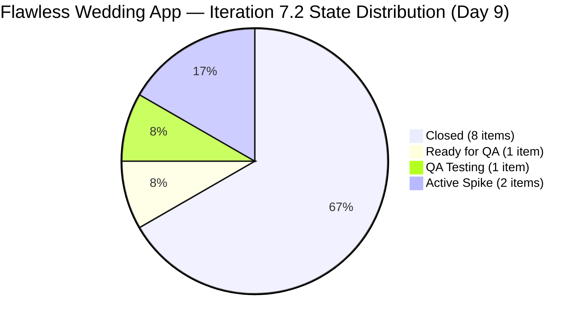
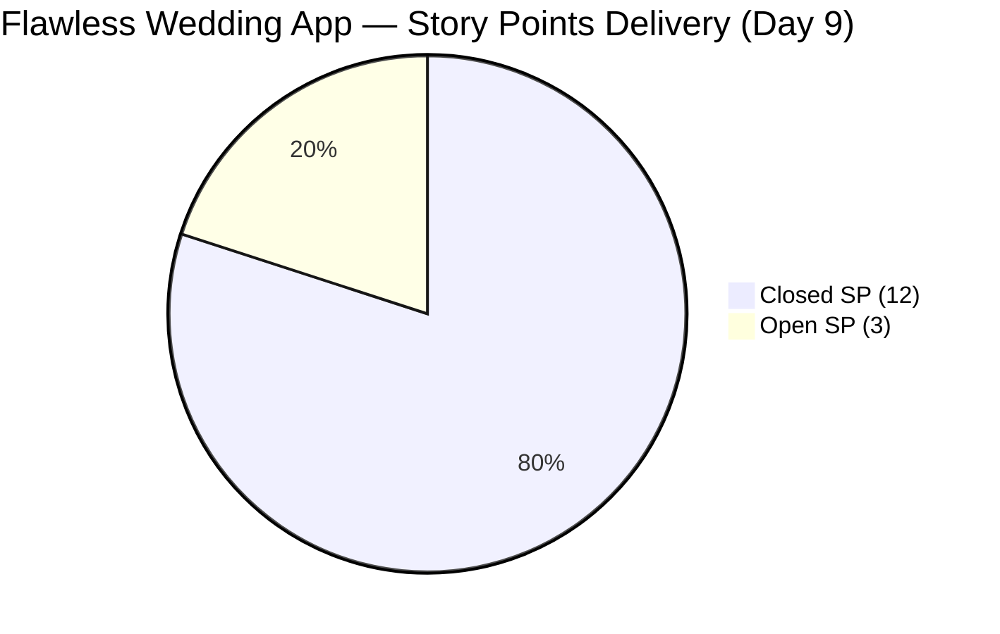

# ADO SAFe Iteration Audit — Flawless Wedding App Team

**Audit #41 | Iteration 7.2 (Apr 20 – May 3, 2026) | Day 9 of 14**

---

## 1. Audit Metadata

| Field | Value |
|---|---|
| **Audit Date** | April 28, 2026 — 09:02 UTC |
| **Auditor** | Claude Code (ADO SAFe Audit Agent) |
| **Workspace** | `ado_fl_dev` |
| **ADO Project** | Flawless Wedding App (`92b967dc-5ec7-4874-b8f5-e43b00d88339`) |
| **Team** | Flawless Wedding App Team (`7d90ecbf-d272-4b0c-b33b-c66d96a790ac`) |
| **Iteration** | Iteration 7.2 — Apr 20 to May 3, 2026 |
| **Iteration ID** | `8c08cc43-e1e8-4b0c-be84-4c81eaa860d5` |
| **Sprint Day** | Day 9 of 14 |
| **Prior Audit** | AUDIT_20260427_1110.md (Audit #40, 70.2 — Moderate Risk, PI7.2 Day 8) |
| **Scoring Model** | ADO SAFe v1 (7-dimension rubric) |
| **Overall Score** | **74.0 / 100** |
| **Risk Band** | **Moderate Risk** (60–79.9) |

> **Live ADO data confirmed.** 148 visible root backlog items in scope (Flawless Wedding App Team). 12 current iteration root items confirmed via `wit_get_work_items_for_iteration` (null-source parents, IterationPath = Iteration 7.2). Capacity and work item details confirmed via ADO batch APIs at 09:02 UTC April 28, 2026.

---

## 2. Executive Summary

The Flawless Wedding App Team jumps to **74.0 / 100 — Moderate Risk** on Day 9 of Iteration 7.2, a **+3.8 improvement** over Audit #40 (70.2). This is the strongest single-day score increase of the sprint, driven by **two new closures today**:

- **#200791** ("[Web][Vendor] Incorrect date on custom fields and incorrect Total paid incl. tax", 2 SP): Closed at 07:30 UTC — Luke's fix passed QA after being in Ready for QA since Apr 27
- **#202723** ("[Web][Vendor] Incorrect Subtotal and Remaining total on revision", 2 SP): Closed at 01:33 UTC — QA testing completed successfully

Total closed SP now: **12 of 15** (80.0%). Only 3 SP remain open across all in-flight items.

**Additional activity today:**
- **#191079** ("[AND/Web] Vendor logged in after password change", 1 SP): advanced to **Ready for QA** at 01:34 UTC — Luke's fix is complete, awaiting Ressa's QA pass
- **#194538** ("[iOS/AND][Bride] Initial payment button incorrectly marked", 2 SP): advanced to **QA Testing** at 05:47 UTC — Ressa has picked this up

If both #191079 (1 SP) and #194538 (2 SP) clear QA before May 3, D7 reaches **100.0** and the overall score would reach approximately **81.2 — Low Risk**.

**Structural constraint:** Work Item Balance remains at 30.0 — the sprint carries zero User Stories. All deliverable items are Defects or Spikes. This caps the score ceiling but cannot be changed mid-sprint without adding a new User Story.

---

## 3. Previous Audit Delta

| Dimension | Audit #40 (Apr 27, 11:10) | Audit #41 (Apr 28, 09:02) | Delta | Driver |
|---|---|---|---|---|
| Iteration Planning | 8.1 | 8.1 | 0.0 | Backlog stable at 148; sprint unchanged at 12 items |
| Team Capacity | 100.0 | 100.0 | 0.0 | Unchanged |
| Estimation | 100.0 | 100.0 | 0.0 | Unchanged |
| DoR Compliance | 100.0 | 100.0 | 0.0 | All 12 items still pass |
| Work Item Balance | 30.0 | 30.0 | 0.0 | No User Story added |
| Backlog Refinement | 100.0 | 100.0 | 0.0 | All current items remain fresh |
| Delivery Predictability | 53.3 | **80.0** | **+26.7** | #200791 + #202723 Closed (4 SP); total closed = 12 SP / 15 SP |
| **Overall** | **70.2** | **74.0** | **+3.8** | Two closures drive the largest single-day gain this sprint |

**ADO changes detected since Audit #40 (11:10 UTC Apr 27):**
- **#202723** ("[Web][Vendor] Incorrect Subtotal…", 2 SP): `QA Testing` → **`Closed`** at 01:33 UTC Apr 28
- **#191079** ("[AND/Web] Vendor logged in after password change", 1 SP): `Active` → **`Ready for QA`** at 01:34 UTC Apr 28
- **#194538** ("[iOS/AND][Bride] Initial payment button…", 2 SP): `Back to Dev` → **`QA Testing`** at 05:47 UTC Apr 28
- **#200791** ("[Web][Vendor] Incorrect date + total incl. tax", 2 SP): `Ready for QA` → **`Closed`** at 07:30 UTC Apr 28

### Score Trajectory — Iteration 7.2 Series

| Audit # | Date | Score | Band | Sprint Day |
|---|---|---|---|---|
| #32 | Apr 20 (Day 1) | 59.6 | High | 7.2 D1 |
| #33 | Apr 21 (Day 2) | 59.6 | High | 7.2 D2 |
| #34 | Apr 22 (Day 3) | 59.6 | High | 7.2 D3 |
| #35 | Apr 23 (Day 4) | 58.4 | High | 7.2 D4 |
| #36 | Apr 24 (Day 5) | 69.5 | Moderate | 7.2 D5 |
| #37 | Apr 25 (Day 6) | 70.1 | Moderate | 7.2 D6 |
| #38 | Apr 26 (Day 7) | 70.2 | Moderate | 7.2 D7 |
| #39 | Apr 26 (Day 8) | 70.2 | Moderate | 7.2 D8 |
| #40 | Apr 27 (Day 8) | 70.2 | Moderate | 7.2 D8 |
| **#41** | **Apr 28 (Day 9)** | **74.0** | **Moderate** | **7.2 D9** |

15.6-point improvement since Day 4 low (58.4). Delivery Predictability has risen from 0.0 → 80.0 across the sprint — the most improved dimension. The team is on track for a strong sprint close if the remaining 3 SP can complete QA cycles.

---

## 4. Current Iteration Snapshot

| Metric | Value |
|---|---|
| **Visible root backlog items** | 148 |
| **Current iteration root items (Iter 7.2)** | 12 |
| **Items excluded from scoring** | 2 (#203267 Iter 7.3; #203131 PI7-root) |
| **Committed story points** | 15 SP (10 Defects + 2 Spikes; Spikes have no SP) |
| **Closed story points** | 12 SP (8 Defects) |
| **Remaining open SP** | 3 SP |
| **Sprint progress** | Day 9 of 14 (64% elapsed) |
| **SP delivery rate** | 12 SP / 9 days = 1.33 SP/day |
| **SP needed per remaining day** | 3 SP / 5 days = 0.6 SP/day (very achievable) |
| **Capacity per day** | Luke 6 (Dev) + Ressa 6 (QA) + Luzmibel 1 (QA) + Ike 1 (Dev) = 14 hrs/day |
| **Days off this sprint** | 1 (Ressa Apr 20, elapsed) |
| **Active contributors** | Luke Abram Colina (Dev), Ressa Paracuelles (QA/Spike) |

### State Distribution — Current Iteration Root Items (12 items)

| State | Count | SP | Items |
|---|---|---|---|
| Closed | 8 | 12 | #190892, #201326, #202072, #202119, #202569, #203230, #200791, #202723 |
| Ready for QA | 1 | 1 | #191079 |
| QA Testing | 1 | 2 | #194538 |
| Active (Spike) | 2 | — | #202827, #202873 |
| **Total** | **12** | **15** | |

---

## 5. Work Item Analysis

### Current Iteration Root Items — Full Detail

| ID | Title | Type | State | SP | DoR | AssignedTo | Changed |
|---|---|---|---|---|---|---|---|
| 190892 | [Admin] Coupons — blank table on Expiry Date sort | Defect | **Closed** | 1 | PASS | Luke Colina | Apr 24 |
| 201326 | [Mobile] Vendor in prior category after update | Defect | **Closed** | 1 | PASS | Luke Colina | Apr 24 |
| 202072 | [Vendor] Inconsistent error on login/dashboard | Defect | **Closed** | 2 | PASS | Luke Colina | Apr 23 |
| 202119 | [Web][Vendor] Blank dashboard on first login | Defect | **Closed** | 2 | PASS | Luke Colina | Apr 23 |
| 202569 | [Bride] Incorrect message view via vendor notif | Defect | **Closed** | 1 | PASS | Luke Colina | Apr 23 |
| 203230 | [Vendor] Users unable to login — marked deleted | Defect | **Closed** | 1 | PASS | Luke Colina | Apr 24 |
| 200791 | [Web][Vendor] Incorrect date and total incl. tax | Defect | **Closed** | 2 | PASS | Luke Colina | **Apr 28** |
| 202723 | [Web][Vendor] Incorrect subtotal on revision | Defect | **Closed** | 2 | PASS | Luke Colina | **Apr 28** |
| 191079 | [AND/Web] Vendor logged in after password change | Defect | **Ready for QA** | 1 | PASS | Luke Colina | **Apr 28** |
| 194538 | [iOS/AND][Bride] Initial payment incorrectly marked | Defect | **QA Testing** | 2 | PASS | Luke Colina | **Apr 28** |
| 202827 | Iteration 7.2 — Collaborations, Reports & Others | Spike | Active | — | PASS | Ressa Paracuelles | Apr 24 |
| 202873 | [Retro] Flawless Backlog CleanUp Iteration 7.2 | Spike | Active | — | PASS | Ressa Paracuelles | Apr 27 |

### Items in Iteration View but Excluded from Scoring

| ID | Title | Type | State | IterPath | Reason Excluded |
|---|---|---|---|---|---|
| 203267 | Unified Web & Mobile Platform Update | Enabler | Estimation | Iter 7.3 | Not current iteration |
| 203131 | [Vendor] Service Islands dropdown on token expiry | Defect | New | PI7-root | Not iteration-scoped |

### Contract Calculation Cluster — Status Update

The three contract calculation defects that were identified as a shared failure cluster have progressed:
- **#200791** (custom field date + total incl. tax) → **Closed** (Apr 28)
- **#202723** (subtotal + remaining total on revision) → **Closed** (Apr 28)
- **#194538** (initial payment button after error) → **QA Testing** (Apr 28) — active test in progress

Two of three cluster items are resolved. #194538 is the final item in this cluster and is actively in QA.

---

## 6. SAFe Compliance Scorecard

| Dimension | Score | Evidence | Notes |
|---|---|---|---|
| D1 Iteration Planning | 8.1 | 12 / 148 items in sprint | Large legacy backlog dilutes D1; Ressa's CleanUp Spike ongoing |
| D2 Team Capacity | 100.0 | 2 / 2 active contributors with capacity | Luke (Dev 6/day), Ressa (QA 6/day); Luzmibel + Ike configured |
| D3 Estimation | 100.0 | 10 / 10 point-eligible items estimated | Spikes excluded from denominator; all Defects estimated |
| D4 DoR Compliance | 100.0 | 12 / 12 sprint items pass DoR | Consistent DoR discipline maintained throughout sprint |
| D5 Work Item Balance | 30.0 | No User Story (-40) + dominant type >60% (-30) | All 10 point-bearing items are Defects; 0 User Stories |
| D6 Backlog Refinement | 100.0 | All 12 current items fresh; 0 untouched | All items changed Apr 20 or later |
| D7 Delivery Predictability | 80.0 | 12 / 15 SP closed | 8 Defects closed (12 SP); 2 items open (3 SP) in QA cycle |
| **Overall** | **74.0** | **(8.1+100+100+100+30+100+80)/7** | **Moderate Risk** |

---

## 7. Dimension Findings

### D1 — Iteration Planning (8.1)
The sprint contains 12 items from a visible backlog of 148. This is structurally determined by the backlog size, not sprint planning discipline. Ressa's CleanUp Spike (#202873) is actively reducing the backlog — each removed item incrementally improves D1. The long-term target is reducing the backlog to 60–80 items, which would lift D1 to approximately 15–20.

**#203131** ("[Vendor] Service Islands dropdown on token expiry", Defect) remains in the PI7-root with no iteration assignment. This is a valid bug that should be scoped to a future sprint. The Enabler **#203267** ("Unified Web and Mobile Platform Update") is correctly scoped to Iteration 7.3 and should be confirmed in the iteration board before sprint 7.3 begins.

### D2 — Team Capacity (100.0)
Luke Abram Colina and Ressa Paracuelles are actively delivering with fully configured capacity. Luzmibel Paculanang (QA, 1 hr/day) and Ike Yana (Dev, 1 hr/day) have capacity configured but no sprint items assigned. With #191079 and #194538 both in or near QA, Luzmibel could absorb overflow QA capacity if Ressa's queue becomes a bottleneck.

### D3 — Estimation (100.0)
All 10 point-eligible items (Defects) carry Story Points. Spikes (#202827, #202873) are excluded from the denominator per definition — they have no SP field. Estimation hygiene is fully maintained.

### D4 — DoR Compliance (100.0)
All 12 sprint items pass DoR. Defect items use the Expected Result format for Acceptance Criteria, which meets the >=20 non-whitespace character threshold. Spikes have clear descriptions and ceremony-based acceptance criteria. This team consistently maintains DoR across the entire sprint — a portfolio strength.

### D5 — Work Item Balance (30.0)
All 10 point-bearing items are Defects (100% dominant type). No User Stories are present in the sprint. This reflects the team's current operating mode — a defect-resolution sprint focusing on quality before new feature development. While SAFe best practice recommends a balanced mix, a deliberate defect-clearing sprint is an acceptable pattern during a stabilization phase. Score is capped at 30.0 this sprint; the penalty structure requires User Stories in future sprints to recover.

### D6 — Backlog Refinement (100.0)
All 12 current iteration items were changed on or after April 20 (sprint start). No untouched items, no stale items. Ressa's backlog cleanup activity (#202873) is actively contributing to overall backlog health. This score reflects excellent in-sprint refinement discipline.

### D7 — Delivery Predictability (80.0 — improved from 53.3)
Eight of ten Defects are now Closed (12 SP of 15 committed). Two items remain:
- **#191079** (1 SP, Ready for QA): Luke completed the fix at 01:34 UTC; Ressa needs to execute one QA pass. If this closes today, D7 → 86.7.
- **#194538** (2 SP, QA Testing): Ressa picked this up at 05:47 UTC. This item has cycled through QA twice (Back to Dev on Apr 27). If it passes this cycle, D7 → 100.0.

**Projected final D7 scenarios:**
- If both close: D7 = 100.0 → Overall = **81.2 (Low Risk)**
- If only #191079 closes: D7 = 86.7 → Overall = **75.0**
- If neither closes: D7 = 80.0 → Overall = 74.0

---

## 8. Risks and Bottlenecks

| Risk | Severity | Status |
|---|---|---|
| Zero User Stories in sprint — D5 structurally capped at 30.0 | High | Intentional defect sprint; cannot be resolved mid-sprint |
| #194538 on second QA cycle — risk of another re-open | Moderate | Active; QA in progress since 05:47 UTC today |
| Large legacy backlog (148 items) — D1 ceiling at ~8 | Moderate | CleanUp Spike ongoing; multi-sprint effort |
| #203131 unscoped (Service Islands token expiry defect) | Low | Valid bug; should be scoped to Iteration 7.3 |
| #203267 (Enabler) appears in board view for Iter 7.3 | Low | Confirm iteration assignment before 7.3 planning |

---

## 9. Prioritized Recommendations

1. **[Today] Complete QA on #191079** — Item is in Ready for QA. Ressa should prioritize this 1-SP item; it is the lowest-risk closure. Each additional closure improves D7 and moves the team toward Low Risk.
2. **[Today] Complete QA on #194538** — Active in QA Testing. This is the last item in the contract calculation cluster. If QA passes, the cluster is fully resolved and D7 reaches 100.0.
3. **[Before sprint close] Scope #203131** — "[Vendor] Service Islands dropdown not populated after authentication token expiration" is a valid Defect in the PI7-root with a clear description and acceptance criteria. Assign it to Iteration 7.3 to begin the sprint with a scoped backlog.
4. **[Before sprint close] Continue CleanUp Spike (#202873)** — Every item removed from the 148-item backlog improves Iteration Planning in future sprints. Target reducing to 130 items by end of Iteration 7.2.
5. **[PI 8 planning] Introduce at least one User Story** — The Work Item Balance score (30.0) will remain capped unless a User Story is introduced in the next sprint. Even one User Story alongside Defects would bring the score to 60.0 (net score with only the >60% dominant type penalty).

---

## 10. Evidence Gaps and Limitations

| Gap | Impact | Mitigation |
|---|---|---|
| Full backlog of 148 items — ChangedDates not individually fetched | Backlog Refinement score inherited from prior audit (100.0 confirmed stable) | Prior audit confirmed all current items fresh; no structural change in backlog composition |
| Spikes (#202827, #202873) have no SP field — excluded from estimation denominator | Minor; consistent with prior audits | Correctly excluded per scoring definition (not point_eligible) |
| #203131 (PI7-root) and #203267 (Iter 7.3) appear in iteration view but are excluded from scoring | Potential board confusion | Confirmed via IterationPath field in batch API; exclusion is correct |
| AC for #200791 contains image attachment (screenshot URL) | Content check shows text AC before image; PASS is correctly applied | Image-only AC would fail DoR; text AC is present |
