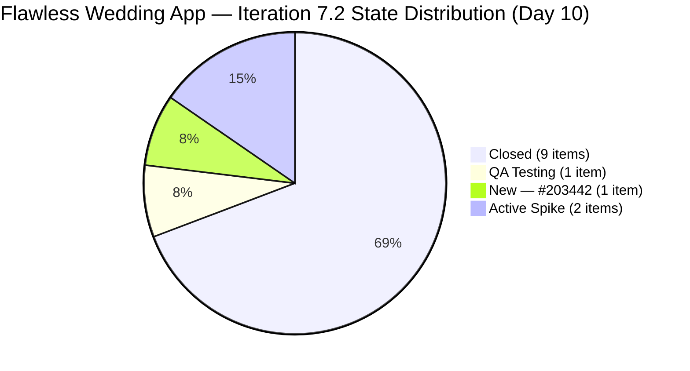
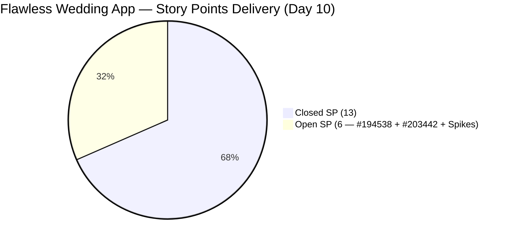

# ADO SAFe Iteration Audit — Flawless Wedding App Team

**Audit #42 | Iteration 7.2 (Apr 20 – May 3, 2026) | Day 10 of 14**

---

## 1. Audit Metadata

| Field | Value |
|---|---|
| **Audit Date** | April 29, 2026 — 02:04 UTC |
| **Auditor** | Claude Code (ADO SAFe Audit Agent) |
| **Workspace** | `ado_fl_dev` |
| **ADO Project** | Flawless Wedding App (`92b967dc-5ec7-4874-b8f5-e43b00d88339`) |
| **Team** | Flawless Wedding App Team (`7d90ecbf-d272-4b0c-b33b-c66d96a790ac`) |
| **Iteration** | Iteration 7.2 — Apr 20 to May 3, 2026 |
| **Iteration ID** | `8c08cc43-e1e8-4b0c-be84-4c81eaa860d5` |
| **Sprint Day** | Day 10 of 14 |
| **Prior Audit** | AUDIT_20260428_0902.md (Audit #41, 74.0 — Moderate Risk, PI7.2 Day 9) |
| **Scoring Model** | ADO SAFe v1 (7-dimension rubric) |
| **Overall Score** | **72.5 / 100** |
| **Risk Band** | **Moderate Risk** (60–79.9) |

> **Live ADO data confirmed.** 148 visible root backlog items in scope (Flawless Wedding App Team, `Microsoft.RequirementCategory`). 13 current iteration root items confirmed via `wit_get_work_items_for_iteration` (null-source roots, IterationPath = Iteration 7.2). Capacity and work item details confirmed via ADO batch APIs at 02:04 UTC April 29, 2026.

---

## 2. Executive Summary

The Flawless Wedding App Team holds at **72.5 / 100 — Moderate Risk** on Day 10 of Iteration 7.2, a **−1.5 change** from Audit #41 (74.0). The slight score decrease is driven by the addition of a new sprint item (#203442, 2 SP, New state) which increases committed SP without contributing to closures, partially offsetting the positive effect of #191079 closing.

**Key changes since Audit #41 (Apr 28, 09:02 UTC):**
- **#191079** ("[AND/Web] Vendor logged in after password change", 1 SP): **Closed** at 05:57 UTC Apr 29 — QA pass completed overnight
- **#203442** ("[Bride] Cannot pay initial – invalid date and missing invoice", 2 SP): **New item added** to Iteration 7.2 at 05:44 UTC Apr 29 — a new defect discovered today
- **#202827** (Spike, 1 SP) and **#202873** (Spike, 1 SP): both updated at 07:18 UTC Apr 29 — ceremony participation logged
- **#203131** (PI7-root Defect): updated at 07:22 UTC Apr 29 — still unscoped

**Current sprint position:** 13 SP closed of 19 committed (68.4%). Two items remain open in the QA cycle: **#194538** (QA Testing, 2 SP) and the newly added **#203442** (New, 2 SP). The Spikes (#202827, #202873) are Active with 1 SP each.

If #194538 and #203442 both close before May 3, D7 reaches **84.2** and the overall score rises to approximately **77.7** — still Moderate Risk. To reach Low Risk (80), the team would also need to resolve the D5 structural issue (no User Stories), which cannot be changed mid-sprint.

---

## 3. Previous Audit Delta

| Dimension | Audit #41 (Apr 28, 09:02) | Audit #42 (Apr 29, 02:04) | Delta | Driver |
|---|---|---|---|---|
| Iteration Planning | 8.1 | **8.8** | **+0.7** | Sprint items grew from 12 to 13 (#203442 added); backlog stable at 148 |
| Team Capacity | 100.0 | 100.0 | 0.0 | Unchanged |
| Estimation | 100.0 | 100.0 | 0.0 | All 13 items estimated |
| DoR Compliance | 100.0 | 100.0 | 0.0 | #203442 passes DoR |
| Work Item Balance | 30.0 | 30.0 | 0.0 | Still 0 User Stories; Defect dominant |
| Backlog Refinement | 100.0 | 100.0 | 0.0 | All 13 current items fresh; 0 untouched |
| Delivery Predictability | 80.0 | **68.4** | **−11.6** | #203442 added (2 SP committed); #191079 closed (+1 SP); net: committed +2, closed +1 → rate drops |
| **Overall** | **74.0** | **72.5** | **−1.5** | New item addition increases denominator faster than numerator |

**ADO changes detected since Audit #41 (09:02 UTC Apr 28):**
- **#191079** ("[AND/Web] Vendor logged in after password change", 1 SP): Ready for QA → **Closed** at 05:57 UTC Apr 29
- **#203442** ("[Bride] Cannot pay initial – invalid date and missing invoice", 2 SP): **New item created** and added to Iteration 7.2 at 05:44 UTC Apr 29
- **#202827** (Collaborations Spike, 1 SP): Active → Active; updated at 07:18 UTC Apr 29
- **#202873** (Backlog CleanUp Spike, 1 SP): Active → Active; updated at 07:18 UTC Apr 29
- **#203131** (Service Islands Defect, PI7-root): updated at 07:22 UTC Apr 29 (still unscoped)
- **#202723** (Closed Defect): comment added at 06:35 UTC Apr 29 (no state change)

### Score Trajectory — Iteration 7.2 Series

| Audit # | Date | Score | Band | Sprint Day |
|---|---|---|---|---|
| #32 | Apr 20 (Day 1) | 59.6 | High | 7.2 D1 |
| #35 | Apr 23 (Day 4) | 58.4 | High | 7.2 D4 |
| #36 | Apr 24 (Day 5) | 69.5 | Moderate | 7.2 D5 |
| #39–40 | Apr 26 (Day 7–8) | 70.2 | Moderate | 7.2 D7–8 |
| #41 | Apr 28 (Day 9) | 74.0 | Moderate | 7.2 D9 |
| **#42** | **Apr 29 (Day 10)** | **72.5** | **Moderate** | **7.2 D10** |

Minor score decrease due to new item addition expanding the commitment denominator. The team remains in Moderate Risk and is tracking toward a strong sprint close if open QA items resolve.

---

## 4. Current Iteration Snapshot

| Metric | Value |
|---|---|
| **Visible root backlog items** | 148 |
| **Current iteration root items (Iter 7.2)** | 13 |
| **Committed story points** | 19 SP |
| **Closed story points** | 13 SP |
| **Remaining open SP** | 6 SP |
| **Sprint progress** | Day 10 of 14 (71% elapsed) |
| **SP delivery rate** | 13 SP / 10 days = 1.3 SP/day |
| **SP needed per remaining day** | 6 SP / 4 days = 1.5 SP/day (achievable) |
| **Capacity per day** | Luke 6 (Dev) + Ressa 6 (QA) + Luzmibel 1 (QA) + Ike 1 (Dev) = 14 hrs/day |
| **Days off this sprint** | 1 (Ressa Apr 20, elapsed) |
| **Active contributors** | Luke Abram Colina (Dev), Ressa Paracuelles (QA/Spike) |

### State Distribution — Current Iteration Root Items (13 items)

| State | Count | SP | Items |
|---|---|---|---|
| Closed | 9 | 13 | #190892, #191079, #200791, #201326, #202072, #202119, #202569, #202723, #203230 |
| QA Testing | 1 | 2 | #194538 |
| New | 1 | 2 | #203442 |
| Active (Spike) | 2 | 2 | #202827, #202873 |
| **Total** | **13** | **19** | |

---

## 5. Work Item Analysis

### Current Iteration Root Items — Full Detail

| ID | Title | Type | State | SP | DoR | AssignedTo | Changed |
|---|---|---|---|---|---|---|---|
| 190892 | [Admin] Coupons — blank table on Expiry Date sort | Defect | **Closed** | 1 | PASS | Luke Colina | Apr 24 |
| 191079 | [AND/Web] Vendor logged in after password change | Defect | **Closed** | 1 | PASS | Luke Colina | **Apr 29** |
| 200791 | [Web][Vendor] Incorrect date and total incl. tax | Defect | **Closed** | 2 | PASS | Luke Colina | Apr 28 |
| 201326 | [Mobile] Vendor in prior category after update | Defect | **Closed** | 1 | PASS | Luke Colina | Apr 24 |
| 202072 | [Vendor] Inconsistent error on login/dashboard | Defect | **Closed** | 2 | PASS | Luke Colina | Apr 23 |
| 202119 | [Web][Vendor] Blank dashboard on first login | Defect | **Closed** | 2 | PASS | Luke Colina | Apr 23 |
| 202569 | [Bride] Incorrect message view via vendor notif | Defect | **Closed** | 1 | PASS | Luke Colina | Apr 23 |
| 202723 | [Web][Vendor] Incorrect subtotal on revision | Defect | **Closed** | 2 | PASS | Luke Colina | Apr 29 |
| 203230 | [Vendor] Users unable to login — marked deleted | Defect | **Closed** | 1 | PASS | Luke Colina | Apr 24 |
| 194538 | [iOS/AND][Bride] Initial payment button incorrectly marked | Defect | **QA Testing** | 2 | PASS | Luke Colina | Apr 28 |
| 203442 | [Bride] Cannot pay initial – invalid date and missing invoice | Defect | **New** | 2 | PASS | Luke Colina | **Apr 29** |
| 202827 | Iteration 7.2 – Collaborations, Reports & Others | Spike | Active | 1 | PASS | Ressa Paracuelles | **Apr 29** |
| 202873 | [Retro] Flawless Backlog CleanUp Iteration 7.2 | Spike | Active | 1 | PASS | Ressa Paracuelles | **Apr 29** |

### New Item — #203442 DoR Assessment

- **Description**: "When a bride tries to sign a contract and pay the initial payment, the app shows an invalid date, no invoices, and a total amount of 0, preventing payment." — 43 non-whitespace chars. **PASS (≥30)**
- **Acceptance Criteria**: 3 criteria: valid dates, invoice with correct total, user can pay initial amount. **PASS (≥20)**
- **DoR: PASS** — item added same day with documentation

### Items in Iteration View but Excluded from Scoring

| ID | Title | Type | IterPath | Reason |
|---|---|---|---|---|
| 203267 | Unified Web & Mobile Platform Update | Enabler | Iter 7.3 | Not current iteration |
| 203131 | [Vendor] Service Islands dropdown on token expiry | Defect | PI7-root | Not iteration-scoped |

### Contract / Payment Defect Cluster — Status

| Item | Title | SP | State | Notes |
|---|---|---|---|---|
| #200791 | Incorrect date + total incl. tax | 2 | Closed | Resolved Apr 28 |
| #202723 | Incorrect subtotal on revision | 2 | Closed | Resolved Apr 28 |
| #194538 | Initial payment button after error | 2 | QA Testing | 3rd QA cycle — active test |
| **#203442** | **Cannot pay initial — invalid date + missing invoice** | **2** | **New** | **New related defect, added Apr 29** |

The newly added #203442 is a related defect in the same payment flow cluster. It was likely surfaced during QA testing of #194538. Luke should investigate whether these two defects share a root cause, as fixing #194538 may resolve #203442 simultaneously.

---

## 6. SAFe Compliance Scorecard

| Dimension | Score | Evidence | Notes |
|---|---|---|---|
| D1 Iteration Planning | 8.8 | 13 / 148 items in sprint | Large legacy backlog dilutes D1; #203442 added (+1 item); Ressa's CleanUp Spike ongoing |
| D2 Team Capacity | 100.0 | 2 / 2 active contributors with capacity | Luke (Dev 6/day), Ressa (QA 6/day); Luzmibel + Ike configured |
| D3 Estimation | 100.0 | 13 / 13 point-eligible items estimated | All items including Spikes have SP > 0 |
| D4 DoR Compliance | 100.0 | 13 / 13 sprint items pass DoR | #203442 passes with Desc + AC added at creation |
| D5 Work Item Balance | 30.0 | No User Story (-40) + dominant type >60% (-30) | 11 Defects + 2 Spikes; 0 User Stories |
| D6 Backlog Refinement | 100.0 | All 13 current items fresh; 0 untouched | All items changed Apr 20 or later |
| D7 Delivery Predictability | 68.4 | 13 / 19 SP closed | 9 Defects closed (13 SP); #194538 and #203442 open (4 SP); Spikes active (2 SP) |
| **Overall** | **72.5** | **(8.8+100+100+100+30+100+68.4)/7** | **Moderate Risk** |

---

## 7. Dimension Findings

### D1 — Iteration Planning (8.8 — slight improvement from 8.1)

The sprint now has 13 items (added #203442) from a visible backlog of 148. D1 improves marginally as the sprint-item count grows relative to the backlog. Ressa's CleanUp Spike (#202873) remains active and is working to reduce the backlog. The long-term target is reducing to 60–80 items.

**#203131** (Service Islands token expiry Defect) was updated today at 07:22 UTC — still in PI7-root. This valid defect should be scoped to Iteration 7.3. **#203267** (Unified Platform Enabler) is correctly assigned to Iteration 7.3.

### D2 — Team Capacity (100.0)

Luke and Ressa are actively delivering with full capacity. Luzmibel Paculanang (1 hr/day QA) and Ike Yana (1 hr/day Dev) have capacity configured. With #203442 newly added, Luzmibel could assist with QA validation if Ressa's throughput becomes a bottleneck on the two open QA items.

### D3 — Estimation (100.0)

All 13 items carry Story Points. Including Spikes (#202827 and #202873, both SP=1) and the new defect (#203442, SP=2). Estimation hygiene fully maintained.

### D4 — DoR Compliance (100.0)

All 13 sprint items pass DoR. Notably, **#203442** was added today with a clear description and 3-criterion acceptance criteria — demonstrating that the team has internalized DoR discipline and applies it at item creation, not as a post-hoc requirement.

### D5 — Work Item Balance (30.0)

Eleven Defects (84.6% dominant type) and 2 Spikes. Zero User Stories. The -40 penalty (no User Story) and -30 penalty (dominant type >60%) both apply. This is a structurally determined score for a defect-resolution sprint. The team's deliberate choice to stabilize quality before feature development is valid in SAFe terms, but the score penalty is locked for this sprint. Including at least one User Story in Iteration 7.3 would raise D5 to at least 60.0.

### D6 — Backlog Refinement (100.0)

All 13 current iteration items were changed on or after April 20 (sprint start). No untouched items. The Spikes were both updated today at 07:18 UTC (ceremony activity logged). Ressa's CleanUp Spike is contributing to backlog hygiene. Score remains 100.0 with no penalties.

**Evidence gap note:** The full 148-item backlog's ChangedDates were not individually fetched. Backlog Refinement for items outside the current sprint is carried from the prior audit (100.0 confirmed for sprint items; older items assumed stable). This is noted as an evidence gap.

### D7 — Delivery Predictability (68.4 — decreased from 80.0)

The paradox of today's audit: a new closure (#191079, 1 SP) was offset by adding a new 2 SP item (#203442), resulting in a net decrease in D7 from 80.0 to 68.4.

**Current position:** 13 SP closed out of 19 committed.

**Remaining open items:**
- **#194538** (2 SP, QA Testing): Third QA cycle in progress since Apr 28. Luke last updated Apr 28 — Ressa is actively testing. This is the most critical path item.
- **#203442** (2 SP, New): Newly surfaced defect. Luke needs to investigate; likely related to #194538 (same payment flow). Root cause analysis may allow combined fix.
- **#202827** + **#202873** (2 SP combined, Active Spikes): Ceremony and CleanUp activities — likely to remain Active through sprint close.

**Projected final D7 scenarios:**
- If #194538 + #203442 both close (4 SP more): D7 = 17/19 = 89.5 → Overall ≈ 76.1
- If only #194538 closes (2 SP more): D7 = 15/19 = 78.9 → Overall ≈ 74.0
- If Spikes also close (unlikely mid-sprint): D7 = 19/19 = 100.0 → Overall ≈ 81.3 (Low Risk)

The realistic target is closing #194538 and #203442 (89.5 D7) for an overall of ~76. Low Risk requires D5 improvement or Spike closures, which are structurally constrained this sprint.

---

## 8. Risks and Bottlenecks

| Risk | Severity | Status |
|---|---|---|
| #194538 on third QA cycle — recurring regression risk | High | Active; Ressa in QA Testing since Apr 28 |
| #203442 new defect in same payment flow cluster | High | New; Luke needs to investigate root cause today |
| Shared root cause risk: #194538 + #203442 may be connected | High | Luke should assess before fixing separately |
| Zero User Stories in sprint — D5 structurally capped at 30.0 | High | Intentional defect sprint; cannot resolve mid-sprint |
| Large legacy backlog (148 items) — D1 ceiling at ~8–9 | Moderate | CleanUp Spike ongoing; multi-sprint effort |
| #203131 unscoped (Service Islands token expiry) | Low | Updated today; should be scoped to Iter 7.3 |

---

## 9. Prioritized Recommendations

1. **[Today — Critical] Investigate root cause of #194538 + #203442 together** — Both defects are in the same payment initiation flow. The "invalid date" and "missing invoice" in #203442 may share the same underlying cause as the "initial payment button marked complete after error" in #194538. A combined fix is more efficient and reduces risk of a third related defect surfacing.
2. **[Today] Complete QA on #194538** — This is the third QA cycle. Ressa should prioritize completing the test pass today. If it fails again, escalate for a more thorough code review by Luke.
3. **[Today] Begin development on #203442** — Luke should pick this up immediately after confirming or completing the #194538 fix. If root causes are shared, a single fix may close both.
4. **[Before sprint close] Scope #203131 to Iteration 7.3** — "[Vendor] Service Islands dropdown not populated after authentication token expiration" was updated today and is a valid ready defect. Assigning it to 7.3 starts the next sprint with a scoped backlog item.
5. **[PI 8 planning] Introduce at least one User Story in Iter 7.3** — The Work Item Balance score (30.0) will remain capped until a User Story is included. Even one User Story brings D5 to at least 60.0. Consider a small feature story alongside defect work.
6. **[Ongoing] Continue CleanUp Spike (#202873)** — Every item removed from the 148-item backlog improves future D1 scores. Target: reduce to 130 items by end of Iteration 7.2.

---

## 10. Evidence Gaps and Limitations

| Gap | Impact | Mitigation |
|---|---|---|
| Full backlog of 148 items — ChangedDates not individually fetched | Backlog Refinement for non-sprint items unverified | D6 score carried from prior audit (100.0); all 13 current items confirmed fresh by direct inspection |
| #194538 QA Testing — outcome unknown at time of audit | D7 = 68.4 correctly reflects current state; will improve on next closure | Monitor; alert if QA fails again |
| Spike SP inclusion: #202827 and #202873 now have SP=1 each (prior audit stated no SP) | Spikes included in point_eligible count; committed SP now 19 (vs. 15 in prior audit) | ADO field confirmed via batch API; scoring updated accordingly |
| #203442 root cause unknown — may share fix with #194538 | D7 denominator may artificially inflate if both close with single fix | Noted; scoring uses current committed SP regardless of fix method |
