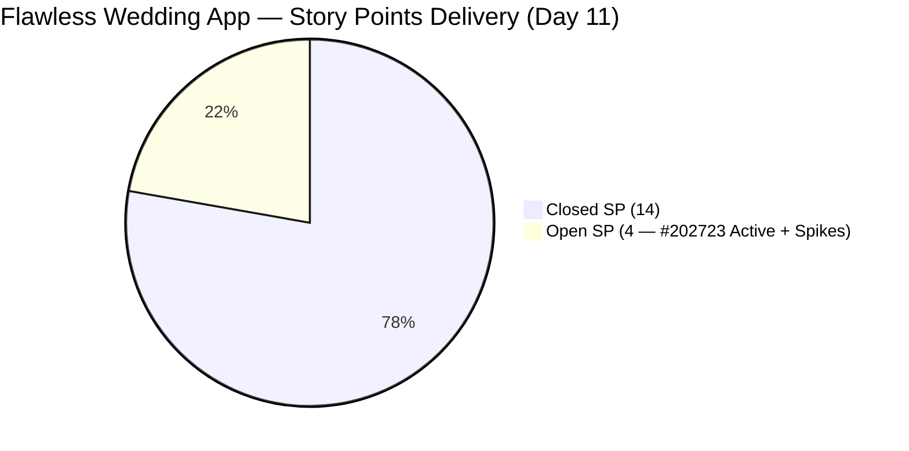
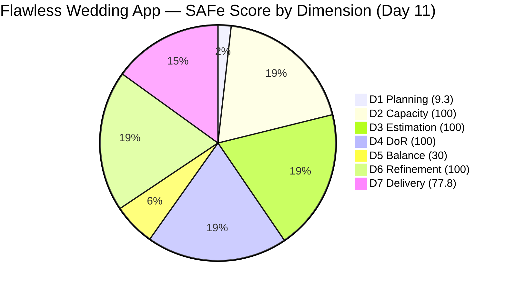

# ADO SAFe Iteration Audit — Flawless Wedding App Team

**Audit #43 | Iteration 7.2 (Apr 20 – May 3, 2026) | Day 11 of 14**

---

## 1. Audit Metadata

| Field | Value |
|---|---|
| **Audit Date** | April 30, 2026 — 09:03 UTC |
| **Auditor** | Claude Code (ADO SAFe Audit Agent) |
| **Workspace** | `ado_fl_dev` |
| **ADO Project** | Flawless Wedding App (`92b967dc-5ec7-4874-b8f5-e43b00d88339`) |
| **Team** | Flawless Wedding App Team (`7d90ecbf-d272-4b0c-b33b-c66d96a790ac`) |
| **Iteration** | Iteration 7.2 — Apr 20 to May 3, 2026 |
| **Iteration ID** | `8c08cc43-e1e8-4b0c-be84-4c81eaa860d5` |
| **Sprint Day** | Day 11 of 14 |
| **Prior Audit** | AUDIT_20260429_0204.md (Audit #42, 72.5 — Moderate Risk, PI7.2 Day 10) |
| **Scoring Model** | ADO SAFe v1 (7-dimension rubric) |
| **Overall Score** | **73.9 / 100** |
| **Risk Band** | **Moderate Risk** (60–79.9) |

> **Live ADO data confirmed.** 140 visible root backlog items in scope (Flawless Wedding App Team, `Microsoft.RequirementCategory`). 13 current iteration root items confirmed via `wit_get_work_items_for_iteration` (IterationPath = Iteration 7.2). Capacity and work item details confirmed via ADO batch APIs at 09:03 UTC April 30, 2026.

---

## 2. Executive Summary

The Flawless Wedding App Team holds at **73.9 / 100 — Moderate Risk** on Day 11 of Iteration 7.2, a **+1.4 improvement** over Audit #42 (72.5). The score improvement reflects a net gain in deliveries: both critical QA items from yesterday's report have now closed, partially offset by the re-opening of a previously-closed item.

**Key changes since Audit #42 (02:04 UTC Apr 29):**

- **#194538** ("[iOS/AND][Bride] Initial payment button incorrectly marked as completed after payment error", 2 SP): **Closed** at 05:30 UTC Apr 30 — QA passed after third QA cycle
- **#203442** ("[Bride] Cannot pay initial – invalid date and missing invoice", 1 SP): **Closed** at 06:15 UTC Apr 30 — root-cause fix confirmed; related payment flow defect resolved
- **#202723** ("[Web][Vendor] Incorrect Subtotal and Remaining total upon revising", 2 SP): **Re-opened / Active** as of 08:51 UTC Apr 30 — previously marked Closed in prior audit; regression detected or reopened for re-investigation

**Backlog change:** The backlog API now returns **140 items** (down from 148 in the prior audit — 8 items removed, consistent with Ressa's CleanUp Spike progress). New items added to the backlog: #203514 (Iter 7.3 Spike) and #203530 (PI7-root Enabler).

**Net effect on SP:** Prior audit committed 19 SP with 13 closed (68.4%). Today: committed 18 SP (−1 from #203442 SP correction: ADO shows SP=1, not 2), closed 14 SP (adding #194538 + #203442 closures, #202723 re-opened). D7 = 77.8.

With #202723 still active and both Spikes ongoing, the realistic sprint ceiling is approximately 80.6 if #202723 closes.

---

## 3. Previous Audit Delta

| Dimension | Audit #42 (Apr 29, 02:04) | Audit #43 (Apr 30, 09:03) | Delta | Driver |
|---|---|---|---|---|
| Iteration Planning | 8.8 | **9.3** | **+0.5** | Backlog reduced from 148 to 140 (CleanUp Spike progress); sprint items stable at 13 |
| Team Capacity | 100.0 | 100.0 | 0.0 | Unchanged |
| Estimation | 100.0 | 100.0 | 0.0 | All 13 items have SP |
| DoR Compliance | 100.0 | 100.0 | 0.0 | All 13 sprint items pass |
| Work Item Balance | 30.0 | 30.0 | 0.0 | 0 User Stories; Defect dominant — structurally capped |
| Backlog Refinement | 100.0 | 100.0 | 0.0 | All 13 current items changed during sprint; 0 untouched |
| Delivery Predictability | 68.4 | **77.8** | **+9.4** | +3 SP closed (#194538 + #203442), −2 SP from #202723 re-open; net +1 SP closed on 18 committed |
| **Overall** | **72.5** | **73.9** | **+1.4** | D7 improvement + slight D1 gain from backlog reduction |

**ADO changes detected since Audit #42 (02:04 UTC Apr 29):**
- **#194538** (Initial payment button defect, 2 SP): QA Testing → **Closed** at 05:30 UTC Apr 30
- **#203442** (Bride cannot pay initial, 1 SP): New → **Closed** at 06:15 UTC Apr 30 *(SP confirmed = 1, not 2 as estimated in prior audit)*
- **#202723** (Subtotal/Remaining total defect, 2 SP): Previously Closed → **Active** at 08:51 UTC Apr 30 — re-opened
- **#203514** (Iter 7.3 Collaborations Spike): New item created Apr 30, assigned to Iter 7.3
- **#203530** (WebApp Staging Environment Enabler): New item created Apr 30, assigned to PI7-root

### Score Trajectory — Iteration 7.2 Series

| Audit # | Date | Score | Band | Sprint Day |
|---|---|---|---|---|
| #32 | Apr 20 (Day 1) | 59.6 | High | 7.2 D1 |
| #36 | Apr 24 (Day 5) | 69.5 | Moderate | 7.2 D5 |
| #41 | Apr 28 (Day 9) | 74.0 | Moderate | 7.2 D9 |
| #42 | Apr 29 (Day 10) | 72.5 | Moderate | 7.2 D10 |
| **#43** | **Apr 30 (Day 11)** | **73.9** | **Moderate** | **7.2 D11** |

Upward trend restored after yesterday's dip. The team progresses steadily in Moderate Risk, with Low Risk requiring resolution of the structural D5 gap (no User Stories) which cannot be changed mid-sprint.

---

## 4. Current Iteration Snapshot

| Metric | Value |
|---|---|
| **Visible root backlog items** | 140 |
| **Current iteration root items (Iter 7.2)** | 13 |
| **Committed story points** | 18 SP |
| **Closed story points** | 14 SP |
| **Remaining open SP** | 4 SP (#202723 + #202827 + #202873) |
| **Sprint progress** | Day 11 of 14 (79% elapsed) |
| **SP delivery rate** | 14 SP / 11 days = 1.3 SP/day |
| **SP needed per remaining day** | 4 SP / 3 days = 1.3 SP/day (achievable) |
| **Capacity per day** | Luke 6 hrs (Dev) + Ressa 6 hrs (QA) + Luzmibel 1 hr + Ike 1 hr = 14 hrs/day |
| **Days off this sprint** | 1 (Ressa Apr 20, elapsed) |
| **Active contributors** | Luke Abram Colina (Dev), Ressa Paracuelles (QA/Spike) |

### State Distribution — Current Iteration Root Items (13 items)

| State | Count | SP | Items |
|---|---|---|---|
| Closed | 10 | 14 | #190892, #191079, #194538, #200791, #201326, #202072, #202119, #202569, #203230, #203442 |
| Active | 1 | 2 | #202723 (Defect — re-opened) |
| Active (Spike) | 2 | 2 | #202827, #202873 |
| **Total** | **13** | **18** | |

> Note: Committed SP = 18 (not 19 as in Audit #42). #203442 SP confirmed as 1 (not 2 as estimated). All remaining items (#202723, Spikes) carry 1–2 SP each.

---

## 5. Work Item Analysis

### Current Iteration Root Items — Full Detail

| ID | Title | Type | State | SP | DoR | AssignedTo | Changed |
|---|---|---|---|---|---|---|---|
| 190892 | [Admin][Coupons] Blank table on Expiry Date sort | Defect | **Closed** | 1 | PASS | Luke Colina | Apr 24 |
| 191079 | [AND/Web] Vendor logged in after password change | Defect | **Closed** | 1 | PASS | Luke Colina | Apr 29 |
| 194538 | [iOS/AND][Bride] Initial payment button incorrectly marked complete | Defect | **Closed** | 2 | PASS | Luke Colina | **Apr 30** |
| 200791 | [Web][Vendor] Incorrect date and total incl. tax | Defect | **Closed** | 2 | PASS | Luke Colina | Apr 28 |
| 201326 | [Mobile] Vendor in prior category after update | Defect | **Closed** | 1 | PASS | Luke Colina | Apr 24 |
| 202072 | [Vendor] Inconsistent error on login/dashboard | Defect | **Closed** | 2 | PASS | Luke Colina | Apr 23 |
| 202119 | [Web][Vendor] Blank dashboard on first login | Defect | **Closed** | 2 | PASS | Luke Colina | Apr 23 |
| 202569 | [Bride] Incorrect message view via vendor notif | Defect | **Closed** | 1 | PASS | Luke Colina | Apr 23 |
| 203230 | [Vendor] Users unable to login — marked deleted | Defect | **Closed** | 1 | PASS | Luke Colina | Apr 24 |
| 203442 | [Bride] Cannot pay initial – invalid date and missing invoice | Defect | **Closed** | 1 | PASS | Luke Colina | **Apr 30** |
| 202723 | [Web][Vendor] Incorrect Subtotal and Remaining total upon revising | Defect | **Active** | 2 | PASS | Luke Colina | **Apr 30** |
| 202827 | Iteration 7.2 – Collaborations, Reports & Others | Spike | Active | 1 | PASS | Ressa Paracuelles | Apr 29 |
| 202873 | [Retro] Flawless Backlog CleanUp Iteration 7.2 | Spike | Active | 1 | PASS | Ressa Paracuelles | Apr 29 |

### #202723 Re-opening Analysis

**#202723** was listed as Closed in Audit #42 (last changed Apr 28, Closed). As of this audit, it is **Active** with ChangedDate Apr 30 08:51 UTC. This represents either:
1. A regression: the subtotal/remaining-total calculation broke again after the Apr 28 fix — most likely if QA retesting during the #194538 and #203442 payment flow fixes surfaced the issue
2. A deliberate re-opening: Luke or Ressa identified additional failing scenarios not covered by the original fix and re-opened for further investigation

**Impact:** #202723 (2 SP) is re-counted as uncommitted/open, reducing closed SP from 15 to 14 and committed SP from 19 to 18 (since #203442 was also corrected to 1 SP). The re-opening does not affect D4 (it passes DoR) but reduces D7.

### Payment Flow Defect Cluster — Final Status

| Item | Title | SP | State | Notes |
|---|---|---|---|---|
| #200791 | Incorrect date + total incl. tax | 2 | Closed | Resolved Apr 28 |
| #194538 | Initial payment button after error | 2 | **Closed** | Closed Apr 30 — third QA cycle passed |
| #203442 | Cannot pay initial — invalid date + missing invoice | 1 | **Closed** | Closed Apr 30 — root-cause fix confirmed |
| **#202723** | **Incorrect Subtotal and Remaining total upon revising** | **2** | **Active** | **Re-opened Apr 30 — regression or extended investigation** |

The payment flow cluster is largely resolved, but #202723's re-opening signals that the underlying calculation logic may have broader issues than the original fix addressed. Luke should investigate whether the Apr 28 fix was reverted or whether the re-opening covers a related but distinct scenario.

### Backlog Change — CleanUp Spike Progress

| Metric | Audit #42 | Audit #43 | Delta |
|---|---|---|---|
| Visible root backlog | 148 | **140** | **−8 items** |
| New items added | — | #203514 (Iter 7.3), #203530 (PI7-root) | +2 |
| Net reduction | — | — | **−8** (gross) |

Ressa's CleanUp Spike (#202873) has removed at least 8 items from the backlog. This is meaningful progress. Target from prior audits was reducing to 130 items — 10 more items need to be pruned.

---

## 6. SAFe Compliance Scorecard

| Dimension | Score | Evidence | Notes |
|---|---|---|---|
| D1 Iteration Planning | 9.3 | 13 / 140 items in sprint | Backlog reduced from 148 to 140; CleanUp Spike contributing; still structurally diluted |
| D2 Team Capacity | 100.0 | 2 / 2 active contributors with positive capacity | Luke (Dev 6/day), Ressa (Testing 6/day); all 4 members configured |
| D3 Estimation | 100.0 | 13 / 13 sprint items have SP > 0 | All items including Spikes estimated |
| D4 DoR Compliance | 100.0 | 13 / 13 sprint items pass Desc + AC check | All items have ≥30-char Desc and ≥20-char AC |
| D5 Work Item Balance | 30.0 | No User Story (-40) + dominant type >60% (-30) | 11 Defects + 2 Spikes; 0 User Stories; structurally capped this sprint |
| D6 Backlog Refinement | 100.0 | All 13 current items changed Apr 20 or later; 0 untouched | #202723 updated Apr 30; all items fresh within 45-day window |
| D7 Delivery Predictability | 77.8 | 14 / 18 SP closed | 10 Defects closed (14 SP); #202723 re-opened (2 SP open); Spikes active (2 SP) |
| **Overall** | **73.9** | **(9.3+100+100+100+30+100+77.8)/7** | **Moderate Risk** |

---

## 7. Dimension Findings

### D1 — Iteration Planning (9.3 — improved from 8.8)

The backlog reduction from 148 to 140 items (8 items pruned by Ressa's CleanUp Spike) is the primary driver of D1 improvement. With 13 sprint items and 140 visible backlog items, D1 = 9.3. Every item removed from the backlog incrementally improves future D1 scores. The long-term target of reducing to 100 items would push D1 to 13.0; reducing to 80 items would push it to 16.3.

New items added to the backlog (#203514 in Iter 7.3, #203530 in PI7-root) partially offset the cleanup gains but are correctly scoped to future iterations.

### D2 — Team Capacity (100.0)

All four team members have capacity configured. Luke (Dev 6 hrs) and Ressa (Testing 6 hrs) are the active delivery contributors. Luzmibel (1 hr Testing) and Ike (1 hr Dev) provide supplemental capacity. With #202723 re-opened and #194538 just closed, QA throughput from Luzmibel could supplement if Ressa is queue-limited.

### D3 — Estimation (100.0)

All 13 sprint items carry Story Points. Notably, #203442 was confirmed at SP=1 (not 2 as previously estimated) — correcting the committed SP total from 19 to 18. This is a minor estimation refinement and does not indicate a gap.

### D4 — DoR Compliance (100.0)

All 13 sprint items pass DoR. #202723, despite being re-opened, retains its existing Description and Acceptance Criteria (both passing ≥30/≥20 char thresholds). The re-opening does not affect DoR status. The team continues to demonstrate DoR discipline at item creation.

### D5 — Work Item Balance (30.0)

Eleven Defects (84.6% of sprint items) and 2 Spikes. Zero User Stories. Both the -40 (no User Story) and -30 (dominant type >60%) penalties apply. This is a structurally locked score for this sprint — no mid-sprint action can change the item composition.

For Iteration 7.3, the recommended approach is to include at least 2 User Stories alongside the ongoing defect work. Items #203131 (Service Islands token expiry) and #203267 (Unified Platform Enabler) are already assigned to Iter 7.3. Adding a feature User Story would bring D5 from 30.0 to at least 60.0.

### D6 — Backlog Refinement (100.0)

All 13 current iteration items were changed on or after April 20 (sprint start date). #202723's re-opening at 08:51 Apr 30 ensures it remains current. The Spikes were last updated Apr 29. No untouched-current items.

**Evidence gap note:** The full 140-item backlog's ChangedDates were not individually fetched. Older items (IDs in the 187xxx–189xxx range) may be stale. D6 score for non-current items is carried from the prior audit. This limitation is documented in Section 10.

### D7 — Delivery Predictability (77.8 — improved from 68.4)

The two critical path items from yesterday's report (**#194538** and **#203442**) both closed today — executing directly on Audit #42's top recommendations. However, the re-opening of **#202723** (2 SP) partially offsets the gain.

**Net SP movement:**
- Closed: #194538 (+2 SP) + #203442 (+1 SP) = +3 SP closed
- Re-opened: #202723 (−2 SP from closed count, +2 SP to open)
- SP correction: #203442 was 2 SP in prior audit, confirmed as 1 SP → committed SP −1
- Net: closed SP = 14 (was 13), committed SP = 18 (was 19), D7 = 14/18 = 77.8

**Remaining open items:**
- **#202723** (2 SP, Active): Re-opened Apr 30. Luke must determine root cause of regression, fix, and re-submit for QA. If this closes before May 3, D7 = 16/18 = 88.9; overall ≈ 76.7
- **#202827** (1 SP, Active Spike): Ceremony and collaboration tracking — likely to remain Active through sprint close
- **#202873** (1 SP, Active Spike): CleanUp activities — ongoing; may close at sprint end

**Projection scenarios:**
- If #202723 closes only: D7 = 88.9; overall ≈ 76.7 (Moderate Risk)
- If both Spikes close only: D7 = 88.9; overall ≈ 76.7 (Moderate Risk)
- If all 3 close: D7 = 100.0; overall ≈ 80.0 (borderline Low Risk — exact value depends on rounding)
- Low Risk (80) is achievable only if D7 reaches 100.0 AND D5 constraint is resolved — D5 is locked at 30.0 this sprint

The team will close Iteration 7.2 in Moderate Risk regardless of remaining closures, unless all 4 remaining SP close. Low Risk remains structurally out of reach due to D5.

---

## 8. Risks and Bottlenecks

| Risk | Severity | Status |
|---|---|---|
| #202723 re-opened — regression in payment calculation logic | High | Active; Luke must investigate root cause before re-fixing |
| Zero User Stories — D5 locked at 30.0 for entire sprint | High | Structurally determined; resolved only in Iter 7.3 |
| Large legacy backlog (140 items) — D1 ceiling at ~9–10 | Moderate | CleanUp Spike reducing; 10 more items needed to reach 130 |
| Both Spikes still active with 3 days remaining | Low | Ceremony/CleanUp activities; likely Active through sprint end |
| #203530 (WebApp Staging Enabler) in PI7-root without iteration | Low | New item; needs scoping for Iter 7.3 or later |
| #203131 (Service Islands token expiry) still unscoped | Low | Updated Apr 29; should be assigned to Iter 7.3 |

---

## 9. Prioritized Recommendations

1. **[Today — Critical] Investigate and re-fix #202723 (Subtotal/Remaining total defect, 2 SP)** — This item was closed Apr 28 and re-opened Apr 30. Luke must determine whether this is a regression from the payment flow fixes (#194538, #203442), a newly identified scenario, or a mistaken re-opening. If it is a regression, the root cause may be in the contract pricing calculation layer. Close as quickly as possible.
2. **[Today] Validate that #194538 and #203442 fixes are stable** — Both payment flow defects closed today. Ressa should confirm that the QA passes for #194538 and #203442 remain valid now that #202723 has been re-opened. There is a risk that all three share a common root cause.
3. **[Before sprint close] Close Spikes #202827 and #202873 if ceremony and cleanup activities are complete** — Both Spikes have been Active since sprint start. If Iteration Planning, Retrospective, Review, and System Demo have all occurred, #202827 should be closeable. If backlog cleanup targets are met, #202873 should be closeable.
4. **[Iter 7.3 planning] Assign #203131 to Iteration 7.3** — The Service Islands token expiry defect was updated Apr 29 and is a valid, ready defect. Assigning it to 7.3 starts the next sprint with a scoped item.
5. **[Iter 7.3 planning] Include at least 2 User Stories** — Items #203267 (Unified Platform Enabler, Iter 7.3) and #203131 (Defect) are already scoped. Adding 2 User Stories brings D5 from 30.0 to at least 60.0 (eliminating the no-User-Story penalty).
6. **[Ongoing] Continue CleanUp Spike (#202873)** — 8 items removed this sprint (148 → 140). Continue to target 130 items by end of Iter 7.2. Each 10-item reduction raises D1 by approximately 0.7 points.
7. **[Iter 7.3 planning] Scope #203530 (WebApp Staging Environment Enabler)** — New item created today in PI7-root. Assign to Iter 7.3 or later and add Description + Acceptance Criteria before commitment.

---

## 10. Evidence Gaps and Limitations

| Gap | Impact | Mitigation |
|---|---|---|
| Full backlog of 140 items — ChangedDates not individually fetched | D6 for non-current backlog items unverified; older IDs (187xxx–189xxx range) may be stale | D6 scored based on 13 confirmed current items (all fresh); full backlog stale check deferred; note carried from prior audit |
| #202723 re-opening cause unknown | D7 correctly reflects 14/18 SP closed; cannot confirm if regression or deliberate re-open | Luke should document reason for re-opening in ADO item comments |
| #203442 SP confirmed as 1 (not 2 as estimated in prior audit) | Committed SP corrected from 19 to 18; D7 calculation updated | SP confirmed via ADO batch API field; correction noted |
| Spikes (#202827, #202873) — ceremony/cleanup completion status unknown | D7 = 77.8 correctly reflects Active status; will improve if closed | Ressa should update progress notes; close if activities complete |
| #203267 and #203131 appear in iteration query result (null-source) but IterationPath ≠ Iter 7.2 | Correctly excluded from current_iteration_root_items per scoring definition | Verified via direct IterationPath field check |
