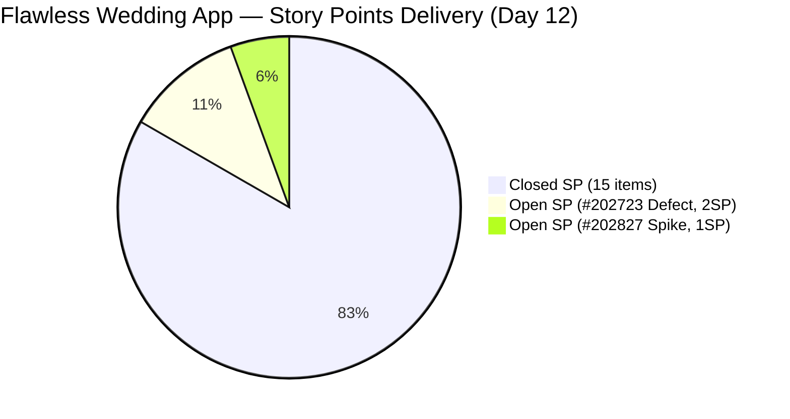
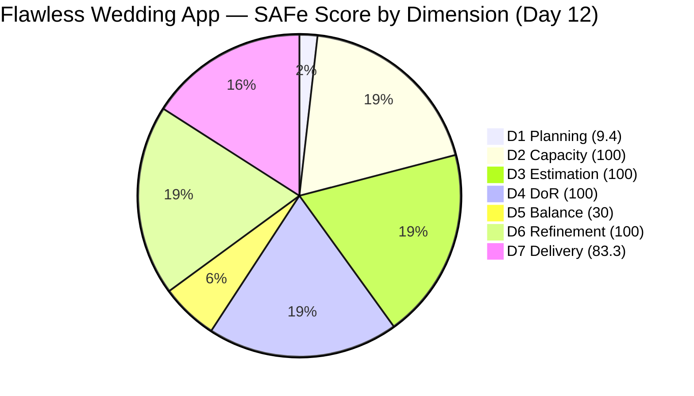

# ADO SAFe Iteration Audit — Flawless Wedding App Team

**Audit #44 | Iteration 7.2 (Apr 20 – May 3, 2026) | Day 12 of 14**

---

## 1. Audit Metadata

| Field | Value |
|---|---|
| **Audit Date** | May 1, 2026 — 09:03 UTC |
| **Auditor** | Claude Code (ADO SAFe Audit Agent) |
| **Workspace** | `ado_fl_dev` |
| **ADO Project** | Flawless Wedding App (`92b967dc-5ec7-4874-b8f5-e43b00d88339`) |
| **Team** | Flawless Wedding App Team (`7d90ecbf-d272-4b0c-b33b-c66d96a790ac`) |
| **Iteration** | Iteration 7.2 — Apr 20 to May 3, 2026 |
| **Iteration ID** | `8c08cc43-e1e8-4b0c-be84-4c81eaa860d5` |
| **Sprint Day** | Day 12 of 14 |
| **Prior Audit** | AUDIT_20260430_0903.md (Audit #43, 73.9 — Moderate Risk, PI7.2 Day 11) |
| **Scoring Model** | ADO SAFe v1 (7-dimension rubric) |
| **Overall Score** | **74.7 / 100** |
| **Risk Band** | **Moderate Risk** (60–79.9) |

> **Live ADO data confirmed.** 139 visible root backlog items in scope (Flawless Wedding App Team, `Microsoft.RequirementCategory`). 13 current iteration root items confirmed via `wit_get_work_items_for_iteration` (IterationPath = Iteration 7.2). Capacity and work item details confirmed via ADO batch APIs at 09:03 UTC May 1, 2026.

---

## 2. Executive Summary

The Flawless Wedding App Team improves to **74.7 / 100 — Moderate Risk** on Day 12 of Iteration 7.2, a **+0.8 improvement** over Audit #43 (73.9). The improvement is driven by two changes:

1. **#202873** ("[Retro] Flawless Backlog CleanUp Iteration 7.2", Spike, 1 SP): **Closed** at 09:06 UTC Apr 30 — Ressa's cleanup activities have concluded; this Spike exited the visible backlog, reducing the backlog count from 140 to 139.
2. **#202723** ("[Web][Vendor] Incorrect Subtotal and Remaining total (incl. tax) upon revising", Defect, 2 SP): Still **Active**, last changed **May 1, 04:21 UTC** — Luke is actively working on the fix today. This is the sprint's highest-priority remaining defect.

**Updated SP position:**
- Closed SP: 15 (added #202873 1 SP) of 18 committed = **83.3% delivery**
- Remaining: #202723 (2 SP Active) + #202827 (1 SP Active Spike)

With Low Risk requiring ~80+ overall, the team is blocked from Low Risk by the structurally locked D5 = 30.0 (no User Stories). However, the highest D7 achievable this sprint (closing all remaining items) = 100.0, bringing overall to approximately **80.0** — borderline Low Risk.

---

## 3. Previous Audit Delta

| Dimension | Audit #43 (Apr 30, 09:03) | Audit #44 (May 1, 09:03) | Delta | Driver |
|---|---|---|---|---|
| Iteration Planning | 9.3 | **9.4** | **+0.1** | Backlog reduced 140 → 139 (#202873 exited on close); 13 sprint items stable |
| Team Capacity | 100.0 | 100.0 | 0.0 | Unchanged |
| Estimation | 100.0 | 100.0 | 0.0 | All 13 items have SP |
| DoR Compliance | 100.0 | 100.0 | 0.0 | All 13 sprint items pass |
| Work Item Balance | 30.0 | 30.0 | 0.0 | 0 User Stories; Defect dominant — structurally locked |
| Backlog Refinement | 100.0 | 100.0 | 0.0 | All 13 current items fresh; #202723 updated May 1 |
| Delivery Predictability | 77.8 | **83.3** | **+5.5** | #202873 Closed (1 SP); closed SP rises from 14 to 15 of 18 |
| **Overall** | **73.9** | **74.7** | **+0.8** | D7 improvement + marginal D1 gain |

**ADO changes detected since Audit #43 (09:03 UTC Apr 30):**
- **#202873** ("[Retro] Flawless Backlog CleanUp Iteration 7.2", Spike, 1 SP): Active → **Closed** at 09:06 UTC Apr 30. Ressa completed the backlog cleanup and closed the Spike.
- **#202723** ("[Web][Vendor] Incorrect Subtotal", Defect, 2 SP): Still Active; updated **May 1, 04:21 UTC** — new tasks added (#203525, #203552 as child tasks based on hierarchy query). Active work confirmed.

### Score Trajectory — Iteration 7.2 Series

| Audit # | Date | Score | Band | Sprint Day |
|---|---|---|---|---|
| #32 | Apr 20 (Day 1) | 59.6 | High | 7.2 D1 |
| #36 | Apr 24 (Day 5) | 69.5 | Moderate | 7.2 D5 |
| #41 | Apr 28 (Day 9) | 74.0 | Moderate | 7.2 D9 |
| #42 | Apr 29 (Day 10) | 72.5 | Moderate | 7.2 D10 |
| #43 | Apr 30 (Day 11) | 73.9 | Moderate | 7.2 D11 |
| **#44** | **May 1 (Day 12)** | **74.7** | **Moderate** | **7.2 D12** |

Steady upward trend restored. The team will close Iteration 7.2 in Moderate Risk — Low Risk (80+) is only achievable if all remaining items close AND D5 is resolved, which is structurally locked this sprint.

---

## 4. Current Iteration Snapshot

| Metric | Value |
|---|---|
| **Visible root backlog items** | 139 |
| **Current iteration root items (Iter 7.2)** | 13 |
| **Committed story points** | 18 SP |
| **Closed story points** | 15 SP |
| **Remaining open SP** | 3 SP (#202723 + #202827) |
| **Sprint progress** | Day 12 of 14 (86% elapsed) |
| **SP delivery rate** | 15 SP / 12 days = 1.25 SP/day |
| **SP needed per remaining day** | 3 SP / 2 days = 1.5 SP/day (achievable) |
| **Capacity per day** | Luke 6 hrs (Dev) + Ressa 6 hrs (QA) + Luzmibel 1 hr + Ike 1 hr = 14 hrs/day |
| **Days off this sprint** | 1 (Ressa Apr 20, elapsed) |
| **Active contributors** | Luke Abram Colina (Dev — fixing #202723), Ressa Paracuelles (QA) |

### State Distribution — Current Iteration Root Items (13 items)

| State | Count | SP | Items |
|---|---|---|---|
| Closed | 11 | 15 | #190892, #191079, #194538, #200791, #201326, #202072, #202119, #202569, #202873, #203230, #203442 |
| Active (Defect) | 1 | 2 | #202723 (re-opened Apr 30; active work May 1) |
| Active (Spike) | 1 | 1 | #202827 |
| **Total** | **13** | **18** | |

---

## 5. Work Item Analysis

### Current Iteration Root Items — Full Detail

| ID | Title | Type | State | SP | DoR | AssignedTo | Changed |
|---|---|---|---|---|---|---|---|
| 190892 | [Admin][Coupons] Blank table on Expiry Date sort | Defect | **Closed** | 1 | PASS | Luke Colina | Apr 24 |
| 191079 | [AND/Web] Vendor logged in after password change | Defect | **Closed** | 1 | PASS | Luke Colina | Apr 29 |
| 194538 | [iOS/AND][Bride] Initial payment button incorrectly marked complete | Defect | **Closed** | 2 | PASS | Luke Colina | Apr 30 |
| 200791 | [Web][Vendor] Incorrect date and total incl. tax | Defect | **Closed** | 2 | PASS | Luke Colina | Apr 28 |
| 201326 | [Mobile] Vendor in prior category after update | Defect | **Closed** | 1 | PASS | Luke Colina | Apr 24 |
| 202072 | [Vendor] Inconsistent error on login/dashboard | Defect | **Closed** | 2 | PASS | Luke Colina | Apr 23 |
| 202119 | [Web][Vendor] Blank dashboard on first login | Defect | **Closed** | 2 | PASS | Luke Colina | Apr 23 |
| 202569 | [Bride] Incorrect message view via vendor notif | Defect | **Closed** | 1 | PASS | Luke Colina | Apr 23 |
| 203230 | [Vendor] Users unable to login — marked deleted | Defect | **Closed** | 1 | PASS | Luke Colina | Apr 24 |
| 203442 | [Bride] Cannot pay initial – invalid date and missing invoice | Defect | **Closed** | 1 | PASS | Luke Colina | Apr 30 |
| 202873 | [Retro] Flawless Backlog CleanUp Iteration 7.2 | Spike | **Closed** | 1 | PASS | Ressa Paracuelles | **Apr 30 (new)** |
| 202723 | [Web][Vendor] Incorrect Subtotal and Remaining total upon revising | Defect | **Active** | 2 | PASS | Luke Colina | **May 1** |
| 202827 | Iteration 7.2 – Collaborations, Reports & Others | Spike | Active | 1 | PASS | Ressa Paracuelles | Apr 29 |

**Note:** #203267 (Iter 7.3 Enabler) and #203131 (PI7-root Defect) appear in the iteration query result but have IterationPath ≠ Iter 7.2. They are correctly excluded from current_iteration_root_items per scoring definition.

### #202723 — Active Work Confirmed

#202723 ("[Web][Vendor] Incorrect Subtotal and Remaining total upon revising") was re-opened Apr 30 after being closed Apr 28. As of May 1, 04:21 UTC, Luke has updated the item. The iteration query shows new child tasks (#203525, #203552) added to this item, confirming active investigation and fix work.

This item is the sprint's critical path. If Luke can fix, QA can validate, and the item can be closed before May 3, D7 rises to 88.9 and overall to approximately 76.7.

### #202873 — Closed: Backlog CleanUp Complete

Ressa closed the CleanUp Spike at 09:06 UTC Apr 30. The Spike exited the visible backlog (reducing it from 140 to 139). Ressa's cleanup activities for Iteration 7.2 are officially complete.

**Cleanup progress across Iter 7.2:** The backlog was 148 items at sprint start (Audit #32, Apr 20). Current count: 139. Net reduction: 9 items. Ressa's target of reaching 130 items was not fully achieved, but the work has made measurable progress and the Spike is correctly closed.

### Payment Flow Defect Cluster — Final Status

| Item | Title | SP | State | Notes |
|---|---|---|---|---|
| #200791 | Incorrect date + total incl. tax | 2 | Closed | Resolved Apr 28 |
| #194538 | Initial payment button after error | 2 | Closed | Closed Apr 30 |
| #203442 | Cannot pay initial — invalid date + missing invoice | 1 | Closed | Closed Apr 30 |
| **#202723** | **Incorrect Subtotal and Remaining total upon revising** | **2** | **Active** | **Re-opened Apr 30; active fix underway May 1** |

Three of four payment flow defects are resolved. #202723 remains the outstanding item in this cluster. Luke's May 1 activity (new child tasks) suggests the root cause investigation is ongoing.

---

## 6. SAFe Compliance Scorecard

| Dimension | Score | Evidence | Notes |
|---|---|---|---|
| D1 Iteration Planning | 9.4 | 13 / 139 items in sprint | Backlog reduced 140 → 139 (#202873 exited on close); marginal improvement |
| D2 Team Capacity | 100.0 | 4 / 4 team members configured with positive capacity | Luke (Dev 6/day), Ressa (Testing 6/day), Luzmibel (Testing 1/day), Ike (Dev 1/day) |
| D3 Estimation | 100.0 | 13 / 13 sprint items have SP > 0 | All items including Spikes estimated |
| D4 DoR Compliance | 100.0 | 13 / 13 sprint items pass Desc + AC check | All items have ≥30-char Desc and ≥20-char AC |
| D5 Work Item Balance | 30.0 | No User Story (-40) + dominant type >60% (-30) | 11 Defects + 2 Spikes; 0 User Stories; structurally locked this sprint |
| D6 Backlog Refinement | 100.0 | All 13 current items changed Apr 20 or later; 0 untouched | #202723 updated May 1; #202827 updated Apr 29; all items fresh |
| D7 Delivery Predictability | 83.3 | 15 / 18 SP closed | #202873 closed (+1 SP); #202723 active (2 SP); #202827 active (1 SP) |
| **Overall** | **74.7** | **(9.4+100+100+100+30+100+83.3)/7** | **Moderate Risk** |

---

## 7. Dimension Findings

### D1 — Iteration Planning (9.4 — marginal improvement from 9.3)

The backlog count dropped by 1 item (#202873 exited on closure). With 13 sprint items and 139 visible backlog items, D1 = 9.4. Each item removed from the backlog incrementally improves future D1 scores. Continued cleanup in Iteration 7.3 (CleanUp Spike #203514 is already scheduled) will continue this progress.

Backlog reduction targets: 130 items → D1 = 10.0; 100 items → D1 = 13.0; 80 items → D1 = 16.3.

### D2 — Team Capacity (100.0 — unchanged)

All four team members have capacity configured. Luke (Dev 6 hrs) and Ressa (Testing 6 hrs) are the primary delivery contributors. Luzmibel (1 hr Testing) and Ike (1 hr Dev) provide supplemental capacity. With #202723 actively being fixed by Luke, QA throughput from Ressa and Luzmibel will be needed to validate the fix once submitted.

### D3 — Estimation (100.0 — unchanged)

All 13 sprint items carry Story Points. No estimation gaps introduced.

### D4 — DoR Compliance (100.0 — unchanged)

All 13 sprint items pass DoR. #202723, despite being re-opened, retains its existing Description and Acceptance Criteria. #202873 (now Closed) had passing DoR at sprint entry. The team continues to demonstrate DoR discipline.

### D5 — Work Item Balance (30.0 — unchanged, structurally locked)

Eleven Defects (84.6% of sprint items) and 2 Spikes. Zero User Stories. Both the -40 (no User Story) and -30 (dominant type >60%) penalties apply. This is a structurally locked score for this sprint — no mid-sprint action can change item composition.

For Iteration 7.3: the recommended approach is to include at least 2 User Stories alongside ongoing defect work. Items #203267 (Unified Platform Enabler, Iter 7.3) and #203131 (Defect) are already scoped. Adding 2 User Story items would bring D5 from 30.0 to at least 60.0.

### D6 — Backlog Refinement (100.0 — unchanged)

All 13 current iteration items were changed on or after April 20 (sprint start). #202723's May 1 update confirms active work; #202827 was last updated Apr 29. No untouched-current items exist. The full 139-item backlog's ChangedDates were not individually fetched — older items (187xxx–189xxx range) may be stale. This limitation is noted in Section 10.

### D7 — Delivery Predictability (83.3 — improved from 77.8)

The +5.5 improvement is driven by #202873's closure (1 SP). The team is now at 83.3% delivery — crossing the D7 threshold for Low Risk individually, though the overall score remains Moderate due to D5.

**Remaining open items:**
- **#202723** (2 SP, Active Defect): Luke is actively working (May 1, 04:21 update; new child tasks added). If this closes and QA passes before May 3, D7 = round(17/18 × 100, 1) = **94.4**; overall ≈ **76.3** (Moderate Risk — D5 ceiling).
- **#202827** (1 SP, Active Spike): Ressa's ceremony/collaboration tracking Spike. If this closes, D7 = round(16/18 × 100, 1) = **88.9**; if both close, D7 = **100.0**; overall ≈ **77.1** (Moderate Risk — D5 ceiling).

**Projection scenarios:**
- #202723 closes only: D7 = 94.4; overall ≈ 76.3 (Moderate)
- #202827 closes only: D7 = 88.9; overall ≈ 75.6 (Moderate)
- Both close: D7 = 100.0; overall ≈ 77.1 (Moderate)
- Low Risk (80) requires D5 > 30 — impossible this sprint

The sprint ceiling is approximately 77.1. Moderate Risk is the final outcome regardless of remaining closures.

---

## 8. Risks and Bottlenecks

| Risk | Severity | Status |
|---|---|---|
| #202723 (Subtotal/Remaining defect, 2 SP) — active regression in payment calculation logic | High | Luke actively working (May 1 update); fix not yet submitted for QA |
| Zero User Stories — D5 locked at 30.0 for entire sprint | High | Structurally determined; resolved only in Iter 7.3 |
| Large legacy backlog (139 items) — D1 ceiling at ~9–10 | Moderate | CleanUp Spike completed; new CleanUp Spike #203514 scheduled for Iter 7.3 |
| #202827 Collaborations Spike still Active — 3 days to close | Low | Ceremony and reporting activities; Ressa should close if all events complete |
| #203530 (WebApp Staging Enabler) in PI7-root — no Desc/AC | Low | New item; needs scoping and DoR for Iter 7.3+ |
| #203131 (Service Islands token expiry) in PI7-root | Low | Ready item; assign to Iter 7.3 |
| Sprint end May 3 = Sunday | Low | Confirm effective work window; Luke should target #202723 fix by May 2 |

---

## 9. Prioritized Recommendations

1. **[Today — Critical] Resolve and close #202723 (Subtotal/Remaining total defect, 2 SP)** — Luke is actively working (May 1, 04:21 update). The fix must be completed, submitted for QA, validated by Ressa, and closed before sprint end. If May 3 is a Sunday, the effective deadline is May 2. Closing this item brings D7 to 94.4 and overall to ~76.3.
2. **[Today] Validate #194538 and #203442 payment flow fixes remain stable** — #202723's regression risk extends to the related payment cluster. Ressa should confirm that the Apr 30 QA passes for #194538 and #203442 are unaffected by Luke's current #202723 investigation.
3. **[Before sprint close] Close #202827 (Collaborations Spike, 1 SP)** — If Iteration Planning, Retrospective, Review, System Demo, and Product Sync have all occurred, Ressa should close this Spike. Closing brings D7 to 88.9 (if #202723 remains Active) or 100.0 (if both close).
4. **[Iter 7.3 planning] Include at least 2 User Stories** — #203267 (Unified Platform Enabler) and #203131 (Service Islands Defect) are already scoped for Iter 7.3. Adding 2 User Stories brings D5 from 30.0 to at least 60.0 and significantly improves the overall score floor.
5. **[Iter 7.3 planning] Assign and document #203530 (WebApp Staging Enabler)** — New PI7-root item created Apr 30. Assign to Iter 7.3 or later and add Description + Acceptance Criteria before commitment.
6. **[Iter 7.3 planning] Continue backlog reduction** — CleanUp Spike #203514 is already in Iter 7.3. Target 130 items by end of Iter 7.3. Each 10-item reduction raises D1 by approximately 0.7 points.
7. **[Document regression root cause] Document #202723 re-opening reason** — Luke should add a comment explaining whether this is a regression from the #194538/#203442 payment flow fix, a newly identified scenario, or a previously missed edge case. This prevents recurrence in Iter 7.3.

---

## 10. Evidence Gaps and Limitations

| Gap | Impact | Mitigation |
|---|---|---|
| Full backlog of 139 items — ChangedDates not individually fetched | D6 for non-current backlog items unverified; older IDs (187xxx–188xxx range) may be stale | D6 scored based on 13 confirmed current items (all fresh); full backlog stale check deferred |
| #202723 root cause unknown — child tasks #203525 and #203552 not fetched | D7 correctly reflects 15/18 SP closed; active investigation confirmed by May 1 update | Luke should document root cause in item comments |
| #202873 exited visible backlog on closure — counted as visible in iteration query but not in backlog API | Correctly reconciled: backlog API = 139; iteration query still shows 13 root items with matching IterationPaths | No scoring discrepancy; backlog count confirmed |
| #203267 (Iter 7.3) and #203131 (PI7-root) appear in iteration query — IterationPath ≠ Iter 7.2 | Correctly excluded from current_iteration_root_items per scoring definition | Verified via direct IterationPath field check in batch API |
| Spikes (#202827) ceremony/cleanup completion status unknown | D7 = 83.3 correctly reflects Active status; will improve if closed | Ressa should update progress notes and close if events are complete |
