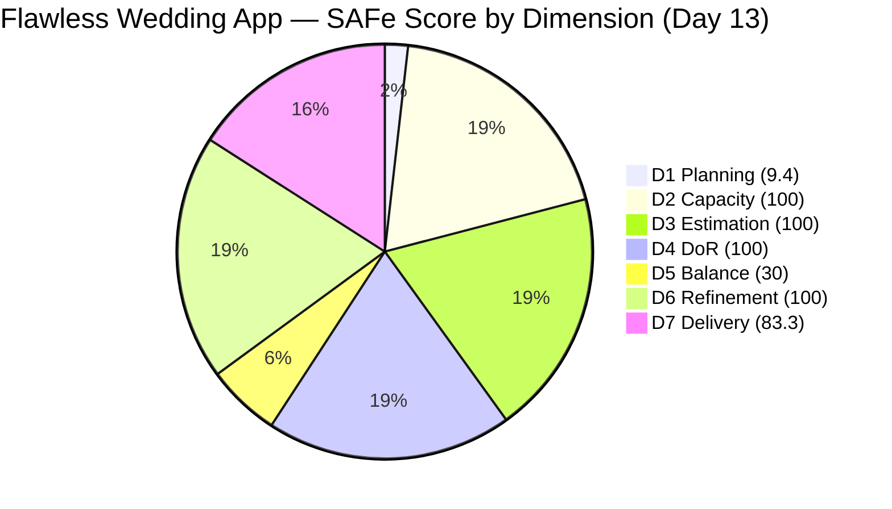
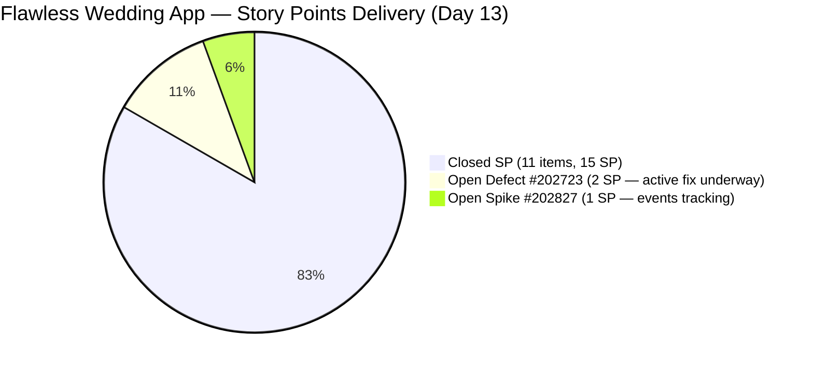

# ADO SAFe Iteration Audit — Flawless Wedding App Team

**Audit #45 | Iteration 7.2 (Apr 20 – May 3, 2026) | Day 13 of 14**

---

## 1. Audit Metadata

| Field | Value |
|---|---|
| **Audit Date** | May 2, 2026 — 09:02 UTC |
| **Auditor** | Claude Code (ADO SAFe Audit Agent) |
| **Workspace** | `ado_fl_dev` |
| **ADO Project** | Flawless Wedding App (`92b967dc-5ec7-4874-b8f5-e43b00d88339`) |
| **Team** | Flawless Wedding App Team (`7d90ecbf-d272-4b0c-b33b-c66d96a790ac`) |
| **Iteration** | Iteration 7.2 — Apr 20 to May 3, 2026 |
| **Iteration ID** | `8c08cc43-e1e8-4b0c-be84-4c81eaa860d5` |
| **Sprint Day** | Day 13 of 14 |
| **Prior Audit** | AUDIT_20260501_0903.md (Audit #44, 74.7 — Moderate Risk, PI7.2 Day 12) |
| **Scoring Model** | ADO SAFe v1 (7-dimension rubric) |
| **Overall Score** | **74.7 / 100** |
| **Risk Band** | **Moderate Risk** (60–79.9) |

> **Live ADO data confirmed.** 139 visible root backlog items in scope (Flawless Wedding App Team, `Microsoft.RequirementCategory`). 13 current iteration root items confirmed via `wit_get_work_items_for_iteration` (IterationPath = Iteration 7.2). Capacity and work item details confirmed via ADO batch APIs at 09:02 UTC May 2, 2026.

---

## 2. Executive Summary

The Flawless Wedding App Team holds at **74.7 / 100 — Moderate Risk** on Day 13 of Iteration 7.2, **unchanged from Audit #44** (74.7). Today is the final working day of the sprint (May 3 = Sunday).

No new closures have been detected since the Apr 30 burst. The two remaining open items are:

- **#202723** ("[Web][Vendor] Incorrect Subtotal and Remaining total (incl. tax) upon revising", Defect, 2 SP): **Active** — last changed May 1, 04:21 UTC. Luke has been actively working on the fix. Today is the final window for Luke to complete the fix, submit for QA, and close.
- **#202827** ("Iteration 7.2 – Collaborations, Reports & Others", Spike, 1 SP): **Active** — last changed Apr 29, 07:18 UTC. Ceremony/event tracking Spike. Ressa should close this today if all sprint events (Planning, Retro, Review, Team Sync, System Demo, Product Sync) have concluded.

**Sprint ceiling (Moderate Risk is locked due to D5 = 30.0):**
- Both items close: D7 = 100.0; overall ≈ **77.1** (Moderate Risk — D5 ceiling)
- #202723 closes only: D7 = 94.4; overall ≈ **76.3** (Moderate)
- #202827 closes only: D7 = 88.9; overall ≈ **75.6** (Moderate)
- Neither closes: D7 = 83.3; overall = **74.7** (Moderate — current)

Low Risk (≥80) is unachievable this sprint due to the structurally locked D5 = 30.0 (zero User Stories, Defect-dominant).

---

## 3. Previous Audit Delta

| Dimension | Audit #44 (May 1, 09:03) | Audit #45 (May 2, 09:02) | Delta | Driver |
|---|---|---|---|---|
| Iteration Planning | 9.4 | 9.4 | 0.0 | Backlog stable at 139 items; 13 sprint items |
| Team Capacity | 100.0 | 100.0 | 0.0 | Unchanged |
| Estimation | 100.0 | 100.0 | 0.0 | Unchanged |
| DoR Compliance | 100.0 | 100.0 | 0.0 | Unchanged |
| Work Item Balance | 30.0 | 30.0 | 0.0 | Structurally locked — 0 User Stories |
| Backlog Refinement | 100.0 | 100.0 | 0.0 | All 13 current items remain fresh |
| Delivery Predictability | 83.3 | 83.3 | 0.0 | No new closures since Apr 30 |
| **Overall** | **74.7** | **74.7** | **0.0** | Stable at sprint close — Moderate Risk |

**ADO changes detected since Audit #44 (09:03 UTC May 1):**
- **#202723**: Still Active. Last changed May 1, 04:21 UTC (prior to today's audit window). Luke's update confirmed active investigation; no closure detected since.
- **#202827**: Still Active. Last changed Apr 29, 07:18 UTC — 3 days since last update. Ressa should close today.
- **#202873**: Closed (confirmed Apr 30, 09:06). No change.
- All other items: Closed. No regressions detected.

### Score Trajectory — Iteration 7.2 Series

| Audit # | Date | Score | Band | Sprint Day |
|---|---|---|---|---|
| #32 | Apr 20 (Day 1) | 59.6 | High | 7.2 D1 |
| #36 | Apr 24 (Day 5) | 69.5 | Moderate | 7.2 D5 |
| #41 | Apr 28 (Day 9) | 74.0 | Moderate | 7.2 D9 |
| #42 | Apr 29 (Day 10) | 72.5 | Moderate | 7.2 D10 |
| #43 | Apr 30 (Day 11) | 73.9 | Moderate | 7.2 D11 |
| #44 | May 1 (Day 12) | 74.7 | Moderate | 7.2 D12 |
| **#45** | **May 2 (Day 13)** | **74.7** | **Moderate** | **7.2 D13** |

The team improved from High Risk on Day 1 to steady Moderate Risk through the sprint. D5 locks the ceiling at approximately 77.1. Moderate Risk is the final outcome.

---

## 4. Current Iteration Snapshot

| Metric | Value |
|---|---|
| **Visible root backlog items** | 139 |
| **Current iteration root items (Iter 7.2)** | 13 |
| **Committed story points** | 18 SP |
| **Closed story points** | 15 SP |
| **Remaining open SP** | 3 SP (#202723 + #202827) |
| **Sprint progress** | Day 13 of 14 (93% elapsed) |
| **Effective work window remaining** | Today (May 2) — final working day |
| **SP delivery rate** | 15 SP / 12 working days = 1.25 SP/day |
| **SP needed per remaining day** | 3 SP in ~1 day (achievable if #202723 fix completes) |
| **Capacity per day** | Luke 6 hrs (Dev) + Ressa 6 hrs (Testing) + Luzmibel 1 hr + Ike 1 hr = 14 hrs/day |
| **Days off this sprint** | 1 (Ressa Apr 20, elapsed) |
| **Primary active contributors** | Luke (fix #202723), Ressa (QA validation + #202827 close) |

### State Distribution — Current Iteration Root Items

| State | Count | SP | Items |
|---|---|---|---|
| Closed | 11 | 15 | #190892, #191079, #194538, #200791, #201326, #202072, #202119, #202569, #202873, #203230, #203442 |
| Active (Defect) | 1 | 2 | #202723 |
| Active (Spike) | 1 | 1 | #202827 |
| **Total** | **13** | **18** | |

---

## 5. Work Item Analysis

### Current Iteration Root Items — Full Detail

| ID | Title | Type | State | SP | DoR | AssignedTo | Changed |
|---|---|---|---|---|---|---|---|
| 190892 | [Admin][Coupons] Blank table on Expiry Date sort | Defect | **Closed** | 1 | PASS | Luke Colina | Apr 24 |
| 191079 | [AND/Web] Vendor logged in after password change | Defect | **Closed** | 1 | PASS | Luke Colina | Apr 29 |
| 194538 | [iOS/AND][Bride] Initial payment button incorrectly marked complete | Defect | **Closed** | 2 | PASS | Luke Colina | Apr 30 |
| 200791 | [Web][Vendor] Incorrect date and total incl. tax | Defect | **Closed** | 2 | PASS | Luke Colina | Apr 28 |
| 201326 | [Mobile] Vendor in prior category after update | Defect | **Closed** | 1 | PASS | Luke Colina | Apr 24 |
| 202072 | [Vendor] Inconsistent error on login/dashboard | Defect | **Closed** | 2 | PASS | Luke Colina | Apr 23 |
| 202119 | [Web][Vendor] Blank dashboard on first login | Defect | **Closed** | 2 | PASS | Luke Colina | Apr 23 |
| 202569 | [Bride] Incorrect message view via vendor notif | Defect | **Closed** | 1 | PASS | Luke Colina | Apr 23 |
| 203230 | [Vendor] Users unable to login — marked deleted | Defect | **Closed** | 1 | PASS | Luke Colina | Apr 24 |
| 203442 | [Bride] Cannot pay initial – invalid date and missing invoice | Defect | **Closed** | 1 | PASS | Luke Colina | Apr 30 |
| 202873 | [Retro] Flawless Backlog CleanUp Iteration 7.2 | Spike | **Closed** | 1 | PASS | Ressa Paracuelles | Apr 30 |
| **202723** | **[Web][Vendor] Incorrect Subtotal and Remaining total upon revising** | **Defect** | **Active** | **2** | PASS | Luke Colina | **May 1** |
| **202827** | **Iteration 7.2 – Collaborations, Reports & Others** | **Spike** | **Active** | **1** | PASS | Ressa Paracuelles | **Apr 29** |

**Note:** #203267 (Iter 7.3 Enabler) and #203131 (PI7-root Defect) appear in the iteration query result but have IterationPath ≠ Iter 7.2. They are correctly excluded from current_iteration_root_items per scoring definition.

### #202723 — Payment Calculation Defect (Critical Path)

| Field | Value |
|---|---|
| Title | [Web][Vendor] Incorrect Subtotal and Remaining total (incl. tax) upon revising |
| State | **Active** |
| Last Changed | May 1, 04:21 UTC (yesterday — no new update detected today) |
| Story Points | 2 SP |
| Assignee | Luke Colina |
| Child tasks | #202734, #202735, #202819, #203525, #203552 (active investigation) |

This is the final payment calculation defect in the cluster. Three of four payment flow defects (#200791, #194538, #203442) are closed. #202723 is the last outstanding item. Luke's May 1 activity (5 child tasks in investigation) confirms the fix is in progress. Today is the final day for the fix to be completed and QA-validated before the sprint closes.

### #202827 — Collaborations & Events Spike

| Field | Value |
|---|---|
| Title | Iteration 7.2 – Collaborations, Reports & Others |
| State | **Active** |
| Last Changed | Apr 29, 07:18 UTC (3 days ago) |
| Story Points | 1 SP |
| Assignee | Ressa Paracuelles |
| AC criteria | Iteration Planning ✓, Retrospective, Iteration Review, Team Sync, System Demo, Product Sync |

Ressa should close this item today. With today being Day 13 (final working day), all SAFe iteration events should have either occurred or be scheduled for today. If Planning, Retro, Review, and at least some collaborations have concluded, this 1 SP Spike can and should be closed.

### Payment Flow Defect Cluster — Final Status

| Item | Title | SP | State |
|---|---|---|---|
| #200791 | Incorrect date + total incl. tax | 2 | Closed (Apr 28) |
| #194538 | Initial payment button after error | 2 | Closed (Apr 30) |
| #203442 | Cannot pay initial — invalid date + missing invoice | 1 | Closed (Apr 30) |
| **#202723** | **Incorrect Subtotal and Remaining total upon revising** | **2** | **Active** (May 1 last update) |

Three of four payment flow defects are resolved. #202723 is the final outstanding item.

### Unscoped Backlog Items (outside sprint)

| ID | Title | Type | IterationPath | State | DoR |
|---|---|---|---|---|---|
| 203267 | Unified Web and Mobile Platform Update (Enabler) | Enabler | Iter 7.3 | Estimation | PASS |
| 203131 | [Vendor] Service Islands dropdown — token expiry | Defect | PI7-root | New | PASS |
| 203530 | [WebApp] Staging Enabler | Enabler | PI7-root (new) | — | Unknown |

#203267 is already scoped to Iter 7.3 with 2 SP and full DoR. Adding User Stories to Iter 7.3 alongside this Enabler will directly improve D5 from 30.0.

---

## 6. SAFe Compliance Scorecard

| Dimension | Score | Evidence | Notes |
|---|---|---|---|
| D1 Iteration Planning | 9.4 | 13 / 139 visible backlog items in sprint | Large legacy backlog; CleanUp Spike reduced from 140 to 139; D1 structurally constrained |
| D2 Team Capacity | 100.0 | 4 / 4 team members with positive capacity | Luke (Dev 6/day), Ressa (Testing 6/day), Luzmibel (Testing 1/day), Ike (Dev 1/day) |
| D3 Estimation | 100.0 | 13 / 13 sprint items have SP > 0 | Full estimation hygiene throughout |
| D4 DoR Compliance | 100.0 | 13 / 13 sprint items pass Desc + AC check | All items have ≥30-char Desc and ≥20-char AC |
| D5 Work Item Balance | 30.0 | 0 User Stories (-40); Defect = 84.6% dominant type (-30) | 11 Defects + 2 Spikes; locked for sprint duration |
| D6 Backlog Refinement | 100.0 | All 13 current items changed Apr 20 or later; 0 untouched | #202723 updated May 1; #202827 Apr 29; all items within fresh window |
| D7 Delivery Predictability | 83.3 | 15 / 18 SP closed | 11 Closed + 1 Spike Closed (#202873); 2 Active (3 SP open) |
| **Overall** | **74.7** | **(9.4+100+100+100+30+100+83.3)/7** | **Moderate Risk** |

**D5 formula trace:** 100 - 40 (no User Story) - 30 (dominant type >60%) = 30. Spike share = 2/13 = 15.4% (<40%, no -20). Result = 30.

**D7 formula trace:** committed_SP = 18; closed_SP = 15 (#202873 Spike closed Apr 30 = 1 SP added from prior sprint). round(15/18 × 100, 1) = 83.3.

---

## 7. Dimension Findings

### D1 — Iteration Planning (9.4 — unchanged)

The backlog count remains at 139 after #202873's closure removed one item (from 140). With 13 sprint items and 139 visible backlog items, D1 = round(13/139 × 100, 1) = 9.4. Each item removed from the legacy backlog incrementally improves D1.

**Improvement targets:**
- 130 items → D1 = 10.0
- 100 items → D1 = 13.0
- 80 items → D1 = 16.3

CleanUp Spike #203514 is already scheduled for Iter 7.3, continuing the reduction effort.

### D2 — Team Capacity (100.0 — unchanged)

All four team members have positive capacity configured. Luke (Dev 6 hrs) and Ressa (Testing 6 hrs) are the primary delivery contributors today. With #202723 still Active, Ressa's QA validation will be needed once Luke submits the fix. Luzmibel and Ike provide supplemental capacity.

### D3 — Estimation (100.0 — unchanged)

All 13 sprint items carry Story Points. Estimation discipline has been maintained without gaps throughout the sprint.

### D4 — DoR Compliance (100.0 — unchanged)

All 13 sprint items pass DoR. #202723 retains its Description and Acceptance Criteria despite being re-opened. The team continues to demonstrate strong DoR discipline.

### D5 — Work Item Balance (30.0 — unchanged, structurally locked)

Eleven Defects (84.6%) and 2 Spikes. Zero User Stories. Both the -40 (no User Story) and -30 (dominant type >60%) penalties apply. This is the team's lowest scoring dimension and the primary barrier to Low Risk.

**For Iteration 7.3:** Adding 2 User Stories to a sprint of comparable size would bring D5 from 30 to at least 60 (100 - 30 if dominant type drops to ~50% — 7 Defects of 14 total would be 50%, eliminating the -30 penalty if balanced with User Stories). Include at least 2 User Story items in Iter 7.3 alongside #203267 (Enabler), #203131 (Defect), and continued defect work.

### D6 — Backlog Refinement (100.0 — unchanged)

All 13 current iteration items were changed on or after April 20 (sprint start). #202723's May 1 update confirms active work. #202827 was last updated Apr 29. Both items are within the 45-day fresh window (cutoff: Mar 18, 2026). No untouched-current penalty applies.

**D6 limitation:** The full 139-item backlog's ChangedDates for non-current items were not individually fetched. Older IDs in the 187xxx–190xxx range may have stale dates. D6 is scored based on the 13 confirmed current items only. This evidence gap is noted — full backlog staleness analysis is deferred.

### D7 — Delivery Predictability (83.3 — unchanged)

Fifteen of 18 committed SP are closed. The +5.5 improvement from Audit #43 to #44 (when #202873 closed) has held. No new closures in the last 24 hours.

**Final day outlook:**
- **#202723** (2 SP, Defect): Luke's May 1 child task additions (#203525, #203552) confirm active investigation. If the fix is submitted and QA passes today, D7 rises to 94.4 (17/18) or 100.0 (18/18 if both close).
- **#202827** (1 SP, Spike): Ressa should close today. All sprint SAFe ceremonies should be complete or scheduled for today's final working day.

**Sprint ceiling:** Even if both items close, D5 = 30 caps overall at approximately 77.1. Moderate Risk is the final outcome.

---

## 8. Risks and Bottlenecks

| Risk | Severity | Status |
|---|---|---|
| #202723 (Subtotal/Remaining total defect, 2 SP) — active investigation underway; fix not yet confirmed | **High** | Luke actively working (May 1 update); today is the final QA window. If fix is incomplete, item carries to next sprint. |
| D5 = 30.0 — zero User Stories, Defect-dominant sprint | **High** | Structurally locked; Low Risk (80+) unachievable this sprint; resolves only in Iter 7.3 with User Story commitment |
| Sprint closes May 3 (Sunday); today is the final working day | **High** | Luke must complete #202723 fix and submit for QA today; Ressa must validate and close today or tomorrow |
| #202827 (Collaborations Spike, 1 SP) — 3 days without update | Moderate | Ressa should close today if sprint ceremonies are complete |
| Large legacy backlog (139 items) — D1 = 9.4 | Moderate | CleanUp Spike #203514 scheduled for Iter 7.3; target: 130 items |
| #202723 regression risk to closed payment items (#194538, #203442) | Low | Ressa should confirm previously closed items remain unaffected after #202723 root cause investigation |
| #203530 (WebApp Staging Enabler) in PI7-root — no Desc/AC | Low | New item; needs scoping and DoR for Iter 7.3+ |

---

## 9. Prioritized Recommendations

1. **[TODAY — Critical] Complete and close #202723 (Subtotal/Remaining total defect, 2 SP)** — Luke must finalize the fix today. Once submitted, Ressa must validate immediately. Target: fix submitted by midday, QA complete and item closed by end of business. This raises D7 to 94.4 (or 100.0 if #202827 also closes) and overall to 76.3–77.1.
2. **[TODAY] Close #202827 (Collaborations Spike, 1 SP)** — Ressa should confirm that all sprint ceremonies and events (Iteration Planning, Retrospective, Iteration Review, Team Sync, System Demo, Product Sync) have been attended or completed. Close the Spike today. This adds 1 SP to D7 and brings overall to 75.6–77.1.
3. **[TODAY] Verify payment cluster stability** — Ressa should confirm that #194538 and #203442 (both closed Apr 30) remain unaffected by Luke's investigation into #202723. The subtotal/remaining total issue may share root cause with the earlier payment flow defects.
4. **[Iter 7.3 Planning] Include at least 2 User Stories** — #203267 (Enabler) and #203131 (Defect) are already scoped. Adding 2 User Stories alongside defect work is the highest-leverage action available to improve D5 from 30.0 to at least 60.0.
5. **[Iter 7.3 Planning] Continue backlog reduction via #203514 (CleanUp Spike)** — The target of 130 items by end of Iter 7.3 is achievable. Each 10-item reduction raises D1 by approximately 0.7 points.
6. **[Iter 7.3 Planning] Assign and document #203530 (WebApp Staging Enabler)** — This new PI7-root item needs iteration assignment, Description, and Acceptance Criteria before commitment.
7. **[Document] Record #202723 root cause and regression prevention** — Luke should post a comment in #202723 explaining the root cause (whether it is a separate calculation path from #194538/#203442 or a missed edge case). This prevents similar regressions in Iter 7.3.

---

## 10. Evidence Gaps and Limitations

| Gap | Impact | Mitigation |
|---|---|---|
| Full backlog of 139 items — ChangedDates for non-current items not individually fetched | D6 for older backlog items unverified; IDs in the 187xxx–190xxx range may be stale | D6 scored on 13 confirmed current items (all fresh); full stale check deferred to backlog cleanup audit |
| #202723 root cause not documented in ADO | D7 correctly reflects 15/18 SP; active work confirmed by May 1 update and child tasks | Luke should document root cause in item comments today |
| #202827 ceremony completion status unknown | D7 = 83.3 correctly reflects Active status | Ressa should close today if all events completed |
| #203267 (Iter 7.3) and #203131 (PI7-root) appear in iteration query — IterationPath ≠ Iter 7.2 | Correctly excluded per scoring definition; no scoring impact | Verified via direct IterationPath field check |
| #202873 counted in iteration query (13 items) but closed and exited visible backlog | Correctly reconciled: backlog API = 139; iteration root count = 13 including closed Spike | No scoring discrepancy |
| Sprint end May 3 = Sunday | Effective work window ends today (May 2) | Luke and Ressa should target completion by end of business today |
