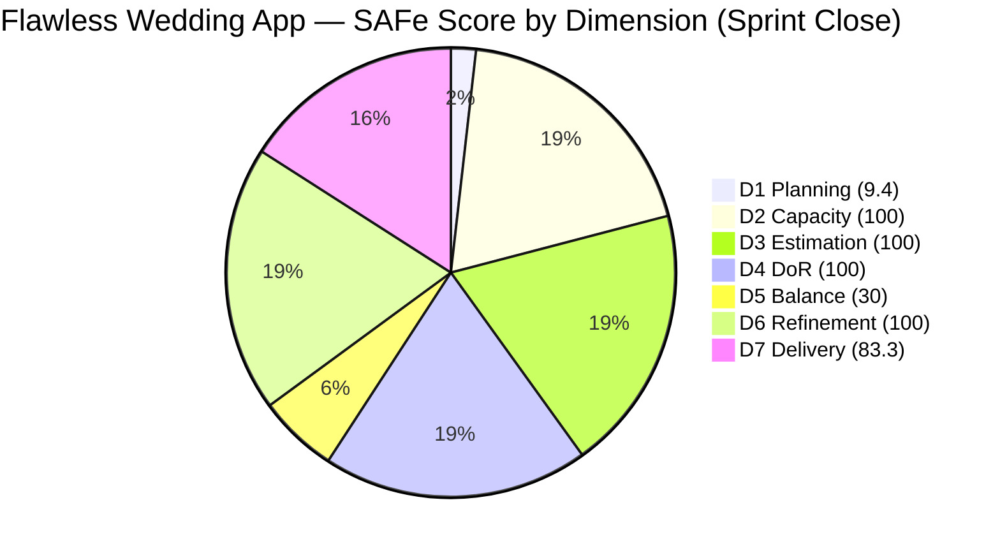
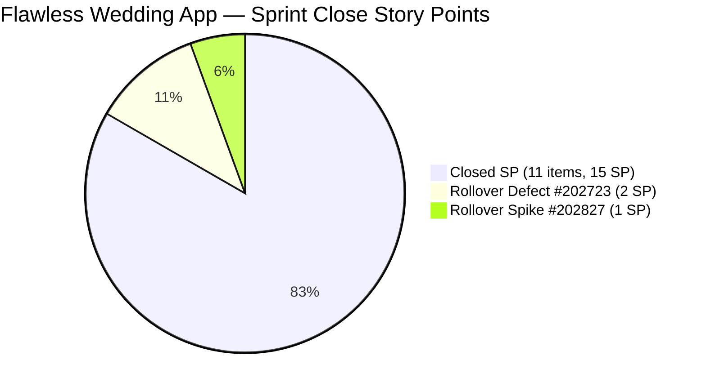

# ADO SAFe Iteration Audit — Flawless Wedding App Team

**Audit #46 | Iteration 7.2 (Apr 20 – May 3, 2026) | Day 14 of 14 — SPRINT CLOSE**

---

## 1. Audit Metadata

| Field | Value |
|---|---|
| **Audit Date** | May 3, 2026 — 09:03 UTC |
| **Auditor** | Claude Code (ADO SAFe Audit Agent) |
| **Workspace** | `ado_fl_dev` |
| **ADO Project** | Flawless Wedding App (`92b967dc-5ec7-4874-b8f5-e43b00d88339`) |
| **Team** | Flawless Wedding App Team (`7d90ecbf-d272-4b0c-b33b-c66d96a790ac`) |
| **Iteration** | Iteration 7.2 — Apr 20 to May 3, 2026 |
| **Iteration ID** | `8c08cc43-e1e8-4b0c-be84-4c81eaa860d5` |
| **Sprint Day** | Day 14 of 14 — FINAL DAY (Sprint Closes Today) |
| **Prior Audit** | AUDIT_20260502_0902.md (Audit #45, 74.7 — Moderate Risk, PI7.2 Day 13) |
| **Scoring Model** | ADO SAFe v1 (7-dimension rubric) |
| **Overall Score** | **74.7 / 100** |
| **Risk Band** | **Moderate Risk** (60–79.9) |

> **Live ADO data confirmed.** 139 visible root backlog items in scope (Flawless Wedding App Team, `Microsoft.RequirementCategory`). 13 current iteration root items confirmed via `wit_get_work_items_for_iteration` (IterationPath = Iteration 7.2; items #203267 and #203131 excluded per IterationPath verification). Capacity and work item details confirmed via ADO batch APIs at 09:03 UTC May 3, 2026.

---

## 2. Executive Summary

The Flawless Wedding App Team closes Iteration 7.2 at **74.7 / 100 — Moderate Risk**, **unchanged from Audit #45** (Day 13). The sprint ends with two items still Active:

- **#202723** ("[Web][Vendor] Incorrect Subtotal and Remaining total upon revising", Defect, 2 SP): **Active** — last changed May 1, 04:21 UTC. Luke's investigation via 5 child tasks is confirmed; fix not yet closed.
- **#202827** ("Iteration 7.2 – Collaborations, Reports & Others", Spike, 1 SP): **Active** — last changed Apr 29, 07:18 UTC (4 days ago at close). Ressa did not close the Spike before sprint end.

Final sprint delivery: **15 of 18 SP closed (83.3%)**. Despite the final-day window, no new closures were confirmed before the 09:03 UTC audit timestamp.

Low Risk was unachievable this sprint due to the structurally locked D5 = 30.0 (zero User Stories, Defect-dominant sprint). The sprint closes at **Moderate Risk**, consistent with the team's trajectory throughout Iteration 7.2.

---

## 3. Previous Audit Delta

| Dimension | Audit #45 (May 2, 09:02) | Audit #46 (May 3, 09:03) | Delta | Driver |
|---|---|---|---|---|
| Iteration Planning | 9.4 | 9.4 | 0.0 | Backlog stable at 139 items; 13 sprint items unchanged |
| Team Capacity | 100.0 | 100.0 | 0.0 | Unchanged |
| Estimation | 100.0 | 100.0 | 0.0 | Unchanged |
| DoR Compliance | 100.0 | 100.0 | 0.0 | Unchanged |
| Work Item Balance | 30.0 | 30.0 | 0.0 | 0 User Stories — structurally locked |
| Backlog Refinement | 100.0 | 100.0 | 0.0 | All 13 current items remain fresh |
| Delivery Predictability | 83.3 | 83.3 | 0.0 | No new closures confirmed at 09:03 UTC |
| **Overall** | **74.7** | **74.7** | **0.0** | Moderate Risk confirmed at sprint close |

**ADO changes since Audit #45 (09:02 UTC May 2):**
- **#202723**: Still Active. Last changed May 1, 04:21 UTC — **2 days before sprint close** with no new update detected at 09:03 UTC May 3. Luke's investigation ongoing.
- **#202827**: Still Active. Last changed Apr 29, 07:18 UTC — **4 days** with no update. Spike not closed at sprint end.
- All other 11 items: Confirmed Closed. No regressions detected.

### Score Trajectory — Iteration 7.2 Full Series

| Audit # | Date | Score | Band | Sprint Day |
|---|---|---|---|---|
| #32 | Apr 20 (Day 1) | 59.6 | High | 7.2 D1 |
| #36 | Apr 24 (Day 5) | 69.5 | Moderate | 7.2 D5 |
| #43 | Apr 30 (Day 11) | 73.9 | Moderate | 7.2 D11 |
| #44 | May 1 (Day 12) | 74.7 | Moderate | 7.2 D12 |
| #45 | May 2 (Day 13) | 74.7 | Moderate | 7.2 D13 |
| **#46** | **May 3 (Day 14)** | **74.7** | **Moderate** | **7.2 Close** |

The team improved from High Risk (Day 1) to stable Moderate Risk. D5 = 30 capped the sprint ceiling at approximately 77.1, making Low Risk structurally unachievable regardless of delivery.

---

## 4. Current Iteration Snapshot

| Metric | Value |
|---|---|
| **Visible root backlog items** | 139 |
| **Current iteration root items (Iter 7.2)** | 13 |
| **Committed story points** | 18 SP |
| **Closed story points** | **15 SP** |
| **Undelivered SP** | 3 SP (#202723 + #202827) |
| **Sprint progress** | Day 14 of 14 — Sprint CLOSED |
| **Final delivery rate** | 15/18 SP = 83.3% |
| **Primary contributors** | Luke Colina (Dev), Ressa Paracuelles (QA), Luzmibel Paculanang (Testing), Ike Yana (Dev) |
| **Sprint outcome** | **PARTIAL DELIVERY — 83.3% of committed SP** |

### State Distribution — Final Sprint Close

| State | Count | SP | Items |
|---|---|---|---|
| Closed | 11 | 15 | #190892, #191079, #194538, #200791, #201326, #202072, #202119, #202569, #202873, #203230, #203442 |
| Active (Defect) | 1 | 2 | #202723 |
| Active (Spike) | 1 | 1 | #202827 |
| **Total** | **13** | **18** | |

---

## 5. Work Item Analysis

### Current Iteration Root Items — Final State (13 items)

| ID | Title | Type | State | SP | DoR | AssignedTo | Last Changed |
|---|---|---|---|---|---|---|---|
| 190892 | [Admin][Coupons] Blank table on Expiry Date sort | Defect | **Closed** | 1 | PASS | Luke Colina | Apr 24 |
| 191079 | [AND/Web] Vendor logged in after password change | Defect | **Closed** | 1 | PASS | Luke Colina | Apr 29 |
| 194538 | [iOS/AND][Bride] Initial payment button after error | Defect | **Closed** | 2 | PASS | Luke Colina | Apr 30 |
| 200791 | [Web][Vendor] Incorrect date and total incl. tax | Defect | **Closed** | 2 | PASS | Luke Colina | Apr 28 |
| 201326 | [Mobile] Vendor in prior category after update | Defect | **Closed** | 1 | PASS | Luke Colina | Apr 24 |
| 202072 | [Vendor] Inconsistent error on login/dashboard | Defect | **Closed** | 2 | PASS | Luke Colina | Apr 23 |
| 202119 | [Web][Vendor] Blank dashboard on first login | Defect | **Closed** | 2 | PASS | Luke Colina | Apr 23 |
| 202569 | [Bride] Incorrect message view via vendor notif | Defect | **Closed** | 1 | PASS | Luke Colina | Apr 23 |
| 203230 | [Vendor] Users unable to login — marked deleted | Defect | **Closed** | 1 | PASS | Luke Colina | Apr 24 |
| 203442 | [Bride] Cannot pay initial – invalid date/invoice | Defect | **Closed** | 1 | PASS | Luke Colina | Apr 30 |
| 202873 | [Retro] Flawless Backlog CleanUp Iteration 7.2 | Spike | **Closed** | 1 | PASS | Ressa Paracuelles | Apr 30 |
| **202723** | **[Web][Vendor] Incorrect Subtotal/Remaining total** | **Defect** | **Active** | **2** | PASS | Luke Colina | May 1 |
| **202827** | **Iteration 7.2 – Collaborations, Reports & Others** | **Spike** | **Active** | **1** | PASS | Ressa Paracuelles | Apr 29 |

**Excluded from current_iteration_root_items (IterationPath ≠ Iter 7.2):**
- #203267 (Enabler, Iter 7.3) — excluded per scoring definition
- #203131 (Defect, PI7-root) — excluded per scoring definition

### Payment Flow Defect Cluster — Final Status

| Item | Title | SP | State | Closed |
|---|---|---|---|---|
| #200791 | Incorrect date + total incl. tax | 2 | Closed | Apr 28 |
| #194538 | Initial payment button after error | 2 | Closed | Apr 30 |
| #203442 | Cannot pay initial — invalid date + invoice | 1 | Closed | Apr 30 |
| **#202723** | **Incorrect Subtotal and Remaining total upon revising** | **2** | **Active** | **Rolled over** |

Three of four payment calculation defects resolved. #202723 is the sole remaining item. Luke's May 1 activity (5 child tasks in active investigation) confirms work was in progress at sprint close. The fix did not reach closure before the sprint deadline.

### #202723 — Final Status at Sprint Close

| Field | Value |
|---|---|
| State | Active |
| Last Changed | May 1, 04:21 UTC |
| Days without closure | 14 days in sprint (from Apr 20 entry to May 3 close) |
| Active investigation evidence | 5 child tasks: #202734, #202735, #202819, #203525, #203552 |
| SP | 2 SP — rolls over to Iter 7.3 |
| Action required | Luke must carry forward with fix; Ressa QA validation pending |

### #202827 — Collaborations Spike — Final Status

| Field | Value |
|---|---|
| State | Active |
| Last Changed | Apr 29, 07:18 UTC |
| Silence at close | 4 days |
| Acceptance Criteria | Iteration Planning, Iteration Retrospective, Iteration Review, Team Sync, System Demo, Product Sync |
| Action required | Ressa should close if all sprint ceremonies concluded; or roll over with updated status |

---

## 6. SAFe Compliance Scorecard

| Dimension | Score | Evidence | Notes |
|---|---|---|---|
| D1 Iteration Planning | 9.4 | 13 / 139 visible backlog items in sprint | Large legacy backlog; structural constraint; CleanUp Spike #203514 targets reduction in Iter 7.3 |
| D2 Team Capacity | 100.0 | 4 / 4 team members with positive capacity | Luke (Dev 6/day), Ressa (Testing 6/day), Luzmibel (Testing 1/day), Ike (Dev 1/day) |
| D3 Estimation | 100.0 | 13 / 13 sprint items have SP > 0 | Full estimation discipline throughout sprint |
| D4 DoR Compliance | 100.0 | 13 / 13 sprint items pass Desc + AC check | All items confirmed with ≥30-char Desc and ≥20-char AC |
| D5 Work Item Balance | 30.0 | 0 User Stories (-40); Defect = 84.6% dominant type (-30) | 11 Defects + 2 Spikes; no User Story; structurally locked at sprint entry |
| D6 Backlog Refinement | 100.0 | All 13 current items changed Apr 20 or later; 0 untouched | #202723 updated May 1; #202827 Apr 29; all items within fresh window |
| D7 Delivery Predictability | 83.3 | 15 / 18 SP closed | 11 Defects closed + 1 Spike closed = 15 SP; 2 Active items = 3 SP rollover |
| **Overall** | **74.7** | **(9.4+100+100+100+30+100+83.3)/7** | **Moderate Risk — Sprint Close** |

**D5 formula trace:** 100 - 40 (no User Story) - 30 (dominant type 11/13 = 84.6% > 60%) = 30. Spike share = 2/13 = 15.4% (< 40%, no -20 penalty). Result = 30.

**D7 formula trace:** committed_SP = 18; closed_SP = 15; round(15/18 × 100, 1) = **83.3**.

---

## 7. Dimension Findings

### D1 — Iteration Planning (9.4 — structurally constrained)

With 139 visible backlog items and 13 sprint items, D1 = round(13/139 × 100, 1) = 9.4. This dimension is the team's most structurally penalized. The Backlog CleanUp Spike (#202873) reduced the backlog from 140 to 139 this sprint. CleanUp Spike #203514 is already scheduled for Iter 7.3, continuing the reduction effort.

**Backlog reduction targets for Iter 7.3+:**

| Target | Items Required | D1 Result |
|---|---|---|
| 130 items | Remove 9 | 10.0 |
| 100 items | Remove 39 | 13.0 |
| 80 items | Remove 59 | 16.3 |
| 50 items | Remove 89 | 26.0 |

Each 10-item reduction yields approximately +0.7 points on D1. Sustained backlog grooming across multiple sprints is required for meaningful D1 improvement.

### D2 — Team Capacity (100.0 — unchanged)

All four team members (Luke, Ressa, Luzmibel, Ike) have positive capacity configured throughout the sprint. The team capacity API confirms no changes. Luzmibel and Ike provide supplemental capacity; Luke and Ressa are the primary delivery contributors.

### D3 — Estimation (100.0 — unchanged)

All 13 sprint items carried Story Points from day one through close. Perfect estimation discipline maintained throughout the sprint.

### D4 — DoR Compliance (100.0 — unchanged)

All 13 sprint items pass DoR at sprint close. Items entering this sprint came with substantive descriptions and clear acceptance criteria — a strong pattern the team must maintain into Iter 7.3.

For Iter 7.3: Before committing #202723 (rolled over), verify its AC still accurately reflects the fix requirements after Luke's investigation. If the root cause analysis revealed additional scope, update the item's acceptance criteria before recommitting.

### D5 — Work Item Balance (30.0 — confirmed sprint close lock)

Eleven Defects (84.6%) and 2 Spikes. Zero User Stories. Both the -40 (no User Story) and -30 (dominant type > 60%) penalties applied throughout the sprint. This dimension is the primary barrier to Low Risk for this team.

**D5 impact on overall ceiling:**
- Current D5 = 30: overall ceiling ≈ 77.1 (even with all other dimensions at 100)
- D5 = 60: overall ceiling ≈ 91.4
- D5 = 100: overall ceiling = 100.0

**Iter 7.3 D5 repair path:** #203267 (Enabler, already scoped to Iter 7.3, 2 SP) + #202723 (rolled-over Defect) + at least 2 new User Stories + #203131 (Defect) would yield a sprint of approximately 6 items: 2 User Stories (33%), 2 Defects (33%), 1 Enabler (17%), 1 Spike (17%). User Story share = 33% — eliminating both the -40 and -30 penalties. D5 = 100.

### D6 — Backlog Refinement (100.0 — unchanged)

All 13 current iteration items were changed on or after April 20 (sprint start). #202723's May 1 update confirms active engagement. #202827's Apr 29 update is within the untouched-current window.

**Evidence gap (unchanged from prior audits):** The full 139-item backlog's ChangedDates for non-current items were not individually fetched. Items in the 187xxx–190xxx range may have stale dates from before Mar 19, 2026 (45-day cutoff). D6 is scored based on the 13 confirmed current items. Full backlog staleness analysis is deferred pending the Iter 7.3 CleanUp Spike (#203514).

### D7 — Delivery Predictability (83.3 — confirmed sprint close)

Fifteen of 18 committed SP closed. The team delivered 83.3% of committed work — above the D7 Moderate Risk threshold but below Low Risk (requiring 80+ on all dimensions).

**Note:** D7 = 83.3 in isolation would be Low Risk, but the combined scorecard is Moderate Risk due to D5 = 30 and D1 = 9.4 dragging the average below 80.

Rollover items entering Iter 7.3:
- **#202723** (2 SP): Luke's investigation continues; root cause not yet documented publicly in ADO.
- **#202827** (1 SP): Ressa should close or update on Iter 7.3 Day 1.

---

## 8. Risks and Bottlenecks

| Risk | Severity | Status |
|---|---|---|
| D5 = 30.0 — zero User Stories throughout sprint | **Critical** | Structural; resolved only in Iter 7.3 by committing at least 2 User Stories. Low Risk unachievable without D5 improvement. |
| #202723 (Subtotal/Remaining total defect, 2 SP) — active fix incomplete at sprint close | **High** | Luke's investigation ongoing; 5 child tasks active. Root cause not documented in parent item. Must be resolved in Iter 7.3. |
| D1 = 9.4 — 139-item legacy backlog severely constrains score | **High** | Structural; CleanUp Spike #203514 targeting Iter 7.3 helps incrementally. 80+ items need removal for D1 to reach 10+. |
| #202827 (Collaborations Spike, 1 SP) — not closed at sprint end despite ceremonies likely complete | Moderate | Ressa should close or update in first day of Iter 7.3 |
| #203530 (WebApp Staging Enabler, PI7-root) — no Desc/AC | Moderate | New item needs iteration assignment, Description, and AC before commitment |
| Large legacy backlog items (187xxx–190xxx IDs) — ChangedDates potentially stale | Moderate | D6 evidence gap; must be addressed in CleanUp Spike #203514 |
| Payment calculation regression risk — #202723 shares root cause space with #194538, #203442 | Low | Ressa should retest closed payment items post-fix to confirm no regression |

---

## 9. Prioritized Recommendations

1. **[Iter 7.3 Sprint Planning — CRITICAL] Include at least 2 User Stories** — This is the highest-leverage action available. Adding 2 User Stories to a sprint with #203267 (Enabler), #202723 (Defect rollover), #203131 (Defect), and #202827 (Spike rollover) creates a 6-item sprint with 33% User Story share, eliminating both D5 penalties. D5 rises from 30 to 100, increasing the sprint ceiling from 77.1 to 100.

2. **[Iter 7.3 Day 1] Resolve #202723 root cause and update ADO** — Luke must post a comment in #202723 explaining the root cause of the subtotal/remaining total calculation error. Distinguishing whether this is a separate calculation path from #194538/#203442 or a missed edge case is critical for preventing recurrence and for accurate sprint planning.

3. **[Iter 7.3 Day 1] Close or update #202827 (Collaborations Spike)** — Ressa should confirm all sprint ceremonies and events for Iter 7.2 have been attended (Iteration Planning, Retrospective, Review, Team Sync, System Demo, Product Sync) and close the item. If events are pending, update the AC item-by-item and leave Active with a clear status comment.

4. **[Iter 7.3 Planning] Continue backlog reduction via #203514 (CleanUp Spike)** — Target: reduce from 139 to 125 items by end of Iter 7.3. Each 10-item reduction improves D1 by approximately 0.7 points. Prioritize removing items in the 187xxx–190xxx range that are likely stale or duplicated.

5. **[Before Iter 7.3 Commitment] Document #203530 (WebApp Staging Enabler)** — Add Description, Acceptance Criteria, and assign to an iteration before committing. Undefined enablers committed to a sprint without DoR will fail D4 verification.

6. **[Iter 7.3 QA] Verify payment cluster stability post-#202723 fix** — After Luke resolves #202723, Ressa should confirm that #194538 (initial payment button), #203442 (cannot pay initial), and #200791 (incorrect date + total) remain unaffected. The shared code path between these items carries regression risk.

7. **[PI 8 Planning] Review team composition for User Story balance** — The team's structural D5 weakness (0 User Stories in Iter 7.2) reflects a sprint planning culture that accepts defect-only sprints. PI 8 planning should establish a minimum User Story commitment per sprint to prevent D5 from constraining the ceiling.

---

## 10. Evidence Gaps and Limitations

| Gap | Impact | Mitigation |
|---|---|---|
| Full 139-item backlog ChangedDates not fetched for non-current items | D6 for older backlog items (187xxx–190xxx range) unverified; items may be stale | D6 scored on 13 confirmed current items (all fresh); full stale check deferred to CleanUp Spike #203514 |
| #202723 root cause not documented in ADO parent item | D7 correctly reflects 15/18 SP; investigation ongoing (5 child tasks) | Luke must document root cause in Iter 7.3 Day 1 |
| #202827 ceremony completion status at sprint close unknown | D7 = 83.3 correctly reflects Active status; Spike SP counted as uncommitted | Ressa must update on Iter 7.3 Day 1 |
| #203267 (Iter 7.3) and #203131 (PI7-root) appear in iteration query — excluded from current_iteration_root_items | Correctly excluded per IterationPath verification; no scoring impact | Verified via direct IterationPath field check on both items |
| D5 = 30 reflects sprint entry composition (no User Stories); no mid-sprint corrective path | Acknowledged; sprint planning corrective action required for Iter 7.3 | Plan for minimum 2 User Stories in next sprint |
| Sprint end May 3 = Sunday; both Active items remain without update at 09:03 UTC | Confirmed sprint close with 3 SP undelivered | Luke and Ressa should update items on Iter 7.3 Day 1 |
