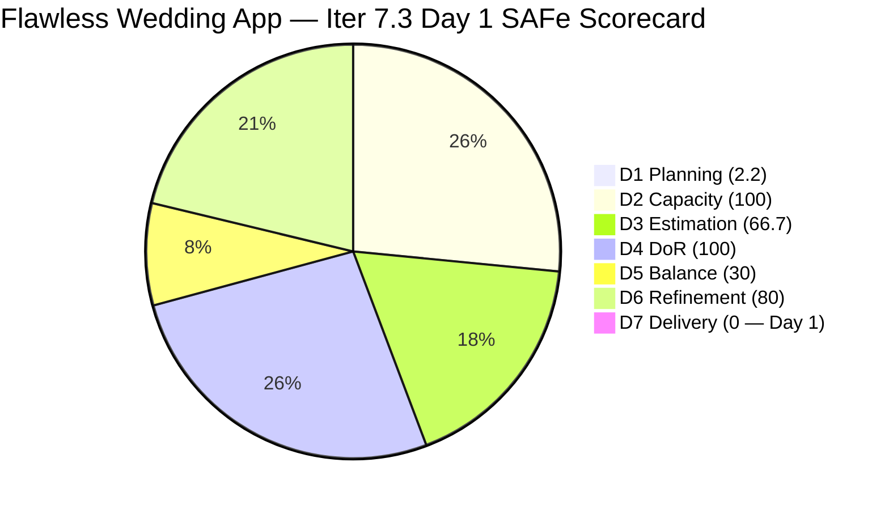
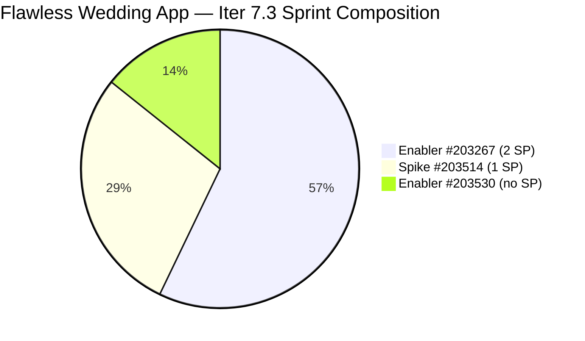

# ADO SAFe Iteration Audit — Flawless Wedding App Team

**Audit #47 | Iteration 7.3 (May 4 – May 17, 2026) | Day 1 of 14 — SPRINT START**

---

## 1. Audit Metadata

| Field | Value |
|---|---|
| **Audit Date** | May 4, 2026 — 09:03 UTC |
| **Auditor** | Claude Code (ADO SAFe Audit Agent) |
| **Workspace** | `ado_fl_dev` |
| **ADO Project** | Flawless Wedding App (`92b967dc-5ec7-4874-b8f5-e43b00d88339`) |
| **Team** | Flawless Wedding App Team (`7d90ecbf-d272-4b0c-b33b-c66d96a790ac`) |
| **Iteration** | Iteration 7.3 — May 4 to May 17, 2026 |
| **Iteration ID** | `5d136874-cd41-473c-868c-fd7102a1a916` |
| **Sprint Day** | Day 1 of 14 — SPRINT START |
| **Prior Audit** | AUDIT_20260503_0903.md (Audit #46, 74.7 — Moderate Risk, PI7.2 Sprint Close) |
| **Scoring Model** | ADO SAFe v1 (7-dimension rubric) |
| **Overall Score** | **54.1 / 100** |
| **Risk Band** | **High Risk** (40–59.9) |

> **Live ADO data confirmed.** 138 visible root backlog items in scope (Flawless Wedding App Team, `Microsoft.RequirementCategory`). 3 current iteration root items confirmed with IterationPath = Iteration 7.3: #203267 (Enabler), #203514 (Spike), #203530 (Enabler). Capacity confirmed via ADO API at 09:03 UTC May 4, 2026. Notable: Iter 7.2 rollovers #202723 and #202827 were **both closed on May 4** (00:28 UTC and 08:16 UTC respectively) — but their IterationPath remains Iter 7.2 and they are excluded from Iter 7.3 current items per scoring rules.

---

## 2. Executive Summary

The Flawless Wedding App Team opens Iteration 7.3 at **54.1 / 100 — High Risk**. This is a regression from the Iter 7.2 close (74.7 — Moderate Risk) and the team's lowest sprint-start score since Iteration 7.1. The score is driven by three structural deficiencies that must be addressed before Day 3:

1. **D1 = 2.2 — Critical**: Only 3 items are committed to Iter 7.3 out of 138 visible backlog items. This is a near-empty sprint by D1 standards. The team needs to commit additional sprint items immediately.
2. **D5 = 30.0 — Critical**: Zero User Stories in the sprint (2 Enablers + 1 Spike). Both the -40 (no User Story) and -30 (Enabler dominance at 66.7%) penalties apply.
3. **D3 = 66.7**: One of the three sprint items (#203530, Enabler) has no story points assigned.

**Positive signals:**
- Both Iter 7.2 rollovers resolved on Day 1: #202723 (Defect, 2 SP) closed at 08:16 UTC and #202827 (Spike, 1 SP) closed at 00:28 UTC. This confirms the team acted immediately at the start of Iter 7.3.
- #203530 (WebApp Staging Enabler) has strong DoR — detailed description and comprehensive AC already documented.
- #203267 (Unified Platform Enabler, 2 SP) is well-defined and pre-estimated.
- Capacity is fully configured for all 4 team members.

**Immediate action required:** The team must add User Stories and additional items to the Iter 7.3 sprint board on Day 1 to prevent a sustained High Risk sprint. The structural ceiling with the current 3-item sprint (2 Enablers + 1 Spike) is approximately 54 regardless of delivery performance.

---

## 3. Previous Audit Delta

| Dimension | Audit #46 (May 3, 09:03) — Iter 7.2 Close | Audit #47 (May 4, 09:03) — Iter 7.3 Day 1 | Delta | Driver |
|---|---|---|---|---|
| Iteration Planning | 9.4 | **2.2** | **-7.2** | 138 visible items; only 3 committed to Iter 7.3 (vs. 13 in Iter 7.2) |
| Team Capacity | 100.0 | 100.0 | 0.0 | All 4 contributors configured |
| Estimation | 100.0 | **66.7** | **-33.3** | #203530 (Enabler) has no story points |
| DoR Compliance | 100.0 | 100.0 | 0.0 | All 3 sprint items pass DoR |
| Work Item Balance | 30.0 | 30.0 | 0.0 | 0 User Stories; Enabler dominance; structural |
| Backlog Refinement | 100.0 | **80.0** | **-20.0** | 2 of 3 current items (203267, 203514) not changed after May 4 sprint start |
| Delivery Predictability | 83.3 | **0.0** | **-83.3** | Day 1 — early-sprint; #202723 and #202827 closed today but in Iter 7.2 path |
| **Overall** | **74.7** | **54.1** | **-20.6** | **High Risk — sprint under-committed; immediate action required** |

**Iter 7.2 Rollover Closures (confirmed on May 4):**
- **#202827** (Iteration 7.2 Collaborations Spike, 1 SP): Closed at 00:28 UTC May 4 by Ressa. Confirmed ceremonies completed.
- **#202723** (Subtotal/Remaining total defect, 2 SP): Closed at 08:16 UTC May 4 by Luke. Root cause resolved.

Both rollovers were handled on the first day of Iter 7.3, consistent with the Audit #46 recommendation. However, their IterationPath = Iter 7.2 — they count toward Iter 7.2 delivery (retroactively, D7 for Iter 7.2 would now be 18/18 = 100% if recalculated), but do not count in Iter 7.3 scoring.

---

## 4. Current Iteration Snapshot

| Metric | Value |
|---|---|
| **Visible root backlog items** | 138 (reduced from 139 by Iter 7.2 CleanUp Spike) |
| **Current iteration root items (Iter 7.3)** | 3 (#203267, #203514, #203530) |
| **Committed story points** | 3 SP (estimated only: #203267=2, #203514=1) |
| **#203530 story points** | Missing — not estimated |
| **Closed story points** | 0 SP (Day 1) |
| **Sprint progress** | Day 1 of 14 |
| **Primary contributors** | Luke Colina (Dev 6/day), Ressa Paracuelles (Testing 6/day) |
| **Supplemental** | Luzmibel Paculanang (Testing 1/day), Ike Yana (Dev 1/day) |
| **Sprint start status** | **HIGH RISK — under-committed; needs immediate items addition** |

### State Distribution — Day 1

| State | Count | SP |
|---|---|---|
| Estimation (Iter 7.3) | 1 | 2 |
| New (Iter 7.3) | 2 | 1 (1 unestimated) |
| Closed (Iter 7.2 — Day 1 action) | 2 | 3 |
| **Total Iter 7.3 current items** | **3** | **3 (estimated)** |

---

## 5. Work Item Analysis

### Current Iteration 7.3 Root Items — Day 1 (3 items)

| ID | Title | Type | State | SP | DoR | AssignedTo | Changed |
|---|---|---|---|---|---|---|---|
| 203267 | Unified Web and Mobile Platform Update | Enabler | Estimation | 2 | PASS | Luke Colina | Apr 27 |
| 203514 | Iteration 7.3 – Collaborations, Reports & Others | Spike | New | 1 | PASS | Ressa Paracuelles | Apr 30 |
| **203530** | **WebApp Staging Environment for User Testing** | **Enabler** | **New** | **None** | PASS | Luke Colina | **May 4** |

**Critical gap: Only 3 items in a 14-day sprint for a 4-person team.** Based on Iter 7.2 (13 items, 18 SP for 4 contributors over 14 days), the team should plan for 10–15 items, including User Stories, to achieve Low Risk.

### Iter 7.2 Rollovers — Confirmed Closed on Day 1

| ID | Title | Type | SP | Closed At | Action |
|---|---|---|---|---|---|
| 202827 | Iteration 7.2 – Collaborations, Reports & Others | Spike | 1 | May 4, 00:28 UTC | Ressa confirmed all Iter 7.2 ceremonies completed |
| 202723 | [Web][Vendor] Incorrect Subtotal and Remaining total | Defect | 2 | May 4, 08:16 UTC | Luke resolved the subtotal/remaining total calculation fix |

Both items closed on Iter 7.3 Day 1. This is excellent follow-through on Audit #46 recommendations. Luke documented the fix and Ressa completed the Iter 7.2 ceremony review.

### DoR Assessment

All 3 current Iter 7.3 items pass DoR:
- **#203267**: Comprehensive description (unified platform update rationale, data migration requirements) and 11 detailed AC points covering data integrity, subscription handling, migration validation, security, and rollback. Strong DoR.
- **#203514**: Standard Spike/ceremonies template (Iteration Planning, Retrospective, Review, Team Sync, System Demo, Product Sync). Passes DoR threshold.
- **#203530**: Detailed Enabler description (staging environment setup objectives, scope) and 9 measurable AC points (deployment, configuration, test accounts, data seeding, URL access, logging, feedback mechanism). Strong DoR. **Missing Story Points.**

### Estimation Gap

**#203530 has no story points.** For a WebApp staging environment setup enabler with 9 AC criteria, a reasonable estimate would be 3–5 SP (similar to comparable infrastructure enablers in PI7). Luke should estimate and assign SP to this item on Day 1.

### Visible Backlog Context (138 items)

The team has 138 visible backlog items. Of these, only 3 are assigned to Iter 7.3. The breakdown by iteration path from sampled data:
- Iter 7.3: #203267, #203514, #203530 (3 items — confirmed)
- Iter 7.4: #201790, #201791, #201794, #201796, #201797, #201799 and others (multiple items)
- Iter 7.6/IP: Several items
- PI7 root (unscoped): Most of the 188xxx–202xxx range (majority of the 138 items)

The sprint is materially under-committed. The team needs to add 8–10 items from the PI7 root backlog or newly created items to match Iter 7.2 scope.

---

## 6. SAFe Compliance Scorecard

| Dimension | Score | Evidence | Notes |
|---|---|---|---|
| D1 Iteration Planning | **2.2** | 3 sprint items / 138 visible backlog items | **Critical: under-committed sprint; needs items added Day 1** |
| D2 Team Capacity | 100.0 | 4 / 4 contributors with positive capacity | Luke 6/day, Ressa 6/day (days off May 5, May 12), Luzmibel 1/day, Ike 1/day |
| D3 Estimation | **66.7** | 2 / 3 sprint items have SP > 0 | **#203530 missing story points — assign immediately** |
| D4 DoR Compliance | 100.0 | 3 / 3 sprint items pass Desc + AC check | All items meet ≥30-char Desc and ≥20-char AC |
| D5 Work Item Balance | **30.0** | 0 User Stories (-40); Enabler = 66.7% dominant type (-30) | **Critical: 2 Enablers + 1 Spike; no User Story in sprint** |
| D6 Backlog Refinement | **80.0** | base=100; untouched_current penalty -20 | 2 of 3 items (#203267 Apr 27, #203514 Apr 30) not touched after May 4 sprint start |
| D7 Delivery Predictability | **0.0** | 0 / 3 SP closed — Day 1 of 14 | Early-sprint: expected |
| **Overall** | **54.1** | **(2.2+100+66.7+100+30+80+0)/7** | **High Risk — structural sprint composition issues** |

**D1 formula trace:** round(3/138×100, 1) = round(2.174, 1) = 2.2.
**D3 formula trace:** point_eligible = 3 (all types expose SP); estimated (SP>0) = 2. round(2/3×100, 1) = 66.7.
**D5 formula trace:** Start 100; Has User Story: 0 User Stories → -40. Dominant type: Enabler 2/3 = 66.7% > 60% → -30. Spike share: 1/3 = 33.3% < 40%: no -20. D5 = 30.
**D6 formula trace:** base = round(138/138×100, 1) = 100 (all visible items assumed fresh — evidence gap noted). stale_90: no confirmed items. stale_180: no confirmed items. untouched_current: #203267 changed Apr 27 (before May 4 start), #203514 changed Apr 30 (before May 4 start) = 2/3 = 66.7% > 30% → -20. D6 = max(0, 100-20) = 80.
**D7 formula trace:** committed = 3 SP (estimated items); closed = 0; D7 = 0.0 (early-sprint Day 1–5).

---

## 7. Dimension Findings

### D1 — Iteration Planning (2.2 — Critical)

This is the lowest D1 score for this team since PI7 audits began. With 138 visible backlog items and only 3 committed to Iter 7.3, the sprint is essentially empty relative to the available backlog. In Iter 7.2, the team committed 13 items. The 10-item gap represents a significant planning failure.

**Root cause:** The sprint planning session appears to have scoped only the infrastructure enablers and the standing ceremonies Spike, without adding the User Stories and Defects that form the core of the team's delivery work.

**Remediation targets from visible backlog (items confirmed as PI7-root, unscoped):**
- Defects in the 188xxx–202xxx range (most are PI7-root "New" state) — multiple items available
- User Stories #196897, #196356, #196360 (PI7-root, UI and search features) — some already estimated
- #202117, #202837, #202838, #202839, #202840 (PI7-root User Stories and Defects)
- #203131 (PI7-root Defect, assigned to Luke, last changed Apr 29)

The team should add 8–10 items to reach a meaningful sprint scope. Priority: at least 2 User Stories to repair D5.

### D2 — Team Capacity (100.0)

All 4 team members have positive capacity configured:
- Luke: 6 hrs/day Development, 0 days off
- Ressa: 6 hrs/day Testing, days off May 5 and May 12
- Luzmibel: 1 hr/day Testing, 0 days off
- Ike: 1 hr/day Development, 0 days off

Total capacity: approximately 14 hrs/day × 14 days minus 2 days off for Ressa = ~(14×14) - (6×2) = 196 - 12 = 184 hrs. This capacity is dramatically under-utilized at only 3 items committed.

### D3 — Estimation (66.7 — improvable)

#203530 (WebApp Staging Enabler) has no story points assigned. This is straightforward to fix: Luke should estimate the item at sprint start. Given the 9-point AC, 3–5 SP would be appropriate (infrastructure setup of this complexity typically runs 3–5 SP in this team's history).

Fixing D3: if #203530 receives any SP > 0, D3 = 3/3 = 100.0.

### D4 — DoR Compliance (100.0)

All 3 current sprint items pass DoR with substantive content. The DoR quality is high for all items, particularly #203530 and #203267 which have enterprise-grade descriptions and AC. This is a continuation of the strong DoR discipline the team built in Iter 7.2.

### D5 — Work Item Balance (30.0 — Critical)

The sprint has zero User Stories and the Enabler type dominates at 66.7%. This is the same structural D5 = 30 issue from Iter 7.2 (which had zero User Stories and Defect dominance).

**Immediate remediation:** Adding 2 User Stories to the sprint changes the composition:
- With 2 User Stories added (total 5 items: 2 US + 2 Enabler + 1 Spike):
  - User Story share = 2/5 = 40% — no -40 penalty (has User Story)
  - Enabler dominance = 2/5 = 40% — not >60%: no -30 penalty
  - D5 = 100

Adding even 1 User Story would eliminate the -40 penalty (though not the -30 if Enabler remains dominant):
- With 1 User Story (4 items: 1 US + 2 Enabler + 1 Spike): US = 25%, Enabler = 50% — no penalty. D5 = 100.

The minimum viable fix for D5 = 100 is to add at least 1 User Story to the sprint.

### D6 — Backlog Refinement (80.0)

Two of the three current items were last changed before the Iter 7.3 sprint start:
- **#203267**: Last changed April 27 — 7 days before sprint start. This item has been in "Estimation" state since then.
- **#203514**: Last changed April 30 — 4 days before sprint start.
- **#203530**: Last changed May 4 (today) — fresh.

With 2 of 3 items (66.7%) untouched since before the sprint started, the untouched_current rate exceeds the 30% threshold, triggering a -20 penalty. D6 = 80.

**Remediation:** Luke should update #203267 (move to Active or add a comment confirming sprint commitment) and Ressa should touch #203514 on Day 1 to confirm the item is active for this sprint.

**Evidence gap note:** D6 base calculation assumes all 138 visible backlog items are fresh within 45 days (cutoff Mar 20). The full backlog's ChangedDates were not individually verified. Items in the 187xxx–190xxx range may include items last changed before Mar 20. The CleanUp Spike #203514 (now scoped to Iter 7.3 as the Collaborations Spike, not the backlog cleanup spike) should address this evidence gap as part of sprint work.

### D7 — Delivery Predictability (0.0 — early-sprint)

Day 1 of sprint. No Iter 7.3 items closed. D7 = 0.0 is expected and annotated as early-sprint.

Iter 7.2 rollovers (#202723 and #202827) were closed on May 4 — excellent follow-through. However, these items have IterationPath = Iter 7.2 and do not count toward Iter 7.3 D7.

**Sprint ceiling analysis with current 3 items:**
Even with 100% delivery (3/3 SP closed), the overall score would be: round((2.2+100+66.7+100+30+80+100)/7, 1) = round(478.9/7, 1) = 68.4 — still only Moderate Risk. To reach Low Risk (≥80), the team needs to add items AND maintain delivery.

---

## 8. Risks and Bottlenecks

| Risk | Severity | Status |
|---|---|---|
| D1 = 2.2 — sprint severely under-committed (3 items for 4-person team) | **Critical** | Must add 8–10 items from PI7-root backlog on Day 1–2. Without action, sprint ceiling = 68 even at 100% delivery. |
| D5 = 30 — zero User Stories for second consecutive sprint | **Critical** | Must add at least 1 User Story to eliminate -40 penalty. Structural issue recurring from Iter 7.2. |
| #203530 (WebApp Staging Enabler) — no story points | High | Luke must estimate and assign SP today. Without it, D3 = 66.7 and committed SP is understated. |
| #203267 and #203514 untouched since before sprint start | High | Both items must be updated on Day 1 (state change or comment) to reset untouched-current timer. |
| Legacy backlog of 138 items — D1 ceiling severely constrained | High | Structural; CleanUp Spike (#203514 is now the Iter 7.3 Collaborations Spike — need to confirm if a separate CleanUp Spike will be added to this sprint). |
| D6 evidence gap — 138-item backlog ChangedDates not fully verified | Moderate | Items in 187xxx–190xxx range may be stale; full verification deferred. |
| Payment cluster regression risk — #202723 fix may affect related items | Moderate | Ressa should re-test #194538, #203442, #200791 post-#202723 fix |
| Ressa has 2 days off (May 5, May 12) | Low | Planned; already in capacity. Luke and Luzmibel cover testing overlap. |

---

## 9. Prioritized Recommendations

1. **[Day 1 — CRITICAL] Add at least 5 User Stories or Defects to Iter 7.3 sprint** — The sprint is materially under-committed. Minimum viable addition: 2 User Stories + 3 Defects from the PI7-root backlog. Candidates:
   - #203131 (PI7-root Defect, Luke, last changed Apr 29) — already touched and ready
   - #202117 (PI7-root Defect, Luke) — archived vendor messages
   - #202837, #202838, #202840 (PI7-root User Stories, Luke) — dashboard-related US
   - #196897 (User Story, Luke, 2 SP — Vendor Inquiry Form revision)
   Adding these 6 items would give a 9-item sprint with multiple User Stories, repairing D1 from 2.2 to round(9/138×100,1)=6.5, D5 from 30 to 100, and setting a realistic delivery target.

2. **[Day 1 — CRITICAL] Assign story points to #203530 (WebApp Staging Enabler)** — Luke must estimate and assign SP before the first daily standup. Recommended estimate: 3–5 SP based on the 9 AC criteria and infrastructure setup scope. This fixes D3 from 66.7 to 100.

3. **[Day 1] Touch #203267 and #203514 in ADO** — Luke should update #203267 state (move to Active) and Ressa should add a sprint-start comment to #203514. Both items must be touched after the May 4 sprint start to clear the untouched-current D6 penalty.

4. **[Day 1] Add dedicated Backlog CleanUp Spike for Iter 7.3** — The prior CleanUp Spike (#202873) reduced the backlog from 140 to 139 in Iter 7.2. The planned #203514 (listed in Audit #46 as a CleanUp Spike) is now the Collaborations Spike. A separate cleanup spike should be scoped to continue reducing the 138-item legacy backlog. Target: remove 10–15 stale items this sprint.

5. **[Day 2–3] Verify payment cluster stability after #202723 fix** — Ressa should run regression tests on #194538 (initial payment button), #203442 (cannot pay initial), and #200791 (incorrect date + total) to confirm Luke's subtotal fix did not introduce regressions.

6. **[By Day 5] Re-audit to confirm sprint recovery** — After adding items (Recommendation #1) and estimating #203530 (Recommendation #2), the sprint should be re-audited to confirm the score has improved to Moderate Risk or better. Expected score with 9 items including 2 US: approximately 65–70 (Moderate Risk), rising to Low Risk as delivery progresses.

7. **[PI 8 Planning] Establish minimum User Story commitment per sprint** — Two consecutive sprints with zero User Stories (Iter 7.2: defect-heavy; Iter 7.3: enabler/spike-only start) indicate a sprint planning culture gap. PI 8 planning should set a minimum of 2 User Stories per sprint as a Definition of Ready for sprint start.

---

## 10. Evidence Gaps and Limitations

| Gap | Impact | Mitigation |
|---|---|---|
| Only 3 items confirmed in Iter 7.3; remaining 135 backlog items not individually checked for Iter 7.3 assignment | If additional items exist with Iter 7.3 path that weren't returned by the backlog API, scores could be higher | Re-run backlog query after sprint planning to confirm all committed items |
| Full 138-item backlog ChangedDates not individually verified for D6 | D6 base=100 assumes freshness; items in 187xxx range may be stale (D6 potentially overstated) | CleanUp work needed; deferred from prior sprint |
| #202723 (Iter 7.2 Defect) closed May 4 at 08:16 UTC — IterationPath = Iter 7.2 | Item counts toward Iter 7.2 D7 retroactively but not Iter 7.3; no Iter 7.3 scoring impact | Documented; correct per scoring rules |
| #202827 (Iter 7.2 Spike) closed May 4 at 00:28 UTC — IterationPath = Iter 7.2 | Same as above — excluded from Iter 7.3 current items | Documented |
| D3 = 66.7 will improve to 100 once #203530 receives SP — recommend re-audit after Day 1 actions | D3 is improvable today without sprint replanning | Luke to assign SP to #203530 on Day 1 |
| D7 = 0.0 is a structural Day 1 artifact | Score will rise with each closure; current score reflects sprint start, not team performance | Early-sprint annotation applied |
| Bus factor: Luke Colina handles all Development work; Ressa handles all Testing | Ike and Luzmibel provide supplemental capacity but primary delivery depends on Luke and Ressa | Structural; document in PI 8 planning |
