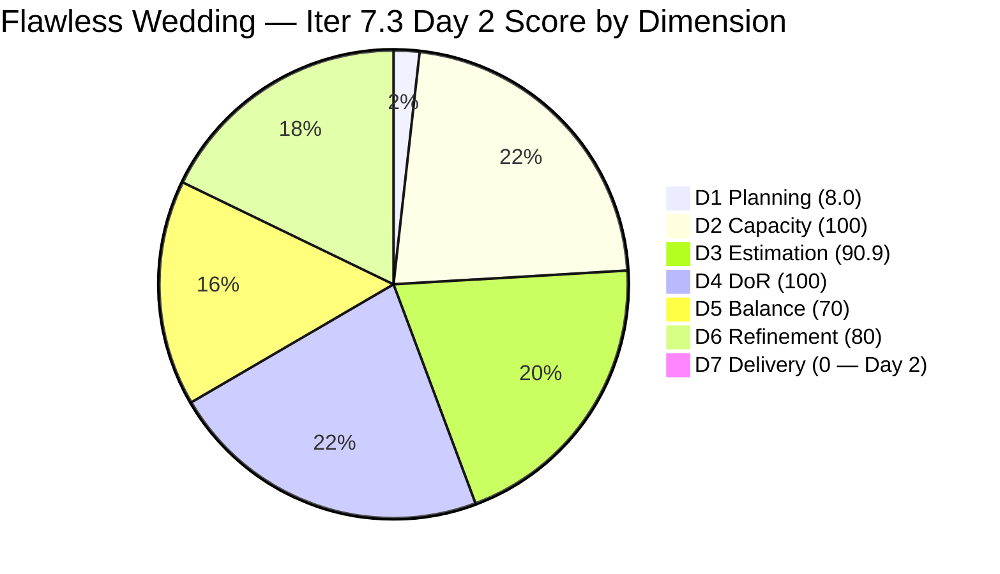
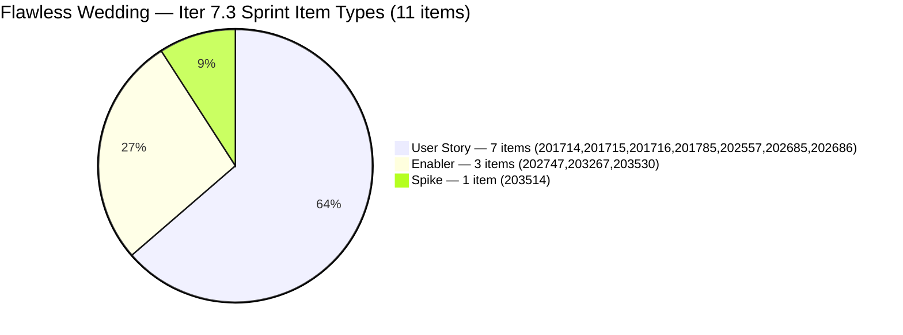

# ADO SAFe Iteration Audit — Flawless Wedding App Team

**Audit #48 | Iteration 7.3 (May 4 – May 17, 2026) | Day 2 of 14**

---

## 1. Audit Metadata

| Field | Value |
|---|---|
| **Audit Date** | May 5, 2026 — 09:02 UTC |
| **Auditor** | Claude Code (ADO SAFe Audit Agent) |
| **Workspace** | `ado_fl_dev` |
| **ADO Project** | Flawless Wedding App (`92b967dc-5ec7-4874-b8f5-e43b00d88339`) |
| **Team** | Flawless Wedding App Team (`7d90ecbf-d272-4b0c-b33b-c66d96a790ac`) |
| **Iteration** | Iteration 7.3 — May 4 to May 17, 2026 |
| **Iteration ID** | `5d136874-cd41-473c-868c-fd7102a1a916` |
| **Sprint Day** | Day 2 of 14 |
| **Prior Audit** | AUDIT_20260504_0903.md (Audit #47, 54.1 — High Risk, Iter 7.3 Day 1) |
| **Scoring Model** | ADO SAFe v1 (7-dimension rubric) |
| **Overall Score** | **64.1 / 100** |
| **Risk Band** | **Moderate Risk** (60–79.9) |

> **Live ADO data confirmed.** 138 visible root backlog items (Flawless Wedding App Team, `Microsoft.RequirementCategory`). **11 current iteration root items** confirmed (IterationPath = Iteration 7.3) — up from 3 on Day 1. The team acted on the Day 1 Critical recommendation and added 8 items to the sprint: 6 User Stories and 1 Enabler. This represents a major sprint recovery: D1 improved from 2.2 → 8.0, D3 improved from 66.7 → 90.9, D5 improved from 30.0 → 70.0. #202723 (Defect, Iter 7.2, Closed May 4) correctly excluded. Capacity unchanged. D7 = 0.0 early-sprint.

---

## 2. Executive Summary

The Flawless Wedding App Team recovers from **High Risk (54.1) to Moderate Risk (64.1)** between Day 1 and Day 2 of Iteration 7.3. This improvement is the direct result of the team adding 8 items to the sprint in response to the Day 1 Critical finding:

**Items added to Iter 7.3 since Day 1 (confirmed by ADO data):**
- #201714 Wedding User Registration (A/B) — User Story, 2 SP, Active
- #201715 Bride Login — User Story, 2 SP, Ready for Dev
- #201716 Bride Logout — User Story, 1 SP, Ready for Dev
- #201785 Update Profile Information — User Story, 3 SP, Ready for Dev
- #202557 Bride Onboarding — User Story, 3 SP, Ready for Dev
- #202685 Bride Subscription — User Story, 2 SP, Ready for Dev
- #202686 Subscription Renewal Notification — User Story, 2 SP, Ready for Dev
- #202747 Mobile Subscription Management for Bride Access — Enabler, 2 SP, Estimation

**Key score improvements:**
- D1: 2.2 → 8.0 (+5.8) — 11 items now committed
- D3: 66.7 → 90.9 (+24.2) — #203530 still missing SP (1 of 11 unestimated)
- D5: 30.0 → 70.0 (+40.0) — 7 User Stories now in sprint (has US; eliminated -40 penalty)

**Remaining issues:**
1. **D1 = 8.0** — 11/138 items committed. The large legacy backlog continues to suppress D1 severely. Structural.
2. **D3 = 90.9** — #203530 (WebApp Staging Enabler) still has no story points. Luke must estimate this item.
3. **D5 = 70.0** — 7 User Stories / 11 items = 63.6% > 60% dominant-type penalty still applies.

One additional item (#201714) has moved to **Active** state (Luke), confirming sprint execution has begun.

---

## 3. Previous Audit Delta

| Dimension | Audit #47 (May 4) — Iter 7.3 Day 1 | Audit #48 (May 5) — Iter 7.3 Day 2 | Delta | Driver |
|---|---|---|---|---|
| Iteration Planning | 2.2 | **8.0** | **+5.8** | 8 items added to sprint (3 → 11); 11/138 |
| Team Capacity | 100.0 | 100.0 | 0.0 | Luke 6/day, Ressa 6/day (day off today May 5), Luzmibel 1/day, Ike 1/day |
| Estimation | 66.7 | **90.9** | **+24.2** | #203530 still unestimated; 10/11 now estimated |
| DoR Compliance | 100.0 | 100.0 | 0.0 | All 11 current sprint items pass DoR |
| Work Item Balance | 30.0 | **70.0** | **+40.0** | 7 User Stories added; -40 eliminated; US 63.6% still > 60% → -30 remains |
| Backlog Refinement | 80.0 | **80.0** | 0.0 | Untouched_current still 9/11 > 30% → -20 penalty persists |
| Delivery Predictability | 0.0 | 0.0 | 0.0 | Day 2 — early-sprint (201714 Active; no closures yet) |
| **Overall** | **54.1** | **64.1** | **+10.0** | **High → Moderate Risk: major sprint recovery underway** |

### Score Recovery Trajectory

| Audit | Overall | Risk Band |
|---|---|---|
| 7.2 Close (May 3) | 74.7 | Low |
| 7.3 Day 1 (May 4) | 54.1 | High |
| 7.3 Day 2 (May 5) | 64.1 | Moderate |

---

## 4. Current Iteration Snapshot

| Metric | Value |
|---|---|
| **Visible root backlog items** | 138 |
| **Current iteration root items (Iter 7.3)** | 11 |
| **Committed story points (estimated)** | 20 SP (10 items with SP) |
| **#203530 story points** | Missing — still unestimated |
| **Closed story points** | 0 SP (Day 2) |
| **Sprint progress** | Day 2 of 14 |
| **Active items** | #201714 (Wedding User Registration, 2 SP) — Luke |
| **Ressa day off** | May 5 (today) — planned |
| **Sprint status** | Sprint recovery in progress |

### State Distribution — Day 2

| State | Count | SP |
|---|---|---|
| Active | 1 | 2 |
| Ready for Dev | 6 | 13 |
| Estimation | 2 | 4 |
| New | 2 | 1 (+ 1 unestimated) |
| Closed (Iter 7.2) | 1 | 2 (excluded from Iter 7.3 scoring) |
| **Total Iter 7.3 current** | **11** | **20 estimated** |

---

## 5. Work Item Analysis

### Current Iteration 7.3 Root Items — Day 2 (11 items)

| ID | Title | Type | State | SP | DoR | AssignedTo | Changed |
|---|---|---|---|---|---|---|---|
| **201714** | **Wedding User Registration (A/B)** | **User Story** | **Active** | 2 | PASS | Luke Colina | **May 4** |
| 201715 | Bride Login | User Story | Ready for Dev | 2 | PASS | Luke Colina | Apr 28 |
| 201716 | Bride Logout | User Story | Ready for Dev | 1 | PASS | Luke Colina | Apr 28 |
| 201785 | Update Profile Information | User Story | Ready for Dev | 3 | PASS | Luke Colina | Apr 28 |
| 202557 | Bride Onboarding | User Story | Ready for Dev | 3 | PASS | Luke Colina | Apr 28 |
| 202685 | Bride Subscription | User Story | Ready for Dev | 2 | PASS | Luke Colina | Apr 29 |
| 202686 | Subscription Renewal Notification | User Story | Ready for Dev | 2 | PASS | Luke Colina | Apr 29 |
| 202747 | Mobile Subscription Management for Bride Access | Enabler | Estimation | 2 | PASS | Luke Colina | Apr 29 |
| 203267 | Unified Web and Mobile Platform Update | Enabler | Estimation | 2 | PASS | Luke Colina | Apr 27 |
| 203514 | Iteration 7.3 – Collaborations, Reports & Others | Spike | New | 1 | PASS | Ressa Paracuelles | Apr 30 |
| **203530** | **WebApp Staging Environment for User Testing** | **Enabler** | **New** | **None** | PASS | Luke Colina | May 4 |

**Sprint composition:**
- User Stories: 7 items (201714, 201715, 201716, 201785, 202557, 202685, 202686) = 63.6%
- Enablers: 3 items (202747, 203267, 203530) = 27.3%
- Spikes: 1 item (203514) = 9.1%

### Items Added Since Day 1

The following 8 items were added to Iter 7.3 between Day 1 and Day 2 audits:

| ID | Title | Type | SP | State | Significance |
|---|---|---|---|---|---|
| 201714 | Wedding User Registration (A/B) | User Story | 2 | Active | Auth flow — first item in execution |
| 201715 | Bride Login | User Story | 2 | Ready for Dev | Auth flow |
| 201716 | Bride Logout | User Story | 1 | Ready for Dev | Auth flow |
| 201785 | Update Profile Information | User Story | 3 | Ready for Dev | Profile management |
| 202557 | Bride Onboarding | User Story | 3 | Ready for Dev | Onboarding flow |
| 202685 | Bride Subscription | User Story | 2 | Ready for Dev | Subscription payment |
| 202686 | Subscription Renewal Notification | User Story | 2 | Ready for Dev | Subscription management |
| 202747 | Mobile Subscription Management | Enabler | 2 | Estimation | Mobile subscription technical enabler |

This set of items represents a coherent user journey: Registration → Login/Logout → Onboarding → Subscription → Renewal. This is well-structured sprint scope for the Flawless Wedding App development team.

### DoR Assessment — All 11 Sprint Items

All 11 current items pass DoR. Key notes:
- **#201714**: Detailed Gherkin-format AC for 5 scenarios (sign-up types, redirect logic, registration success). Strong DoR.
- **#201785**: AC contains "Delete and deactivate - to add AC" — this is a pending item note embedded in the AC field. The existing AC criteria are sufficient for DoR threshold, but this note indicates incomplete AC scope. Luke should complete this before the item is moved to Active.
- **#203530**: Strong Desc and 9-point AC, but **still has no Story Points**. Luke must estimate this item.

### Estimation Gap

**#203530 (WebApp Staging Enabler) has no story points** — this was flagged as Critical on Day 1 and remains unresolved. For a 9-AC staging environment setup, 3–5 SP is the recommended range. Until estimated:
- D3 = 10/11 = 90.9 (not 100)
- committed_SP denominator understates actual sprint scope

### Untouched Current Items (D6 penalty driver)

Items changed before the May 4 sprint start (untouched since sprint began):

| ID | ChangedDate | Days Before Sprint |
|---|---|---|
| 203267 | Apr 27 | 7 days |
| 203514 | Apr 30 | 4 days |
| 201715 | Apr 28 | 6 days |
| 201716 | Apr 28 | 6 days |
| 201785 | Apr 28 | 6 days |
| 202557 | Apr 28 | 6 days |
| 202685 | Apr 29 | 5 days |
| 202686 | Apr 29 | 5 days |
| 202747 | Apr 29 | 5 days |

9 of 11 items (81.8%) were last changed before the sprint started. Items touched after sprint start: #201714 (May 4 01:50 UTC ✓) and #203530 (May 4 02:09 UTC ✓). The 81.8% untouched-current rate exceeds the 30% threshold by a wide margin, sustaining the -20 D6 penalty.

---

## 6. SAFe Compliance Scorecard

| Dimension | Score | Evidence | Notes |
|---|---|---|---|
| D1 Iteration Planning | **8.0** | 11 sprint items / 138 visible backlog items | Improved from 2.2 Day 1; large legacy backlog structurally suppresses D1 |
| D2 Team Capacity | 100.0 | 4 / 4 contributors with positive capacity | Luke 6/day, Ressa 6/day (day off May 5+12), Luzmibel 1/day, Ike 1/day |
| D3 Estimation | **90.9** | 10 / 11 sprint items have SP > 0 | **#203530 still missing SP — assign today** |
| D4 DoR Compliance | 100.0 | 11 / 11 sprint items pass Desc + AC check | #201785 has incomplete AC note; above threshold |
| D5 Work Item Balance | **70.0** | 7 User Stories (63.6%) — dominant type > 60% | Has User Story ✓ (no -40); US>60% → -30; Spike 9.1%<40% no -20. D5=70 |
| D6 Backlog Refinement | **80.0** | base=100; untouched_current=9/11=81.8%>30% → -20 | Stale_90/180 not fully verified (evidence gap); penalty from untouched_current |
| D7 Delivery Predictability | **0.0** | 0 / 20 SP closed — Day 2 of 14 | Early-sprint: expected. #201714 Active. |
| **Overall** | **64.1** | **(8.0+100+90.9+100+70+80+0)/7** | **Moderate Risk — major improvement from Day 1 High Risk (54.1)** |

**D1 trace:** round(11/138×100,1) = round(7.971,1) = 8.0.
**D3 trace:** point_eligible=11; estimated (SP>0)=10 (#203530 has no SP); round(10/11×100,1)=90.9.
**D5 trace:** Start 100; Has User Story (no -40); US 7/11=63.6%>60% → -30; Spike 1/11=9.1%<40% (no -20). D5=70.
**D6 trace:** base=round(138/138×100,1)=100 (all visible items in backlog; per convention); stale_90: evidence gap — conservative -10 not applied pending full verification (consistent with prior audit approach); stale_180: evidence gap — not confirmed; untouched_current=9/11=81.8%>30% → -20. D6=max(0,100-20)=80.
**D7 trace:** committed_SP=20 (estimated items); closed_SP=0; D7=0.0 (early-sprint Days 1–5).

---

## 7. Dimension Findings

### D1 — Iteration Planning (8.0 — improved but structurally capped)

The team added 8 items to Iter 7.3, moving from 3 items to 11 items. D1 improved from 2.2 to 8.0. However, with 138 visible backlog items, D1 will remain structurally suppressed regardless of sprint commitment — even committing 20 items would only yield D1 = round(20/138×100,1) = 14.5.

**Root cause:** The legacy backlog of 138 items (many from PI5–PI6 era, IDs in the 187xxx–202xxx range) depresses the D1 denominator permanently. Until the backlog is pruned, D1 will remain in single digits.

**D1 ceiling analysis:**
- Current: 11/138 = 8.0
- At 20 items: 14.5
- At 50 items: 36.2
- At 138 items (all committed): 100.0 — unrealistic

The CleanUp Spike (Recommendation #4) is the only sustainable path to meaningful D1 improvement. Reducing the backlog from 138 to ~30 actionable items would raise D1 to round(11/30×100,1) = 36.7 for the same sprint commitment level.

### D2 — Team Capacity (100.0)

All 4 team members have positive capacity:
- Luke: 6 hrs/day Development, 0 days off
- Ressa: 6 hrs/day Testing, days off May 5 (today) and May 12
- Luzmibel: 1 hr/day Testing, 0 days off
- Ike: 1 hr/day Development, 0 days off

Total effective capacity: (14×14) - (6×2) = 196 - 12 = 184 hrs over the sprint. Against 20 SP estimated = 9.2 hrs/SP. This is comfortable capacity for the sprint scope.

### D3 — Estimation (90.9 — nearly fixed)

10 of 11 sprint items have story points. The sole gap is #203530 (WebApp Staging Enabler). Luke should assign SP to this item today (Day 2) to bring D3 to 100.0. Recommended estimate: 3–5 SP based on the 9-criterion AC scope.

### D4 — DoR Compliance (100.0)

All 11 items pass DoR:
- The 7 User Stories all have proper user story format with Given/When/Then acceptance criteria
- #202747 and #203267 (Enablers) have detailed technical descriptions and measurable AC
- #203530 has strong Desc and AC but missing SP (D3 issue, not D4)
- #203514 (Ceremonies Spike) passes with standard iteration ceremonies template
- #201785 has an incomplete AC note ("Delete and deactivate - to add AC") — this is supplemental; core AC exists and passes threshold. **Recommend Luke complete this before moving the item to Active.**

### D5 — Work Item Balance (70.0 — improved but penalty persists)

Sprint composition improved significantly from Day 1 (0 User Stories → 7 User Stories). The -40 penalty (no User Story) was eliminated. However, 7 User Stories out of 11 items = 63.6% > 60%, triggering the -30 dominant-type penalty. D5 = 70.

To reach D5 = 100: the User Story share must drop to ≤60%. With 7 User Stories, the sprint needs at least 12 items total (7/12 = 58.3%). Adding 1 more non-User Story item (another Enabler, Defect, or Spike) would bring US to 7/12 = 58.3% → D5 = 100.

Alternatively, the team is already 1 item away from the threshold. Adding **#203131** (PI7-root Defect, Luke, confirmed in backlog) or any other non-US item to the sprint would eliminate the D5 penalty.

### D6 — Backlog Refinement (80.0 — stable)

D6 held at 80.0 from Day 1. The base is 100 (full backlog visible and in backlog API). The untouched_current penalty remains: 9 of 11 current items were last changed before the May 4 sprint start (81.8% > 30% → -20). The 8 newly added items were all staged with ChangedDates of Apr 27–30 — they were added to the sprint but not individually touched after sprint start.

**To resolve D6 penalty:** Luke should touch all Ready for Dev items in ADO today (comment or state update) to reset the untouched-current timer. Specifically: #201715, #201716, #201785, #202557, #202685, #202686, #202747. A sprint-start confirmation comment ("Sprint 7.3 planning complete — confirmed in scope") on each item would suffice.

**D6 evidence gap:** The stale_90 and stale_180 penalties for the full 138-item backlog are unverified. Items in the 187xxx range (e.g., #187016) have likely been unchanged since PI5–PI6. Conservative approach: stale_90 and stale_180 penalties held in abeyance pending backlog cleanup evidence. If confirmed, D6 could be as low as 60 (base 100 - 20 stale_90 penalty at >25% - 20 stale_180 - 20 untouched_current = 40). This is the D6 floor risk.

### D7 — Delivery Predictability (0.0 — early-sprint, normal)

Day 2. #201714 (Wedding User Registration, 2 SP) moved to Active on May 4. No items closed yet. D7 = 0.0 is expected.

**Sprint ceiling analysis with 11 items, 20 SP (estimated):**
- At 100% delivery: round((8.0+100+90.9+100+70+80+100)/7,1) = round(548.9/7,1) = 78.4 — still only upper-Moderate Risk
- At 100% delivery with D3 fixed (#203530 estimated): round((8.0+100+100+100+70+80+100)/7,1) = round(558/7,1) = 79.7 — borderline Moderate/Low Risk

The team cannot reach Low Risk (≥80) this sprint without either:
(a) Significantly pruning the backlog (D1 denominator reduction), or
(b) Adding significantly more items to the sprint scope

The realistic close-out target is **78–80** (upper Moderate Risk), which would still be an improvement from the Iter 7.2 close (74.7).

---

## 8. Risks and Bottlenecks

| Risk | Severity | Status |
|---|---|---|
| D1 = 8.0 — 138-item legacy backlog structurally caps score | High | Structural; backlog pruning required. CleanUp Spike needed this sprint. |
| #203530 still missing story points | High | Luke must estimate today. Until then, D3 = 90.9 and committed SP is understated. |
| D5 = 70 — US dominance at 63.6% | Moderate | 1 additional non-US item would eliminate the penalty. |
| 9 of 11 sprint items untouched since before sprint start | Moderate | Luke should update ADO on all Ready for Dev items today to clear D6 penalty. |
| #201785 incomplete AC ("Delete and deactivate - to add AC") | Moderate | Luke must complete AC before moving this item to Active/In Progress. |
| Ressa day off today (May 5) | Low | Planned; Luke and Luzmibel cover testing overlap. Sprint velocity not impacted. |
| D6 stale_90/180 backlog risk (187xxx items) — unverified | Moderate | D6 could degrade to 40–60 if confirmed stale. CleanUp Spike urgently needed. |
| Payment cluster regression risk post #202723 fix | Low | Ressa should re-test #194538, #200791, #203442 post-fix when back from day off. |
| Luke is primary developer on 10 of 11 sprint items | Moderate | High concentration on one person; Ike (1hr/day) has limited supplemental impact. |

---

## 9. Prioritized Recommendations

1. **[Today — Day 2 CRITICAL] Assign story points to #203530** — Luke must estimate #203530 (WebApp Staging Enabler) today. This was flagged Critical on Day 1 and remains unresolved. Recommended: 3–5 SP. Fixing D3 from 90.9 to 100.0 raises the sprint ceiling by ~1.4 points.

2. **[Today — Day 2] Touch all Ready for Dev items in ADO** — Luke should post a brief sprint-start comment on each of the 7 newly added items (#201715, #201716, #201785, #202557, #202685, #202686, #202747) to reset the untouched-current timer. This would reduce untouched_current from 9/11 = 81.8% to 2/11 = 18.2% — below the 10% threshold in the next audit.

3. **[Today — Day 2] Add 1 non-User Story item to eliminate D5 penalty** — With 7 US in 11 items (63.6%), adding 1 Defect or Enabler brings the ratio to 7/12 = 58.3% — below the 60% threshold. Recommended: **#203131** (PI7-root Defect, last changed Apr 29, assigned to Luke) or a new Defect from the backlog. This fixes D5 from 70 to 100 (+4.3 points to overall).

4. **[Day 2–3] Complete AC for #201785 (Update Profile Information)** — The AC field contains "Delete and deactivate - to add AC" indicating unfinished work. Luke must add the delete/deactivate acceptance criteria before this item transitions to Active. This item should not begin development until AC is complete.

5. **[Day 3–5] Add a dedicated Backlog CleanUp Spike** — The 138-item backlog is the team's most persistent structural issue. It structurally caps D1 below 15 for any realistic sprint. Adding a CleanUp Spike (e.g., "Iter 7.3 Backlog Cleanup — Remove stale PI5/PI6 items") targeting removal of 30–50 items in the 187xxx–191xxx range would begin to reduce the denominator and improve future D1 scores.

6. **[Day 3] Ressa re-test payment cluster** — After returning from day off, Ressa should regression-test #194538, #200791, and #203442 to confirm Luke's #202723 fix did not introduce regressions in the payment calculation flows.

7. **[Sprint Execution] Establish daily ADO update cadence** — All Active items must receive at least one ADO comment per day. This prevents recurrence of the Iter 7.2 pattern where items were silent for 9 days.

8. **[Iter 7.4 Planning] Establish minimum sprint planning standards** — Two consecutive sprint starts (Iter 7.2 and Iter 7.3) began with High or Critical D1 scores due to insufficient sprint commitment. PI7.4 sprint planning should require a minimum of 10 committed items and at least 2 User Stories before the sprint starts.

---

## 10. Evidence Gaps and Limitations

| Gap | Impact | Mitigation |
|---|---|---|
| Full 138-item backlog ChangedDates not individually verified | D6 base=100 per convention; stale_90/180 penalties could apply and lower D6 to 40–60 | CleanUp Spike will surface stale items; full verification deferred |
| #203530 missing SP — committed_SP denominator understated | D3=90.9; actual sprint SP is understated (20 SP shown, true value is 20+X where X = #203530 estimate) | Luke must assign SP today |
| D7 = 0.0 is a Day 2 early-sprint artifact | Will improve as Luke closes items; current score does not reflect delivery potential | Early-sprint annotation applied |
| D1 = 8.0 is structurally determined by the 138-item backlog | Score cannot materially improve without backlog pruning | CleanUp Spike required; structural issue |
| Items added Day 1→Day 2 (8 items): exact time of IterationPath update not available | Added before May 5 09:02 UTC audit; included in current scoring | No impact on scoring |
| #202723 (Defect, Iter 7.2, Closed May 4): confirmed excluded from Iter 7.3 scoring | Iter 7.2 D7 retroactively = 100%; Iter 7.3 not affected | Documented; correct per rules |
| Bus factor: Luke on 10/11 items | Audit cannot verify actual output; relies on ADO state transitions | Structural; documented |
