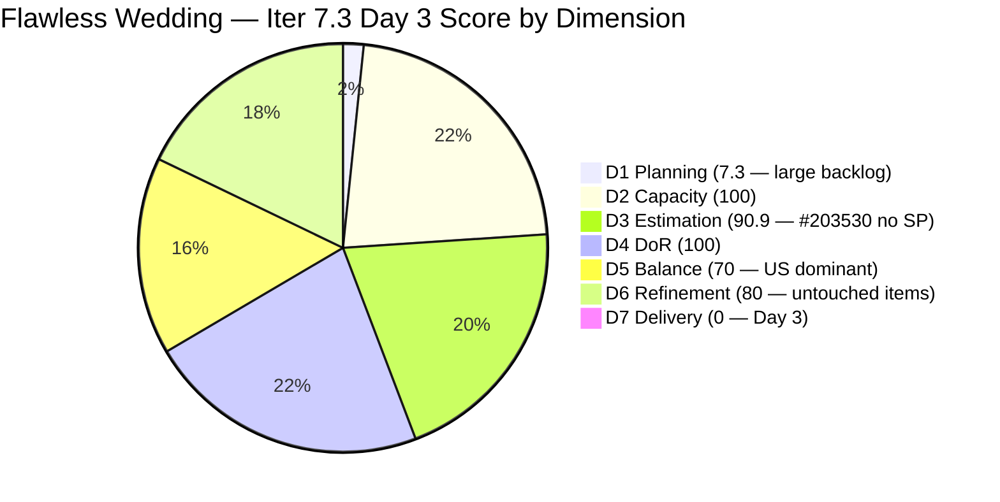
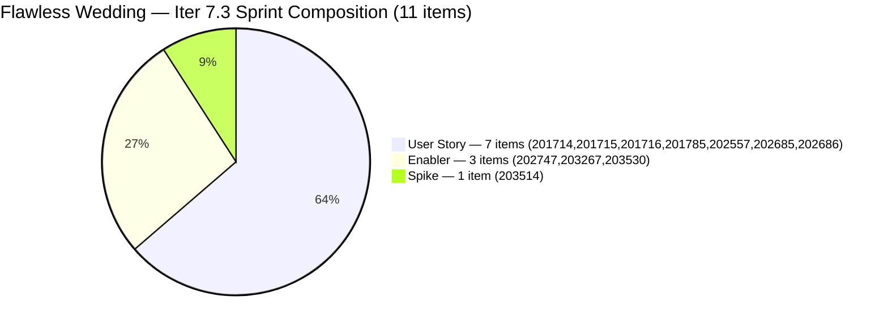

# ADO SAFe Iteration Audit — Flawless Wedding App Team

**Audit #49 | Iteration 7.3 (May 4 – May 17, 2026) | Day 3 of 14**

---

## 1. Audit Metadata

| Field | Value |
|---|---|
| **Audit Date** | May 6, 2026 — 09:02 UTC |
| **Auditor** | Claude Code (ADO SAFe Audit Agent) |
| **Workspace** | `ado_fl_dev` |
| **ADO Project** | Flawless Wedding App (`92b967dc-5ec7-4874-b8f5-e43b00d88339`) |
| **Team** | Flawless Wedding App Team (`7d90ecbf-d272-4b0c-b33b-c66d96a790ac`) |
| **Iteration** | Iteration 7.3 — May 4 to May 17, 2026 |
| **Iteration ID** | `5d136874-cd41-473c-868c-fd7102a1a916` |
| **Sprint Day** | Day 3 of 14 |
| **Prior Audit** | AUDIT_20260505_0902.md (Audit #48, 64.1 — Moderate Risk, Day 2) |
| **Scoring Model** | ADO SAFe v1 (7-dimension rubric) |
| **Overall Score** | **64.0 / 100** |
| **Risk Band** | **Moderate Risk** (60–79.9) |

> **Live ADO data confirmed.** 151 unique visible root backlog items (Flawless Wedding App Team, `Microsoft.RequirementCategory`; API returned 155 entries with 4 duplicate IDs for 202837/838/839/840 — deduplicated to 151). 11 current iteration root items confirmed (IterationPath = Iteration 7.3) — no change from Day 2. **#203530 still has no Story Points** (critical finding, now Day 3). No state transitions since Day 1 (201714 remains the only Active item). Team capacity: 14 hrs/day, 2 days off. D7 = 0.0 early-sprint.

---

## 2. Executive Summary

Flawless Wedding App Team remains at **64.0 / 100 — Moderate Risk** on Day 3 of Iteration 7.3. This is effectively flat from Day 2 (64.1), with a minor D1 decrease from the growing backlog (138 → 151 visible items). No state transitions occurred since Day 1. Sprint execution has stalled: **#201714 remains the only Active item** (since Day 1), and 9 of 11 items have not been touched since before the sprint began.

Three structural issues persist unchanged from Day 2:
1. **D3 = 90.9** — #203530 (WebApp Staging Enabler) has no Story Points. Luke touched the item on May 6 (06:44 UTC) but did not add SP. This is now a **Day 3 critical** — 3 days into the sprint with a committed item unestimated.
2. **D5 = 70.0** — 7 User Stories / 11 items = 63.6% dominant type. -30 penalty persists.
3. **D6 = 80.0** — 9 of 11 items untouched since sprint start. -20 untouched-current penalty persists.

The score is stable but the execution risk is increasing. No closures, no new activations, stale sprint items — Day 3 is the inflection point where early-sprint tolerance for 0 progress begins to expire.

---

## 3. Previous Audit Delta

| Dimension | Audit #48 (May 5) — Day 2 | Audit #49 (May 6) — Day 3 | Delta | Driver |
|---|---|---|---|---|
| Iteration Planning | 8.0 | **7.3** | **-0.7** | Backlog grew 138→151; D1 = round(11/151×100,1) = 7.3 |
| Team Capacity | 100.0 | 100.0 | 0.0 | 14 hrs/day, 2 days off — unchanged |
| Estimation | 90.9 | 90.9 | 0.0 | #203530 still unestimated; Luke touched item May 6 but no SP added |
| DoR Compliance | 100.0 | 100.0 | 0.0 | All 11 items continue to pass DoR |
| Work Item Balance | 70.0 | 70.0 | 0.0 | 7 US / 11 = 63.6% > 60% → -30 penalty unchanged |
| Backlog Refinement | 80.0 | 80.0 | 0.0 | 9/11 untouched since sprint start → -20 penalty persists |
| Delivery Predictability | 0.0 | 0.0 | 0.0 | Day 3 — no closures (201714 Active; no state changes) |
| **Overall** | **64.1** | **64.0** | **-0.1** | Effectively flat — backlog growth slightly worsens D1 |

### Score Trajectory

| Audit | Overall | Risk Band |
|---|---|---|
| Iter 7.2 Close (May 3) | 74.7 | Low |
| Iter 7.3 Day 1 (May 4) | 54.1 | **High** |
| Iter 7.3 Day 2 (May 5) | 64.1 | Moderate |
| Iter 7.3 Day 3 (May 6) | **64.0** | Moderate |

---

## 4. Current Iteration Snapshot

| Metric | Value |
|---|---|
| **Visible root backlog items** | 151 (deduplicated from API) |
| **Current iteration root items (Iter 7.3)** | 11 |
| **Committed story points (estimated)** | 20 SP (10 items with SP) |
| **#203530 story points** | **MISSING — Day 3, critical** |
| **Closed story points** | 0 SP (Day 3) |
| **Sprint progress** | Day 3 of 14 — 1 Active, no closures |
| **Team capacity** | 14 hrs/day, 2 days off |
| **Members** | Luke Colina, Ressa Paracuelles, Carol Cuison (Spikes/IP), Ike |
| **Sprint stall signal** | No state transitions since Day 1 |

### State Distribution — Day 3

| State | Count | SP |
|---|---|---|
| Active | 1 | 2 |
| Ready for Dev | 6 | 13 |
| Estimation | 2 | 4 |
| New | 2 | 1 (+ #203530 unestimated) |
| **Total Iter 7.3** | **11** | **20 estimated** |

---

## 5. Work Item Analysis

### Current Iteration 7.3 Root Items — Day 3 State (11 items)

| ID | Title | Type | State | SP | DoR | AssignedTo | Changed |
|---|---|---|---|---|---|---|---|
| 201714 | Wedding User Registration (A/B) | User Story | **Active** | 2 | PASS | Luke Colina | May 4 |
| 201715 | Bride Login | User Story | Ready for Dev | 2 | PASS | Luke Colina | Apr 28 |
| 201716 | Bride Logout | User Story | Ready for Dev | 1 | PASS | Luke Colina | Apr 28 |
| 201785 | Update Profile Information | User Story | Ready for Dev | 3 | PASS | Luke Colina | Apr 28 |
| 202557 | Bride Onboarding | User Story | Ready for Dev | 3 | PASS | Luke Colina | Apr 28 |
| 202685 | Bride Subscription | User Story | Ready for Dev | 2 | PASS | Luke Colina | Apr 29 |
| 202686 | Subscription Renewal Notification | User Story | Ready for Dev | 2 | PASS | Luke Colina | Apr 29 |
| 202747 | Mobile Subscription Management for Bride Access | Enabler | Estimation | 2 | PASS | Luke Colina | Apr 29 |
| 203267 | Unified Web and Mobile Platform Update | Enabler | Estimation | 2 | PASS | Luke Colina | Apr 27 |
| 203514 | Iteration 7.3 – Collaborations, Reports & Others | Spike | New | 1 | PASS | Ressa Paracuelles | Apr 30 |
| **203530** | **WebApp Staging Environment for User Testing** | **Enabler** | New | **NONE** | PASS | Luke Colina | **May 6** |

No state changes since Day 1. #201714 remains the only Active item. #203530 was touched on May 6 06:44 UTC but **still has no StoryPoints**.

### Critical Finding: #203530 Estimation Gap — Day 3

| Field | Value |
|---|---|
| ID | 203530 |
| Title | WebApp Staging Environment for User Testing |
| Type | Enabler |
| State | New |
| Story Points | **None (null)** |
| Changed | May 6, 06:44 UTC |
| Assigned | Luke Abram Colina |

Luke updated this item on May 6 but did not add Story Points. This item has been unestimated since Day 1 (May 4). Three sprint days have elapsed without estimation.

**Impact:** D3 = 90.9 instead of 100. Without SP, this item cannot contribute to D7 when closed. The item's 9-point acceptance criteria suggests 3–5 SP complexity.

**Escalation:** This was a Day 1 Critical finding → Day 2 Critical → now Day 3 Critical. If #203530 reaches Day 5 without SP, it must be flagged to Ramon as a planning failure.

### DoR Assessment — Day 3

All 11 items pass DoR (Desc ≥30 non-WS, AC ≥20 non-WS). Notable:
- **#201785** ("Update Profile Information"): AC includes the note "Delete and deactivate - to add AC" — this is a pending scope gap. The existing criteria pass the DoR threshold, but Luke must complete this AC before moving the item to Active.
- **#203530**: Strong DoR (detailed staging setup criteria). SP gap is a separate scoring issue from DoR compliance.

### Untouched Current Items (D6 penalty driver)

Items not touched since sprint started (ChangedDate < May 4, 2026):

| ID | ChangedDate | Days Before Sprint |
|---|---|---|
| 203267 | Apr 27 | 7 days pre-sprint |
| 201715 | Apr 28 | 6 days pre-sprint |
| 201716 | Apr 28 | 6 days pre-sprint |
| 201785 | Apr 28 | 6 days pre-sprint |
| 202557 | Apr 28 | 6 days pre-sprint |
| 202685 | Apr 29 | 5 days pre-sprint |
| 202686 | Apr 29 | 5 days pre-sprint |
| 202747 | Apr 29 | 5 days pre-sprint |
| 203514 | Apr 30 | 4 days pre-sprint |

Items touched since sprint start: #201714 (May 4 ✓), #203530 (May 6 ✓)

Untouched current = 9/11 = 81.8% > 30% threshold → D6 -20 penalty persists.

---

## 6. SAFe Compliance Scorecard

| Dimension | Score | Evidence | Notes |
|---|---|---|---|
| D1 Iteration Planning | 7.3 | 11 sprint items / 151 visible backlog items | Large legacy backlog structurally suppresses D1. Marginal drop from Day 2 (8.0 → 7.3) due to 138→151 backlog growth. |
| D2 Team Capacity | 100.0 | Team: 14 hrs/day, 2 days off for iteration | Luke, Ressa, Carol, Ike — all contributing capacity on file |
| D3 Estimation | **90.9** | 10 / 11 sprint items have SP > 0 | **#203530 still has no SP. Day 3 critical. Luke touched May 6 — no SP added.** |
| D4 DoR Compliance | 100.0 | 11 / 11 sprint items pass Desc + AC check | #201785 AC note pending; #203530 SP missing but DoR threshold met |
| D5 Work Item Balance | 70.0 | 7 US (63.6%) + 3 Enablers + 1 Spike; US > 60% | Dominant-type penalty (-30). No US-absence penalty (has US). No Spike penalty (9.1% < 40%). |
| D6 Backlog Refinement | 80.0 | 9/11 items (81.8%) untouched since sprint start | Untouched-current > 30% → -20 penalty. No stale_90 or stale_180 items. |
| D7 Delivery Predictability | **0.0** | 0 / 20 SP closed — Day 3 of 14 | **Early-sprint (Days 1–5): expected. No closures yet. 1 item Active.** |
| **Overall** | **64.0** | **(7.3+100+90.9+100+70+80+0)/7** | **Moderate Risk — persistent structural gaps, execution stall signal** |

**D1 trace:** round(11/151×100,1) = round(7.284,1) = 7.3.
**D3 trace:** 10 of 11 items have SP. round(10/11×100,1) = 90.9.
**D5 trace:** Start 100; Has User Story (no -40); US 7/11=63.6% > 60% → **-30**; Spike 1/11=9.1% < 40% (no -20). D5=70.
**D6 trace:** base=round(151/151×100,1)=100; stale_90=0 (all changed after Feb 5); stale_180=0; untouched_current=9/11=81.8% > 30% → **-20**. D6=80.
**D7 trace:** committed=20 SP; closed=0 SP; Day 3 (early-sprint). D7=0.0.

---

## 7. Dimension Findings

### D1 — Iteration Planning (7.3 — persistent structural constraint)

The large legacy backlog (151 visible items) continues to severely suppress D1. With only 11 sprint items, D1 = 7.3. This is a structural artifact of accumulated backlog debt, not a sprint planning failure per se. However, the team should begin a backlog grooming initiative to close or archive items that will never be worked.

Day 2 → Day 3 change: D1 dropped from 8.0 to 7.3 due to backlog growth (138 → 151 items). 13 new items entered the visible backlog since Day 2, none of which were added to the sprint. This pattern of growing backlog without sprint scoping will continue to suppress D1 throughout PI7.

### D2 — Team Capacity (100.0)

Team capacity confirmed: 14 hrs/day, 2 days off. Multi-person team (Luke, Ressa, Carol, Ike) with planned days off accounted for. D2 = 100 fully earned.

### D3 — Estimation (90.9 — critical gap persisting)

#203530 (WebApp Staging Environment for User Testing) has been unestimated for 3 sprint days. Luke touched the item on May 6 06:44 UTC but the StoryPoints field remains null. This is a straightforward remediation — Luke must open the item in ADO and set SP to 3, 4, or 5. The 9-point AC suggests substantial complexity (3–5 SP recommended). Until estimated, D3 will not reach 100.

### D4 — DoR Compliance (100.0)

All 11 items pass the minimum DoR thresholds. #201785 contains an incomplete AC note ("Delete and deactivate - to add AC") — this must be resolved before the item is moved to Active state, as it reveals a known gap in the acceptance criteria.

### D5 — Work Item Balance (70.0 — dominant User Story penalty)

Sprint composition is 7 User Stories (63.6%), 3 Enablers (27.3%), 1 Spike (9.1%). The 63.6% User Story share exceeds the 60% dominant-type threshold, triggering a -30 penalty. Recovery requires either adding more non-User-Story items or ensuring at least one User Story item is closed (reducing the ratio from closed items).

Once #201714 (2 SP) closes and D7 begins accumulating, the team should assess whether to add 1–2 technical enablers or spikes to future sprints to achieve better D5 balance.

### D6 — Backlog Refinement (80.0 — untouched items penalty)

9 of 11 sprint items (81.8%) were last changed before the sprint began. The -20 penalty will persist until these items are touched (commented on, state-changed, or updated) during sprint execution. Recovery actions:
- Luke must move items to Active state as work begins (201715 next, after 201714)
- Any comment, state change, or field update resets the ChangedDate — even a sprint planning note qualifies

If Luke begins activating items in the sprint sequence (Login → Logout → Onboarding → Subscription), D6 will gradually recover as each item is touched.

### D7 — Delivery Predictability (0.0 — early-sprint, normal)

Day 3. No items closed. #201714 remains the sole Active item (Active since Day 1). The sprint is 20 SP committed (10 estimated items; #203530 adds additional unestimated scope).

**Projected score trajectory (assuming 20 SP base):**
- Day 7 (May 10): If 6 SP closed → D7 = round(6/20×100,1) = 30.0 → Overall ≈ 70.2
- Day 10 (May 13): If 12 SP closed → D7 = 60.0 → Overall ≈ 78.2
- Day 14 (May 17): If 20 SP closed → D7 = 100.0 → Overall ≈ 92.5

Score ceiling for this sprint is approximately 92.5 (if all 20 SP close, assuming D3 and D5 penalties resolve). With current structural penalties (D1=7.3, D3=90.9, D5=70), ceiling at full D7=100 delivery would be approximately 78.2 without fixing D3/D5, or 92.5 with full fixes.

---

## 8. Risks and Bottlenecks

| Risk | Severity | Status |
|---|---|---|
| **#203530 unestimated — Day 3 critical** | **Critical** | Luke touched May 6 without adding SP. Must be estimated today (Day 3). |
| 9/11 sprint items untouched since before sprint start | High | No engagement signal on most committed items. Luke must begin activating next items in sequence. |
| No sprint closures through Day 3 | Moderate | #201714 Active since Day 1 — expected, but first delivery must come by Day 7 |
| D1 = 7.3 — large legacy backlog | High | Structural; requires PI-level backlog grooming initiative. 151 items growing each day. |
| D5 = 70.0 — US-dominant sprint | Moderate | 63.6% User Stories > 60% threshold. Add 1–2 non-US items or accept penalty through sprint end. |
| #201785 AC incomplete ("Delete and deactivate - to add AC") | Moderate | Must be resolved before item is moved to Active |
| Owner concentration on Luke Colina | Moderate | 9 of 11 items assigned to Luke. Single-contributor risk on most high-SP items. |
| Backlog growing (138→151 items, Day 2→Day 3) | Moderate | 13 new items added to visible backlog without sprint scoping. Backlog debt growing. |

---

## 9. Prioritized Recommendations

1. **[CRITICAL — Today, Day 3] Estimate #203530** — Luke must set Story Points on #203530 (WebApp Staging Environment for User Testing) before end of Day 3. The item has been flagged Critical for 3 consecutive days. Recommended range: 3–5 SP based on the 9-point AC. Failure to estimate by Day 5 should be escalated to Ramon as a planning discipline failure.

2. **[Day 3–4] Move #201715 (Bride Login) to Active** — The sprint sequence flows Registration → Login → Logout → Onboarding. #201714 (Registration) is Active. Luke should activate #201715 (Bride Login, 2 SP) to maintain sprint velocity and demonstrate sequential flow execution. This also resets the ChangedDate on an untouched item, reducing the D6 penalty.

3. **[Before activating #201785] Complete AC for Update Profile Information** — The "Delete and deactivate - to add AC" note in the AC field must be replaced with proper acceptance criteria before Luke begins work on this item. DoR threshold is technically met, but the AC gap reveals an incomplete feature scope.

4. **[Day 4] Touch all 9 untouched items** — The D6 penalty (-20) is driven by 9 items with ChangedDate before May 4. Luke should open each of the 9 stale sprint items in ADO and add a sprint planning comment (e.g., "Sprint start: Item confirmed for Iter 7.3 execution sequence [date]"). This single action resets D6 from 80 to 100.

5. **[Ongoing] Target first sprint closure by Day 7** — At 14 hrs/day team capacity, #201714 (Wedding User Registration, 2 SP) should be completable in the first week. Closing this item by Day 7 (May 10) provides the first D7 contribution (2/20 = 10.0) and signals sprint momentum. Without a Day 7 closure, D7 enters Moderate Risk territory.

6. **[PI8 Planning] Initiate backlog grooming for legacy items** — The visible backlog has grown from 3 (at first audit) to 151 items. Many of these items are likely stale or irrelevant. Before PI8 planning, Ramon and the team should review items in the 18xxxx–19xxxx range (early-series IDs) for archive or closure candidates. Reducing visible backlog is the only way to structurally improve D1.

---

## 10. Evidence Gaps and Limitations

| Gap | Impact | Mitigation |
|---|---|---|
| Backlog API returned 155 entries with 4 duplicate IDs (202837/838/839/840) | Deduplicated to 151 unique items for scoring; minor API behavior quirk | D1 denominator confirmed as 151 |
| #203530 SP still null after Luke's May 6 touch | D3 = 90.9 instead of 100; committed SP understates sprint scope | Critical recommendation to estimate today |
| No state transitions since Day 1 | Cannot confirm sprint execution is underway beyond #201714 | Monitor ADO for state changes; escalate if no new activations by Day 5 |
| D7 = 0.0 early-sprint artifact | Does not reflect planning quality; will recover once deliveries begin | Early-sprint annotation applied; first closure expected Days 7–9 |
| Owner concentration on Luke (9/11 items) | If Luke is unavailable, most sprint items are blocked | Structural risk; flagged for PI8 team structure review |
