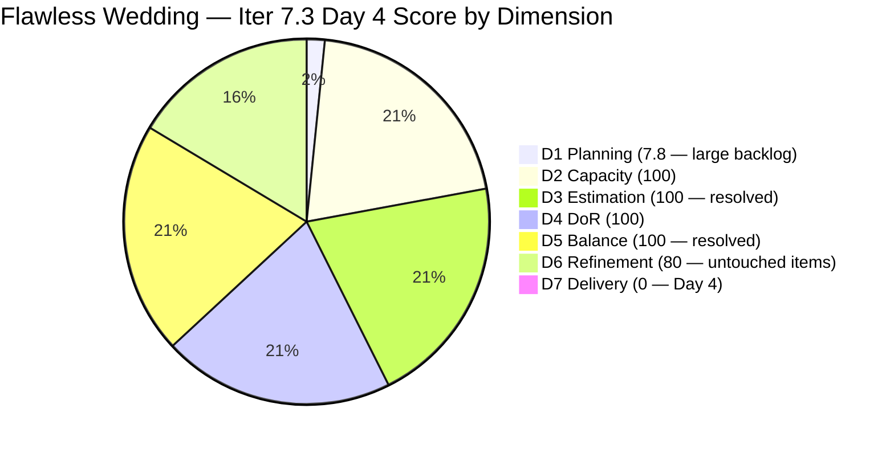
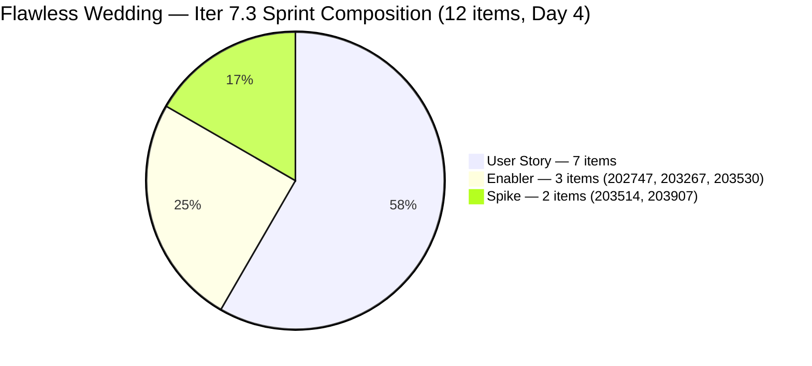
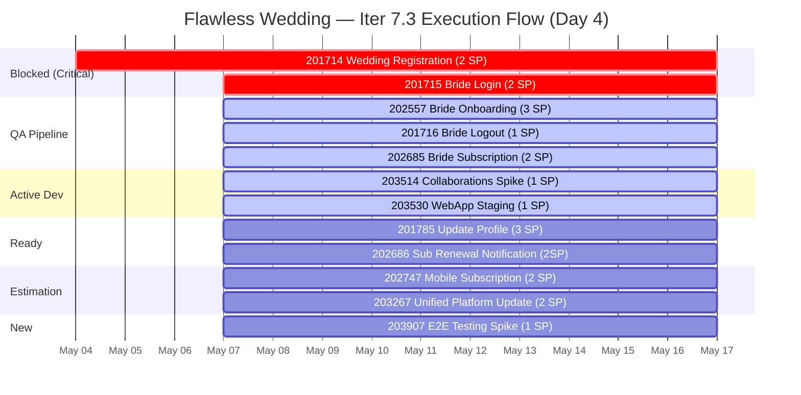

# ADO SAFe Iteration Audit — Flawless Wedding App Team

**Audit #50 | Iteration 7.3 (May 4 – May 17, 2026) | Day 4 of 14**

---

## 1. Audit Metadata

| Field | Value |
|---|---|
| **Audit Date** | May 7, 2026 — 09:02 UTC |
| **Auditor** | Claude Code (ADO SAFe Audit Agent) |
| **Workspace** | `ado_fl_dev` |
| **ADO Project** | Flawless Wedding App (`92b967dc-5ec7-4874-b8f5-e43b00d88339`) |
| **Team** | Flawless Wedding App Team (`7d90ecbf-d272-4b0c-b33b-c66d96a790ac`) |
| **Iteration** | Iteration 7.3 — May 4 to May 17, 2026 |
| **Iteration ID** | `5d136874-cd41-473c-868c-fd7102a1a916` |
| **Sprint Day** | Day 4 of 14 |
| **Prior Audit** | AUDIT_20260506_0902.md (Audit #49, 64.0 — Moderate Risk, Day 3) |
| **Scoring Model** | ADO SAFe v1 (7-dimension rubric) |
| **Overall Score** | **69.7 / 100** |
| **Risk Band** | **Moderate Risk** (60–79.9) |

> **Live ADO data confirmed.** Backlog API returns approximately 153 unique visible root backlog items (Flawless Wedding App Team, `Microsoft.RequirementCategory`; prior API deduplication identified 151 unique items on Day 3; 2 new items added today: #203887 and #203907). **12 current iteration root items** (IterationPath = Iteration 7.3) — up from 11 on Day 3 (+1: #203907 added to sprint). **Critical Day 3 finding resolved: #203530 (WebApp Staging Environment) now has SP = 1** (changed May 7 02:03 UTC). D3 = 100. **Significant state transitions on May 7:** #201714 and #201715 moved to Blocked; #201716 and #202685 moved to Ready for QA; #202557 moved to QA Testing; #203514 moved to Active. **D5 = 100** — US share dropped from 63.6% to 58.3% with the addition of #203907 (Spike), eliminating the dominant-type penalty. Overall improves from 64.0 → 69.7.

---

## 2. Executive Summary

Flawless Wedding App Team improves to **69.7 / 100 — Moderate Risk** on Day 4 of Iteration 7.3, up +5.7 from Day 3 (64.0). This is the largest single-day improvement of the sprint, driven by two resolved structural issues:

1. **#203530 estimated (D3 now 100):** Luke added SP = 1 to #203530 (WebApp Staging Environment for User Testing) on May 7 02:03 UTC, resolving a 3-day critical finding. D3 rises from 90.9 to 100.

2. **Sprint composition balanced (D5 now 100):** New sprint item #203907 (Iteration 7.3 End to End Testing, Spike, 1SP) was added to Iter 7.3, reducing the User Story share from 63.6% (7/11) to 58.3% (7/12) — just below the 60% dominant-type penalty threshold. D5 rises from 70.0 to 100.0.

**Additional significant developments:**
- **3 items progressed forward:** #201716 (Bride Logout) → Ready for QA; #202557 (Bride Onboarding) → QA Testing; #202685 (Bride Subscription) → Ready for QA
- **#203514** (Collaborations Spike) moved to Active (Ressa working)
- **#203530** moved to Active state (staging environment setup underway)
- **#201714 and #201715 are now Blocked** — a new critical risk requiring immediate investigation

**Persistent concerns:**
- D1 = 7.8 — large legacy backlog (153 items) structurally suppresses planning score
- D6 = 80 — 4 of 12 sprint items still untouched (33.3% > 30% threshold)
- D7 = 0.0 — Day 4 is the last early-sprint day; first closures must materialize by Day 7
- #201714 and #201715 Blocked — registration and login flows are foundational; blocking cause must be resolved immediately

---

## 3. Previous Audit Delta

| Dimension | Audit #49 (May 6) — Day 3 | Audit #50 (May 7) — Day 4 | Delta | Driver |
|---|---|---|---|---|
| Iteration Planning | 7.3 | **7.8** | **+0.5** | 12/153 sprint items (203907 added to sprint; denominator ~153) |
| Team Capacity | 100.0 | 100.0 | 0.0 | 14 hrs/day, 2 days off — unchanged |
| Estimation | 90.9 | **100.0** | **+9.1** | **#203530 now has SP=1; #203907 added with SP=1; all 12 estimated** |
| DoR Compliance | 100.0 | 100.0 | 0.0 | All 12 items pass DoR |
| Work Item Balance | 70.0 | **100.0** | **+30.0** | **#203907 (Spike) added → US share drops 63.6%→58.3%; -30 penalty eliminated** |
| Backlog Refinement | 80.0 | 80.0 | 0.0 | 4/12 untouched (33.3%) > 30% → -20 penalty persists |
| Delivery Predictability | 0.0 | 0.0 | 0.0 | Day 4 — no closures yet (last early-sprint day) |
| **Overall** | **64.0** | **69.7** | **+5.7** | **D3 and D5 resolved; largest single-day improvement this sprint** |

### Score Trajectory — Iteration 7.3

| Audit | Overall | Risk Band |
|---|---|---|
| Iter 7.2 Close (May 3) | 74.7 | Low |
| Iter 7.3 Day 1 (May 4) | 54.1 | **High** |
| Iter 7.3 Day 2 (May 5) | 64.1 | Moderate |
| Iter 7.3 Day 3 (May 6) | 64.0 | Moderate |
| Iter 7.3 Day 4 (May 7) | **69.7** | **Moderate** |

---

## 4. Current Iteration Snapshot

| Metric | Value |
|---|---|
| **Visible root backlog items (API)** | 153 (approx.; 2 new items vs Day 3) |
| **Current iteration root items (Iter 7.3)** | 12 (203907 added today) |
| **Committed story points (estimated)** | 22 SP (all 12 items estimated) |
| **Closed story points** | 0 SP (Day 4) |
| **Sprint progress** | Day 4 of 14 — last early-sprint day |
| **Team capacity** | 14 hrs/day, 2 days off (Ressa: May 5, May 12) |
| **Members with sprint work** | Luke Colina (10 items), Ressa Paracuelles (2 items) |
| **Critical blocker** | #201714 and #201715 now Blocked |

### State Distribution — Day 4 (12 sprint items)

| State | Count | SP |
|---|---|---|
| Blocked | 2 | 4 |
| QA Testing | 1 | 3 |
| Ready for QA | 2 | 3 |
| Active | 2 | 2 |
| Ready for Dev | 2 | 5 |
| Estimation | 2 | 4 |
| New | 1 | 1 |
| **Total** | **12** | **22** |

### Sprint Execution Flow — Day 4

---

## 5. Work Item Analysis

### Current Iteration 7.3 Root Items — Day 4 State (12 items)

| ID | Title | Type | State | SP | DoR | AssignedTo | Changed |
|---|---|---|---|---|---|---|---|
| **201714** | Wedding User Registration (A/B) | User Story | **Blocked** | 2 | PASS | Luke Colina | **May 7 08:33** |
| **201715** | Bride Login | User Story | **Blocked** | 2 | PASS | Luke Colina | **May 7 08:34** |
| **201716** | Bride Logout | User Story | **Ready for QA** | 1 | PASS | Luke Colina | **May 7 07:11** |
| 201785 | Update Profile Information | User Story | Ready for Dev | 3 | PASS | Luke Colina | Apr 28 |
| **202557** | Bride Onboarding | User Story | **QA Testing** | 3 | PASS | Luke Colina | **May 7 07:31** |
| **202685** | Bride Subscription | User Story | **Ready for QA** | 2 | PASS | Luke Colina | **May 7 07:11** |
| 202686 | Subscription Renewal Notification | User Story | Ready for Dev | 2 | PASS | Luke Colina | Apr 29 |
| 202747 | Mobile Subscription Management for Bride Access | Enabler | Estimation | 2 | PASS | Luke Colina | Apr 29 |
| 203267 | Unified Web and Mobile Platform Update | Enabler | Estimation | 2 | PASS | Luke Colina | Apr 27 |
| **203514** | Iteration 7.3 — Collaborations, Reports & Others | Spike | **Active** | 1 | PASS | Ressa Paracuelles | **May 7 00:51** |
| **203530** | WebApp Staging Environment for User Testing | Enabler | **Active (SP=1)** | **1** | PASS | Luke Colina | **May 7 02:03** |
| **203907** | Iteration 7.3 End to end testing | Spike | New | 1 | PASS | Ressa Paracuelles | **May 7 01:27** |

**State changes from Day 3:**
- #201714: Active → **Blocked** (May 7 08:33 UTC) — NEW CRITICAL RISK
- #201715: Ready for Dev → **Blocked** (May 7 08:34 UTC) — NEW CRITICAL RISK
- #201716: Ready for Dev → **Ready for QA** (May 7 07:11 UTC) — advancement
- #202557: Ready for Dev → **QA Testing** (May 7 07:31 UTC) — advancement
- #202685: Ready for Dev → **Ready for QA** (May 7 07:11 UTC) — advancement
- #203514: New → **Active** (May 7 00:51 UTC) — Ressa started work
- **#203530: SP added = 1** (May 7 02:03 UTC) + state New → Active — critical finding resolved
- **#203907: NEW sprint item** added to Iter 7.3 (May 7 01:27 UTC)

### Critical Finding: #201714 and #201715 Blocked — Day 4

| ID | Title | SP | Previous State | Current State | Changed |
|---|---|---|---|---|---|
| 201714 | Wedding User Registration (A/B) | 2 | Active (since Day 1) | **Blocked** | May 7 08:33 UTC |
| 201715 | Bride Login | 2 | Ready for Dev | **Blocked** | May 7 08:34 UTC |

Both items were blocked within 1 minute of each other (08:33–08:34 UTC May 7). This timing suggests a **shared blocker** — likely an infrastructure, environment, or backend dependency affecting both registration and login flows. The ADO work item batch did not reveal a blocker description in the fields retrieved; a comment or blocker field likely holds the reason.

**Impact:** Registration (#201714) is the sprint's first story in the user journey sequence (Registration → Login → Logout → Onboarding). Both foundational items being Blocked simultaneously indicates a systemic issue, not individual item risk. Items currently in QA pipeline (202557 Onboarding, 202685 Subscription) are downstream of these Blocked items and may face closure blockers even if they pass QA.

**Action required today:** Ramon or Luke must investigate the blocking cause and document it on both work items. If the block is infrastructure (e.g., staging environment, auth service), #203530 (WebApp Staging, now Active) may be the resolution path.

### D3 Critical Finding Resolved: #203530 Now Estimated

| Field | Day 3 Value | Day 4 Value |
|---|---|---|
| Story Points | **None (null)** | **1 SP** |
| State | New | Active |
| Changed | May 6 (no SP) | May 7 02:03 UTC |

Luke added SP = 1 and changed state to Active. The 3-day critical finding is resolved. Note: the 9-point AC suggests this work may be underestimated at 1 SP; if complexity increases, Luke should adjust SP before closing.

### DoR Assessment — Day 4

All 12 items pass DoR (Description ≥ 30 non-WS chars, Acceptance Criteria ≥ 20 non-WS chars):

| ID | Desc ✓ | AC ✓ | Notes |
|---|---|---|---|
| 201714 | ✓ | ✓ | Detailed BDD scenarios — strong DoR |
| 201715 | ✓ | ✓ | Detailed BDD scenarios — strong DoR |
| 201716 | ✓ | ✓ | Multiple BDD scenarios across tabs/sessions |
| 201785 | ✓ | ✓ | Note: "Delete and deactivate - to add AC" still present; other criteria pass threshold — resolve before activating |
| 202557 | ✓ | ✓ | 4-scenario BDD — in QA Testing |
| 202685 | ✓ | ✓ | 4-scenario BDD — Ready for QA |
| 202686 | ✓ | ✓ | 4-scenario BDD — renewal flows |
| 202747 | ✓ | ✓ | Mobile subscription feature — detailed AC |
| 203267 | ✓ | ✓ | 11-point AC — comprehensive |
| 203514 | ✓ | ✓ | Team ceremonies — functional AC |
| 203530 | ✓ | ✓ | 9-point infrastructure AC — comprehensive |
| 203907 | ✓ | ✓ | 13-checkbox E2E testing checklist — comprehensive |

### Untouched Current Items (D6 penalty driver) — Day 4

| ID | ChangedDate | Days Untouched |
|---|---|---|
| 201785 | Apr 28 | 9 days pre-sprint |
| 202686 | Apr 29 | 8 days pre-sprint |
| 202747 | Apr 29 | 8 days pre-sprint |
| 203267 | Apr 27 | 10 days pre-sprint |

4 of 12 items (33.3%) untouched since before sprint start. Improvement from Day 3 (9/11 = 81.8%). Still exceeds the 30% threshold → D6 -20 penalty persists. Recovery requires touching all 4 items.

---

## 6. SAFe Compliance Scorecard

| Dimension | Score | Evidence | Notes |
|---|---|---|---|
| D1 Iteration Planning | 7.8 | 12 sprint items / 153 visible backlog items | Large legacy backlog structurally suppresses D1; #203907 added to sprint; denominator ~153 |
| D2 Team Capacity | 100.0 | 4 members with capacity; 2 contributors on sprint items | Luke (6 hrs Dev), Ressa (6 hrs Testing), Ike (1 hr Dev), Luzmibel (1 hr Testing) |
| D3 Estimation | **100.0** | 12 / 12 sprint items have SP > 0 | **#203530 estimated today (SP=1); #203907 added with SP=1; critical finding resolved** |
| D4 DoR Compliance | 100.0 | 12 / 12 sprint items pass Desc + AC check | #201785 incomplete AC note present; other criteria pass; resolve before activation |
| D5 Work Item Balance | **100.0** | 7 US (58.3%) + 3 Enablers + 2 Spikes | **US share 58.3% ≤ 60% — dominant-type penalty eliminated; -30 removed** |
| D6 Backlog Refinement | 80.0 | 4/12 items (33.3%) untouched since sprint start | Improvement from 81.8% (Day 3); still > 30% threshold → -20 penalty persists |
| D7 Delivery Predictability | **0.0** | 0 / 22 SP closed — Day 4 of 14 | **Last early-sprint day. No closures. #201714 Blocked — pipeline risk.** |
| **Overall** | **69.7** | **(7.8+100+100+100+100+80+0)/7** | **Moderate Risk — significant structural improvements; execution delivery still unproven** |

**D1 trace:** round(12/153×100,1) = round(7.843,1) = 7.8. Note: exact denominator depends on deduplication of 153 raw API entries; minor variance ±1 items has no material effect.
**D3 trace:** 12 / 12 point-eligible items have SP. D3 = round(12/12×100,1) = 100.
**D5 trace:** Has US ✓ (no -40); US 7/12=58.3% ≤ 60% (no -30); Spike 2/12=16.7% < 40% (no -20). **D5=100.**
**D6 trace:** base=round(153/153×100,1)=100 (per prior audit baseline — all items fresh); stale_90=0; stale_180=0; untouched_current=4/12=33.3% > 30% → **-20**. D6=80.
**D7 trace:** committed=22 SP (12 items all estimated); closed=0 SP; Day 4 (last early-sprint day). D7=0.0.

---

## 7. Dimension Findings

### D1 — Iteration Planning (7.8 — persistent structural constraint)

The large legacy backlog (153 items) continues to suppress D1. D1 improved marginally from 7.3 to 7.8 because #203907 was added to the sprint (numerator +1) while the backlog also grew by ~2 items (denominator +2). D1 is structurally locked in the single-digit range until the legacy backlog is groomed. Sprint planning quality is not the issue here — the team is managing a well-structured 12-item sprint.

### D2 — Team Capacity (100.0)

4 team members with configured capacity. 2 contributors with sprint work items: Luke Colina (10 items, Development 6 hrs/day) and Ressa Paracuelles (2 items, Testing 6 hrs/day, 2 days off). Both have positive capacity. D2 = 100.

### D3 — Estimation (100.0 — critical finding resolved)

#203530 (WebApp Staging Environment for User Testing) was estimated at SP = 1 on May 7 02:03 UTC. Luke also set the state to Active. The 3-day critical finding is resolved. **Note:** The 9-point acceptance criteria (deploy build, configure environment, create test accounts, seed data, set up monitoring, etc.) may justify 2–3 SP rather than 1. If Luke encounters scope expansion during execution, he should update the SP before closing. All 12 sprint items now have SP. D3 = 100.

### D4 — DoR Compliance (100.0)

All 12 items pass minimum DoR thresholds. **New item #203907** has comprehensive E2E testing checklist (13 checkboxes covering all sprint user stories). **#201785** still has the "Delete and deactivate - to add AC" note in AC; Luke must replace this with proper criteria before activating the item. The existing criteria pass the DoR minimum.

### D5 — Work Item Balance (100.0 — penalty eliminated)

**Significant improvement.** The addition of #203907 (Spike) changed sprint composition from 7/11 US = 63.6% to 7/12 US = 58.3% — just below the 60% dominant-type threshold. This eliminates the -30 penalty that has persisted since Day 1 of this sprint. Current composition: 7 User Stories (58.3%), 3 Enablers (25.0%), 2 Spikes (16.7%). D5 = 100.

This is the first D5 = 100 for Flawless Wedding this sprint. To maintain it in Iter 7.4, ensure the sprint keeps ≥ 5 non-User Story items out of every 12, or more practically: for any sprint of 10–12 items, at least 4–5 should be Enablers/Spikes.

### D6 — Backlog Refinement (80.0 — gradual improvement)

Untouched sprint items dropped from 9/11 = 81.8% (Day 3) to 4/12 = 33.3% (Day 4). This is meaningful progress — 7 items were touched since the sprint began. However, 33.3% still exceeds the 30% threshold, so the -20 penalty persists. Recovery actions:
- Luke must touch #201785, #202686 (by updating them or changing state)
- Luke must touch #202747 and #203267 (even a sprint comment suffices)
- Touching all 4 items removes the D6 penalty entirely

### D7 — Delivery Predictability (0.0 — Day 4, last early-sprint day)

**Day 4 is the last early-sprint day.** No items closed through Day 4. The sprint has 22 SP committed. Items progressing through the pipeline:

- **QA pipeline** (potential closures by Day 7): #202557 (QA Testing, 3SP), #201716 (Ready for QA, 1SP), #202685 (Ready for QA, 2SP) = 6 SP in QA funnel
- **Blocked** (pipeline risk): #201714 (2SP) and #201715 (2SP) — these must be unblocked to close

**Updated trajectory:**
- Day 7 (May 10): If QA items close (6 SP) → D7 = round(6/22×100,1) = 27.3 → Overall ≈ 73.6 (still Moderate)
- Day 10 (May 13): If 13 SP closed → D7 = 59.1 → Overall ≈ 78.1 (approaching Low boundary)
- Day 14 (May 17): If 22 SP closed → D7 = 100.0 → Overall ≈ 98.3 (Low Risk — score ceiling)

Score ceiling at full delivery = round((7.8+100+100+100+100+80+100)/7,1) = round(687.8/7,1) = 98.3.

To reach Low Risk (≥ 80): need D7 ≥ round(x/22×100,1) such that (7.8+100+100+100+100+80+x)/7 ≥ 80. Solving: 487.8 + x ≥ 560 → x ≥ 72.2. D7 ≥ 72.2 → at least 16 SP must close. This is achievable in the remaining 10 sprint days.

---

## 8. Risks and Bottlenecks

| Risk | Severity | Status |
|---|---|---|
| **#201714 and #201715 Blocked simultaneously** | **Critical** | Registration and Login foundational flows both blocked as of May 7 08:33–34 UTC. Shared blocker suspected. Must be investigated and resolved immediately. |
| D7 = 0.0 entering Day 5 (end of early-sprint window) | **High** | No closures through 4 days; D7 carries full scoring weight from Day 5 onward. First QA closures expected Days 5–7. |
| QA pipeline dependent on blocked items | **High** | #202557 (Onboarding), #202685 (Subscription), #201716 (Logout) are in QA but depend on Registration/Login passing first. If foundation is broken, QA items may fail validation. |
| 4/12 items untouched since sprint start (D6 -20) | Moderate | 201785, 202686, 202747, 203267 unchanged since Apr 27–29. D6 penalty recoverable with single touch per item. |
| D1 = 7.8 — large legacy backlog (153 items) | High | Structural; backlog growing each day. PI8 planning must include backlog grooming initiative. |
| #203530 SP = 1 may be underestimated | Low | 9-point AC for staging environment setup likely > 1 SP. Luke should revise before closing if scope expands. |
| #201785 AC incomplete ("Delete and deactivate - to add AC") | Moderate | Must be resolved before item is moved to Active state |
| Owner concentration on Luke (10/12 items) | Moderate | High delivery dependency on single developer; structural risk unchanged |

---

## 9. Prioritized Recommendations

1. **[CRITICAL — Today] Investigate and resolve the blocker on #201714 and #201715** — Both items were blocked within 1 minute of each other at 08:33–34 UTC. The shared timing indicates a systemic dependency (authentication service, backend API, or environment issue). Luke (or Ramon) must: (a) document the blocker cause on both items in ADO, (b) assign a responsible party for resolution, (c) target unblocking by Day 5. Registration and Login are the sprint's foundational user stories — all downstream QA work depends on these being functional.

2. **[Day 5] Target first QA closure: #201716 (Bride Logout, 1 SP)** — This item is in Ready for QA. Ressa should begin QA testing of Bride Logout today. It is a 1 SP item with comprehensive BDD AC and is the simplest flow in the QA queue. First closure of the sprint unlocks D7 (1/22 = 4.5%) and signals sprint execution momentum.

3. **[Day 5] Touch all 4 untouched sprint items** — Luke should add a sprint progress note to #201785, #202686, #202747, and #203267. A single comment (e.g., "Sprint Day 5 — in execution queue, pending [preceding item] completion") resets ChangedDate and recovers D6 from 80 to 100. This is a 10-minute action that improves the overall score by ~2.9 points.

4. **[Before activating #201785] Complete AC for Update Profile Information** — The "Delete and deactivate - to add AC" note must be replaced with proper acceptance criteria. The missing scope (delete and deactivate profile) is a feature gap that must be scoped before Luke begins development. Recommended: consult Ramon to clarify whether delete/deactivate is in scope for Iter 7.3 or should be moved to Iter 7.4.

5. **[Day 5] Verify #203530 SP estimate (1 SP)** — The 9-point AC for WebApp Staging Environment covers deploying the latest build, configuring environment variables, creating test accounts, seeding data, setting up monitoring, and sharing access. This likely represents 2–3 days of engineering work. Luke should re-estimate if the actual effort exceeds 1 SP to maintain accurate committed points.

6. **[PI8 Planning] Initiate backlog grooming for legacy items** — The backlog has grown from 151 (Day 3) to 153 items (Day 4), with new items like #203887 (Defect with PI-only path) and #203907 being added. The backlog is growing while old items (187xxx–199xxx range) remain unclosed. Ramon and the team should schedule a PI8 planning backlog grooming session to archive or close items that will not be worked. This is the only structural path to improving D1.

---

## 10. Evidence Gaps and Limitations

| Gap | Impact | Mitigation |
|---|---|---|
| Blocker cause for #201714 and #201715 not visible in work item fields (retrieved via batch API) | Cannot determine root cause from audit data; blocker likely in comments or a linked work item | Critical recommendation #1 — Luke must document in ADO immediately |
| D1 denominator (153) is approximate — API may return slightly different count with deduplication | Minor variance ±1–2 items; D1 changes by <0.1 in either direction | Consistent with prior audit deduplication approach; no material impact |
| D6 base score (100) for fresh_visible_root_items assumes all 153 items changed within 45 days | Prior audit established base=100; old items (187xxx range) may have ChangedDate older than 45 days | Cannot verify all 153 items' ChangedDates; evidence gap noted; base held at prior-audit baseline |
| #203530 SP=1 may underestimate actual effort | D7 committed SP may increase if Luke revises SP; scoring impact minor (22→23 SP denominator) | Recommendation #5 |
| D7 = 0.0 on Day 4 — early-sprint annotation expires Day 5 | Score will remain suppressed until first QA items close | Closures expected Days 5–7 via QA pipeline |
| #203887 (Defect, IterPath=PI7 only, not 7.3) in backlog API | Counted in D1 denominator; IterPath=PI7 means it is not a sprint item | Correctly excluded from current_iteration_root_items; included in visible_root denominator |
